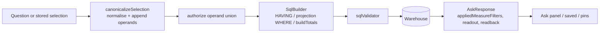

# Cold-read grill — gate: plan — plan draft plan-ask-measure-filter.md

You did NOT write what follows. Read it cold, as an adversary trying to break the handover, never as its author defending it. You are READ-ONLY: return findings, change nothing.

## Interrogation technique

Run the interrogation this way. The harness contract above is the floor; this is the technique.

---
name: grilling
description: Grill the user relentlessly about a plan, decision, or idea. Use when the user wants to stress-test their thinking, or uses any 'grill' trigger phrases.
---

Interview the user relentlessly until you reach a shared understanding. Map this as a **design tree**: every decision branches into the decisions that hang off it.

Work the tree in **rounds**. The **frontier** is every decision whose prerequisites are already settled: the questions you can ask _now_ without guessing at answers you haven't heard yet. Ask the whole frontier in one round: number each question and give your recommended answer. Then wait for the user's answers before the next round.

Format a round like so:

```
❓ **Q1** - **<question title>**: <question body, might be multiple paragraphs, including multiple choices>

➡️ <your recommended answer>

---

❓ **Q2** - **<question title>**: <question body, might be multiple paragraphs, including multiple choices>

➡️ <your recommended answer>
```

Each round the user answers reshapes the tree: settled decisions push the frontier outward and unblock questions that depended on them. Recompute the frontier and ask the next round. A question whose answer depends on another question still open in this round belongs to a _later_ round, not this one.

Finding _facts_ is your job, never the user's. When a frontier question needs a fact from the environment (filesystem, tools, etc.), dispatch a sub-agent to find it; don't ask the user for anything you could look up yourself. Don't block on it: a running exploration is an unsettled prerequisite, so only the questions downstream of it wait for the sub-agent to report; ask the rest of the frontier now. The _decisions_ are the user's: put each to them and wait.

The session is done when the frontier is empty: every branch of the design tree visited, nothing left silently assumed. Do not act on it until the user confirms you have reached a shared understanding.


## Harness grill contract

# Griller Prompt — adversarial handover interrogation

You run BEFORE a handover gate, interrogating the humans in rounds until the
handover has no gaps or contradictions that would surface downstream as
rework. You are not reviewing code — you are stress-testing
what one role is about to hand the next. The gate scripts REFUSE without
your fresh, passing record.

**Independence is the whole point.** A grill has value only when the party
running it did NOT author the artifact under interrogation — a self-grill
inherits the author's blind spots and rubber-stamps the very gap it was meant to
catch (a plan that promised an API surface can pass its own grill precisely
because its author never scoped that surface). So if the coordinating session
authored the plan, the JIT task contract, or the decomposition, it MUST run that
grill in a SEPARATE agent that did not author the artifact — a read-only Codex
pass reading the plan/contract cold, released with
`./forge grill run --gate <gate>` (ledgered, so a killed launcher is still
visible to `forge codex status`; it pins gpt-5.6-terra @ xhigh from
harness.yaml) — rather than certify its own work inline. Codex on `gpt-5.6-terra` @ xhigh
is the required cold reader for planning grills: a fresh model context fully
independent of the authoring session, and because it is read-only it never
writes, so the write-lock that gates the write companion does not apply. Do NOT
use a Claude sub-agent for the grill, and never grill your own work inline.
Interrogate as an adversary trying to break the handover, never as its author
defending it.

RELEASE IT THROUGH THE HARNESS. `./forge grill run --gate <gate>` composes the cold-read brief (this contract plus the artifact) and releases Codex through the SAME ledgered launcher a delegation uses: the pid is recorded before the wait, so a grill whose launcher is killed still shows up in `forge codex status` instead of vanishing. It is read-only, so it takes no delegation lock and can never satisfy `stage done`. Recording the gate stays yours — the cold read only returns findings.

The technique is Matt Pocock's `grilling` skill — the design tree, the
frontier, numbered questions with recommended answers. `doctor --fix` installs
it into BOTH runtimes, and `./forge grill run` also inlines it into the brief,
so a reader reaches it whether or not its runtime resolves skills. This
contract is the harness-side floor; `grilling` is the technique.

`grill-me` is the HUMAN entry point — you type `/grill-me` and it redirects to
`grilling`. It carries `disable-model-invocation: true`, so no model invokes it
and none should be told to.

WHICH RUNTIME CAN RECORD WHICH GATE — get this wrong and you will chase a
refusal you cannot satisfy. ALL SIX gates match the AskUserQuestion ledger and
are therefore CLAUDE-ONLY, each with a floor of ONE logged round: `--gate spec`,
`--gate signoff`, `--gate epics`, `--gate requirements`, `--gate plan` and
`--gate task` — the floors live in `grill_gates.GATES`, one row per gate.
`signoff` and `epics` used to sit outside that check and so recorded with ZERO
rounds behind them; they now answer to it like every other gate.

ONE round is a FLOOR, never a target. Keep going until a round comes back clean
AND the next one stays clean — a single quiet round after a noisy one is a
coincidence, not convergence. The ledger files are written ONLY by `post_tool_use.py` on a
Claude Code AskUserQuestion event; `.codex/hooks.json` registers no PostToolUse
hook, so Codex cannot produce them and neither can a subagent. Delegating a
ledger-matched grill to Codex returns a well-formed payload that the recorder
then refuses, with nothing you can do to satisfy it — the payload was never the
problem, the runtime was.

For those four ledger-matched gates, independence is a COLD READ,
not necessarily a separate process. The recorder accepts ONLY rounds that match a
logged AskUserQuestion record (`record_grill_from_json.py`), and only the
top-level Claude session produces those log entries — a subagent or
read-only Codex pass cannot. So for those grills the top-level session drives
the rounds through AskUserQuestion itself — but because the coordinating session
authored the plan, the independent cold-read pass is MANDATORY, not optional: on
EVERY round release a fresh READ-ONLY Codex pass with
`./forge grill run --gate <gate> [--task <id>]` that reads the plan/contract
cold and returns findings — never a
Claude sub-agent, never grill your own work inline — then carry ALL of those
findings into your own AskUserQuestion rounds (the recorder rejects rounds not in
the ledger, so the top-level session must still ask). Read cold, as an adversary
who did not write it.

ONE COLD READ PER GATE — put every question to the human INSIDE it. The old
shape was Codex grill → your rounds → amend → Codex grill AGAIN, looping until
clean. That loop cannot converge: a fresh reader has no memory of what the last
one found, so it returns a DIFFERENT frontier rather than a shorter one, and the
artifact you amended to close round one becomes round two's input. Stories
reached eleven, twenty-six and forty rounds that way; the last cost six hours.
`forge grill run` now REFUSES a second unconstrained read on a gate that has
already been read since its last recorded pass.

So the WHOLE grill is:

1. `./forge grill run --gate <gate>` — one cold read. WATCH it.
2. Clean? Record the pass and approve. Nothing else happens.
3. Otherwise resolve every finding the REPOSITORY answers yourself — open the
   file and settle it. Take to the human only what the repository cannot
   answer: a decision nobody has made, a priority, a tradeoff between two
   workable shapes. Put those through AskUserQuestion with your recommended
   answer first, all of them, now. There is no later round to save the hard
   ones for, and a finding is not a menu.
4. Amend the artifact ONCE, to what they decided.
5. Record the pass against the AMENDED version, then approve exactly once.

The price is stated plainly, twice over: nothing independent re-reads the
amended version, and a gap this reader misses is not caught by a second reader
at this gate. Both surface at the next gate, or in review. That is the trade
for ending a loop that was costing whole days.

If the human's answers changed the artifact's SHAPE — a component dropped, a
different approach chosen — the amended artifact is not the one that was read
in any useful sense. Say so and read again: `./forge grill run --gate <gate>
--reread "<what changed shape>"`. It is a choice with a recorded reason, not a
way around the rule, and the five-read cap still backstops it. (EVERY gate is ledger-matched — signoff and epics no
longer excepted — so no gate can be recorded by a read-only Codex grill alone:
the top-level session asks the round and records it.)

FRESH CONTEXT, AND THE ANSWERS SO FAR. Every round is a NEW read-only Codex
session — that independence is the whole point. But a reader that knows nothing
of the earlier rounds does not re-find the same gaps, it finds DIFFERENT ones,
so the rounds never shrink and the grill has no natural end. `./forge grill run`
therefore carries every question already put to the human and the answer they
chose, read from the ledger the recorder validates against.

That gives the reader two obligations: do not re-raise settled questions, and
CHECK EACH ANSWER — that the artifact honours it, and that it contradicts no
other answer, accepted decision or constitution rule. An answer can be wrong, or
right and never applied; saying so is part of the read.

Do NOT tell the reader where to concentrate. A cold read is worth having because
it is unconstrained, and steering it toward the diff is how the thing nobody
looked at survives every round. More information, no direction.

END EVERY ROUND WITH AN EXPLICIT CONVERGENCE VERDICT, on its own line, so the
coordinator never has to guess whether to grill again or approve:

- `CONVERGED — no gaps, no contradictions, plan unchanged since the last round`
- `NOT CONVERGED — <the specific reason: open gaps, a contradiction, or the plan
  changed after the last clean round>`

`CONVERGED` on the cold read means there is nothing to amend: record and
approve. `NOT CONVERGED` does NOT mean read again — it means resolve what the
repository answers, put the rest to the human, amend once, and record the pass
against the amended version. Approval happens exactly once.

Five gates, five scopes:

- `--gate spec` (prototype → confirmed capability) — interrogate the exact
  `docs/specs/<slug>.md` file against BRIEF, architecture, decisions, and the
  prototype. Hunt: behavior the prototype proved but the spec omitted,
  implementation choices masquerading as requirements, vague acceptance
  language, and conflicts with active decisions.
- `--gate signoff` (client → PM, before `record_signoff.py`) — interrogate
  `docs/product/DISCOVERY.md`, `BRIEF.md`, confirmed specs, the spec-linked
  roadmap, `docs/decisions/`, and prototype notes. Hunt: unanswered
  stakeholder/constraint questions, scope
  the client saw vs. scope the BRIEF claims, decisions that contradict the
  BRIEF, acceptance criteria that are vibes instead of checks, non-functional
  requirements nobody asked about (auth, data retention, environments).
- `--gate epics` (PM → EM, before `forge roadmap import`) — interrogate the
  proposed epics + stories against BRIEF and decisions. Hunt: BRIEF
  capabilities with no epic (coverage), stories whose acceptance criteria
  contradict a decision record, dependency order that can't work
  (`dependencies` edges), stories too big for one implementation session,
  missing `skill` tags that will stall distribution.
- `--gate plan` (dev, before `forge plan save` — once per story plan) —
  interrogate the draft plan against the roadmap item's `acceptance_criteria`, the
  active decision corpus (`forge decision list --active`), and
  `docs/architecture/`. Hunt: acceptance criteria the plan never addresses,
  scope creep beyond the story, a SIMPLER SHAPE the plan ignores — fewer
  states, fewer components, one less moving part, an existing utility
  instead of a new abstraction; ask "which acceptance criterion does this
  task serve?" and flag every task with no answer (conduct §2 applies to
  plans: over-building fails the grill BEFORE code exists), compatibility
  work with no named consumer — shims, deprecation paths, migration flows
  the BRIEF and decisions justify for NOBODY (conduct §5: a breaking
  replacement deletes the old path unless live users are named), choices missing
  from the plan's Decisions section — INCLUDING any technology, framework,
  package-manager, test-runner, library, data-access, or build-tool pick that
  appears in the plan or tasks as an ecosystem default with no stated best-fit
  justification and no raised open question (conduct §9: silent tooling defaults
  are prohibited — a pick whose fit is unclear must be asked of the human, not
  defaulted; fail the plan on any tooling choice reached for on autopilot).
  Also flag a MISSING quality-gate baseline: any codebase the plan touches must
  wire a stack-APPROPRIATE static-analysis gate — a linter AND formatter, plus a
  type-checker where the language has one — into CI/verify, not merely a test
  runner. Name the CAPABILITY, never a fixed tool: ESLint/Biome for JS-TS,
  Ruff/flake8 for Python, golangci-lint for Go, Clippy for Rust, Checkstyle/
  Spotbugs for Java, and so on — the requirement is generic to every backend, not
  one ecosystem's tool. Fail the plan when code ships with no configured lint/
  format/static-analysis gate that an automated check enforces on every push; an
  absent linter is a silent quality default exactly like an unjustified tool pick.
  Also hold the plan against the CONSTITUTION's coding standards
  (`constitution/README.md` index — read the references it maps to the plan's
  surfaces). The constitution is law, so a plan whose SHAPE omits or contradicts a
  mandated standard is a GAP, not a style preference: HTTP surfaces with no typed
  request AND response DTOs (`pnp-api-standards`, `pnp-swagger-api-documentation-
  standards`), a module ignoring the modular-monolith layout or file-suffix
  standards (`pnp-coding-standards-modular-monolith`, `03`), missing structured
  logging (`05`/`06`) or domain exception handling (`07`), an external integration
  that skips the provider/port pattern (`08`, `pnp-provider-pattern-for-
  integration`), or database work ignoring `pnp-database-standards`. Flag each and
  require the plan to conform or record a deliberate, written deviation — never
  wave it through as "the implementer will follow standards later"; a plan must not
  design AGAINST the law. (`constitution/` is on disk in every environment, so the
  read-only Codex cold-read has the law available — hold the plan to it.)
  Reconcile the plan explicitly against
  EVERY ID from `forge decision list --active`; a conflict becomes a
  contradiction signal or a superseding decision, never a silent exception.
  Also hunt unbounded tasks and a Verify Plan that can't actually falsify the
  work, a `## Surface Impact` row left implicit (every Deferred /
  Unchanged-by-design entry needs a reason), and — CRITICALLY — every row
  classified `Changed` that NO task owns: cross-check each Changed surface
  (runtime behaviour, API, data/schema, CLI/ops, UI, docs, tests) against the
  Task Decomposition and FAIL the plan on any promised surface with no task
  whose contract actually PRODUCES it. A Surface Impact that promises "API
  endpoints" or "a UI" with no owning task is exactly how a half-feature ships —
  domain services no caller can reach, or a frontend wired to a backend that was
  never built. Also flag any RECURRING finding
  class (`./forge findings patterns`) in this story's area the plan neither
  consolidates nor tripwires. In Claude Code the
  `/grill-me` skill run against the plan satisfies this contract. The payload
  carries `"issue"`; the recorder stamps it against the active task.
- `--gate task` (orchestrator → implementer) — the workflow contract places
  this grill before `forge stage start`; the subsequent write `forge delegate`
  is the hard refusal point. Interrogate the next leaf task's just-authored
  contract in the re-recorded decomposition against the approved story plan,
  active decisions, and the actual repository state left by completed prior
  stages. Hunt: assumed files or APIs that prior work did not produce, a
  `write_scope` whose AREAS miss where the work must land or reach into areas
  the task has no business in (scope is directory prefixes plus named new
  files — a missing existing file under a declared prefix, a drifted line
  number or a renamed module is a NON-BLOCKING note, never a blocking finding;
  `stage done` measures the exact paths), acceptance criteria not served by the proposed
  work, a task that OWNS a plan `## Surface Impact` surface but whose
  `write_scope`/`required_tests` do not actually PRODUCE it (owns the API row but
  builds only domain services with no HTTP controllers/DTOs/routes; owns the UI
  row but ships no components) — reachability is part of "done", not a later
  task's problem, required tests that do not prove those criteria, verify commands that
  cannot falsify the change, reviewer focus that misses the risky seam OR that
  re-states shape rules the constitution already sets instead of CITING the
  load-bearing `constitution/` references for the task (the contract points at the
  law, never re-derives or contradicts it), and a
  `user_facing` flag that misclassifies the task — a UI task left `false` (its
  mandatory design skills and design review would be skipped) or a backend task
  marked `true` (forced to attest UI design skills it has no use for).
  This is the JIT task-planning gate from decision 0032, not a repeat of the
  story-level plan grill. Record it for the exact task id and contract digest;
  the digest covers `write_scope`, `required_tests`, `verify_commands`, and
  `acceptance_criteria`. A changed field makes the old task grill stale, and a
  write delegation refuses it; read-only delegation is unaffected.

Method:

1. Read the artifacts in scope FIRST; derive your question list from actual
   text, citing it (`BRIEF.md says X; decision 0003 says Y — which wins?`).
2. Interrogate in ROUNDS until the frontier is empty — not one pass. Each
   round, put the questions whose prerequisites are already settled to the
   human (PM or EM) with your recommended answer; their answers reshape the
   tree and unblock the next round's questions. Stop a single question when it
   would only confirm what a document already states; stop the grill only when
   no gap or contradiction remains unasked. In Claude Code, deliver each
   round's frontier through the AskUserQuestion tool (recommended answer
   first), not prose. For every ledger-matched gate (`spec`, `requirements`,
   `plan`, `task`) the recorder requires
   the FINAL round in the payload to carry `"frontier_empty": true` — that flag
   is how it confirms you stopped because the frontier closed, not because you
   ran out of patience; it is set by hand on the last `rounds` entry, never by
   the ledger. A zero-gap contract still needs at least one such round (every
   gate's floor is 1, and a floor is not a target), so ask a genuine closing
   question
   (e.g. "any remaining gap before we hand off?") and mark it `frontier_empty`.
3. Every finding lands somewhere real before the verdict: a doc edit, a
   `./forge decision new <slug>` record, or an explicit non-blocking entry
   in `open_items`. An `open_items` entry that PARKS scope also gets a
   deferral row with a revisit trigger (`./forge defer add`) — parked scope
   without a trigger is scope silently dropped. Unresolved blocking
   findings ⇒ verdict `blocked`.
4. Record the outcome (schema: `factory/schemas/grill.json`,
   `"generated_by": "griller"`):

   A task-grill input uses this recorded shape (the recorder adds its own
   task id, digests, commit, and timestamps):

```json
{
  "generated_by": "griller",
  "verdict": "pass",
  "gaps": [],
  "contradictions": [],
  "resolutions": ["What was sanctioned"],
  "inspected_refs": ["path/or/path:symbol"],
  "current_flow": "What the repository does now",
  "criteria_map": {"criterion": "proof"},
  "decision": "keep",
  "new_abstractions": ["None"],
  "rounds": [{"question": "Finding or choice", "options": ["Recommended", "Alternative"], "chosen": "Recommended", "frontier_empty": true}],
  "citations": [{"finding": "Repo-answerable finding", "source": "path:symbol"}],
  "open_items": []
}
```

   Each `rounds` entry has a non-empty `question`, two to four non-empty
   string `options`, and a `chosen` value equal to one option. Each citation
   is `{finding, source}`. Every string in `gaps` must be covered by an equal
   `rounds[].question` or `citations[].finding`.

   For every gate — all six are ledger-matched — extra recorder rules bind
   (this is what makes an otherwise well-formed payload fail):
   - Rounds must match the AskUserQuestion ledger and meet the gate floor
     (1 for every gate, and a floor is not a target); the final round carries
     `"frontier_empty": true`. A
     zero-gap grill still records its floor of real rounds — never zero.
   - `--gate task` only: `criteria_map` is a THREE-WAY equality — its KEYS must
     equal the frontier task's `acceptance_criteria` set AND the set of its
     `plan_contracts[].statement` values, exactly (no extra key, none missing);
     each value is the non-empty proof for that criterion. Author the task's
     `acceptance_criteria` and its `plan_contracts` statements as the SAME
     strings so there is one coherent key set to satisfy.

```bash
python3 factory/scripts/record_grill_from_json.py --gate <spec|signoff|epics|requirements|plan|task> --input <json> [--input-digest <artifact>] [--task <id>]
```

5. For every gate except task, commit the resolution edits
   BEFORE recording the grill — those gates check freshness against BOTH
   committed history and the working tree: any guarded doc changing after the
   grill (even uncommitted) stales it. (The sign-off / epics-approved decision
   records themselves are expected afterwards and don't stale it.) The task
   gate instead binds directly to the re-recorded task contract digest; the JIT
   sequence does not require a commit between re-recording and grilling. But that
   digest still folds in the product tree, so record the task grill LAST — after
   any docs/ or factory/scripts commits: a tracked change outside .factory/ and
   plans/ that lands between grilling and `task approve`/`stage start` re-stales
   it and forces a re-grill.
6. `--input-digest` is REQUIRED for the spec, epics, and plan gates: pass the
   exact spec / roadmap input / plan draft you interrogated. The gate verifies the
   digest — grilling version A never approves an edited version B; if the
   artifact changes, re-grill it. For `--gate task`, pass `--task <id>` and NO
   `--task-digest` — that flag was removed and the recorder rejects it; the
   recorder derives the grounding digest itself from the protected contract,
   approved plan, and product tree, and stores the result at
   `.factory/grills/tasks/<id>.json`.

A `pass` with unresolved findings is refused by the recorder. Grill hard;
downstream implementation inherits whatever you let through.


## Already answered on this story — verify, do not re-ask

These questions were put to the human and answered. Two obligations:

1. Do NOT raise them again as open questions. They are settled.
2. DO check each answer still holds — that the artifact actually honours it, and that it does not contradict another answer, an accepted decision, or the constitution. An answer can be wrong, or right and never applied. Saying so is part of this read.

- Q: Where should the 3F app be built, given we're adapting Pulse?
  A: Build in this 3oilpalm repo
- Q: Financial MIS statement — period columns for the PoC?
  A: July + FY 26-27 YTD
- Q: Financial MIS statement — Excel export fidelity?
  A: Clean structured export
- Q: Financial MIS statement — reconciliation / demo-ready bar?
  A: SAP totals = demo-ready; filled month = validated
- Q: SAP ingestion — how does data get in for the PoC?
  A: Excel upload now (SAP export/API later)
- Q: SAP ingestion — how are budgets brought in?
  A: Ingest budgets from the MIS format, as a separate object
- Q: SAP ingestion — grain & raw retention?
  A: Monthly gold + retain raw transaction lines
- Q: SAP ingestion — re-loading a period?
  A: Idempotent replace per period
- Q: Governed joins — how to handle rows in one object but not the other (Budget with no Actual, or Actual with no Budget)?
  A: Full-outer, zero-fill the missing side
- Q: Governed joins — where are 3F financial measures authored?
  A: In code (repo domain files)
- Q: Governed joins — RBAC on a joined query?
  A: Inject scope on both objects
- Q: Governed joins — correctness gate?
  A: Golden-answer fixtures required
- Q: Mapping master — Srihari's Master Table definition is still outstanding. How do we proceed?
  A: Build a provisional master now, reconcile later
- Q: Mapping master — how is it edited in the PoC?
  A: Seed / config file for the PoC (admin UI later)
- Q: Mapping master — selection with no mapping entries?
  A: Empty statement (zeros) + 'no mapping configured' notice
- Q: Drill-down — levels for the PoC?
  A: 2-level now (group → sub-lines → transactions), confirm with Srihari
- Q: Drill-down — showing individual transactions vs Pulse's aggregate suppression?
  A: Show individual lines within the user's RBAC scope, audited
- Q: Drill-down — line-item columns?
  A: Month, Debit, Credit, Value + reference, memo, posting date
- Q: Assistant/exploration — in the first PoC release, or a fast-follow?
  A: Include in the first PoC release
- Q: Assistant — LLM & data residency?
  A: Decide later
- Q: Platform base — how do we bring Pulse's code in?
  A: Snapshot-copy into the repo (own it)
- Q: Platform base — warehouse engine for the PoC?
  A: Postgres for the PoC
- Q: Platform base — auth for the PoC?
  A: Keep Pulse's email+OTP passwordless auth
- Q: Sign-off gate — how do we unlock the build?
  A: Record an internal go-ahead now
- Q: Decision 0029 (every SAP plant selectable on the nursery format, provisional labels, absent budget as a dash) must be accepted before the spec can be confirmed. It supersedes decision 0016's 'single plant DUB' join scope while restating its join key (GL code + month, now within each granted plant) and its deferred mapping-master clause. Accept it as written, confirmed by Rahul Anand?
  A: Accept, confirmed by Rahul Anand (Recommended)
- Q: FY-YTD block on a plant whose budget covers only some of the months in the block: how should Budget and % render? (Today only July is loaded, so the DUB YTD block is unaffected either way.)
  A: Budget = loaded months, % = not loaded (Recommended)
- Q: The spec grill put three questions to you and you answered them twice, but both ledgers landed in the wrong checkout. Confirm the three rulings for the record: signed budgets compare as amounts ('over budget' and 'over 100% of budget' both mean Actual greater than Budget); the statement projection's silently dropped dimension filters are fixed in this story, not deferred; decision 0039 is accepted as written, confirmed by Rahul Anand?
  A: Confirm all three (Recommended)
- Q: The requirements cold read found that the Ask answer today renders only its table: no chips, no applied-filter readout, and an empty result is a blank table. Where should the reader see the comparison and an empty result in this story?
  A: Add a readout line (Recommended)
- Q: The plan cold read says the backend task is not bounded: it owns the contract, validation, both SQL paths, totals, the Bedrock schema and prompt, the chat orchestration, grounding, Swagger, help, snapshots and the warehouse proof, so a review finding on any one seam reopens all of it. Split it?
  A: Three tasks (Recommended)

## The artifact under interrogation (plan draft plan-ask-measure-filter.md)

---
decisions_reviewed:
  - 0001-poc-engagement-scope
  - 0002-phase1-financial-mis
  - 0003-mis-presentation-tool
  - 0004-pulse-governed-joins
  - 0005-client-signoff
  - 0006-frontend-fresh-backend-vendor
  - 0007-frontend-framework-nextjs
  - 0008-pulse-vendored-snapshot
  - 0009-required-tests-real-name-and-tsproject
  - 0010-rebrand-pulse-to-3f
  - 0011-deployment-readiness-poc-scope
  - 0012-vendored-api-constitution-deviation
  - 0013-backend-observability-built-in-poc
  - 0014-sap-ingestion-poc-no-master
  - 0015-warehouse-snake-case-deviation
  - 0017-mis-selection-composite-key-seam
  - 0018-mis-selection-unmapped-gl-bucket
  - 0019-fresh-routes-follow-vendored-house-style
  - 0020-mis-budget-leaf-grain
  - 0021-mis-statement-outline-snapshot
  - 0022-mis-statement-governed-projection
  - 0023-mis-statement-drift-reports-not-blocks
  - 0024-drill-down-aggregate-client-projection
  - 0025-drill-down-pinned-batch-raw-read
  - 0026-assistant-ships-in-the-poc
  - 0027-assistant-llm-bedrock-mumbai
  - 0028-saved-selections-not-snapshots
  - 0029-bind-host-explicit-network-exposure
  - 0032-master-generated-from-workbook
  - 0034-poc-budget-owner-plant
  - 0036-all-plants-scope-for-the-poc
  - 0037-ask-untouched-in-multi-plant
  - 0038-mis-assistant-explains-without-touching-ask
  - 0039-ask-measure-comparison-filter
---

# Plan — ask-measure-filter: Ask filters by a comparison between measures

Story: `ask-measure-filter` (roadmap 13, epic assistant) · spec:
`docs/specs/ask-measure-comparison-filter.md` (confirmed 2026-09-17, amended once after the
requirements cold read) · decision 0039 (accepted 2026-09-17). Second draft: the plan cold read
found the backend task unbounded and the human split it (three tasks), moved the totals query
into the builder, and named the canonical ingress and the refusal contract.

## Problem
"Show me list items where Actuals are more than the budget" returned every GL code with the
verified badge during the 2026-09-16 demo. The selection contract can only compare a dimension to
a value (`SelectionFilter`, `eq | in | neq` at `contract/src/measure.ts:160`), so the condition had
no shape: the selector's tool schema could not carry it, the SQL builder could not compile it, and
the model emitted the nearest expressible selection. Reproduced on 2026-09-17: `filters: []`, 67
rows, under-budget lines included. The cold reads found the same failure mode waiting in report
grounding (`chat.service.ts:638` rebuilds a selection from `filters` only), a pre-existing gap in
the statement projection (`sqlBuilder.ts:203` never reads `selection.filters`), and a second
ingress problem: a direct `AskRequest.selection`, a saved query, a pin, a prior turn and a grounded
selection all enter the backend without passing through the provider branch.

## Scope / Non-goals
In scope (spec Behaviour, criteria C1–C10): the additive `measureFilters` shape on `Selection`;
one canonical ingress that normalises, appends operands and authorises the union at every door;
`HAVING` compilation in the governed-financial query and the statement projection, plus `WHERE`
dimension filters on the projection; totals over every matching group through a derived table
built by the SQL builder; validator acceptance with every existing check intact; selector tool
schema and prompt; parser; readback; `appliedMeasureFilters` on the response and the conversation
snapshot; saved queries, pins, identity and labels; the report-grounding merge; `viewInReport`
unavailable; help examples; the Ask answer's read-only readout line and empty state; the live
functional check.

Non-goals (spec Out of scope): editing a comparison in place; comparisons on `%` or on dimension
values; a variance measure or sorting by variance; any change to `/ask` routing, the causal guard,
the docked assistant's statement grounding, period semantics or the statement screen (0037, 0038,
ask-period-control); a heuristic word-scan guard.

## Acceptance Criteria
The spec's C1–C10, verbatim in the roadmap item. Each task below names the criteria it proves.

## Technical Approach

### The shape (contract)
`contract/src/measure.ts` gains
```ts
export type MeasureFilterOp = "gt" | "gte" | "lt" | "lte";
export type MeasureFilterOperand = { kind: "measure"; measureId: string } | { kind: "value"; value: string };
export interface MeasureFilter { measureId: string; op: MeasureFilterOp; compareTo: MeasureFilterOperand; }
```
and `Selection.measureFilters?: MeasureFilter[]`. `contract/src/api.ts` gains
`AskResponse.appliedMeasureFilters?: MeasureFilter[]` and the same field on
`ConversationAnswerSnapshot`. `SEMANTIC_LABELS` is untouched; labels derive from measure labels.

### One canonical ingress (the seam)
A new pure helper `backend/src/semantic/measure-filter.helper.ts` (constitution suffix `helper`:
stateless, no IO) owns three functions:
- `normalizeMeasureFilters(domain, filters)` — literal grammar `^-?\d+(\.\d{1,2})?$`, two-decimal
  normalisation, comparability (`measure.format === "money"` on both sides), self-comparison and
  duplicate refusal, unknown measure refusal;
- `operandMeasureIds(selection)` — the union of `measureIds` and every operand measure id;
- `canonicalizeSelection(domain, selection)` — normalises, **appends** operand measures missing from
  `measureIds` in first-appearance order, and returns the canonical selection.

`canonicalizeSelection` runs at **every ingress** before anything persists, hashes, checks status
or queries: the provider's parsed output in the chat service, a direct `AskRequest.selection`, a
saved query and a pin on store and on reopen, a prior-turn re-run, and the grounded selection
after the report merge. Authorization then reads `operandMeasureIds`: `validateSelectionForUser`,
the executor's `authorize`, `saved.service.ts` / `pins.service.ts` runnable status and the pin
definition-version hash. A direct selection that names an operand the user may not read is
refused exactly as a displayed measure would be, and the appended operand is always visible.

### The refusal contract
Refusals are `MeasureFilterInvalidException` (`backend/src/semantic/measure-filter-invalid.exception.ts`,
constitution suffix `exception`), which **extends `BadRequestException`** and carries
`reason: MeasureFilterInvalidReason` (`not_comparable | unknown_measure | self_comparison |
duplicate | malformed_value`) with a message of the form `measure_filter_invalid: <reason>`. Two
translation paths, both proven by leaves to carry the same reason:
- **Ask** (chat service): the exception is caught where the provider's `unsupported` branch is
  handled today and returned as `responseClass: not_supported` with a reader sentence per reason
  (for `not_comparable`: "I can't compare % with anything; compare Actual with Budget instead."),
  the reason recorded in the audit event.
- **Saved queries, pins, direct selections** (HTTP): the global exception filter
  (`global-exception.filter.ts:54`) already maps an `HttpException` to `code: HTTP_400`,
  `type: <constructor name>` and the exception message, so the envelope reads
  `type: "MeasureFilterInvalidException"`, `message: "measure_filter_invalid: <reason>"`. No
  change to the filter; a leaf pins the envelope.

### SQL, built in one place (0004)
`sqlBuilder.ts` is the only SQL author. A private `havingClause` renders
`<expr> <op> <expr | lit(value)>` joined by ` AND ` after `GROUP BY` in `build` and after the
projection's grouping in `buildStatementProjection`; the projection additionally renders
`selection.filters` as `WHERE` predicates on `relation.<column>` beside the period predicate,
only when a filter is present. A new public `buildTotals(domain, selection, user, resolvedScope)`
returns the ungrouped totals query: unchanged from today's shape when `measureFilters` is empty,
and `SELECT <aggregates over the aliases> FROM (<grouped, filtered query with no LIMIT>) AS
filtered LIMIT 1` when it is not, so the validator's mandatory bounded top-level `LIMIT` still
holds and the inner query is proven to carry none. `selectionExecutor.totalsFor` calls
`buildTotals`; it constructs no SQL. `sqlValidator.ts` gains no rule: leaves prove `HAVING` and
the derived table are accepted, that an unapproved object inside the derived table, a blocked
column inside `HAVING`, and a missing outer `LIMIT` are still refused, and pin that
`Parser.tableList` on the derived table returns the base objects.

### The selector
`bedrock.provider.ts`: `measureFilters` in the `emit_selection` schema with `measureId` and
`compareTo.measureId` enumerating comparable ids only, `op` the four operators, `value` a string;
`parseMeasureFilters` mirrors `parseFilters` with typed reasons in `llm.constants.ts`. The system
prompt gains `systemPromptMeasureFilters` (over / under budget, over 100%, lakh and crore, and the
`mark_unsupported` rule). The mock provider is unchanged.

### Surfaces
`selection-label.ts` renders `Actual > Budget` / `Actual > ₹5,00,000`; `selection-identity.helper.ts`
compares `measureFilters`; the readback gains "where <left> is greater than <right>";
`viewInReport` returns `{ available: false, reason: "The MIS statement cannot apply this
comparison." }` when a filter is present; `applyReportGroundingToSelection` merges the report's
`measureFilters` with the question's (report's first, identical normalised comparisons
deduplicated, the rest ANDed in order), a stated change to grounding merge semantics. Help's
`filterExamples` gains comparison examples. The Ask answer gains a read-only **readout line** under
its title (`Actual > Budget · July 2026`) and an **empty-state message** ("No lines match
Actual > Budget for July 2026") when a filtered result has no rows (human ruling, 2026-09-17).

### Rejected simpler shapes (0039)
A post-filter over returned rows (wrong under `LIMIT`) and a question-wording guard (answers
nothing). Both recorded in 0039.

## Decisions
- `docs/decisions/0039-ask-measure-comparison-filter.md` — accepted 2026-09-17. HAVING over
  verified expressions; money operands only, compared as amounts; operands made visible; totals
  follow the filter beyond the page; operands count for authorization; the statement projection
  honours dimension filters; a condition that cannot be expressed is refused, never dropped.
- Tooling: no new dependency. `node-sql-parser` (already vendored) parses `HAVING` and derived
  tables; zod (already used) extends the saved-selection schema. No migration: saved selections are
  JSON and the field is optional.
- Naming: fresh backend files follow the constitution suffix table (`measure-filter.helper.ts`,
  `measure-filter-invalid.exception.ts`); the vendored camelCase neighbours stay as decision 0012
  ledgers them.
- Contradicted lesson, deliberately: none. Honoured: the assistant-exploration-api lesson that
  runnable status must cover every measure the selection reads (here, the operand union).

### How each active decision is honoured
| Decision | How this plan honours it |
| --- | --- |
| 0004 governed joins, code-authored measures | The model names measure ids only; comparisons compile from `measure.expr`; `SqlBuilder` stays the sole SQL author (`buildTotals` lives there, not in the executor). |
| 0009 required tests real name + TS project | Every `required_tests` id is the leaf's `test("…")` string; commands pin `TS_NODE_PROJECT=backend/tsconfig.json TS_NODE_TRANSPILE_ONLY=1` through `tools/junit-run.mjs`. |
| 0012 / 0019 vendored house style | Fresh files use the constitution suffixes; routes stay unversioned `api/…` with raw typed bodies; DTOs and Swagger stay typed and documented. |
| 0013 handler and logging built | Refusals ride the existing global exception filter and structured logging; no new handler, no `console`. |
| 0027 Bedrock in ap-south-1 | Only the tool schema and system prompt change; the provider, region and model are untouched. |
| 0028 saves store the selection, re-authorise on reopen | `canonicalizeSelection` and the operand union run on reopen, so a revoked operand grant refuses rather than replays. |
| 0037 / 0038 Ask untouched, grounding frozen | `/ask` routing, the causal guard and the docked statement grounding are unchanged; only the report-grounding merge changes, stated in the spec. |
| ask-period-control (0033 lineage, spec) | A question naming no period still aggregates all loaded data; C10 qualifies its phrasings instead. |
| Others (0001–0003, 0005–0008, 0010, 0011, 0014, 0015, 0017, 0018, 0020–0026, 0029, 0032, 0034, 0036) | Not touched by this story: no ingestion, master, statement, drill, deployment or platform change. |

## Surface Impact
| Surface | Change | Owning task |
| --- | --- | --- |
| `contract/src/measure.ts`, `contract/src/api.ts` | **Changed** — additive `measureFilters`, `appliedMeasureFilters` on response and snapshot | 1 |
| `measure-filter.helper.ts`, `measure-filter-invalid.exception.ts`, `selectionValidation.ts`, executor `authorize`, saved and pin status and hash, saved zod schema | **Changed** — canonical ingress and operand union | 1 |
| SQL builder (both domains), `buildTotals`, executor `totalsFor`, validator leaves | **Changed** — HAVING, derived totals, projection WHERE filters | 1 |
| Bedrock provider schema, prompt, parser; LLM messages | **Changed** — `measureFilters` tool field and rules | 2 |
| Chat service: ingress call, refusal translation, readback, `viewInReport`, report-grounding merge, `appliedMeasureFilters`; conversations snapshot; chat DTOs and Swagger; help examples; warehouse proof | **Changed** | 2 |
| Frontend selection label, identity, Ask answer readout line and empty state | **Changed** | 3 |
| Tests: `measure-filter.helper.test.ts` (new), `sqlBuilder.selection.test.ts`, `sqlBuilder.statement.test.ts`, `sqlValidator.composed.test.ts`, `saved.service.test.ts`, `pins.service.test.ts` | **Changed** | 1 |
| Tests: `bedrock.provider.test.ts`, `chat.service.test.ts`, `conversations.service.test.ts`, `help.service.test.ts`, `swagger.test.ts`, `measure-filter.db.test.ts` (new, gated) | **Changed** | 2 |
| Tests: `selection-label.test.ts`, `selection-identity.helper.test.ts`, `ask-panel.test.tsx` | **Changed** | 3 |
| `/ask` routing, causal guard, docked grounding, period semantics, statement screen, mapping master, ingestion | **Unchanged by design** — 0037, 0038, ask-period-control; this story changes what a permitted selection can express, not who may ask what | — |
| Editing the comparison in place | **Deferred** — `./forge defer add "edit a measure filter in place" --trigger "a reader asks to change a threshold without retyping"` | — |
| Comparisons on `%` or on dimension values | **Deferred** — `./forge defer add "compare on % or dimension values" --trigger "a question needs a ratio or a code-range comparison"` | — |
| Variance measure and sorting by overrun | **Deferred** — `./forge defer add "variance measure" --trigger "a question asks for biggest overruns"` | — |
| `plans/roadmap.json` item `ask-measure-filter` | **Intake-owned** — added and marked active at intake, outside implementation; no task touches it | — |

## Task Decomposition
Three leaves, in dependency order (human ruling at the plan grill, 2026-09-17): a semantic and
query foundation, then the Ask integration, then the frontend surfaces. Every new field is
optional, so each build stays green at each step.

1. **`measure-filter-foundation`** (backend, `user_facing: false`) — C1 (contract and saved
   schema), C2, C3, C4 (the canonical append), C5, C6. The contract types; the helper and the
   exception; the operand union in validation, executor authorization, saved and pin status and
   hash; the builder's HAVING in both domains, the projection's WHERE filters, `buildTotals` and
   the executor call; validator leaves. Depends on nothing.
2. **`measure-filter-ask-integration`** (backend, `user_facing: false`) — C7, C8 (readback,
   response and snapshot fields), C9, C1 (chat DTOs, Swagger, snapshot). Provider schema, prompt,
   parser and messages; the chat service's ingress call and refusal translation, readback,
   `viewInReport`, report-grounding merge, `appliedMeasureFilters`; conversations snapshot; help
   examples; the gated warehouse proof (GL grain, totals beyond the page). Depends on task 1.
3. **`measure-filter-surfaces`** (frontend, `user_facing: true`) — C8 (labels, readout line,
   empty state), C1 (persisted turn consumers) and the story's functional check (C10). Depends on
   task 2. Loads and attests emil-design-eng and frontend-design.

## Risks
- **Bedrock is non-deterministic.** The prompt and schema make the filter expressible; whether the
  model emits it for a phrasing is proven live in the functional check, not hermetically. A
  phrasing that still comes back unfiltered is a prompt fix recorded as a lesson.
- **HAVING on text measures.** Refused by the helper before SQL; a leaf proves `%` never reaches
  the builder.
- **Derived-table totals and the validator.** The outer `LIMIT 1` satisfies the bounded-limit rule;
  a leaf pins `tableList` on the derived table so a parser upgrade cannot widen the allowlist.
- **Statement projection filters.** The `WHERE` predicate is emitted only when a filter is present;
  the golden statement proofs are asserted unchanged.
- **Ingress coverage.** A door that skips `canonicalizeSelection` reintroduces the bug; task 1's
  leaves enumerate every door and task 2's chat leaves assert the provider door.

## Verify Plan
- **Hermetic backend, task 1** — `measure-filter.helper.test.ts` (grammar, normalisation,
  comparability, self-comparison, duplicates, union, append order); `selectionValidation` leaves
  (operand outside domain or permissions refused); `sqlBuilder.selection.test.ts` (HAVING for
  measure-vs-measure, measure-vs-value, ungrouped, with a dimension filter and a time window;
  `buildTotals` with and without filters); `sqlBuilder.statement.test.ts` (HAVING and `leaf_key`
  WHERE on the projection; unchanged when absent); `sqlValidator.composed.test.ts` (HAVING and
  derived table accepted; unapproved object inside the derived table, blocked column inside
  HAVING and missing outer LIMIT refused; `tableList` pinned); `saved.service.test.ts` and
  `pins.service.test.ts` (status and hash over the operand union; envelope
  `type: MeasureFilterInvalidException`).
- **Hermetic backend, task 2** — `bedrock.provider.test.ts` (schema enumerations, prompt text,
  parser against recorded outputs); `chat.service.test.ts` (ingress call on the provider and the
  direct door, refusal translated to `not_supported` with the reason, readback, `viewInReport`,
  grounding merge incl. the duplicate case, `appliedMeasureFilters`, empty result); 
  `conversations.service.test.ts` (snapshot keeps the field); `help.service.test.ts`;
  `swagger.test.ts`.
- **Gated DB proof, task 2 (D-0008)** — `backend/src/warehouse/measure-filter.db.test.ts`,
  registered in `test:warehouse-proof`, loopback-only; executed on the host as
  `WAREHOUSE_DB_TEST=1 WAREHOUSE_DRIVER=postgres WAREHOUSE_PG_HOST=127.0.0.1 WAREHOUSE_PG_PORT=5433
  WAREHOUSE_PG_USER=warehouse WAREHOUSE_PG_DATABASE=warehouse npm -w @3f/backend run
  test:warehouse-proof` and, per leaf, `TS_NODE_PROJECT=backend/tsconfig.json
  TS_NODE_TRANSPILE_ONLY=1 WAREHOUSE_DB_TEST=1 node tools/junit-run.mjs --file <path> --name <id>
  --report <report> --require ts-node/register`; asserts the over-budget GL set for July equals the
  relation's and that totals cover matching groups beyond the page.
- **Frontend (vitest), task 3** — label, identity, readout line, empty state, reopen with filter.
- **Functional check, task 3 (story, user-facing), executable matrix:**

| # | Identity | Question | Expected |
| --- | --- | --- | --- |
| 1 | admin (all plants) | show me list items where Actuals are more than the budget for July 2026 | only GL codes whose July actual exceeds July budget; readout `Actual > Budget · July 2026`; set equals the warehouse leaf's over-budget set |
| 2 | admin | which GL codes spent more than 5 lakh in July 2026 | only codes with actual above ₹5,00,000; readout `Actual > ₹5,00,000 · July 2026` |
| 3 | admin | GL codes over 100% of budget for July 2026 | same set as #1 |
| 4 | admin | show me list items where Actuals are more than the budget | the same comparison over all loaded data; readout without a period; asserted against the relation with no time window |
| 5 | DUB-only user | which statement lines are over budget for July 2026 | exactly the DUB statement rows whose `%` is above 100 or reads `over-budget` |
| 6 | admin | GL codes over 100 crore in July 2026 | successful empty answer: "No lines match Actual > ₹1,00,00,00,000 for July 2026" |

- `python3 factory/scripts/verify.py` on each task and at closeout.

## Workflow



## What to return

Findings only: contradictions, gaps, unstated assumptions, and anything a reader would have to guess. Say what would break and why. Do not record a gate — the coordinating session records it.

The round count below is a FLOOR, not a target. Keep grilling until a round comes back clean AND stays clean on the next one — hitting the floor is not the same as passing.
