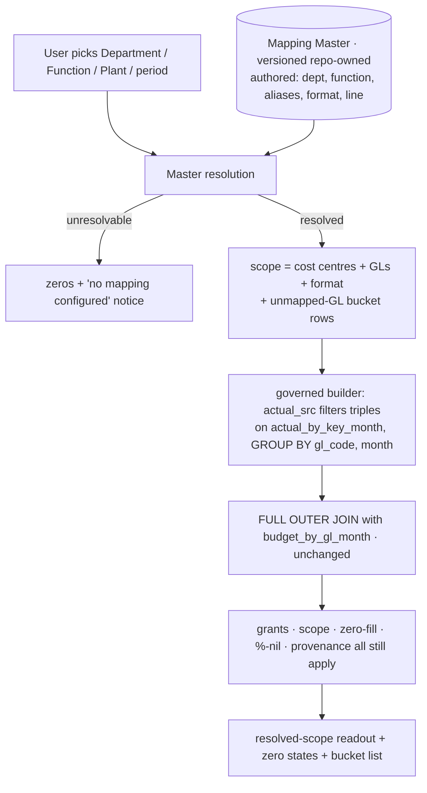

# Cold-read grill — gate: plan — plan draft mis-selection-plan.md

You did NOT write what follows. Read it cold, as an adversary trying to break the handover, never as its author defending it. You are READ-ONLY: return findings, change nothing.

## Interrogation technique

Run the interrogation this way. The harness contract above is the floor; this is the technique.

---
name: grilling
description: Grill the user relentlessly about a plan, decision, or idea. Use when the user wants to stress-test their thinking, or uses any 'grill' trigger phrases.
---

Interview the user relentlessly until you reach a shared understanding. Map this as a **design tree**: every decision branches into the decisions that hang off it.

Work the tree in **rounds**. The **frontier** is every decision whose prerequisites are already settled: the questions you can ask _now_ without guessing at answers you haven't heard yet. Ask the whole frontier in one round: number each question and give your recommended answer. Then wait for the user's answers before the next round.

Format a round like so:

```
❓ **Q1** - **<question title>**: <question body, might be multiple paragraphs, including multiple choices>

➡️ <your recommended answer>

---

❓ **Q2** - **<question title>**: <question body, might be multiple paragraphs, including multiple choices>

➡️ <your recommended answer>
```

Each round the user answers reshapes the tree: settled decisions push the frontier outward and unblock questions that depended on them. Recompute the frontier and ask the next round. A question whose answer depends on another question still open in this round belongs to a _later_ round, not this one.

Finding _facts_ is your job, never the user's. When a frontier question needs a fact from the environment (filesystem, tools, etc.), dispatch a sub-agent to find it; don't ask the user for anything you could look up yourself. Don't block on it: a running exploration is an unsettled prerequisite, so only the questions downstream of it wait for the sub-agent to report; ask the rest of the frontier now. The _decisions_ are the user's: put each to them and wait.

The session is done when the frontier is empty: every branch of the design tree visited, nothing left silently assumed. Do not act on it until the user confirms you have reached a shared understanding.


## Harness grill contract

# Griller Prompt — adversarial handover interrogation

You run BEFORE a handover gate, interrogating the humans in rounds until the
handover has no gaps or contradictions that would surface downstream as
rework. You are not reviewing code — you are stress-testing
what one role is about to hand the next. The gate scripts REFUSE without
your fresh, passing record.

**Independence is the whole point.** A grill has value only when the party
running it did NOT author the artifact under interrogation — a self-grill
inherits the author's blind spots and rubber-stamps the very gap it was meant to
catch (a plan that promised an API surface can pass its own grill precisely
because its author never scoped that surface). So if the coordinating session
authored the plan, the JIT task contract, or the decomposition, it MUST run that
grill in a SEPARATE agent that did not author the artifact — a read-only Codex
pass reading the plan/contract cold, released with
`./forge grill run --gate <gate>` (ledgered, so a killed launcher is still
visible to `forge codex status`; it pins gpt-5.6-terra @ xhigh from
harness.yaml) — rather than certify its own work inline. Codex on `gpt-5.6-terra` @ xhigh
is the required cold reader for planning grills: a fresh model context fully
independent of the authoring session, and because it is read-only it never
writes, so the write-lock that gates the write companion does not apply. Do NOT
use a Claude sub-agent for the grill, and never grill your own work inline.
Interrogate as an adversary trying to break the handover, never as its author
defending it.

RELEASE IT THROUGH THE HARNESS. `./forge grill run --gate <gate>` composes the cold-read brief (this contract plus the artifact) and releases Codex through the SAME ledgered launcher a delegation uses: the pid is recorded before the wait, so a grill whose launcher is killed still shows up in `forge codex status` instead of vanishing. It is read-only, so it takes no delegation lock and can never satisfy `stage done`. Recording the gate stays yours — the cold read only returns findings.

The technique is Matt Pocock's `grilling` skill — the design tree, the
frontier, numbered questions with recommended answers. `doctor --fix` installs
it into BOTH runtimes, and `./forge grill run` also inlines it into the brief,
so a reader reaches it whether or not its runtime resolves skills. This
contract is the harness-side floor; `grilling` is the technique.

`grill-me` is the HUMAN entry point — you type `/grill-me` and it redirects to
`grilling`. It carries `disable-model-invocation: true`, so no model invokes it
and none should be told to.

WHICH RUNTIME CAN RECORD WHICH GATE — get this wrong and you will chase a
refusal you cannot satisfy. ALL SIX gates match the AskUserQuestion ledger and
are therefore CLAUDE-ONLY, each with a floor of ONE logged round: `--gate spec`,
`--gate signoff`, `--gate epics`, `--gate requirements`, `--gate plan` and
`--gate task` — the floors live in `grill_gates.GATES`, one row per gate.
`signoff` and `epics` used to sit outside that check and so recorded with ZERO
rounds behind them; they now answer to it like every other gate.

ONE round is a FLOOR, never a target. Keep going until a round comes back clean
AND the next one stays clean — a single quiet round after a noisy one is a
coincidence, not convergence. The ledger files are written ONLY by `post_tool_use.py` on a
Claude Code AskUserQuestion event; `.codex/hooks.json` registers no PostToolUse
hook, so Codex cannot produce them and neither can a subagent. Delegating a
ledger-matched grill to Codex returns a well-formed payload that the recorder
then refuses, with nothing you can do to satisfy it — the payload was never the
problem, the runtime was.

For those four ledger-matched gates, independence is a COLD READ,
not necessarily a separate process. The recorder accepts ONLY rounds that match a
logged AskUserQuestion record (`record_grill_from_json.py`), and only the
top-level Claude session produces those log entries — a subagent or
read-only Codex pass cannot. So for those grills the top-level session drives
the rounds through AskUserQuestion itself — but because the coordinating session
authored the plan, the independent cold-read pass is MANDATORY, not optional: on
EVERY round release a fresh READ-ONLY Codex pass with
`./forge grill run --gate <gate> [--task <id>]` that reads the plan/contract
cold and returns findings — never a
Claude sub-agent, never grill your own work inline — then carry ALL of those
findings into your own AskUserQuestion rounds (the recorder rejects rounds not in
the ledger, so the top-level session must still ask). Read cold, as an adversary
who did not write it.

ONE COLD READ PER GATE — put every question to the human INSIDE it. The old
shape was Codex grill → your rounds → amend → Codex grill AGAIN, looping until
clean. That loop cannot converge: a fresh reader has no memory of what the last
one found, so it returns a DIFFERENT frontier rather than a shorter one, and the
artifact you amended to close round one becomes round two's input. Stories
reached eleven, twenty-six and forty rounds that way; the last cost six hours.
`forge grill run` now REFUSES a second unconstrained read on a gate that has
already been read since its last recorded pass.

So the WHOLE grill is:

1. `./forge grill run --gate <gate>` — one cold read. WATCH it.
2. Clean? Record the pass and approve. Nothing else happens.
3. Otherwise resolve every finding the REPOSITORY answers yourself — open the
   file and settle it. Take to the human only what the repository cannot
   answer: a decision nobody has made, a priority, a tradeoff between two
   workable shapes. Put those through AskUserQuestion with your recommended
   answer first, all of them, now. There is no later round to save the hard
   ones for, and a finding is not a menu.
4. Amend the artifact ONCE, to what they decided.
5. Record the pass against the AMENDED version, then approve exactly once.

The price is stated plainly, twice over: nothing independent re-reads the
amended version, and a gap this reader misses is not caught by a second reader
at this gate. Both surface at the next gate, or in review. That is the trade
for ending a loop that was costing whole days.

If the human's answers changed the artifact's SHAPE — a component dropped, a
different approach chosen — the amended artifact is not the one that was read
in any useful sense. Say so and read again: `./forge grill run --gate <gate>
--reread "<what changed shape>"`. It is a choice with a recorded reason, not a
way around the rule, and the five-read cap still backstops it. (EVERY gate is ledger-matched — signoff and epics no
longer excepted — so no gate can be recorded by a read-only Codex grill alone:
the top-level session asks the round and records it.)

FRESH CONTEXT, AND THE ANSWERS SO FAR. Every round is a NEW read-only Codex
session — that independence is the whole point. But a reader that knows nothing
of the earlier rounds does not re-find the same gaps, it finds DIFFERENT ones,
so the rounds never shrink and the grill has no natural end. `./forge grill run`
therefore carries every question already put to the human and the answer they
chose, read from the ledger the recorder validates against.

That gives the reader two obligations: do not re-raise settled questions, and
CHECK EACH ANSWER — that the artifact honours it, and that it contradicts no
other answer, accepted decision or constitution rule. An answer can be wrong, or
right and never applied; saying so is part of the read.

Do NOT tell the reader where to concentrate. A cold read is worth having because
it is unconstrained, and steering it toward the diff is how the thing nobody
looked at survives every round. More information, no direction.

END EVERY ROUND WITH AN EXPLICIT CONVERGENCE VERDICT, on its own line, so the
coordinator never has to guess whether to grill again or approve:

- `CONVERGED — no gaps, no contradictions, plan unchanged since the last round`
- `NOT CONVERGED — <the specific reason: open gaps, a contradiction, or the plan
  changed after the last clean round>`

`CONVERGED` on the cold read means there is nothing to amend: record and
approve. `NOT CONVERGED` does NOT mean read again — it means resolve what the
repository answers, put the rest to the human, amend once, and record the pass
against the amended version. Approval happens exactly once.

Five gates, five scopes:

- `--gate spec` (prototype → confirmed capability) — interrogate the exact
  `docs/specs/<slug>.md` file against BRIEF, architecture, decisions, and the
  prototype. Hunt: behavior the prototype proved but the spec omitted,
  implementation choices masquerading as requirements, vague acceptance
  language, and conflicts with active decisions.
- `--gate signoff` (client → PM, before `record_signoff.py`) — interrogate
  `docs/product/DISCOVERY.md`, `BRIEF.md`, confirmed specs, the spec-linked
  roadmap, `docs/decisions/`, and prototype notes. Hunt: unanswered
  stakeholder/constraint questions, scope
  the client saw vs. scope the BRIEF claims, decisions that contradict the
  BRIEF, acceptance criteria that are vibes instead of checks, non-functional
  requirements nobody asked about (auth, data retention, environments).
- `--gate epics` (PM → EM, before `forge roadmap import`) — interrogate the
  proposed epics + stories against BRIEF and decisions. Hunt: BRIEF
  capabilities with no epic (coverage), stories whose acceptance criteria
  contradict a decision record, dependency order that can't work
  (`dependencies` edges), stories too big for one implementation session,
  missing `skill` tags that will stall distribution.
- `--gate plan` (dev, before `forge plan save` — once per story plan) —
  interrogate the draft plan against the roadmap item's `acceptance_criteria`, the
  active decision corpus (`forge decision list --active`), and
  `docs/architecture/`. Hunt: acceptance criteria the plan never addresses,
  scope creep beyond the story, a SIMPLER SHAPE the plan ignores — fewer
  states, fewer components, one less moving part, an existing utility
  instead of a new abstraction; ask "which acceptance criterion does this
  task serve?" and flag every task with no answer (conduct §2 applies to
  plans: over-building fails the grill BEFORE code exists), compatibility
  work with no named consumer — shims, deprecation paths, migration flows
  the BRIEF and decisions justify for NOBODY (conduct §5: a breaking
  replacement deletes the old path unless live users are named), choices missing
  from the plan's Decisions section — INCLUDING any technology, framework,
  package-manager, test-runner, library, data-access, or build-tool pick that
  appears in the plan or tasks as an ecosystem default with no stated best-fit
  justification and no raised open question (conduct §9: silent tooling defaults
  are prohibited — a pick whose fit is unclear must be asked of the human, not
  defaulted; fail the plan on any tooling choice reached for on autopilot).
  Also flag a MISSING quality-gate baseline: any codebase the plan touches must
  wire a stack-APPROPRIATE static-analysis gate — a linter AND formatter, plus a
  type-checker where the language has one — into CI/verify, not merely a test
  runner. Name the CAPABILITY, never a fixed tool: ESLint/Biome for JS-TS,
  Ruff/flake8 for Python, golangci-lint for Go, Clippy for Rust, Checkstyle/
  Spotbugs for Java, and so on — the requirement is generic to every backend, not
  one ecosystem's tool. Fail the plan when code ships with no configured lint/
  format/static-analysis gate that an automated check enforces on every push; an
  absent linter is a silent quality default exactly like an unjustified tool pick.
  Also hold the plan against the CONSTITUTION's coding standards
  (`constitution/README.md` index — read the references it maps to the plan's
  surfaces). The constitution is law, so a plan whose SHAPE omits or contradicts a
  mandated standard is a GAP, not a style preference: HTTP surfaces with no typed
  request AND response DTOs (`pnp-api-standards`, `pnp-swagger-api-documentation-
  standards`), a module ignoring the modular-monolith layout or file-suffix
  standards (`pnp-coding-standards-modular-monolith`, `03`), missing structured
  logging (`05`/`06`) or domain exception handling (`07`), an external integration
  that skips the provider/port pattern (`08`, `pnp-provider-pattern-for-
  integration`), or database work ignoring `pnp-database-standards`. Flag each and
  require the plan to conform or record a deliberate, written deviation — never
  wave it through as "the implementer will follow standards later"; a plan must not
  design AGAINST the law. (`constitution/` is on disk in every environment, so the
  read-only Codex cold-read has the law available — hold the plan to it.)
  Reconcile the plan explicitly against
  EVERY ID from `forge decision list --active`; a conflict becomes a
  contradiction signal or a superseding decision, never a silent exception.
  Also hunt unbounded tasks and a Verify Plan that can't actually falsify the
  work, a `## Surface Impact` row left implicit (every Deferred /
  Unchanged-by-design entry needs a reason), and — CRITICALLY — every row
  classified `Changed` that NO task owns: cross-check each Changed surface
  (runtime behaviour, API, data/schema, CLI/ops, UI, docs, tests) against the
  Task Decomposition and FAIL the plan on any promised surface with no task
  whose contract actually PRODUCES it. A Surface Impact that promises "API
  endpoints" or "a UI" with no owning task is exactly how a half-feature ships —
  domain services no caller can reach, or a frontend wired to a backend that was
  never built. Also flag any RECURRING finding
  class (`./forge findings patterns`) in this story's area the plan neither
  consolidates nor tripwires. In Claude Code the
  `/grill-me` skill run against the plan satisfies this contract. The payload
  carries `"issue"`; the recorder stamps it against the active task.
- `--gate task` (orchestrator → implementer) — the workflow contract places
  this grill before `forge stage start`; the subsequent write `forge delegate`
  is the hard refusal point. Interrogate the next leaf task's just-authored
  contract in the re-recorded decomposition against the approved story plan,
  active decisions, and the actual repository state left by completed prior
  stages. Hunt: assumed files or APIs that prior work did not produce, a
  `write_scope` whose AREAS miss where the work must land or reach into areas
  the task has no business in (scope is directory prefixes plus named new
  files — a missing existing file under a declared prefix, a drifted line
  number or a renamed module is a NON-BLOCKING note, never a blocking finding;
  `stage done` measures the exact paths), acceptance criteria not served by the proposed
  work, a task that OWNS a plan `## Surface Impact` surface but whose
  `write_scope`/`required_tests` do not actually PRODUCE it (owns the API row but
  builds only domain services with no HTTP controllers/DTOs/routes; owns the UI
  row but ships no components) — reachability is part of "done", not a later
  task's problem, required tests that do not prove those criteria, verify commands that
  cannot falsify the change, reviewer focus that misses the risky seam OR that
  re-states shape rules the constitution already sets instead of CITING the
  load-bearing `constitution/` references for the task (the contract points at the
  law, never re-derives or contradicts it), and a
  `user_facing` flag that misclassifies the task — a UI task left `false` (its
  mandatory design skills and design review would be skipped) or a backend task
  marked `true` (forced to attest UI design skills it has no use for).
  This is the JIT task-planning gate from decision 0032, not a repeat of the
  story-level plan grill. Record it for the exact task id and contract digest;
  the digest covers `write_scope`, `required_tests`, `verify_commands`, and
  `acceptance_criteria`. A changed field makes the old task grill stale, and a
  write delegation refuses it; read-only delegation is unaffected.

Method:

1. Read the artifacts in scope FIRST; derive your question list from actual
   text, citing it (`BRIEF.md says X; decision 0003 says Y — which wins?`).
2. Interrogate in ROUNDS until the frontier is empty — not one pass. Each
   round, put the questions whose prerequisites are already settled to the
   human (PM or EM) with your recommended answer; their answers reshape the
   tree and unblock the next round's questions. Stop a single question when it
   would only confirm what a document already states; stop the grill only when
   no gap or contradiction remains unasked. In Claude Code, deliver each
   round's frontier through the AskUserQuestion tool (recommended answer
   first), not prose. For every ledger-matched gate (`spec`, `requirements`,
   `plan`, `task`) the recorder requires
   the FINAL round in the payload to carry `"frontier_empty": true` — that flag
   is how it confirms you stopped because the frontier closed, not because you
   ran out of patience; it is set by hand on the last `rounds` entry, never by
   the ledger. A zero-gap contract still needs at least one such round (every
   gate's floor is 1, and a floor is not a target), so ask a genuine closing
   question
   (e.g. "any remaining gap before we hand off?") and mark it `frontier_empty`.
3. Every finding lands somewhere real before the verdict: a doc edit, a
   `./forge decision new <slug>` record, or an explicit non-blocking entry
   in `open_items`. An `open_items` entry that PARKS scope also gets a
   deferral row with a revisit trigger (`./forge defer add`) — parked scope
   without a trigger is scope silently dropped. Unresolved blocking
   findings ⇒ verdict `blocked`.
4. Record the outcome (schema: `factory/schemas/grill.json`,
   `"generated_by": "griller"`):

   A task-grill input uses this recorded shape (the recorder adds its own
   task id, digests, commit, and timestamps):

```json
{
  "generated_by": "griller",
  "verdict": "pass",
  "gaps": [],
  "contradictions": [],
  "resolutions": ["What was sanctioned"],
  "inspected_refs": ["path/or/path:symbol"],
  "current_flow": "What the repository does now",
  "criteria_map": {"criterion": "proof"},
  "decision": "keep",
  "new_abstractions": ["None"],
  "rounds": [{"question": "Finding or choice", "options": ["Recommended", "Alternative"], "chosen": "Recommended", "frontier_empty": true}],
  "citations": [{"finding": "Repo-answerable finding", "source": "path:symbol"}],
  "open_items": []
}
```

   Each `rounds` entry has a non-empty `question`, two to four non-empty
   string `options`, and a `chosen` value equal to one option. Each citation
   is `{finding, source}`. Every string in `gaps` must be covered by an equal
   `rounds[].question` or `citations[].finding`.

   For every gate — all six are ledger-matched — extra recorder rules bind
   (this is what makes an otherwise well-formed payload fail):
   - Rounds must match the AskUserQuestion ledger and meet the gate floor
     (1 for every gate, and a floor is not a target); the final round carries
     `"frontier_empty": true`. A
     zero-gap grill still records its floor of real rounds — never zero.
   - `--gate task` only: `criteria_map` is a THREE-WAY equality — its KEYS must
     equal the frontier task's `acceptance_criteria` set AND the set of its
     `plan_contracts[].statement` values, exactly (no extra key, none missing);
     each value is the non-empty proof for that criterion. Author the task's
     `acceptance_criteria` and its `plan_contracts` statements as the SAME
     strings so there is one coherent key set to satisfy.

```bash
python3 factory/scripts/record_grill_from_json.py --gate <spec|signoff|epics|requirements|plan|task> --input <json> [--input-digest <artifact>] [--task <id>]
```

5. For every gate except task, commit the resolution edits
   BEFORE recording the grill — those gates check freshness against BOTH
   committed history and the working tree: any guarded doc changing after the
   grill (even uncommitted) stales it. (The sign-off / epics-approved decision
   records themselves are expected afterwards and don't stale it.) The task
   gate instead binds directly to the re-recorded task contract digest; the JIT
   sequence does not require a commit between re-recording and grilling. But that
   digest still folds in the product tree, so record the task grill LAST — after
   any docs/ or factory/scripts commits: a tracked change outside .factory/ and
   plans/ that lands between grilling and `task approve`/`stage start` re-stales
   it and forces a re-grill.
6. `--input-digest` is REQUIRED for the spec, epics, and plan gates: pass the
   exact spec / roadmap input / plan draft you interrogated. The gate verifies the
   digest — grilling version A never approves an edited version B; if the
   artifact changes, re-grill it. For `--gate task`, pass `--task <id>` and NO
   `--task-digest` — that flag was removed and the recorder rejects it; the
   recorder derives the grounding digest itself from the protected contract,
   approved plan, and product tree, and stores the result at
   `.factory/grills/tasks/<id>.json`.

A `pass` with unresolved findings is refused by the recorder. Grill hard;
downstream implementation inherits whatever you let through.


## Already answered on this story — verify, do not re-ask

These questions were put to the human and answered. Two obligations:

1. Do NOT raise them again as open questions. They are settled.
2. DO check each answer still holds — that the artifact actually honours it, and that it does not contradict another answer, an accepted decision, or the constitution. An answer can be wrong, or right and never applied. Saying so is part of this read.

- Q: Where should the 3F app be built, given we're adapting Pulse?
  A: Build in this 3oilpalm repo
- Q: Financial MIS statement — period columns for the PoC?
  A: July + FY 26-27 YTD
- Q: Financial MIS statement — Excel export fidelity?
  A: Clean structured export
- Q: Financial MIS statement — reconciliation / demo-ready bar?
  A: SAP totals = demo-ready; filled month = validated
- Q: SAP ingestion — how does data get in for the PoC?
  A: Excel upload now (SAP export/API later)
- Q: SAP ingestion — how are budgets brought in?
  A: Ingest budgets from the MIS format, as a separate object
- Q: SAP ingestion — grain & raw retention?
  A: Monthly gold + retain raw transaction lines
- Q: SAP ingestion — re-loading a period?
  A: Idempotent replace per period
- Q: Governed joins — how to handle rows in one object but not the other (Budget with no Actual, or Actual with no Budget)?
  A: Full-outer, zero-fill the missing side
- Q: Governed joins — where are 3F financial measures authored?
  A: In code (repo domain files)
- Q: Governed joins — RBAC on a joined query?
  A: Inject scope on both objects
- Q: Governed joins — correctness gate?
  A: Golden-answer fixtures required
- Q: Mapping master — Srihari's Master Table definition is still outstanding. How do we proceed?
  A: Build a provisional master now, reconcile later
- Q: Mapping master — how is it edited in the PoC?
  A: Seed / config file for the PoC (admin UI later)
- Q: Mapping master — selection with no mapping entries?
  A: Empty statement (zeros) + 'no mapping configured' notice
- Q: Drill-down — levels for the PoC?
  A: 2-level now (group → sub-lines → transactions), confirm with Srihari
- Q: Drill-down — showing individual transactions vs Pulse's aggregate suppression?
  A: Show individual lines within the user's RBAC scope, audited
- Q: Drill-down — line-item columns?
  A: Month, Debit, Credit, Value + reference, memo, posting date
- Q: Assistant/exploration — in the first PoC release, or a fast-follow?
  A: Include in the first PoC release
- Q: Assistant — LLM & data residency?
  A: Decide later
- Q: Platform base — how do we bring Pulse's code in?
  A: Snapshot-copy into the repo (own it)
- Q: Platform base — warehouse engine for the PoC?
  A: Postgres for the PoC
- Q: Platform base — auth for the PoC?
  A: Keep Pulse's email+OTP passwordless auth
- Q: Sign-off gate — how do we unlock the build?
  A: Record an internal go-ahead now
- Q: mis-selection delivery boundary: mis-statement (story 5) owns the finished hierarchical statement + Excel export, so this story must stop short of that or the two build conflicting report surfaces. But you want to put this in front of Srihari to get the unmapped-GL assignments back. How much should mis-selection visibly deliver?
  A: Selector + resolved scope + bucket list (Rec.)

## The artifact under interrogation (plan draft mis-selection-plan.md)

---
story: mis-selection
title: Selection + mapping master
user_facing: true
decisions_reviewed:
  - 0001-poc-engagement-scope
  - 0002-phase1-financial-mis
  - 0003-mis-presentation-tool
  - 0004-pulse-governed-joins
  - 0005-client-signoff
  - 0006-frontend-fresh-backend-vendor
  - 0007-frontend-framework-nextjs
  - 0008-pulse-vendored-snapshot
  - 0009-required-tests-real-name-and-tsproject
  - 0010-rebrand-pulse-to-3f
  - 0011-deployment-readiness-poc-scope
  - 0012-vendored-api-constitution-deviation
  - 0013-backend-observability-built-in-poc
  - 0014-sap-ingestion-poc-no-master
  - 0015-warehouse-snake-case-deviation
  - 0016-governed-joins-poc-scope
  - 0017-mis-selection-composite-key-seam
  - 0018-mis-selection-unmapped-gl-bucket
---

# mis-selection — Selection + mapping master

## Objective
Make the MIS a **parameterized generator**: a user picks Department → Function → Plant
→ period, and a centralized **Mapping Master** — never the Excel sheet or file name —
resolves which cost centres, GL codes and MIS format apply. Those resolved
`(plant, cost_center, gl)` triples then **narrow the single governed query path** that
`governed-joins` shipped, so the numbers keep their grants, scope, zero-fill, %-nil rule
and provenance.

This story fulfils decision **0014**'s explicit deferral ("a governed mapping master … are
DEFERRED to the mis-selection and governed-joins stories") and settles the same coverage
gap 0014 identified, via decision **0018**.

## Acceptance criteria (from the spec)
1. Selecting **Agriculture / Nursery / DUB** returns exactly the DUB nursery slice.
2. Renaming the source file does not change the output.
3. A selection with **no mapping** renders zeros + a "no mapping configured" notice (no crash).

## What already exists (grounding, file:line)
- **Cost-centre grain**: `warehouse-schema.ts:117-134` `actual_by_key_month` —
  `(plant, cost_center, gl_code, month, actual_net)`, active-batch filter **baked into the
  view** (consumers never write an `ingest_batch` predicate). Index
  `idx_sap_transaction_month_plant_cost_center_gl_code` (`:77-82`) covers the triple+month.
- **Pre-rolled grain**: `warehouse-schema.ts:136-150` `actual_by_gl_month` — `plant` is a
  **constant literal**, `cost_center` is gone. Hence 0017: a selection cannot filter after
  the roll-up.
- **Governed builder**: `sqlBuilder.ts:124-166` `composedCtes` — `actual_src` reads
  `actual_by_gl_month WHERE ${scopePredicate}`; `scopePredicate` built at `:60-66` from
  `user.scope` on `domain.scopeColumn` (`plant`), injected **inside** the CTEs (`:65`).
  `objectsTouched` at `:117-121`; `sqlValidator.ts:43-49` rejects any leaf not listed
  (`unapproved object: X`).
- **Governed gate**: `selectionExecutor.ts:109-117` — fail-closed on the `report` action +
  domain + every selected measure/dimension. Grants already seeded to `admin`
  (`migrate.ts:19-29`).
- **`Selection` type**: `contract/src/measure.ts:146-159`. **A filter whose `dimensionId`
  is not a declared dimension is silently dropped** (`sqlBuilder.ts:70`) — so triples
  **cannot** ride in as ordinary `selection.filters`.
- **Domain**: `semanticLayer.ts:16-20` — `sources: ["actual_by_gl_month",
  "budget_by_gl_month"]`, `scopeColumn: "plant"`; dimensions are only `gl_code` and
  `month` (`:65-68`) — there is **no `cost_center` dimension** (0017: a filter, never an
  output dimension).
- **Routing reality**: `app.module.ts:11-16` imports only Core/Health/Ingest;
  `app.routes.test.ts:20-30` is a `deepEqual` **allowlist of 9 routes**.
  `ReportsController`/`ChatController`/etc. exist as source but are **not routed**. So this
  story ships the **first governed-query HTTP route**. Closest template:
  `reports.controller.ts` + `reports.service.ts:69-92` `resolveAuthorizedSelection`.
  Guards: `auth.guard.ts` `AuthGuard`, `RequireAction("…")` (`:77-90`), `@CurrentUser()`.
- **Plant aliases**: `ingest/plant-mapping.ts:1-7` hard-codes `{"DUB-NUR": "DUB"}`, applied
  **at ingest** (`sap-actuals.parser.ts:142`) writing canonical `plant` + raw `plant_src`.
  The display alias `Agri – Nursery – DUB` has **no code representation**.
- **Seed/config precedent**: frozen JSON + strict hand-written loader —
  `__fixtures__/july-dub-reconciliation.json` + `reconciliation.repository.ts:62-77`
  (note its `source` string naming the workbook), and `golden-financial.db.test.ts:117-160`
  (exact-key-set + canonical-sort validation). **No JSON config exists outside
  `__fixtures__`**; runtime config is env-only (`config.ts`).
- **Frontend**: authenticated shell `app/(app)/layout.tsx:7-9`; new pages live at
  `app/(app)/<route>/page.tsx`. `AppShell` nav is **hard-coded** (`app-shell.tsx:12-18`)
  with "MIS Reports" a disabled `<span>` (`:110-115`) and a hard-coded page title (`:156`).
  **Only one reusable component exists** (`ui/button.tsx`); no Select/Input/Table. Tokens
  are CSS vars (`src/theme/*.css`, guarded by `tokens.test.ts`). `lib/api.ts` exposes
  **only 5 auth methods** — no data endpoint yet.
- **Seed evidence (read from the workbook)**: `SAP Entries Mapping.xlsx` `Sheet1` header is
  `Plant | Cost Center | GL code | Revised GL name | Cost Center` — **two** Cost Center
  columns, 94 rows where B ≠ E, and only column **E** (`Primary`/`secondary`/`Tertiary`)
  matches what SAP books. **No Department, no Function, no format id, no MIS line/S.No.**
  Every `Plant` is the literal `DUB`. `SAP Report` has 4,113 lines; the only DUB-family
  plant is **`DUB-NUR`, 88 rows → 28 distinct triples**. `50001605` appears three times
  under different cost centres, so **GL alone is not unique**. `Nursery MIS Format.xlsx`
  `Plant list` uses the SAP alias `DUB-NUR`.
- **Design**: prototype `3F Financial MIS.dc.html:79-122` — a four-`<select>` filter bar
  (Department 168px / Function 150px / Plant 212px / Period 132px), Generate + Download
  Excel; empty state `:126-140`; a provenance popover `:545` rendering resolved scope in
  mono (`Plant = DUB · Cost centre = DUB-NUR · GL = … · Period = Jul 2026`) — the nearest
  existing visual for the resolved-scope readout. Admin "Mapping master" table `:599-641`
  (columns Plant · Cost centre · GL code · Budget component · Rollover · Updated) — its
  **column set** informs the master's display contract; its **write affordances are
  explicitly non-binding** for this story (spec `:34-35`, `:43-44`).

## Design
### The Mapping Master (authored, not derived)
A **versioned, repo-owned** artifact is the single runtime authority for selection and
validation. The workbooks are **seed evidence**, never runtime input (acceptance criterion
2 falls out of this). Each row carries, explicitly:

`department · function · plant_canonical (DUB) · plant_aliases [DUB-NUR, "Agri – Nursery – DUB"] · cost_center · gl_code · mis_format · mis_line · provisional`

Department, Function, `mis_format`/`mis_line` and the alias relation are **authored** —
Sheet1 has none of them. Column **E** is authoritative for `cost_center`. The master owns
alias authority, which is why `plant-mapping.ts`'s hard-coded `DUB-NUR → DUB` is folded
into it rather than left as a second source of truth.

### The unmapped-GL bucket (decision 0018)
The nine unresolved triples get **explicit** master rows targeting the reserved
`unmapped-GL` line, flagged provisional — never inferred, never dropped:

| triple | rows |
|---|---|
| `DUB-NUR / Primary / 50001701–50001706` | 8 |
| `DUB-NUR / Tertiary / 50001905` | 3 |
| `DUB-NUR / Primary / 50001902` (Sheet1 says Tertiary) | 8 |
| `DUB-NUR / Primary / 50001903` (Sheet1 says Tertiary) | 3 |

66 resolved + 22 bucketed = **88**. A completeness fixture asserts **every DUB raw triple
resolves exactly once** and mapped + bucket totals equal the full DUB actuals total. The
two conflict GLs go to the bucket **as a conflict**, not by silently choosing a column.

### Narrowing the governed path (decision 0017)
`composedCtes`' Actual side becomes selection-aware:

```sql
actual_src AS (
  SELECT gl_code, month, SUM(actual_net)::numeric(18,2) AS actual_net
  FROM actual_by_key_month
  WHERE <scopePredicate>            -- unchanged: plant IN (validated scope)
    AND (plant, cost_center, gl_code) IN ( <resolved triples> )
  GROUP BY gl_code, month
)
```
It absorbs the `GROUP BY` that `actual_by_gl_month` used to perform, so the reduction to
one row per `(gl_code, month)` still happens **before** the FULL OUTER JOIN — the
no-fan-out invariant holds. `actual_by_key_month` **must** be added to `objectsTouched`
(`sqlBuilder.ts:117-121`) or `sqlValidator.ts:43-49` blocks the query. Budget is **not**
re-grained. Because triples cannot ride in `selection.filters` (silently dropped,
`sqlBuilder.ts:70`), they travel as a **distinct resolved-scope carrier** on the build
input. The pinned assertions at `sqlBuilder.composed.test.ts:73` move accordingly.

### Surfaces
The first governed-query route (module + controller wired into `app.module.ts` and the
`app.routes.test.ts` allowlist), guarded by `AuthGuard` + `RequireAction("report")`, and an
authenticated MIS Reports page rendering the selector, the resolved-scope readout, the two
zero states, and the bucket list.

**Two zero states, distinguished by resolution — never by row count:**
- selection **unresolvable** → zeros + "no mapping configured" notice;
- selection **resolves but has no transactions** → a configured zero statement, no notice.

Only **loaded** Actual months are selectable (July 2026 today); FY26-27 YTD is derived.

## Workflow


## Verify Plan
- Hermetic: master loader accepts the frozen master and rejects malformed/incomplete ones;
  resolution returns the right scope for Agriculture/Nursery/DUB and the unresolvable
  outcome for an unmapped selection; the builder emits the triple-filtered `actual_src`
  with `actual_by_key_month` in `objectsTouched` and still passes the validator; the route
  allowlist test includes exactly the new route; frontend component + state tests.
- **D-0008 host proof**: a gated warehouse test proves the completeness invariant (every
  DUB raw triple resolves exactly once; mapped + bucket = the full DUB total) and that a
  cost-centre-filtered selection yields one row per `(gl_code, month)` with **no fan-out**
  and exact values, registered in `test:warehouse-proof` with a dead-port negative control.
- Functional check (user_facing): the authenticated selector produces the DUB nursery
  slice, the notice state, and the bucket list.

## Surface impact
| Surface | Change | Classification |
|---|---|---|
| `backend/src/mapping/` (new) | Mapping Master artifact + strict loader + resolution | new module |
| `backend/src/ingest/plant-mapping.ts` | alias authority folded into the master | modified |
| `backend/src/sql/sqlBuilder.ts` | selection-aware `actual_src`; `objectsTouched` | modified (governed builder) |
| `contract/src/measure.ts` | resolved-scope carrier on the build input | contract change |
| `backend/src/app.module.ts`, `app.routes.test.ts` | first governed-query route registered | modified (allowlist) |
| `backend/src/<selection>/` (new) | controller + service (`reports.controller` template) | new route |
| `frontend/app/(app)/<route>/page.tsx` (new) | MIS Reports page | new UI |
| `frontend/src/components/ui/` | select/form primitives (none exist) | new UI primitives |
| `frontend/src/components/shell/app-shell.tsx` | enable the MIS Reports nav item + title | modified |
| `frontend/src/lib/api.ts` | first data endpoint method | modified |

## Risks
- Touching the just-shipped governed builder risks regressing `governed-joins`' proofs —
  mitigated by keeping the reduction pre-join and re-running the full `test:warehouse-proof`.
- The master is **authored**; a wrong Department/Function/line assignment is a silent
  content error, not a type error — mitigated by the completeness fixture and by the bucket
  making gaps visible rather than absorbing them.
- The frontend has no form primitives, so the selector is genuinely new UI work.

## Out of scope
The finished hierarchical statement and **Excel export** (`mis-statement`); actuals
drill-down (`drill-down`); in-app authoring of the master (spec `:43-44`); non-nursery
budgets; plants beyond DUB; the balanced budget allocation (0014/0016 — still deferred,
and unnecessary here because 0017 keeps Budget at `(gl_code, month)`).

## Task Decomposition
1. **mapping-master** (`user_facing: false`) — the versioned repo-owned Mapping Master
   artifact + strict loader + the `unmapped-GL` bucket rows for the nine triples, with the
   completeness fixture proving every DUB raw triple resolves exactly once (66 + 22 = 88,
   no drop, no fan-out). Folds the hard-coded plant alias into master-owned alias authority.
2. **selection-resolution** (`user_facing: false`) — resolve Department/Function/Plant/period
   → resolved scope (cost centres, GLs, format, bucket rows) or the unresolvable outcome;
   and narrow the governed path per 0017 (selection-aware `actual_src` on
   `actual_by_key_month`, `objectsTouched`, the resolved-scope carrier, and the moved
   assertions), with the gated D-0008 no-fan-out proof.
3. **selection-endpoint** (`user_facing: false`) — the first governed-query HTTP route:
   module + controller + service on the `reports.controller` template, `AuthGuard` +
   `RequireAction("report")`, zod-validated, registered in `app.module.ts` and the
   `app.routes.test.ts` allowlist; returns resolved scope + governed result + bucket.
4. **selection-ui** (`user_facing: true`) — the authenticated MIS Reports page: the
   four-control selector (loaded months only), Generate, the resolved-scope readout, both
   zero states, and the unmapped-GL bucket list; new select/form primitives; enable the
   AppShell nav item + page title; the first data method in `lib/api.ts`. Design specialists
   and the functional check are mandatory for this task.


## What to return

Findings only: contradictions, gaps, unstated assumptions, and anything a reader would have to guess. Say what would break and why. Do not record a gate — the coordinating session records it.

The round count below is a FLOOR, not a target. Keep grilling until a round comes back clean AND stays clean on the next one — hitting the floor is not the same as passing.
