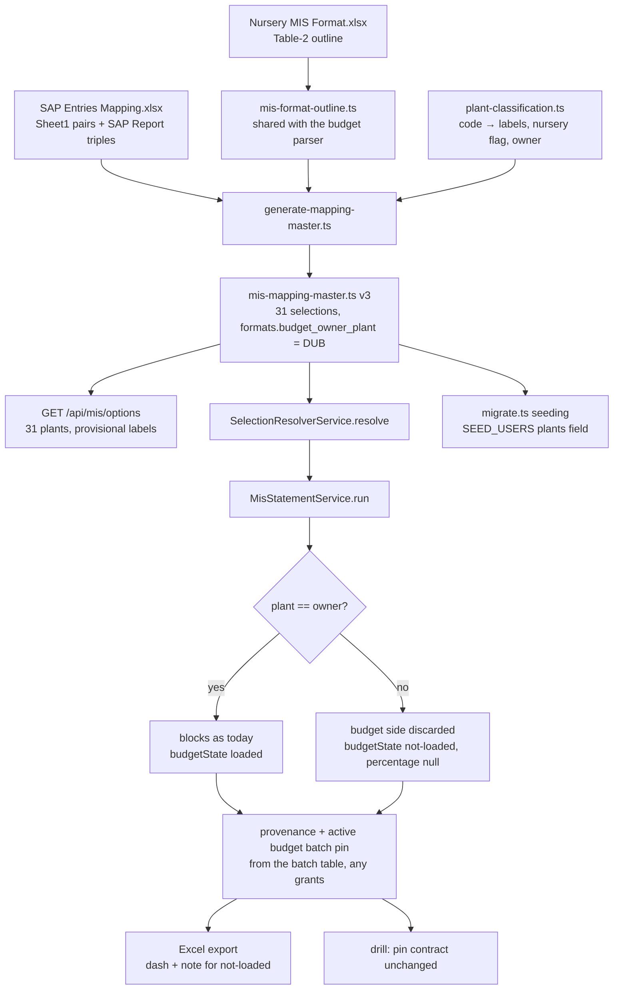

# Cold-read grill — gate: task — task plan all-plants-backend

You did NOT write what follows. Read it cold, as an adversary trying to break the handover, never as its author defending it. You are READ-ONLY: return findings, change nothing.

## Interrogation technique

Run the interrogation this way. The harness contract above is the floor; this is the technique.

---
name: grilling
description: Grill the user relentlessly about a plan, decision, or idea. Use when the user wants to stress-test their thinking, or uses any 'grill' trigger phrases.
---

Interview the user relentlessly until you reach a shared understanding. Map this as a **design tree**: every decision branches into the decisions that hang off it.

Work the tree in **rounds**. The **frontier** is every decision whose prerequisites are already settled: the questions you can ask _now_ without guessing at answers you haven't heard yet. Ask the whole frontier in one round: number each question and give your recommended answer. Then wait for the user's answers before the next round.

Format a round like so:

```
❓ **Q1** - **<question title>**: <question body, might be multiple paragraphs, including multiple choices>

➡️ <your recommended answer>

---

❓ **Q2** - **<question title>**: <question body, might be multiple paragraphs, including multiple choices>

➡️ <your recommended answer>
```

Each round the user answers reshapes the tree: settled decisions push the frontier outward and unblock questions that depended on them. Recompute the frontier and ask the next round. A question whose answer depends on another question still open in this round belongs to a _later_ round, not this one.

Finding _facts_ is your job, never the user's. When a frontier question needs a fact from the environment (filesystem, tools, etc.), dispatch a sub-agent to find it; don't ask the user for anything you could look up yourself. Don't block on it: a running exploration is an unsettled prerequisite, so only the questions downstream of it wait for the sub-agent to report; ask the rest of the frontier now. The _decisions_ are the user's: put each to them and wait.

The session is done when the frontier is empty: every branch of the design tree visited, nothing left silently assumed. Do not act on it until the user confirms you have reached a shared understanding.


## Harness grill contract

# Griller Prompt — adversarial handover interrogation

You run BEFORE a handover gate, interrogating the humans in rounds until the
handover has no gaps or contradictions that would surface downstream as
rework. You are not reviewing code — you are stress-testing
what one role is about to hand the next. The gate scripts REFUSE without
your fresh, passing record.

**Independence is the whole point.** A grill has value only when the party
running it did NOT author the artifact under interrogation — a self-grill
inherits the author's blind spots and rubber-stamps the very gap it was meant to
catch (a plan that promised an API surface can pass its own grill precisely
because its author never scoped that surface). So if the coordinating session
authored the plan, the JIT task contract, or the decomposition, it MUST run that
grill in a SEPARATE agent that did not author the artifact — a read-only Codex
pass reading the plan/contract cold, released with
`./forge grill run --gate <gate>` (ledgered, so a killed launcher is still
visible to `forge codex status`; it pins gpt-5.6-terra @ xhigh from
harness.yaml) — rather than certify its own work inline. Codex on `gpt-5.6-terra` @ xhigh
is the required cold reader for planning grills: a fresh model context fully
independent of the authoring session, and because it is read-only it never
writes, so the write-lock that gates the write companion does not apply. Do NOT
use a Claude sub-agent for the grill, and never grill your own work inline.
Interrogate as an adversary trying to break the handover, never as its author
defending it.

RELEASE IT THROUGH THE HARNESS. `./forge grill run --gate <gate>` composes the cold-read brief (this contract plus the artifact) and releases Codex through the SAME ledgered launcher a delegation uses: the pid is recorded before the wait, so a grill whose launcher is killed still shows up in `forge codex status` instead of vanishing. It is read-only, so it takes no delegation lock and can never satisfy `stage done`. Recording the gate stays yours — the cold read only returns findings.

The technique is Matt Pocock's `grilling` skill — the design tree, the
frontier, numbered questions with recommended answers. `doctor --fix` installs
it into BOTH runtimes, and `./forge grill run` also inlines it into the brief,
so a reader reaches it whether or not its runtime resolves skills. This
contract is the harness-side floor; `grilling` is the technique.

`grill-me` is the HUMAN entry point — you type `/grill-me` and it redirects to
`grilling`. It carries `disable-model-invocation: true`, so no model invokes it
and none should be told to.

WHICH RUNTIME CAN RECORD WHICH GATE — get this wrong and you will chase a
refusal you cannot satisfy. ALL SIX gates match the AskUserQuestion ledger and
are therefore CLAUDE-ONLY, each with a floor of ONE logged round: `--gate spec`,
`--gate signoff`, `--gate epics`, `--gate requirements`, `--gate plan` and
`--gate task` — the floors live in `grill_gates.GATES`, one row per gate.
`signoff` and `epics` used to sit outside that check and so recorded with ZERO
rounds behind them; they now answer to it like every other gate.

ONE round is a FLOOR, never a target. Keep going until a round comes back clean
AND the next one stays clean — a single quiet round after a noisy one is a
coincidence, not convergence. The ledger files are written ONLY by `post_tool_use.py` on a
Claude Code AskUserQuestion event; `.codex/hooks.json` registers no PostToolUse
hook, so Codex cannot produce them and neither can a subagent. Delegating a
ledger-matched grill to Codex returns a well-formed payload that the recorder
then refuses, with nothing you can do to satisfy it — the payload was never the
problem, the runtime was.

For those four ledger-matched gates, independence is a COLD READ,
not necessarily a separate process. The recorder accepts ONLY rounds that match a
logged AskUserQuestion record (`record_grill_from_json.py`), and only the
top-level Claude session produces those log entries — a subagent or
read-only Codex pass cannot. So for those grills the top-level session drives
the rounds through AskUserQuestion itself — but because the coordinating session
authored the plan, the independent cold-read pass is MANDATORY, not optional: on
EVERY round release a fresh READ-ONLY Codex pass with
`./forge grill run --gate <gate> [--task <id>]` that reads the plan/contract
cold and returns findings — never a
Claude sub-agent, never grill your own work inline — then carry ALL of those
findings into your own AskUserQuestion rounds (the recorder rejects rounds not in
the ledger, so the top-level session must still ask). Read cold, as an adversary
who did not write it.

ONE COLD READ PER GATE — put every question to the human INSIDE it. The old
shape was Codex grill → your rounds → amend → Codex grill AGAIN, looping until
clean. That loop cannot converge: a fresh reader has no memory of what the last
one found, so it returns a DIFFERENT frontier rather than a shorter one, and the
artifact you amended to close round one becomes round two's input. Stories
reached eleven, twenty-six and forty rounds that way; the last cost six hours.
`forge grill run` now REFUSES a second unconstrained read on a gate that has
already been read since its last recorded pass.

So the WHOLE grill is:

1. `./forge grill run --gate <gate>` — one cold read. WATCH it.
2. Clean? Record the pass and approve. Nothing else happens.
3. Otherwise resolve every finding the REPOSITORY answers yourself — open the
   file and settle it. Take to the human only what the repository cannot
   answer: a decision nobody has made, a priority, a tradeoff between two
   workable shapes. Put those through AskUserQuestion with your recommended
   answer first, all of them, now. There is no later round to save the hard
   ones for, and a finding is not a menu.
4. Amend the artifact ONCE, to what they decided.
5. Record the pass against the AMENDED version, then approve exactly once.

The price is stated plainly, twice over: nothing independent re-reads the
amended version, and a gap this reader misses is not caught by a second reader
at this gate. Both surface at the next gate, or in review. That is the trade
for ending a loop that was costing whole days.

If the human's answers changed the artifact's SHAPE — a component dropped, a
different approach chosen — the amended artifact is not the one that was read
in any useful sense. Say so and read again: `./forge grill run --gate <gate>
--reread "<what changed shape>"`. It is a choice with a recorded reason, not a
way around the rule, and the five-read cap still backstops it. (EVERY gate is ledger-matched — signoff and epics no
longer excepted — so no gate can be recorded by a read-only Codex grill alone:
the top-level session asks the round and records it.)

FRESH CONTEXT, AND THE ANSWERS SO FAR. Every round is a NEW read-only Codex
session — that independence is the whole point. But a reader that knows nothing
of the earlier rounds does not re-find the same gaps, it finds DIFFERENT ones,
so the rounds never shrink and the grill has no natural end. `./forge grill run`
therefore carries every question already put to the human and the answer they
chose, read from the ledger the recorder validates against.

That gives the reader two obligations: do not re-raise settled questions, and
CHECK EACH ANSWER — that the artifact honours it, and that it contradicts no
other answer, accepted decision or constitution rule. An answer can be wrong, or
right and never applied; saying so is part of the read.

Do NOT tell the reader where to concentrate. A cold read is worth having because
it is unconstrained, and steering it toward the diff is how the thing nobody
looked at survives every round. More information, no direction.

END EVERY ROUND WITH AN EXPLICIT CONVERGENCE VERDICT, on its own line, so the
coordinator never has to guess whether to grill again or approve:

- `CONVERGED — no gaps, no contradictions, plan unchanged since the last round`
- `NOT CONVERGED — <the specific reason: open gaps, a contradiction, or the plan
  changed after the last clean round>`

`CONVERGED` on the cold read means there is nothing to amend: record and
approve. `NOT CONVERGED` does NOT mean read again — it means resolve what the
repository answers, put the rest to the human, amend once, and record the pass
against the amended version. Approval happens exactly once.

Five gates, five scopes:

- `--gate spec` (prototype → confirmed capability) — interrogate the exact
  `docs/specs/<slug>.md` file against BRIEF, architecture, decisions, and the
  prototype. Hunt: behavior the prototype proved but the spec omitted,
  implementation choices masquerading as requirements, vague acceptance
  language, and conflicts with active decisions.
- `--gate signoff` (client → PM, before `record_signoff.py`) — interrogate
  `docs/product/DISCOVERY.md`, `BRIEF.md`, confirmed specs, the spec-linked
  roadmap, `docs/decisions/`, and prototype notes. Hunt: unanswered
  stakeholder/constraint questions, scope
  the client saw vs. scope the BRIEF claims, decisions that contradict the
  BRIEF, acceptance criteria that are vibes instead of checks, non-functional
  requirements nobody asked about (auth, data retention, environments).
- `--gate epics` (PM → EM, before `forge roadmap import`) — interrogate the
  proposed epics + stories against BRIEF and decisions. Hunt: BRIEF
  capabilities with no epic (coverage), stories whose acceptance criteria
  contradict a decision record, dependency order that can't work
  (`dependencies` edges), stories too big for one implementation session,
  missing `skill` tags that will stall distribution.
- `--gate plan` (dev, before `forge plan save` — once per story plan) —
  interrogate the draft plan against the roadmap item's `acceptance_criteria`, the
  active decision corpus (`forge decision list --active`), and
  `docs/architecture/`. Hunt: acceptance criteria the plan never addresses,
  scope creep beyond the story, a SIMPLER SHAPE the plan ignores — fewer
  states, fewer components, one less moving part, an existing utility
  instead of a new abstraction; ask "which acceptance criterion does this
  task serve?" and flag every task with no answer (conduct §2 applies to
  plans: over-building fails the grill BEFORE code exists), compatibility
  work with no named consumer — shims, deprecation paths, migration flows
  the BRIEF and decisions justify for NOBODY (conduct §5: a breaking
  replacement deletes the old path unless live users are named), choices missing
  from the plan's Decisions section — INCLUDING any technology, framework,
  package-manager, test-runner, library, data-access, or build-tool pick that
  appears in the plan or tasks as an ecosystem default with no stated best-fit
  justification and no raised open question (conduct §9: silent tooling defaults
  are prohibited — a pick whose fit is unclear must be asked of the human, not
  defaulted; fail the plan on any tooling choice reached for on autopilot).
  Also flag a MISSING quality-gate baseline: any codebase the plan touches must
  wire a stack-APPROPRIATE static-analysis gate — a linter AND formatter, plus a
  type-checker where the language has one — into CI/verify, not merely a test
  runner. Name the CAPABILITY, never a fixed tool: ESLint/Biome for JS-TS,
  Ruff/flake8 for Python, golangci-lint for Go, Clippy for Rust, Checkstyle/
  Spotbugs for Java, and so on — the requirement is generic to every backend, not
  one ecosystem's tool. Fail the plan when code ships with no configured lint/
  format/static-analysis gate that an automated check enforces on every push; an
  absent linter is a silent quality default exactly like an unjustified tool pick.
  Also hold the plan against the CONSTITUTION's coding standards
  (`constitution/README.md` index — read the references it maps to the plan's
  surfaces). The constitution is law, so a plan whose SHAPE omits or contradicts a
  mandated standard is a GAP, not a style preference: HTTP surfaces with no typed
  request AND response DTOs (`pnp-api-standards`, `pnp-swagger-api-documentation-
  standards`), a module ignoring the modular-monolith layout or file-suffix
  standards (`pnp-coding-standards-modular-monolith`, `03`), missing structured
  logging (`05`/`06`) or domain exception handling (`07`), an external integration
  that skips the provider/port pattern (`08`, `pnp-provider-pattern-for-
  integration`), or database work ignoring `pnp-database-standards`. Flag each and
  require the plan to conform or record a deliberate, written deviation — never
  wave it through as "the implementer will follow standards later"; a plan must not
  design AGAINST the law. (`constitution/` is on disk in every environment, so the
  read-only Codex cold-read has the law available — hold the plan to it.)
  Reconcile the plan explicitly against
  EVERY ID from `forge decision list --active`; a conflict becomes a
  contradiction signal or a superseding decision, never a silent exception.
  Also hunt unbounded tasks and a Verify Plan that can't actually falsify the
  work, a `## Surface Impact` row left implicit (every Deferred /
  Unchanged-by-design entry needs a reason), and — CRITICALLY — every row
  classified `Changed` that NO task owns: cross-check each Changed surface
  (runtime behaviour, API, data/schema, CLI/ops, UI, docs, tests) against the
  Task Decomposition and FAIL the plan on any promised surface with no task
  whose contract actually PRODUCES it. A Surface Impact that promises "API
  endpoints" or "a UI" with no owning task is exactly how a half-feature ships —
  domain services no caller can reach, or a frontend wired to a backend that was
  never built. Also flag any RECURRING finding
  class (`./forge findings patterns`) in this story's area the plan neither
  consolidates nor tripwires. In Claude Code the
  `/grill-me` skill run against the plan satisfies this contract. The payload
  carries `"issue"`; the recorder stamps it against the active task.
- `--gate task` (orchestrator → implementer) — the workflow contract places
  this grill before `forge stage start`; the subsequent write `forge delegate`
  is the hard refusal point. Interrogate the next leaf task's just-authored
  contract in the re-recorded decomposition against the approved story plan,
  active decisions, and the actual repository state left by completed prior
  stages. Hunt: assumed files or APIs that prior work did not produce, a
  `write_scope` whose AREAS miss where the work must land or reach into areas
  the task has no business in (scope is directory prefixes plus named new
  files — a missing existing file under a declared prefix, a drifted line
  number or a renamed module is a NON-BLOCKING note, never a blocking finding;
  `stage done` measures the exact paths), acceptance criteria not served by the proposed
  work, a task that OWNS a plan `## Surface Impact` surface but whose
  `write_scope`/`required_tests` do not actually PRODUCE it (owns the API row but
  builds only domain services with no HTTP controllers/DTOs/routes; owns the UI
  row but ships no components) — reachability is part of "done", not a later
  task's problem, required tests that do not prove those criteria, verify commands that
  cannot falsify the change, reviewer focus that misses the risky seam OR that
  re-states shape rules the constitution already sets instead of CITING the
  load-bearing `constitution/` references for the task (the contract points at the
  law, never re-derives or contradicts it), and a
  `user_facing` flag that misclassifies the task — a UI task left `false` (its
  mandatory design skills and design review would be skipped) or a backend task
  marked `true` (forced to attest UI design skills it has no use for).
  This is the JIT task-planning gate from decision 0032, not a repeat of the
  story-level plan grill. Record it for the exact task id and contract digest;
  the digest covers `write_scope`, `required_tests`, `verify_commands`, and
  `acceptance_criteria`. A changed field makes the old task grill stale, and a
  write delegation refuses it; read-only delegation is unaffected.

Method:

1. Read the artifacts in scope FIRST; derive your question list from actual
   text, citing it (`BRIEF.md says X; decision 0003 says Y — which wins?`).
2. Interrogate in ROUNDS until the frontier is empty — not one pass. Each
   round, put the questions whose prerequisites are already settled to the
   human (PM or EM) with your recommended answer; their answers reshape the
   tree and unblock the next round's questions. Stop a single question when it
   would only confirm what a document already states; stop the grill only when
   no gap or contradiction remains unasked. In Claude Code, deliver each
   round's frontier through the AskUserQuestion tool (recommended answer
   first), not prose. For every ledger-matched gate (`spec`, `requirements`,
   `plan`, `task`) the recorder requires
   the FINAL round in the payload to carry `"frontier_empty": true` — that flag
   is how it confirms you stopped because the frontier closed, not because you
   ran out of patience; it is set by hand on the last `rounds` entry, never by
   the ledger. A zero-gap contract still needs at least one such round (every
   gate's floor is 1, and a floor is not a target), so ask a genuine closing
   question
   (e.g. "any remaining gap before we hand off?") and mark it `frontier_empty`.
3. Every finding lands somewhere real before the verdict: a doc edit, a
   `./forge decision new <slug>` record, or an explicit non-blocking entry
   in `open_items`. An `open_items` entry that PARKS scope also gets a
   deferral row with a revisit trigger (`./forge defer add`) — parked scope
   without a trigger is scope silently dropped. Unresolved blocking
   findings ⇒ verdict `blocked`.
4. Record the outcome (schema: `factory/schemas/grill.json`,
   `"generated_by": "griller"`):

   A task-grill input uses this recorded shape (the recorder adds its own
   task id, digests, commit, and timestamps):

```json
{
  "generated_by": "griller",
  "verdict": "pass",
  "gaps": [],
  "contradictions": [],
  "resolutions": ["What was sanctioned"],
  "inspected_refs": ["path/or/path:symbol"],
  "current_flow": "What the repository does now",
  "criteria_map": {"criterion": "proof"},
  "decision": "keep",
  "new_abstractions": ["None"],
  "rounds": [{"question": "Finding or choice", "options": ["Recommended", "Alternative"], "chosen": "Recommended", "frontier_empty": true}],
  "citations": [{"finding": "Repo-answerable finding", "source": "path:symbol"}],
  "open_items": []
}
```

   Each `rounds` entry has a non-empty `question`, two to four non-empty
   string `options`, and a `chosen` value equal to one option. Each citation
   is `{finding, source}`. Every string in `gaps` must be covered by an equal
   `rounds[].question` or `citations[].finding`.

   For every gate — all six are ledger-matched — extra recorder rules bind
   (this is what makes an otherwise well-formed payload fail):
   - Rounds must match the AskUserQuestion ledger and meet the gate floor
     (1 for every gate, and a floor is not a target); the final round carries
     `"frontier_empty": true`. A
     zero-gap grill still records its floor of real rounds — never zero.
   - `--gate task` only: `criteria_map` is a THREE-WAY equality — its KEYS must
     equal the frontier task's `acceptance_criteria` set AND the set of its
     `plan_contracts[].statement` values, exactly (no extra key, none missing);
     each value is the non-empty proof for that criterion. Author the task's
     `acceptance_criteria` and its `plan_contracts` statements as the SAME
     strings so there is one coherent key set to satisfy.

```bash
python3 factory/scripts/record_grill_from_json.py --gate <spec|signoff|epics|requirements|plan|task> --input <json> [--input-digest <artifact>] [--task <id>]
```

5. For every gate except task, commit the resolution edits
   BEFORE recording the grill — those gates check freshness against BOTH
   committed history and the working tree: any guarded doc changing after the
   grill (even uncommitted) stales it. (The sign-off / epics-approved decision
   records themselves are expected afterwards and don't stale it.) The task
   gate instead binds directly to the re-recorded task contract digest; the JIT
   sequence does not require a commit between re-recording and grilling. But that
   digest still folds in the product tree, so record the task grill LAST — after
   any docs/ or factory/scripts commits: a tracked change outside .factory/ and
   plans/ that lands between grilling and `task approve`/`stage start` re-stales
   it and forces a re-grill.
6. `--input-digest` is REQUIRED for the spec, epics, and plan gates: pass the
   exact spec / roadmap input / plan draft you interrogated. The gate verifies the
   digest — grilling version A never approves an edited version B; if the
   artifact changes, re-grill it. For `--gate task`, pass `--task <id>` and NO
   `--task-digest` — that flag was removed and the recorder rejects it; the
   recorder derives the grounding digest itself from the protected contract,
   approved plan, and product tree, and stores the result at
   `.factory/grills/tasks/<id>.json`.

A `pass` with unresolved findings is refused by the recorder. Grill hard;
downstream implementation inherits whatever you let through.


## Lessons already in force for these paths

The plan must design AROUND these. A plan that ignores one is not merely unlucky later — it is wrong now, and saying so is part of this read.

- A required_tests entry must name a REAL leaf test (id = the string in test("...")), not the file path, and must pin TS_NODE_PROJECT=backend/tsconfig.json because forge runs it from repo root; otherwise junit-run's --test-name-pattern matches nothing and ts-node skips the workspace tsconfig, so the gate reports pass without running assertions. Always verify with a negative control (a required test whose negative control cannot fail is not proof).
- Enforce at the DB level (a trigger, like the immutability trigger) that sap_transaction.month equals its ingest_batch.period and mis_budget.period equals its batch period; otherwise a mis-periodized row double-counts in actual_by_key_month, which groups by ROW month while active-uniqueness is keyed on BATCH period.
- The WAREHOUSE_PG_* separation guard must REJECT when the normalized host AND port match the app DB, regardless of database name (canonicalize localhost/127.0.0.1/::1 and equivalent aliases) — otherwise warehouse DDL can be applied to the application Postgres server under a different db name.
- The demonstrated warehouse proof must RUN migrate + the fixture against the warehouse DB via a committed, re-runnable warehouse:proof script that EXERCISES IngestionRepository's atomic candidate-load-then-flip; a hermetic test that only greps seed-proof.sql text is false-green. Do NOT build a controller/API here (that is the actuals-loader task) — exercise the repository directly.
- The WAREHOUSE_PG_* separation guard must RESOLVE both the warehouse host and the app pg host via dns.promises.lookup(host,{all:true}) and reject when their resolved IP sets INTERSECT and the ports match (normalize IPv4-mapped ::ffff: and IPv6 loopback). A hand-picked list of loopback spellings + isIP() cannot catch DNS aliases or IPv6-mapped aliases of the app host. This makes loadWarehousePostgresConfig async — make createWarehouseWritePool async and await it in warehouse:migrate/proof and the hermetic test.
- The D-0008 live warehouse proof must be a COMMITTED, reviewer-visible DB-backed test (e.g. backend/src/warehouse/warehouse-proof.db.test.ts calling proveWarehouse, registered in the backend package.json test:db script) so the required execution is provable from the diff itself — a tests.json narrative alone is invisible to the cold-diff reviewer and reads as an absent D-0008 record.
- Put the DB-backed warehouse proof in its OWN file backend/src/warehouse/warehouse-proof.db.test.ts registered ONLY in test:db (and the db list of tools/quality-gate.test.mjs); keep warehouse-schema.test.ts hermetic-only. NEVER register one test file in both test:hermetic and test:db — tools/quality-gate.test.mjs asserts exactly one suite per file and fails the whole verify if a file appears twice.
- SUPERSEDES the separate-file guidance for warehouse-schema: its write_scope does NOT include warehouse-proof.db.test.ts, so do NOT create that file. Keep the DB proof test INSIDE backend/src/warehouse/warehouse-schema.test.ts gated by WAREHOUSE_DB_TEST=1 (skips under plain test:hermetic, runs the migrate + IngestionRepository proof when the env + WAREHOUSE_PG_* are set), registered ONLY in test:hermetic. REMOVE warehouse-schema.test.ts from the test:db script and the db-list in tools/quality-gate.test.mjs, and drop the WAREHOUSE_DB_TEST env added to test:db — quality-gate requires each test file in exactly ONE suite and fails verify otherwise. This is the ONLY remaining fix.
- The global constitution-07 exception filter (backend/src/common/global-exception.filter.ts) deliberately reduces every 400 to field-names-only {field, reason:'invalid'} and NEVER surfaces client values or messages. Do NOT modify it. Carry row-level ingest diagnostics as ZOD ISSUE PATHS over the parsed rows array (e.g. rows.42.debit, rows.42.month for a period mismatch) so the existing filter emits {field:'rows.<n>.<column>', reason:'invalid'} — that IS the sanitized row+column diagnostic. Expect no free-text message in the envelope.
- The sap_transaction 'raw' jsonb column is ADDITIVE - add it to warehouse-schema.ts + a NEW backend/drizzle-warehouse/0001_*.sql migration (generate-once, apply-only via warehouse:migrate). Do NOT modify backend/src/warehouse/warehouse-schema.test.ts (out of write_scope); its column/constraint assertions use .includes and are non-exhaustive and the 0000 migration is unchanged, so it stays green untouched. Assert the raw column IN-SCOPE: sap-actuals.parser.test.ts (parser emits the full raw row) and the WAREHOUSE_DB_TEST=1-gated ingest.service.test.ts (raw persists).
- Per decision/deferral D-0006 (plans/deferrals.md), before a task edits any .prettierignore-listed vendored file (e.g. backend/src/db/migrate.ts) it MUST, in the SAME change, run prettier on that file AND remove its line from .prettierignore. This is an authorized, decision-mandated edit - .prettierignore is a mechanically-required in-scope file for such an edit, NOT a scope violation; do not raise a scope signal for it (stage-done amend-scope records it).
- tools/quality-gate.test.mjs validateIgnoredBaseline asserts .prettierignore's non-comment lines deep-equal the keys of its ignoredBaselineHashes map. So when D-0006 requires removing a file (e.g. backend/src/db/migrate.ts) from .prettierignore, you MUST also remove that path's entry from the ignoredBaselineHashes map in tools/quality-gate.test.mjs (both in write_scope) in the SAME change, and ensure the now-unignored file is prettier-formatted so format:check passes. Keep .prettierignore and ignoredBaselineHashes in sync.
- In mis-budget.parser.ts round monetary values to paise with decimal-safe, symmetric semantics - Math.round(value*100) rounds half-up and mishandles negative half-paise and binary float drift. Use a decimal-safe rounder (round-half-away-from-zero on the scaled value with an epsilon, matching the actuals numeric path) so budget/rollover amounts are exact at paise.
- In mis-budget.parser.ts the 25,000-row cap is applied only to SOURCE GL rows, but each GL line row is expanded into one mis_budget row per date-headed month block (up to 12). Enforce the cap on the EXPANDED output row count (glRowCount * blockCount, or count emitted rows), not just source GL rows, so a workbook that fans out past the limit is rejected before any write (DoS/unbounded-memory bound). Reject with the same limit error the shared guard uses.
- The pinned WAREHOUSE_DB_TEST=1 host command must be prefixed with TS_NODE_PROJECT=backend/tsconfig.json TS_NODE_TRANSPILE_ONLY=1; without them 'node --require ts-node/register --test <file.ts>' loads the TypeScript file as a single empty testcase that FALSE-PASSES (tests 1/pass 1) even against a dead DB port — verified: with the prefix the good port gives tests 4/pass 4 and a bad port fails the 2 gated DB leaves (ECONNREFUSED); without it a bad port still 'passes'.
- In findPeriodColumns, firstOfMonth() returns undefined for BOTH a non-date header (a label / YTD / FY column, correctly skipped) AND a genuine Excel Date whose day != 1 (currently ALSO skipped — the bug). A malformed non-first-of-month date block is then silently omitted while the other periods commit and the endpoint returns 201, leaving that month's prior active budget untouched. Fix: distinguish the two — if the resolved header value IS a Date but not the first of its month, push a ['file','headers', <label>] validation issue and reject the workbook; only a genuinely non-date header may be skipped. Every date-headed block must be handled (grill resolution #3). Cover with a mis-budget.parser.test.ts case: a mid-month date header alongside valid blocks is rejected before any write.
- autoreview blocks a PROOF task whose gated WAREHOUSE_DB_TEST=1 leaf is registered only in test:hermetic (where it self-skips) — from the diff there is no registered command that RUNS it. Add the gated test file to backend/package.json test:db (the DB-backed suite a Postgres/warehouse runner executes with WAREHOUSE_DB_TEST=1), alongside the committed tests.json execution record + the pinned host command in the plan. This makes the execution path provable from the diff itself; the demonstrated-host-evidence model (decision 0009 / D-0008) is unchanged — CI without a warehouse container still skips it.
- Registering the gated reconciliation test in test:db is NOT enough: test:db does not set WAREHOUSE_DB_TEST=1, so the leaf still self-skips there and autoreview reads it as an unrunnable proof. FIX: add a dedicated backend package.json script 'test:warehouse-proof' that itself sets WAREHOUSE_DB_TEST=1 and runs backend/src/warehouse/reconciliation.repository.test.ts (the WAREHOUSE_PG_*/PGHOST/PGPORT connection env is still supplied by the host/operator, NOT hardcoded), and REMOVE the file from test:db (it is a warehouse-DB test, not an app-DB test). Then the registered command actually EXECUTES the proof when run against a warehouse; the pinned host command in tests.json becomes 'WAREHOUSE_PG_*... npm --prefix backend run test:warehouse-proof'. Keep it in test:hermetic too (self-skips there). Still demonstrated-host-evidence (decision 0009/D-0008), NOT CI-enforced.
- Not a defect (Decisions): Factually incorrect and contradicts the settled D-0008 model. (1) The claim that the supplied evidence contains no invocation of test:warehouse-proof is false: the committed tests.json commands_run records 'npm --prefix backend run test:warehouse-proof -> tests 4 / pass 4 / fail 0 / skipped 0' (the gated warehouse leaf EXECUTES because the script sets WAREHOUSE_DB_TEST=1) plus a dead-port negative control (fail 1, ECONNREFUSED). Performance and security accepted this same evidence and approved this round. (2) The warehouse proof is committed, reviewer-visible and runnable via the registered test:warehouse-proof script. (3) The story plan Decisions section settles that DB-backed warehouse proofs run as DEMONSTRATED HOST EVIDENCE (docker warehouse, WAREHOUSE_PG_*) per D-0008, NOT inside the enforced hermetic path; demanding a non-skipped enforced execution is CI-enforcement the plan defers. — raised as "[P1] Record an execution of the gated warehouse proof (backend/src/warehouse/reconciliation.repository.test.ts:107): The only recorded execution is `npm run tes"
- The reconciliation D-0008 gated leaf TRUNCATEs ingest_batch + sap_transaction CASCADE on whatever DB WAREHOUSE_PG_* points at. Guard it: BEFORE truncating, assert the warehouse host (WAREHOUSE_PG_HOST) is loopback/local (127.0.0.1, ::1, or localhost) and THROW a clear error refusing to run against a non-local warehouse — so a misconfigured WAREHOUSE_PG_* can never wipe a shared/production warehouse. Also fix the P2: tools/quality-gate.test.mjs wrapping the declared test lists in new Set removes the gate's exactly-one-suite detection (a file registered in two suites is silently deduped) — compare with duplicate detection preserved (e.g. detect duplicates before dedup, or assert no file appears in more than one suite) instead of Set-then-compare.
- Not a defect (Decisions): Factually incorrect and contradicts the settled D-0008 model. (1) tests.json IS committed at f9c6b1d with the full host-execution record: 'npm --prefix backend run test:warehouse-proof -> tests 7 / pass 7 / fail 0 / skipped 0' plus a dead-port negative control (fail 2, ECONNREFUSED). The reviewer cannot see it only because the review bundle deliberately excludes .factory bookkeeping ('review tip excludes 9 harness bookkeeping paths; the bundle is the product delta only') - not because it is absent. (2) The runnable command that executes the proof (test:warehouse-proof, serialized) IS in the product delta at backend/package.json, and the gated test is committed and reviewer-visible. (3) The security lens accepted this identical evidence and approved. (4) The story plan Decisions section settles that the DB-backed warehouse proof is DEMONSTRATED HOST EVIDENCE (D-0008), not CI-enforced execution. — raised as "[P1] Commit the required host-execution evidence for the new proof (backend/package.json:19): The new `test:warehouse-proof` command is registered, but the chan"
- Not a defect (Decisions): Factually incorrect and contradicts the settled D-0008 model, same as the quality lens. tests.json IS committed at f9c6b1d with the host-execution record (test:warehouse-proof -> tests 7 / pass 7; dead-port negative control fail 2, ECONNREFUSED); the reviewer cannot see it only because the review bundle excludes .factory bookkeeping ('the bundle is the product delta only'). The runnable serialized test:warehouse-proof command IS in the product delta (backend/package.json) and the gated test is committed reviewer-visible; the security lens approved this identical evidence. The story plan Decisions section settles the warehouse proof as demonstrated host evidence (D-0008), not CI-enforced. — raised as "[P1] Commit the required warehouse-proof execution evidence (backend/src/warehouse/gl-month-rollups.db.test.ts:22): This DB-backed proof is skipped unless WAREH"
- The composed-relation gated proof failed only because month (a Postgres DATE) is read back by node-pg as a JS Date at LOCAL midnight, so in a non-UTC host timezone (IST) the ISO string shifts a day (2099-09-01 stored -> 2099-08-31T18:30:00Z read). The composed relation values were correct (matched key actual 125.00 + budget 200.00, zero-fill and no-fan-out work). FIX (test-only, backend/src/warehouse/composed-relation.db.test.ts): compare month as a DATE-ONLY value - either select month as text in the assertion query (to_char(month,'YYYY-MM-DD')), or normalize both sides to the yyyy-mm-dd date part - never compare the full Date/ISO across timezones. Do NOT change the composed relation SQL; the logic is proven correct.
- A review may flag editing backend/src/db/migrate.ts as needing the D-0006 de-ignore ritual (remove from .prettierignore + drop its ignoredBaselineHashes entry). This is FALSE for migrate.ts: it is NOT listed in .prettierignore (only migrate.trim.test.ts is), it is NOT a key in tools/quality-gate.test.mjs ignoredBaselineHashes, and Checking formatting...
All matched files use Prettier code style! passes clean. Task 2 (composed-relation, merged PR #21) edited migrate.ts to seed the 'report' action WITHOUT any D-0006 de-ignore and merged green. So editing migrate.ts requires NO .prettierignore or quality-gate baseline change — do NOT add/remove it there. The stale D-0006 deferral text lists ~71 historically-drifting files; migrate.ts has since been de-ignored, so a finding treating it as still-ignored contradicts the actual repo state and is not a defect.
- Unlike migrate.ts (which is NOT ignored), backend/src/chat/chat.service.ts IS a D-0006 vendored file: it is listed in .prettierignore AND is a key in tools/quality-gate.test.mjs ignoredBaselineHashes with a pinned baseline hash. The quality-gate test 'the four FACTORY commands ... / D-0006' fails with 'chat.service.ts changed while still excluded by D-0006' whenever its content changes but it stays ignored. FIX per the D-0006 protocol: (1) ensure the file is prettier-clean (npx prettier --write if needed), (2) REMOVE the 'backend/src/chat/chat.service.ts' line from .prettierignore, (3) REMOVE its '<hash> backend/src/chat/chat.service.ts' entry from the ignoredBaselineHashes map in tools/quality-gate.test.mjs — all in the same change. Do this for ANY D-0006-ignored file a task edits; check membership with  and . (.prettierignore is editable by the worker and is recorded via stage amend-scope at stage done.)
- Putting source_presence on ResultTable rows caused three defects at once: (1) it leaked into the RENDERED column list (selectionExecutor.ts:137 filtered only budget_component_labels + active_batch_ids), showing a provenance column to users; (2) it rode into every composed execution.result.rows record and so into authored-measure SAMPLE persistence (selectionExecutor.ts:165) — the same pressure that kept dragging measures.service.ts into scope; (3) it made the API type UNSOUND (contract/src/api.ts:148): intersecting Record<string, string|number|null> with a possibly-array source_presence is invalid because the string index signature already declares every value scalar. FIX: do NOT put per-row provenance on ResultTable rows at all. Filter ALL provenance columns (source_presence, budget_component_labels, active_batch_ids) out of raw.columns AND out of the result rows, and carry per-row source-presence on the PROVENANCE payload instead, ROW-ALIGNED BY INDEX (e.g. provenance.rowSourcePresence: SourcePresence[] parallel to result.rows), alongside the query-level (source,period,batchId) tuple set + label set. This keeps ResultTable's row type exactly Record<string,string|number|null> (sound, no index-signature conflict), keeps provenance out of rendered columns and out of authored-measure sample persistence, and still satisfies C2's row-aligned source-presence.
- node-postgres parses a DATE column into a JS Date at LOCAL midnight of the process timezone, so the exact inverse is to read back the PROCESS-LOCAL date parts (getFullYear/getMonth/getDate). Formatting with a hardcoded timeZone such as Asia/Kolkata only happens to work on hosts at or west of that offset and silently returns the previous day on hosts east of it (e.g. Asia/Tokyo), so a date-only normalizer must never pin a timezone.
- RULING (settles the autoreview P1 and signals S-0021/S-0023): the bucket list must emit ONE row per unmapped GL CODE, never one per master bucket ENTRY, because GL/month is the grain of the only amounts that exist - do NOT add a warehouse query path and do NOT touch sqlBuilder.ts or selectionExecutor.ts to recover triple grain. Fold the master's bucket entries by gl_code in mis-selection.service.ts: costCentre keeps the single cost centre when that GL has exactly one bucket entry and is null when it has several (a GL booked across cost centres is no longer a triple, just as a Budget-only GL is not); provisional is true if any folded entry is provisional; reason names each folded entry's cost centre and reason so the list still says WHICH cost centre is wrong; actual and budget are that GL's totals assigned EXACTLY ONCE. This keeps the settled decision (both an Actual and a Budget amount per row, costCentre null where there is no single cost centre), keeps the gap visible rather than absorbed (decision 0018 as amended), and makes the list reconcilable against the slice totals because no amount is ever copied onto two rows. Acceptance criterion 3's word 'triples' means the reviewable identity of the gap, not one row per cost centre. Prove it in mis-selection.controller.test.ts with a master where ONE GL carries TWO bucket entries: expect a single row, costCentre null, and the GL total counted once.
- RULING (settles the autoreview P2/performance blocker at frontend/src/features/mis/mis-report-view.tsx:233): after folding the bucket to GL grain, costCentre === null means THREE different things - a Budget-only GL, a GL absent from the mapping master but carrying real Actual spend, and a GL whose master entries span several cost centres - so any UI label inferred from null (today 'Budget only') mislabels two of the three. FIX IN THE CONTRACT, not the renderer: replace MisSelectionBucketRow.costCentre (string | null) with costCentres: string[] - the master's cost centres for that GL, empty when the master names none. mis-selection.service.ts populates it (one entry when a single bucket entry, several when folded, empty for a Budget-only or master-absent GL) and the view renders exactly what it is given: the single name when there is one, 'N cost centres' when there are several (the reason line already names each), and 'No cost centre in master' when there are none. Never infer a row's kind from an absent field. Update mis-selection.controller.test.ts and mis-report-view.test.tsx accordingly, including the multi-cost-centre case with nonzero Actual.
- backend/src/mis/mis-selection.dto.ts exists solely to keep the typed Swagger response DTO aligned with the MisSelection* types in contract/src/api.ts, so ANY change to those types mechanically requires the matching change in the DTO in the SAME change. It is authorized in-scope for such a change (recorded on the stage with amend-scope) - do not raise a scope signal for it.
- Not a defect (0023): Contradicts accepted decision 0023: the drift check REPORTS and the upload SUCCEEDS. Refusing the batch was put to the human as an explicit option and rejected, because a renamed line would block the client's upload entirely and only we could unblock it. Ingest is deliberately fail-open on drift and fail-closed on money. — raised as "[P1] Reject mapping drift before persisting the renamed outline (backend/src/ingest/mis-budget.parser.ts:169): The parser calculates missing master leaf keys bu"
- Not a defect (0023): Contradicts accepted decision 0023: the drift check REPORTS and the upload SUCCEEDS. Refusing the batch was put to the human as an explicit option and rejected. Ingest is deliberately fail-open on drift and fail-closed on money (an uncomputed Budget cell still refuses, per decision 0020). — raised as "[P1] Reject mapping drift before activating the budget batch (backend/src/ingest/mis-budget.parser.ts:170): The parser only records missing master leaf keys in "
- FIVE fixes from the three-lens review, all blocking except the last. (1) replaceBudgetBatch keeps the outline argument OPTIONAL and defaults it to [] (ingestion.repository.ts:61-80), so any caller can write budget rows and activate a batch with no snapshot, and budget_by_leaf_month then silently discards those rows at its inner join - an active batch that returns an empty statement. Make the outline argument REQUIRED with no default, and enforce the budget-row-to-outline relationship in storage (a foreign key or constraint), not by convention. (2) Migration 0003 adds leaf_key as nullable and does not deal with existing active budget batches, whose rows have no leaf_key and therefore vanish from the projection silently. Decision 0021 says a batch ingested before this change must be RE-INGESTED rather than guessed at, so the migration must mark any pre-snapshot budget batch explicitly INACTIVE - a visible empty state that says re-ingest, never a silently wrong statement. Do NOT backfill a guessed leaf_key. (3) The gated proof (statement-projection.db.test.ts:61) asserts row uniqueness and two grand totals only; add EXACT per-leaf monetary assertions so a compensating error inside the totals cannot pass. (4) buildStatementProjection (sqlBuilder.ts:154) is invoked only by its own tests: make it a real branch of the governed builder's dispatch so it is reachable through the normal governed execution path, rather than a standalone helper a future route has to find. Do NOT add an HTTP route - that is task 2. (5) P2: outline nodes are appended before the glRowCount limit check (mis-budget.parser.ts:126), so a workbook of many formula subtotals bypasses the 25,000-row ingestion bound; count outline nodes toward the cap before that early continue.
- Making replaceBudgetBatch's outline argument required forces the four existing gated proofs that call it with two arguments - backend/src/warehouse/composed-relation.db.test.ts, gl-month-rollups.db.test.ts, golden-financial.db.test.ts and selection-slice.db.test.ts - to pass an outline. They are AUTHORIZED in scope for that change. Adapt ONLY the call site, passing the outline each test's own fixture implies; change NO assertion and no expected value, because those proofs passing unchanged in substance is decision 0022's evidence that the (gl_code, month) relation was not disturbed. If an assertion has to move to make them pass, that is a real regression - raise it rather than editing the expectation.
- The new per-leaf assertion in statement-projection.db.test.ts fails on ORDERING, not values: '9.1|55011101|office-electricity-expenses' and '9.1|55011102|guest-house-electricity-expenses' appear in both actual and expected with identical amounts, at different positions. An unordered SQL result was compared against an ordered literal. Do NOT fix this by re-shuffling the expected literal to match today's incidental order. The outline snapshot already stores sort_order precisely so the statement can mirror Srihari's workbook line for line - which is what 'exact to the format' means and what the human chose when they picked 'mirror the workbook outline'. So: the statement projection must ORDER BY the outline's sort_order (with the leaf key as a deterministic tie-break), and the proof must assert that order. Note that S.No is TEXT, so a lexical sort puts 9.1 after 9.11 and 9.10 - the outline's numeric sort_order is the authority, never the S.No string.
- THREE fixes from the second review round. (1) BLOCKING, and it defeats an explicit contract requirement: entryKeys in mapping-master.ts:114 is recreated inside the per-selection loop, so the loader only rejects a duplicate (cost_centre, gl_code) WITHIN one selection. The contract requires rejecting two entries that claim one triple for different targets ANYWHERE in the master - that is what makes a SAP triple resolve to exactly one statement leaf. Hoist the key set so uniqueness is enforced across the whole master, and add a test that two selections claiming the same triple for different targets is rejected. (2) BLOCKING fan-out risk: the active-batch provenance joins in sqlBuilder.ts:216 match on source_kind and period only, while active batches are also distinguished by PLANT - so a second plant's active batch for the same period multiplies the statement rows. Join on plant as well. This is the same defect class as the one-sided batch attribution fixed during golden-provenance: a provenance join that is not gated on every key of the batch's identity fans out silently. (3) P2: the expanded-row limit in mis-budget.parser.ts:196 counts outlineCount ONCE, but IngestService persists the snapshot per period, so a subtotal-heavy workbook still understates its true row cost - count the snapshot per period in the cap.
- FALSE FINDING, do not act on it again. A review round on statement-model claimed 'active batches are distinguished by plant as well' and asked the statement projection's provenance joins to add a plant predicate. There is NO plant column on ingest_batch (backend/src/warehouse/warehouse-schema.ts): its columns are id, source_kind, period, uploaded_by, uploaded_at_utc, row_count, validation_result, reconciliation_result, is_active, created_at_utc, updated_at_utc. Plant lives on the ROW tables (sap_transaction), not on the batch. Acting on the finding produced 'column actual_batch.plant does not exist' (SQLSTATE 42703) and broke the gated proof. The batch's full identity IS source_kind + period + is_active, so a join on those three already cannot fan out on a second plant's batch - there is no such thing. Revert to joining on source_kind, period and is_active. I ledgered the reviewer's claim without checking the schema first, which is what let it reach the code; READ THE COLUMN before asserting a join key.
- contract/src/measure.ts:59 types DomainSpec.composed.joinKeys as the literal tuple ['gl_code', 'month']. The statement_relation domain that decision 0022 requires joins on leaf_key and month, so it cannot be declared until that type admits the statement grain. contract/src/measure.ts is AUTHORIZED in scope for statement-api. Widen it precisely - a readonly tuple union that admits ['leaf_key','month'] alongside ['gl_code','month'] - and do NOT loosen it to string[]: the literal type is what prevents a domain declaring a join the builder cannot honour. The existing composed governed-financial domain must still type-check unchanged, which is decision 0022's promise that the (gl_code, month) relation is untouched.
- THREE fixes. (1) URGENT despite its P2 label - the statement projection emits one row per (leaf_key, month) and then applies the global LIMIT of loadConfig().maxRows, which defaults to 1000 (backend/src/config.ts:176). The FY 26-27 YTD block spans 12 months over 80 leaves = 960 rows: FORTY rows from silently truncating a financial statement with no error, and one more budget line or one more month takes it over. Fix it at the source - the block needs one total per leaf per PERIOD RANGE, not a row per month, so aggregate over the range in SQL (GROUP BY leaf_key across the block's months) rather than returning 960 rows for the service to sum. That turns the FY-YTD block into ~80 rows and makes the LIMIT a real guard instead of a silent truncator. Additionally, make truncation LOUD: if a statement query returns exactly the limit, fail rather than return a short statement. (2) contract/src/api.ts:255 types FixedScaleMoney as , which accepts '1.2' and '1.234' - so a consumer satisfies the type without supplying paise, defeating the reason the type exists. Constrain it to exactly two decimal places. (3) mis-statement.service.ts:289 returns the FIRST child's percentage label for a zero-budget parent before checking the aggregate actual, so a parent whose children carry different labels can report the wrong one; derive the parent's label from its AGGREGATE budget and actual, the same CASE the governed measure applies.
- The two-decimal-place constraint on FixedScaleMoney was tightened in contract/src/api.ts into a union of template-literal types covering .00 through .99, but backend/src/mis/mis-statement.dto.ts still restates the old loose shape (number-dot-number), so the DTO no longer satisfies MisStatementMeasureBlock and build:backend fails with 'Types of property budget are incompatible'. The DTO must IMPORT FixedScaleMoney from the contract rather than restating its shape: a restated type drifts the moment the contract tightens, which is exactly what happened here. Same rule for every other money field crossing the wire.
- The statement projection now aggregates over the requested period RANGE, returning one row per leaf per block instead of one per (leaf_key, month) - the fix for a live truncation hazard, since the FY-YTD block was 960 rows against a default maxRows of 1000. backend/src/warehouse/statement-projection.db.test.ts is AUTHORIZED in scope to follow that shape: update its StatementRow type and change the uniqueness assertion from (leaf_key, month) to leaf_key. Keep every VALUE assertion exactly as it is - 81 rows, Actual 11512712.07, Budget 10050136.29, the three-way GL split across Primary/Secondary/Tertiary, no fan-out - because those are task 1's evidence and they must still hold at the new grain (July is a single month, so the row count is unchanged). If a value assertion has to move to make it pass, that is a real regression: raise a signal rather than editing the expectation. Decision 0022 has been amended in place to record the grain change and why.
- TWO fixes. (1) The gated proof still exercises only July - a SINGLE month - so the range aggregation that the whole grain change exists for is UNPROVEN. Extend statement-projection.db.test.ts with a multi-month case over the FY 26-27 YTD range asserting that it returns one row per leaf (about 80) rather than one per leaf-month (about 960), and that each leaf's Actual and Budget equal the sum of its months. That is the assertion that would have caught the truncation hazard, and without it the fix is only asserted. Keep the existing July assertions unchanged. (2) mis-statement.service.ts:85 dedupes the two period blocks by comparing the selected PERIOD ID to the FY-YTD id, but the degenerate case is really RANGE equality: selecting 2026-04-01, the FY start, gives a selected block whose from/to equal the YTD block's, so the statement again prints the same figures twice under two headings - the exact outcome the human ruled against. Dedupe on (from, to) equality, not on the period identifier.
- The measure/dimension authorization fix made the statement projection honour selection.measureIds and selection.dimensionIds, which is correct - and it immediately exposed that backend/src/warehouse/statement-projection.db.test.ts builds its selection with EMPTY measureIds and dimensionIds (lines 49-50). The projection now rightly collapses that to a single aggregate row, so the proof asserts 1 !== 81. The service sends dimensionIds ['leaf_key'] and the governed financial measures (mis-statement.service.ts:112); the proof must build the SAME selection, or it is proving something the route never asks for. Update the proof's selection to match the service's, and keep every value assertion unchanged - 81 rows, Actual 11512712.07, Budget 10050136.29, the three-way split, the multi-month YTD case. A hand-built selection that drifts from the route's is a proof of nothing.
- backend/src/warehouse/statement-projection.db.test.ts:205 fabricates its own statementDomain with measures: [] and dimensions: []. Since buildStatementProjection resolves selection.dimensionIds against domain.dimensions, 'leaf_key' finds nothing, includesLeaf is false, no GROUP BY is emitted and the proof gets ONE aggregate row instead of 81. The fix is not to patch the fake: import the REGISTERED statement domain from SemanticLayer (semanticLayer.ts declares goldObject statement_relation with dimensions leaf_key and month, and the statementMeasure entries) so the proof exercises the same domain the route does. This is the third time in this story a hand-built stand-in has drifted from the real thing and proved nothing - the selection with empty ids, and now the domain. A proof that builds its own version of the system under test proves only that its copy works.
- A top-level optional value narrowed after declaration is not kept narrowed inside later callbacks; resolve and validate it in an IIFE so the exported const is inferred as non-optional.
- tools/junit-run.mjs exits 0 and emits a testcase named after the FILE PATH when --name matches no leaf (D-0024), so a missing-name negative control cannot fail and is not the gate. The gate is that each report's testcase name equals the required leaf id verbatim - a report naming the file path asserted nothing. Verified both halves by hand: a real leaf name yields a testcase named for the leaf, a bogus one yields a testcase named backend/src/mis/mis-drill.service.test.ts. junit-run.mjs stays out of scope for feature tasks; fixing it is D-0024's own trigger.
- The gated drill proof asserts totalCount > lines.length for leaf 1.1|50001201|sprout-cost and fails: measured against the client July extract, the LARGEST (plant, cost centre, GL) group is 18 rows (55021000/Manpower), so NO single leaf can exceed the fixed 100-row page. Pagination-over-a-page is therefore in the same class as the FY-YTD multi-batch case - it cannot be proven against client data and needs the deliberately constructed fixture, with the evidence saying so. Keep the client-data assertions (exact-paise footing for the leaf and the unmapped bucket, repeat-page determinism) against client data; move only the greater-than-one-page assertion onto the fixture.
- Two quality-lens P1s asked this task to implement frontend consumption of viewInReport and a client-side prior-turn store. Both are OUT OF SCOPE by the approved plan: assistant-governed-ask is declared user_facing: false and its Surface Impact lists no frontend path; the approved decomposition gives the docked Ask panel and the standalone Ask page to assistant-ask-surfaces (task 2), which owns rendering the link, its stale and absent states, and holding the thread in client state. WORKFLOW.md forbids a task spanning backend and frontend, so implementing them here would violate the decomposition the human approved. A backend task that lands a wire contract its consumer has not been written yet is the normal shape of a sequenced story, not a leftover. Do not re-raise these against this task.
- A security P1 called MisStatementRouteResponse a retained compatibility layer because it wraps the exported MisStatementRunResponse. It is not. MisStatementRunResponse has LIVE consumers, verified 2026-09-12: frontend/src/features/mis/statement-view.tsx:19 takes it as the shipped statement view's prop, its test builds it, and backend/src/mis/mis-statement-export.test.ts:31 uses it. It is the resolved-or-unresolvable union the report renders today; MisStatementRouteResponse COMPOSES it with the new refresh-required case, which is the normal way to extend a union without breaking its readers. Collapsing or removing it would break the shipped statement view - a frontend file this backend task must not touch (WORKFLOW.md forbids a task spanning both). Do not re-raise this as a leftover. The genuine leftovers in round 1 - conversationId, turnId and the unused ConversationsService injection - were removed.
- node_modules is fully installed in this worktree as of 2026-09-12: zod, typescript-eslint, prettier and recharts all resolve. The orchestrator ran npm install from the host, because a freshly created task worktree starts without node_modules and the sandbox can neither reach the registry nor read the host cache. No product file changed - node_modules is gitignored. Run the five verify commands directly and do NOT attempt npm install, npm ci or any --offline retry; those will fail in the sandbox and are not yours to fix. If a package is genuinely missing, raise a signal naming it rather than trying to install it.
- node_modules is fully installed in THIS worktree as of 2026-09-12: the orchestrator ran 'npm ci --offline --cache /Users/caw-dev-m4-5/.npm' from the host, because forge task start cuts a fresh worktree with no node_modules and the sandbox can neither reach the registry nor read the host cache. Verified after installing: tsc and recharts resolve, esbuild 0.25.12 runs despite skipped install scripts, npm run build:contract compiles, and npm run test:frontend passes 56 tests across 14 files. No product file changed - node_modules is gitignored, so no degraded window was needed. Run the five verify commands directly and do NOT attempt npm install, npm ci or any --offline retry; those are not yours to fix. If a package is genuinely missing, raise a signal naming it.
- backend/src/db/migrate.exploration.db.test.ts cannot reach 127.0.0.1:5432 from the sandbox (EPERM), which is the D-0008 demonstrated-host-evidence model working as designed, not a defect in the test. The orchestrator ran it from the host on 2026-09-12 against the app-db container: tests 1 / pass 1 / fail 0 / skipped 0, with a dead-port PGPORT=5599 control failing the same leaf on ECONNREFUSED, so the pass is real and not a silent skip (D-0024, D-0031). Do NOT weaken the assertions, add a self-skip guard, or point the test at a mock to make it green in the sandbox - and do not retry it there. The leaf stays in quality-gate.test.mjs dbTests and backend/package.json test:db; the host execution is recorded in tests.json as demonstrated evidence.
- node_modules is fully installed in THIS worktree as of 2026-09-12, BEFORE delegation: the orchestrator ran 'npm ci --offline --cache /Users/caw-dev-m4-5/.npm' from the host, because forge task start always cuts a fresh worktree without node_modules and the sandbox can neither reach the registry nor read the host cache. Verified after installing: tsc resolves and npm run test:frontend passes 56 tests across 14 files. No product file changed - node_modules is gitignored, so no degraded window was needed. Run the verify commands directly and do NOT attempt npm install, npm ci or any --offline retry; those fail in the sandbox and are not yours to fix. If a package is genuinely missing, raise a signal naming it rather than trying to install it.
- node_modules is fully installed in THIS worktree as of 2026-09-14: the orchestrator ran 'npm ci --offline --cache /Users/caw-dev-m4-5/.npm' from the host before delegating, because forge task start always cuts a fresh worktree without node_modules and the sandbox can neither reach the registry nor read the host cache. No product file changed - node_modules is gitignored. Run the verify commands directly and do NOT attempt npm install, npm ci or any --offline retry; those fail in the sandbox and are not yours to fix. If a package is genuinely missing, raise a signal naming it.
- node_modules is fully installed in THIS worktree as of 2026-09-14: the orchestrator ran 'npm ci --offline --cache /Users/caw-dev-m4-5/.npm' from the host before delegating, because forge task start always cuts a fresh worktree without node_modules and the sandbox can neither reach the registry nor read the host cache. No product file changed - node_modules is gitignored. Run the verify commands directly and do NOT attempt npm install, npm ci or any --offline retry. If a package is genuinely missing, raise a signal naming it.

## The contract as recorded (authoritative over any copy in the plan)

## Contract (recorded)

Rendered by the harness from the recorded decomposition; edit the decomposition, not this block. It is excluded from the plan's approval and grill digests, so a re-render never stales either.

**Objective.** Seed the mapping master for all 31 SAP plants from the client's mapping sheet through a committed generator and classification table, so the plant dropdown offers every plant with provisional Department / Function labels. Add the one rule the data cannot express: the format's budget belongs to DUB, so a statement for any other plant carries a not-loaded budget state (Budget, Roll-over and % null, no over-budget label), the Excel export writes a dash, and every statement pins the period's active budget batch as its outline source regardless of the user's grants so the shipped drill keeps working. Grant the demo admin every plant, with an optional per-user plant list in SEED_USERS so a DUB-only user can be seeded. Ingestion, the batch model, the drill service and the assistant are not edited (decisions 0033, 0035, 0036).

**Acceptance criteria**

- Against the pinned July actuals batch, all 31 SAP plant codes are offered to a fully granted user, each renders a statement, and the 31 Grand Total Actuals sum to ₹11,02,73,718.00 in exact paise, proven by a gated warehouse fixture run per plant.
- DUB is unchanged: Actual ₹1,15,12,712.07 and Budget ₹1,00,50,136.29 for July 2026, every parent footing, unmapped-GL carrying its own Actual, the export matching; the existing statement-projection and golden proofs keep passing.
- Every (plant, cost centre, GL) triple in the July extract resolves exactly once via the generated master (version 3); classification is a pure function of the committed table and the extract's cost centres (fourteen July nursery codes Agriculture / Nursery, H.O Corporate / Office, the rest Operations / Unit); the eleven unnamed pairs resolve to unmapped-GL reusing the two existing reason literals so DUB's nine bucket rows are byte-for-byte unchanged; every new row is provisional with a reason; a hermetic test proves the checked-in master equals the generator's output; the format names DUB as budget owner and a format without an owner fails validation; the validator's duplicate-pair rule is re-keyed to (plant_canonical, cost_center, gl_code).
- A non-owner plant's statement carries budgetState 'not-loaded' on every block with Budget, Roll-over and % null on every row including the Grand Total and no over-budget or credit label computed; the Excel export writes a dash in those cells with a 'Budget not loaded for this plant' note; H.O renders 100% of its July net inside sections 8 Manpower and 9 Admin and ₹0 Actual on every nursery-only section; DUB carries budgetState 'loaded' with cells unchanged; the plant-specific filename is asserted as a regression.
- MisSelectionScopeReadout gains provisional and plantDisplay, populated by both POST /api/mis/statement and POST /api/mis/run, with the DTO and Swagger updated once and both routes' response tests covering them.
- Every statement pins the period's active budget batch in provenance as the outline source regardless of the user's grants, taken from the batch table rather than the scope-gated SQL; for a non-owner plant no budget amount is read or returned; drill-down foots in exact paise for a leaf and for unmapped-GL on a non-owner plant for a user granted that plant alone; the drill service and its pin contract are not edited.
- SEED_USERS gains an optional fourth field listing canonical plant codes; absent, an admin is granted every plant in the master; seeding is idempotent and reconciles scope to the configured list; README documents it; a user granted only DUB sees only DUB in options and drill with no row leaking; the assistant's hermetic suite passes unchanged.
- The two zero states and the three nil states stay distinct from the not-loaded state in hermetic tests; every proof is judged by junit testcase name and executed count (D-0024, D-0031); new test files are registered in backend/package.json and tools/quality-gate.test.mjs; no D-0006-listed file is edited.

**Write scope** (what `stage done` measures the diff against)

- backend/src/mapping
- backend/src/ingest/mis-format-outline.ts
- backend/src/ingest/mis-budget.parser.ts
- backend/src/mis
- backend/src/db/migrate.ts
- backend/src/db/seed-users.test.ts
- backend/src/config.ts
- backend/src/warehouse/all-plants-reconciliation.db.test.ts
- contract/src/api.ts
- backend/package.json
- tools/quality-gate.test.mjs
- README.md

**Required tests** (run by `stage done`)

- `the generated master equals the checked in master and names every SAP plant in the July extract with provisional labels and DUB as the budget owner` -- `TS_NODE_PROJECT=backend/tsconfig.json TS_NODE_TRANSPILE_ONLY=1 node tools/junit-run.mjs --file {path} --name {id} --report {report} --require ts-node/register` (backend/src/mapping/mapping-master.test.ts)
- `every plant cost centre and GL triple in the July extract resolves exactly once with the eleven unnamed pairs bucketed under the existing reason literals and the DUB selection unchanged` -- `TS_NODE_PROJECT=backend/tsconfig.json TS_NODE_TRANSPILE_ONLY=1 node tools/junit-run.mjs --file {path} --name {id} --report {report} --require ts-node/register` (backend/src/mapping/mapping-master.test.ts)
- `plant classification is a pure function of the committed table and the extract cost centres yielding fourteen nursery plants HO as corporate office and the rest as operations unit` -- `TS_NODE_PROJECT=backend/tsconfig.json TS_NODE_TRANSPILE_ONLY=1 node tools/junit-run.mjs --file {path} --name {id} --report {report} --require ts-node/register` (backend/src/mapping/mapping-master.test.ts)
- `the loader requires a budget owner per format and re-keys the duplicate pair guard per plant while still rejecting one triple claiming two targets` -- `TS_NODE_PROJECT=backend/tsconfig.json TS_NODE_TRANSPILE_ONLY=1 node tools/junit-run.mjs --file {path} --name {id} --report {report} --require ts-node/register` (backend/src/mapping/mapping-master.test.ts)
- `a non owner plant carries a not loaded budget state on every block with a zero placeholder budget a null percentage and no over budget or credit label` -- `TS_NODE_PROJECT=backend/tsconfig.json TS_NODE_TRANSPILE_ONLY=1 node tools/junit-run.mjs --file {path} --name {id} --report {report} --require ts-node/register` (backend/src/mis/mis-statement.service.test.ts)
- `the DUB statement is unchanged and carries a loaded budget state on every block` -- `TS_NODE_PROJECT=backend/tsconfig.json TS_NODE_TRANSPILE_ONLY=1 node tools/junit-run.mjs --file {path} --name {id} --report {report} --require ts-node/register` (backend/src/mis/mis-statement.service.test.ts)
- `every statement pins the active budget batch of the block end in provenance regardless of the user's plant grants` -- `TS_NODE_PROJECT=backend/tsconfig.json TS_NODE_TRANSPILE_ONLY=1 node tools/junit-run.mjs --file {path} --name {id} --report {report} --require ts-node/register` (backend/src/mis/mis-statement.service.test.ts)
- `the two zero states and the three nil states stay distinct from the not loaded state` -- `TS_NODE_PROJECT=backend/tsconfig.json TS_NODE_TRANSPILE_ONLY=1 node tools/junit-run.mjs --file {path} --name {id} --report {report} --require ts-node/register` (backend/src/mis/mis-statement.service.test.ts)
- `the export writes a dash and a not loaded note for a non owner plant and the filename names the plant` -- `TS_NODE_PROJECT=backend/tsconfig.json TS_NODE_TRANSPILE_ONLY=1 node tools/junit-run.mjs --file {path} --name {id} --report {report} --require ts-node/register` (backend/src/mis/mis-statement-export.test.ts)
- `the statement response scope readout carries provisional and plant display` -- `TS_NODE_PROJECT=backend/tsconfig.json TS_NODE_TRANSPILE_ONLY=1 node tools/junit-run.mjs --file {path} --name {id} --report {report} --require ts-node/register` (backend/src/mis/mis-statement.controller.test.ts)
- `the run response scope readout carries provisional and plant display` -- `TS_NODE_PROJECT=backend/tsconfig.json TS_NODE_TRANSPILE_ONLY=1 node tools/junit-run.mjs --file {path} --name {id} --report {report} --require ts-node/register` (backend/src/mis/mis-selection.controller.test.ts)
- `seed users accept an optional plant list an admin without one is granted every plant in the master and re-running reconciles scope without change` -- `TS_NODE_PROJECT=backend/tsconfig.json TS_NODE_TRANSPILE_ONLY=1 node tools/junit-run.mjs --file {path} --name {id} --report {report} --require ts-node/register` (backend/src/db/seed-users.test.ts)

**Verify commands**

- `python3 factory/scripts/verify.py`

**Review budget.** 22 files / 2200 lines -- A generated master of 31 selections (roughly 3,000 entries) dominates the line count and is machine-written; the hand-written delta is the generator, the classification table, the shared outline helper extraction, the budget-owner rule in the statement service and export, the outline pin, two DTO fields on two routes, the seed grammar, one new DB proof and twelve hermetic leaves. No frontend, no migration, no assistant.

## Already answered on this story — verify, do not re-ask

These questions were put to the human and answered. Two obligations:

1. Do NOT raise them again as open questions. They are settled.
2. DO check each answer still holds — that the artifact actually honours it, and that it does not contradict another answer, an accepted decision, or the constitution. An answer can be wrong, or right and never applied. Saying so is part of this read.

- Q: Where should the 3F app be built, given we're adapting Pulse?
  A: Build in this 3oilpalm repo
- Q: Financial MIS statement — period columns for the PoC?
  A: July + FY 26-27 YTD
- Q: Financial MIS statement — Excel export fidelity?
  A: Clean structured export
- Q: Financial MIS statement — reconciliation / demo-ready bar?
  A: SAP totals = demo-ready; filled month = validated
- Q: SAP ingestion — how does data get in for the PoC?
  A: Excel upload now (SAP export/API later)
- Q: SAP ingestion — how are budgets brought in?
  A: Ingest budgets from the MIS format, as a separate object
- Q: SAP ingestion — grain & raw retention?
  A: Monthly gold + retain raw transaction lines
- Q: SAP ingestion — re-loading a period?
  A: Idempotent replace per period
- Q: Governed joins — how to handle rows in one object but not the other (Budget with no Actual, or Actual with no Budget)?
  A: Full-outer, zero-fill the missing side
- Q: Governed joins — where are 3F financial measures authored?
  A: In code (repo domain files)
- Q: Governed joins — RBAC on a joined query?
  A: Inject scope on both objects
- Q: Governed joins — correctness gate?
  A: Golden-answer fixtures required
- Q: Mapping master — Srihari's Master Table definition is still outstanding. How do we proceed?
  A: Build a provisional master now, reconcile later
- Q: Mapping master — how is it edited in the PoC?
  A: Seed / config file for the PoC (admin UI later)
- Q: Mapping master — selection with no mapping entries?
  A: Empty statement (zeros) + 'no mapping configured' notice
- Q: Drill-down — levels for the PoC?
  A: 2-level now (group → sub-lines → transactions), confirm with Srihari
- Q: Drill-down — showing individual transactions vs Pulse's aggregate suppression?
  A: Show individual lines within the user's RBAC scope, audited
- Q: Drill-down — line-item columns?
  A: Month, Debit, Credit, Value + reference, memo, posting date
- Q: Assistant/exploration — in the first PoC release, or a fast-follow?
  A: Include in the first PoC release
- Q: Assistant — LLM & data residency?
  A: Decide later
- Q: Platform base — how do we bring Pulse's code in?
  A: Snapshot-copy into the repo (own it)
- Q: Platform base — warehouse engine for the PoC?
  A: Postgres for the PoC
- Q: Platform base — auth for the PoC?
  A: Keep Pulse's email+OTP passwordless auth
- Q: Sign-off gate — how do we unlock the build?
  A: Record an internal go-ahead now
- Q: Decision 0029 (every SAP plant selectable on the nursery format, provisional labels, absent budget as a dash) must be accepted before the spec can be confirmed. It supersedes decision 0016's 'single plant DUB' join scope while restating its join key (GL code + month, now within each granted plant) and its deferred mapping-master clause. Accept it as written, confirmed by Rahul Anand?
  A: Accept, confirmed by Rahul Anand (Recommended)
- Q: FY-YTD block on a plant whose budget covers only some of the months in the block: how should Budget and % render? (Today only July is loaded, so the DUB YTD block is unaffected either way.)
  A: Budget = loaded months, % = not loaded (Recommended)
- Q: Actuals uploads replace the whole month. With 31 plants that is safe only if every SAP export is company-wide. What should happen when a later upload for a month is missing plants that the current active batch has, or contains a plant the master does not know?
  A: Activate and report (Recommended)
- Q: Three new decision records support this plan: 0030 (the format outline is its own ingest object; plant-keyed budget batches; drift reported per 0023, never blocked), 0031 (the master is generated by a committed script from the client's mapping sheet plus a plant classification table), 0032 (Ask clarifications resume a selection through a typed continuation, starting with plantChoice). Accept all three, confirmed by Rahul Anand?
  A: Accept all three (Recommended)
- Q: The plan assumed a docked Ask question could use the on-screen report's plant, but the rendered MIS Report passes nothing to the Ask panel, and the existing grounding only accepts a saved report ID (MIS Reports has none). How should the docked assistant learn which statement it sits beside?
  A: Send the statement scope (Recommended)
- Q: The options API returns independent department, function and plant lists, and the UI renders four independent selects, so with 31 plants a user could pick an impossible combination such as Corporate / Office / DUB. Which contract should the plan adopt?
  A: Return valid tuples, cascade client-side (Recommended)
- Q: The re-read found that a user granted a non-nursery plant but not DUB could not drill: the statement only pins the budget batch when DUB is in the user's grants, and the drill refuses without that pin (it needs the batch for the row outline). How should non-owner plants get their outline pin?
  A: Always pin the outline batch (Recommended)
- Q: The other seven findings are repository-resolved (client drill projection handles null budgets in the frontend task; the seeder gains an optional per-user plant list so a DUB-only demo user can be seeded; the generator becomes a TypeScript script run through ts-node; bucket reasons reuse the existing literals; the shared scope readout DTO and the run endpoint are owned and tested; the roadmap edit is cited as a baseline change; the filename becomes a regression assertion). Once folded in and recorded, do you approve the two-task plan so decomposition can start?
  A: Yes, record and approve (Recommended)

## The artifact under interrogation (task plan all-plants-backend)

# Task — all-plants-backend

Story: `multi-plant` · plan: `plans/active/multi-plant-all-plants-in-the-mis-statement.md`

## Objective
Seed the mapping master for all 31 SAP plants from the client's mapping sheet through a
committed, re-runnable generator, so the plant dropdown offers every plant with provisional
Department / Function labels. Add the one rule the data cannot express — the format's budget
belongs to DUB — so a statement for any other plant carries a **not-loaded** budget state, the
Excel export writes a dash, and every statement pins the period's active budget batch as its
outline source regardless of the user's grants. Grant the demo admin every plant, with an
optional per-user plant list in `SEED_USERS`. Nothing in ingestion, the batch model, the drill
service or the assistant is edited (decisions 0033, 0035, 0036).

## Workflow



This task starts at the workbooks and stops at the wire: the statement and run responses, the
export, provenance and the seeded grants. It does not render anything (task 2) and does not
touch ingestion, the drill service or the assistant.

## Read before you write
- `backend/src/mapping/mis-mapping-master.ts` — the shipped one-selection master and its
  `entry()` / `bucket()` helpers with the two reason literals (`ABSENT_GL_REASON`,
  `CONFLICT_REASON`). Your generated file replaces it and MUST keep DUB's 28 entries and nine
  bucket rows byte-for-byte equal in meaning (same targets, same reasons).
- `backend/src/mapping/mapping-master.ts:100` — the duplicate-pair guard keyed on
  `(cost_center, gl_code)` across the whole master. It will reject the same 95 pairs recurring
  per plant; re-key it to `(plant_canonical, cost_center, gl_code)` and keep the alias-reuse and
  provisional-without-reason checks.
- `backend/src/ingest/mis-budget.parser.ts:60-130,199` — the outline walk and `stableLeafKey`.
  Extract them into `backend/src/ingest/mis-format-outline.ts` and import from both the parser
  and the generator; the parser's behaviour and its tests must not change.
- `backend/src/mis/mis-statement.service.ts:63-111` — `run()`: the outline comes from
  `outlines.findByBudgetPeriod`, the blocks from the governed projection, provenance from the
  blocks' `activeBatchIds`. `sqlBuilder.ts:216` gates the budget CTE on `'DUB' IN (scope)`, so
  for a user without DUB the budget batch never reaches provenance — the pin you add must come
  from the batch table, not from the SQL.
- `backend/src/mis/mis-selection.service.ts:84-100` — the run endpoint builds the same
  `MisSelectionScopeReadout`; both routes populate the new fields.
- `backend/src/mis/mis-statement-export.service.ts:80-90` — `writeMoney` for Budget and the
  percentage cell; add the dash branch here.
- `backend/src/config.ts:89-112` — `parseSeedUsers`; `backend/src/db/migrate.ts:43-80` — the
  admin scope seeding (today department / function / plant for DUB).
- `contract/src/api.ts:236,285` — `MisSelectionScopeReadout`, `MisStatementMeasureBlock`.

## Contract

### The generator and the classification table (0031)
- `backend/src/mapping/generate-mapping-master.ts`, run by a new backend script
  `master:generate` (`ts-node -T`, like `db:migrate`). Inputs: `docs/context/2026-08-20-srihari-phase1-data/SAP Entries Mapping.xlsx`
  (Sheet1 pairs on its **second** `Cost Center` column + GL; the SAP Report's observed
  `(plant, cost centre, GL)` triples), `Nursery MIS Format.xlsx` Table-2 through the shared
  outline helper, and `backend/src/mapping/plant-classification.ts`.
- `plant-classification.ts` is a committed table keyed by SAP plant code: canonical id, display
  label, department, function, `nursery` override, `provisional: true`. The nursery flag is
  derived from the extract (books Primary, secondary, Tertiary or Imported Sprouts) unless the
  table overrides it. `DUB-NUR` maps to canonical `DUB`, display `Agri - Nursery - DUB`, and
  carries DUB's nine bucket rows with their existing reasons. `H.O` → Corporate / Office. Every
  other code → its own canonical id, Operations / Unit unless nursery.
- Output: `mis-mapping-master.ts` with `version: 3`, one selection per plant, `mis_format:
  "nursery-mis-financial-v1"`, `provisional_labels: true`, entries = the 95 sheet pairs as leaf
  targets (a GL under several S.No rows resolved by the sheet's cost centre → section rule, as
  the shipped master did; an entry that resolves to zero or several leaves makes the generator
  fail loudly) plus one bucket row per observed pair the sheet does not name, reason
  `ABSENT_GL_REASON`, and `CONFLICT_REASON` for 50001902 / 50001903 booked under Primary. A new
  top-level `formats` map names `budget_owner_plant: "DUB"` for the format; the loader refuses
  a format without an owner.
- A hermetic test regenerates in memory and asserts deep equality with the checked-in constant.

### Budget owner and the not-loaded state (0033)
- `MisStatementMeasureBlock` gains `budgetState: "loaded" | "not-loaded"`. **The wire types of
  `budget`, `rollover`, `actual` and `percentage` do not change** — widening `budget` to null
  breaks the frontend build (`statement-view.tsx:286` types `formatMoney(FixedScaleMoney)`), and
  this task cannot touch the frontend. For a not-loaded block the service emits `budget: "0.00"`,
  `percentage: null`, and no over-budget / credit label; the frontend task switches on
  `budgetState` and never renders those placeholders. Say so in a code comment at the seam.
- The owner comes from the master (`formats[...].budget_owner_plant`). The service decides per
  statement: selection plant ≠ owner → every block `not-loaded`, the budget side of the
  projection result discarded before `buildTree` (row structure, zero-fill and DUB's output are
  unchanged). DUB → `loaded`, identical output to today (the existing service tests prove it).
- Export: on a not-loaded block write `–` into Budget, Roll-over and % cells and add one note
  row under the title: "Budget not loaded for this plant". The filename already carries the
  plant (`mis-statement.controller.ts:145`); assert it, do not change it.

### The outline pin for every plant
- `run()` adds the period's active budget batch to `provenance.activeBatchIds`
  (`source: "budget"`, the block-end period) from the batch table (a repository read, not the
  scope-gated SQL), de-duplicated against what the blocks already reported. For a non-owner
  plant this is the only budget entry and no amount is read. The drill's pin contract
  (`mis-drill.service.ts:139`, exactly one budget batch covering the block end) is unchanged and
  the drill service is NOT edited.

### Scope readout (both routes)
- `MisSelectionScopeReadout` gains `provisional?: boolean` and `plantDisplay?: string`
  (optional in the contract so the frontend build is untouched; always populated by both
  `POST /api/mis/statement` and `POST /api/mis/run`). DTOs and Swagger updated once, in
  `mis-selection.dto.ts` and `mis-statement.dto.ts`.

### Seeding
- `SEED_USERS` grammar: `email|display_name|role1+role2|PLANT1+PLANT2` — the fourth field is
  optional. An admin with no plant list is granted every `plant_canonical` in the master;
  a listed user is granted exactly those plants (validated against the master; an unknown code
  fails migrate loudly). Seeding reconciles `user_scope` plant rows to the list on every run
  (idempotent: re-running changes nothing). Department / function scope seeding is unchanged.
  Document the field in `README.md` next to the existing `SEED_USERS` sentence.

### Design (code shape, constitution)
`constitution/pnp-coding-standards-modular-monolith.md` and `03-modular-monolith-structure.md`
govern layout; `pnp-api-standards.md` and `pnp-swagger-api-documentation-standards.md` govern
the DTO change; `07-exception-handling.md` governs the generator's and loader's failures (typed
domain errors, never a bare `Error`). Task-specific: the generator, the classification table,
the outline helper and the master constant are four files with four jobs — never one file that
reads workbooks and also defines the master. The budget-owner rule lives in ONE place the
statement service and the export both call; the export must not re-derive it.

## Manual Verification
1. `npm -w @3f/backend run master:generate` from a clean checkout produces no diff.
2. Backend up against the documented `WAREHOUSE_PG_*` with the July batches loaded; sign in
   as the seeded admin; `GET /api/mis/options` lists 31 plants.
3. `POST /api/mis/statement` for `H.O` (Corporate / Office, July 2026): every block
   `budgetState: not-loaded`, `percentage: null` everywhere, Actual total ₹2,38,55,951;
   provenance carries the July budget batch. For DUB: byte-identical to before the change.
4. Export H.O: dashes in Budget / Roll-over / %, the note row, filename naming H.O.
5. Drill an H.O leaf from a user seeded with plants `H.O` only: footer foots.
6. `WAREHOUSE_DB_TEST=1 npm -w @3f/backend run test:warehouse-proof` includes the new 31-plant
   reconciliation proof: the 31 grand totals sum to ₹11,02,73,718.00 exactly.

## Out of scope
- Any frontend file; the assistant; ingestion; the drill service; a migration of any kind.
- Cascading selection tuples, plant-keyed budgets, the outline object, partial-YTD, upload
  reporting, the master-version pin (deferred, decision 0033); plant-aware Ask (0036).

## Proof
`python3 factory/scripts/verify.py`, plus the required hermetic leaves below, each judged by its
testcase **name** and executed count (a `--name` matching nothing still exits 0 — run the
negative control once per leaf). The 31-plant reconciliation and the non-owner drill footing
are warehouse-backed (`WAREHOUSE_DB_TEST=1`, `test:warehouse-proof`) and are recorded in the
task's tests.json with their executed counts; register the new DB file in `test:db`,
`test:warehouse-proof` and the db list of `tools/quality-gate.test.mjs`, and the new hermetic
file in `test:hermetic` and the hermetic list. None of the files in scope is in
`.prettierignore` (checked).

<!-- forge:contract -->
## Contract (recorded)

Rendered by the harness from the recorded decomposition; edit the decomposition, not this block. It is excluded from the plan's approval and grill digests, so a re-render never stales either.

**Objective.** Seed the mapping master for all 31 SAP plants from the client's mapping sheet through a committed generator and classification table, so the plant dropdown offers every plant with provisional Department / Function labels. Add the one rule the data cannot express: the format's budget belongs to DUB, so a statement for any other plant carries a not-loaded budget state (Budget, Roll-over and % null, no over-budget label), the Excel export writes a dash, and every statement pins the period's active budget batch as its outline source regardless of the user's grants so the shipped drill keeps working. Grant the demo admin every plant, with an optional per-user plant list in SEED_USERS so a DUB-only user can be seeded. Ingestion, the batch model, the drill service and the assistant are not edited (decisions 0033, 0035, 0036).

**Acceptance criteria**

- Against the pinned July actuals batch, all 31 SAP plant codes are offered to a fully granted user, each renders a statement, and the 31 Grand Total Actuals sum to ₹11,02,73,718.00 in exact paise, proven by a gated warehouse fixture run per plant.
- DUB is unchanged: Actual ₹1,15,12,712.07 and Budget ₹1,00,50,136.29 for July 2026, every parent footing, unmapped-GL carrying its own Actual, the export matching; the existing statement-projection and golden proofs keep passing.
- Every (plant, cost centre, GL) triple in the July extract resolves exactly once via the generated master (version 3); classification is a pure function of the committed table and the extract's cost centres (fourteen July nursery codes Agriculture / Nursery, H.O Corporate / Office, the rest Operations / Unit); the eleven unnamed pairs resolve to unmapped-GL reusing the two existing reason literals so DUB's nine bucket rows are byte-for-byte unchanged; every new row is provisional with a reason; a hermetic test proves the checked-in master equals the generator's output; the format names DUB as budget owner and a format without an owner fails validation; the validator's duplicate-pair rule is re-keyed to (plant_canonical, cost_center, gl_code).
- A non-owner plant's statement carries budgetState 'not-loaded' on every block with Budget, Roll-over and % null on every row including the Grand Total and no over-budget or credit label computed; the Excel export writes a dash in those cells with a 'Budget not loaded for this plant' note; H.O renders 100% of its July net inside sections 8 Manpower and 9 Admin and ₹0 Actual on every nursery-only section; DUB carries budgetState 'loaded' with cells unchanged; the plant-specific filename is asserted as a regression.
- MisSelectionScopeReadout gains provisional and plantDisplay, populated by both POST /api/mis/statement and POST /api/mis/run, with the DTO and Swagger updated once and both routes' response tests covering them.
- Every statement pins the period's active budget batch in provenance as the outline source regardless of the user's grants, taken from the batch table rather than the scope-gated SQL; for a non-owner plant no budget amount is read or returned; drill-down foots in exact paise for a leaf and for unmapped-GL on a non-owner plant for a user granted that plant alone; the drill service and its pin contract are not edited.
- SEED_USERS gains an optional fourth field listing canonical plant codes; absent, an admin is granted every plant in the master; seeding is idempotent and reconciles scope to the configured list; README documents it; a user granted only DUB sees only DUB in options and drill with no row leaking; the assistant's hermetic suite passes unchanged.
- The two zero states and the three nil states stay distinct from the not-loaded state in hermetic tests; every proof is judged by junit testcase name and executed count (D-0024, D-0031); new test files are registered in backend/package.json and tools/quality-gate.test.mjs; no D-0006-listed file is edited.

**Write scope** (what `stage done` measures the diff against)

- backend/src/mapping
- backend/src/ingest/mis-format-outline.ts
- backend/src/ingest/mis-budget.parser.ts
- backend/src/mis
- backend/src/db/migrate.ts
- backend/src/db/seed-users.test.ts
- backend/src/config.ts
- backend/src/warehouse/all-plants-reconciliation.db.test.ts
- contract/src/api.ts
- backend/package.json
- tools/quality-gate.test.mjs
- README.md

**Required tests** (run by `stage done`)

- `the generated master equals the checked in master and names every SAP plant in the July extract with provisional labels and DUB as the budget owner` -- `TS_NODE_PROJECT=backend/tsconfig.json TS_NODE_TRANSPILE_ONLY=1 node tools/junit-run.mjs --file {path} --name {id} --report {report} --require ts-node/register` (backend/src/mapping/mapping-master.test.ts)
- `every plant cost centre and GL triple in the July extract resolves exactly once with the eleven unnamed pairs bucketed under the existing reason literals and the DUB selection unchanged` -- `TS_NODE_PROJECT=backend/tsconfig.json TS_NODE_TRANSPILE_ONLY=1 node tools/junit-run.mjs --file {path} --name {id} --report {report} --require ts-node/register` (backend/src/mapping/mapping-master.test.ts)
- `plant classification is a pure function of the committed table and the extract cost centres yielding fourteen nursery plants HO as corporate office and the rest as operations unit` -- `TS_NODE_PROJECT=backend/tsconfig.json TS_NODE_TRANSPILE_ONLY=1 node tools/junit-run.mjs --file {path} --name {id} --report {report} --require ts-node/register` (backend/src/mapping/mapping-master.test.ts)
- `the loader requires a budget owner per format and re-keys the duplicate pair guard per plant while still rejecting one triple claiming two targets` -- `TS_NODE_PROJECT=backend/tsconfig.json TS_NODE_TRANSPILE_ONLY=1 node tools/junit-run.mjs --file {path} --name {id} --report {report} --require ts-node/register` (backend/src/mapping/mapping-master.test.ts)
- `a non owner plant carries a not loaded budget state on every block with a zero placeholder budget a null percentage and no over budget or credit label` -- `TS_NODE_PROJECT=backend/tsconfig.json TS_NODE_TRANSPILE_ONLY=1 node tools/junit-run.mjs --file {path} --name {id} --report {report} --require ts-node/register` (backend/src/mis/mis-statement.service.test.ts)
- `the DUB statement is unchanged and carries a loaded budget state on every block` -- `TS_NODE_PROJECT=backend/tsconfig.json TS_NODE_TRANSPILE_ONLY=1 node tools/junit-run.mjs --file {path} --name {id} --report {report} --require ts-node/register` (backend/src/mis/mis-statement.service.test.ts)
- `every statement pins the active budget batch of the block end in provenance regardless of the user's plant grants` -- `TS_NODE_PROJECT=backend/tsconfig.json TS_NODE_TRANSPILE_ONLY=1 node tools/junit-run.mjs --file {path} --name {id} --report {report} --require ts-node/register` (backend/src/mis/mis-statement.service.test.ts)
- `the two zero states and the three nil states stay distinct from the not loaded state` -- `TS_NODE_PROJECT=backend/tsconfig.json TS_NODE_TRANSPILE_ONLY=1 node tools/junit-run.mjs --file {path} --name {id} --report {report} --require ts-node/register` (backend/src/mis/mis-statement.service.test.ts)
- `the export writes a dash and a not loaded note for a non owner plant and the filename names the plant` -- `TS_NODE_PROJECT=backend/tsconfig.json TS_NODE_TRANSPILE_ONLY=1 node tools/junit-run.mjs --file {path} --name {id} --report {report} --require ts-node/register` (backend/src/mis/mis-statement-export.test.ts)
- `the statement response scope readout carries provisional and plant display` -- `TS_NODE_PROJECT=backend/tsconfig.json TS_NODE_TRANSPILE_ONLY=1 node tools/junit-run.mjs --file {path} --name {id} --report {report} --require ts-node/register` (backend/src/mis/mis-statement.controller.test.ts)
- `the run response scope readout carries provisional and plant display` -- `TS_NODE_PROJECT=backend/tsconfig.json TS_NODE_TRANSPILE_ONLY=1 node tools/junit-run.mjs --file {path} --name {id} --report {report} --require ts-node/register` (backend/src/mis/mis-selection.controller.test.ts)
- `seed users accept an optional plant list an admin without one is granted every plant in the master and re-running reconciles scope without change` -- `TS_NODE_PROJECT=backend/tsconfig.json TS_NODE_TRANSPILE_ONLY=1 node tools/junit-run.mjs --file {path} --name {id} --report {report} --require ts-node/register` (backend/src/db/seed-users.test.ts)

**Verify commands**

- `python3 factory/scripts/verify.py`

**Review budget.** 22 files / 2200 lines -- A generated master of 31 selections (roughly 3,000 entries) dominates the line count and is machine-written; the hand-written delta is the generator, the classification table, the shared outline helper extraction, the budget-owner rule in the statement service and export, the outline pin, two DTO fields on two routes, the seed grammar, one new DB proof and twelve hermetic leaves. No frontend, no migration, no assistant.
<!-- /forge:contract -->


## What to return

Findings only: contradictions, gaps, unstated assumptions, and anything a reader would have to guess. Say what would break and why. Do not record a gate — the coordinating session records it.

The round count below is a FLOOR, not a target. Keep grilling until a round comes back clean AND stays clean on the next one — hitting the floor is not the same as passing.
