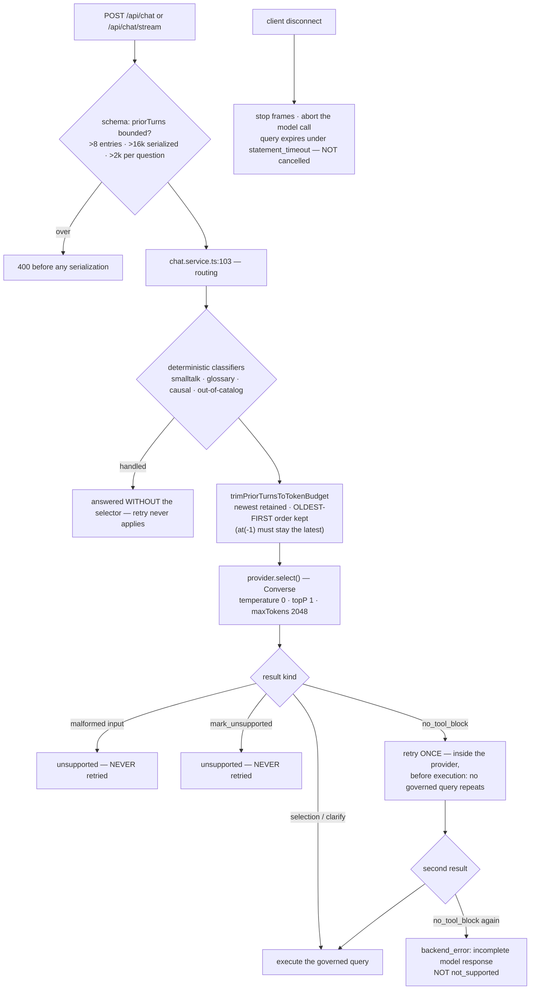

# Cold-read grill — gate: task — task plan assistant-bounded-generation

You did NOT write what follows. Read it cold, as an adversary trying to break the handover, never as its author defending it. You are READ-ONLY: return findings, change nothing.

## Interrogation technique

Run the interrogation this way. The harness contract above is the floor; this is the technique.

---
name: grilling
description: Grill the user relentlessly about a plan, decision, or idea. Use when the user wants to stress-test their thinking, or uses any 'grill' trigger phrases.
---

Interview the user relentlessly until you reach a shared understanding. Map this as a **design tree**: every decision branches into the decisions that hang off it.

Work the tree in **rounds**. The **frontier** is every decision whose prerequisites are already settled: the questions you can ask _now_ without guessing at answers you haven't heard yet. Ask the whole frontier in one round: number each question and give your recommended answer. Then wait for the user's answers before the next round.

Format a round like so:

```
❓ **Q1** - **<question title>**: <question body, might be multiple paragraphs, including multiple choices>

➡️ <your recommended answer>

---

❓ **Q2** - **<question title>**: <question body, might be multiple paragraphs, including multiple choices>

➡️ <your recommended answer>
```

Each round the user answers reshapes the tree: settled decisions push the frontier outward and unblock questions that depended on them. Recompute the frontier and ask the next round. A question whose answer depends on another question still open in this round belongs to a _later_ round, not this one.

Finding _facts_ is your job, never the user's. When a frontier question needs a fact from the environment (filesystem, tools, etc.), dispatch a sub-agent to find it; don't ask the user for anything you could look up yourself. Don't block on it: a running exploration is an unsettled prerequisite, so only the questions downstream of it wait for the sub-agent to report; ask the rest of the frontier now. The _decisions_ are the user's: put each to them and wait.

The session is done when the frontier is empty: every branch of the design tree visited, nothing left silently assumed. Do not act on it until the user confirms you have reached a shared understanding.


## Harness grill contract

# Griller Prompt — adversarial handover interrogation

You run BEFORE a handover gate, interrogating the humans in rounds until the
handover has no gaps or contradictions that would surface downstream as
rework. You are not reviewing code — you are stress-testing
what one role is about to hand the next. The gate scripts REFUSE without
your fresh, passing record.

**Independence is the whole point.** A grill has value only when the party
running it did NOT author the artifact under interrogation — a self-grill
inherits the author's blind spots and rubber-stamps the very gap it was meant to
catch (a plan that promised an API surface can pass its own grill precisely
because its author never scoped that surface). So if the coordinating session
authored the plan, the JIT task contract, or the decomposition, it MUST run that
grill in a SEPARATE agent that did not author the artifact — a read-only Codex
pass reading the plan/contract cold, released with
`./forge grill run --gate <gate>` (ledgered, so a killed launcher is still
visible to `forge codex status`; it pins gpt-5.6-terra @ xhigh from
harness.yaml) — rather than certify its own work inline. Codex on `gpt-5.6-terra` @ xhigh
is the required cold reader for planning grills: a fresh model context fully
independent of the authoring session, and because it is read-only it never
writes, so the write-lock that gates the write companion does not apply. Do NOT
use a Claude sub-agent for the grill, and never grill your own work inline.
Interrogate as an adversary trying to break the handover, never as its author
defending it.

RELEASE IT THROUGH THE HARNESS. `./forge grill run --gate <gate>` composes the cold-read brief (this contract plus the artifact) and releases Codex through the SAME ledgered launcher a delegation uses: the pid is recorded before the wait, so a grill whose launcher is killed still shows up in `forge codex status` instead of vanishing. It is read-only, so it takes no delegation lock and can never satisfy `stage done`. Recording the gate stays yours — the cold read only returns findings.

The technique is Matt Pocock's `grilling` skill — the design tree, the
frontier, numbered questions with recommended answers. `doctor --fix` installs
it into BOTH runtimes, and `./forge grill run` also inlines it into the brief,
so a reader reaches it whether or not its runtime resolves skills. This
contract is the harness-side floor; `grilling` is the technique.

`grill-me` is the HUMAN entry point — you type `/grill-me` and it redirects to
`grilling`. It carries `disable-model-invocation: true`, so no model invokes it
and none should be told to.

WHICH RUNTIME CAN RECORD WHICH GATE — get this wrong and you will chase a
refusal you cannot satisfy. ALL SIX gates match the AskUserQuestion ledger and
are therefore CLAUDE-ONLY, each with a floor of ONE logged round: `--gate spec`,
`--gate signoff`, `--gate epics`, `--gate requirements`, `--gate plan` and
`--gate task` — the floors live in `grill_gates.GATES`, one row per gate.
`signoff` and `epics` used to sit outside that check and so recorded with ZERO
rounds behind them; they now answer to it like every other gate.

ONE round is a FLOOR, never a target. Keep going until a round comes back clean
AND the next one stays clean — a single quiet round after a noisy one is a
coincidence, not convergence. The ledger files are written ONLY by `post_tool_use.py` on a
Claude Code AskUserQuestion event; `.codex/hooks.json` registers no PostToolUse
hook, so Codex cannot produce them and neither can a subagent. Delegating a
ledger-matched grill to Codex returns a well-formed payload that the recorder
then refuses, with nothing you can do to satisfy it — the payload was never the
problem, the runtime was.

For those four ledger-matched gates, independence is a COLD READ,
not necessarily a separate process. The recorder accepts ONLY rounds that match a
logged AskUserQuestion record (`record_grill_from_json.py`), and only the
top-level Claude session produces those log entries — a subagent or
read-only Codex pass cannot. So for those grills the top-level session drives
the rounds through AskUserQuestion itself — but because the coordinating session
authored the plan, the independent cold-read pass is MANDATORY, not optional: on
EVERY round release a fresh READ-ONLY Codex pass with
`./forge grill run --gate <gate> [--task <id>]` that reads the plan/contract
cold and returns findings — never a
Claude sub-agent, never grill your own work inline — then carry ALL of those
findings into your own AskUserQuestion rounds (the recorder rejects rounds not in
the ledger, so the top-level session must still ask). Read cold, as an adversary
who did not write it.

ONE COLD READ PER GATE — put every question to the human INSIDE it. The old
shape was Codex grill → your rounds → amend → Codex grill AGAIN, looping until
clean. That loop cannot converge: a fresh reader has no memory of what the last
one found, so it returns a DIFFERENT frontier rather than a shorter one, and the
artifact you amended to close round one becomes round two's input. Stories
reached eleven, twenty-six and forty rounds that way; the last cost six hours.
`forge grill run` now REFUSES a second unconstrained read on a gate that has
already been read since its last recorded pass.

So the WHOLE grill is:

1. `./forge grill run --gate <gate>` — one cold read. WATCH it.
2. Clean? Record the pass and approve. Nothing else happens.
3. Otherwise resolve every finding the REPOSITORY answers yourself — open the
   file and settle it. Take to the human only what the repository cannot
   answer: a decision nobody has made, a priority, a tradeoff between two
   workable shapes. Put those through AskUserQuestion with your recommended
   answer first, all of them, now. There is no later round to save the hard
   ones for, and a finding is not a menu.
4. Amend the artifact ONCE, to what they decided.
5. Record the pass against the AMENDED version, then approve exactly once.

The price is stated plainly, twice over: nothing independent re-reads the
amended version, and a gap this reader misses is not caught by a second reader
at this gate. Both surface at the next gate, or in review. That is the trade
for ending a loop that was costing whole days.

If the human's answers changed the artifact's SHAPE — a component dropped, a
different approach chosen — the amended artifact is not the one that was read
in any useful sense. Say so and read again: `./forge grill run --gate <gate>
--reread "<what changed shape>"`. It is a choice with a recorded reason, not a
way around the rule, and the five-read cap still backstops it. (EVERY gate is ledger-matched — signoff and epics no
longer excepted — so no gate can be recorded by a read-only Codex grill alone:
the top-level session asks the round and records it.)

FRESH CONTEXT, AND THE ANSWERS SO FAR. Every round is a NEW read-only Codex
session — that independence is the whole point. But a reader that knows nothing
of the earlier rounds does not re-find the same gaps, it finds DIFFERENT ones,
so the rounds never shrink and the grill has no natural end. `./forge grill run`
therefore carries every question already put to the human and the answer they
chose, read from the ledger the recorder validates against.

That gives the reader two obligations: do not re-raise settled questions, and
CHECK EACH ANSWER — that the artifact honours it, and that it contradicts no
other answer, accepted decision or constitution rule. An answer can be wrong, or
right and never applied; saying so is part of the read.

Do NOT tell the reader where to concentrate. A cold read is worth having because
it is unconstrained, and steering it toward the diff is how the thing nobody
looked at survives every round. More information, no direction.

END EVERY ROUND WITH AN EXPLICIT CONVERGENCE VERDICT, on its own line, so the
coordinator never has to guess whether to grill again or approve:

- `CONVERGED — no gaps, no contradictions, plan unchanged since the last round`
- `NOT CONVERGED — <the specific reason: open gaps, a contradiction, or the plan
  changed after the last clean round>`

`CONVERGED` on the cold read means there is nothing to amend: record and
approve. `NOT CONVERGED` does NOT mean read again — it means resolve what the
repository answers, put the rest to the human, amend once, and record the pass
against the amended version. Approval happens exactly once.

Five gates, five scopes:

- `--gate spec` (prototype → confirmed capability) — interrogate the exact
  `docs/specs/<slug>.md` file against BRIEF, architecture, decisions, and the
  prototype. Hunt: behavior the prototype proved but the spec omitted,
  implementation choices masquerading as requirements, vague acceptance
  language, and conflicts with active decisions.
- `--gate signoff` (client → PM, before `record_signoff.py`) — interrogate
  `docs/product/DISCOVERY.md`, `BRIEF.md`, confirmed specs, the spec-linked
  roadmap, `docs/decisions/`, and prototype notes. Hunt: unanswered
  stakeholder/constraint questions, scope
  the client saw vs. scope the BRIEF claims, decisions that contradict the
  BRIEF, acceptance criteria that are vibes instead of checks, non-functional
  requirements nobody asked about (auth, data retention, environments).
- `--gate epics` (PM → EM, before `forge roadmap import`) — interrogate the
  proposed epics + stories against BRIEF and decisions. Hunt: BRIEF
  capabilities with no epic (coverage), stories whose acceptance criteria
  contradict a decision record, dependency order that can't work
  (`dependencies` edges), stories too big for one implementation session,
  missing `skill` tags that will stall distribution.
- `--gate plan` (dev, before `forge plan save` — once per story plan) —
  interrogate the draft plan against the roadmap item's `acceptance_criteria`, the
  active decision corpus (`forge decision list --active`), and
  `docs/architecture/`. Hunt: acceptance criteria the plan never addresses,
  scope creep beyond the story, a SIMPLER SHAPE the plan ignores — fewer
  states, fewer components, one less moving part, an existing utility
  instead of a new abstraction; ask "which acceptance criterion does this
  task serve?" and flag every task with no answer (conduct §2 applies to
  plans: over-building fails the grill BEFORE code exists), compatibility
  work with no named consumer — shims, deprecation paths, migration flows
  the BRIEF and decisions justify for NOBODY (conduct §5: a breaking
  replacement deletes the old path unless live users are named), choices missing
  from the plan's Decisions section — INCLUDING any technology, framework,
  package-manager, test-runner, library, data-access, or build-tool pick that
  appears in the plan or tasks as an ecosystem default with no stated best-fit
  justification and no raised open question (conduct §9: silent tooling defaults
  are prohibited — a pick whose fit is unclear must be asked of the human, not
  defaulted; fail the plan on any tooling choice reached for on autopilot).
  Also flag a MISSING quality-gate baseline: any codebase the plan touches must
  wire a stack-APPROPRIATE static-analysis gate — a linter AND formatter, plus a
  type-checker where the language has one — into CI/verify, not merely a test
  runner. Name the CAPABILITY, never a fixed tool: ESLint/Biome for JS-TS,
  Ruff/flake8 for Python, golangci-lint for Go, Clippy for Rust, Checkstyle/
  Spotbugs for Java, and so on — the requirement is generic to every backend, not
  one ecosystem's tool. Fail the plan when code ships with no configured lint/
  format/static-analysis gate that an automated check enforces on every push; an
  absent linter is a silent quality default exactly like an unjustified tool pick.
  Also hold the plan against the CONSTITUTION's coding standards
  (`constitution/README.md` index — read the references it maps to the plan's
  surfaces). The constitution is law, so a plan whose SHAPE omits or contradicts a
  mandated standard is a GAP, not a style preference: HTTP surfaces with no typed
  request AND response DTOs (`pnp-api-standards`, `pnp-swagger-api-documentation-
  standards`), a module ignoring the modular-monolith layout or file-suffix
  standards (`pnp-coding-standards-modular-monolith`, `03`), missing structured
  logging (`05`/`06`) or domain exception handling (`07`), an external integration
  that skips the provider/port pattern (`08`, `pnp-provider-pattern-for-
  integration`), or database work ignoring `pnp-database-standards`. Flag each and
  require the plan to conform or record a deliberate, written deviation — never
  wave it through as "the implementer will follow standards later"; a plan must not
  design AGAINST the law. (`constitution/` is on disk in every environment, so the
  read-only Codex cold-read has the law available — hold the plan to it.)
  Reconcile the plan explicitly against
  EVERY ID from `forge decision list --active`; a conflict becomes a
  contradiction signal or a superseding decision, never a silent exception.
  Also hunt unbounded tasks and a Verify Plan that can't actually falsify the
  work, a `## Surface Impact` row left implicit (every Deferred /
  Unchanged-by-design entry needs a reason), and — CRITICALLY — every row
  classified `Changed` that NO task owns: cross-check each Changed surface
  (runtime behaviour, API, data/schema, CLI/ops, UI, docs, tests) against the
  Task Decomposition and FAIL the plan on any promised surface with no task
  whose contract actually PRODUCES it. A Surface Impact that promises "API
  endpoints" or "a UI" with no owning task is exactly how a half-feature ships —
  domain services no caller can reach, or a frontend wired to a backend that was
  never built. Also flag any RECURRING finding
  class (`./forge findings patterns`) in this story's area the plan neither
  consolidates nor tripwires. In Claude Code the
  `/grill-me` skill run against the plan satisfies this contract. The payload
  carries `"issue"`; the recorder stamps it against the active task.
- `--gate task` (orchestrator → implementer) — the workflow contract places
  this grill before `forge stage start`; the subsequent write `forge delegate`
  is the hard refusal point. Interrogate the next leaf task's just-authored
  contract in the re-recorded decomposition against the approved story plan,
  active decisions, and the actual repository state left by completed prior
  stages. Hunt: assumed files or APIs that prior work did not produce, a
  `write_scope` whose AREAS miss where the work must land or reach into areas
  the task has no business in (scope is directory prefixes plus named new
  files — a missing existing file under a declared prefix, a drifted line
  number or a renamed module is a NON-BLOCKING note, never a blocking finding;
  `stage done` measures the exact paths), acceptance criteria not served by the proposed
  work, a task that OWNS a plan `## Surface Impact` surface but whose
  `write_scope`/`required_tests` do not actually PRODUCE it (owns the API row but
  builds only domain services with no HTTP controllers/DTOs/routes; owns the UI
  row but ships no components) — reachability is part of "done", not a later
  task's problem, required tests that do not prove those criteria, verify commands that
  cannot falsify the change, reviewer focus that misses the risky seam OR that
  re-states shape rules the constitution already sets instead of CITING the
  load-bearing `constitution/` references for the task (the contract points at the
  law, never re-derives or contradicts it), and a
  `user_facing` flag that misclassifies the task — a UI task left `false` (its
  mandatory design skills and design review would be skipped) or a backend task
  marked `true` (forced to attest UI design skills it has no use for).
  This is the JIT task-planning gate from decision 0032, not a repeat of the
  story-level plan grill. Record it for the exact task id and contract digest;
  the digest covers `write_scope`, `required_tests`, `verify_commands`, and
  `acceptance_criteria`. A changed field makes the old task grill stale, and a
  write delegation refuses it; read-only delegation is unaffected.

Method:

1. Read the artifacts in scope FIRST; derive your question list from actual
   text, citing it (`BRIEF.md says X; decision 0003 says Y — which wins?`).
2. Interrogate in ROUNDS until the frontier is empty — not one pass. Each
   round, put the questions whose prerequisites are already settled to the
   human (PM or EM) with your recommended answer; their answers reshape the
   tree and unblock the next round's questions. Stop a single question when it
   would only confirm what a document already states; stop the grill only when
   no gap or contradiction remains unasked. In Claude Code, deliver each
   round's frontier through the AskUserQuestion tool (recommended answer
   first), not prose. For every ledger-matched gate (`spec`, `requirements`,
   `plan`, `task`) the recorder requires
   the FINAL round in the payload to carry `"frontier_empty": true` — that flag
   is how it confirms you stopped because the frontier closed, not because you
   ran out of patience; it is set by hand on the last `rounds` entry, never by
   the ledger. A zero-gap contract still needs at least one such round (every
   gate's floor is 1, and a floor is not a target), so ask a genuine closing
   question
   (e.g. "any remaining gap before we hand off?") and mark it `frontier_empty`.
3. Every finding lands somewhere real before the verdict: a doc edit, a
   `./forge decision new <slug>` record, or an explicit non-blocking entry
   in `open_items`. An `open_items` entry that PARKS scope also gets a
   deferral row with a revisit trigger (`./forge defer add`) — parked scope
   without a trigger is scope silently dropped. Unresolved blocking
   findings ⇒ verdict `blocked`.
4. Record the outcome (schema: `factory/schemas/grill.json`,
   `"generated_by": "griller"`):

   A task-grill input uses this recorded shape (the recorder adds its own
   task id, digests, commit, and timestamps):

```json
{
  "generated_by": "griller",
  "verdict": "pass",
  "gaps": [],
  "contradictions": [],
  "resolutions": ["What was sanctioned"],
  "inspected_refs": ["path/or/path:symbol"],
  "current_flow": "What the repository does now",
  "criteria_map": {"criterion": "proof"},
  "decision": "keep",
  "new_abstractions": ["None"],
  "rounds": [{"question": "Finding or choice", "options": ["Recommended", "Alternative"], "chosen": "Recommended", "frontier_empty": true}],
  "citations": [{"finding": "Repo-answerable finding", "source": "path:symbol"}],
  "open_items": []
}
```

   Each `rounds` entry has a non-empty `question`, two to four non-empty
   string `options`, and a `chosen` value equal to one option. Each citation
   is `{finding, source}`. Every string in `gaps` must be covered by an equal
   `rounds[].question` or `citations[].finding`.

   For every gate — all six are ledger-matched — extra recorder rules bind
   (this is what makes an otherwise well-formed payload fail):
   - Rounds must match the AskUserQuestion ledger and meet the gate floor
     (1 for every gate, and a floor is not a target); the final round carries
     `"frontier_empty": true`. A
     zero-gap grill still records its floor of real rounds — never zero.
   - `--gate task` only: `criteria_map` is a THREE-WAY equality — its KEYS must
     equal the frontier task's `acceptance_criteria` set AND the set of its
     `plan_contracts[].statement` values, exactly (no extra key, none missing);
     each value is the non-empty proof for that criterion. Author the task's
     `acceptance_criteria` and its `plan_contracts` statements as the SAME
     strings so there is one coherent key set to satisfy.

```bash
python3 factory/scripts/record_grill_from_json.py --gate <spec|signoff|epics|requirements|plan|task> --input <json> [--input-digest <artifact>] [--task <id>]
```

5. For every gate except task, commit the resolution edits
   BEFORE recording the grill — those gates check freshness against BOTH
   committed history and the working tree: any guarded doc changing after the
   grill (even uncommitted) stales it. (The sign-off / epics-approved decision
   records themselves are expected afterwards and don't stale it.) The task
   gate instead binds directly to the re-recorded task contract digest; the JIT
   sequence does not require a commit between re-recording and grilling. But that
   digest still folds in the product tree, so record the task grill LAST — after
   any docs/ or factory/scripts commits: a tracked change outside .factory/ and
   plans/ that lands between grilling and `task approve`/`stage start` re-stales
   it and forces a re-grill.
6. `--input-digest` is REQUIRED for the spec, epics, and plan gates: pass the
   exact spec / roadmap input / plan draft you interrogated. The gate verifies the
   digest — grilling version A never approves an edited version B; if the
   artifact changes, re-grill it. For `--gate task`, pass `--task <id>` and NO
   `--task-digest` — that flag was removed and the recorder rejects it; the
   recorder derives the grounding digest itself from the protected contract,
   approved plan, and product tree, and stores the result at
   `.factory/grills/tasks/<id>.json`.

A `pass` with unresolved findings is refused by the recorder. Grill hard;
downstream implementation inherits whatever you let through.


## Lessons already in force for these paths

The plan must design AROUND these. A plan that ignores one is not merely unlucky later — it is wrong now, and saying so is part of this read.

- A required_tests entry must name a REAL leaf test (id = the string in test("...")), not the file path, and must pin TS_NODE_PROJECT=backend/tsconfig.json because forge runs it from repo root; otherwise junit-run's --test-name-pattern matches nothing and ts-node skips the workspace tsconfig, so the gate reports pass without running assertions. Always verify with a negative control (a required test whose negative control cannot fail is not proof).
- The demonstrated warehouse proof must RUN migrate + the fixture against the warehouse DB via a committed, re-runnable warehouse:proof script that EXERCISES IngestionRepository's atomic candidate-load-then-flip; a hermetic test that only greps seed-proof.sql text is false-green. Do NOT build a controller/API here (that is the actuals-loader task) — exercise the repository directly.
- The D-0008 live warehouse proof must be a COMMITTED, reviewer-visible DB-backed test (e.g. backend/src/warehouse/warehouse-proof.db.test.ts calling proveWarehouse, registered in the backend package.json test:db script) so the required execution is provable from the diff itself — a tests.json narrative alone is invisible to the cold-diff reviewer and reads as an absent D-0008 record.
- Put the DB-backed warehouse proof in its OWN file backend/src/warehouse/warehouse-proof.db.test.ts registered ONLY in test:db (and the db list of tools/quality-gate.test.mjs); keep warehouse-schema.test.ts hermetic-only. NEVER register one test file in both test:hermetic and test:db — tools/quality-gate.test.mjs asserts exactly one suite per file and fails the whole verify if a file appears twice.
- SUPERSEDES the separate-file guidance for warehouse-schema: its write_scope does NOT include warehouse-proof.db.test.ts, so do NOT create that file. Keep the DB proof test INSIDE backend/src/warehouse/warehouse-schema.test.ts gated by WAREHOUSE_DB_TEST=1 (skips under plain test:hermetic, runs the migrate + IngestionRepository proof when the env + WAREHOUSE_PG_* are set), registered ONLY in test:hermetic. REMOVE warehouse-schema.test.ts from the test:db script and the db-list in tools/quality-gate.test.mjs, and drop the WAREHOUSE_DB_TEST env added to test:db — quality-gate requires each test file in exactly ONE suite and fails verify otherwise. This is the ONLY remaining fix.
- tools/quality-gate.test.mjs validateIgnoredBaseline asserts .prettierignore's non-comment lines deep-equal the keys of its ignoredBaselineHashes map. So when D-0006 requires removing a file (e.g. backend/src/db/migrate.ts) from .prettierignore, you MUST also remove that path's entry from the ignoredBaselineHashes map in tools/quality-gate.test.mjs (both in write_scope) in the SAME change, and ensure the now-unignored file is prettier-formatted so format:check passes. Keep .prettierignore and ignoredBaselineHashes in sync.
- autoreview blocks a PROOF task whose gated WAREHOUSE_DB_TEST=1 leaf is registered only in test:hermetic (where it self-skips) — from the diff there is no registered command that RUNS it. Add the gated test file to backend/package.json test:db (the DB-backed suite a Postgres/warehouse runner executes with WAREHOUSE_DB_TEST=1), alongside the committed tests.json execution record + the pinned host command in the plan. This makes the execution path provable from the diff itself; the demonstrated-host-evidence model (decision 0009 / D-0008) is unchanged — CI without a warehouse container still skips it.
- Registering the gated reconciliation test in test:db is NOT enough: test:db does not set WAREHOUSE_DB_TEST=1, so the leaf still self-skips there and autoreview reads it as an unrunnable proof. FIX: add a dedicated backend package.json script 'test:warehouse-proof' that itself sets WAREHOUSE_DB_TEST=1 and runs backend/src/warehouse/reconciliation.repository.test.ts (the WAREHOUSE_PG_*/PGHOST/PGPORT connection env is still supplied by the host/operator, NOT hardcoded), and REMOVE the file from test:db (it is a warehouse-DB test, not an app-DB test). Then the registered command actually EXECUTES the proof when run against a warehouse; the pinned host command in tests.json becomes 'WAREHOUSE_PG_*... npm --prefix backend run test:warehouse-proof'. Keep it in test:hermetic too (self-skips there). Still demonstrated-host-evidence (decision 0009/D-0008), NOT CI-enforced.
- The reconciliation D-0008 gated leaf TRUNCATEs ingest_batch + sap_transaction CASCADE on whatever DB WAREHOUSE_PG_* points at. Guard it: BEFORE truncating, assert the warehouse host (WAREHOUSE_PG_HOST) is loopback/local (127.0.0.1, ::1, or localhost) and THROW a clear error refusing to run against a non-local warehouse — so a misconfigured WAREHOUSE_PG_* can never wipe a shared/production warehouse. Also fix the P2: tools/quality-gate.test.mjs wrapping the declared test lists in new Set removes the gate's exactly-one-suite detection (a file registered in two suites is silently deduped) — compare with duplicate detection preserved (e.g. detect duplicates before dedup, or assert no file appears in more than one suite) instead of Set-then-compare.
- Not a defect (Decisions): Factually incorrect and contradicts the settled D-0008 model. (1) tests.json IS committed at f9c6b1d with the full host-execution record: 'npm --prefix backend run test:warehouse-proof -> tests 7 / pass 7 / fail 0 / skipped 0' plus a dead-port negative control (fail 2, ECONNREFUSED). The reviewer cannot see it only because the review bundle deliberately excludes .factory bookkeeping ('review tip excludes 9 harness bookkeeping paths; the bundle is the product delta only') - not because it is absent. (2) The runnable command that executes the proof (test:warehouse-proof, serialized) IS in the product delta at backend/package.json, and the gated test is committed and reviewer-visible. (3) The security lens accepted this identical evidence and approved. (4) The story plan Decisions section settles that the DB-backed warehouse proof is DEMONSTRATED HOST EVIDENCE (D-0008), not CI-enforced execution. — raised as "[P1] Commit the required host-execution evidence for the new proof (backend/package.json:19): The new `test:warehouse-proof` command is registered, but the chan"
- A review may flag editing backend/src/db/migrate.ts as needing the D-0006 de-ignore ritual (remove from .prettierignore + drop its ignoredBaselineHashes entry). This is FALSE for migrate.ts: it is NOT listed in .prettierignore (only migrate.trim.test.ts is), it is NOT a key in tools/quality-gate.test.mjs ignoredBaselineHashes, and Checking formatting...
All matched files use Prettier code style! passes clean. Task 2 (composed-relation, merged PR #21) edited migrate.ts to seed the 'report' action WITHOUT any D-0006 de-ignore and merged green. So editing migrate.ts requires NO .prettierignore or quality-gate baseline change — do NOT add/remove it there. The stale D-0006 deferral text lists ~71 historically-drifting files; migrate.ts has since been de-ignored, so a finding treating it as still-ignored contradicts the actual repo state and is not a defect.
- Unlike migrate.ts (which is NOT ignored), backend/src/chat/chat.service.ts IS a D-0006 vendored file: it is listed in .prettierignore AND is a key in tools/quality-gate.test.mjs ignoredBaselineHashes with a pinned baseline hash. The quality-gate test 'the four FACTORY commands ... / D-0006' fails with 'chat.service.ts changed while still excluded by D-0006' whenever its content changes but it stays ignored. FIX per the D-0006 protocol: (1) ensure the file is prettier-clean (npx prettier --write if needed), (2) REMOVE the 'backend/src/chat/chat.service.ts' line from .prettierignore, (3) REMOVE its '<hash> backend/src/chat/chat.service.ts' entry from the ignoredBaselineHashes map in tools/quality-gate.test.mjs — all in the same change. Do this for ANY D-0006-ignored file a task edits; check membership with  and . (.prettierignore is editable by the worker and is recorded via stage amend-scope at stage done.)
- BLOCKING security defect. selectionExecutor.ts:110-111 authorizes a selection by checking that the user's permissions cover every measureId and dimensionId in it - that is the governed model decision 0016 rests on. But sqlBuilder's statement branch calls buildStatementProjection(user, {from,to}, resolvedScope) WITHOUT the selection, so it always projects leaf_key, month and every financial measure regardless of what was selected and authorized. The SQL therefore returns more than the grant covered. Pass the selection into the statement projection and project ONLY its measureIds and dimensionIds, exactly as the non-statement branch does at sqlBuilder.ts:50 onward - an unknown measure must still throw. Add a test proving a selection naming a subset of measures produces SQL projecting only that subset.
- SelectionExecutor runs a SECOND ungrouped query (totalsFor) whenever a selection names any dimension - selectionExecutor.ts:84-87. The statement selects leaf_key, so it would issue two queries per period block, four in all, contradicting its once-per-range criterion; and those totals are unused because the statement derives its grand total by folding leaves per decision 0020. backend/src/chat/selectionExecutor.ts is AUTHORIZED in scope for statement-api to gain a MINIMAL additive includeTotals option that DEFAULTS TO TODAY'S BEHAVIOUR, with mis-statement.service.ts passing it false. Do not change totalsFor, do not change the default, and the composed executor tests must pass unchanged - every other consumer still relies on the automatic totals.
- A top-level optional value narrowed after declaration is not kept narrowed inside later callbacks; resolve and validate it in an IIFE so the exported const is inferred as non-optional.
- tools/junit-run.mjs exits 0 and emits a testcase named after the FILE PATH when --name matches no leaf (D-0024), so a missing-name negative control cannot fail and is not the gate. The gate is that each report's testcase name equals the required leaf id verbatim - a report naming the file path asserted nothing. Verified both halves by hand: a real leaf name yields a testcase named for the leaf, a bogus one yields a testcase named backend/src/mis/mis-drill.service.test.ts. junit-run.mjs stays out of scope for feature tasks; fixing it is D-0024's own trigger.
- backend/src/chat/chat.sse.test.ts is now in this task's write_scope. It is mechanically implied by criterion t-aga-c5: making AskResponse.viewInReport a REQUIRED discriminated union forces every construction site of an AskResponse to supply it, and that test is one. Keep the field required - do NOT revert it to optional. The task grill demanded the union precisely because an absent optional field cannot carry the 'unavailable, and here is why' case, which is the whole point of the field. chat.sse.test.ts is also listed in .prettierignore, so D-0006 applies to it as it does to chat.controller.ts and smalltalk-guard.ts: format it and remove its entry in the same change. Nothing else about the contract changes.
- Two quality-lens P1s asked this task to implement frontend consumption of viewInReport and a client-side prior-turn store. Both are OUT OF SCOPE by the approved plan: assistant-governed-ask is declared user_facing: false and its Surface Impact lists no frontend path; the approved decomposition gives the docked Ask panel and the standalone Ask page to assistant-ask-surfaces (task 2), which owns rendering the link, its stale and absent states, and holding the thread in client state. WORKFLOW.md forbids a task spanning backend and frontend, so implementing them here would violate the decomposition the human approved. A backend task that lands a wire contract its consumer has not been written yet is the normal shape of a sequenced story, not a leftover. Do not re-raise these against this task.
- A security-lens finding claimed this patch must remove chat.service.ts from the D-0006 ignore baseline. It is not in that baseline. Verified three ways on 2026-09-12: 'grep chat.service.ts .prettierignore' returns nothing (the file lists chat/ambiguity.ts, chat.constants.ts, chat.controller.ts, chat.sse.ts, chat.sse.test.ts, smalltalk-guard.ts, suppression.ts and timeWindowParse.ts, but NOT chat.service.ts); it is absent from ignoredBaselineHashes in tools/quality-gate.test.mjs; and 'npx prettier --check backend/src/chat/chat.service.ts' reports it already conforms. There is nothing to remove and no baseline hash to update. D-0006 DOES apply to chat.controller.ts, smalltalk-guard.ts and chat.sse.test.ts, which this task edits and which ARE listed. Read .prettierignore rather than assuming a sibling file shares its neighbours' status.
- node_modules is fully installed in this worktree as of 2026-09-12: zod, typescript-eslint, prettier and recharts all resolve. The orchestrator ran npm install from the host, because a freshly created task worktree starts without node_modules and the sandbox can neither reach the registry nor read the host cache. No product file changed - node_modules is gitignored. Run the five verify commands directly and do NOT attempt npm install, npm ci or any --offline retry; those will fail in the sandbox and are not yours to fix. If a package is genuinely missing, raise a signal naming it rather than trying to install it.
- node_modules is fully installed in THIS worktree as of 2026-09-12: the orchestrator ran 'npm ci --offline --cache /Users/caw-dev-m4-5/.npm' from the host, because forge task start cuts a fresh worktree with no node_modules and the sandbox can neither reach the registry nor read the host cache. Verified after installing: tsc and recharts resolve, esbuild 0.25.12 runs despite skipped install scripts, npm run build:contract compiles, and npm run test:frontend passes 56 tests across 14 files. No product file changed - node_modules is gitignored, so no degraded window was needed. Run the five verify commands directly and do NOT attempt npm install, npm ci or any --offline retry; those are not yours to fix. If a package is genuinely missing, raise a signal naming it.
- backend/src/db/migrate.exploration.db.test.ts cannot reach 127.0.0.1:5432 from the sandbox (EPERM), which is the D-0008 demonstrated-host-evidence model working as designed, not a defect in the test. The orchestrator ran it from the host on 2026-09-12 against the app-db container: tests 1 / pass 1 / fail 0 / skipped 0, with a dead-port PGPORT=5599 control failing the same leaf on ECONNREFUSED, so the pass is real and not a silent skip (D-0024, D-0031). Do NOT weaken the assertions, add a self-skip guard, or point the test at a mock to make it green in the sandbox - and do not retry it there. The leaf stays in quality-gate.test.mjs dbTests and backend/package.json test:db; the host execution is recorded in tests.json as demonstrated evidence.
- node_modules is fully installed in THIS worktree as of 2026-09-12, BEFORE delegation: the orchestrator ran 'npm ci --offline --cache /Users/caw-dev-m4-5/.npm' from the host, because forge task start always cuts a fresh worktree without node_modules and the sandbox can neither reach the registry nor read the host cache. Verified after installing: tsc resolves and npm run test:frontend passes 56 tests across 14 files. No product file changed - node_modules is gitignored, so no degraded window was needed. Run the verify commands directly and do NOT attempt npm install, npm ci or any --offline retry; those fail in the sandbox and are not yours to fix. If a package is genuinely missing, raise a signal naming it rather than trying to install it.

## The contract as recorded (authoritative over any copy in the plan)

## Contract (recorded)

Rendered by the harness from the recorded decomposition; edit the decomposition, not this block. It is excluded from the plan's approval and grill digests, so a re-render never stales either.

**Objective.** Fix the reported latency at its measured cause: the selector Converse call sends no maxTokens, so a follow-up question can generate 24,313 output tokens over 214 seconds for a job that needs about 110. Add the cap, give the provider a no_tool_block discriminant so a guarded single retry cannot mask a genuine refusal, bound the priorTurns request for server resource safety, and wire bounded server-side cancellation. Backend only - the streaming client, the pill and the dock are task 3.

**Acceptance criteria**

- The selector Converse request carries an explicit maxTokens of 2048, asserted on the request object the provider builds rather than inferred from timing. backend/src/llm/bedrock.provider.ts:394 sends only { temperature: 0, topP: 1 } today, and that omission is the whole of the reported defect: measured against Bedrock with the real system prompt, the real three-tool schema, the same question and one prior turn, the uncapped call took 214,222ms and emitted 24,313 output tokens while maxTokens 2048 took 1,429ms and emitted 168, stopping at stopReason tool_use rather than max_tokens - so the cap ends the runaway WITHOUT truncating. 2048 is about 18x a real selection (~110 output tokens) and about 8 percent of the observed runaway; 512 and 2048 measured identically, so the value is headroom, not tuning.
- A selector response with NO TOOL BLOCK is retried at most once, and the retry cannot mask a genuine refusal. Today mapBedrockToolUseToSelectionResult (bedrock.provider.ts:227) collapses three different outcomes into one {kind:'unsupported'}: absent tool use, malformed tool input, and a valid mark_unsupported. The result type therefore gains an explicit kind 'no_tool_block' distinct from 'unsupported', carried through the LlmProvider port (llm.interface.ts:36) and its mock implementation, so the retry can tell 'the model emitted nothing usable' from 'the model correctly refused'. Malformed input and mark_unsupported are NEVER retried. The retry runs INSIDE the provider boundary, before chat.service reaches execution, which makes 'no repeated governed query' structural rather than promised. At most TWO selector calls per question; a second tool-less response answers backend_error naming an incomplete model response and NEVER not_supported, which would assert the untrue thing this task exists to remove. Routing precedes selection (chat.service.ts:103), so deterministic smalltalk, glossary, causal and out-of-catalog paths never reach the retry and the settled 'the LLM selects, never authors' boundary is untouched.
- The request schema bounds prior turns as SERVER RESOURCE SAFETY - explicitly NOT the latency fix, which is C1. backend/src/chat/chat.schemas.ts:21 accepts an unbounded priorTurns array with unbounded per-question length today. It now rejects more than 8 entries, a serialized priorTurns payload over 16,000 characters, or any single prior question over 2,000 characters, all checked BEFORE serialization so nested selection fields cannot smuggle an oversized body past a count-only cap. The budget is exported as a named constant so the client can trim to the SAME number in task 3. trimPriorTurnsToTokenBudget (chat.service.ts:675) is KEPT unchanged in behaviour: newest turns retained, OLDEST-FIRST transport order preserved, because chat.service.ts:153 reads priorTurns.at(-1) as the latest turn and reversing the order would silently select the wrong one.
- Cancellation is wired on the server and is BOUNDED, not total - human-decided 2026-09-14 and stated plainly in the code so it is never later mistaken for a defect. The stream controller (chat.controller.ts) observes client disconnect, stops writing SSE frames, and aborts the model call through an AbortSignal threaded into the LlmProvider port. A warehouse query already in flight is NOT cancelled: it expires under the existing Postgres statement_timeout (postgres.adapter.ts:90, error 57014), and a comment at the seam says so, because true cancellation would need pg_cancel_backend on a side connection and was deliberately left out of scope. An expected abort is handled silently and is NEVER recorded as backend_error or written as a failed audit.
- The behaviour is proven by hermetic leaves: the built Converse request contains maxTokens; a tool-less response retries exactly once; malformed tool input does NOT retry; a valid mark_unsupported does NOT retry; a second tool-less response yields backend_error and not not_supported; the schema rejects an oversize array, an oversize serialized payload and an oversize single question; retained order is oldest-first; and a disconnect stops frame writes, aborts the model call and records no backend_error. Under D-0006, backend/src/llm/bedrock.provider.ts IS in .prettierignore (line 34), so this task formats it, removes that entry, and updates the quality-gate baseline map in tools/quality-gate.test.mjs in the same change - removing an ignore entry without formatting leaves format:check red, a ledgered lesson from the assistant story. New backend test files are registered in backend/package.json test:hermetic AND tools/quality-gate.test.mjs, or CI runs none of them; the partition assertion requires every backend test in exactly one group. Every artifact is judged by its junit testcase NAME and EXECUTED count, never an exit code (D-0024, D-0031).

**Write scope** (what `stage done` measures the diff against)

- backend/src/llm/bedrock.provider.ts
- backend/src/llm/bedrock.provider.test.ts
- backend/src/llm/llm.interface.ts
- backend/src/llm/llm.constants.ts
- backend/src/llm/mock.provider.ts
- backend/src/chat/chat.service.ts
- backend/src/chat/chat.service.test.ts
- backend/src/chat/chat.controller.ts
- backend/src/chat/chat.controller.test.ts
- backend/src/chat/chat.schemas.ts
- backend/src/chat/chat.schemas.test.ts
- backend/src/chat/chat.constants.ts
- backend/package.json
- tools/quality-gate.test.mjs
- .prettierignore

**Required tests** (run by `stage done`)

- `the selector converse request carries an explicit max tokens cap` -- `TS_NODE_PROJECT=backend/tsconfig.json TS_NODE_TRANSPILE_ONLY=1 node tools/junit-run.mjs --file {path} --name {id} --report {report} --require ts-node/register` (backend/src/llm/bedrock.provider.test.ts)
- `a response with no tool block retries once while a malformed input and a mark unsupported never retry` -- `TS_NODE_PROJECT=backend/tsconfig.json TS_NODE_TRANSPILE_ONLY=1 node tools/junit-run.mjs --file {path} --name {id} --report {report} --require ts-node/register` (backend/src/llm/bedrock.provider.test.ts)
- `a second response with no tool block answers backend error rather than not supported` -- `TS_NODE_PROJECT=backend/tsconfig.json TS_NODE_TRANSPILE_ONLY=1 node tools/junit-run.mjs --file {path} --name {id} --report {report} --require ts-node/register` (backend/src/llm/bedrock.provider.test.ts)
- `the request schema rejects an oversize prior turns array payload or question before serialization` -- `TS_NODE_PROJECT=backend/tsconfig.json TS_NODE_TRANSPILE_ONLY=1 node tools/junit-run.mjs --file {path} --name {id} --report {report} --require ts-node/register` (backend/src/chat/chat.schemas.test.ts)
- `trimming retains the newest turns in oldest first order` -- `TS_NODE_PROJECT=backend/tsconfig.json TS_NODE_TRANSPILE_ONLY=1 node tools/junit-run.mjs --file {path} --name {id} --report {report} --require ts-node/register` (backend/src/chat/chat.service.test.ts)
- `a client disconnect stops frame writes aborts the model call and records no backend error` -- `TS_NODE_PROJECT=backend/tsconfig.json TS_NODE_TRANSPILE_ONLY=1 node tools/junit-run.mjs --file {path} --name {id} --report {report} --require ts-node/register` (backend/src/chat/chat.controller.test.ts)

**Verify commands**

- `npm run build:contract`
- `npm run build:backend`
- `npm run typecheck`
- `npm run lint`
- `npm run format:check`
- `npm run test:hermetic`

**Review budget.** 15 files / 1400 lines -- One request field is the fix, but making its guard safe requires un-collapsing three outcomes in the provider result type and threading a new discriminant and an AbortSignal through the LlmProvider port and its mock. Plus schema limits checked before serialization, controller disconnect handling, six hermetic leaves, and the D-0006 formatting of a prettier-ignored file with its quality-gate baseline entry. No UI.

## Already answered on this story — verify, do not re-ask

These questions were put to the human and answered. Two obligations:

1. Do NOT raise them again as open questions. They are settled.
2. DO check each answer still holds — that the artifact actually honours it, and that it does not contradict another answer, an accepted decision, or the constitution. An answer can be wrong, or right and never applied. Saying so is part of this read.

- Q: Where should the 3F app be built, given we're adapting Pulse?
  A: Build in this 3oilpalm repo
- Q: Financial MIS statement — period columns for the PoC?
  A: July + FY 26-27 YTD
- Q: Financial MIS statement — Excel export fidelity?
  A: Clean structured export
- Q: Financial MIS statement — reconciliation / demo-ready bar?
  A: SAP totals = demo-ready; filled month = validated
- Q: SAP ingestion — how does data get in for the PoC?
  A: Excel upload now (SAP export/API later)
- Q: SAP ingestion — how are budgets brought in?
  A: Ingest budgets from the MIS format, as a separate object
- Q: SAP ingestion — grain & raw retention?
  A: Monthly gold + retain raw transaction lines
- Q: SAP ingestion — re-loading a period?
  A: Idempotent replace per period
- Q: Governed joins — how to handle rows in one object but not the other (Budget with no Actual, or Actual with no Budget)?
  A: Full-outer, zero-fill the missing side
- Q: Governed joins — where are 3F financial measures authored?
  A: In code (repo domain files)
- Q: Governed joins — RBAC on a joined query?
  A: Inject scope on both objects
- Q: Governed joins — correctness gate?
  A: Golden-answer fixtures required
- Q: Mapping master — Srihari's Master Table definition is still outstanding. How do we proceed?
  A: Build a provisional master now, reconcile later
- Q: Mapping master — how is it edited in the PoC?
  A: Seed / config file for the PoC (admin UI later)
- Q: Mapping master — selection with no mapping entries?
  A: Empty statement (zeros) + 'no mapping configured' notice
- Q: Drill-down — levels for the PoC?
  A: 2-level now (group → sub-lines → transactions), confirm with Srihari
- Q: Drill-down — showing individual transactions vs Pulse's aggregate suppression?
  A: Show individual lines within the user's RBAC scope, audited
- Q: Drill-down — line-item columns?
  A: Month, Debit, Credit, Value + reference, memo, posting date
- Q: Assistant/exploration — in the first PoC release, or a fast-follow?
  A: Include in the first PoC release
- Q: Assistant — LLM & data residency?
  A: Decide later
- Q: Platform base — how do we bring Pulse's code in?
  A: Snapshot-copy into the repo (own it)
- Q: Platform base — warehouse engine for the PoC?
  A: Postgres for the PoC
- Q: Platform base — auth for the PoC?
  A: Keep Pulse's email+OTP passwordless auth
- Q: Sign-off gate — how do we unlock the build?
  A: Record an internal go-ahead now
- Q: **Correction to what I told you.** When I asked about the freshness pill I said the data already exists and just needs exposing. That was wrong. `postgres.adapter.ts:56` returns `null` when no freshness column is supplied, and **no domain declares one** — `grep -c freshnessColumn` in the semantic layer is **0**. So freshness is `null` everywhere today, and `dataAsOf` in answer provenance has always been null too. The grill also found there is no single truth to show: actuals and budget arrive as **separate ingest batches** with their own timestamps, so one pill cannot honestly imply one number without a rule. Wiring it means *defining* freshness first — bigger than the route-plus-render job I described.
  A: Define it from ingest batches, show the oldest (Recommended)
- Q: Closing the requirements grill for `poc-responsiveness`. The cold read returned **NOT CONVERGED** with two blockers and six under-specifications, and I've resolved them: a new spec `assistant-responsiveness.md` now contracts this story (it didn't exist — the story's requirements lived only in the roadmap item, so a plan could have satisfied the old spec and built none of it), and the assistant spec's stale "NOT wired in, this story owns wiring it" paragraph is marked **DELIVERED** so nobody re-creates shipped routes, migration and UI. Your freshness call is in. I also pinned the things the grill said were unfalsifiable: the retry is scoped to a selector call with **no tool block only**, at most **two calls total**, never on the deterministic smalltalk/definition/refusal paths (routing precedes selection), and never repeats a governed query; streaming specifies phase order, **no flicker** for answers that resolve without a model call, terminal errors through the existing renderer, and cancel-on-leave; "fills its column" means desktop full height with the thread scrolling inside, mobile stacking unchanged. Any gap before I write the plan?
  A: No gaps — write the plan (Recommended)
- Q: Closing the spec grill for `assistant-responsiveness`. The cold read returned NOT CONVERGED with seven findings and caught **two factual errors in my own spec**, which I've now corrected: I claimed the server never bounds prior turns (it does — `trimPriorTurnsToTokenBudget` at `chat.service.ts:675`), and I'd written that turns should be kept "most-recent-first", which would have reversed transport order and made `priorTurns.at(-1)` select the wrong turn. The rewritten spec leads with the measured root cause instead: **no `maxTokens` on the Converse call** — 214,222ms/24,313 tokens uncapped versus 1,429ms/168 tokens at `maxTokens: 2048`, stopping at `tool_use` rather than truncating. Also fixed from the read: the `routing` phase is emitted *before* the deterministic classifiers, so "no flicker" is now a client render-delay rule rather than a false claim; cancellation must actually abort the model and query work (today nothing does); `priorTurns` has no array bound in the schema; and freshness is defined as **load freshness** — oldest `uploaded_at_utc` across active batches, labelled as load time — because active batches are unique per source *and period*, so a September upload of July data must not read as "data as of September".
  A: Record the pass and plan it (Recommended)
- Q: One more round purely to close the **requirements** gate — the harness consumes each ledgered answer against a single gate, and I spent the earlier ones on the spec gate, so this needs its own. Nothing new to decide; confirming the record before I write the plan. What it will state: the story had no contracting spec (its requirements lived only in the roadmap item), now fixed by `assistant-responsiveness.md`, which is confirmed and linked — spec debt cleared. The assistant spec's stale "this story owns wiring it" paragraph is marked DELIVERED so the shipped routes, migration and UI can't be re-created. Your freshness decision is recorded, along with the correction that I first put it to you on a false premise. And the root cause is the measured one: no `maxTokens` on the Converse call, 214,222ms → 1,429ms.
  A: Record it and write the plan (Recommended)
- Q: **How far should cancellation go?** The grill found I promised it without a viable seam. Today: the stream controller observes no client disconnect, the LLM port takes no abort signal, and warehouse queries are bounded by Postgres `statement_timeout` (`postgres.adapter.ts:90`, error 57014) plus a `Promise.race` — a timeout, not a cancellation. Truly stopping an in-flight query means issuing `pg_cancel_backend` from a second connection, which is real design work for a polish story.
  A: Bounded: stop the model call and the stream, let the query expire (Recommended)
- Q: **Freshness is now a whole endpoint, not a wire-up.** The grill found the shell cannot consume a cross-source batch minimum without a new authenticated route with typed DTOs, Swagger contracts, allow-list registration, a client fetch/cache policy and tests — and the freshness port would need implementing or deliberately stubbing across **three** warehouse adapters (postgres, starrocks, starrocks-mysql). Plus `postgres.adapter.ts` is in `.prettierignore`, so D-0006 formatting comes with it. That is a bigger task than the latency fix you actually reported.
  A: Keep it, as its own task (Recommended)
- Q: Closing the plan grill. Eleven findings, all verified and folded in. The substantive ones: the plan wasn't saveable without frontmatter attesting all **28** active decisions; my task split put controller disconnect and query cancellation inside a task labelled *frontend*, so it's now **five single-runtime leaves** with explicit dependencies; and three limits I'd left silent are now named — `maxTokens: 2048`, `priorTurns` capped at 8 entries / 16,000 serialized chars / 2,000 chars per question, and a follow-up under **5s** in the live check. The retry moved **inside the provider boundary** so "no repeated governed query" is structural rather than promised, with a `no_tool_block` discriminant so it can't retry a genuine refusal. Your two calls are in: cancellation is bounded (model and stream stop; an in-flight query expires under `statement_timeout`, and the code says so), and freshness is its own backend task with the route, DTOs, allow-list and a deliberate *unavailable* on both starrocks adapters. D-0006 formatting for the two prettier-ignored files is now an explicit criterion rather than a surprise.
  A: Record the pass and board it (Recommended)
- Q: **How many tasks?** My plan proposed five after the grill forced backend and frontend apart, but the harness asks for the fewest that stay bounded — every extra task costs you a plan, a grill, an approval, a review and a PR. The work is: (a) backend LLM — `maxTokens`, the `no_tool_block` discriminant, provider-boundary retry, schema limits, abort signal, controller disconnect; (b) backend freshness — the port, three adapters, the new authenticated route, gated DB proof; (c) frontend — stream client with SSE parsing, render delay, cancel-on-leave, transport parity, plus the pill and the one-line dock fix. Task (a) alone fixes the slowness you reported.
  A: Three (Recommended)

## The artifact under interrogation (task plan assistant-bounded-generation)

# Task plan — assistant-bounded-generation: cap the generation, scope the retry, bound the request

Story: `poc-responsiveness` · Task 1 of 3 · **user_facing: false** · **ships the reported fix on its own**

## Objective
A follow-up question took **39s**, **57s**, and **214s** in reproduction. The cause is one missing
field: `backend/src/llm/bedrock.provider.ts:394` sends `inferenceConfig: { temperature: 0, topP: 1 }`
and **no `maxTokens`**. This task adds the cap, makes its guard safe, bounds the request, and stops
an abandoned stream doing work.

## Acceptance criteria (plan_contracts)
- **t-abg-c1** — `maxTokens: 2048` on the selector Converse request, asserted on the **request**.
- **t-abg-c2** — a tool-less response retries **once**; malformed input and `mark_unsupported` never do.
- **t-abg-c3** — `priorTurns` bounded **before serialization**; oldest-first order preserved.
- **t-abg-c4** — disconnect aborts the model call; an in-flight query is **bounded, not cancelled**.
- **t-abg-c5** — six hermetic leaves, D-0006 formatting, CI registration.

## The measurement this task is built on
Run directly against Bedrock with the real system prompt, the real three-tool schema, the same
question and the same single prior turn:

| request | latency | output tokens | stopReason | tool block |
| --- | --- | --- | --- | --- |
| no `maxTokens` | 214,222 ms | 24,313 | — | — |
| `maxTokens: 2048` | 1,429 ms | 168 | `tool_use` | yes |
| `maxTokens: 512` | 1,703 ms | 203 | `tool_use` | yes |

The capped runs stop at **`tool_use`**, not `max_tokens` — the cap ends the runaway **without
truncating**. With no prior turn the uncapped call already returned in 0.8–1.3s, which is why a
timing test proves nothing and the assertion must inspect the request.

## What already exists (grounding, file:line)
- `backend/src/llm/bedrock.provider.ts:394` — the only `inferenceConfig`, with no `maxTokens`.
- `backend/src/llm/bedrock.provider.ts:227` — `mapBedrockToolUseToSelectionResult` returns
  `{kind:"unsupported"}` for **absent tool use**, **malformed input** and a valid
  **`mark_unsupported`** alike. Three outcomes, one result. A retry cannot be scoped until they part.
- `backend/src/llm/llm.interface.ts:36` — `LlmProvider.select(input)`, no abort parameter.
- `backend/src/llm/mock.provider.ts` — must follow the port.
- `backend/src/chat/chat.service.ts:103` — `routing` is emitted, and routing happens, **before** the
  deterministic classifiers, so smalltalk/glossary/causal/out-of-catalog never reach the selector.
- `backend/src/chat/chat.service.ts:675` — `trimPriorTurnsToTokenBudget`, called at `:153`; it
  `shift()`s the oldest until the serialized turns fit, re-serializing on **every iteration**.
- `backend/src/chat/chat.service.ts:153` — `priorTurns.at(-1)` is read as the **latest** turn.
- `backend/src/chat/chat.schemas.ts:21` — `priorTurns` is an **unbounded** array of unbounded questions.
- `backend/src/chat/chat.controller.ts` — writes SSE frames and `response.end()`s in `finally`; it
  observes **no** client disconnect.
- `backend/src/warehouse/postgres.adapter.ts:90` — `statement_timeout`/`query_timeout`; error
  `57014` is the timeout code. A timeout, not a cancellation.
- `.prettierignore:34` — `backend/src/llm/bedrock.provider.ts` is ignored (**D-0006**).

## Workflow


## Manual Verification
1. Start the servers with `BEDROCK_MODEL_ID` set. Ask a question, then ask a **follow-up in the same
   thread** — the case that took 39s and 57s. It should return in **under 5 seconds**.
2. In the backend log, confirm the follow-up's `latency_ms` and `output_tokens` are in the hundreds,
   not the thousands.
3. `grep -n "maxTokens" backend/src/llm/bedrock.provider.ts` — the cap is on the request, not
   configured away.
4. Post `/api/chat` with 9 prior turns, then with one 3,000-character prior question — both return
   **400** and the backend logs no serialization work.
5. Start a streamed question and close the tab mid-flight; confirm the backend stops writing frames
   and records **no** `backend_error`.
6. `npm run build:contract && npm run build:backend && npm run typecheck && npm run lint &&
   npm run format:check && npm run test:hermetic` — the six required leaves pass, each confirmed by
   its junit testcase **name** and **executed count**, never the exit code (D-0024, D-0031).

## Out of scope
The streaming client, the freshness pill and the dock (tasks 2 and 3). Changing the model or region
(**0027** stands — the model is exonerated by measurement). True Postgres query cancellation
(`pg_cancel_backend`) — human-decided out of scope; queries expire under `statement_timeout`.

<!-- forge:contract -->
## Contract (recorded)

Rendered by the harness from the recorded decomposition; edit the decomposition, not this block. It is excluded from the plan's approval and grill digests, so a re-render never stales either.

**Objective.** Fix the reported latency at its measured cause: the selector Converse call sends no maxTokens, so a follow-up question can generate 24,313 output tokens over 214 seconds for a job that needs about 110. Add the cap, give the provider a no_tool_block discriminant so a guarded single retry cannot mask a genuine refusal, bound the priorTurns request for server resource safety, and wire bounded server-side cancellation. Backend only - the streaming client, the pill and the dock are task 3.

**Acceptance criteria**

- The selector Converse request carries an explicit maxTokens of 2048, asserted on the request object the provider builds rather than inferred from timing. backend/src/llm/bedrock.provider.ts:394 sends only { temperature: 0, topP: 1 } today, and that omission is the whole of the reported defect: measured against Bedrock with the real system prompt, the real three-tool schema, the same question and one prior turn, the uncapped call took 214,222ms and emitted 24,313 output tokens while maxTokens 2048 took 1,429ms and emitted 168, stopping at stopReason tool_use rather than max_tokens - so the cap ends the runaway WITHOUT truncating. 2048 is about 18x a real selection (~110 output tokens) and about 8 percent of the observed runaway; 512 and 2048 measured identically, so the value is headroom, not tuning.
- A selector response with NO TOOL BLOCK is retried at most once, and the retry cannot mask a genuine refusal. Today mapBedrockToolUseToSelectionResult (bedrock.provider.ts:227) collapses three different outcomes into one {kind:'unsupported'}: absent tool use, malformed tool input, and a valid mark_unsupported. The result type therefore gains an explicit kind 'no_tool_block' distinct from 'unsupported', carried through the LlmProvider port (llm.interface.ts:36) and its mock implementation, so the retry can tell 'the model emitted nothing usable' from 'the model correctly refused'. Malformed input and mark_unsupported are NEVER retried. The retry runs INSIDE the provider boundary, before chat.service reaches execution, which makes 'no repeated governed query' structural rather than promised. At most TWO selector calls per question; a second tool-less response answers backend_error naming an incomplete model response and NEVER not_supported, which would assert the untrue thing this task exists to remove. Routing precedes selection (chat.service.ts:103), so deterministic smalltalk, glossary, causal and out-of-catalog paths never reach the retry and the settled 'the LLM selects, never authors' boundary is untouched.
- The request schema bounds prior turns as SERVER RESOURCE SAFETY - explicitly NOT the latency fix, which is C1. backend/src/chat/chat.schemas.ts:21 accepts an unbounded priorTurns array with unbounded per-question length today. It now rejects more than 8 entries, a serialized priorTurns payload over 16,000 characters, or any single prior question over 2,000 characters, all checked BEFORE serialization so nested selection fields cannot smuggle an oversized body past a count-only cap. The budget is exported as a named constant so the client can trim to the SAME number in task 3. trimPriorTurnsToTokenBudget (chat.service.ts:675) is KEPT unchanged in behaviour: newest turns retained, OLDEST-FIRST transport order preserved, because chat.service.ts:153 reads priorTurns.at(-1) as the latest turn and reversing the order would silently select the wrong one.
- Cancellation is wired on the server and is BOUNDED, not total - human-decided 2026-09-14 and stated plainly in the code so it is never later mistaken for a defect. The stream controller (chat.controller.ts) observes client disconnect, stops writing SSE frames, and aborts the model call through an AbortSignal threaded into the LlmProvider port. A warehouse query already in flight is NOT cancelled: it expires under the existing Postgres statement_timeout (postgres.adapter.ts:90, error 57014), and a comment at the seam says so, because true cancellation would need pg_cancel_backend on a side connection and was deliberately left out of scope. An expected abort is handled silently and is NEVER recorded as backend_error or written as a failed audit.
- The behaviour is proven by hermetic leaves: the built Converse request contains maxTokens; a tool-less response retries exactly once; malformed tool input does NOT retry; a valid mark_unsupported does NOT retry; a second tool-less response yields backend_error and not not_supported; the schema rejects an oversize array, an oversize serialized payload and an oversize single question; retained order is oldest-first; and a disconnect stops frame writes, aborts the model call and records no backend_error. Under D-0006, backend/src/llm/bedrock.provider.ts IS in .prettierignore (line 34), so this task formats it, removes that entry, and updates the quality-gate baseline map in tools/quality-gate.test.mjs in the same change - removing an ignore entry without formatting leaves format:check red, a ledgered lesson from the assistant story. New backend test files are registered in backend/package.json test:hermetic AND tools/quality-gate.test.mjs, or CI runs none of them; the partition assertion requires every backend test in exactly one group. Every artifact is judged by its junit testcase NAME and EXECUTED count, never an exit code (D-0024, D-0031).

**Write scope** (what `stage done` measures the diff against)

- backend/src/llm/bedrock.provider.ts
- backend/src/llm/bedrock.provider.test.ts
- backend/src/llm/llm.interface.ts
- backend/src/llm/llm.constants.ts
- backend/src/llm/mock.provider.ts
- backend/src/chat/chat.service.ts
- backend/src/chat/chat.service.test.ts
- backend/src/chat/chat.controller.ts
- backend/src/chat/chat.controller.test.ts
- backend/src/chat/chat.schemas.ts
- backend/src/chat/chat.schemas.test.ts
- backend/src/chat/chat.constants.ts
- backend/package.json
- tools/quality-gate.test.mjs
- .prettierignore

**Required tests** (run by `stage done`)

- `the selector converse request carries an explicit max tokens cap` -- `TS_NODE_PROJECT=backend/tsconfig.json TS_NODE_TRANSPILE_ONLY=1 node tools/junit-run.mjs --file {path} --name {id} --report {report} --require ts-node/register` (backend/src/llm/bedrock.provider.test.ts)
- `a response with no tool block retries once while a malformed input and a mark unsupported never retry` -- `TS_NODE_PROJECT=backend/tsconfig.json TS_NODE_TRANSPILE_ONLY=1 node tools/junit-run.mjs --file {path} --name {id} --report {report} --require ts-node/register` (backend/src/llm/bedrock.provider.test.ts)
- `a second response with no tool block answers backend error rather than not supported` -- `TS_NODE_PROJECT=backend/tsconfig.json TS_NODE_TRANSPILE_ONLY=1 node tools/junit-run.mjs --file {path} --name {id} --report {report} --require ts-node/register` (backend/src/llm/bedrock.provider.test.ts)
- `the request schema rejects an oversize prior turns array payload or question before serialization` -- `TS_NODE_PROJECT=backend/tsconfig.json TS_NODE_TRANSPILE_ONLY=1 node tools/junit-run.mjs --file {path} --name {id} --report {report} --require ts-node/register` (backend/src/chat/chat.schemas.test.ts)
- `trimming retains the newest turns in oldest first order` -- `TS_NODE_PROJECT=backend/tsconfig.json TS_NODE_TRANSPILE_ONLY=1 node tools/junit-run.mjs --file {path} --name {id} --report {report} --require ts-node/register` (backend/src/chat/chat.service.test.ts)
- `a client disconnect stops frame writes aborts the model call and records no backend error` -- `TS_NODE_PROJECT=backend/tsconfig.json TS_NODE_TRANSPILE_ONLY=1 node tools/junit-run.mjs --file {path} --name {id} --report {report} --require ts-node/register` (backend/src/chat/chat.controller.test.ts)

**Verify commands**

- `npm run build:contract`
- `npm run build:backend`
- `npm run typecheck`
- `npm run lint`
- `npm run format:check`
- `npm run test:hermetic`

**Review budget.** 15 files / 1400 lines -- One request field is the fix, but making its guard safe requires un-collapsing three outcomes in the provider result type and threading a new discriminant and an AbortSignal through the LlmProvider port and its mock. Plus schema limits checked before serialization, controller disconnect handling, six hermetic leaves, and the D-0006 formatting of a prettier-ignored file with its quality-gate baseline entry. No UI.
<!-- /forge:contract -->


## What to return

Findings only: contradictions, gaps, unstated assumptions, and anything a reader would have to guess. Say what would break and why. Do not record a gate — the coordinating session records it.

The round count below is a FLOOR, not a target. Keep grilling until a round comes back clean AND stays clean on the next one — hitting the floor is not the same as passing.
