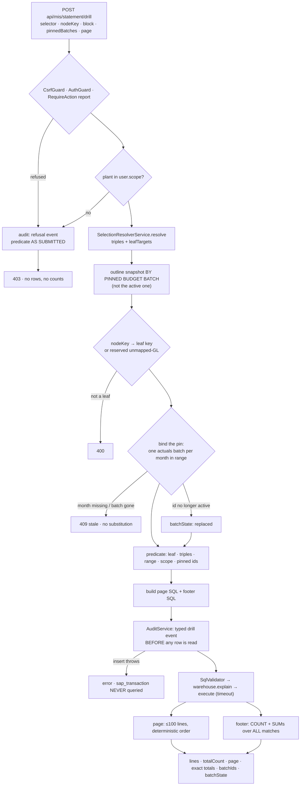

# Cold-read grill — gate: task — task plan drill-transactions-api

You did NOT write what follows. Read it cold, as an adversary trying to break the handover, never as its author defending it. You are READ-ONLY: return findings, change nothing.

## Interrogation technique

Run the interrogation this way. The harness contract above is the floor; this is the technique.

---
name: grilling
description: Grill the user relentlessly about a plan, decision, or idea. Use when the user wants to stress-test their thinking, or uses any 'grill' trigger phrases.
---

Interview the user relentlessly until you reach a shared understanding. Map this as a **design tree**: every decision branches into the decisions that hang off it.

Work the tree in **rounds**. The **frontier** is every decision whose prerequisites are already settled: the questions you can ask _now_ without guessing at answers you haven't heard yet. Ask the whole frontier in one round: number each question and give your recommended answer. Then wait for the user's answers before the next round.

Format a round like so:

```
❓ **Q1** - **<question title>**: <question body, might be multiple paragraphs, including multiple choices>

➡️ <your recommended answer>

---

❓ **Q2** - **<question title>**: <question body, might be multiple paragraphs, including multiple choices>

➡️ <your recommended answer>
```

Each round the user answers reshapes the tree: settled decisions push the frontier outward and unblock questions that depended on them. Recompute the frontier and ask the next round. A question whose answer depends on another question still open in this round belongs to a _later_ round, not this one.

Finding _facts_ is your job, never the user's. When a frontier question needs a fact from the environment (filesystem, tools, etc.), dispatch a sub-agent to find it; don't ask the user for anything you could look up yourself. Don't block on it: a running exploration is an unsettled prerequisite, so only the questions downstream of it wait for the sub-agent to report; ask the rest of the frontier now. The _decisions_ are the user's: put each to them and wait.

The session is done when the frontier is empty: every branch of the design tree visited, nothing left silently assumed. Do not act on it until the user confirms you have reached a shared understanding.


## Harness grill contract

# Griller Prompt — adversarial handover interrogation

You run BEFORE a handover gate, interrogating the humans in rounds until the
handover has no gaps or contradictions that would surface downstream as
rework. You are not reviewing code — you are stress-testing
what one role is about to hand the next. The gate scripts REFUSE without
your fresh, passing record.

**Independence is the whole point.** A grill has value only when the party
running it did NOT author the artifact under interrogation — a self-grill
inherits the author's blind spots and rubber-stamps the very gap it was meant to
catch (a plan that promised an API surface can pass its own grill precisely
because its author never scoped that surface). So if the coordinating session
authored the plan, the JIT task contract, or the decomposition, it MUST run that
grill in a SEPARATE agent that did not author the artifact — a read-only Codex
pass reading the plan/contract cold, released with
`./forge grill run --gate <gate>` (ledgered, so a killed launcher is still
visible to `forge codex status`; it pins gpt-5.6-terra @ xhigh from
harness.yaml) — rather than certify its own work inline. Codex on `gpt-5.6-terra` @ xhigh
is the required cold reader for planning grills: a fresh model context fully
independent of the authoring session, and because it is read-only it never
writes, so the write-lock that gates the write companion does not apply. Do NOT
use a Claude sub-agent for the grill, and never grill your own work inline.
Interrogate as an adversary trying to break the handover, never as its author
defending it.

RELEASE IT THROUGH THE HARNESS. `./forge grill run --gate <gate>` composes the cold-read brief (this contract plus the artifact) and releases Codex through the SAME ledgered launcher a delegation uses: the pid is recorded before the wait, so a grill whose launcher is killed still shows up in `forge codex status` instead of vanishing. It is read-only, so it takes no delegation lock and can never satisfy `stage done`. Recording the gate stays yours — the cold read only returns findings.

The technique is Matt Pocock's `grilling` skill — the design tree, the
frontier, numbered questions with recommended answers. `doctor --fix` installs
it into BOTH runtimes, and `./forge grill run` also inlines it into the brief,
so a reader reaches it whether or not its runtime resolves skills. This
contract is the harness-side floor; `grilling` is the technique.

`grill-me` is the HUMAN entry point — you type `/grill-me` and it redirects to
`grilling`. It carries `disable-model-invocation: true`, so no model invokes it
and none should be told to.

WHICH RUNTIME CAN RECORD WHICH GATE — get this wrong and you will chase a
refusal you cannot satisfy. ALL SIX gates match the AskUserQuestion ledger and
are therefore CLAUDE-ONLY, each with a floor of ONE logged round: `--gate spec`,
`--gate signoff`, `--gate epics`, `--gate requirements`, `--gate plan` and
`--gate task` — the floors live in `grill_gates.GATES`, one row per gate.
`signoff` and `epics` used to sit outside that check and so recorded with ZERO
rounds behind them; they now answer to it like every other gate.

ONE round is a FLOOR, never a target. Keep going until a round comes back clean
AND the next one stays clean — a single quiet round after a noisy one is a
coincidence, not convergence. The ledger files are written ONLY by `post_tool_use.py` on a
Claude Code AskUserQuestion event; `.codex/hooks.json` registers no PostToolUse
hook, so Codex cannot produce them and neither can a subagent. Delegating a
ledger-matched grill to Codex returns a well-formed payload that the recorder
then refuses, with nothing you can do to satisfy it — the payload was never the
problem, the runtime was.

For those four ledger-matched gates, independence is a COLD READ,
not necessarily a separate process. The recorder accepts ONLY rounds that match a
logged AskUserQuestion record (`record_grill_from_json.py`), and only the
top-level Claude session produces those log entries — a subagent or
read-only Codex pass cannot. So for those grills the top-level session drives
the rounds through AskUserQuestion itself — but because the coordinating session
authored the plan, the independent cold-read pass is MANDATORY, not optional: on
EVERY round release a fresh READ-ONLY Codex pass with
`./forge grill run --gate <gate> [--task <id>]` that reads the plan/contract
cold and returns findings — never a
Claude sub-agent, never grill your own work inline — then carry ALL of those
findings into your own AskUserQuestion rounds (the recorder rejects rounds not in
the ledger, so the top-level session must still ask). Read cold, as an adversary
who did not write it.

ONE COLD READ PER GATE — put every question to the human INSIDE it. The old
shape was Codex grill → your rounds → amend → Codex grill AGAIN, looping until
clean. That loop cannot converge: a fresh reader has no memory of what the last
one found, so it returns a DIFFERENT frontier rather than a shorter one, and the
artifact you amended to close round one becomes round two's input. Stories
reached eleven, twenty-six and forty rounds that way; the last cost six hours.
`forge grill run` now REFUSES a second unconstrained read on a gate that has
already been read since its last recorded pass.

So the WHOLE grill is:

1. `./forge grill run --gate <gate>` — one cold read. WATCH it.
2. Clean? Record the pass and approve. Nothing else happens.
3. Otherwise resolve every finding the REPOSITORY answers yourself — open the
   file and settle it. Take to the human only what the repository cannot
   answer: a decision nobody has made, a priority, a tradeoff between two
   workable shapes. Put those through AskUserQuestion with your recommended
   answer first, all of them, now. There is no later round to save the hard
   ones for, and a finding is not a menu.
4. Amend the artifact ONCE, to what they decided.
5. Record the pass against the AMENDED version, then approve exactly once.

The price is stated plainly, twice over: nothing independent re-reads the
amended version, and a gap this reader misses is not caught by a second reader
at this gate. Both surface at the next gate, or in review. That is the trade
for ending a loop that was costing whole days.

If the human's answers changed the artifact's SHAPE — a component dropped, a
different approach chosen — the amended artifact is not the one that was read
in any useful sense. Say so and read again: `./forge grill run --gate <gate>
--reread "<what changed shape>"`. It is a choice with a recorded reason, not a
way around the rule, and the five-read cap still backstops it. (EVERY gate is ledger-matched — signoff and epics no
longer excepted — so no gate can be recorded by a read-only Codex grill alone:
the top-level session asks the round and records it.)

FRESH CONTEXT, AND THE ANSWERS SO FAR. Every round is a NEW read-only Codex
session — that independence is the whole point. But a reader that knows nothing
of the earlier rounds does not re-find the same gaps, it finds DIFFERENT ones,
so the rounds never shrink and the grill has no natural end. `./forge grill run`
therefore carries every question already put to the human and the answer they
chose, read from the ledger the recorder validates against.

That gives the reader two obligations: do not re-raise settled questions, and
CHECK EACH ANSWER — that the artifact honours it, and that it contradicts no
other answer, accepted decision or constitution rule. An answer can be wrong, or
right and never applied; saying so is part of the read.

Do NOT tell the reader where to concentrate. A cold read is worth having because
it is unconstrained, and steering it toward the diff is how the thing nobody
looked at survives every round. More information, no direction.

END EVERY ROUND WITH AN EXPLICIT CONVERGENCE VERDICT, on its own line, so the
coordinator never has to guess whether to grill again or approve:

- `CONVERGED — no gaps, no contradictions, plan unchanged since the last round`
- `NOT CONVERGED — <the specific reason: open gaps, a contradiction, or the plan
  changed after the last clean round>`

`CONVERGED` on the cold read means there is nothing to amend: record and
approve. `NOT CONVERGED` does NOT mean read again — it means resolve what the
repository answers, put the rest to the human, amend once, and record the pass
against the amended version. Approval happens exactly once.

Five gates, five scopes:

- `--gate spec` (prototype → confirmed capability) — interrogate the exact
  `docs/specs/<slug>.md` file against BRIEF, architecture, decisions, and the
  prototype. Hunt: behavior the prototype proved but the spec omitted,
  implementation choices masquerading as requirements, vague acceptance
  language, and conflicts with active decisions.
- `--gate signoff` (client → PM, before `record_signoff.py`) — interrogate
  `docs/product/DISCOVERY.md`, `BRIEF.md`, confirmed specs, the spec-linked
  roadmap, `docs/decisions/`, and prototype notes. Hunt: unanswered
  stakeholder/constraint questions, scope
  the client saw vs. scope the BRIEF claims, decisions that contradict the
  BRIEF, acceptance criteria that are vibes instead of checks, non-functional
  requirements nobody asked about (auth, data retention, environments).
- `--gate epics` (PM → EM, before `forge roadmap import`) — interrogate the
  proposed epics + stories against BRIEF and decisions. Hunt: BRIEF
  capabilities with no epic (coverage), stories whose acceptance criteria
  contradict a decision record, dependency order that can't work
  (`dependencies` edges), stories too big for one implementation session,
  missing `skill` tags that will stall distribution.
- `--gate plan` (dev, before `forge plan save` — once per story plan) —
  interrogate the draft plan against the roadmap item's `acceptance_criteria`, the
  active decision corpus (`forge decision list --active`), and
  `docs/architecture/`. Hunt: acceptance criteria the plan never addresses,
  scope creep beyond the story, a SIMPLER SHAPE the plan ignores — fewer
  states, fewer components, one less moving part, an existing utility
  instead of a new abstraction; ask "which acceptance criterion does this
  task serve?" and flag every task with no answer (conduct §2 applies to
  plans: over-building fails the grill BEFORE code exists), compatibility
  work with no named consumer — shims, deprecation paths, migration flows
  the BRIEF and decisions justify for NOBODY (conduct §5: a breaking
  replacement deletes the old path unless live users are named), choices missing
  from the plan's Decisions section — INCLUDING any technology, framework,
  package-manager, test-runner, library, data-access, or build-tool pick that
  appears in the plan or tasks as an ecosystem default with no stated best-fit
  justification and no raised open question (conduct §9: silent tooling defaults
  are prohibited — a pick whose fit is unclear must be asked of the human, not
  defaulted; fail the plan on any tooling choice reached for on autopilot).
  Also flag a MISSING quality-gate baseline: any codebase the plan touches must
  wire a stack-APPROPRIATE static-analysis gate — a linter AND formatter, plus a
  type-checker where the language has one — into CI/verify, not merely a test
  runner. Name the CAPABILITY, never a fixed tool: ESLint/Biome for JS-TS,
  Ruff/flake8 for Python, golangci-lint for Go, Clippy for Rust, Checkstyle/
  Spotbugs for Java, and so on — the requirement is generic to every backend, not
  one ecosystem's tool. Fail the plan when code ships with no configured lint/
  format/static-analysis gate that an automated check enforces on every push; an
  absent linter is a silent quality default exactly like an unjustified tool pick.
  Also hold the plan against the CONSTITUTION's coding standards
  (`constitution/README.md` index — read the references it maps to the plan's
  surfaces). The constitution is law, so a plan whose SHAPE omits or contradicts a
  mandated standard is a GAP, not a style preference: HTTP surfaces with no typed
  request AND response DTOs (`pnp-api-standards`, `pnp-swagger-api-documentation-
  standards`), a module ignoring the modular-monolith layout or file-suffix
  standards (`pnp-coding-standards-modular-monolith`, `03`), missing structured
  logging (`05`/`06`) or domain exception handling (`07`), an external integration
  that skips the provider/port pattern (`08`, `pnp-provider-pattern-for-
  integration`), or database work ignoring `pnp-database-standards`. Flag each and
  require the plan to conform or record a deliberate, written deviation — never
  wave it through as "the implementer will follow standards later"; a plan must not
  design AGAINST the law. (`constitution/` is on disk in every environment, so the
  read-only Codex cold-read has the law available — hold the plan to it.)
  Reconcile the plan explicitly against
  EVERY ID from `forge decision list --active`; a conflict becomes a
  contradiction signal or a superseding decision, never a silent exception.
  Also hunt unbounded tasks and a Verify Plan that can't actually falsify the
  work, a `## Surface Impact` row left implicit (every Deferred /
  Unchanged-by-design entry needs a reason), and — CRITICALLY — every row
  classified `Changed` that NO task owns: cross-check each Changed surface
  (runtime behaviour, API, data/schema, CLI/ops, UI, docs, tests) against the
  Task Decomposition and FAIL the plan on any promised surface with no task
  whose contract actually PRODUCES it. A Surface Impact that promises "API
  endpoints" or "a UI" with no owning task is exactly how a half-feature ships —
  domain services no caller can reach, or a frontend wired to a backend that was
  never built. Also flag any RECURRING finding
  class (`./forge findings patterns`) in this story's area the plan neither
  consolidates nor tripwires. In Claude Code the
  `/grill-me` skill run against the plan satisfies this contract. The payload
  carries `"issue"`; the recorder stamps it against the active task.
- `--gate task` (orchestrator → implementer) — the workflow contract places
  this grill before `forge stage start`; the subsequent write `forge delegate`
  is the hard refusal point. Interrogate the next leaf task's just-authored
  contract in the re-recorded decomposition against the approved story plan,
  active decisions, and the actual repository state left by completed prior
  stages. Hunt: assumed files or APIs that prior work did not produce, a
  `write_scope` whose AREAS miss where the work must land or reach into areas
  the task has no business in (scope is directory prefixes plus named new
  files — a missing existing file under a declared prefix, a drifted line
  number or a renamed module is a NON-BLOCKING note, never a blocking finding;
  `stage done` measures the exact paths), acceptance criteria not served by the proposed
  work, a task that OWNS a plan `## Surface Impact` surface but whose
  `write_scope`/`required_tests` do not actually PRODUCE it (owns the API row but
  builds only domain services with no HTTP controllers/DTOs/routes; owns the UI
  row but ships no components) — reachability is part of "done", not a later
  task's problem, required tests that do not prove those criteria, verify commands that
  cannot falsify the change, reviewer focus that misses the risky seam OR that
  re-states shape rules the constitution already sets instead of CITING the
  load-bearing `constitution/` references for the task (the contract points at the
  law, never re-derives or contradicts it), and a
  `user_facing` flag that misclassifies the task — a UI task left `false` (its
  mandatory design skills and design review would be skipped) or a backend task
  marked `true` (forced to attest UI design skills it has no use for).
  This is the JIT task-planning gate from decision 0032, not a repeat of the
  story-level plan grill. Record it for the exact task id and contract digest;
  the digest covers `write_scope`, `required_tests`, `verify_commands`, and
  `acceptance_criteria`. A changed field makes the old task grill stale, and a
  write delegation refuses it; read-only delegation is unaffected.

Method:

1. Read the artifacts in scope FIRST; derive your question list from actual
   text, citing it (`BRIEF.md says X; decision 0003 says Y — which wins?`).
2. Interrogate in ROUNDS until the frontier is empty — not one pass. Each
   round, put the questions whose prerequisites are already settled to the
   human (PM or EM) with your recommended answer; their answers reshape the
   tree and unblock the next round's questions. Stop a single question when it
   would only confirm what a document already states; stop the grill only when
   no gap or contradiction remains unasked. In Claude Code, deliver each
   round's frontier through the AskUserQuestion tool (recommended answer
   first), not prose. For every ledger-matched gate (`spec`, `requirements`,
   `plan`, `task`) the recorder requires
   the FINAL round in the payload to carry `"frontier_empty": true` — that flag
   is how it confirms you stopped because the frontier closed, not because you
   ran out of patience; it is set by hand on the last `rounds` entry, never by
   the ledger. A zero-gap contract still needs at least one such round (every
   gate's floor is 1, and a floor is not a target), so ask a genuine closing
   question
   (e.g. "any remaining gap before we hand off?") and mark it `frontier_empty`.
3. Every finding lands somewhere real before the verdict: a doc edit, a
   `./forge decision new <slug>` record, or an explicit non-blocking entry
   in `open_items`. An `open_items` entry that PARKS scope also gets a
   deferral row with a revisit trigger (`./forge defer add`) — parked scope
   without a trigger is scope silently dropped. Unresolved blocking
   findings ⇒ verdict `blocked`.
4. Record the outcome (schema: `factory/schemas/grill.json`,
   `"generated_by": "griller"`):

   A task-grill input uses this recorded shape (the recorder adds its own
   task id, digests, commit, and timestamps):

```json
{
  "generated_by": "griller",
  "verdict": "pass",
  "gaps": [],
  "contradictions": [],
  "resolutions": ["What was sanctioned"],
  "inspected_refs": ["path/or/path:symbol"],
  "current_flow": "What the repository does now",
  "criteria_map": {"criterion": "proof"},
  "decision": "keep",
  "new_abstractions": ["None"],
  "rounds": [{"question": "Finding or choice", "options": ["Recommended", "Alternative"], "chosen": "Recommended", "frontier_empty": true}],
  "citations": [{"finding": "Repo-answerable finding", "source": "path:symbol"}],
  "open_items": []
}
```

   Each `rounds` entry has a non-empty `question`, two to four non-empty
   string `options`, and a `chosen` value equal to one option. Each citation
   is `{finding, source}`. Every string in `gaps` must be covered by an equal
   `rounds[].question` or `citations[].finding`.

   For every gate — all six are ledger-matched — extra recorder rules bind
   (this is what makes an otherwise well-formed payload fail):
   - Rounds must match the AskUserQuestion ledger and meet the gate floor
     (1 for every gate, and a floor is not a target); the final round carries
     `"frontier_empty": true`. A
     zero-gap grill still records its floor of real rounds — never zero.
   - `--gate task` only: `criteria_map` is a THREE-WAY equality — its KEYS must
     equal the frontier task's `acceptance_criteria` set AND the set of its
     `plan_contracts[].statement` values, exactly (no extra key, none missing);
     each value is the non-empty proof for that criterion. Author the task's
     `acceptance_criteria` and its `plan_contracts` statements as the SAME
     strings so there is one coherent key set to satisfy.

```bash
python3 factory/scripts/record_grill_from_json.py --gate <spec|signoff|epics|requirements|plan|task> --input <json> [--input-digest <artifact>] [--task <id>]
```

5. For every gate except task, commit the resolution edits
   BEFORE recording the grill — those gates check freshness against BOTH
   committed history and the working tree: any guarded doc changing after the
   grill (even uncommitted) stales it. (The sign-off / epics-approved decision
   records themselves are expected afterwards and don't stale it.) The task
   gate instead binds directly to the re-recorded task contract digest; the JIT
   sequence does not require a commit between re-recording and grilling. But that
   digest still folds in the product tree, so record the task grill LAST — after
   any docs/ or factory/scripts commits: a tracked change outside .factory/ and
   plans/ that lands between grilling and `task approve`/`stage start` re-stales
   it and forces a re-grill.
6. `--input-digest` is REQUIRED for the spec, epics, and plan gates: pass the
   exact spec / roadmap input / plan draft you interrogated. The gate verifies the
   digest — grilling version A never approves an edited version B; if the
   artifact changes, re-grill it. For `--gate task`, pass `--task <id>` and NO
   `--task-digest` — that flag was removed and the recorder rejects it; the
   recorder derives the grounding digest itself from the protected contract,
   approved plan, and product tree, and stores the result at
   `.factory/grills/tasks/<id>.json`.

A `pass` with unresolved findings is refused by the recorder. Grill hard;
downstream implementation inherits whatever you let through.


## Lessons already in force for these paths

The plan must design AROUND these. A plan that ignores one is not merely unlucky later — it is wrong now, and saying so is part of this read.

- A required_tests entry must name a REAL leaf test (id = the string in test("...")), not the file path, and must pin TS_NODE_PROJECT=backend/tsconfig.json because forge runs it from repo root; otherwise junit-run's --test-name-pattern matches nothing and ts-node skips the workspace tsconfig, so the gate reports pass without running assertions. Always verify with a negative control (a required test whose negative control cannot fail is not proof).
- Enforce at the DB level (a trigger, like the immutability trigger) that sap_transaction.month equals its ingest_batch.period and mis_budget.period equals its batch period; otherwise a mis-periodized row double-counts in actual_by_key_month, which groups by ROW month while active-uniqueness is keyed on BATCH period.
- The WAREHOUSE_PG_* separation guard must REJECT when the normalized host AND port match the app DB, regardless of database name (canonicalize localhost/127.0.0.1/::1 and equivalent aliases) — otherwise warehouse DDL can be applied to the application Postgres server under a different db name.
- The demonstrated warehouse proof must RUN migrate + the fixture against the warehouse DB via a committed, re-runnable warehouse:proof script that EXERCISES IngestionRepository's atomic candidate-load-then-flip; a hermetic test that only greps seed-proof.sql text is false-green. Do NOT build a controller/API here (that is the actuals-loader task) — exercise the repository directly.
- The WAREHOUSE_PG_* separation guard must RESOLVE both the warehouse host and the app pg host via dns.promises.lookup(host,{all:true}) and reject when their resolved IP sets INTERSECT and the ports match (normalize IPv4-mapped ::ffff: and IPv6 loopback). A hand-picked list of loopback spellings + isIP() cannot catch DNS aliases or IPv6-mapped aliases of the app host. This makes loadWarehousePostgresConfig async — make createWarehouseWritePool async and await it in warehouse:migrate/proof and the hermetic test.
- The D-0008 live warehouse proof must be a COMMITTED, reviewer-visible DB-backed test (e.g. backend/src/warehouse/warehouse-proof.db.test.ts calling proveWarehouse, registered in the backend package.json test:db script) so the required execution is provable from the diff itself — a tests.json narrative alone is invisible to the cold-diff reviewer and reads as an absent D-0008 record.
- Put the DB-backed warehouse proof in its OWN file backend/src/warehouse/warehouse-proof.db.test.ts registered ONLY in test:db (and the db list of tools/quality-gate.test.mjs); keep warehouse-schema.test.ts hermetic-only. NEVER register one test file in both test:hermetic and test:db — tools/quality-gate.test.mjs asserts exactly one suite per file and fails the whole verify if a file appears twice.
- SUPERSEDES the separate-file guidance for warehouse-schema: its write_scope does NOT include warehouse-proof.db.test.ts, so do NOT create that file. Keep the DB proof test INSIDE backend/src/warehouse/warehouse-schema.test.ts gated by WAREHOUSE_DB_TEST=1 (skips under plain test:hermetic, runs the migrate + IngestionRepository proof when the env + WAREHOUSE_PG_* are set), registered ONLY in test:hermetic. REMOVE warehouse-schema.test.ts from the test:db script and the db-list in tools/quality-gate.test.mjs, and drop the WAREHOUSE_DB_TEST env added to test:db — quality-gate requires each test file in exactly ONE suite and fails verify otherwise. This is the ONLY remaining fix.
- The sap_transaction 'raw' jsonb column is ADDITIVE - add it to warehouse-schema.ts + a NEW backend/drizzle-warehouse/0001_*.sql migration (generate-once, apply-only via warehouse:migrate). Do NOT modify backend/src/warehouse/warehouse-schema.test.ts (out of write_scope); its column/constraint assertions use .includes and are non-exhaustive and the 0000 migration is unchanged, so it stays green untouched. Assert the raw column IN-SCOPE: sap-actuals.parser.test.ts (parser emits the full raw row) and the WAREHOUSE_DB_TEST=1-gated ingest.service.test.ts (raw persists).
- The pinned WAREHOUSE_DB_TEST=1 host command must be prefixed with TS_NODE_PROJECT=backend/tsconfig.json TS_NODE_TRANSPILE_ONLY=1; without them 'node --require ts-node/register --test <file.ts>' loads the TypeScript file as a single empty testcase that FALSE-PASSES (tests 1/pass 1) even against a dead DB port — verified: with the prefix the good port gives tests 4/pass 4 and a bad port fails the 2 gated DB leaves (ECONNREFUSED); without it a bad port still 'passes'.
- Not a defect (Decisions): Factually incorrect and contradicts the settled D-0008 model. (1) The claim that the supplied evidence contains no invocation of test:warehouse-proof is false: the committed tests.json commands_run records 'npm --prefix backend run test:warehouse-proof -> tests 4 / pass 4 / fail 0 / skipped 0' (the gated warehouse leaf EXECUTES because the script sets WAREHOUSE_DB_TEST=1) plus a dead-port negative control (fail 1, ECONNREFUSED). Performance and security accepted this same evidence and approved this round. (2) The warehouse proof is committed, reviewer-visible and runnable via the registered test:warehouse-proof script. (3) The story plan Decisions section settles that DB-backed warehouse proofs run as DEMONSTRATED HOST EVIDENCE (docker warehouse, WAREHOUSE_PG_*) per D-0008, NOT inside the enforced hermetic path; demanding a non-skipped enforced execution is CI-enforcement the plan defers. — raised as "[P1] Record an execution of the gated warehouse proof (backend/src/warehouse/reconciliation.repository.test.ts:107): The only recorded execution is `npm run tes"
- Not a defect (Decisions): Factually incorrect and contradicts the settled D-0008 model. (1) tests.json IS committed at f9c6b1d with the full host-execution record: 'npm --prefix backend run test:warehouse-proof -> tests 7 / pass 7 / fail 0 / skipped 0' plus a dead-port negative control (fail 2, ECONNREFUSED). The reviewer cannot see it only because the review bundle deliberately excludes .factory bookkeeping ('review tip excludes 9 harness bookkeeping paths; the bundle is the product delta only') - not because it is absent. (2) The runnable command that executes the proof (test:warehouse-proof, serialized) IS in the product delta at backend/package.json, and the gated test is committed and reviewer-visible. (3) The security lens accepted this identical evidence and approved. (4) The story plan Decisions section settles that the DB-backed warehouse proof is DEMONSTRATED HOST EVIDENCE (D-0008), not CI-enforced execution. — raised as "[P1] Commit the required host-execution evidence for the new proof (backend/package.json:19): The new `test:warehouse-proof` command is registered, but the chan"
- Not a defect (Decisions): Factually incorrect and contradicts the settled D-0008 model, same as the quality lens. tests.json IS committed at f9c6b1d with the host-execution record (test:warehouse-proof -> tests 7 / pass 7; dead-port negative control fail 2, ECONNREFUSED); the reviewer cannot see it only because the review bundle excludes .factory bookkeeping ('the bundle is the product delta only'). The runnable serialized test:warehouse-proof command IS in the product delta (backend/package.json) and the gated test is committed reviewer-visible; the security lens approved this identical evidence. The story plan Decisions section settles the warehouse proof as demonstrated host evidence (D-0008), not CI-enforced. — raised as "[P1] Commit the required warehouse-proof execution evidence (backend/src/warehouse/gl-month-rollups.db.test.ts:22): This DB-backed proof is skipped unless WAREH"
- The composed-relation gated proof failed only because month (a Postgres DATE) is read back by node-pg as a JS Date at LOCAL midnight, so in a non-UTC host timezone (IST) the ISO string shifts a day (2099-09-01 stored -> 2099-08-31T18:30:00Z read). The composed relation values were correct (matched key actual 125.00 + budget 200.00, zero-fill and no-fan-out work). FIX (test-only, backend/src/warehouse/composed-relation.db.test.ts): compare month as a DATE-ONLY value - either select month as text in the assertion query (to_char(month,'YYYY-MM-DD')), or normalize both sides to the yyyy-mm-dd date part - never compare the full Date/ISO across timezones. Do NOT change the composed relation SQL; the logic is proven correct.
- Putting source_presence on ResultTable rows caused three defects at once: (1) it leaked into the RENDERED column list (selectionExecutor.ts:137 filtered only budget_component_labels + active_batch_ids), showing a provenance column to users; (2) it rode into every composed execution.result.rows record and so into authored-measure SAMPLE persistence (selectionExecutor.ts:165) — the same pressure that kept dragging measures.service.ts into scope; (3) it made the API type UNSOUND (contract/src/api.ts:148): intersecting Record<string, string|number|null> with a possibly-array source_presence is invalid because the string index signature already declares every value scalar. FIX: do NOT put per-row provenance on ResultTable rows at all. Filter ALL provenance columns (source_presence, budget_component_labels, active_batch_ids) out of raw.columns AND out of the result rows, and carry per-row source-presence on the PROVENANCE payload instead, ROW-ALIGNED BY INDEX (e.g. provenance.rowSourcePresence: SourcePresence[] parallel to result.rows), alongside the query-level (source,period,batchId) tuple set + label set. This keeps ResultTable's row type exactly Record<string,string|number|null> (sound, no index-signature conflict), keeps provenance out of rendered columns and out of authored-measure sample persistence, and still satisfies C2's row-aligned source-presence.
- A warehouse DATE column read through pg and JSON-serialized arrives at the browser as an IST-shifted UTC timestamp (2026-07-01 becomes 2026-06-30T18:30:00.000Z), so a user-facing table shows the WRONG MONTH. Normalize month/date cells to a date-only YYYY-MM-DD string on the server before they enter a result row, and format them for display on the client.
- node-postgres parses a DATE column into a JS Date at LOCAL midnight of the process timezone, so the exact inverse is to read back the PROCESS-LOCAL date parts (getFullYear/getMonth/getDate). Formatting with a hardcoded timeZone such as Asia/Kolkata only happens to work on hosts at or west of that offset and silently returns the previous day on hosts east of it (e.g. Asia/Tokyo), so a date-only normalizer must never pin a timezone.
- RULING (settles the autoreview P1 and signals S-0021/S-0023): the bucket list must emit ONE row per unmapped GL CODE, never one per master bucket ENTRY, because GL/month is the grain of the only amounts that exist - do NOT add a warehouse query path and do NOT touch sqlBuilder.ts or selectionExecutor.ts to recover triple grain. Fold the master's bucket entries by gl_code in mis-selection.service.ts: costCentre keeps the single cost centre when that GL has exactly one bucket entry and is null when it has several (a GL booked across cost centres is no longer a triple, just as a Budget-only GL is not); provisional is true if any folded entry is provisional; reason names each folded entry's cost centre and reason so the list still says WHICH cost centre is wrong; actual and budget are that GL's totals assigned EXACTLY ONCE. This keeps the settled decision (both an Actual and a Budget amount per row, costCentre null where there is no single cost centre), keeps the gap visible rather than absorbed (decision 0018 as amended), and makes the list reconcilable against the slice totals because no amount is ever copied onto two rows. Acceptance criterion 3's word 'triples' means the reviewable identity of the gap, not one row per cost centre. Prove it in mis-selection.controller.test.ts with a master where ONE GL carries TWO bucket entries: expect a single row, costCentre null, and the GL total counted once.
- RULING (settles the autoreview P2/performance blocker at frontend/src/features/mis/mis-report-view.tsx:233): after folding the bucket to GL grain, costCentre === null means THREE different things - a Budget-only GL, a GL absent from the mapping master but carrying real Actual spend, and a GL whose master entries span several cost centres - so any UI label inferred from null (today 'Budget only') mislabels two of the three. FIX IN THE CONTRACT, not the renderer: replace MisSelectionBucketRow.costCentre (string | null) with costCentres: string[] - the master's cost centres for that GL, empty when the master names none. mis-selection.service.ts populates it (one entry when a single bucket entry, several when folded, empty for a Budget-only or master-absent GL) and the view renders exactly what it is given: the single name when there is one, 'N cost centres' when there are several (the reason line already names each), and 'No cost centre in master' when there are none. Never infer a row's kind from an absent field. Update mis-selection.controller.test.ts and mis-report-view.test.tsx accordingly, including the multi-cost-centre case with nonzero Actual.
- backend/src/mis/mis-selection.dto.ts exists solely to keep the typed Swagger response DTO aligned with the MisSelection* types in contract/src/api.ts, so ANY change to those types mechanically requires the matching change in the DTO in the SAME change. It is authorized in-scope for such a change (recorded on the stage with amend-scope) - do not raise a scope signal for it.
- FIVE fixes from the three-lens review, all blocking except the last. (1) replaceBudgetBatch keeps the outline argument OPTIONAL and defaults it to [] (ingestion.repository.ts:61-80), so any caller can write budget rows and activate a batch with no snapshot, and budget_by_leaf_month then silently discards those rows at its inner join - an active batch that returns an empty statement. Make the outline argument REQUIRED with no default, and enforce the budget-row-to-outline relationship in storage (a foreign key or constraint), not by convention. (2) Migration 0003 adds leaf_key as nullable and does not deal with existing active budget batches, whose rows have no leaf_key and therefore vanish from the projection silently. Decision 0021 says a batch ingested before this change must be RE-INGESTED rather than guessed at, so the migration must mark any pre-snapshot budget batch explicitly INACTIVE - a visible empty state that says re-ingest, never a silently wrong statement. Do NOT backfill a guessed leaf_key. (3) The gated proof (statement-projection.db.test.ts:61) asserts row uniqueness and two grand totals only; add EXACT per-leaf monetary assertions so a compensating error inside the totals cannot pass. (4) buildStatementProjection (sqlBuilder.ts:154) is invoked only by its own tests: make it a real branch of the governed builder's dispatch so it is reachable through the normal governed execution path, rather than a standalone helper a future route has to find. Do NOT add an HTTP route - that is task 2. (5) P2: outline nodes are appended before the glRowCount limit check (mis-budget.parser.ts:126), so a workbook of many formula subtotals bypasses the 25,000-row ingestion bound; count outline nodes toward the cap before that early continue.
- Making replaceBudgetBatch's outline argument required forces the four existing gated proofs that call it with two arguments - backend/src/warehouse/composed-relation.db.test.ts, gl-month-rollups.db.test.ts, golden-financial.db.test.ts and selection-slice.db.test.ts - to pass an outline. They are AUTHORIZED in scope for that change. Adapt ONLY the call site, passing the outline each test's own fixture implies; change NO assertion and no expected value, because those proofs passing unchanged in substance is decision 0022's evidence that the (gl_code, month) relation was not disturbed. If an assertion has to move to make them pass, that is a real regression - raise it rather than editing the expectation.
- The new per-leaf assertion in statement-projection.db.test.ts fails on ORDERING, not values: '9.1|55011101|office-electricity-expenses' and '9.1|55011102|guest-house-electricity-expenses' appear in both actual and expected with identical amounts, at different positions. An unordered SQL result was compared against an ordered literal. Do NOT fix this by re-shuffling the expected literal to match today's incidental order. The outline snapshot already stores sort_order precisely so the statement can mirror Srihari's workbook line for line - which is what 'exact to the format' means and what the human chose when they picked 'mirror the workbook outline'. So: the statement projection must ORDER BY the outline's sort_order (with the leaf key as a deterministic tie-break), and the proof must assert that order. Note that S.No is TEXT, so a lexical sort puts 9.1 after 9.11 and 9.10 - the outline's numeric sort_order is the authority, never the S.No string.
- FALSE FINDING, do not act on it again. A review round on statement-model claimed 'active batches are distinguished by plant as well' and asked the statement projection's provenance joins to add a plant predicate. There is NO plant column on ingest_batch (backend/src/warehouse/warehouse-schema.ts): its columns are id, source_kind, period, uploaded_by, uploaded_at_utc, row_count, validation_result, reconciliation_result, is_active, created_at_utc, updated_at_utc. Plant lives on the ROW tables (sap_transaction), not on the batch. Acting on the finding produced 'column actual_batch.plant does not exist' (SQLSTATE 42703) and broke the gated proof. The batch's full identity IS source_kind + period + is_active, so a join on those three already cannot fan out on a second plant's batch - there is no such thing. Revert to joining on source_kind, period and is_active. I ledgered the reviewer's claim without checking the schema first, which is what let it reach the code; READ THE COLUMN before asserting a join key.
- contract/src/measure.ts:59 types DomainSpec.composed.joinKeys as the literal tuple ['gl_code', 'month']. The statement_relation domain that decision 0022 requires joins on leaf_key and month, so it cannot be declared until that type admits the statement grain. contract/src/measure.ts is AUTHORIZED in scope for statement-api. Widen it precisely - a readonly tuple union that admits ['leaf_key','month'] alongside ['gl_code','month'] - and do NOT loosen it to string[]: the literal type is what prevents a domain declaring a join the builder cannot honour. The existing composed governed-financial domain must still type-check unchanged, which is decision 0022's promise that the (gl_code, month) relation is untouched.
- backend/src/app.routes.test.ts holds a STRICT sanctioned-route allow-list (it already names 'GET /api/mis/options' and 'POST /api/mis/run'). Any task that adds an HTTP route must add that exact route string there in the same change or hermetic verification fails - the file is mechanically implied by the route, not separate scope, and is authorized for such a task. Add only the new route; never relax the list into a pattern and never drop an entry, because the list being exhaustive is what makes an accidentally-exposed route fail the build. This applies to statement-api (POST /api/mis/statement) and again to statement-export (POST /api/mis/statement/export).
- THREE fixes. (1) URGENT despite its P2 label - the statement projection emits one row per (leaf_key, month) and then applies the global LIMIT of loadConfig().maxRows, which defaults to 1000 (backend/src/config.ts:176). The FY 26-27 YTD block spans 12 months over 80 leaves = 960 rows: FORTY rows from silently truncating a financial statement with no error, and one more budget line or one more month takes it over. Fix it at the source - the block needs one total per leaf per PERIOD RANGE, not a row per month, so aggregate over the range in SQL (GROUP BY leaf_key across the block's months) rather than returning 960 rows for the service to sum. That turns the FY-YTD block into ~80 rows and makes the LIMIT a real guard instead of a silent truncator. Additionally, make truncation LOUD: if a statement query returns exactly the limit, fail rather than return a short statement. (2) contract/src/api.ts:255 types FixedScaleMoney as , which accepts '1.2' and '1.234' - so a consumer satisfies the type without supplying paise, defeating the reason the type exists. Constrain it to exactly two decimal places. (3) mis-statement.service.ts:289 returns the FIRST child's percentage label for a zero-budget parent before checking the aggregate actual, so a parent whose children carry different labels can report the wrong one; derive the parent's label from its AGGREGATE budget and actual, the same CASE the governed measure applies.
- The two-decimal-place constraint on FixedScaleMoney was tightened in contract/src/api.ts into a union of template-literal types covering .00 through .99, but backend/src/mis/mis-statement.dto.ts still restates the old loose shape (number-dot-number), so the DTO no longer satisfies MisStatementMeasureBlock and build:backend fails with 'Types of property budget are incompatible'. The DTO must IMPORT FixedScaleMoney from the contract rather than restating its shape: a restated type drifts the moment the contract tightens, which is exactly what happened here. Same rule for every other money field crossing the wire.
- The statement projection now aggregates over the requested period RANGE, returning one row per leaf per block instead of one per (leaf_key, month) - the fix for a live truncation hazard, since the FY-YTD block was 960 rows against a default maxRows of 1000. backend/src/warehouse/statement-projection.db.test.ts is AUTHORIZED in scope to follow that shape: update its StatementRow type and change the uniqueness assertion from (leaf_key, month) to leaf_key. Keep every VALUE assertion exactly as it is - 81 rows, Actual 11512712.07, Budget 10050136.29, the three-way GL split across Primary/Secondary/Tertiary, no fan-out - because those are task 1's evidence and they must still hold at the new grain (July is a single month, so the row count is unchanged). If a value assertion has to move to make it pass, that is a real regression: raise a signal rather than editing the expectation. Decision 0022 has been amended in place to record the grain change and why.
- TWO fixes. (1) The gated proof still exercises only July - a SINGLE month - so the range aggregation that the whole grain change exists for is UNPROVEN. Extend statement-projection.db.test.ts with a multi-month case over the FY 26-27 YTD range asserting that it returns one row per leaf (about 80) rather than one per leaf-month (about 960), and that each leaf's Actual and Budget equal the sum of its months. That is the assertion that would have caught the truncation hazard, and without it the fix is only asserted. Keep the existing July assertions unchanged. (2) mis-statement.service.ts:85 dedupes the two period blocks by comparing the selected PERIOD ID to the FY-YTD id, but the degenerate case is really RANGE equality: selecting 2026-04-01, the FY start, gives a selected block whose from/to equal the YTD block's, so the statement again prints the same figures twice under two headings - the exact outcome the human ruled against. Dedupe on (from, to) equality, not on the period identifier.
- SelectionExecutor runs a SECOND ungrouped query (totalsFor) whenever a selection names any dimension - selectionExecutor.ts:84-87. The statement selects leaf_key, so it would issue two queries per period block, four in all, contradicting its once-per-range criterion; and those totals are unused because the statement derives its grand total by folding leaves per decision 0020. backend/src/chat/selectionExecutor.ts is AUTHORIZED in scope for statement-api to gain a MINIMAL additive includeTotals option that DEFAULTS TO TODAY'S BEHAVIOUR, with mis-statement.service.ts passing it false. Do not change totalsFor, do not change the default, and the composed executor tests must pass unchanged - every other consumer still relies on the automatic totals.
- The measure/dimension authorization fix made the statement projection honour selection.measureIds and selection.dimensionIds, which is correct - and it immediately exposed that backend/src/warehouse/statement-projection.db.test.ts builds its selection with EMPTY measureIds and dimensionIds (lines 49-50). The projection now rightly collapses that to a single aggregate row, so the proof asserts 1 !== 81. The service sends dimensionIds ['leaf_key'] and the governed financial measures (mis-statement.service.ts:112); the proof must build the SAME selection, or it is proving something the route never asks for. Update the proof's selection to match the service's, and keep every value assertion unchanged - 81 rows, Actual 11512712.07, Budget 10050136.29, the three-way split, the multi-month YTD case. A hand-built selection that drifts from the route's is a proof of nothing.
- backend/src/warehouse/statement-projection.db.test.ts:205 fabricates its own statementDomain with measures: [] and dimensions: []. Since buildStatementProjection resolves selection.dimensionIds against domain.dimensions, 'leaf_key' finds nothing, includesLeaf is false, no GROUP BY is emitted and the proof gets ONE aggregate row instead of 81. The fix is not to patch the fake: import the REGISTERED statement domain from SemanticLayer (semanticLayer.ts declares goldObject statement_relation with dimensions leaf_key and month, and the statementMeasure entries) so the proof exercises the same domain the route does. This is the third time in this story a hand-built stand-in has drifted from the real thing and proved nothing - the selection with empty ids, and now the domain. A proof that builds its own version of the system under test proves only that its copy works.
- A top-level optional value narrowed after declaration is not kept narrowed inside later callbacks; resolve and validate it in an IIFE so the exported const is inferred as non-optional.
- BLOCKING (contract verdict t-sa-c1 partial). The statement domain still declares a 'month' dimension, and sqlBuilder.ts:184 projects it as periodStart::date AS month. That was honest at leaf/MONTH grain, but the projection now aggregates over a period RANGE, so an April-to-July block returns a row labelled '2026-04-01' - the statement claims a single month for figures spanning four. A single date cannot represent a range. Remove 'month' from the statement domain's dimensions in semanticLayer.ts and drop the periodStart special case from the projection: the block already carries its own from and to in MisStatementMeasureBlock, which is where the period belongs. Leaf_key remains the only statement dimension. Update the statement tests and the gated proof to stop selecting a month dimension. A registered dimension that cannot be projected truthfully is worse than an absent one, because consumers will believe it.
- The generated workbook's row-1 block headers read '2026-07-01' and 'FY 26-27 YTD' - the payload's RAW label values - while the statement on screen shows 'July 2026' and 'FY 26-27 (YTD to Jul)'. That is export drift in the headings, the precise defect class this task exists to prevent: a sheet laid beside the screen must agree, headings included. statement-view derives the heading from each block's own from/to (same month gives 'July 2026'; a span gives 'FY 26-27 (YTD to <last month>)'), and the export must derive it the SAME way from the same fields rather than writing block.label. Assert the derived headings in the reopened-workbook test, including the single-block case. Everything else in the workbook is correct and must not move: worksheet 'Financial MIS', 109 rows, merged identity and per-block groups on row 1, column labels on row 2, preorder data from row 3 with outline levels 0-3, a merged Grand Total last row, amounts as NUMBERS rounded to the rupee with format rupee-hash-comma-zero, percentages as numbers with 0.00% format, NA for nulls, and the grand total reading 10050136 Budget against 11512712 Actual.
- BLOCKING, raised independently by the performance and security lenses: mis-statement.controller.ts:32 declares the export service as an OPTIONAL constructor parameter (exporter?) while the export route immediately dereferences it with this.exporter!.write(...). MisModule always provides it, so the optionality buys nothing and the non-null assertion turns a wiring mistake into a runtime crash on a user's download instead of a startup failure. Make it a required constructor dependency and delete the non-null assertion, so a missing provider fails at module construction where it belongs.
- Making MisStatementExportService a REQUIRED constructor dependency of MisStatementController - the blocking fix both the performance and security lenses raised - breaks backend/src/mis/mis-statement.controller.test.ts, whose construction passes only the statement service and now fails TS2554. That file is AUTHORIZED in scope for statement-export-api: add a minimal exporter stub to the constructor call and change NO assertion, because those assertions are statement-api's shipped evidence for the statement route and must still hold unchanged.

## The contract as recorded (authoritative over any copy in the plan)

## Contract (recorded)

Rendered by the harness from the recorded decomposition; edit the decomposition, not this block. It is excluded from the plan's approval and grill digests, so a re-render never stales either.

**Objective.** Build the one read path in this story that crosses the network: the SAP transaction lines behind a statement LEAF, read from sap_transaction under a predicate derived entirely server-side and pinned to BOTH the actuals batches and the budget batch the displayed statement was built from, audited before the read and refused rather than answered when the pin does not hold. Decision 0025 governs the path; decision 0024 is why there is only one endpoint - aggregates are a client projection, task 2. Backend only: no UI, no schema migration, and no change to the statement response, the statement projection, actual_by_key_month or the k-anon suppression the aggregate paths use.

**Acceptance criteria**

- POST api/mis/statement/drill (unversioned, raw response, direct module imports per decision 0019) takes the statement's own selector plus nodeKey, the measure block key, the statement's provenance.activeBatchIds passed through verbatim as pinnedBatches, and a 1-based page; it sits behind AuthGuard, RequireAction('report') and the globally registered CsrfGuard, and declares typed 400/401/403/409 responses alongside its success schema the way mis-statement.controller.ts does. Page size is FIXED SERVER-SIDE at 100 and is not client-settable.
- The predicate is derived server-side on EVERY request and never taken from the client: the leaf key from nodeKey against the PINNED budget batch's outline snapshot (or the reserved key 'unmapped-GL', which the statement synthesises outside the outline and which maps to the resolver's leafTargets with target.kind === 'bucket'); the (plant, cost centre, GL) triples from SelectionResolverService for that leaf; the month range from the block key re-run through the statement's own block definitions; and the plant scope from user.scope. A nodeKey that is neither a leaf in that snapshot nor the reserved key is a 400. Only the pinned ids come from the browser, and they can only narrow the read.
- The pinned set is BOUND, not trusted. The server splits pinnedBatches by source; it computes which months in the block's range have an actuals batch and requires exactly one pinned id per such month - a missing month, a duplicate, a wrong-source or wrong-period id is a REFUSAL, never an authorized but partial footer. An id that is valid but no longer the active batch for its month means the period was re-uploaded: read the PINNED batch and report the replacement. An id that no longer exists at all is reported as gone and refused. The single budget id is bound by the same replaced/gone rules, because the outline snapshot it carries is what maps nodeKey to a leaf - a budget re-upload would otherwise make the drill read a different leaf's transactions out of a perfectly pinned actuals batch. StatementOutlineRepository gains a by-batch-id lookup beside its by-period one.
- Every drill writes its audit record BEFORE any sap_transaction read and fails closed: the typed drill event names the actor, nodeKey, the resolved leaf key, the triples, the month range, the pinned actuals AND budget ids, the mapping-master version, the generated SQL and the objects touched, and if the insert throws the endpoint errors with NO transaction query issued. The resolver and outline lookups that derive the predicate necessarily precede the write - the record cannot name a predicate that does not exist - and read only mapping and outline metadata. REFUSED attempts are audited too: an authorization refusal writes its own event type carrying the actor and the predicate AS SUBMITTED, never the resolved one. audit_events.selection is already jsonb, so this is a TypeScript widening of AuditService, not a schema change.
- The read is two statements over sap_transaction joined to ingest_batch under one identical predicate, so the footer cannot drift from the page: the page (ORDER BY (debit - credit) DESC, month DESC, posting_date DESC, txn_no, line_id with LIMIT/OFFSET) and the footer (COUNT(*) plus the three SUMs, LIMIT 1). Both go through SqlValidator.validate and warehouse.explain before execution and run under the configured query timeout, reusing the governed layer's guards rather than reimplementing them. Money crosses the wire as a fixed-scale decimal STRING end to end - never a JSON number, which loses paise at scale. Value = Debit - Credit; reference is SAP Reference 1 and memo is LineMemo, which is what sap-ingestion already wrote into those columns.
- Footing is proven in EXACT PAISE against the pinned July batch - for a leaf and for the unmapped-GL bucket - as an equality, never a tolerance: sap_transaction.debit and .credit are numeric(18,2), so the actual_by_key_month view's ::numeric(18,2) cast is a no-op and the statement's paise ARE these rows' paise summed. The FY-YTD multi-batch case CANNOT be proven against client data - the supplied SAP extract contains July only - so this task builds a deliberate multi-period actuals fixture for it, and the evidence says which proofs rest on client data and which on the fixture. An empty result is a SUCCESS: zero rows and a zero footer, not an error. A non-integer or out-of-range page is a 400.

**Write scope** (what `stage done` measures the diff against)

- contract/src/api.ts
- backend/src/mis/mis-drill.controller.ts
- backend/src/mis/mis-drill.controller.test.ts
- backend/src/mis/mis-drill.service.ts
- backend/src/mis/mis-drill.service.test.ts
- backend/src/mis/mis-drill.interface.ts
- backend/src/mis/mis-drill.dto.ts
- backend/src/mis/mis.module.ts
- backend/src/warehouse/drill-transactions.repository.ts
- backend/src/warehouse/drill-transactions.interface.ts
- backend/src/warehouse/drill-transactions.repository.test.ts
- backend/src/warehouse/drill-transactions.db.test.ts
- backend/src/warehouse/statement-outline.repository.ts
- backend/src/warehouse/statement-outline.interface.ts
- backend/src/core/audit.service.ts
- backend/src/core/audit.service.test.ts
- backend/src/mis/mis-statement.service.ts
- backend/src/mis/mis-statement.interface.ts

**Required tests** (run by `stage done`)

- `the drill resolves its leaf and triples server side rejecting a node key that is neither a snapshot leaf nor the reserved unmapped gl bucket` -- `TS_NODE_PROJECT=backend/tsconfig.json TS_NODE_TRANSPILE_ONLY=1 node tools/junit-run.mjs --file {path} --name {id} --report {report} --require ts-node/register` (backend/src/mis/mis-drill.service.test.ts)
- `the pinned batch set is refused when it does not cover every month in the block range and is read with a replacement notice when a pinned batch is no longer active` -- `TS_NODE_PROJECT=backend/tsconfig.json TS_NODE_TRANSPILE_ONLY=1 node tools/junit-run.mjs --file {path} --name {id} --report {report} --require ts-node/register` (backend/src/mis/mis-drill.service.test.ts)
- `the drill resolves the node key against the pinned budget outline snapshot rather than the currently active one` -- `TS_NODE_PROJECT=backend/tsconfig.json TS_NODE_TRANSPILE_ONLY=1 node tools/junit-run.mjs --file {path} --name {id} --report {report} --require ts-node/register` (backend/src/mis/mis-drill.service.test.ts)
- `a failing audit insert aborts the drill before any transaction query is issued` -- `TS_NODE_PROJECT=backend/tsconfig.json TS_NODE_TRANSPILE_ONLY=1 node tools/junit-run.mjs --file {path} --name {id} --report {report} --require ts-node/register` (backend/src/mis/mis-drill.service.test.ts)
- `an unauthorized drill is audited with the predicate as submitted and never the resolved predicate` -- `TS_NODE_PROJECT=backend/tsconfig.json TS_NODE_TRANSPILE_ONLY=1 node tools/junit-run.mjs --file {path} --name {id} --report {report} --require ts-node/register` (backend/src/mis/mis-drill.service.test.ts)
- `the drill page and footer queries share one predicate and emit the deterministic order with a bounded limit the validator accepts` -- `TS_NODE_PROJECT=backend/tsconfig.json TS_NODE_TRANSPILE_ONLY=1 node tools/junit-run.mjs --file {path} --name {id} --report {report} --require ts-node/register` (backend/src/warehouse/drill-transactions.repository.test.ts)
- `the drill route refuses an out of range page and returns an empty result as a zero row success with a zero footer` -- `TS_NODE_PROJECT=backend/tsconfig.json TS_NODE_TRANSPILE_ONLY=1 node tools/junit-run.mjs --file {path} --name {id} --report {report} --require ts-node/register` (backend/src/mis/mis-drill.controller.test.ts)

**Verify commands**

- `npm run build:contract`
- `npm run build:backend`
- `npm run typecheck`
- `npm run lint`
- `npm run format:check`
- `npm run test:hermetic`

**Review budget.** 18 files / 2300 lines -- The task is one route but four distinct pieces of machinery, none of which exists today: server-side predicate derivation including the reserved unmapped-GL key the statement synthesises outside the outline; the batch-binding rule in four states across two pinned sources, which drags a by-batch-id lookup into StatementOutlineRepository; a typed drill audit event with a refusal path, widening AuditService beyond the governed Selection shape it currently takes; and a two-query raw-row repository that must pass SqlValidator and foot in exact paise, plus the multi-period fixture the FY-YTD criterion cannot be proven without. No schema migration and no UI.

## Already answered on this story — verify, do not re-ask

These questions were put to the human and answered. Two obligations:

1. Do NOT raise them again as open questions. They are settled.
2. DO check each answer still holds — that the artifact actually honours it, and that it does not contradict another answer, an accepted decision, or the constitution. An answer can be wrong, or right and never applied. Saying so is part of this read.

- Q: Where should the 3F app be built, given we're adapting Pulse?
  A: Build in this 3oilpalm repo
- Q: Financial MIS statement — period columns for the PoC?
  A: July + FY 26-27 YTD
- Q: Financial MIS statement — Excel export fidelity?
  A: Clean structured export
- Q: Financial MIS statement — reconciliation / demo-ready bar?
  A: SAP totals = demo-ready; filled month = validated
- Q: SAP ingestion — how does data get in for the PoC?
  A: Excel upload now (SAP export/API later)
- Q: SAP ingestion — how are budgets brought in?
  A: Ingest budgets from the MIS format, as a separate object
- Q: SAP ingestion — grain & raw retention?
  A: Monthly gold + retain raw transaction lines
- Q: SAP ingestion — re-loading a period?
  A: Idempotent replace per period
- Q: Governed joins — how to handle rows in one object but not the other (Budget with no Actual, or Actual with no Budget)?
  A: Full-outer, zero-fill the missing side
- Q: Governed joins — where are 3F financial measures authored?
  A: In code (repo domain files)
- Q: Governed joins — RBAC on a joined query?
  A: Inject scope on both objects
- Q: Governed joins — correctness gate?
  A: Golden-answer fixtures required
- Q: Mapping master — Srihari's Master Table definition is still outstanding. How do we proceed?
  A: Build a provisional master now, reconcile later
- Q: Mapping master — how is it edited in the PoC?
  A: Seed / config file for the PoC (admin UI later)
- Q: Mapping master — selection with no mapping entries?
  A: Empty statement (zeros) + 'no mapping configured' notice
- Q: Drill-down — levels for the PoC?
  A: 2-level now (group → sub-lines → transactions), confirm with Srihari
- Q: Drill-down — showing individual transactions vs Pulse's aggregate suppression?
  A: Show individual lines within the user's RBAC scope, audited
- Q: Drill-down — line-item columns?
  A: Month, Debit, Credit, Value + reference, memo, posting date
- Q: Assistant/exploration — in the first PoC release, or a fast-follow?
  A: Include in the first PoC release
- Q: Assistant — LLM & data residency?
  A: Decide later
- Q: Platform base — how do we bring Pulse's code in?
  A: Snapshot-copy into the repo (own it)
- Q: Platform base — warehouse engine for the PoC?
  A: Postgres for the PoC
- Q: Platform base — auth for the PoC?
  A: Keep Pulse's email+OTP passwordless auth
- Q: Sign-off gate — how do we unlock the build?
  A: Record an internal go-ahead now
- Q: The spec promises a '2-level drill' (group → sub-lines → transactions), but the statement we shipped mirrors the workbook's outline at ARBITRARY depth — Admin Expenses is three levels deep. So clicking an Actual at the top of Admin has two levels below it, not one. What should clicking an aggregate Actual do?
  A: Any aggregate opens its leaf sub-lines (Recommended)
- Q: The statement's acceptance criterion is that line items foot EXACTLY to the clicked Actual. But if someone re-uploads the July actuals while a statement is on screen, the drill would read the newly active batch and no longer foot. What should the drill read?
  A: Pin to the statement's batch (Recommended)
- Q: The statement spec says a bundled transactions sheet arrives 'with the drill-down capability', but the drill-down spec itself describes no export at all. Should this story include exporting transactions to Excel?
  A: No — keep this story UI-only (Recommended)
- Q: The drill pins to batch ids the browser sends. The grill found a real hole: `provenance.activeBatchIds` is statement-wide (both sources, all blocks), so a client that omits one month's actuals batch from an FY-YTD drill narrows the read and produces a footer that silently disagrees with the number clicked. Authorization is still safe — omitting only ever reads less — but footing is not. How should the server bind the pinned set?
  A: Require a complete month-for-month set (Recommended)
- Q: Column conflict the grill caught: the spec's Behaviour section lists line items as 'Month, Debit, Credit, Value, reference, memo, posting date', but the approved prototype's drill table has six columns and no posting date. Posting date is also part of the settled deterministic tie-break, so it exists in the data either way.
  A: Show it — 7th column (Recommended)
- Q: The plan depends on two decisions I minted while planning; both are `proposed` and need your confirmation before the plan can honestly claim to reconcile with the active corpus. 0024 — the aggregate drill is a client-side projection of the statement payload, so only leaf→transactions crosses the network. 0025 — the transaction drill reads sap_transaction directly under a pinned batch_id predicate, beside the governed executor but reusing its authorization/validator/explain/timeout, with a pre-query fail-closed audit.
  A: Accept both (Recommended)
- Q: Closing the plan grill. Eight findings: five the repo answered (reserved `unmapped-GL` key; Grand Total flattens `response.tree` roots; audit boundary is 'before any sap_transaction read'; route/page/error contract pinned to house style; FY-YTD proof needs a constructed multi-period fixture because the client extract is July-only), three you settled (complete month-for-month pin, Posting date as a 7th column, both decisions accepted). The plan is amended and the two decisions are accepted. Any remaining gap before this hands off to decomposition?
  A: No gaps — hand off (Recommended)
- Q: The drill must foot in exact paise, but the statement cell the user clicked is rounded to whole rupees by `formatMoney` (statement-view.tsx). So the panel's footer can legitimately read ₹1 away from the number on screen while both are correct — and the prototype's footer literally says 'Matches the Actual in the report'. How should the footer display?
  A: Rupees on screen, paise underneath (Recommended)
- Q: The audit record is written once the predicate is derived, so a drill that is refused AFTER that point (stale pin, vanished batch) is already recorded. But an attempt refused BEFORE it — no plant scope, no `report` grant, no domain — currently leaves no trace, because authorization runs first. For a surface whose whole purpose is exposing raw transaction rows, which attempts should the audit log carry?
  A: Successful and refused, both (Recommended)
- Q: Closing the requirements re-read. Nine findings, all settled in the spec: complete month-for-month pin; **pin the budget batch too** (a budget re-upload would otherwise swap the outline that maps node→leaf — a real footing hole neither earlier grill caught); aggregates are client-only per 0024; the pagination contract (1-based, fixed size 100, 400 on bad page, empty is valid); a typed drill-audit payload with refusals logged; vanished batch refused not substituted; footer in rupees with paise beneath; Budget/Roll-over/% all inert; and Srihari's one-level question ledgered as D-0037 with a trigger. Any remaining gap before the plan goes to the board?
  A: No gaps — record and go to the board (Recommended)
- Q: Fifteen acceptance criteria to split. The plan proposed three tasks, but the backend one has grown since: predicate derivation, the batch-binding rule in four states across **two** pinned sources, an outline by-batch lookup, a typed audit event including refusals, a two-query repository, a route with five response shapes, and a multi-period fixture. Frontend is two tasks either way (aggregate state needs no network; leaf state owns a new endpoint, pagination and failure states), and WORKFLOW.md forbids a task spanning backend and frontend. How many tasks?
  A: Three — as the plan proposed

## The artifact under interrogation (task plan drill-transactions-api)

# Task plan — drill-transactions-api: the pinned, audited leaf transactions read

Story: drill-down · Task 1 of 3 · **user_facing: false**

## Objective
Build the one read path in this story that crosses the network: the SAP transaction lines
behind a statement **leaf**, read from `sap_transaction` under a predicate derived entirely
server-side and pinned to **both** the actuals batches and the budget batch the displayed
statement was built from, audited before the read, and **refused rather than answered** when
the pin does not hold.

This is the raw-row exception to the aggregate-only rules the governed layer enforces
everywhere else, so its authorization and audit are load-bearing, not adjectival.

No UI, no schema migration, and no change to the statement response, the statement
projection, `actual_by_key_month`, or the k-anon suppression the aggregate paths use.

## Acceptance criteria (plan_contracts)
- **t-dta-c1** — read `sap_transaction` directly, in a repository **beside** the governed
  executor, reusing `SelectionExecutor.authorize`, the plant-scope check, `SqlValidator`,
  `warehouse.explain` and the configured timeout rather than reimplementing them (0025).
- **t-dta-c2** — this is the **only** endpoint the story adds; aggregates are a client
  projection and must not be served from here (0024).
- **t-dta-c3** — `applyKSuppression` is **not** wired into this read, and no aggregate path
  loses it.
- **t-dta-c4** — the pin must be **complete**, not merely valid; an incomplete pin is a
  refusal, never a partial footer.
- **t-dta-c5** — a typed, pre-query, fail-closed audit event, covering refused attempts, and
  never echoing a resolved predicate to an unauthorized caller.

## What already exists (grounding, file:line)
- `backend/src/warehouse/warehouse-schema.ts:48` — `sap_transaction`: `txn_no`, `line_id`,
  `posting_date`, `month`, `plant`, `cost_center`, `gl_code`, `debit`/`credit` as
  **`numeric(18,2)`**, `memo`, `reference`, `batch_id`. Index
  `idx_sap_transaction_month_plant_cost_center_gl_code` covers the selective predicate.
- `backend/src/warehouse/warehouse-schema.ts:154` — `actual_by_key_month` is
  `SUM(debit - credit)::numeric(18,2) … WHERE batch.source_kind = 'actuals' AND batch.is_active`.
  **No batch parameter.** This is why the drill cannot be a lower-grain read of it.
- `backend/src/warehouse/warehouse-schema.ts:24` — `ingest_batch` has **no plant column**;
  `ingest_batch_active_source_period_unique` gives exactly one active batch per
  `(source_kind, period)`.
- `backend/src/mis/mis-statement.service.ts` — `authorizedSelection` (domain `mis-statement`,
  measures, `dimensionIds: ["leaf_key"]`), the plant-scope check against `user.scope`,
  `blockDefinitions` (`selected` + `fy26-27-ytd`, collapsing to one when they coincide), and
  the synthetic `unmapped-GL` root pushed into the tree **outside** the outline.
- `backend/src/warehouse/statement-outline.repository.ts:10` — `findByBudgetPeriod(period)`,
  which filters `batch.is_active`. **This is the drift hazard**: it must gain a by-batch-id
  sibling.
- `backend/src/mapping/selection-resolver.interface.ts` — `MasterResolvedSelection.leafTargets`:
  `{ plant, costCenter, glCode, target: { kind: "leaf"; leafKey } | { kind: "bucket" } }`.
- `backend/src/chat/selectionExecutor.ts` — `authorize()` (domain/measure/dimension/action
  grants); `executeResolved` is measure-and-dimension shaped and applies `applyKSuppression`
  for `piiSensitive` measures. `withTimeout` is module-private.
- `backend/src/sql/sqlValidator.ts` — object allowlist, no `SELECT *`, **mandatory bounded
  `LIMIT` ≤ `maxRows`**, blocked columns. Generic: takes SQL and an allowlist.
- `backend/src/core/audit.service.ts:43` — `writeRequestEvent` throws on failure (documented
  "no audit, no query") and returns the inserted id; its `selection` parameter is typed as the
  governed `Selection`. Only caller today: `backend/src/chat/chat.service.ts:317`, inside
  `beforeExecute`.
- `backend/src/db/schema.ts:209` — `audit_events`: `event_type`, `user_id`, `session_id`
  (uuid), `question`, `selection` (**jsonb**), `generated_sql`, `objects_touched`.
- `backend/src/auth/auth.guard.ts:77,92,100` — `RequireAction`, `CurrentUser`, `SessionId`.
  `backend/src/app.module.ts:16` registers `CsrfGuard` as an `APP_GUARD`, so every POST needs
  `x-csrf-token`.
- `backend/src/mis/mis.module.ts` — controllers/providers for the MIS surface;
  `SelectionExecutor`, `SemanticLayer` and `AuditService` come from `CoreModule`.
- `backend/src/warehouse/statement-projection.db.test.ts` — the gated-proof pattern:
  `skip: process.env.WAREHOUSE_DB_TEST !== "1"`, `assertLocalWarehouseHost`, truncate,
  ingest the client workbooks, assert. Its `FY_YTD_PERIODS` span comes from the **budget**
  workbook; the actuals extract is **July only**.

## Design

### 1. The predicate, derived server-side
```
nodeKey  → leaf key, resolved against the PINNED budget batch's outline snapshot
           (or the reserved key "unmapped-GL", which the statement synthesises)
leaf key → triples, from resolver.leafTargets filtered to that leaf
           (target.kind === "leaf" && leafKey match; kind === "bucket" for unmapped-GL)
block    → from/to, from the statement's own blockDefinitions — never the client's dates
scope    → user.scope where attribute === "plant"
```
A `nodeKey` that is neither a leaf in that snapshot nor the reserved key is a **400**. Only
the pinned ids come from the browser, and they can only **narrow** the read.

### 2. Binding the pin
The client sends `provenance.activeBatchIds` **verbatim**; the server splits it by `source`.

- Compute the months in `[from, to]` that have an actuals batch at all.
- Require **exactly one** pinned actuals id per such month. Missing month, duplicate,
  wrong-source or wrong-period id → refusal (`409` stale, `400` malformed).
- A pinned id that is valid but no longer active for its month → **read the pinned batch**
  and report `batchState: "replaced"`.
- A pinned id that no longer exists → `409`, reported as gone. **Never** substitute the
  active batch.
- The single pinned **budget** id is bound by the same replaced/gone rules and is what the
  outline lookup keys on.

The mapping master needs no pin: `MIS_MAPPING_MASTER` is a compiled-in constant with a
`version` (0014), so it cannot drift inside a running process; the audit record names the
version.

### 3. The read
Two statements, one predicate, both through `SqlValidator` → `warehouse.explain` → execute
under the configured timeout:

```sql
-- page
SELECT month, posting_date, debit, credit, (debit - credit) AS value, reference, memo
FROM sap_transaction AS txn INNER JOIN ingest_batch AS batch ON batch.id = txn.batch_id
WHERE txn.batch_id IN (<pinned>) AND (txn.plant, txn.cost_center, txn.gl_code) IN (<triples>)
  AND txn.plant IN (<scope>) AND txn.month >= <from> AND txn.month < <next(to)>
ORDER BY (txn.debit - txn.credit) DESC, txn.month DESC, txn.posting_date DESC,
         txn.txn_no, txn.line_id
LIMIT 100 OFFSET <(page - 1) * 100>

-- footer: COUNT(*), SUM(debit), SUM(credit), SUM(debit - credit) … LIMIT 1
```
Page size is **fixed at 100** server-side. Money leaves the service as a fixed-scale decimal
**string**, never a JSON number.

### 4. The audit
Derive predicate → build SQL → **write the record** → only then touch `sap_transaction`. A
throw aborts before the read, exactly as `chat.service.ts` does inside `beforeExecute`.
`AuditService` gains a typed drill event (actor, `nodeKey`, leaf key, triples, range, pinned
actuals **and** budget ids, mapping-master version, SQL, objects touched) — `selection` is
`jsonb`, so this is a TypeScript widening, not a migration. Authorization refusals write
their own event type with the predicate **as submitted**.

### 5. The FY-YTD fixture
The client extract is July only, so criterion "FY-YTD spans batches" cannot be proven against
client data. The gated proof constructs a deliberate multi-period actuals fixture (the July
rows re-stamped into two earlier months as their own batches) and the evidence says which
assertions rest on client data and which on the fixture.

## Workflow


## Manual Verification
1. `npm run build:contract && npm run build:backend && npm run typecheck && npm run lint &&
   npm run format:check && npm run test:hermetic` — the **seven** required leaves pass. Read
   the junit report's **testcase name and executed count**, not the exit code: both runners
   report green having asserted nothing when a named leaf does not exist (D-0024, D-0031).
2. **Gated warehouse proof** — with `WAREHOUSE_DB_TEST=1` and the documented `WAREHOUSE_PG_*`
   env, run `backend/src/warehouse/drill-transactions.db.test.ts`: a leaf and the
   `unmapped-GL` bucket each foot to the statement's Actual in **exact paise**; the
   multi-period fixture proves the FY-YTD case; requesting a page twice returns identical
   rows; and a result larger than 100 has a footer covering all matches.
3. **Against the live warehouse**, call the route for Agriculture / Nursery / DUB /
   2026-07-01 with a leaf `nodeKey` and the statement's own `provenance.activeBatchIds`, and
   confirm the footer equals that leaf's Actual. Then drop one month's id from the payload
   and confirm a **409**, not a smaller answer.
4. `SELECT event_type, question, selection FROM audit_events ORDER BY ts DESC LIMIT 3` —
   the drill event carries the leaf, the triples, the range, both pinned sources and the
   mapping-master version; a drill attempted without plant scope leaves a refusal event whose
   `selection` holds the **submitted** predicate only.
5. The existing gated proofs still pass unchanged — this task adds SQL but changes none.

## Decisions attested
0024 (only the leaf drill crosses the network), 0025 (pinned raw read beside the governed
executor, fail-closed audit), 0017 (triples filter the Actual side), 0018 (`unmapped-GL` is
explicit — so it drills), 0020 (Actuals attach at the GL leaf), 0021 (the outline snapshot is
what maps `nodeKey` to a leaf — hence the budget pin), 0022 (the statement projection whose
numbers this must foot to), 0019 (unversioned route, raw response, typed error responses),
0014 (compiled-in mapping master), 0015 (snake_case warehouse), 0008/0012 (vendored backend
house style), 0009 (required tests name a real leaf and pin `TS_NODE_PROJECT`).

## Surface impact
- **New:** `mis-drill.{controller,service,interface,dto}.ts` + tests;
  `warehouse/drill-transactions.{repository,interface}.ts` + unit and gated tests; drill
  request/response types in `contract/src/api.ts`.
- **Changed (additive only):** `StatementOutlineRepository` gains a by-batch-id lookup;
  `AuditService` gains the typed drill event; `mis.module.ts` registers the new providers;
  `mis-statement.service.ts`/`.interface.ts` expose their block definitions and authorization
  helper for reuse rather than duplication.
- **Unchanged:** the statement response contract, the statement projection,
  `actual_by_key_month`, `suppression.ts`, and the database schema. **No migration.**

## Out of scope
The panel and both of its states (tasks 2 and 3); any Excel export of transactions (D-0035);
auditing the statement and export routes (D-0036); drilling Budget, Roll-over or %.

<!-- forge:contract -->
## Contract (recorded)

Rendered by the harness from the recorded decomposition; edit the decomposition, not this block. It is excluded from the plan's approval and grill digests, so a re-render never stales either.

**Objective.** Build the one read path in this story that crosses the network: the SAP transaction lines behind a statement LEAF, read from sap_transaction under a predicate derived entirely server-side and pinned to BOTH the actuals batches and the budget batch the displayed statement was built from, audited before the read and refused rather than answered when the pin does not hold. Decision 0025 governs the path; decision 0024 is why there is only one endpoint - aggregates are a client projection, task 2. Backend only: no UI, no schema migration, and no change to the statement response, the statement projection, actual_by_key_month or the k-anon suppression the aggregate paths use.

**Acceptance criteria**

- POST api/mis/statement/drill (unversioned, raw response, direct module imports per decision 0019) takes the statement's own selector plus nodeKey, the measure block key, the statement's provenance.activeBatchIds passed through verbatim as pinnedBatches, and a 1-based page; it sits behind AuthGuard, RequireAction('report') and the globally registered CsrfGuard, and declares typed 400/401/403/409 responses alongside its success schema the way mis-statement.controller.ts does. Page size is FIXED SERVER-SIDE at 100 and is not client-settable.
- The predicate is derived server-side on EVERY request and never taken from the client: the leaf key from nodeKey against the PINNED budget batch's outline snapshot (or the reserved key 'unmapped-GL', which the statement synthesises outside the outline and which maps to the resolver's leafTargets with target.kind === 'bucket'); the (plant, cost centre, GL) triples from SelectionResolverService for that leaf; the month range from the block key re-run through the statement's own block definitions; and the plant scope from user.scope. A nodeKey that is neither a leaf in that snapshot nor the reserved key is a 400. Only the pinned ids come from the browser, and they can only narrow the read.
- The pinned set is BOUND, not trusted. The server splits pinnedBatches by source; it computes which months in the block's range have an actuals batch and requires exactly one pinned id per such month - a missing month, a duplicate, a wrong-source or wrong-period id is a REFUSAL, never an authorized but partial footer. An id that is valid but no longer the active batch for its month means the period was re-uploaded: read the PINNED batch and report the replacement. An id that no longer exists at all is reported as gone and refused. The single budget id is bound by the same replaced/gone rules, because the outline snapshot it carries is what maps nodeKey to a leaf - a budget re-upload would otherwise make the drill read a different leaf's transactions out of a perfectly pinned actuals batch. StatementOutlineRepository gains a by-batch-id lookup beside its by-period one.
- Every drill writes its audit record BEFORE any sap_transaction read and fails closed: the typed drill event names the actor, nodeKey, the resolved leaf key, the triples, the month range, the pinned actuals AND budget ids, the mapping-master version, the generated SQL and the objects touched, and if the insert throws the endpoint errors with NO transaction query issued. The resolver and outline lookups that derive the predicate necessarily precede the write - the record cannot name a predicate that does not exist - and read only mapping and outline metadata. REFUSED attempts are audited too: an authorization refusal writes its own event type carrying the actor and the predicate AS SUBMITTED, never the resolved one. audit_events.selection is already jsonb, so this is a TypeScript widening of AuditService, not a schema change.
- The read is two statements over sap_transaction joined to ingest_batch under one identical predicate, so the footer cannot drift from the page: the page (ORDER BY (debit - credit) DESC, month DESC, posting_date DESC, txn_no, line_id with LIMIT/OFFSET) and the footer (COUNT(*) plus the three SUMs, LIMIT 1). Both go through SqlValidator.validate and warehouse.explain before execution and run under the configured query timeout, reusing the governed layer's guards rather than reimplementing them. Money crosses the wire as a fixed-scale decimal STRING end to end - never a JSON number, which loses paise at scale. Value = Debit - Credit; reference is SAP Reference 1 and memo is LineMemo, which is what sap-ingestion already wrote into those columns.
- Footing is proven in EXACT PAISE against the pinned July batch - for a leaf and for the unmapped-GL bucket - as an equality, never a tolerance: sap_transaction.debit and .credit are numeric(18,2), so the actual_by_key_month view's ::numeric(18,2) cast is a no-op and the statement's paise ARE these rows' paise summed. The FY-YTD multi-batch case CANNOT be proven against client data - the supplied SAP extract contains July only - so this task builds a deliberate multi-period actuals fixture for it, and the evidence says which proofs rest on client data and which on the fixture. An empty result is a SUCCESS: zero rows and a zero footer, not an error. A non-integer or out-of-range page is a 400.

**Write scope** (what `stage done` measures the diff against)

- contract/src/api.ts
- backend/src/mis/mis-drill.controller.ts
- backend/src/mis/mis-drill.controller.test.ts
- backend/src/mis/mis-drill.service.ts
- backend/src/mis/mis-drill.service.test.ts
- backend/src/mis/mis-drill.interface.ts
- backend/src/mis/mis-drill.dto.ts
- backend/src/mis/mis.module.ts
- backend/src/warehouse/drill-transactions.repository.ts
- backend/src/warehouse/drill-transactions.interface.ts
- backend/src/warehouse/drill-transactions.repository.test.ts
- backend/src/warehouse/drill-transactions.db.test.ts
- backend/src/warehouse/statement-outline.repository.ts
- backend/src/warehouse/statement-outline.interface.ts
- backend/src/core/audit.service.ts
- backend/src/core/audit.service.test.ts
- backend/src/mis/mis-statement.service.ts
- backend/src/mis/mis-statement.interface.ts

**Required tests** (run by `stage done`)

- `the drill resolves its leaf and triples server side rejecting a node key that is neither a snapshot leaf nor the reserved unmapped gl bucket` -- `TS_NODE_PROJECT=backend/tsconfig.json TS_NODE_TRANSPILE_ONLY=1 node tools/junit-run.mjs --file {path} --name {id} --report {report} --require ts-node/register` (backend/src/mis/mis-drill.service.test.ts)
- `the pinned batch set is refused when it does not cover every month in the block range and is read with a replacement notice when a pinned batch is no longer active` -- `TS_NODE_PROJECT=backend/tsconfig.json TS_NODE_TRANSPILE_ONLY=1 node tools/junit-run.mjs --file {path} --name {id} --report {report} --require ts-node/register` (backend/src/mis/mis-drill.service.test.ts)
- `the drill resolves the node key against the pinned budget outline snapshot rather than the currently active one` -- `TS_NODE_PROJECT=backend/tsconfig.json TS_NODE_TRANSPILE_ONLY=1 node tools/junit-run.mjs --file {path} --name {id} --report {report} --require ts-node/register` (backend/src/mis/mis-drill.service.test.ts)
- `a failing audit insert aborts the drill before any transaction query is issued` -- `TS_NODE_PROJECT=backend/tsconfig.json TS_NODE_TRANSPILE_ONLY=1 node tools/junit-run.mjs --file {path} --name {id} --report {report} --require ts-node/register` (backend/src/mis/mis-drill.service.test.ts)
- `an unauthorized drill is audited with the predicate as submitted and never the resolved predicate` -- `TS_NODE_PROJECT=backend/tsconfig.json TS_NODE_TRANSPILE_ONLY=1 node tools/junit-run.mjs --file {path} --name {id} --report {report} --require ts-node/register` (backend/src/mis/mis-drill.service.test.ts)
- `the drill page and footer queries share one predicate and emit the deterministic order with a bounded limit the validator accepts` -- `TS_NODE_PROJECT=backend/tsconfig.json TS_NODE_TRANSPILE_ONLY=1 node tools/junit-run.mjs --file {path} --name {id} --report {report} --require ts-node/register` (backend/src/warehouse/drill-transactions.repository.test.ts)
- `the drill route refuses an out of range page and returns an empty result as a zero row success with a zero footer` -- `TS_NODE_PROJECT=backend/tsconfig.json TS_NODE_TRANSPILE_ONLY=1 node tools/junit-run.mjs --file {path} --name {id} --report {report} --require ts-node/register` (backend/src/mis/mis-drill.controller.test.ts)

**Verify commands**

- `npm run build:contract`
- `npm run build:backend`
- `npm run typecheck`
- `npm run lint`
- `npm run format:check`
- `npm run test:hermetic`

**Review budget.** 18 files / 2300 lines -- The task is one route but four distinct pieces of machinery, none of which exists today: server-side predicate derivation including the reserved unmapped-GL key the statement synthesises outside the outline; the batch-binding rule in four states across two pinned sources, which drags a by-batch-id lookup into StatementOutlineRepository; a typed drill audit event with a refusal path, widening AuditService beyond the governed Selection shape it currently takes; and a two-query raw-row repository that must pass SqlValidator and foot in exact paise, plus the multi-period fixture the FY-YTD criterion cannot be proven without. No schema migration and no UI.
<!-- /forge:contract -->


## What to return

Findings only: contradictions, gaps, unstated assumptions, and anything a reader would have to guess. Say what would break and why. Do not record a gate — the coordinating session records it.

The round count below is a FLOOR, not a target. Keep grilling until a round comes back clean AND stays clean on the next one — hitting the floor is not the same as passing.
