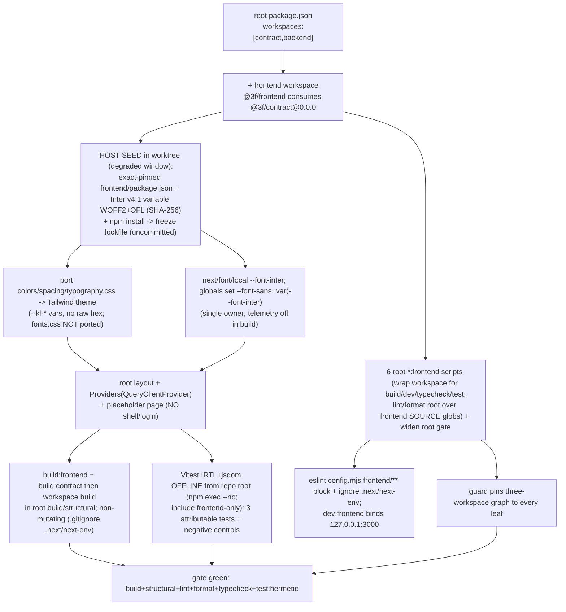

# Cold-read grill — gate: task — task plan frontend-foundation

You did NOT write what follows. Read it cold, as an adversary trying to break the handover, never as its author defending it. You are READ-ONLY: return findings, change nothing.

## Interrogation technique

Run the interrogation this way. The harness contract above is the floor; this is the technique.

---
name: grilling
description: Grill the user relentlessly about a plan, decision, or idea. Use when the user wants to stress-test their thinking, or uses any 'grill' trigger phrases.
---

Interview the user relentlessly until you reach a shared understanding. Map this as a **design tree**: every decision branches into the decisions that hang off it.

Work the tree in **rounds**. The **frontier** is every decision whose prerequisites are already settled: the questions you can ask _now_ without guessing at answers you haven't heard yet. Ask the whole frontier in one round: number each question and give your recommended answer. Then wait for the user's answers before the next round.

Format a round like so:

```
❓ **Q1** - **<question title>**: <question body, might be multiple paragraphs, including multiple choices>

➡️ <your recommended answer>

---

❓ **Q2** - **<question title>**: <question body, might be multiple paragraphs, including multiple choices>

➡️ <your recommended answer>
```

Each round the user answers reshapes the tree: settled decisions push the frontier outward and unblock questions that depended on them. Recompute the frontier and ask the next round. A question whose answer depends on another question still open in this round belongs to a _later_ round, not this one.

Finding _facts_ is your job, never the user's. When a frontier question needs a fact from the environment (filesystem, tools, etc.), dispatch a sub-agent to find it; don't ask the user for anything you could look up yourself. Don't block on it: a running exploration is an unsettled prerequisite, so only the questions downstream of it wait for the sub-agent to report; ask the rest of the frontier now. The _decisions_ are the user's: put each to them and wait.

The session is done when the frontier is empty: every branch of the design tree visited, nothing left silently assumed. Do not act on it until the user confirms you have reached a shared understanding.


## Harness grill contract

# Griller Prompt — adversarial handover interrogation

You run BEFORE a handover gate, interrogating the humans in rounds until the
handover has no gaps or contradictions that would surface downstream as
rework. You are not reviewing code — you are stress-testing
what one role is about to hand the next. The gate scripts REFUSE without
your fresh, passing record.

**Independence is the whole point.** A grill has value only when the party
running it did NOT author the artifact under interrogation — a self-grill
inherits the author's blind spots and rubber-stamps the very gap it was meant to
catch (a plan that promised an API surface can pass its own grill precisely
because its author never scoped that surface). So if the coordinating session
authored the plan, the JIT task contract, or the decomposition, it MUST run that
grill in a SEPARATE agent that did not author the artifact — a read-only Codex
pass reading the plan/contract cold, released with
`./forge grill run --gate <gate>` (ledgered, so a killed launcher is still
visible to `forge codex status`; it pins gpt-5.6-terra @ xhigh from
harness.yaml) — rather than certify its own work inline. Codex on `gpt-5.6-terra` @ xhigh
is the required cold reader for planning grills: a fresh model context fully
independent of the authoring session, and because it is read-only it never
writes, so the write-lock that gates the write companion does not apply. Do NOT
use a Claude sub-agent for the grill, and never grill your own work inline.
Interrogate as an adversary trying to break the handover, never as its author
defending it.

RELEASE IT THROUGH THE HARNESS. `./forge grill run --gate <gate>` composes the cold-read brief (this contract plus the artifact) and releases Codex through the SAME ledgered launcher a delegation uses: the pid is recorded before the wait, so a grill whose launcher is killed still shows up in `forge codex status` instead of vanishing. It is read-only, so it takes no delegation lock and can never satisfy `stage done`. Recording the gate stays yours — the cold read only returns findings.

The read-only Codex cold-reader LOADS and RUNS the `grill-me` skill (Matt
Pocock's, installed into `~/.codex/skills/grill-me` by `./forge doctor --fix`)
to structure its interrogation; this contract is the harness-side floor, the
skill is the technique. In Claude, the `/grill-me` skill satisfies the same.

WHICH RUNTIME CAN RECORD WHICH GATE — get this wrong and you will chase a
refusal you cannot satisfy. ALL SIX gates match the AskUserQuestion ledger and
are therefore CLAUDE-ONLY, each with a floor of ONE logged round: `--gate spec`,
`--gate signoff`, `--gate epics`, `--gate requirements`, `--gate plan` and
`--gate task` — the floors live in `grill_gates.GATES`, one row per gate.
`signoff` and `epics` used to sit outside that check and so recorded with ZERO
rounds behind them; they now answer to it like every other gate.

ONE round is a FLOOR, never a target. Keep going until a round comes back clean
AND the next one stays clean — a single quiet round after a noisy one is a
coincidence, not convergence. The ledger files are written ONLY by `post_tool_use.py` on a
Claude Code AskUserQuestion event; `.codex/hooks.json` registers no PostToolUse
hook, so Codex cannot produce them and neither can a subagent. Delegating a
ledger-matched grill to Codex returns a well-formed payload that the recorder
then refuses, with nothing you can do to satisfy it — the payload was never the
problem, the runtime was.

For those four ledger-matched gates, independence is a COLD READ,
not necessarily a separate process. The recorder accepts ONLY rounds that match a
logged AskUserQuestion record (`record_grill_from_json.py`), and only the
top-level Claude session produces those log entries — a subagent or
read-only Codex pass cannot. So for those grills the top-level session drives
the rounds through AskUserQuestion itself — but because the coordinating session
authored the plan, the independent cold-read pass is MANDATORY, not optional: on
EVERY round release a fresh READ-ONLY Codex pass with
`./forge grill run --gate <gate> [--task <id>]` that reads the plan/contract
cold and returns findings — never a
Claude sub-agent, never grill your own work inline — then carry ONLY those
findings into your own AskUserQuestion rounds (the recorder rejects rounds not in
the ledger, so the top-level session must still ask). Loop Codex grill → your
AskUserQuestion rounds → answers → Codex grill again, until a round is clean AND
the plan is stable; only then, approve exactly once. Read cold, as an adversary
who did not write it. (EVERY gate is ledger-matched — signoff and epics no
longer excepted — so no gate can be recorded by a read-only Codex grill alone:
the top-level session asks the round and records it.)

FRESH CONTEXT, NOT FRESH READING. Every round is a NEW read-only Codex session —
that independence is the whole point, and it is why the reader has no memory of
what it already blessed. It does NOT mean re-deriving the plan from scratch every
round: after the FIRST round, hand the fresh reader the plan AND what changed
since the last round (the resolutions you just folded in, and which sections they
touched), and tell it to concentrate there while still refusing anything it can
see is wrong elsewhere. Same cold judgement, a fraction of the tokens.

END EVERY ROUND WITH AN EXPLICIT CONVERGENCE VERDICT, on its own line, so the
coordinator never has to guess whether to grill again or approve:

- `CONVERGED — no gaps, no contradictions, plan unchanged since the last round`
- `NOT CONVERGED — <the specific reason: open gaps, a contradiction, or the plan
  changed after the last clean round>`

Converged means BOTH: this round is clean AND the plan did not change after the
round that made it clean. A clean round on a plan you have just edited is not
convergence — it is an unreviewed edit. Only `CONVERGED` authorises asking the
human for approval, and approval happens exactly once.

Five gates, five scopes:

- `--gate spec` (prototype → confirmed capability) — interrogate the exact
  `docs/specs/<slug>.md` file against BRIEF, architecture, decisions, and the
  prototype. Hunt: behavior the prototype proved but the spec omitted,
  implementation choices masquerading as requirements, vague acceptance
  language, and conflicts with active decisions.
- `--gate signoff` (client → PM, before `record_signoff.py`) — interrogate
  `docs/product/DISCOVERY.md`, `BRIEF.md`, confirmed specs, the spec-linked
  roadmap, `docs/decisions/`, and prototype notes. Hunt: unanswered
  stakeholder/constraint questions, scope
  the client saw vs. scope the BRIEF claims, decisions that contradict the
  BRIEF, acceptance criteria that are vibes instead of checks, non-functional
  requirements nobody asked about (auth, data retention, environments).
- `--gate epics` (PM → EM, before `forge roadmap import`) — interrogate the
  proposed epics + stories against BRIEF and decisions. Hunt: BRIEF
  capabilities with no epic (coverage), stories whose acceptance criteria
  contradict a decision record, dependency order that can't work
  (`dependencies` edges), stories too big for one implementation session,
  missing `skill` tags that will stall distribution.
- `--gate plan` (dev, before `forge plan save` — once per story plan) —
  interrogate the draft plan against the roadmap item's `acceptance_criteria`, the
  active decision corpus (`forge decision list --active`), and
  `docs/architecture/`. Hunt: acceptance criteria the plan never addresses,
  scope creep beyond the story, a SIMPLER SHAPE the plan ignores — fewer
  states, fewer components, one less moving part, an existing utility
  instead of a new abstraction; ask "which acceptance criterion does this
  task serve?" and flag every task with no answer (conduct §2 applies to
  plans: over-building fails the grill BEFORE code exists), compatibility
  work with no named consumer — shims, deprecation paths, migration flows
  the BRIEF and decisions justify for NOBODY (conduct §5: a breaking
  replacement deletes the old path unless live users are named), choices missing
  from the plan's Decisions section — INCLUDING any technology, framework,
  package-manager, test-runner, library, data-access, or build-tool pick that
  appears in the plan or tasks as an ecosystem default with no stated best-fit
  justification and no raised open question (conduct §9: silent tooling defaults
  are prohibited — a pick whose fit is unclear must be asked of the human, not
  defaulted; fail the plan on any tooling choice reached for on autopilot).
  Also flag a MISSING quality-gate baseline: any codebase the plan touches must
  wire a stack-APPROPRIATE static-analysis gate — a linter AND formatter, plus a
  type-checker where the language has one — into CI/verify, not merely a test
  runner. Name the CAPABILITY, never a fixed tool: ESLint/Biome for JS-TS,
  Ruff/flake8 for Python, golangci-lint for Go, Clippy for Rust, Checkstyle/
  Spotbugs for Java, and so on — the requirement is generic to every backend, not
  one ecosystem's tool. Fail the plan when code ships with no configured lint/
  format/static-analysis gate that an automated check enforces on every push; an
  absent linter is a silent quality default exactly like an unjustified tool pick.
  Also hold the plan against the CONSTITUTION's coding standards
  (`constitution/README.md` index — read the references it maps to the plan's
  surfaces). The constitution is law, so a plan whose SHAPE omits or contradicts a
  mandated standard is a GAP, not a style preference: HTTP surfaces with no typed
  request AND response DTOs (`pnp-api-standards`, `pnp-swagger-api-documentation-
  standards`), a module ignoring the modular-monolith layout or file-suffix
  standards (`pnp-coding-standards-modular-monolith`, `03`), missing structured
  logging (`05`/`06`) or domain exception handling (`07`), an external integration
  that skips the provider/port pattern (`08`, `pnp-provider-pattern-for-
  integration`), or database work ignoring `pnp-database-standards`. Flag each and
  require the plan to conform or record a deliberate, written deviation — never
  wave it through as "the implementer will follow standards later"; a plan must not
  design AGAINST the law. (`constitution/` is on disk in every environment, so the
  read-only Codex cold-read has the law available — hold the plan to it.)
  Reconcile the plan explicitly against
  EVERY ID from `forge decision list --active`; a conflict becomes a
  contradiction signal or a superseding decision, never a silent exception.
  Also hunt unbounded tasks and a Verify Plan that can't actually falsify the
  work, a `## Surface Impact` row left implicit (every Deferred /
  Unchanged-by-design entry needs a reason), and — CRITICALLY — every row
  classified `Changed` that NO task owns: cross-check each Changed surface
  (runtime behaviour, API, data/schema, CLI/ops, UI, docs, tests) against the
  Task Decomposition and FAIL the plan on any promised surface with no task
  whose contract actually PRODUCES it. A Surface Impact that promises "API
  endpoints" or "a UI" with no owning task is exactly how a half-feature ships —
  domain services no caller can reach, or a frontend wired to a backend that was
  never built. Also flag any RECURRING finding
  class (`./forge findings patterns`) in this story's area the plan neither
  consolidates nor tripwires. In Claude Code the
  `/grill-me` skill run against the plan satisfies this contract. The payload
  carries `"issue"`; the recorder stamps it against the active task.
- `--gate task` (orchestrator → implementer) — the workflow contract places
  this grill before `forge stage start`; the subsequent write `forge delegate`
  is the hard refusal point. Interrogate the next leaf task's just-authored
  contract in the re-recorded decomposition against the approved story plan,
  active decisions, and the actual repository state left by completed prior
  stages. Hunt: assumed files or APIs that prior work did not produce, stale
  or over-broad `write_scope`, acceptance criteria not served by the proposed
  work, a task that OWNS a plan `## Surface Impact` surface but whose
  `write_scope`/`required_tests` do not actually PRODUCE it (owns the API row but
  builds only domain services with no HTTP controllers/DTOs/routes; owns the UI
  row but ships no components) — reachability is part of "done", not a later
  task's problem, required tests that do not prove those criteria, verify commands that
  cannot falsify the change, reviewer focus that misses the risky seam OR that
  re-states shape rules the constitution already sets instead of CITING the
  load-bearing `constitution/` references for the task (the contract points at the
  law, never re-derives or contradicts it), and a
  `user_facing` flag that misclassifies the task — a UI task left `false` (its
  mandatory design skills and design review would be skipped) or a backend task
  marked `true` (forced to attest UI design skills it has no use for).
  This is the JIT task-planning gate from decision 0032, not a repeat of the
  story-level plan grill. Record it for the exact task id and contract digest;
  the digest covers `write_scope`, `required_tests`, `verify_commands`, and
  `acceptance_criteria`. A changed field makes the old task grill stale, and a
  write delegation refuses it; read-only delegation is unaffected.

Method:

1. Read the artifacts in scope FIRST; derive your question list from actual
   text, citing it (`BRIEF.md says X; decision 0003 says Y — which wins?`).
2. Interrogate in ROUNDS until the frontier is empty — not one pass. Each
   round, put the questions whose prerequisites are already settled to the
   human (PM or EM) with your recommended answer; their answers reshape the
   tree and unblock the next round's questions. Stop a single question when it
   would only confirm what a document already states; stop the grill only when
   no gap or contradiction remains unasked. In Claude Code, deliver each
   round's frontier through the AskUserQuestion tool (recommended answer
   first), not prose. For every ledger-matched gate (`spec`, `requirements`,
   `plan`, `task`) the recorder requires
   the FINAL round in the payload to carry `"frontier_empty": true` — that flag
   is how it confirms you stopped because the frontier closed, not because you
   ran out of patience; it is set by hand on the last `rounds` entry, never by
   the ledger. A zero-gap contract still needs at least one such round (every
   gate's floor is 1, and a floor is not a target), so ask a genuine closing
   question
   (e.g. "any remaining gap before we hand off?") and mark it `frontier_empty`.
3. Every finding lands somewhere real before the verdict: a doc edit, a
   `./forge decision new <slug>` record, or an explicit non-blocking entry
   in `open_items`. An `open_items` entry that PARKS scope also gets a
   deferral row with a revisit trigger (`./forge defer add`) — parked scope
   without a trigger is scope silently dropped. Unresolved blocking
   findings ⇒ verdict `blocked`.
4. Record the outcome (schema: `factory/schemas/grill.json`,
   `"generated_by": "griller"`):

   A task-grill input uses this recorded shape (the recorder adds its own
   task id, digests, commit, and timestamps):

```json
{
  "generated_by": "griller",
  "verdict": "pass",
  "gaps": [],
  "contradictions": [],
  "resolutions": ["What was sanctioned"],
  "inspected_refs": ["path/or/path:symbol"],
  "current_flow": "What the repository does now",
  "criteria_map": {"criterion": "proof"},
  "decision": "keep",
  "new_abstractions": ["None"],
  "rounds": [{"question": "Finding or choice", "options": ["Recommended", "Alternative"], "chosen": "Recommended", "frontier_empty": true}],
  "citations": [{"finding": "Repo-answerable finding", "source": "path:symbol"}],
  "open_items": []
}
```

   Each `rounds` entry has a non-empty `question`, two to four non-empty
   string `options`, and a `chosen` value equal to one option. Each citation
   is `{finding, source}`. Every string in `gaps` must be covered by an equal
   `rounds[].question` or `citations[].finding`.

   For every gate — all six are ledger-matched — extra recorder rules bind
   (this is what makes an otherwise well-formed payload fail):
   - Rounds must match the AskUserQuestion ledger and meet the gate floor
     (1 for every gate, and a floor is not a target); the final round carries
     `"frontier_empty": true`. A
     zero-gap grill still records its floor of real rounds — never zero.
   - `--gate task` only: `criteria_map` is a THREE-WAY equality — its KEYS must
     equal the frontier task's `acceptance_criteria` set AND the set of its
     `plan_contracts[].statement` values, exactly (no extra key, none missing);
     each value is the non-empty proof for that criterion. Author the task's
     `acceptance_criteria` and its `plan_contracts` statements as the SAME
     strings so there is one coherent key set to satisfy.

```bash
python3 factory/scripts/record_grill_from_json.py --gate <spec|signoff|epics|requirements|plan|task> --input <json> [--input-digest <artifact>] [--task <id>]
```

5. For every gate except task, commit the resolution edits
   BEFORE recording the grill — those gates check freshness against BOTH
   committed history and the working tree: any guarded doc changing after the
   grill (even uncommitted) stales it. (The sign-off / epics-approved decision
   records themselves are expected afterwards and don't stale it.) The task
   gate instead binds directly to the re-recorded task contract digest; the JIT
   sequence does not require a commit between re-recording and grilling. But that
   digest still folds in the product tree, so record the task grill LAST — after
   any docs/ or factory/scripts commits: a tracked change outside .factory/ and
   plans/ that lands between grilling and `task approve`/`stage start` re-stales
   it and forces a re-grill.
6. `--input-digest` is REQUIRED for the spec, epics, and plan gates: pass the
   exact spec / roadmap input / plan draft you interrogated. The gate verifies the
   digest — grilling version A never approves an edited version B; if the
   artifact changes, re-grill it. For `--gate task`, pass `--task <id>` and NO
   `--task-digest` — that flag was removed and the recorder rejects it; the
   recorder derives the grounding digest itself from the protected contract,
   approved plan, and product tree, and stores the result at
   `.factory/grills/tasks/<id>.json`.

A `pass` with unresolved findings is refused by the recorder. Grill hard;
downstream implementation inherits whatever you let through.


## The artifact under interrogation (task plan frontend-foundation)

# Task plan — frontend-foundation

## Context
platform-base tasks 1–6 delivered the vendored NestJS backend + `@3f/contract`, the Postgres
warehouse adapter, boot + email/OTP auth, the Pulse→3F rebrand (decision 0010), the repo-wide
quality gate (backend + contract), and the API-surface trim + loopback hardening. This task
scaffolds the **fresh** frontend (decisions 0006/0007): a Next.js (App Router) `frontend/` npm
workspace and its toolchain — the `_ds`-token Tailwind theme, locally vendored Inter via
`next/font/local`, in-tree shadcn/ui primitives, a TanStack Query provider, and the frontend
quality gate — plus **widening the repo-wide gate** (build + lint + format + typecheck + test) to
the frontend. It ships **no app screens**: a minimal root layout (fonts + providers) and a
placeholder page only, so `next build` succeeds. The **user-facing shell + OTP login is the next
task** (`frontend-shell-login`, T8, `user_facing: true`); this foundation is what it builds on.

## user_facing = false (explicit, bounded exception)
This task renders only a **build/test smoke** — a placeholder page + one primitive — not a product
surface a user navigates to. The approved plan places the first user-facing surface (the shell + OTP
login, WITH the frontend design skills + functional check) in **frontend-shell-login (T8,
user_facing: true)**; the human set "design review on T8" (2026-09-04). No design-fidelity or
functional-check gate is owed here.

## Decisions 0001–0013 disposition (canon)
- **APPLY here:** 0006 (fresh frontend), 0007 (Next.js), 0010 (consume `@3f/contract`); 0009 in its
  Vitest analogue (real named tests; `TS_NODE_PROJECT` is backend ts-node only, N/A).
- **Deferred / scope-out:** 0011 / D-0003 keeps deployment-readiness (prod CORS, secret ownership,
  real email, residency) out — this is the local mock-OTP PoC. 0001 (PoC scope) + 0005 (sign-off) are
  satisfied context.
- **N/A (later screens):** 0002 (Phase-1 MIS), 0003 (MIS presentation).
- **N/A (backend only):** 0004 (governed joins), 0008 (backend vendored snapshot — the frontend is
  fresh), 0012 (vendored-API deviation), 0013 (backend observability).
- **D-0005**: this task lands the 3F `_ds` token coverage that replaced `backend/src/atlasTokens.test.ts`.
- npm workspaces (not Nx): documented `constitution/01` deviation, confirmed 2026-09-04; no silent
  tooling defaults (`constitution/09` §9).

## Provisioning — the seed is the FIRST in-worktree step (no-network sandbox, non-circular)
The grill binds the contract + approved plan + master tree (no `frontend/` yet). **After** task start,
**inside the worktree**, the orchestrator runs a ledgered **degraded-window host SEED** (the implementer's
sandbox has no network); this is not a pre-grill mutation and does not need `git status` clean:
1. **Manifest** — author `frontend/package.json` with **exact-pinned** versions (no `^`/`~`), `@3f/contract`
   pinned to `0.0.0` as a **manifest-level** workspace dep (no fabricated runtime import — first real use is T8);
   add `frontend` to root `workspaces`.
2. **Font (provenance-checked)** — vendor the **Inter variable** WOFF2 from **rsms/inter release v4.1**
   (`InterVariable.woff2`) + its `OFL.txt` under `frontend/app/fonts/`; record source + release + filename +
   the **expected SHA-256** (taken from that official immutable release) in `frontend/app/fonts/PROVENANCE.md`
   and verify the downloaded bytes against that **pre-declared** digest at seed (not a self-computed one).
3. **Freeze** — host `npm install` writes `package-lock.json` (the binding pin).
These seed changes are **uncommitted**; the delegate then writes all code/config/tests OFFLINE on top of
them and **never edits dependency versions**. The whole diff (seed + code) is measured at stage-done — the
tree is legitimately dirty *during* the stage. `npm ci` clean-install determinism is CI's networked job.

## Seed dependency set (exact-pinned; frozen by the lockfile)
Target versions the seed pins (the lockfile is authoritative if a patch resolves differently):
- runtime: `next` 15.1.6, `react` 19.0.0, `react-dom` 19.0.0, `@tanstack/react-query` 5.64.2,
  `class-variance-authority` 0.7.1, `clsx` 2.1.1, `tailwind-merge` 2.6.0, `@radix-ui/react-slot` 1.1.1,
  `@3f/contract` 0.0.0 (workspace). **`lucide-react` is NOT seeded here** (deferred to T8, its first consumer).
- toolchain: `typescript` 5.7.3, `@types/react` 19.0.7, `@types/react-dom` 19.0.3, `@types/node` 22.10.7,
  `tailwindcss` 3.4.17, `postcss` 8.5.1, `autoprefixer` 10.4.20, `eslint-config-next` 15.1.6.
  **No second `eslint`** — the frontend is linted by the ROOT ESLint (9.x); the root config wraps
  `eslint-config-next/core-web-vitals` (which 15.1.6 ships as **eslintrc**, not flat) into flat config via
  **`FlatCompat`** from `@eslint/eslintrc` (ships with ESLint).
- test: `vitest` 2.1.8, `@vitejs/plugin-react` 4.3.4, `@testing-library/react` 16.1.0,
  `@testing-library/jest-dom` 6.6.3, `@testing-library/dom` 10.4.0, `jsdom` 25.0.1. Prettier stays the root version.

## Write scope
`frontend/` (the whole new workspace), `package.json`, `package-lock.json`, `eslint.config.mjs`,
`tools/quality-gate.test.mjs`. **NOT `.envrc`** (FACTORY_* names unchanged) and **NOT `.prettierignore`**
(format globs are source-scoped, so no new ignore — D-0006 untouched). This JIT scope is the binding
contract; it refines the story plan's abbreviated T7 sketch (adds the gate-widening files the decomposition
objective already assigns T7); the story prose is left as-approved to avoid a disproportionate re-approval.

## Workflow


## Approach
1. **Workspace** — add `frontend` to root `workspaces`; the seeded `frontend/package.json` (`@3f/frontend`,
   private, exact deps) + `frontend/tsconfig.json` **pre-authored with the Next TS plugin + `.next/types`
   include** and `frontend/.gitignore` (`.next/`, `next-env.d.ts`, `*.tsbuildinfo`) so the first build is non-mutating.
2. **Theme** — port the `_ds` `colors.css`, `spacing.css`, `typography.css` **definition** files (they carry
   the `--kl-*` hex, as definitions must); the Tailwind config + all **components** consume `var(--kl-*)` with
   **no raw hex**. A hermetic test asserts **set-level parity** — every source `--kl-*` is present in the ported
   theme (D-0005). **Do NOT port `fonts.css`**.
3. **Fonts** — `next/font/local` → `InterVariable.woff2` exposing `--font-inter`; globals set
   `--font-sans: var(--font-inter), <fallbacks>` **after** the token import (single owner). OFL + PROVENANCE
   (source/release/filename/SHA-256) committed. A hermetic test scans **only** runtime `frontend/` source
   (`app/`, `src/`, config) for `next/font/google` and `fonts.googleapis.com`/`fonts.gstatic.com`.
4. **Primitives + providers** — an in-tree `button` primitive (`@radix-ui/react-slot`) + `cn()` util; a root
   layout wiring the font + a client `Providers` boundary (`QueryClientProvider`); a **placeholder page**
   (token-themed landing, NOT the Dashboard/shell/login).
5. **Scripts** — workspace `@3f/frontend`: `build` (`NEXT_TELEMETRY_DISABLED=1 next build`), `dev`
   (`next dev -H 127.0.0.1 -p 3000`), `typecheck` (`tsc --noEmit`), `test` (vitest). Root: `build:frontend`
   (`= npm run build:contract && npm -w @3f/frontend run build`), `dev:frontend`, `typecheck:frontend`,
   `test:frontend` **wrap** those; `lint:frontend`/`format:check:frontend` run root ESLint/Prettier over
   **frontend source globs** (`frontend/app`, `frontend/src`, named config — excluding generated files). Add
   `build:frontend` to root **`build`**; widen root `lint`, `format:check`, `typecheck`, `test:hermetic`.
6. **ESLint** — `eslint.config.mjs` gains a `frontend/**` block that wraps `eslint-config-next/core-web-vitals`
   into flat config via **`FlatCompat`** (`@eslint/eslintrc`) so the frontend genuinely gets Next+TS rules, plus
   an `ignores` entry for `frontend/.next/**` + `next-env.d.ts`; the frontend reuses the **root** ESLint (no second pin).
7. **Vitest** — `frontend/vitest.config.ts` (jsdom, `@vitejs/plugin-react`, RTL setup) with **`root` = repo
   root** and **`test.include` = `frontend/**/*.test.{ts,tsx}`** (frontend-only). Run **offline** via
   `npm exec --no -- vitest` (never `npx`). Three attributable tests, each with a negative control (0009).
8. **Guard** — widen `tools/quality-gate.test.mjs`: prove the frontend lint is **effective** (run ESLint over a
   `frontend/**` fixture with a known violation and assert it is reported — a silently-empty config fails); pin the
   six `*:frontend` bodies (real `build:frontend` incl. `build:contract` + `NEXT_TELEMETRY_DISABLED`, real vitest
   `test:frontend`) + the widened root `build`/`structural`/`lint`/`format:check`/`typecheck`/`test:hermetic`;
   assert the non-mutating `frontend/.gitignore` + tsconfig entries; keep the D-0006 baseline + CI pins (no
   `.prettierignore` edit).

## Acceptance criteria
- frontend is a third npm workspace (root workspaces adds "frontend") with a pre-authored tsconfig (Next TS plugin + .next/types include) and a frontend/.gitignore for .next/, next-env.d.ts and *.tsbuildinfo, so `next build` is NON-MUTATING - made falsifiable by the guard (it asserts those .gitignore entries and the tsconfig plugin/include) and by stage-done, which rejects any tracked-file change from verification. The root *:frontend scripts that need the app context (build, dev, typecheck via tsc --noEmit, test via vitest) WRAP the @3f/frontend workspace scripts; build:frontend runs build:contract first (= npm run build:contract && npm -w @3f/frontend run build) as workspace dependency-ordering hygiene and is added to root `build` so `structural`/FACTORY_STRUCTURAL_CMD compiles all three workspaces. @3f/contract is declared as a MANIFEST-level workspace dependency (pinned 0.0.0) - this foundation adds no runtime import (the first genuine consumption is frontend-shell-login's api.ts transport). A minimal root layout (fonts + providers) + a placeholder page exist so the build succeeds; NO Dashboard/shell/nav/top-bar/login screens (frontend-shell-login owns those)
- the Tailwind theme is driven entirely by the _ds token variables ported from docs/design/3F-Financial-MIS/_ds/knacklabs-design-system-63be358e-2e64-4441-bcd0-253b9c903a8b/tokens/colors.css, spacing.css and typography.css: the ported token DEFINITION files carry the --kl-* definitions (with the source hex, as a definition must), while the Tailwind config and ALL components CONSUME them via var(--kl-*)/theme tokens with NO raw hex; a hermetic test asserts SET-LEVEL PARITY - every --kl-* variable the source colors/spacing/typography.css defines is present in the ported theme (the D-0005 replacement coverage), with a negative control. fonts.css is NOT ported (its Google @import is design-reference only). The runtime font is a locally vendored Inter VARIABLE WOFF2 from the official immutable rsms/inter release v4.1 (InterVariable.woff2 + OFL.txt); its expected SHA-256 is taken from that official release and committed as the pin in frontend/app/fonts/PROVENANCE.md, and the host seed verifies the downloaded bytes against that PRE-DECLARED expected digest (not a self-computed one). It loads via next/font/local exposing --font-inter; globals set --font-sans: var(--font-inter), <fallbacks> AFTER the token import so the local font is the SINGLE owner. next/font/google is never imported and a hermetic test scans ONLY runtime frontend/ source (app/, src/, config) for next/font/google and fonts.googleapis.com/fonts.gstatic.com. NEXT_TELEMETRY_DISABLED=1 is set in the workspace build script (disabling Next telemetry, not claimed as full network proof); dev:frontend binds loopback 127.0.0.1:3000
- root scripts build:frontend, dev:frontend, lint:frontend, format:check:frontend, typecheck:frontend and test:frontend exist and name real bodies; build/dev/typecheck/test wrap the @3f/frontend workspace scripts, while lint and format run from repo root over frontend SOURCE globs (frontend/app, frontend/src and named config, excluding generated files so NO .prettierignore change is needed) using the root eslint.config.mjs and root Prettier; eslint.config.mjs gains a frontend/** block that translates eslint-config-next/core-web-vitals into flat config via FlatCompat (@eslint/eslintrc) - so the frontend actually receives the Next + TypeScript rules rather than a silently-empty config - and ignores frontend/.next/ + next-env.d.ts, reusing the root ESLint (no second eslint pinned); the ESLint + Prettier + tsc --noEmit gate runs green from repo root with root lint, format:check and typecheck widened to include the frontend
- a pinned, local, OFFLINE Vitest + React Testing Library + jsdom runner (invoked via `npm exec --no`, never npx) executes from repo root; frontend/vitest.config.ts sets root to the repo root and scopes test.include to frontend/**/*.test.{ts,tsx} so it never discovers the backend suite. The ATTRIBUTABLE JUnit testcases come from the task's required_tests stage-proof commands (which force --reporter=junit) - the token-parity, local-font/no-google-font source-scan and TanStack-Query-provider tests, each with a negative control (decision 0009); root test:hermetic runs the frontend vitest suite for pass/fail gating (not a JUnit claim), and test:hermetic is one of this task's verify_commands. Delegated verification runs against the host-seeded node_modules (no network, so no `npm ci`); clean-install determinism via `npm ci` against the frozen package-lock.json is CI's networked job
- the repo-wide quality gate is widened to the frontend, pinned to every runnable leaf, and its EFFECTIVENESS is proven: the quality-gate guard (tools/quality-gate.test.mjs) runs ESLint over a frontend/** fixture carrying a known violation and asserts it is reported (so a silently-empty frontend config fails), pins the six *:frontend bodies (the real build:frontend with build:contract + NEXT_TELEMETRY_DISABLED and the real vitest test:frontend, not just names) and the widened root build/structural/lint/format:check/typecheck/test:hermetic, and asserts the non-mutating-build .gitignore + tsconfig entries; eslint.config.mjs covers frontend/** and ignores generated output; NO .prettierignore change is made (source-scoped format globs) so D-0006 is untouched; frontend dependencies (including @3f/contract 0.0.0) are exact-pinned (no ^/~) and frozen by package-lock.json (CI uses npm ci); the D-0006 baseline and CI trigger pins stay intact

## Reviewer focus
FOUNDATION ONLY - no app screens (shell/nav/top-bar/login are T8). USER_FACING=false is deliberate: a
build/test smoke (placeholder + one primitive), design-reviewed surface + functional check are T8's
("design review on T8", human 2026-09-04). SEED is the first in-worktree step (degraded window) AFTER task
start - NOT a pre-grill mutation; it authors exact-pinned frontend/package.json + Inter v4.1 WOFF2 (+OFL
+SHA-256 provenance, verified) + host npm install (freeze lockfile), leaving UNCOMMITTED changes the
delegate builds on offline; whole diff measured at stage-done (tree dirty during the stage, not 'clean
before delegate'). STORY-PLAN: JIT write_scope is binding; it refines the abbreviated T7 sketch (adds
eslint.config.mjs + guard per the decomposition objective; drops .envrc/.prettierignore - no change
needed); story prose left as-approved. TOKENS ONLY (no hex) from colors/spacing/typography.css (D-0005);
fonts.css NOT ported. FONT single-owner: next/font/local --font-inter; globals override --font-sans after
the token import. SCAN runtime source only (app/src/config; not build output, not docs/design). LINT:
reuse ROOT eslint (no second pin); eslint.config.mjs frontend/** flat block + ignore .next/next-env.
VITEST offline (npm exec --no, never npx) + frontend-only include (no backend/DB discovery) + 3 attributable
tests w/ negative controls; delegated verify uses seeded node_modules (no npm ci - CI's job). NON-MUTATING
build (.gitignore .next/next-env; tsconfig pre-authored). BUILD:frontend in root build/structural, builds
@3f/contract first. dev:frontend 127.0.0.1:3000. GUARD every leaf; D-0006 + CI pins intact. lucide-react
deferred to T8. DECISIONS: 0006/0007/0010 APPLY; 0009 in its Vitest analogue; 0011/D-0003 keeps deployment
readiness deferred; 0001/0005 satisfied context; 0002/0003 later MIS screens N/A; 0004/0008/0012/0013
backend-only N/A. Consumes @3f/contract (dist/index.js). constitution/01 + /09 §9.

## Verify
- `npm run build` green — builds contract, backend AND frontend (`next build`, telemetry off); `npm run
  structural` therefore covers the frontend; the build leaves no git-visible change (`.next/`, `next-env.d.ts` ignored).
- `npm run typecheck` (incl. frontend `tsc --noEmit`), `npm run lint`, `npm run format:check` green.
- `npm run test:hermetic` runs the three frontend Vitest tests (attributable JUnit, negative controls
  checked, google-font source-scan) + the widened guard, all green with the three-workspace pinned graph.
- (delegated verify uses the host-seeded node_modules; `npm ci` is CI's networked check.)

## Manual Verification
1. host seed done → `frontend/node_modules` present via the frozen lockfile; PROVENANCE SHA-256 verified.
2. `npm run build:frontend` → **observe** a successful `next build`; runtime source contains no
   `next/font/google` / `fonts.googleapis.com` reference (source scan) and telemetry is disabled;
   `git status` shows no generated-file churn (`.next/`, `next-env.d.ts` ignored).
3. `npm run dev:frontend` → **observe** Next on **127.0.0.1:3000** (not 0.0.0.0); the placeholder page
   renders in the `_ds` theme (Off-White canvas, Inter) — no shell/nav/login.
4. `npm run lint && npm run format:check && npm run typecheck` → **observe** green across all three workspaces.
5. `npm run test:hermetic` → **observe** the three frontend Vitest testcases in the JUnit output,
   attributable to their files/names, their negative controls, plus the guard test passing.


## What to return

Findings only: contradictions, gaps, unstated assumptions, and anything a reader would have to guess. Say what would break and why. Do not record a gate — the coordinating session records it.

The round count below is a FLOOR, not a target. Keep grilling until a round comes back clean AND stays clean on the next one — hitting the floor is not the same as passing.
