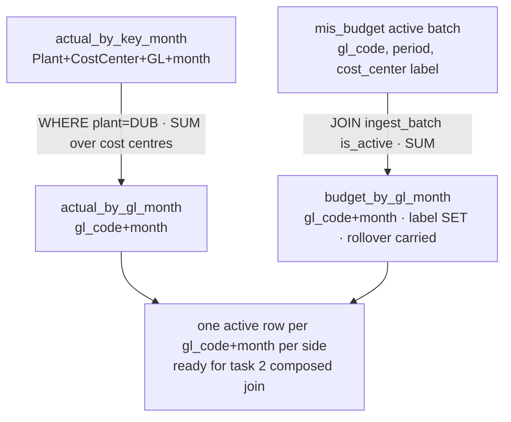

# Cold-read grill — gate: task — task plan gl-month-rollups

You did NOT write what follows. Read it cold, as an adversary trying to break the handover, never as its author defending it. You are READ-ONLY: return findings, change nothing.

## Interrogation technique

Run the interrogation this way. The harness contract above is the floor; this is the technique.

---
name: grilling
description: Grill the user relentlessly about a plan, decision, or idea. Use when the user wants to stress-test their thinking, or uses any 'grill' trigger phrases.
---

Interview the user relentlessly until you reach a shared understanding. Map this as a **design tree**: every decision branches into the decisions that hang off it.

Work the tree in **rounds**. The **frontier** is every decision whose prerequisites are already settled: the questions you can ask _now_ without guessing at answers you haven't heard yet. Ask the whole frontier in one round: number each question and give your recommended answer. Then wait for the user's answers before the next round.

Format a round like so:

```
❓ **Q1** - **<question title>**: <question body, might be multiple paragraphs, including multiple choices>

➡️ <your recommended answer>

---

❓ **Q2** - **<question title>**: <question body, might be multiple paragraphs, including multiple choices>

➡️ <your recommended answer>
```

Each round the user answers reshapes the tree: settled decisions push the frontier outward and unblock questions that depended on them. Recompute the frontier and ask the next round. A question whose answer depends on another question still open in this round belongs to a _later_ round, not this one.

Finding _facts_ is your job, never the user's. When a frontier question needs a fact from the environment (filesystem, tools, etc.), dispatch a sub-agent to find it; don't ask the user for anything you could look up yourself. Don't block on it: a running exploration is an unsettled prerequisite, so only the questions downstream of it wait for the sub-agent to report; ask the rest of the frontier now. The _decisions_ are the user's: put each to them and wait.

The session is done when the frontier is empty: every branch of the design tree visited, nothing left silently assumed. Do not act on it until the user confirms you have reached a shared understanding.


## Harness grill contract

# Griller Prompt — adversarial handover interrogation

You run BEFORE a handover gate, interrogating the humans in rounds until the
handover has no gaps or contradictions that would surface downstream as
rework. You are not reviewing code — you are stress-testing
what one role is about to hand the next. The gate scripts REFUSE without
your fresh, passing record.

**Independence is the whole point.** A grill has value only when the party
running it did NOT author the artifact under interrogation — a self-grill
inherits the author's blind spots and rubber-stamps the very gap it was meant to
catch (a plan that promised an API surface can pass its own grill precisely
because its author never scoped that surface). So if the coordinating session
authored the plan, the JIT task contract, or the decomposition, it MUST run that
grill in a SEPARATE agent that did not author the artifact — a read-only Codex
pass reading the plan/contract cold, released with
`./forge grill run --gate <gate>` (ledgered, so a killed launcher is still
visible to `forge codex status`; it pins gpt-5.6-terra @ xhigh from
harness.yaml) — rather than certify its own work inline. Codex on `gpt-5.6-terra` @ xhigh
is the required cold reader for planning grills: a fresh model context fully
independent of the authoring session, and because it is read-only it never
writes, so the write-lock that gates the write companion does not apply. Do NOT
use a Claude sub-agent for the grill, and never grill your own work inline.
Interrogate as an adversary trying to break the handover, never as its author
defending it.

RELEASE IT THROUGH THE HARNESS. `./forge grill run --gate <gate>` composes the cold-read brief (this contract plus the artifact) and releases Codex through the SAME ledgered launcher a delegation uses: the pid is recorded before the wait, so a grill whose launcher is killed still shows up in `forge codex status` instead of vanishing. It is read-only, so it takes no delegation lock and can never satisfy `stage done`. Recording the gate stays yours — the cold read only returns findings.

The technique is Matt Pocock's `grilling` skill — the design tree, the
frontier, numbered questions with recommended answers. `doctor --fix` installs
it into BOTH runtimes, and `./forge grill run` also inlines it into the brief,
so a reader reaches it whether or not its runtime resolves skills. This
contract is the harness-side floor; `grilling` is the technique.

`grill-me` is the HUMAN entry point — you type `/grill-me` and it redirects to
`grilling`. It carries `disable-model-invocation: true`, so no model invokes it
and none should be told to.

WHICH RUNTIME CAN RECORD WHICH GATE — get this wrong and you will chase a
refusal you cannot satisfy. ALL SIX gates match the AskUserQuestion ledger and
are therefore CLAUDE-ONLY, each with a floor of ONE logged round: `--gate spec`,
`--gate signoff`, `--gate epics`, `--gate requirements`, `--gate plan` and
`--gate task` — the floors live in `grill_gates.GATES`, one row per gate.
`signoff` and `epics` used to sit outside that check and so recorded with ZERO
rounds behind them; they now answer to it like every other gate.

ONE round is a FLOOR, never a target. Keep going until a round comes back clean
AND the next one stays clean — a single quiet round after a noisy one is a
coincidence, not convergence. The ledger files are written ONLY by `post_tool_use.py` on a
Claude Code AskUserQuestion event; `.codex/hooks.json` registers no PostToolUse
hook, so Codex cannot produce them and neither can a subagent. Delegating a
ledger-matched grill to Codex returns a well-formed payload that the recorder
then refuses, with nothing you can do to satisfy it — the payload was never the
problem, the runtime was.

For those four ledger-matched gates, independence is a COLD READ,
not necessarily a separate process. The recorder accepts ONLY rounds that match a
logged AskUserQuestion record (`record_grill_from_json.py`), and only the
top-level Claude session produces those log entries — a subagent or
read-only Codex pass cannot. So for those grills the top-level session drives
the rounds through AskUserQuestion itself — but because the coordinating session
authored the plan, the independent cold-read pass is MANDATORY, not optional: on
EVERY round release a fresh READ-ONLY Codex pass with
`./forge grill run --gate <gate> [--task <id>]` that reads the plan/contract
cold and returns findings — never a
Claude sub-agent, never grill your own work inline — then carry ALL of those
findings into your own AskUserQuestion rounds (the recorder rejects rounds not in
the ledger, so the top-level session must still ask). Read cold, as an adversary
who did not write it.

ONE COLD READ PER GATE — put every question to the human INSIDE it. The old
shape was Codex grill → your rounds → amend → Codex grill AGAIN, looping until
clean. That loop cannot converge: a fresh reader has no memory of what the last
one found, so it returns a DIFFERENT frontier rather than a shorter one, and the
artifact you amended to close round one becomes round two's input. Stories
reached eleven, twenty-six and forty rounds that way; the last cost six hours.
`forge grill run` now REFUSES a second unconstrained read on a gate that has
already been read since its last recorded pass.

So the WHOLE grill is:

1. `./forge grill run --gate <gate>` — one cold read. WATCH it.
2. Clean? Record the pass and approve. Nothing else happens.
3. Otherwise resolve every finding the REPOSITORY answers yourself — open the
   file and settle it. Take to the human only what the repository cannot
   answer: a decision nobody has made, a priority, a tradeoff between two
   workable shapes. Put those through AskUserQuestion with your recommended
   answer first, all of them, now. There is no later round to save the hard
   ones for, and a finding is not a menu.
4. Amend the artifact ONCE, to what they decided.
5. Record the pass against the AMENDED version, then approve exactly once.

The price is stated plainly, twice over: nothing independent re-reads the
amended version, and a gap this reader misses is not caught by a second reader
at this gate. Both surface at the next gate, or in review. That is the trade
for ending a loop that was costing whole days.

If the human's answers changed the artifact's SHAPE — a component dropped, a
different approach chosen — the amended artifact is not the one that was read
in any useful sense. Say so and read again: `./forge grill run --gate <gate>
--reread "<what changed shape>"`. It is a choice with a recorded reason, not a
way around the rule, and the five-read cap still backstops it. (EVERY gate is ledger-matched — signoff and epics no
longer excepted — so no gate can be recorded by a read-only Codex grill alone:
the top-level session asks the round and records it.)

FRESH CONTEXT, AND THE ANSWERS SO FAR. Every round is a NEW read-only Codex
session — that independence is the whole point. But a reader that knows nothing
of the earlier rounds does not re-find the same gaps, it finds DIFFERENT ones,
so the rounds never shrink and the grill has no natural end. `./forge grill run`
therefore carries every question already put to the human and the answer they
chose, read from the ledger the recorder validates against.

That gives the reader two obligations: do not re-raise settled questions, and
CHECK EACH ANSWER — that the artifact honours it, and that it contradicts no
other answer, accepted decision or constitution rule. An answer can be wrong, or
right and never applied; saying so is part of the read.

Do NOT tell the reader where to concentrate. A cold read is worth having because
it is unconstrained, and steering it toward the diff is how the thing nobody
looked at survives every round. More information, no direction.

END EVERY ROUND WITH AN EXPLICIT CONVERGENCE VERDICT, on its own line, so the
coordinator never has to guess whether to grill again or approve:

- `CONVERGED — no gaps, no contradictions, plan unchanged since the last round`
- `NOT CONVERGED — <the specific reason: open gaps, a contradiction, or the plan
  changed after the last clean round>`

`CONVERGED` on the cold read means there is nothing to amend: record and
approve. `NOT CONVERGED` does NOT mean read again — it means resolve what the
repository answers, put the rest to the human, amend once, and record the pass
against the amended version. Approval happens exactly once.

Five gates, five scopes:

- `--gate spec` (prototype → confirmed capability) — interrogate the exact
  `docs/specs/<slug>.md` file against BRIEF, architecture, decisions, and the
  prototype. Hunt: behavior the prototype proved but the spec omitted,
  implementation choices masquerading as requirements, vague acceptance
  language, and conflicts with active decisions.
- `--gate signoff` (client → PM, before `record_signoff.py`) — interrogate
  `docs/product/DISCOVERY.md`, `BRIEF.md`, confirmed specs, the spec-linked
  roadmap, `docs/decisions/`, and prototype notes. Hunt: unanswered
  stakeholder/constraint questions, scope
  the client saw vs. scope the BRIEF claims, decisions that contradict the
  BRIEF, acceptance criteria that are vibes instead of checks, non-functional
  requirements nobody asked about (auth, data retention, environments).
- `--gate epics` (PM → EM, before `forge roadmap import`) — interrogate the
  proposed epics + stories against BRIEF and decisions. Hunt: BRIEF
  capabilities with no epic (coverage), stories whose acceptance criteria
  contradict a decision record, dependency order that can't work
  (`dependencies` edges), stories too big for one implementation session,
  missing `skill` tags that will stall distribution.
- `--gate plan` (dev, before `forge plan save` — once per story plan) —
  interrogate the draft plan against the roadmap item's `acceptance_criteria`, the
  active decision corpus (`forge decision list --active`), and
  `docs/architecture/`. Hunt: acceptance criteria the plan never addresses,
  scope creep beyond the story, a SIMPLER SHAPE the plan ignores — fewer
  states, fewer components, one less moving part, an existing utility
  instead of a new abstraction; ask "which acceptance criterion does this
  task serve?" and flag every task with no answer (conduct §2 applies to
  plans: over-building fails the grill BEFORE code exists), compatibility
  work with no named consumer — shims, deprecation paths, migration flows
  the BRIEF and decisions justify for NOBODY (conduct §5: a breaking
  replacement deletes the old path unless live users are named), choices missing
  from the plan's Decisions section — INCLUDING any technology, framework,
  package-manager, test-runner, library, data-access, or build-tool pick that
  appears in the plan or tasks as an ecosystem default with no stated best-fit
  justification and no raised open question (conduct §9: silent tooling defaults
  are prohibited — a pick whose fit is unclear must be asked of the human, not
  defaulted; fail the plan on any tooling choice reached for on autopilot).
  Also flag a MISSING quality-gate baseline: any codebase the plan touches must
  wire a stack-APPROPRIATE static-analysis gate — a linter AND formatter, plus a
  type-checker where the language has one — into CI/verify, not merely a test
  runner. Name the CAPABILITY, never a fixed tool: ESLint/Biome for JS-TS,
  Ruff/flake8 for Python, golangci-lint for Go, Clippy for Rust, Checkstyle/
  Spotbugs for Java, and so on — the requirement is generic to every backend, not
  one ecosystem's tool. Fail the plan when code ships with no configured lint/
  format/static-analysis gate that an automated check enforces on every push; an
  absent linter is a silent quality default exactly like an unjustified tool pick.
  Also hold the plan against the CONSTITUTION's coding standards
  (`constitution/README.md` index — read the references it maps to the plan's
  surfaces). The constitution is law, so a plan whose SHAPE omits or contradicts a
  mandated standard is a GAP, not a style preference: HTTP surfaces with no typed
  request AND response DTOs (`pnp-api-standards`, `pnp-swagger-api-documentation-
  standards`), a module ignoring the modular-monolith layout or file-suffix
  standards (`pnp-coding-standards-modular-monolith`, `03`), missing structured
  logging (`05`/`06`) or domain exception handling (`07`), an external integration
  that skips the provider/port pattern (`08`, `pnp-provider-pattern-for-
  integration`), or database work ignoring `pnp-database-standards`. Flag each and
  require the plan to conform or record a deliberate, written deviation — never
  wave it through as "the implementer will follow standards later"; a plan must not
  design AGAINST the law. (`constitution/` is on disk in every environment, so the
  read-only Codex cold-read has the law available — hold the plan to it.)
  Reconcile the plan explicitly against
  EVERY ID from `forge decision list --active`; a conflict becomes a
  contradiction signal or a superseding decision, never a silent exception.
  Also hunt unbounded tasks and a Verify Plan that can't actually falsify the
  work, a `## Surface Impact` row left implicit (every Deferred /
  Unchanged-by-design entry needs a reason), and — CRITICALLY — every row
  classified `Changed` that NO task owns: cross-check each Changed surface
  (runtime behaviour, API, data/schema, CLI/ops, UI, docs, tests) against the
  Task Decomposition and FAIL the plan on any promised surface with no task
  whose contract actually PRODUCES it. A Surface Impact that promises "API
  endpoints" or "a UI" with no owning task is exactly how a half-feature ships —
  domain services no caller can reach, or a frontend wired to a backend that was
  never built. Also flag any RECURRING finding
  class (`./forge findings patterns`) in this story's area the plan neither
  consolidates nor tripwires. In Claude Code the
  `/grill-me` skill run against the plan satisfies this contract. The payload
  carries `"issue"`; the recorder stamps it against the active task.
- `--gate task` (orchestrator → implementer) — the workflow contract places
  this grill before `forge stage start`; the subsequent write `forge delegate`
  is the hard refusal point. Interrogate the next leaf task's just-authored
  contract in the re-recorded decomposition against the approved story plan,
  active decisions, and the actual repository state left by completed prior
  stages. Hunt: assumed files or APIs that prior work did not produce, a
  `write_scope` whose AREAS miss where the work must land or reach into areas
  the task has no business in (scope is directory prefixes plus named new
  files — a missing existing file under a declared prefix, a drifted line
  number or a renamed module is a NON-BLOCKING note, never a blocking finding;
  `stage done` measures the exact paths), acceptance criteria not served by the proposed
  work, a task that OWNS a plan `## Surface Impact` surface but whose
  `write_scope`/`required_tests` do not actually PRODUCE it (owns the API row but
  builds only domain services with no HTTP controllers/DTOs/routes; owns the UI
  row but ships no components) — reachability is part of "done", not a later
  task's problem, required tests that do not prove those criteria, verify commands that
  cannot falsify the change, reviewer focus that misses the risky seam OR that
  re-states shape rules the constitution already sets instead of CITING the
  load-bearing `constitution/` references for the task (the contract points at the
  law, never re-derives or contradicts it), and a
  `user_facing` flag that misclassifies the task — a UI task left `false` (its
  mandatory design skills and design review would be skipped) or a backend task
  marked `true` (forced to attest UI design skills it has no use for).
  This is the JIT task-planning gate from decision 0032, not a repeat of the
  story-level plan grill. Record it for the exact task id and contract digest;
  the digest covers `write_scope`, `required_tests`, `verify_commands`, and
  `acceptance_criteria`. A changed field makes the old task grill stale, and a
  write delegation refuses it; read-only delegation is unaffected.

Method:

1. Read the artifacts in scope FIRST; derive your question list from actual
   text, citing it (`BRIEF.md says X; decision 0003 says Y — which wins?`).
2. Interrogate in ROUNDS until the frontier is empty — not one pass. Each
   round, put the questions whose prerequisites are already settled to the
   human (PM or EM) with your recommended answer; their answers reshape the
   tree and unblock the next round's questions. Stop a single question when it
   would only confirm what a document already states; stop the grill only when
   no gap or contradiction remains unasked. In Claude Code, deliver each
   round's frontier through the AskUserQuestion tool (recommended answer
   first), not prose. For every ledger-matched gate (`spec`, `requirements`,
   `plan`, `task`) the recorder requires
   the FINAL round in the payload to carry `"frontier_empty": true` — that flag
   is how it confirms you stopped because the frontier closed, not because you
   ran out of patience; it is set by hand on the last `rounds` entry, never by
   the ledger. A zero-gap contract still needs at least one such round (every
   gate's floor is 1, and a floor is not a target), so ask a genuine closing
   question
   (e.g. "any remaining gap before we hand off?") and mark it `frontier_empty`.
3. Every finding lands somewhere real before the verdict: a doc edit, a
   `./forge decision new <slug>` record, or an explicit non-blocking entry
   in `open_items`. An `open_items` entry that PARKS scope also gets a
   deferral row with a revisit trigger (`./forge defer add`) — parked scope
   without a trigger is scope silently dropped. Unresolved blocking
   findings ⇒ verdict `blocked`.
4. Record the outcome (schema: `factory/schemas/grill.json`,
   `"generated_by": "griller"`):

   A task-grill input uses this recorded shape (the recorder adds its own
   task id, digests, commit, and timestamps):

```json
{
  "generated_by": "griller",
  "verdict": "pass",
  "gaps": [],
  "contradictions": [],
  "resolutions": ["What was sanctioned"],
  "inspected_refs": ["path/or/path:symbol"],
  "current_flow": "What the repository does now",
  "criteria_map": {"criterion": "proof"},
  "decision": "keep",
  "new_abstractions": ["None"],
  "rounds": [{"question": "Finding or choice", "options": ["Recommended", "Alternative"], "chosen": "Recommended", "frontier_empty": true}],
  "citations": [{"finding": "Repo-answerable finding", "source": "path:symbol"}],
  "open_items": []
}
```

   Each `rounds` entry has a non-empty `question`, two to four non-empty
   string `options`, and a `chosen` value equal to one option. Each citation
   is `{finding, source}`. Every string in `gaps` must be covered by an equal
   `rounds[].question` or `citations[].finding`.

   For every gate — all six are ledger-matched — extra recorder rules bind
   (this is what makes an otherwise well-formed payload fail):
   - Rounds must match the AskUserQuestion ledger and meet the gate floor
     (1 for every gate, and a floor is not a target); the final round carries
     `"frontier_empty": true`. A
     zero-gap grill still records its floor of real rounds — never zero.
   - `--gate task` only: `criteria_map` is a THREE-WAY equality — its KEYS must
     equal the frontier task's `acceptance_criteria` set AND the set of its
     `plan_contracts[].statement` values, exactly (no extra key, none missing);
     each value is the non-empty proof for that criterion. Author the task's
     `acceptance_criteria` and its `plan_contracts` statements as the SAME
     strings so there is one coherent key set to satisfy.

```bash
python3 factory/scripts/record_grill_from_json.py --gate <spec|signoff|epics|requirements|plan|task> --input <json> [--input-digest <artifact>] [--task <id>]
```

5. For every gate except task, commit the resolution edits
   BEFORE recording the grill — those gates check freshness against BOTH
   committed history and the working tree: any guarded doc changing after the
   grill (even uncommitted) stales it. (The sign-off / epics-approved decision
   records themselves are expected afterwards and don't stale it.) The task
   gate instead binds directly to the re-recorded task contract digest; the JIT
   sequence does not require a commit between re-recording and grilling. But that
   digest still folds in the product tree, so record the task grill LAST — after
   any docs/ or factory/scripts commits: a tracked change outside .factory/ and
   plans/ that lands between grilling and `task approve`/`stage start` re-stales
   it and forces a re-grill.
6. `--input-digest` is REQUIRED for the spec, epics, and plan gates: pass the
   exact spec / roadmap input / plan draft you interrogated. The gate verifies the
   digest — grilling version A never approves an edited version B; if the
   artifact changes, re-grill it. For `--gate task`, pass `--task <id>` and NO
   `--task-digest` — that flag was removed and the recorder rejects it; the
   recorder derives the grounding digest itself from the protected contract,
   approved plan, and product tree, and stores the result at
   `.factory/grills/tasks/<id>.json`.

A `pass` with unresolved findings is refused by the recorder. Grill hard;
downstream implementation inherits whatever you let through.


## Lessons already in force for these paths

The plan must design AROUND these. A plan that ignores one is not merely unlucky later — it is wrong now, and saying so is part of this read.

- A required_tests entry must name a REAL leaf test (id = the string in test("...")), not the file path, and must pin TS_NODE_PROJECT=backend/tsconfig.json because forge runs it from repo root; otherwise junit-run's --test-name-pattern matches nothing and ts-node skips the workspace tsconfig, so the gate reports pass without running assertions. Always verify with a negative control (a required test whose negative control cannot fail is not proof).
- Enforce at the DB level (a trigger, like the immutability trigger) that sap_transaction.month equals its ingest_batch.period and mis_budget.period equals its batch period; otherwise a mis-periodized row double-counts in actual_by_key_month, which groups by ROW month while active-uniqueness is keyed on BATCH period.
- The WAREHOUSE_PG_* separation guard must REJECT when the normalized host AND port match the app DB, regardless of database name (canonicalize localhost/127.0.0.1/::1 and equivalent aliases) — otherwise warehouse DDL can be applied to the application Postgres server under a different db name.
- The demonstrated warehouse proof must RUN migrate + the fixture against the warehouse DB via a committed, re-runnable warehouse:proof script that EXERCISES IngestionRepository's atomic candidate-load-then-flip; a hermetic test that only greps seed-proof.sql text is false-green. Do NOT build a controller/API here (that is the actuals-loader task) — exercise the repository directly.
- The WAREHOUSE_PG_* separation guard must RESOLVE both the warehouse host and the app pg host via dns.promises.lookup(host,{all:true}) and reject when their resolved IP sets INTERSECT and the ports match (normalize IPv4-mapped ::ffff: and IPv6 loopback). A hand-picked list of loopback spellings + isIP() cannot catch DNS aliases or IPv6-mapped aliases of the app host. This makes loadWarehousePostgresConfig async — make createWarehouseWritePool async and await it in warehouse:migrate/proof and the hermetic test.
- The D-0008 live warehouse proof must be a COMMITTED, reviewer-visible DB-backed test (e.g. backend/src/warehouse/warehouse-proof.db.test.ts calling proveWarehouse, registered in the backend package.json test:db script) so the required execution is provable from the diff itself — a tests.json narrative alone is invisible to the cold-diff reviewer and reads as an absent D-0008 record.
- Put the DB-backed warehouse proof in its OWN file backend/src/warehouse/warehouse-proof.db.test.ts registered ONLY in test:db (and the db list of tools/quality-gate.test.mjs); keep warehouse-schema.test.ts hermetic-only. NEVER register one test file in both test:hermetic and test:db — tools/quality-gate.test.mjs asserts exactly one suite per file and fails the whole verify if a file appears twice.
- SUPERSEDES the separate-file guidance for warehouse-schema: its write_scope does NOT include warehouse-proof.db.test.ts, so do NOT create that file. Keep the DB proof test INSIDE backend/src/warehouse/warehouse-schema.test.ts gated by WAREHOUSE_DB_TEST=1 (skips under plain test:hermetic, runs the migrate + IngestionRepository proof when the env + WAREHOUSE_PG_* are set), registered ONLY in test:hermetic. REMOVE warehouse-schema.test.ts from the test:db script and the db-list in tools/quality-gate.test.mjs, and drop the WAREHOUSE_DB_TEST env added to test:db — quality-gate requires each test file in exactly ONE suite and fails verify otherwise. This is the ONLY remaining fix.
- The sap_transaction 'raw' jsonb column is ADDITIVE - add it to warehouse-schema.ts + a NEW backend/drizzle-warehouse/0001_*.sql migration (generate-once, apply-only via warehouse:migrate). Do NOT modify backend/src/warehouse/warehouse-schema.test.ts (out of write_scope); its column/constraint assertions use .includes and are non-exhaustive and the 0000 migration is unchanged, so it stays green untouched. Assert the raw column IN-SCOPE: sap-actuals.parser.test.ts (parser emits the full raw row) and the WAREHOUSE_DB_TEST=1-gated ingest.service.test.ts (raw persists).
- tools/quality-gate.test.mjs validateIgnoredBaseline asserts .prettierignore's non-comment lines deep-equal the keys of its ignoredBaselineHashes map. So when D-0006 requires removing a file (e.g. backend/src/db/migrate.ts) from .prettierignore, you MUST also remove that path's entry from the ignoredBaselineHashes map in tools/quality-gate.test.mjs (both in write_scope) in the SAME change, and ensure the now-unignored file is prettier-formatted so format:check passes. Keep .prettierignore and ignoredBaselineHashes in sync.
- The pinned WAREHOUSE_DB_TEST=1 host command must be prefixed with TS_NODE_PROJECT=backend/tsconfig.json TS_NODE_TRANSPILE_ONLY=1; without them 'node --require ts-node/register --test <file.ts>' loads the TypeScript file as a single empty testcase that FALSE-PASSES (tests 1/pass 1) even against a dead DB port — verified: with the prefix the good port gives tests 4/pass 4 and a bad port fails the 2 gated DB leaves (ECONNREFUSED); without it a bad port still 'passes'.
- autoreview blocks a PROOF task whose gated WAREHOUSE_DB_TEST=1 leaf is registered only in test:hermetic (where it self-skips) — from the diff there is no registered command that RUNS it. Add the gated test file to backend/package.json test:db (the DB-backed suite a Postgres/warehouse runner executes with WAREHOUSE_DB_TEST=1), alongside the committed tests.json execution record + the pinned host command in the plan. This makes the execution path provable from the diff itself; the demonstrated-host-evidence model (decision 0009 / D-0008) is unchanged — CI without a warehouse container still skips it.
- Registering the gated reconciliation test in test:db is NOT enough: test:db does not set WAREHOUSE_DB_TEST=1, so the leaf still self-skips there and autoreview reads it as an unrunnable proof. FIX: add a dedicated backend package.json script 'test:warehouse-proof' that itself sets WAREHOUSE_DB_TEST=1 and runs backend/src/warehouse/reconciliation.repository.test.ts (the WAREHOUSE_PG_*/PGHOST/PGPORT connection env is still supplied by the host/operator, NOT hardcoded), and REMOVE the file from test:db (it is a warehouse-DB test, not an app-DB test). Then the registered command actually EXECUTES the proof when run against a warehouse; the pinned host command in tests.json becomes 'WAREHOUSE_PG_*... npm --prefix backend run test:warehouse-proof'. Keep it in test:hermetic too (self-skips there). Still demonstrated-host-evidence (decision 0009/D-0008), NOT CI-enforced.
- Not a defect (Decisions): Factually incorrect and contradicts the settled D-0008 model. (1) The claim that the supplied evidence contains no invocation of test:warehouse-proof is false: the committed tests.json commands_run records 'npm --prefix backend run test:warehouse-proof -> tests 4 / pass 4 / fail 0 / skipped 0' (the gated warehouse leaf EXECUTES because the script sets WAREHOUSE_DB_TEST=1) plus a dead-port negative control (fail 1, ECONNREFUSED). Performance and security accepted this same evidence and approved this round. (2) The warehouse proof is committed, reviewer-visible and runnable via the registered test:warehouse-proof script. (3) The story plan Decisions section settles that DB-backed warehouse proofs run as DEMONSTRATED HOST EVIDENCE (docker warehouse, WAREHOUSE_PG_*) per D-0008, NOT inside the enforced hermetic path; demanding a non-skipped enforced execution is CI-enforcement the plan defers. — raised as "[P1] Record an execution of the gated warehouse proof (backend/src/warehouse/reconciliation.repository.test.ts:107): The only recorded execution is `npm run tes"
- The reconciliation D-0008 gated leaf TRUNCATEs ingest_batch + sap_transaction CASCADE on whatever DB WAREHOUSE_PG_* points at. Guard it: BEFORE truncating, assert the warehouse host (WAREHOUSE_PG_HOST) is loopback/local (127.0.0.1, ::1, or localhost) and THROW a clear error refusing to run against a non-local warehouse — so a misconfigured WAREHOUSE_PG_* can never wipe a shared/production warehouse. Also fix the P2: tools/quality-gate.test.mjs wrapping the declared test lists in new Set removes the gate's exactly-one-suite detection (a file registered in two suites is silently deduped) — compare with duplicate detection preserved (e.g. detect duplicates before dedup, or assert no file appears in more than one suite) instead of Set-then-compare.

## Already answered on this story — verify, do not re-ask

These questions were put to the human and answered. Two obligations:

1. Do NOT raise them again as open questions. They are settled.
2. DO check each answer still holds — that the artifact actually honours it, and that it does not contradict another answer, an accepted decision, or the constitution. An answer can be wrong, or right and never applied. Saying so is part of this read.

- Q: Where should the 3F app be built, given we're adapting Pulse?
  A: Build in this 3oilpalm repo
- Q: Financial MIS statement — period columns for the PoC?
  A: July + FY 26-27 YTD
- Q: Financial MIS statement — Excel export fidelity?
  A: Clean structured export
- Q: Financial MIS statement — reconciliation / demo-ready bar?
  A: SAP totals = demo-ready; filled month = validated
- Q: SAP ingestion — how does data get in for the PoC?
  A: Excel upload now (SAP export/API later)
- Q: SAP ingestion — how are budgets brought in?
  A: Ingest budgets from the MIS format, as a separate object
- Q: SAP ingestion — grain & raw retention?
  A: Monthly gold + retain raw transaction lines
- Q: SAP ingestion — re-loading a period?
  A: Idempotent replace per period
- Q: Governed joins — how to handle rows in one object but not the other (Budget with no Actual, or Actual with no Budget)?
  A: Full-outer, zero-fill the missing side
- Q: Governed joins — where are 3F financial measures authored?
  A: In code (repo domain files)
- Q: Governed joins — RBAC on a joined query?
  A: Inject scope on both objects
- Q: Governed joins — correctness gate?
  A: Golden-answer fixtures required
- Q: Mapping master — Srihari's Master Table definition is still outstanding. How do we proceed?
  A: Build a provisional master now, reconcile later
- Q: Mapping master — how is it edited in the PoC?
  A: Seed / config file for the PoC (admin UI later)
- Q: Mapping master — selection with no mapping entries?
  A: Empty statement (zeros) + 'no mapping configured' notice
- Q: Drill-down — levels for the PoC?
  A: 2-level now (group → sub-lines → transactions), confirm with Srihari
- Q: Drill-down — showing individual transactions vs Pulse's aggregate suppression?
  A: Show individual lines within the user's RBAC scope, audited
- Q: Drill-down — line-item columns?
  A: Month, Debit, Credit, Value + reference, memo, posting date
- Q: Assistant/exploration — in the first PoC release, or a fast-follow?
  A: Include in the first PoC release
- Q: Assistant — LLM & data residency?
  A: Decide later
- Q: Platform base — how do we bring Pulse's code in?
  A: Snapshot-copy into the repo (own it)
- Q: Platform base — warehouse engine for the PoC?
  A: Postgres for the PoC
- Q: Platform base — auth for the PoC?
  A: Keep Pulse's email+OTP passwordless auth
- Q: Sign-off gate — how do we unlock the build?
  A: Record an internal go-ahead now
- Q: governed-joins requirements grill (Finding 1 — the foundational one): mis_budget has NO plant and its cost_center is the MIS 'Budget Components' label, not a SAP cost center, so it can't join Actuals on Plant+CostCenter+GL+month. Decision 0014 deferred the Budget-label→cost-center mapping master to THIS story. How should the Budget⋈Actual join key be defined for the PoC?
  A: PoC-join on GL + month, single plant DUB (Rec.)
- Q: governed-joins RBAC (Finding 4): the spec says inject the row-scope predicate on BOTH objects for the full-outer join. For this PoC, what is the read-side RBAC model — which determines whether asymmetric one-sided visibility (user can see Actual but not Budget for a key) can even occur and needs a concrete zero-fill-vs-conceal policy + denial fixtures?
  A: Role-based all-or-nothing (Rec.)
- Q: governed-joins plan grill (Q4): the settled %-nil rule covers 0/0 (NA/blank) and Actual>0,Budget=0 (over-budget). But Actual = Debit − Credit can be NEGATIVE (a net credit), and the spec defines no behavior for Actual<0 with Budget=0. What should the governed layer show for a NEGATIVE actual against zero budget?
  A: No %, label 'credit / negative actual' (Rec.)

## The artifact under interrogation (task plan gl-month-rollups)

# Task plan — gl-month-rollups: GL+month active rollups for Actual (DUB) and Budget

Story: governed-joins · Task 1 of 4 · user_facing: false

## Objective
Reduce each ingested object to **one active row per `(gl_code, month)`** via two
read-only warehouse views, so the later cross-object composition (task 2) cannot
fan out. This is the fan-out fix the plan grill required: `actual_by_key_month` is
Plant+**CostCenter**+GL+month, so joining it raw to a GL+month budget would repeat
Budget across cost centres.

## Acceptance criteria (plan_contracts)
- **t-glm-c1** — `actual_by_gl_month` reduces DUB actuals to `(gl_code, month)` as
  `SUM(actual_net)` over cost centres (plant DUB, active batch); `budget_by_gl_month`
  rolls the ACTIVE budget batch up to `(gl_code, month)` as `SUM(budget_amount)`
  with `period` aliased to `month`.
- **t-glm-c2** — `budget_by_gl_month` preserves the SET of `cost_center`
  (Budget Components) labels per key as informational (never a grouping/join key),
  and carries raw `rollover_amount` summed but exposed by no measure.
- **t-glm-c3** — a demonstrated warehouse-DB test proves each rollup reflects only
  the active batch (a retained prior batch does not change it; a budget reload
  swaps the active batch without altering actuals).

## What already exists (reuse, do not re-create)
- `backend/src/warehouse/warehouse-schema.ts:117-134` — `actual_by_key_month`
  drizzle `pgView` (`SUM(debit-credit)::numeric(18,2)` over active actuals, grouped
  Plant+CostCenter+GL+month); its DDL is emitted in
  `backend/drizzle-warehouse/0000_*.sql`. **Mirror this exactly.**
- `warehouse-schema.ts:86-115` — `mis_budget` (no plant; month col is `period`;
  `cost_center` = Budget Components label; `budget_amount`/`rollover_amount`).
- `warehouse-schema.ts:23-46` — `ingest_batch` partial-unique active pointer on
  `(source_kind, period) WHERE is_active`.
- `warehouse-migrate.ts` / `warehouse:migrate` (apply-only) — how 0000/0001 migrations run.
- The gated-proof + flag-setting-script + loopback-guard pattern from sap-ingestion
  (`reconciliation.repository.test.ts` + the `test:warehouse-proof` script).

## Design
### View 1 — `actual_by_gl_month`
```sql
SELECT gl_code, month, SUM(actual_net)::numeric(18,2) AS actual_net
FROM actual_by_key_month WHERE plant = 'DUB'
GROUP BY gl_code, month
```
Reduces the existing gold view across cost centres for the single DUB plant (the
fan-out fix).

### View 2 — `budget_by_gl_month`
```sql
SELECT b.gl_code, b.period AS month,
       SUM(b.budget_amount)::numeric(18,2)   AS budget_net,
       SUM(b.rollover_amount)::numeric(18,2) AS rollover_net,   -- carried, no measure
       array_agg(DISTINCT b.cost_center)      AS budget_component_labels  -- informational set
FROM mis_budget b JOIN ingest_batch bt ON bt.id = b.batch_id
WHERE bt.source_kind = 'budget' AND bt.is_active
GROUP BY b.gl_code, b.period
```
Active budget batch only; `cost_center` is NEVER a grouping/join key, only an
informational label set; `rollover_net` is exposed by no measure (roll-over
deferred, 0016).

### Wiring
Add both as drizzle `pgView`s in `warehouse-schema.ts` and their `CREATE VIEW` DDL
in a new `backend/drizzle-warehouse/0002_gl_month_rollups.sql` applied by
`warehouse:migrate` (follow 0000/0001).

### Tests
- **Hermetic** (`warehouse-schema.test.ts`, in `test:hermetic`): SQL-shape
  assertions on each view (active-batch filter, `(gl_code, month)` GROUP BY,
  numeric(18,2) casts, the DUB filter, the label-set aggregate, rollover carried)
  — regex/string like the existing `actual_by_key_month` tests, no DB.
- **D-0008 gated** (`gl-month-rollups.db.test.ts`, `{ skip: WAREHOUSE_DB_TEST !==
  "1" }`): `migrateWarehouse()`, then seed actuals across MULTIPLE cost centres for
  one `gl_code+month` in DUB → assert `actual_by_gl_month` sums to ONE row; seed an
  active budget batch + a retained prior inactive batch → assert `budget_by_gl_month`
  reflects only the active batch and exposes the label set; a budget reload swaps
  the active batch without changing actuals. Registered via a flag-SETTING
  `test:warehouse-proof` script (sets `WAREHOUSE_DB_TEST=1`; `WAREHOUSE_PG_*` from
  the host), destructive TRUNCATE guarded to loopback-only hosts, with a dead-port
  negative control; enumerated in `tools/quality-gate.test.mjs`.

## Workflow


## Manual Verification
1. `docker compose up -d warehouse-db`; `npm run warehouse:migrate` — observe both
   views exist.
2. Run the gated proof host-side (`test:warehouse-proof` with `WAREHOUSE_PG_*`) —
   observe `tests N / pass N / skipped 0`: a multi-cost-centre GL sums to one
   actual row; the budget rollup reflects only the active batch and lists the
   label set; a reload leaves actuals unchanged.
3. Dead-port negative control (`WAREHOUSE_PG_PORT=5599`) — the gated proof FAILS
   (ECONNREFUSED), proving it truly connects.
4. `npm run test:hermetic` — passes; the gated leaf is SKIPPED there.

## Decisions attested
0004 (governed joins), 0015 (warehouse snake_case), 0016 (gl_code+month within
DUB; Budget-Components label informational; roll-over measure deferred, raw kept),
0009 (required_tests real leaves + TS_NODE_PROJECT). D-0008 = demonstrated host
evidence.

## Surface impact
- Data: two read-only views (`actual_by_gl_month`, `budget_by_gl_month`) + a
  migration; no new base table, no change to `sap_transaction`/`mis_budget`.
- No endpoint, grant, or dependency.
- Tests: hermetic SQL-shape + the gated D-0008 rollup proof (+ quality-gate entry).

## Out of scope
The cross-object JOIN (task 2), the measures (task 3), golden fixtures/provenance
(task 4); any mapping master, roll-over measure, or plant beyond DUB.


## What to return

Findings only: contradictions, gaps, unstated assumptions, and anything a reader would have to guess. Say what would break and why. Do not record a gate — the coordinating session records it.

The round count below is a FLOOR, not a target. Keep grilling until a round comes back clean AND stays clean on the next one — hitting the floor is not the same as passing.
