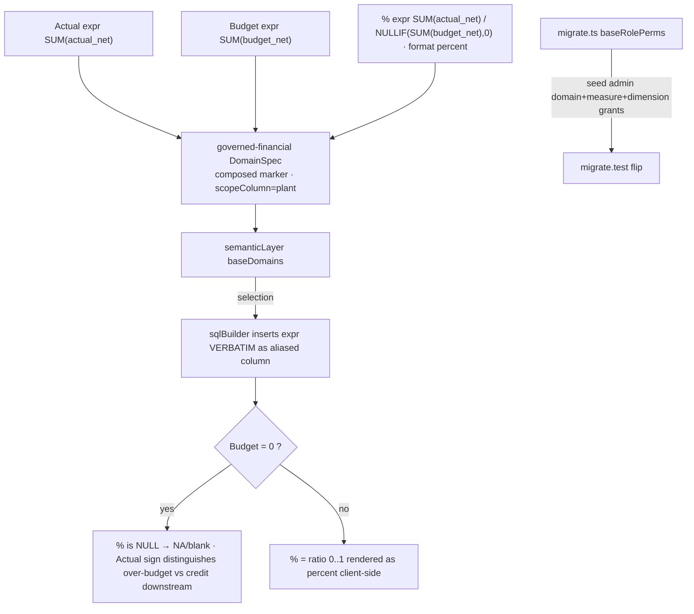

# Cold-read grill — gate: task — task plan governed-domain-measures

You did NOT write what follows. Read it cold, as an adversary trying to break the handover, never as its author defending it. You are READ-ONLY: return findings, change nothing.

## Interrogation technique

Run the interrogation this way. The harness contract above is the floor; this is the technique.

---
name: grilling
description: Grill the user relentlessly about a plan, decision, or idea. Use when the user wants to stress-test their thinking, or uses any 'grill' trigger phrases.
---

Interview the user relentlessly until you reach a shared understanding. Map this as a **design tree**: every decision branches into the decisions that hang off it.

Work the tree in **rounds**. The **frontier** is every decision whose prerequisites are already settled: the questions you can ask _now_ without guessing at answers you haven't heard yet. Ask the whole frontier in one round: number each question and give your recommended answer. Then wait for the user's answers before the next round.

Format a round like so:

```
❓ **Q1** - **<question title>**: <question body, might be multiple paragraphs, including multiple choices>

➡️ <your recommended answer>

---

❓ **Q2** - **<question title>**: <question body, might be multiple paragraphs, including multiple choices>

➡️ <your recommended answer>
```

Each round the user answers reshapes the tree: settled decisions push the frontier outward and unblock questions that depended on them. Recompute the frontier and ask the next round. A question whose answer depends on another question still open in this round belongs to a _later_ round, not this one.

Finding _facts_ is your job, never the user's. When a frontier question needs a fact from the environment (filesystem, tools, etc.), dispatch a sub-agent to find it; don't ask the user for anything you could look up yourself. Don't block on it: a running exploration is an unsettled prerequisite, so only the questions downstream of it wait for the sub-agent to report; ask the rest of the frontier now. The _decisions_ are the user's: put each to them and wait.

The session is done when the frontier is empty: every branch of the design tree visited, nothing left silently assumed. Do not act on it until the user confirms you have reached a shared understanding.


## Harness grill contract

# Griller Prompt — adversarial handover interrogation

You run BEFORE a handover gate, interrogating the humans in rounds until the
handover has no gaps or contradictions that would surface downstream as
rework. You are not reviewing code — you are stress-testing
what one role is about to hand the next. The gate scripts REFUSE without
your fresh, passing record.

**Independence is the whole point.** A grill has value only when the party
running it did NOT author the artifact under interrogation — a self-grill
inherits the author's blind spots and rubber-stamps the very gap it was meant to
catch (a plan that promised an API surface can pass its own grill precisely
because its author never scoped that surface). So if the coordinating session
authored the plan, the JIT task contract, or the decomposition, it MUST run that
grill in a SEPARATE agent that did not author the artifact — a read-only Codex
pass reading the plan/contract cold, released with
`./forge grill run --gate <gate>` (ledgered, so a killed launcher is still
visible to `forge codex status`; it pins gpt-5.6-terra @ xhigh from
harness.yaml) — rather than certify its own work inline. Codex on `gpt-5.6-terra` @ xhigh
is the required cold reader for planning grills: a fresh model context fully
independent of the authoring session, and because it is read-only it never
writes, so the write-lock that gates the write companion does not apply. Do NOT
use a Claude sub-agent for the grill, and never grill your own work inline.
Interrogate as an adversary trying to break the handover, never as its author
defending it.

RELEASE IT THROUGH THE HARNESS. `./forge grill run --gate <gate>` composes the cold-read brief (this contract plus the artifact) and releases Codex through the SAME ledgered launcher a delegation uses: the pid is recorded before the wait, so a grill whose launcher is killed still shows up in `forge codex status` instead of vanishing. It is read-only, so it takes no delegation lock and can never satisfy `stage done`. Recording the gate stays yours — the cold read only returns findings.

The technique is Matt Pocock's `grilling` skill — the design tree, the
frontier, numbered questions with recommended answers. `doctor --fix` installs
it into BOTH runtimes, and `./forge grill run` also inlines it into the brief,
so a reader reaches it whether or not its runtime resolves skills. This
contract is the harness-side floor; `grilling` is the technique.

`grill-me` is the HUMAN entry point — you type `/grill-me` and it redirects to
`grilling`. It carries `disable-model-invocation: true`, so no model invokes it
and none should be told to.

WHICH RUNTIME CAN RECORD WHICH GATE — get this wrong and you will chase a
refusal you cannot satisfy. ALL SIX gates match the AskUserQuestion ledger and
are therefore CLAUDE-ONLY, each with a floor of ONE logged round: `--gate spec`,
`--gate signoff`, `--gate epics`, `--gate requirements`, `--gate plan` and
`--gate task` — the floors live in `grill_gates.GATES`, one row per gate.
`signoff` and `epics` used to sit outside that check and so recorded with ZERO
rounds behind them; they now answer to it like every other gate.

ONE round is a FLOOR, never a target. Keep going until a round comes back clean
AND the next one stays clean — a single quiet round after a noisy one is a
coincidence, not convergence. The ledger files are written ONLY by `post_tool_use.py` on a
Claude Code AskUserQuestion event; `.codex/hooks.json` registers no PostToolUse
hook, so Codex cannot produce them and neither can a subagent. Delegating a
ledger-matched grill to Codex returns a well-formed payload that the recorder
then refuses, with nothing you can do to satisfy it — the payload was never the
problem, the runtime was.

For those four ledger-matched gates, independence is a COLD READ,
not necessarily a separate process. The recorder accepts ONLY rounds that match a
logged AskUserQuestion record (`record_grill_from_json.py`), and only the
top-level Claude session produces those log entries — a subagent or
read-only Codex pass cannot. So for those grills the top-level session drives
the rounds through AskUserQuestion itself — but because the coordinating session
authored the plan, the independent cold-read pass is MANDATORY, not optional: on
EVERY round release a fresh READ-ONLY Codex pass with
`./forge grill run --gate <gate> [--task <id>]` that reads the plan/contract
cold and returns findings — never a
Claude sub-agent, never grill your own work inline — then carry ALL of those
findings into your own AskUserQuestion rounds (the recorder rejects rounds not in
the ledger, so the top-level session must still ask). Read cold, as an adversary
who did not write it.

ONE COLD READ PER GATE — put every question to the human INSIDE it. The old
shape was Codex grill → your rounds → amend → Codex grill AGAIN, looping until
clean. That loop cannot converge: a fresh reader has no memory of what the last
one found, so it returns a DIFFERENT frontier rather than a shorter one, and the
artifact you amended to close round one becomes round two's input. Stories
reached eleven, twenty-six and forty rounds that way; the last cost six hours.
`forge grill run` now REFUSES a second unconstrained read on a gate that has
already been read since its last recorded pass.

So the WHOLE grill is:

1. `./forge grill run --gate <gate>` — one cold read. WATCH it.
2. Clean? Record the pass and approve. Nothing else happens.
3. Otherwise resolve every finding the REPOSITORY answers yourself — open the
   file and settle it. Take to the human only what the repository cannot
   answer: a decision nobody has made, a priority, a tradeoff between two
   workable shapes. Put those through AskUserQuestion with your recommended
   answer first, all of them, now. There is no later round to save the hard
   ones for, and a finding is not a menu.
4. Amend the artifact ONCE, to what they decided.
5. Record the pass against the AMENDED version, then approve exactly once.

The price is stated plainly, twice over: nothing independent re-reads the
amended version, and a gap this reader misses is not caught by a second reader
at this gate. Both surface at the next gate, or in review. That is the trade
for ending a loop that was costing whole days.

If the human's answers changed the artifact's SHAPE — a component dropped, a
different approach chosen — the amended artifact is not the one that was read
in any useful sense. Say so and read again: `./forge grill run --gate <gate>
--reread "<what changed shape>"`. It is a choice with a recorded reason, not a
way around the rule, and the five-read cap still backstops it. (EVERY gate is ledger-matched — signoff and epics no
longer excepted — so no gate can be recorded by a read-only Codex grill alone:
the top-level session asks the round and records it.)

FRESH CONTEXT, AND THE ANSWERS SO FAR. Every round is a NEW read-only Codex
session — that independence is the whole point. But a reader that knows nothing
of the earlier rounds does not re-find the same gaps, it finds DIFFERENT ones,
so the rounds never shrink and the grill has no natural end. `./forge grill run`
therefore carries every question already put to the human and the answer they
chose, read from the ledger the recorder validates against.

That gives the reader two obligations: do not re-raise settled questions, and
CHECK EACH ANSWER — that the artifact honours it, and that it contradicts no
other answer, accepted decision or constitution rule. An answer can be wrong, or
right and never applied; saying so is part of the read.

Do NOT tell the reader where to concentrate. A cold read is worth having because
it is unconstrained, and steering it toward the diff is how the thing nobody
looked at survives every round. More information, no direction.

END EVERY ROUND WITH AN EXPLICIT CONVERGENCE VERDICT, on its own line, so the
coordinator never has to guess whether to grill again or approve:

- `CONVERGED — no gaps, no contradictions, plan unchanged since the last round`
- `NOT CONVERGED — <the specific reason: open gaps, a contradiction, or the plan
  changed after the last clean round>`

`CONVERGED` on the cold read means there is nothing to amend: record and
approve. `NOT CONVERGED` does NOT mean read again — it means resolve what the
repository answers, put the rest to the human, amend once, and record the pass
against the amended version. Approval happens exactly once.

Five gates, five scopes:

- `--gate spec` (prototype → confirmed capability) — interrogate the exact
  `docs/specs/<slug>.md` file against BRIEF, architecture, decisions, and the
  prototype. Hunt: behavior the prototype proved but the spec omitted,
  implementation choices masquerading as requirements, vague acceptance
  language, and conflicts with active decisions.
- `--gate signoff` (client → PM, before `record_signoff.py`) — interrogate
  `docs/product/DISCOVERY.md`, `BRIEF.md`, confirmed specs, the spec-linked
  roadmap, `docs/decisions/`, and prototype notes. Hunt: unanswered
  stakeholder/constraint questions, scope
  the client saw vs. scope the BRIEF claims, decisions that contradict the
  BRIEF, acceptance criteria that are vibes instead of checks, non-functional
  requirements nobody asked about (auth, data retention, environments).
- `--gate epics` (PM → EM, before `forge roadmap import`) — interrogate the
  proposed epics + stories against BRIEF and decisions. Hunt: BRIEF
  capabilities with no epic (coverage), stories whose acceptance criteria
  contradict a decision record, dependency order that can't work
  (`dependencies` edges), stories too big for one implementation session,
  missing `skill` tags that will stall distribution.
- `--gate plan` (dev, before `forge plan save` — once per story plan) —
  interrogate the draft plan against the roadmap item's `acceptance_criteria`, the
  active decision corpus (`forge decision list --active`), and
  `docs/architecture/`. Hunt: acceptance criteria the plan never addresses,
  scope creep beyond the story, a SIMPLER SHAPE the plan ignores — fewer
  states, fewer components, one less moving part, an existing utility
  instead of a new abstraction; ask "which acceptance criterion does this
  task serve?" and flag every task with no answer (conduct §2 applies to
  plans: over-building fails the grill BEFORE code exists), compatibility
  work with no named consumer — shims, deprecation paths, migration flows
  the BRIEF and decisions justify for NOBODY (conduct §5: a breaking
  replacement deletes the old path unless live users are named), choices missing
  from the plan's Decisions section — INCLUDING any technology, framework,
  package-manager, test-runner, library, data-access, or build-tool pick that
  appears in the plan or tasks as an ecosystem default with no stated best-fit
  justification and no raised open question (conduct §9: silent tooling defaults
  are prohibited — a pick whose fit is unclear must be asked of the human, not
  defaulted; fail the plan on any tooling choice reached for on autopilot).
  Also flag a MISSING quality-gate baseline: any codebase the plan touches must
  wire a stack-APPROPRIATE static-analysis gate — a linter AND formatter, plus a
  type-checker where the language has one — into CI/verify, not merely a test
  runner. Name the CAPABILITY, never a fixed tool: ESLint/Biome for JS-TS,
  Ruff/flake8 for Python, golangci-lint for Go, Clippy for Rust, Checkstyle/
  Spotbugs for Java, and so on — the requirement is generic to every backend, not
  one ecosystem's tool. Fail the plan when code ships with no configured lint/
  format/static-analysis gate that an automated check enforces on every push; an
  absent linter is a silent quality default exactly like an unjustified tool pick.
  Also hold the plan against the CONSTITUTION's coding standards
  (`constitution/README.md` index — read the references it maps to the plan's
  surfaces). The constitution is law, so a plan whose SHAPE omits or contradicts a
  mandated standard is a GAP, not a style preference: HTTP surfaces with no typed
  request AND response DTOs (`pnp-api-standards`, `pnp-swagger-api-documentation-
  standards`), a module ignoring the modular-monolith layout or file-suffix
  standards (`pnp-coding-standards-modular-monolith`, `03`), missing structured
  logging (`05`/`06`) or domain exception handling (`07`), an external integration
  that skips the provider/port pattern (`08`, `pnp-provider-pattern-for-
  integration`), or database work ignoring `pnp-database-standards`. Flag each and
  require the plan to conform or record a deliberate, written deviation — never
  wave it through as "the implementer will follow standards later"; a plan must not
  design AGAINST the law. (`constitution/` is on disk in every environment, so the
  read-only Codex cold-read has the law available — hold the plan to it.)
  Reconcile the plan explicitly against
  EVERY ID from `forge decision list --active`; a conflict becomes a
  contradiction signal or a superseding decision, never a silent exception.
  Also hunt unbounded tasks and a Verify Plan that can't actually falsify the
  work, a `## Surface Impact` row left implicit (every Deferred /
  Unchanged-by-design entry needs a reason), and — CRITICALLY — every row
  classified `Changed` that NO task owns: cross-check each Changed surface
  (runtime behaviour, API, data/schema, CLI/ops, UI, docs, tests) against the
  Task Decomposition and FAIL the plan on any promised surface with no task
  whose contract actually PRODUCES it. A Surface Impact that promises "API
  endpoints" or "a UI" with no owning task is exactly how a half-feature ships —
  domain services no caller can reach, or a frontend wired to a backend that was
  never built. Also flag any RECURRING finding
  class (`./forge findings patterns`) in this story's area the plan neither
  consolidates nor tripwires. In Claude Code the
  `/grill-me` skill run against the plan satisfies this contract. The payload
  carries `"issue"`; the recorder stamps it against the active task.
- `--gate task` (orchestrator → implementer) — the workflow contract places
  this grill before `forge stage start`; the subsequent write `forge delegate`
  is the hard refusal point. Interrogate the next leaf task's just-authored
  contract in the re-recorded decomposition against the approved story plan,
  active decisions, and the actual repository state left by completed prior
  stages. Hunt: assumed files or APIs that prior work did not produce, a
  `write_scope` whose AREAS miss where the work must land or reach into areas
  the task has no business in (scope is directory prefixes plus named new
  files — a missing existing file under a declared prefix, a drifted line
  number or a renamed module is a NON-BLOCKING note, never a blocking finding;
  `stage done` measures the exact paths), acceptance criteria not served by the proposed
  work, a task that OWNS a plan `## Surface Impact` surface but whose
  `write_scope`/`required_tests` do not actually PRODUCE it (owns the API row but
  builds only domain services with no HTTP controllers/DTOs/routes; owns the UI
  row but ships no components) — reachability is part of "done", not a later
  task's problem, required tests that do not prove those criteria, verify commands that
  cannot falsify the change, reviewer focus that misses the risky seam OR that
  re-states shape rules the constitution already sets instead of CITING the
  load-bearing `constitution/` references for the task (the contract points at the
  law, never re-derives or contradicts it), and a
  `user_facing` flag that misclassifies the task — a UI task left `false` (its
  mandatory design skills and design review would be skipped) or a backend task
  marked `true` (forced to attest UI design skills it has no use for).
  This is the JIT task-planning gate from decision 0032, not a repeat of the
  story-level plan grill. Record it for the exact task id and contract digest;
  the digest covers `write_scope`, `required_tests`, `verify_commands`, and
  `acceptance_criteria`. A changed field makes the old task grill stale, and a
  write delegation refuses it; read-only delegation is unaffected.

Method:

1. Read the artifacts in scope FIRST; derive your question list from actual
   text, citing it (`BRIEF.md says X; decision 0003 says Y — which wins?`).
2. Interrogate in ROUNDS until the frontier is empty — not one pass. Each
   round, put the questions whose prerequisites are already settled to the
   human (PM or EM) with your recommended answer; their answers reshape the
   tree and unblock the next round's questions. Stop a single question when it
   would only confirm what a document already states; stop the grill only when
   no gap or contradiction remains unasked. In Claude Code, deliver each
   round's frontier through the AskUserQuestion tool (recommended answer
   first), not prose. For every ledger-matched gate (`spec`, `requirements`,
   `plan`, `task`) the recorder requires
   the FINAL round in the payload to carry `"frontier_empty": true` — that flag
   is how it confirms you stopped because the frontier closed, not because you
   ran out of patience; it is set by hand on the last `rounds` entry, never by
   the ledger. A zero-gap contract still needs at least one such round (every
   gate's floor is 1, and a floor is not a target), so ask a genuine closing
   question
   (e.g. "any remaining gap before we hand off?") and mark it `frontier_empty`.
3. Every finding lands somewhere real before the verdict: a doc edit, a
   `./forge decision new <slug>` record, or an explicit non-blocking entry
   in `open_items`. An `open_items` entry that PARKS scope also gets a
   deferral row with a revisit trigger (`./forge defer add`) — parked scope
   without a trigger is scope silently dropped. Unresolved blocking
   findings ⇒ verdict `blocked`.
4. Record the outcome (schema: `factory/schemas/grill.json`,
   `"generated_by": "griller"`):

   A task-grill input uses this recorded shape (the recorder adds its own
   task id, digests, commit, and timestamps):

```json
{
  "generated_by": "griller",
  "verdict": "pass",
  "gaps": [],
  "contradictions": [],
  "resolutions": ["What was sanctioned"],
  "inspected_refs": ["path/or/path:symbol"],
  "current_flow": "What the repository does now",
  "criteria_map": {"criterion": "proof"},
  "decision": "keep",
  "new_abstractions": ["None"],
  "rounds": [{"question": "Finding or choice", "options": ["Recommended", "Alternative"], "chosen": "Recommended", "frontier_empty": true}],
  "citations": [{"finding": "Repo-answerable finding", "source": "path:symbol"}],
  "open_items": []
}
```

   Each `rounds` entry has a non-empty `question`, two to four non-empty
   string `options`, and a `chosen` value equal to one option. Each citation
   is `{finding, source}`. Every string in `gaps` must be covered by an equal
   `rounds[].question` or `citations[].finding`.

   For every gate — all six are ledger-matched — extra recorder rules bind
   (this is what makes an otherwise well-formed payload fail):
   - Rounds must match the AskUserQuestion ledger and meet the gate floor
     (1 for every gate, and a floor is not a target); the final round carries
     `"frontier_empty": true`. A
     zero-gap grill still records its floor of real rounds — never zero.
   - `--gate task` only: `criteria_map` is a THREE-WAY equality — its KEYS must
     equal the frontier task's `acceptance_criteria` set AND the set of its
     `plan_contracts[].statement` values, exactly (no extra key, none missing);
     each value is the non-empty proof for that criterion. Author the task's
     `acceptance_criteria` and its `plan_contracts` statements as the SAME
     strings so there is one coherent key set to satisfy.

```bash
python3 factory/scripts/record_grill_from_json.py --gate <spec|signoff|epics|requirements|plan|task> --input <json> [--input-digest <artifact>] [--task <id>]
```

5. For every gate except task, commit the resolution edits
   BEFORE recording the grill — those gates check freshness against BOTH
   committed history and the working tree: any guarded doc changing after the
   grill (even uncommitted) stales it. (The sign-off / epics-approved decision
   records themselves are expected afterwards and don't stale it.) The task
   gate instead binds directly to the re-recorded task contract digest; the JIT
   sequence does not require a commit between re-recording and grilling. But that
   digest still folds in the product tree, so record the task grill LAST — after
   any docs/ or factory/scripts commits: a tracked change outside .factory/ and
   plans/ that lands between grilling and `task approve`/`stage start` re-stales
   it and forces a re-grill.
6. `--input-digest` is REQUIRED for the spec, epics, and plan gates: pass the
   exact spec / roadmap input / plan draft you interrogated. The gate verifies the
   digest — grilling version A never approves an edited version B; if the
   artifact changes, re-grill it. For `--gate task`, pass `--task <id>` and NO
   `--task-digest` — that flag was removed and the recorder rejects it; the
   recorder derives the grounding digest itself from the protected contract,
   approved plan, and product tree, and stores the result at
   `.factory/grills/tasks/<id>.json`.

A `pass` with unresolved findings is refused by the recorder. Grill hard;
downstream implementation inherits whatever you let through.


## Lessons already in force for these paths

The plan must design AROUND these. A plan that ignores one is not merely unlucky later — it is wrong now, and saying so is part of this read.

- A required_tests entry must name a REAL leaf test (id = the string in test("...")), not the file path, and must pin TS_NODE_PROJECT=backend/tsconfig.json because forge runs it from repo root; otherwise junit-run's --test-name-pattern matches nothing and ts-node skips the workspace tsconfig, so the gate reports pass without running assertions. Always verify with a negative control (a required test whose negative control cannot fail is not proof).
- Put the DB-backed warehouse proof in its OWN file backend/src/warehouse/warehouse-proof.db.test.ts registered ONLY in test:db (and the db list of tools/quality-gate.test.mjs); keep warehouse-schema.test.ts hermetic-only. NEVER register one test file in both test:hermetic and test:db — tools/quality-gate.test.mjs asserts exactly one suite per file and fails the whole verify if a file appears twice.
- SUPERSEDES the separate-file guidance for warehouse-schema: its write_scope does NOT include warehouse-proof.db.test.ts, so do NOT create that file. Keep the DB proof test INSIDE backend/src/warehouse/warehouse-schema.test.ts gated by WAREHOUSE_DB_TEST=1 (skips under plain test:hermetic, runs the migrate + IngestionRepository proof when the env + WAREHOUSE_PG_* are set), registered ONLY in test:hermetic. REMOVE warehouse-schema.test.ts from the test:db script and the db-list in tools/quality-gate.test.mjs, and drop the WAREHOUSE_DB_TEST env added to test:db — quality-gate requires each test file in exactly ONE suite and fails verify otherwise. This is the ONLY remaining fix.
- Per decision/deferral D-0006 (plans/deferrals.md), before a task edits any .prettierignore-listed vendored file (e.g. backend/src/db/migrate.ts) it MUST, in the SAME change, run prettier on that file AND remove its line from .prettierignore. This is an authorized, decision-mandated edit - .prettierignore is a mechanically-required in-scope file for such an edit, NOT a scope violation; do not raise a scope signal for it (stage-done amend-scope records it).
- tools/quality-gate.test.mjs validateIgnoredBaseline asserts .prettierignore's non-comment lines deep-equal the keys of its ignoredBaselineHashes map. So when D-0006 requires removing a file (e.g. backend/src/db/migrate.ts) from .prettierignore, you MUST also remove that path's entry from the ignoredBaselineHashes map in tools/quality-gate.test.mjs (both in write_scope) in the SAME change, and ensure the now-unignored file is prettier-formatted so format:check passes. Keep .prettierignore and ignoredBaselineHashes in sync.
- The reconciliation D-0008 gated leaf TRUNCATEs ingest_batch + sap_transaction CASCADE on whatever DB WAREHOUSE_PG_* points at. Guard it: BEFORE truncating, assert the warehouse host (WAREHOUSE_PG_HOST) is loopback/local (127.0.0.1, ::1, or localhost) and THROW a clear error refusing to run against a non-local warehouse — so a misconfigured WAREHOUSE_PG_* can never wipe a shared/production warehouse. Also fix the P2: tools/quality-gate.test.mjs wrapping the declared test lists in new Set removes the gate's exactly-one-suite detection (a file registered in two suites is silently deduped) — compare with duplicate detection preserved (e.g. detect duplicates before dedup, or assert no file appears in more than one suite) instead of Set-then-compare.
- Not a defect (Decisions): Factually incorrect and contradicts the settled D-0008 model. (1) tests.json IS committed at f9c6b1d with the full host-execution record: 'npm --prefix backend run test:warehouse-proof -> tests 7 / pass 7 / fail 0 / skipped 0' plus a dead-port negative control (fail 2, ECONNREFUSED). The reviewer cannot see it only because the review bundle deliberately excludes .factory bookkeeping ('review tip excludes 9 harness bookkeeping paths; the bundle is the product delta only') - not because it is absent. (2) The runnable command that executes the proof (test:warehouse-proof, serialized) IS in the product delta at backend/package.json, and the gated test is committed and reviewer-visible. (3) The security lens accepted this identical evidence and approved. (4) The story plan Decisions section settles that the DB-backed warehouse proof is DEMONSTRATED HOST EVIDENCE (D-0008), not CI-enforced execution. — raised as "[P1] Commit the required host-execution evidence for the new proof (backend/package.json:19): The new `test:warehouse-proof` command is registered, but the chan"

## Already answered on this story — verify, do not re-ask

These questions were put to the human and answered. Two obligations:

1. Do NOT raise them again as open questions. They are settled.
2. DO check each answer still holds — that the artifact actually honours it, and that it does not contradict another answer, an accepted decision, or the constitution. An answer can be wrong, or right and never applied. Saying so is part of this read.

- Q: Where should the 3F app be built, given we're adapting Pulse?
  A: Build in this 3oilpalm repo
- Q: Financial MIS statement — period columns for the PoC?
  A: July + FY 26-27 YTD
- Q: Financial MIS statement — Excel export fidelity?
  A: Clean structured export
- Q: Financial MIS statement — reconciliation / demo-ready bar?
  A: SAP totals = demo-ready; filled month = validated
- Q: SAP ingestion — how does data get in for the PoC?
  A: Excel upload now (SAP export/API later)
- Q: SAP ingestion — how are budgets brought in?
  A: Ingest budgets from the MIS format, as a separate object
- Q: SAP ingestion — grain & raw retention?
  A: Monthly gold + retain raw transaction lines
- Q: SAP ingestion — re-loading a period?
  A: Idempotent replace per period
- Q: Governed joins — how to handle rows in one object but not the other (Budget with no Actual, or Actual with no Budget)?
  A: Full-outer, zero-fill the missing side
- Q: Governed joins — where are 3F financial measures authored?
  A: In code (repo domain files)
- Q: Governed joins — RBAC on a joined query?
  A: Inject scope on both objects
- Q: Governed joins — correctness gate?
  A: Golden-answer fixtures required
- Q: Mapping master — Srihari's Master Table definition is still outstanding. How do we proceed?
  A: Build a provisional master now, reconcile later
- Q: Mapping master — how is it edited in the PoC?
  A: Seed / config file for the PoC (admin UI later)
- Q: Mapping master — selection with no mapping entries?
  A: Empty statement (zeros) + 'no mapping configured' notice
- Q: Drill-down — levels for the PoC?
  A: 2-level now (group → sub-lines → transactions), confirm with Srihari
- Q: Drill-down — showing individual transactions vs Pulse's aggregate suppression?
  A: Show individual lines within the user's RBAC scope, audited
- Q: Drill-down — line-item columns?
  A: Month, Debit, Credit, Value + reference, memo, posting date
- Q: Assistant/exploration — in the first PoC release, or a fast-follow?
  A: Include in the first PoC release
- Q: Assistant — LLM & data residency?
  A: Decide later
- Q: Platform base — how do we bring Pulse's code in?
  A: Snapshot-copy into the repo (own it)
- Q: Platform base — warehouse engine for the PoC?
  A: Postgres for the PoC
- Q: Platform base — auth for the PoC?
  A: Keep Pulse's email+OTP passwordless auth
- Q: Sign-off gate — how do we unlock the build?
  A: Record an internal go-ahead now
- Q: governed-joins requirements grill (Finding 1 — the foundational one): mis_budget has NO plant and its cost_center is the MIS 'Budget Components' label, not a SAP cost center, so it can't join Actuals on Plant+CostCenter+GL+month. Decision 0014 deferred the Budget-label→cost-center mapping master to THIS story. How should the Budget⋈Actual join key be defined for the PoC?
  A: PoC-join on GL + month, single plant DUB (Rec.)
- Q: governed-joins RBAC (Finding 4): the spec says inject the row-scope predicate on BOTH objects for the full-outer join. For this PoC, what is the read-side RBAC model — which determines whether asymmetric one-sided visibility (user can see Actual but not Budget for a key) can even occur and needs a concrete zero-fill-vs-conceal policy + denial fixtures?
  A: Role-based all-or-nothing (Rec.)
- Q: governed-joins plan grill (Q4): the settled %-nil rule covers 0/0 (NA/blank) and Actual>0,Budget=0 (over-budget). But Actual = Debit − Credit can be NEGATIVE (a net credit), and the spec defines no behavior for Actual<0 with Budget=0. What should the governed layer show for a NEGATIVE actual against zero budget?
  A: No %, label 'credit / negative actual' (Rec.)
- Q: governed-joins task-1 grill (Finding 6 — RBAC seam between task 1 and task 2): the actual_by_gl_month rollup reduces over the single DUB plant, so it drops the plant column. But task 2's contract requires injecting an Actual-side plant scope predicate INSIDE its source CTE. How should the DUB plant scope cross the task-1→task-2 seam?
  A: Expose constant plant='DUB' column in the rollup (Rec.)
- Q: composed-relation grill (findings 2 & 6): the criterion promises the composed relation provides 'relation semantics to freshness, dimension enumeration, RBAC scope-validation, and reconciliation.' Those Pulse consumers each read one physical goldObject and issue 'FROM <goldObject>'. Making ALL of them genuinely composed-aware (querying the joined relation) is a materially larger task. For this PoC (single plant DUB; goal = % = Actual÷Budget), how should the composed relation's NON-query surfaces be scoped?
  A: Narrow: composed JOIN for queries; defer the rest (Rec.)

## The artifact under interrogation (task plan governed-domain-measures)

# Task plan — governed-domain-measures: code-authored Actual / Budget / % over the composed relation

Story: governed-joins · Task 3 of 4 · user_facing: false

## Objective
Author ONE code-authored governed-financial `DomainSpec` with **Actual**, **Budget**
and **%** `MeasureSpec`s in `semanticLayer.ts` `baseDomains` (today `[]`), reading the
code-composed `financial_relation` that task 2 built, so report / drill-down /
assistant share one definition and the LLM only *selects* measures (never authors
SQL). Seed the governed-financial domain/measure/dimension **grants** task 2's grill
deferred here. No new endpoint, warehouse object, or builder/validator/executor edit.

## Acceptance criteria (plan_contracts)
- **t-dm-c1** — a code-authored financial `DomainSpec` and Actual (`SUM(actual_net)`),
  Budget (`SUM(budget_net)`) and % MeasureSpecs are registered in `baseDomains` over
  the composed relation; the two-column/ratio expressions are **code-authored** (the
  runtime builder inserts `expr` verbatim), and the LLM/runtime never authors the SQL.
- **t-dm-c2** — % follows the full nil rule: `0/0 → NA/blank`; `Actual>0, Budget=0 →
  over-budget (no %)`; `Actual<0, Budget=0 → credit / negative actual (no %)`; i.e. no
  percentage for any non-zero Actual against zero Budget, with the positive/negative
  labels distinguished. **(Narrowed by the grill round below — see Design.)**

## What already exists (grounding, file:line)
- `sqlBuilder.ts:38-41` — `selectCols` inserts each measure **verbatim**:
  `${m.expr} AS ${m.id.split(".").pop()}` (alias = the id's last dot-segment); dims →
  `GROUP BY d.column` (`:83`). So a `NULLIF`/division lives **inside `expr`**.
- `sqlBuilder.ts:96-141` — the composed path: `FROM financial_relation`, exposing
  exactly `gl_code, month, actual_net, budget_net, rollover_net,
  budget_component_labels` (`:131-136`), zero-filled `::numeric(18,2)`. Measure exprs
  reference **these** columns.
- `contract/src/measure.ts:6-41` `MeasureSpec` (`expr`, `allowedDimensions`,
  `format?:"percent"` — a **display hint only**: `selectionExecutor.ts:120-139`
  attaches it to the column; the server never numerically formats, the client renders
  the `0..1` ratio as a %). `DomainSpec` (`:51-71`): `composed?` marker,
  `scopeColumn` (**required** by `composedCtes`, `sqlBuilder.ts:121`), `routingHints`.
- `semanticLayer.ts:11` `baseDomains: DomainSpec[] = []`; `all()`/`domain()`/
  `allowedFor()` register + filter (`:15-33`).
- `migrate.ts` `baseRolePerms` seeds e.g. `{role:"admin",grantType:"action",
  grantId:"report"}` (task 2). `migrate.test.ts:33` currently asserts baseRolePerms
  has **no** domain/measure/dimension grants — task 3 flips it.
- `docs/specs/financial-mis-statement.md:40-42` (nil & format) + `:48` (“% guards
  divide-by-zero per the nil rules”); decision 0016 Q4 (negative-actual = *credit*).

## Design
### The three measures (expr is inserted verbatim)
- **Actual** — `expr: "SUM(actual_net)"`, `format` number, `goldObject:
  "actual_by_gl_month"`.
- **Budget** — `expr: "SUM(budget_net)"`, number, `goldObject: "budget_by_gl_month"`.
- **%** — `expr: "SUM(actual_net) / NULLIF(SUM(budget_net), 0)"`, `format: "percent"`.
  `NULLIF` makes the ratio **NULL for every zero-budget key** — covering both
  `0/0 → NA/blank` and “no % for any non-zero Actual against zero Budget”. The client
  renders NULL as blank/NA.

### The %-nil label distinction (grill round — HUMAN-decided)
There is **no server-side row/label layer** anywhere in the repo: `selectionExecutor`
returns `raw.rows` verbatim, no cell rewrite; `chat.service.ts` only picks a chart. So
the *text* labels “over-budget” / “credit / negative actual” have **no code home** in
this task. Encoding them as a text `CASE` inside the `%` `expr` would make that column
mixed numeric/text and break `format:"percent"` / `numeric` / totals. The narrowed
C2: the `%` measure returns a **numeric ratio-or-NULL** (the nil rule, provable
hermetically), and the **positive/negative distinction is carried by the row's Actual
sign** (`actual_net` is present in every row) — the *text* label is rendered later in
the **reporting / mis-statement epic** where the statement is actually drawn. This
task does not add a label layer.

### Governed-financial domain
`{ name, label, goldObject:"actual_by_gl_month", composed:{ sources:
["actual_by_gl_month","budget_by_gl_month"], joinKeys:["gl_code","month"] },
scopeColumn:"plant", routingHints:[…], measures:[Actual,Budget,%],
dimensions:[{id:"gl_code",…},{id:"month",…}] }`. The `composed` marker + `name` are
what fire task 2's `executeResolved` governed-read enforcement and the composed
builder path.

### Grants (task-2-deferred)
Seed to role `admin` in `migrate.ts` `baseRolePerms` (mirror the `report` action seed,
`onConflictDoNothing`): the governed-financial **domain** grant, a **measure** grant
per measure id, and a **dimension** grant per dimension id. Flip `migrate.test.ts:33`
to assert these now exist for admin (keep the `save`/`pin`/`report` action asserts).
`migrate.test.ts` is `test:db` (app-Postgres, **D-0008-deferred** — the 42 app-DB
tests are not CI-enforced and not host-run per task); its assertion flip is a
`baseRolePerms` **constant** change verified by type-check/build via `verify` +
review, exactly as task 2's `report`-action `migrate.test` change was handled. No
per-task app-DB host run; task 4 owns the end-to-end golden D-0008 proof.

## Workflow


## Manual Verification
1. `npm run test:hermetic` — the governed-financial domain + 3 measures register
   (exact exprs incl. the `NULLIF` ratio, `%`-format, `allowedDimensions` gl_code +
   month); building a selection emits the `%` division expr **verbatim** as its
   aliased column; against a fake warehouse a matched key returns the ratio while a
   **zero-budget key returns NULL %** for **both** a positive and a negative actual.
2. `npm run typecheck && npm run build:backend` — the seeded domain/measure/dimension
   grants + the flipped `migrate.test.ts:33` assertion type-check (app-DB execution is
   D-0008-deferred, as for task 2).
3. `npm run verify` — build/lint/format/hermetic all green.

## Decisions attested
0004 (governed joins: one code-composed governed definition; LLM selects, never
authors SQL), 0016 (gl_code+month within DUB; % = Actual÷Budget; negative-actual =
credit), 0009 (required_tests real leaves + TS_NODE_PROJECT), 0015. The over-budget/
credit **text** label rendering is deferred to the reporting epic (no server label
layer exists); task 4 owns golden fixtures + provenance + the end-to-end D-0008 proof.

## Surface impact
- Backend: `semanticLayer.ts` (register the domain + measures + dims),
  `migrate.ts` (grant seeds), `migrate.test.ts` (assertion flip).
- Tests: `semanticLayer.financial.test.ts` (NEW, hermetic) + `quality-gate.test.mjs`
  (register the new hermetic test in exactly one suite).
- No endpoint, warehouse object, contract change, or builder/validator/executor edit.

## Out of scope
Golden fixtures + provenance + the end-to-end golden D-0008 proof (task 4); the
over-budget/credit **text** label renderer (reporting epic); Roll-over measure
(deferred); any per-plant scoping beyond DUB; the measure-authoring UI.

## Task Decomposition
This is task 3 of the governed-joins story's 4-task decomposition (recorded in
`.factory/stories/governed-joins/decomposition.json`): (1) gl-month-rollups [done,
#20], (2) composed-relation [done, #21], (3) **governed-domain-measures** [this
task], (4) golden-provenance. This task is a single bounded unit — the code-authored
governed-financial domain + its Actual/Budget/% measures + the deferred grant seeds —
and is not further subdivided; its two acceptance criteria (t-dm-c1 registration,
t-dm-c2 the %-nil rule) are proven hermetically in `test:hermetic`.


## What to return

Findings only: contradictions, gaps, unstated assumptions, and anything a reader would have to guess. Say what would break and why. Do not record a gate — the coordinating session records it.

The round count below is a FLOOR, not a target. Keep grilling until a round comes back clean AND stays clean on the next one — hitting the floor is not the same as passing.
