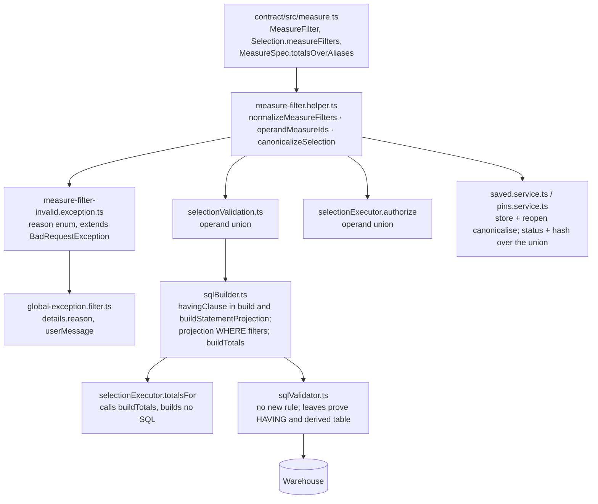

# Cold-read grill — gate: task — task plan measure-filter-foundation

You did NOT write what follows. Read it cold, as an adversary trying to break the handover, never as its author defending it. You are READ-ONLY: return findings, change nothing.

## Interrogation technique

Run the interrogation this way. The harness contract above is the floor; this is the technique.

---
name: grilling
description: Grill the user relentlessly about a plan, decision, or idea. Use when the user wants to stress-test their thinking, or uses any 'grill' trigger phrases.
---

Interview the user relentlessly until you reach a shared understanding. Map this as a **design tree**: every decision branches into the decisions that hang off it.

Work the tree in **rounds**. The **frontier** is every decision whose prerequisites are already settled: the questions you can ask _now_ without guessing at answers you haven't heard yet. Ask the whole frontier in one round: number each question and give your recommended answer. Then wait for the user's answers before the next round.

Format a round like so:

```
❓ **Q1** - **<question title>**: <question body, might be multiple paragraphs, including multiple choices>

➡️ <your recommended answer>

---

❓ **Q2** - **<question title>**: <question body, might be multiple paragraphs, including multiple choices>

➡️ <your recommended answer>
```

Each round the user answers reshapes the tree: settled decisions push the frontier outward and unblock questions that depended on them. Recompute the frontier and ask the next round. A question whose answer depends on another question still open in this round belongs to a _later_ round, not this one.

Finding _facts_ is your job, never the user's. When a frontier question needs a fact from the environment (filesystem, tools, etc.), dispatch a sub-agent to find it; don't ask the user for anything you could look up yourself. Don't block on it: a running exploration is an unsettled prerequisite, so only the questions downstream of it wait for the sub-agent to report; ask the rest of the frontier now. The _decisions_ are the user's: put each to them and wait.

The session is done when the frontier is empty: every branch of the design tree visited, nothing left silently assumed. Do not act on it until the user confirms you have reached a shared understanding.


## Harness grill contract

# Griller Prompt — adversarial handover interrogation

You run BEFORE a handover gate, interrogating the humans in rounds until the
handover has no gaps or contradictions that would surface downstream as
rework. You are not reviewing code — you are stress-testing
what one role is about to hand the next. The gate scripts REFUSE without
your fresh, passing record.

**Independence is the whole point.** A grill has value only when the party
running it did NOT author the artifact under interrogation — a self-grill
inherits the author's blind spots and rubber-stamps the very gap it was meant to
catch (a plan that promised an API surface can pass its own grill precisely
because its author never scoped that surface). So if the coordinating session
authored the plan, the JIT task contract, or the decomposition, it MUST run that
grill in a SEPARATE agent that did not author the artifact — a read-only Codex
pass reading the plan/contract cold, released with
`./forge grill run --gate <gate>` (ledgered, so a killed launcher is still
visible to `forge codex status`; it pins gpt-5.6-terra @ xhigh from
harness.yaml) — rather than certify its own work inline. Codex on `gpt-5.6-terra` @ xhigh
is the required cold reader for planning grills: a fresh model context fully
independent of the authoring session, and because it is read-only it never
writes, so the write-lock that gates the write companion does not apply. Do NOT
use a Claude sub-agent for the grill, and never grill your own work inline.
Interrogate as an adversary trying to break the handover, never as its author
defending it.

RELEASE IT THROUGH THE HARNESS. `./forge grill run --gate <gate>` composes the cold-read brief (this contract plus the artifact) and releases Codex through the SAME ledgered launcher a delegation uses: the pid is recorded before the wait, so a grill whose launcher is killed still shows up in `forge codex status` instead of vanishing. It is read-only, so it takes no delegation lock and can never satisfy `stage done`. Recording the gate stays yours — the cold read only returns findings.

The technique is Matt Pocock's `grilling` skill — the design tree, the
frontier, numbered questions with recommended answers. `doctor --fix` installs
it into BOTH runtimes, and `./forge grill run` also inlines it into the brief,
so a reader reaches it whether or not its runtime resolves skills. This
contract is the harness-side floor; `grilling` is the technique.

`grill-me` is the HUMAN entry point — you type `/grill-me` and it redirects to
`grilling`. It carries `disable-model-invocation: true`, so no model invokes it
and none should be told to.

WHICH RUNTIME CAN RECORD WHICH GATE — get this wrong and you will chase a
refusal you cannot satisfy. ALL SIX gates match the AskUserQuestion ledger and
are therefore CLAUDE-ONLY, each with a floor of ONE logged round: `--gate spec`,
`--gate signoff`, `--gate epics`, `--gate requirements`, `--gate plan` and
`--gate task` — the floors live in `grill_gates.GATES`, one row per gate.
`signoff` and `epics` used to sit outside that check and so recorded with ZERO
rounds behind them; they now answer to it like every other gate.

ONE round is a FLOOR, never a target. Keep going until a round comes back clean
AND the next one stays clean — a single quiet round after a noisy one is a
coincidence, not convergence. The ledger files are written ONLY by `post_tool_use.py` on a
Claude Code AskUserQuestion event; `.codex/hooks.json` registers no PostToolUse
hook, so Codex cannot produce them and neither can a subagent. Delegating a
ledger-matched grill to Codex returns a well-formed payload that the recorder
then refuses, with nothing you can do to satisfy it — the payload was never the
problem, the runtime was.

For those four ledger-matched gates, independence is a COLD READ,
not necessarily a separate process. The recorder accepts ONLY rounds that match a
logged AskUserQuestion record (`record_grill_from_json.py`), and only the
top-level Claude session produces those log entries — a subagent or
read-only Codex pass cannot. So for those grills the top-level session drives
the rounds through AskUserQuestion itself — but because the coordinating session
authored the plan, the independent cold-read pass is MANDATORY, not optional: on
EVERY round release a fresh READ-ONLY Codex pass with
`./forge grill run --gate <gate> [--task <id>]` that reads the plan/contract
cold and returns findings — never a
Claude sub-agent, never grill your own work inline — then carry ALL of those
findings into your own AskUserQuestion rounds (the recorder rejects rounds not in
the ledger, so the top-level session must still ask). Read cold, as an adversary
who did not write it.

ONE COLD READ PER GATE — put every question to the human INSIDE it. The old
shape was Codex grill → your rounds → amend → Codex grill AGAIN, looping until
clean. That loop cannot converge: a fresh reader has no memory of what the last
one found, so it returns a DIFFERENT frontier rather than a shorter one, and the
artifact you amended to close round one becomes round two's input. Stories
reached eleven, twenty-six and forty rounds that way; the last cost six hours.
`forge grill run` now REFUSES a second unconstrained read on a gate that has
already been read since its last recorded pass.

So the WHOLE grill is:

1. `./forge grill run --gate <gate>` — one cold read. WATCH it.
2. Clean? Record the pass and approve. Nothing else happens.
3. Otherwise resolve every finding the REPOSITORY answers yourself — open the
   file and settle it. Take to the human only what the repository cannot
   answer: a decision nobody has made, a priority, a tradeoff between two
   workable shapes. Put those through AskUserQuestion with your recommended
   answer first, all of them, now. There is no later round to save the hard
   ones for, and a finding is not a menu.
4. Amend the artifact ONCE, to what they decided.
5. Record the pass against the AMENDED version, then approve exactly once.

The price is stated plainly, twice over: nothing independent re-reads the
amended version, and a gap this reader misses is not caught by a second reader
at this gate. Both surface at the next gate, or in review. That is the trade
for ending a loop that was costing whole days.

If the human's answers changed the artifact's SHAPE — a component dropped, a
different approach chosen — the amended artifact is not the one that was read
in any useful sense. Say so and read again: `./forge grill run --gate <gate>
--reread "<what changed shape>"`. It is a choice with a recorded reason, not a
way around the rule, and the five-read cap still backstops it. (EVERY gate is ledger-matched — signoff and epics no
longer excepted — so no gate can be recorded by a read-only Codex grill alone:
the top-level session asks the round and records it.)

FRESH CONTEXT, AND THE ANSWERS SO FAR. Every round is a NEW read-only Codex
session — that independence is the whole point. But a reader that knows nothing
of the earlier rounds does not re-find the same gaps, it finds DIFFERENT ones,
so the rounds never shrink and the grill has no natural end. `./forge grill run`
therefore carries every question already put to the human and the answer they
chose, read from the ledger the recorder validates against.

That gives the reader two obligations: do not re-raise settled questions, and
CHECK EACH ANSWER — that the artifact honours it, and that it contradicts no
other answer, accepted decision or constitution rule. An answer can be wrong, or
right and never applied; saying so is part of the read.

Do NOT tell the reader where to concentrate. A cold read is worth having because
it is unconstrained, and steering it toward the diff is how the thing nobody
looked at survives every round. More information, no direction.

END EVERY ROUND WITH AN EXPLICIT CONVERGENCE VERDICT, on its own line, so the
coordinator never has to guess whether to grill again or approve:

- `CONVERGED — no gaps, no contradictions, plan unchanged since the last round`
- `NOT CONVERGED — <the specific reason: open gaps, a contradiction, or the plan
  changed after the last clean round>`

`CONVERGED` on the cold read means there is nothing to amend: record and
approve. `NOT CONVERGED` does NOT mean read again — it means resolve what the
repository answers, put the rest to the human, amend once, and record the pass
against the amended version. Approval happens exactly once.

Five gates, five scopes:

- `--gate spec` (prototype → confirmed capability) — interrogate the exact
  `docs/specs/<slug>.md` file against BRIEF, architecture, decisions, and the
  prototype. Hunt: behavior the prototype proved but the spec omitted,
  implementation choices masquerading as requirements, vague acceptance
  language, and conflicts with active decisions.
- `--gate signoff` (client → PM, before `record_signoff.py`) — interrogate
  `docs/product/DISCOVERY.md`, `BRIEF.md`, confirmed specs, the spec-linked
  roadmap, `docs/decisions/`, and prototype notes. Hunt: unanswered
  stakeholder/constraint questions, scope
  the client saw vs. scope the BRIEF claims, decisions that contradict the
  BRIEF, acceptance criteria that are vibes instead of checks, non-functional
  requirements nobody asked about (auth, data retention, environments).
- `--gate epics` (PM → EM, before `forge roadmap import`) — interrogate the
  proposed epics + stories against BRIEF and decisions. Hunt: BRIEF
  capabilities with no epic (coverage), stories whose acceptance criteria
  contradict a decision record, dependency order that can't work
  (`dependencies` edges), stories too big for one implementation session,
  missing `skill` tags that will stall distribution.
- `--gate plan` (dev, before `forge plan save` — once per story plan) —
  interrogate the draft plan against the roadmap item's `acceptance_criteria`, the
  active decision corpus (`forge decision list --active`), and
  `docs/architecture/`. Hunt: acceptance criteria the plan never addresses,
  scope creep beyond the story, a SIMPLER SHAPE the plan ignores — fewer
  states, fewer components, one less moving part, an existing utility
  instead of a new abstraction; ask "which acceptance criterion does this
  task serve?" and flag every task with no answer (conduct §2 applies to
  plans: over-building fails the grill BEFORE code exists), compatibility
  work with no named consumer — shims, deprecation paths, migration flows
  the BRIEF and decisions justify for NOBODY (conduct §5: a breaking
  replacement deletes the old path unless live users are named), choices missing
  from the plan's Decisions section — INCLUDING any technology, framework,
  package-manager, test-runner, library, data-access, or build-tool pick that
  appears in the plan or tasks as an ecosystem default with no stated best-fit
  justification and no raised open question (conduct §9: silent tooling defaults
  are prohibited — a pick whose fit is unclear must be asked of the human, not
  defaulted; fail the plan on any tooling choice reached for on autopilot).
  Also flag a MISSING quality-gate baseline: any codebase the plan touches must
  wire a stack-APPROPRIATE static-analysis gate — a linter AND formatter, plus a
  type-checker where the language has one — into CI/verify, not merely a test
  runner. Name the CAPABILITY, never a fixed tool: ESLint/Biome for JS-TS,
  Ruff/flake8 for Python, golangci-lint for Go, Clippy for Rust, Checkstyle/
  Spotbugs for Java, and so on — the requirement is generic to every backend, not
  one ecosystem's tool. Fail the plan when code ships with no configured lint/
  format/static-analysis gate that an automated check enforces on every push; an
  absent linter is a silent quality default exactly like an unjustified tool pick.
  Also hold the plan against the CONSTITUTION's coding standards
  (`constitution/README.md` index — read the references it maps to the plan's
  surfaces). The constitution is law, so a plan whose SHAPE omits or contradicts a
  mandated standard is a GAP, not a style preference: HTTP surfaces with no typed
  request AND response DTOs (`pnp-api-standards`, `pnp-swagger-api-documentation-
  standards`), a module ignoring the modular-monolith layout or file-suffix
  standards (`pnp-coding-standards-modular-monolith`, `03`), missing structured
  logging (`05`/`06`) or domain exception handling (`07`), an external integration
  that skips the provider/port pattern (`08`, `pnp-provider-pattern-for-
  integration`), or database work ignoring `pnp-database-standards`. Flag each and
  require the plan to conform or record a deliberate, written deviation — never
  wave it through as "the implementer will follow standards later"; a plan must not
  design AGAINST the law. (`constitution/` is on disk in every environment, so the
  read-only Codex cold-read has the law available — hold the plan to it.)
  Reconcile the plan explicitly against
  EVERY ID from `forge decision list --active`; a conflict becomes a
  contradiction signal or a superseding decision, never a silent exception.
  Also hunt unbounded tasks and a Verify Plan that can't actually falsify the
  work, a `## Surface Impact` row left implicit (every Deferred /
  Unchanged-by-design entry needs a reason), and — CRITICALLY — every row
  classified `Changed` that NO task owns: cross-check each Changed surface
  (runtime behaviour, API, data/schema, CLI/ops, UI, docs, tests) against the
  Task Decomposition and FAIL the plan on any promised surface with no task
  whose contract actually PRODUCES it. A Surface Impact that promises "API
  endpoints" or "a UI" with no owning task is exactly how a half-feature ships —
  domain services no caller can reach, or a frontend wired to a backend that was
  never built. Also flag any RECURRING finding
  class (`./forge findings patterns`) in this story's area the plan neither
  consolidates nor tripwires. In Claude Code the
  `/grill-me` skill run against the plan satisfies this contract. The payload
  carries `"issue"`; the recorder stamps it against the active task.
- `--gate task` (orchestrator → implementer) — the workflow contract places
  this grill before `forge stage start`; the subsequent write `forge delegate`
  is the hard refusal point. Interrogate the next leaf task's just-authored
  contract in the re-recorded decomposition against the approved story plan,
  active decisions, and the actual repository state left by completed prior
  stages. Hunt: assumed files or APIs that prior work did not produce, a
  `write_scope` whose AREAS miss where the work must land or reach into areas
  the task has no business in (scope is directory prefixes plus named new
  files — a missing existing file under a declared prefix, a drifted line
  number or a renamed module is a NON-BLOCKING note, never a blocking finding;
  `stage done` measures the exact paths), acceptance criteria not served by the proposed
  work, a task that OWNS a plan `## Surface Impact` surface but whose
  `write_scope`/`required_tests` do not actually PRODUCE it (owns the API row but
  builds only domain services with no HTTP controllers/DTOs/routes; owns the UI
  row but ships no components) — reachability is part of "done", not a later
  task's problem, required tests that do not prove those criteria, verify commands that
  cannot falsify the change, reviewer focus that misses the risky seam OR that
  re-states shape rules the constitution already sets instead of CITING the
  load-bearing `constitution/` references for the task (the contract points at the
  law, never re-derives or contradicts it), and a
  `user_facing` flag that misclassifies the task — a UI task left `false` (its
  mandatory design skills and design review would be skipped) or a backend task
  marked `true` (forced to attest UI design skills it has no use for).
  This is the JIT task-planning gate from decision 0032, not a repeat of the
  story-level plan grill. Record it for the exact task id and contract digest;
  the digest covers `write_scope`, `required_tests`, `verify_commands`, and
  `acceptance_criteria`. A changed field makes the old task grill stale, and a
  write delegation refuses it; read-only delegation is unaffected.

Method:

1. Read the artifacts in scope FIRST; derive your question list from actual
   text, citing it (`BRIEF.md says X; decision 0003 says Y — which wins?`).
2. Interrogate in ROUNDS until the frontier is empty — not one pass. Each
   round, put the questions whose prerequisites are already settled to the
   human (PM or EM) with your recommended answer; their answers reshape the
   tree and unblock the next round's questions. Stop a single question when it
   would only confirm what a document already states; stop the grill only when
   no gap or contradiction remains unasked. In Claude Code, deliver each
   round's frontier through the AskUserQuestion tool (recommended answer
   first), not prose. For every ledger-matched gate (`spec`, `requirements`,
   `plan`, `task`) the recorder requires
   the FINAL round in the payload to carry `"frontier_empty": true` — that flag
   is how it confirms you stopped because the frontier closed, not because you
   ran out of patience; it is set by hand on the last `rounds` entry, never by
   the ledger. A zero-gap contract still needs at least one such round (every
   gate's floor is 1, and a floor is not a target), so ask a genuine closing
   question
   (e.g. "any remaining gap before we hand off?") and mark it `frontier_empty`.
3. Every finding lands somewhere real before the verdict: a doc edit, a
   `./forge decision new <slug>` record, or an explicit non-blocking entry
   in `open_items`. An `open_items` entry that PARKS scope also gets a
   deferral row with a revisit trigger (`./forge defer add`) — parked scope
   without a trigger is scope silently dropped. Unresolved blocking
   findings ⇒ verdict `blocked`.
4. Record the outcome (schema: `factory/schemas/grill.json`,
   `"generated_by": "griller"`):

   A task-grill input uses this recorded shape (the recorder adds its own
   task id, digests, commit, and timestamps):

```json
{
  "generated_by": "griller",
  "verdict": "pass",
  "gaps": [],
  "contradictions": [],
  "resolutions": ["What was sanctioned"],
  "inspected_refs": ["path/or/path:symbol"],
  "current_flow": "What the repository does now",
  "criteria_map": {"criterion": "proof"},
  "decision": "keep",
  "new_abstractions": ["None"],
  "rounds": [{"question": "Finding or choice", "options": ["Recommended", "Alternative"], "chosen": "Recommended", "frontier_empty": true}],
  "citations": [{"finding": "Repo-answerable finding", "source": "path:symbol"}],
  "open_items": []
}
```

   Each `rounds` entry has a non-empty `question`, two to four non-empty
   string `options`, and a `chosen` value equal to one option. Each citation
   is `{finding, source}`. Every string in `gaps` must be covered by an equal
   `rounds[].question` or `citations[].finding`.

   For every gate — all six are ledger-matched — extra recorder rules bind
   (this is what makes an otherwise well-formed payload fail):
   - Rounds must match the AskUserQuestion ledger and meet the gate floor
     (1 for every gate, and a floor is not a target); the final round carries
     `"frontier_empty": true`. A
     zero-gap grill still records its floor of real rounds — never zero.
   - `--gate task` only: `criteria_map` is a THREE-WAY equality — its KEYS must
     equal the frontier task's `acceptance_criteria` set AND the set of its
     `plan_contracts[].statement` values, exactly (no extra key, none missing);
     each value is the non-empty proof for that criterion. Author the task's
     `acceptance_criteria` and its `plan_contracts` statements as the SAME
     strings so there is one coherent key set to satisfy.

```bash
python3 factory/scripts/record_grill_from_json.py --gate <spec|signoff|epics|requirements|plan|task> --input <json> [--input-digest <artifact>] [--task <id>]
```

5. For every gate except task, commit the resolution edits
   BEFORE recording the grill — those gates check freshness against BOTH
   committed history and the working tree: any guarded doc changing after the
   grill (even uncommitted) stales it. (The sign-off / epics-approved decision
   records themselves are expected afterwards and don't stale it.) The task
   gate instead binds directly to the re-recorded task contract digest; the JIT
   sequence does not require a commit between re-recording and grilling. But that
   digest still folds in the product tree, so record the task grill LAST — after
   any docs/ or factory/scripts commits: a tracked change outside .factory/ and
   plans/ that lands between grilling and `task approve`/`stage start` re-stales
   it and forces a re-grill.
6. `--input-digest` is REQUIRED for the spec, epics, and plan gates: pass the
   exact spec / roadmap input / plan draft you interrogated. The gate verifies the
   digest — grilling version A never approves an edited version B; if the
   artifact changes, re-grill it. For `--gate task`, pass `--task <id>` and NO
   `--task-digest` — that flag was removed and the recorder rejects it; the
   recorder derives the grounding digest itself from the protected contract,
   approved plan, and product tree, and stores the result at
   `.factory/grills/tasks/<id>.json`.

A `pass` with unresolved findings is refused by the recorder. Grill hard;
downstream implementation inherits whatever you let through.


## Lessons already in force for these paths

The plan must design AROUND these. A plan that ignores one is not merely unlucky later — it is wrong now, and saying so is part of this read.

- A required_tests entry must name a REAL leaf test (id = the string in test("...")), not the file path, and must pin TS_NODE_PROJECT=backend/tsconfig.json because forge runs it from repo root; otherwise junit-run's --test-name-pattern matches nothing and ts-node skips the workspace tsconfig, so the gate reports pass without running assertions. Always verify with a negative control (a required test whose negative control cannot fail is not proof).
- The demonstrated warehouse proof must RUN migrate + the fixture against the warehouse DB via a committed, re-runnable warehouse:proof script that EXERCISES IngestionRepository's atomic candidate-load-then-flip; a hermetic test that only greps seed-proof.sql text is false-green. Do NOT build a controller/API here (that is the actuals-loader task) — exercise the repository directly.
- The D-0008 live warehouse proof must be a COMMITTED, reviewer-visible DB-backed test (e.g. backend/src/warehouse/warehouse-proof.db.test.ts calling proveWarehouse, registered in the backend package.json test:db script) so the required execution is provable from the diff itself — a tests.json narrative alone is invisible to the cold-diff reviewer and reads as an absent D-0008 record.
- Put the DB-backed warehouse proof in its OWN file backend/src/warehouse/warehouse-proof.db.test.ts registered ONLY in test:db (and the db list of tools/quality-gate.test.mjs); keep warehouse-schema.test.ts hermetic-only. NEVER register one test file in both test:hermetic and test:db — tools/quality-gate.test.mjs asserts exactly one suite per file and fails the whole verify if a file appears twice.
- SUPERSEDES the separate-file guidance for warehouse-schema: its write_scope does NOT include warehouse-proof.db.test.ts, so do NOT create that file. Keep the DB proof test INSIDE backend/src/warehouse/warehouse-schema.test.ts gated by WAREHOUSE_DB_TEST=1 (skips under plain test:hermetic, runs the migrate + IngestionRepository proof when the env + WAREHOUSE_PG_* are set), registered ONLY in test:hermetic. REMOVE warehouse-schema.test.ts from the test:db script and the db-list in tools/quality-gate.test.mjs, and drop the WAREHOUSE_DB_TEST env added to test:db — quality-gate requires each test file in exactly ONE suite and fails verify otherwise. This is the ONLY remaining fix.
- The global constitution-07 exception filter (backend/src/common/global-exception.filter.ts) deliberately reduces every 400 to field-names-only {field, reason:'invalid'} and NEVER surfaces client values or messages. Do NOT modify it. Carry row-level ingest diagnostics as ZOD ISSUE PATHS over the parsed rows array (e.g. rows.42.debit, rows.42.month for a period mismatch) so the existing filter emits {field:'rows.<n>.<column>', reason:'invalid'} — that IS the sanitized row+column diagnostic. Expect no free-text message in the envelope.
- tools/quality-gate.test.mjs validateIgnoredBaseline asserts .prettierignore's non-comment lines deep-equal the keys of its ignoredBaselineHashes map. So when D-0006 requires removing a file (e.g. backend/src/db/migrate.ts) from .prettierignore, you MUST also remove that path's entry from the ignoredBaselineHashes map in tools/quality-gate.test.mjs (both in write_scope) in the SAME change, and ensure the now-unignored file is prettier-formatted so format:check passes. Keep .prettierignore and ignoredBaselineHashes in sync.
- autoreview blocks a PROOF task whose gated WAREHOUSE_DB_TEST=1 leaf is registered only in test:hermetic (where it self-skips) — from the diff there is no registered command that RUNS it. Add the gated test file to backend/package.json test:db (the DB-backed suite a Postgres/warehouse runner executes with WAREHOUSE_DB_TEST=1), alongside the committed tests.json execution record + the pinned host command in the plan. This makes the execution path provable from the diff itself; the demonstrated-host-evidence model (decision 0009 / D-0008) is unchanged — CI without a warehouse container still skips it.
- Registering the gated reconciliation test in test:db is NOT enough: test:db does not set WAREHOUSE_DB_TEST=1, so the leaf still self-skips there and autoreview reads it as an unrunnable proof. FIX: add a dedicated backend package.json script 'test:warehouse-proof' that itself sets WAREHOUSE_DB_TEST=1 and runs backend/src/warehouse/reconciliation.repository.test.ts (the WAREHOUSE_PG_*/PGHOST/PGPORT connection env is still supplied by the host/operator, NOT hardcoded), and REMOVE the file from test:db (it is a warehouse-DB test, not an app-DB test). Then the registered command actually EXECUTES the proof when run against a warehouse; the pinned host command in tests.json becomes 'WAREHOUSE_PG_*... npm --prefix backend run test:warehouse-proof'. Keep it in test:hermetic too (self-skips there). Still demonstrated-host-evidence (decision 0009/D-0008), NOT CI-enforced.
- The reconciliation D-0008 gated leaf TRUNCATEs ingest_batch + sap_transaction CASCADE on whatever DB WAREHOUSE_PG_* points at. Guard it: BEFORE truncating, assert the warehouse host (WAREHOUSE_PG_HOST) is loopback/local (127.0.0.1, ::1, or localhost) and THROW a clear error refusing to run against a non-local warehouse — so a misconfigured WAREHOUSE_PG_* can never wipe a shared/production warehouse. Also fix the P2: tools/quality-gate.test.mjs wrapping the declared test lists in new Set removes the gate's exactly-one-suite detection (a file registered in two suites is silently deduped) — compare with duplicate detection preserved (e.g. detect duplicates before dedup, or assert no file appears in more than one suite) instead of Set-then-compare.
- Not a defect (Decisions): Factually incorrect and contradicts the settled D-0008 model. (1) tests.json IS committed at f9c6b1d with the full host-execution record: 'npm --prefix backend run test:warehouse-proof -> tests 7 / pass 7 / fail 0 / skipped 0' plus a dead-port negative control (fail 2, ECONNREFUSED). The reviewer cannot see it only because the review bundle deliberately excludes .factory bookkeeping ('review tip excludes 9 harness bookkeeping paths; the bundle is the product delta only') - not because it is absent. (2) The runnable command that executes the proof (test:warehouse-proof, serialized) IS in the product delta at backend/package.json, and the gated test is committed and reviewer-visible. (3) The security lens accepted this identical evidence and approved. (4) The story plan Decisions section settles that the DB-backed warehouse proof is DEMONSTRATED HOST EVIDENCE (D-0008), not CI-enforced execution. — raised as "[P1] Commit the required host-execution evidence for the new proof (backend/package.json:19): The new `test:warehouse-proof` command is registered, but the chan"
- A review may flag editing backend/src/db/migrate.ts as needing the D-0006 de-ignore ritual (remove from .prettierignore + drop its ignoredBaselineHashes entry). This is FALSE for migrate.ts: it is NOT listed in .prettierignore (only migrate.trim.test.ts is), it is NOT a key in tools/quality-gate.test.mjs ignoredBaselineHashes, and Checking formatting...
All matched files use Prettier code style! passes clean. Task 2 (composed-relation, merged PR #21) edited migrate.ts to seed the 'report' action WITHOUT any D-0006 de-ignore and merged green. So editing migrate.ts requires NO .prettierignore or quality-gate baseline change — do NOT add/remove it there. The stale D-0006 deferral text lists ~71 historically-drifting files; migrate.ts has since been de-ignored, so a finding treating it as still-ignored contradicts the actual repo state and is not a defect.
- Unlike migrate.ts (which is NOT ignored), backend/src/chat/chat.service.ts IS a D-0006 vendored file: it is listed in .prettierignore AND is a key in tools/quality-gate.test.mjs ignoredBaselineHashes with a pinned baseline hash. The quality-gate test 'the four FACTORY commands ... / D-0006' fails with 'chat.service.ts changed while still excluded by D-0006' whenever its content changes but it stays ignored. FIX per the D-0006 protocol: (1) ensure the file is prettier-clean (npx prettier --write if needed), (2) REMOVE the 'backend/src/chat/chat.service.ts' line from .prettierignore, (3) REMOVE its '<hash> backend/src/chat/chat.service.ts' entry from the ignoredBaselineHashes map in tools/quality-gate.test.mjs — all in the same change. Do this for ANY D-0006-ignored file a task edits; check membership with  and . (.prettierignore is editable by the worker and is recorded via stage amend-scope at stage done.)
- In the composed builder (backend/src/sql/sqlBuilder.ts), adding source_presence / component-labels / batch-id / month to the outer GROUP BY forces every composed query to the (gl_code, month) grain: a caller who selects only gl_code (a YTD-style aggregation over months) then wrongly gets one row per month, changing measure semantics. FIX: the provenance columns are AGGREGATE expressions over the caller's selected-dimension groups, NOT grouping keys — remove them from GROUP BY and wrap them: source_presence -> a SET via json_agg(DISTINCT ...) (a singleton at the natural (gl_code,month) grain, a set for aggregate rows, matching C2's 'or a set for aggregate rows'); Budget-Components labels -> the distinct label set aggregated; active batch ids -> json_agg(DISTINCT jsonb_build_object('source',..,'period',month,'batchId',..)) so the (source,period,batchId) tuple key survives multi-period aggregates. Emit them as JSON (json_agg / to_json), NOT text[]: PostgresAdapter stringifies text[] as a comma-joined string (postgres.adapter.ts:112-117) which selectionExecutor then splits on every comma - ambiguous for a label like 'Admin, East'; a JSON string is unambiguously JSON.parse-able in the executor. So: aggregate provenance as JSON in the outer query (grain preserved) + JSON.parse it in SelectionExecutor (no comma-split). Update the golden fixture/test + hermetic SQL-shape tests for the aggregated JSON provenance.
- Putting source_presence on ResultTable rows caused three defects at once: (1) it leaked into the RENDERED column list (selectionExecutor.ts:137 filtered only budget_component_labels + active_batch_ids), showing a provenance column to users; (2) it rode into every composed execution.result.rows record and so into authored-measure SAMPLE persistence (selectionExecutor.ts:165) — the same pressure that kept dragging measures.service.ts into scope; (3) it made the API type UNSOUND (contract/src/api.ts:148): intersecting Record<string, string|number|null> with a possibly-array source_presence is invalid because the string index signature already declares every value scalar. FIX: do NOT put per-row provenance on ResultTable rows at all. Filter ALL provenance columns (source_presence, budget_component_labels, active_batch_ids) out of raw.columns AND out of the result rows, and carry per-row source-presence on the PROVENANCE payload instead, ROW-ALIGNED BY INDEX (e.g. provenance.rowSourcePresence: SourcePresence[] parallel to result.rows), alongside the query-level (source,period,batchId) tuple set + label set. This keeps ResultTable's row type exactly Record<string,string|number|null> (sound, no index-signature conflict), keeps provenance out of rendered columns and out of authored-measure sample persistence, and still satisfies C2's row-aligned source-presence.
- RULING (settles the autoreview P1 and signals S-0021/S-0023): the bucket list must emit ONE row per unmapped GL CODE, never one per master bucket ENTRY, because GL/month is the grain of the only amounts that exist - do NOT add a warehouse query path and do NOT touch sqlBuilder.ts or selectionExecutor.ts to recover triple grain. Fold the master's bucket entries by gl_code in mis-selection.service.ts: costCentre keeps the single cost centre when that GL has exactly one bucket entry and is null when it has several (a GL booked across cost centres is no longer a triple, just as a Budget-only GL is not); provisional is true if any folded entry is provisional; reason names each folded entry's cost centre and reason so the list still says WHICH cost centre is wrong; actual and budget are that GL's totals assigned EXACTLY ONCE. This keeps the settled decision (both an Actual and a Budget amount per row, costCentre null where there is no single cost centre), keeps the gap visible rather than absorbed (decision 0018 as amended), and makes the list reconcilable against the slice totals because no amount is ever copied onto two rows. Acceptance criterion 3's word 'triples' means the reviewable identity of the gap, not one row per cost centre. Prove it in mis-selection.controller.test.ts with a master where ONE GL carries TWO bucket entries: expect a single row, costCentre null, and the GL total counted once.
- RULING (settles the autoreview P2/performance blocker at frontend/src/features/mis/mis-report-view.tsx:233): after folding the bucket to GL grain, costCentre === null means THREE different things - a Budget-only GL, a GL absent from the mapping master but carrying real Actual spend, and a GL whose master entries span several cost centres - so any UI label inferred from null (today 'Budget only') mislabels two of the three. FIX IN THE CONTRACT, not the renderer: replace MisSelectionBucketRow.costCentre (string | null) with costCentres: string[] - the master's cost centres for that GL, empty when the master names none. mis-selection.service.ts populates it (one entry when a single bucket entry, several when folded, empty for a Budget-only or master-absent GL) and the view renders exactly what it is given: the single name when there is one, 'N cost centres' when there are several (the reason line already names each), and 'No cost centre in master' when there are none. Never infer a row's kind from an absent field. Update mis-selection.controller.test.ts and mis-report-view.test.tsx accordingly, including the multi-cost-centre case with nonzero Actual.
- backend/src/mis/mis-selection.dto.ts exists solely to keep the typed Swagger response DTO aligned with the MisSelection* types in contract/src/api.ts, so ANY change to those types mechanically requires the matching change in the DTO in the SAME change. It is authorized in-scope for such a change (recorded on the stage with amend-scope) - do not raise a scope signal for it.
- contract/src/measure.ts:59 types DomainSpec.composed.joinKeys as the literal tuple ['gl_code', 'month']. The statement_relation domain that decision 0022 requires joins on leaf_key and month, so it cannot be declared until that type admits the statement grain. contract/src/measure.ts is AUTHORIZED in scope for statement-api. Widen it precisely - a readonly tuple union that admits ['leaf_key','month'] alongside ['gl_code','month'] - and do NOT loosen it to string[]: the literal type is what prevents a domain declaring a join the builder cannot honour. The existing composed governed-financial domain must still type-check unchanged, which is decision 0022's promise that the (gl_code, month) relation is untouched.
- THREE fixes. (1) URGENT despite its P2 label - the statement projection emits one row per (leaf_key, month) and then applies the global LIMIT of loadConfig().maxRows, which defaults to 1000 (backend/src/config.ts:176). The FY 26-27 YTD block spans 12 months over 80 leaves = 960 rows: FORTY rows from silently truncating a financial statement with no error, and one more budget line or one more month takes it over. Fix it at the source - the block needs one total per leaf per PERIOD RANGE, not a row per month, so aggregate over the range in SQL (GROUP BY leaf_key across the block's months) rather than returning 960 rows for the service to sum. That turns the FY-YTD block into ~80 rows and makes the LIMIT a real guard instead of a silent truncator. Additionally, make truncation LOUD: if a statement query returns exactly the limit, fail rather than return a short statement. (2) contract/src/api.ts:255 types FixedScaleMoney as , which accepts '1.2' and '1.234' - so a consumer satisfies the type without supplying paise, defeating the reason the type exists. Constrain it to exactly two decimal places. (3) mis-statement.service.ts:289 returns the FIRST child's percentage label for a zero-budget parent before checking the aggregate actual, so a parent whose children carry different labels can report the wrong one; derive the parent's label from its AGGREGATE budget and actual, the same CASE the governed measure applies.
- The two-decimal-place constraint on FixedScaleMoney was tightened in contract/src/api.ts into a union of template-literal types covering .00 through .99, but backend/src/mis/mis-statement.dto.ts still restates the old loose shape (number-dot-number), so the DTO no longer satisfies MisStatementMeasureBlock and build:backend fails with 'Types of property budget are incompatible'. The DTO must IMPORT FixedScaleMoney from the contract rather than restating its shape: a restated type drifts the moment the contract tightens, which is exactly what happened here. Same rule for every other money field crossing the wire.
- BLOCKING security defect. selectionExecutor.ts:110-111 authorizes a selection by checking that the user's permissions cover every measureId and dimensionId in it - that is the governed model decision 0016 rests on. But sqlBuilder's statement branch calls buildStatementProjection(user, {from,to}, resolvedScope) WITHOUT the selection, so it always projects leaf_key, month and every financial measure regardless of what was selected and authorized. The SQL therefore returns more than the grant covered. Pass the selection into the statement projection and project ONLY its measureIds and dimensionIds, exactly as the non-statement branch does at sqlBuilder.ts:50 onward - an unknown measure must still throw. Add a test proving a selection naming a subset of measures produces SQL projecting only that subset.
- SelectionExecutor runs a SECOND ungrouped query (totalsFor) whenever a selection names any dimension - selectionExecutor.ts:84-87. The statement selects leaf_key, so it would issue two queries per period block, four in all, contradicting its once-per-range criterion; and those totals are unused because the statement derives its grand total by folding leaves per decision 0020. backend/src/chat/selectionExecutor.ts is AUTHORIZED in scope for statement-api to gain a MINIMAL additive includeTotals option that DEFAULTS TO TODAY'S BEHAVIOUR, with mis-statement.service.ts passing it false. Do not change totalsFor, do not change the default, and the composed executor tests must pass unchanged - every other consumer still relies on the automatic totals.
- A top-level optional value narrowed after declaration is not kept narrowed inside later callbacks; resolve and validate it in an IIFE so the exported const is inferred as non-optional.
- tools/junit-run.mjs exits 0 and emits a testcase named after the FILE PATH when --name matches no leaf (D-0024), so a missing-name negative control cannot fail and is not the gate. The gate is that each report's testcase name equals the required leaf id verbatim - a report naming the file path asserted nothing. Verified both halves by hand: a real leaf name yields a testcase named for the leaf, a bogus one yields a testcase named backend/src/mis/mis-drill.service.test.ts. junit-run.mjs stays out of scope for feature tasks; fixing it is D-0024's own trigger.
- backend/src/chat/chat.sse.test.ts is now in this task's write_scope. It is mechanically implied by criterion t-aga-c5: making AskResponse.viewInReport a REQUIRED discriminated union forces every construction site of an AskResponse to supply it, and that test is one. Keep the field required - do NOT revert it to optional. The task grill demanded the union precisely because an absent optional field cannot carry the 'unavailable, and here is why' case, which is the whole point of the field. chat.sse.test.ts is also listed in .prettierignore, so D-0006 applies to it as it does to chat.controller.ts and smalltalk-guard.ts: format it and remove its entry in the same change. Nothing else about the contract changes.
- Two quality-lens P1s asked this task to implement frontend consumption of viewInReport and a client-side prior-turn store. Both are OUT OF SCOPE by the approved plan: assistant-governed-ask is declared user_facing: false and its Surface Impact lists no frontend path; the approved decomposition gives the docked Ask panel and the standalone Ask page to assistant-ask-surfaces (task 2), which owns rendering the link, its stale and absent states, and holding the thread in client state. WORKFLOW.md forbids a task spanning backend and frontend, so implementing them here would violate the decomposition the human approved. A backend task that lands a wire contract its consumer has not been written yet is the normal shape of a sequenced story, not a leftover. Do not re-raise these against this task.
- A security-lens finding claimed this patch must remove chat.service.ts from the D-0006 ignore baseline. It is not in that baseline. Verified three ways on 2026-09-12: 'grep chat.service.ts .prettierignore' returns nothing (the file lists chat/ambiguity.ts, chat.constants.ts, chat.controller.ts, chat.sse.ts, chat.sse.test.ts, smalltalk-guard.ts, suppression.ts and timeWindowParse.ts, but NOT chat.service.ts); it is absent from ignoredBaselineHashes in tools/quality-gate.test.mjs; and 'npx prettier --check backend/src/chat/chat.service.ts' reports it already conforms. There is nothing to remove and no baseline hash to update. D-0006 DOES apply to chat.controller.ts, smalltalk-guard.ts and chat.sse.test.ts, which this task edits and which ARE listed. Read .prettierignore rather than assuming a sibling file shares its neighbours' status.
- A security P1 called MisStatementRouteResponse a retained compatibility layer because it wraps the exported MisStatementRunResponse. It is not. MisStatementRunResponse has LIVE consumers, verified 2026-09-12: frontend/src/features/mis/statement-view.tsx:19 takes it as the shipped statement view's prop, its test builds it, and backend/src/mis/mis-statement-export.test.ts:31 uses it. It is the resolved-or-unresolvable union the report renders today; MisStatementRouteResponse COMPOSES it with the new refresh-required case, which is the normal way to extend a union without breaking its readers. Collapsing or removing it would break the shipped statement view - a frontend file this backend task must not touch (WORKFLOW.md forbids a task spanning both). Do not re-raise this as a leftover. The genuine leftovers in round 1 - conversationId, turnId and the unused ConversationsService injection - were removed.
- node_modules is fully installed in this worktree as of 2026-09-12: zod, typescript-eslint, prettier and recharts all resolve. The orchestrator ran npm install from the host, because a freshly created task worktree starts without node_modules and the sandbox can neither reach the registry nor read the host cache. No product file changed - node_modules is gitignored. Run the five verify commands directly and do NOT attempt npm install, npm ci or any --offline retry; those will fail in the sandbox and are not yours to fix. If a package is genuinely missing, raise a signal naming it rather than trying to install it.
- node_modules is fully installed in THIS worktree as of 2026-09-12: the orchestrator ran 'npm ci --offline --cache /Users/caw-dev-m4-5/.npm' from the host, because forge task start cuts a fresh worktree with no node_modules and the sandbox can neither reach the registry nor read the host cache. Verified after installing: tsc and recharts resolve, esbuild 0.25.12 runs despite skipped install scripts, npm run build:contract compiles, and npm run test:frontend passes 56 tests across 14 files. No product file changed - node_modules is gitignored, so no degraded window was needed. Run the five verify commands directly and do NOT attempt npm install, npm ci or any --offline retry; those are not yours to fix. If a package is genuinely missing, raise a signal naming it.
- backend/src/db/migrate.exploration.db.test.ts cannot reach 127.0.0.1:5432 from the sandbox (EPERM), which is the D-0008 demonstrated-host-evidence model working as designed, not a defect in the test. The orchestrator ran it from the host on 2026-09-12 against the app-db container: tests 1 / pass 1 / fail 0 / skipped 0, with a dead-port PGPORT=5599 control failing the same leaf on ECONNREFUSED, so the pass is real and not a silent skip (D-0024, D-0031). Do NOT weaken the assertions, add a self-skip guard, or point the test at a mock to make it green in the sandbox - and do not retry it there. The leaf stays in quality-gate.test.mjs dbTests and backend/package.json test:db; the host execution is recorded in tests.json as demonstrated evidence.
- node_modules is fully installed in THIS worktree as of 2026-09-12, BEFORE delegation: the orchestrator ran 'npm ci --offline --cache /Users/caw-dev-m4-5/.npm' from the host, because forge task start always cuts a fresh worktree without node_modules and the sandbox can neither reach the registry nor read the host cache. Verified after installing: tsc resolves and npm run test:frontend passes 56 tests across 14 files. No product file changed - node_modules is gitignored, so no degraded window was needed. Run the verify commands directly and do NOT attempt npm install, npm ci or any --offline retry; those fail in the sandbox and are not yours to fix. If a package is genuinely missing, raise a signal naming it rather than trying to install it.
- node_modules is fully installed in THIS worktree as of 2026-09-14: the orchestrator ran 'npm ci --offline --cache /Users/caw-dev-m4-5/.npm' from the host before delegating, because forge task start always cuts a fresh worktree without node_modules and the sandbox can neither reach the registry nor read the host cache. No product file changed - node_modules is gitignored. Run the verify commands directly and do NOT attempt npm install, npm ci or any --offline retry; those fail in the sandbox and are not yours to fix. If a package is genuinely missing, raise a signal naming it.
- NOT A DEFECT, raised as BLOCKING by both the quality and performance lenses in round 2 of assistant-bounded-generation: 'chat.controller.ts is modified here, but the patch removes only the three LLM files from .prettierignore and ignoredBaselineHashes'. Verified three independent ways and false in all three: (1) grep of .prettierignore for chat.controller returns nothing - the file was never ignored; (2) grep of tools/quality-gate.test.mjs for chat.controller matches ONLY 'backend/src/chat/chat.controller.test.ts' in the hermetic test registration, never the source file in any baseline map; (3) 'npx prettier --config .prettierrc.json --ignore-path .prettierignore --check backend/src/chat/chat.controller.ts' reports 'All matched files use Prettier code style' - so the file IS covered by the formatter and IS clean, which is also why npm run format:check passes. There is nothing to remove. The .prettierignore diff correctly removes exactly the three LLM files this task edited that WERE ignored (bedrock.provider.ts, llm.constants.ts, mock.provider.ts). Two lenses agreeing on the same misreading is not corroboration: check .prettierignore and the baseline map directly before acting on a D-0006 finding.
- node_modules is fully installed in THIS worktree as of 2026-09-14: the orchestrator ran 'npm ci --offline --cache /Users/caw-dev-m4-5/.npm' from the host before delegating, because forge task start always cuts a fresh worktree without node_modules and the sandbox can neither reach the registry nor read the host cache. No product file changed - node_modules is gitignored. Run the verify commands directly and do NOT attempt npm install, npm ci or any --offline retry. If a package is genuinely missing, raise a signal naming it.
- For all-plants-backend: making MisStatementMeasureBlock.budgetState required is the approved contract; the four frontend test fixtures that build blocks without it get budgetState: 'loaded' added — a FIXTURE-ONLY edit to frontend/src/features/mis/*.test.tsx, authorized (signal S-0014 resolved) and adopted by stage amend-scope at close. No frontend component or behaviour changes; frontend typecheck must be green.
- node_modules is fully installed in THIS worktree as of 2026-09-16: the orchestrator ran 'npm ci --offline --cache /Users/caw-dev-m4-5/.npm' from the host BEFORE delegating, because forge task start always cuts a fresh worktree without node_modules and the sandbox can neither reach the registry nor read the host cache. No product file changed - node_modules is gitignored. Run the verify commands directly and do NOT attempt npm install, npm ci or any --offline retry; those fail in the sandbox and are not yours to fix. If a package is genuinely missing, raise a signal naming it.
- RULING on signal S-0019-701b, already applied to the recorded contract: backend/src/chat/chat.controller.ts AND backend/src/mis/mis.module.ts are now in this task's write_scope. The controller is what forwards parsed request fields to ChatService on BOTH the buffered and the streamed path (chat.controller.ts:37-40 and :76-77), so forward statementGrounding on both - the server-side verification this task exists to build is unreachable otherwise, and the streamed path must not be forgotten. mis.module.ts is included because a Nest provider must be registered in the module that supplies it and the attestation provider has nowhere else to live. Nothing else is authorized: do NOT change classification, do NOT answer a grounded question, and do NOT reach the LLM path - a verified grounded request returns the verified-but-unanswered outcome that task 2 replaces, and a required leaf asserts exactly that. The scope was extended rather than escalated because both files are mechanically implied by the recorded criteria.
- THREE fixes; the review scored security 1, performance 3, quality 4 with ten blocking findings. (1) SECURITY P1, raised by all three lenses - statement-grounding.service.ts:62 validates a pinned batch by id, source and period only, while DrillBatch carries isActive and the fixtures deliberately populate it, so a batch that is no longer active passes verification. Do NOT simply 'reject inactive': that would contradict accepted decision 0025, which requires a REPLACED-but-still-present batch to be read and reported and refuses only a GONE one. CLASSIFY instead: not found => gone => typed refusal now; present but not active => replaced => NOT a grounding refusal, carry the classification forward for task 2 to report; present and active => active. Ignoring isActive is the defect, because it makes the three indistinguishable. (2) SECURITY P1 - mis-statement.service.ts:66 still silently constructs a StatementAttestationService from the environment when a caller omits the dependency. That is exactly the 'no development fallback' the contract forbids: it is a path on which an unverified or self-issued context can exist. Delete it and make the dependency required; the module owns construction. (3) SECURITY P1 and performance - chat.service.ts:64 keeps StatementGroundingService optional with an unreachable 'grounding unavailable' branch, purely for callers using the old constructor shape. ChatModule always registers it, so make it required and delete the branch. (4) QUALITY - chat.schemas.ts:37 leaves node and block optional and the pairwise refinement accepts a request where BOTH are absent, so grounding can arrive with no subject at all; require them together. Update the affected fixtures rather than keeping shim constructors, and add a leaf for the inactive/gone batch classification and one for the both-absent schema case.
- RULING on S-0021-e132, already applied to the recorded contract: backend/src/chat/ask-period.test.ts, chat.controller.test.ts, chat.service.test.ts, backend/src/mis/mis-statement.controller.test.ts and backend/src/warehouse/all-plants-reconciliation.db.test.ts are now in write_scope. They are the complete set that constructs ChatService or MisStatementService directly, so deleting the compatibility defaults - the review's binding P1 - means each must pass the new dependency or it will not compile. Do not forget all-plants-reconciliation.db.test.ts: it is DB-gated and SKIPPED in the hermetic run, so a missing argument there will not surface as a test failure, only as a typecheck failure in verify. Update constructor arguments only; do NOT change what those fixtures assert, and do not reintroduce an optional parameter or an environment-constructed fallback to avoid touching them - that fallback is the security finding.
- TWO non-blocking P2s from the clean round-2 review that are worth fixing rather than deferring, because both weaken a guarantee this task exists to make. (1) statement-grounding.service.test.ts:51 - the leaf that claims to prove the re-read outline digest check ALWAYS returns the same outline used to issue the attestation and then changes only the node, so the DIGEST MISMATCH path is never exercised. C7 is therefore unproven: the service could skip the digest comparison entirely and that leaf would still pass. This is the same false-green class as D-0024 and D-0031 - a test that asserts nothing about the path it names. Add a case that returns a DIFFERENT outline than the one attested and assert the typed refusal. (2) chat.schemas.ts:40 - nodeMetadata and its nested glCodes/costCentres arrays carry no .max() bounds, and that client-supplied structure is sorted and hashed during verification. Bound the array lengths and the string lengths in the schema so unbounded client input cannot drive the sort and hash; the route is authenticated and CSRF-protected so this is hardening rather than an open door, but hashing unbounded client input is not something to ship knowingly. Do NOT change any other behaviour: the batch classification, the required dependencies and the refusal set are all settled and reviewed clean.
- node_modules is fully installed in THIS worktree as of 2026-09-16: the orchestrator ran 'npm ci --offline --cache /Users/caw-dev-m4-5/.npm' from the host BEFORE delegating, because forge task start always cuts a fresh worktree without node_modules and the sandbox can neither reach the registry nor read the host cache. No product file changed - node_modules is gitignored. Run the verify commands directly and do NOT attempt npm install, npm ci or any --offline retry; those fail in the sandbox and are not yours to fix. Hermetic backend leaves also need STATEMENT_ATTESTATION_SECRETS set (task 1 made it required where the attestation provider is constructed) - supply a fixture value such as 'test-key-one;test-key-two' rather than reintroducing a fallback.
- ONE defect, raised independently by ALL THREE lenses and a partial verdict on t-etn-c4, and it is the guarantee this capability exists to make. statement-explanation.service.ts:70-96 converts the drill response straight into a leaf or replaced explanation and COPIES response.footer into it. Nothing compares that footer to the statement's own amount for the focused node, and neither the request nor the verified context carries that amount - so 'the footer foots to the figure on screen' is not implemented at all. Note the required leaf named 'a leaf explanation foots in paise against the statement payload' PASSED, which means it asserts the footer against itself or against the drill's own total rather than against the statement: a false green of exactly the kind D-0024 and D-0031 describe, and the leaf must be strengthened, not just the code. FIX: (1) carry the focused node's statement measure amount IN PAISE on the server-only verified-grounding context, derived server-side from the same statement projection the attestation was issued over - never from client input, which would let a caller declare the amount its own footer should match. (2) Before returning a leaf or replaced explanation, compare the drill footer to that amount in PAISE, never in rupees; the shipped drill contract's Rs 1 tolerance is about DISPLAY rounding and must not become a tolerance in the comparison itself. (3) A mismatch is a failure, not a note: return a typed refusal rather than an explanation, because presenting transactions that do not add up to the number on screen is worse than declining. (4) Rewrite the footing leaf so it fails when the comparison is removed - give the statement a different amount than the drill footer and assert the typed mismatch, then assert equality on the happy path.
- RULING on S-0022-462a, already applied to the recorded contract: backend/src/mis/statement-attestation.ts and statement-attestation.test.ts are now in write_scope. The paise footing must compare the drill footer against the statement amount THE USER SAW, so it cannot be re-derived at ask time - for a replaced-but-present batch that would return a different number than was on screen, and the comparison would silently pass or fail against the wrong baseline. Bind it at ISSUE time and follow the pattern task 1 already shipped for nodeMetadata rather than inventing a second one: the per-node, per-block actual paise travel READABLE in the statement response, and their DIGEST joins the signed claims. That keeps the token from growing with the statement while making the amounts unforgeable - altering a readable amount must invalidate the context exactly as altering node metadata does, and a leaf must assert that. Do NOT weaken or replace the existing outline and metadata digests, and do NOT accept the amount from client input under any framing: a caller that can declare the amount its own footer should match has defeated the check.
- THREE fixes; the review reached security 10 but quality 9 with four partial contract verdicts and performance 7 with a P1. (1) ORDERING, partials on t-etn-c7 and t-etn-c14 - statement-explanation.service.ts:25 evaluates the INTENT EXITS BEFORE the Budget refusal, so a crafted focus whose subject is 'budget' escapes refusal whenever the accompanying question routes to causal or data first. The refusal is meant to be a property of the FOCUS, not of the question: validate the subject as soon as a focus is present and BEFORE any intent branch returns, so subject 'budget' is refused whatever is asked alongside it. Add a leaf that sends a budget subject with a CAUSAL question and asserts the budget refusal rather than the causal decline. (2) PROVISIONAL DRIFT, partials on t-etn-c8 and t-etn-c18 - mis-drill.service.ts:247's unmapped fallback can lose the provisional flag and reason, so an unmapped-GL line can be described without them and t-etn-c18's typed roll-up payload is not reliably populated. Carry mapping target, provisional and reason through that fallback rather than reconstructing a bare triple, and strengthen the provisional leaf so it fails when the fallback drops them. (3) PERFORMANCE P1 - drill-transactions.repository.ts:49 keeps rowLimit OPTIONAL, defaulting to DRILL_PAGE_SIZE, and the interface marks it optional too. That is the same compatibility-default pattern the round-1 review removed from ChatService and MisStatementService: it silently preserves the old two-argument call shape, so a caller that forgets the limit gets 100 rows with no error. Make the argument MANDATORY in both the interface and the repository and update every caller.
- THREE fixes. Security stays 10; quality fell to 3 because both P1s make recorded criteria unreachable rather than merely imperfect. (1) THE UNMAPPED-GL EXPLANATION CANNOT BE REACHED - statement-grounding.service.ts:61 rejects every focused node absent from the pinned budget outline, but UNMAPPED_GL is a SYNTHETIC node that legitimately is not in the outline; MisDrillService.prepare already treats it as valid for exactly this reason. So the outline-membership rule task 1 introduced silently blocks the unmapped bucket, and t-etn-c8's promise that an unmapped-GL line is described as provisional can never fire. Allow the attested synthetic unmapped-GL focus through membership validation, mirroring prepare() rather than inventing a second rule, and add a leaf that focuses UNMAPPED_GL end to end and asserts the provisional explanation - not just that the verifier accepts it. (2) THE ADVERTISED SCHEMAS ARE WRONG - chat.schemas.ts:97 advertises ChatResponseDto as the schema for every buffered chat response while omitting fields ChatService visibly returns (kind, title, definition, tables). An advertised schema that does not describe the wire is worse than the description-only state decision 0019 was meant to fix, because a consumer now has something authoritative-looking and false. Publish COMPLETE buffered and streamed response schemas covering the ordinary response fields as well as the explanation union, and strengthen the swagger leaf so it fails when a returned field is missing from the schema rather than merely asserting the schema is named. (3) One invalid-pin path emits the WRONG typed reason; make each refusal reason match the condition that produced it, since the whole point of typed refusals is telling them apart. Do not touch the budget-refusal ordering, the paise footing or the mandatory rowLimit - all three are reviewed clean.
- TWO small fixes; all three lenses converge on the first. (1) DEAD VARIANT - contract/src/api.ts carries a pinned-batch-gone REFUSAL reason that the new top-level { outcome: 'gone' } response fully supersedes. StatementGroundingService now maps a missing pinned batch straight to the gone outcome and NO changed path emits that refusal reason any more, so it is an unreachable branch in a security-relevant contract: a reader cannot tell which of the two represents a gone batch, and a future caller could revive the dead one. Delete the variant and any switch arm, type guard or test that still references it. Do NOT keep it 'for compatibility' - that is the same class of leftover the round-1 review removed from ChatService and MisStatementService. (2) chat.schemas.ts:97 - ChatResponseDto still omits the  field although ordinary ChatService responses return it, so the schema published in round 3 remains incomplete for exactly the reason that finding was raised: an advertised schema that does not describe the wire is worse than none. Add  (and re-check every field ChatService can return against the DTO rather than fixing only the one the lens named). Do NOT touch the budget-refusal ordering, the paise footing, the mandatory rowLimit or the unmapped-GL membership rule - all are reviewed clean.

## The contract as recorded (authoritative over any copy in the plan)

## Contract (recorded)

Rendered by the harness from the recorded decomposition; edit the decomposition, not this block. It is excluded from the plan's approval and grill digests, so a re-render never stales either.

**Objective.** Give the selection contract an additive optional measureFilters list (measure vs measure or vs a fixed-scale decimal value; gt, gte, lt, lte; AND; order-preserving) and build the trust spine under it: one pure helper that normalises, canonicalises and appends operand measures; one typed exception; the operand union read by validation, executor authorization, saved and pin runnable status and the pin definition-version hash; the SQL builder compiling each filter to HAVING over verified expressions in both the governed-financial query and the statement projection, the projection now applying dimension filters as WHERE predicates, and a builder-owned totals query over a derived table with an outer LIMIT 1; validator leaves proving every existing check still fires inside HAVING and the derived table. No provider, chat, Swagger, help or frontend change: those are the next two tasks.

**Acceptance criteria**

- contract/src/measure.ts: MeasureFilterOp (gt|gte|lt|lte), MeasureFilterOperand ({kind:'measure', measureId} | {kind:'value', value}), MeasureFilter and Selection.measureFilters?: MeasureFilter[]; contract/src/api.ts: AskResponse.appliedMeasureFilters?: MeasureFilter[] and the same optional field on ConversationAnswerSnapshot; filters is unchanged; the saved-selection zod schema accepts the field; every shipped leaf that builds or stores a selection passes unmodified and npm run typecheck stays green for all three workspaces.
- backend/src/semantic/measure-filter.helper.ts is the ONE seam and canonicaliser, a pure helper with no IO: normalizeMeasureFilters(domain, filters) enforces the value grammar ^-?\d+(\.\d{1,2})?$ normalised to exactly two decimals, comparability (measure.format === 'money' on both sides, so both domains' % measures are refused), unknown-measure, self-comparison and duplicate-after-normalisation refusal; operandMeasureIds(selection) returns the union of measureIds and every operand measure id; canonicalizeSelection(domain, selection) normalises and appends operand measures missing from measureIds in first-appearance order, leaving the first entry of measureIds unchanged so row ordering is unchanged.
- backend/src/semantic/measure-filter-invalid.exception.ts: MeasureFilterInvalidException extends BadRequestException with reason: MeasureFilterInvalidReason (not_comparable | unknown_measure | self_comparison | duplicate | malformed_value); it is the only shape refusal the helper raises, never a bare Error; an operand outside the user's permissions follows the existing displayed-measure path (validateSelectionForUser 'Measure not available', the executor's SelectionExecutionBlockedError) over the operand union; backend/src/common/global-exception.filter.ts gains one branch so a MeasureFilterInvalidException answers HTTP 400 with code HTTP_400, type 'MeasureFilterInvalidException', details { reason } and a reader userMessage, pinned by a leaf in error-envelope.wiring.test.ts.
- canonicalizeSelection runs at every non-chat ingress this task owns (saved query and pin on store and on reopen, prior-turn re-run) and validateSelectionForUser, the executor's authorize, saved.service.ts and pins.service.ts runnable status and the pin definition-version hash all read operandMeasureIds instead of selection.measureIds; a persisted selection whose operand measure is unregistered or outside the user's permissions reports not runnable exactly as a displayed measure would; leaves prove each site and that a stored selection with the same bad entry as a direct one is refused with the same reason.
- backend/src/sql/sqlBuilder.ts renders each measure filter as <left expr> <op> <right expr | lit(value)> joined by AND in a HAVING clause placed after GROUP BY in build and after the projection's grouping in buildStatementProjection; buildStatementProjection additionally renders selection.filters as WHERE predicates on relation.<column> (eq, neq, in) beside the period predicate, emitted only when a filter is present; leaves assert the emitted SQL for measure-vs-measure, measure-vs-value, an ungrouped selection (one aggregate row kept or dropped), the combination with a dimension filter and a time window, and a leaf_key filter on the projection; every existing sqlBuilder and golden statement leaf passes with its expectations unchanged.
- A new public SqlBuilder.buildTotals(domain, selection, user, resolvedScope) returns the ungrouped totals query: byte-for-byte today's shape when measureFilters is empty, and 'SELECT <totals over the aliases> FROM (<the grouped, filtered query with no LIMIT>) AS filtered LIMIT 1' when it is not, where a money measure totals as SUM(<alias>), a measure with the new optional MeasureSpec.totalsOverAliases (contract/src/measure.ts, additive) totals through that expression, and any other measure totals as NULL; backend/src/semantic/semanticLayer.ts sets totalsOverAliases on governed-financial.percentage and mis-statement.percentage to the same nil-rule CASE over SUM(actual) and SUM(budget) aliases; selectionExecutor.totalsFor calls buildTotals and constructs no SQL itself; leaves assert the unchanged shape, the money-only shape, the percent-display shape, and that the inner query carries no LIMIT.
- backend/src/sql/sqlValidator.ts gains no rule: leaves prove a query with HAVING and the derived-table totals query are accepted, that an unapproved object referenced inside the derived table and a blocked column referenced inside HAVING are refused with the existing reasons, that a missing or oversize outer LIMIT is still refused, and pin that Parser.tableList on the derived table returns the base objects.
- Hermetic proof: every required leaf below exists under its exact name, is executed (junit testcase present and executed, never skipped) and passes; python3 factory/scripts/verify.py passes; no file under backend/src/llm, backend/src/chat, backend/src/help, backend/src/conversations or frontend changes.

**Write scope** (what `stage done` measures the diff against)

- contract/src/measure.ts
- contract/src/api.ts
- backend/src/semantic
- backend/src/sql
- backend/src/saved
- backend/src/pins
- backend/src/chat/selectionExecutor.ts
- backend/src/chat/selectionExecutor.composed.test.ts
- backend/src/common/global-exception.filter.ts
- backend/src/common/error-envelope.wiring.test.ts
- backend/package.json
- tools/quality-gate.test.mjs
- .prettierignore

**Required tests** (run by `stage done`)

- `normalizeMeasureFilters accepts gt gte lt lte between two money measures and against a decimal value normalised to two decimals` -- `TS_NODE_PROJECT=backend/tsconfig.json TS_NODE_TRANSPILE_ONLY=1 node tools/junit-run.mjs --file {path} --name {id} --report {report} --require ts-node/register` (backend/src/semantic/measure-filter.helper.test.ts)
- `normalizeMeasureFilters refuses a percent operand an unknown measure a self comparison a duplicate entry and a malformed value with typed reasons` -- `TS_NODE_PROJECT=backend/tsconfig.json TS_NODE_TRANSPILE_ONLY=1 node tools/junit-run.mjs --file {path} --name {id} --report {report} --require ts-node/register` (backend/src/semantic/measure-filter.helper.test.ts)
- `canonicalizeSelection appends operand measures in first appearance order and leaves the first measure unchanged` -- `TS_NODE_PROJECT=backend/tsconfig.json TS_NODE_TRANSPILE_ONLY=1 node tools/junit-run.mjs --file {path} --name {id} --report {report} --require ts-node/register` (backend/src/semantic/measure-filter.helper.test.ts)
- `validateSelectionForUser refuses an operand measure outside the domain or the user permissions even when measureIds are permitted` -- `TS_NODE_PROJECT=backend/tsconfig.json TS_NODE_TRANSPILE_ONLY=1 node tools/junit-run.mjs --file {path} --name {id} --report {report} --require ts-node/register` (backend/src/semantic/measure-filter.helper.test.ts)
- `the builder renders a HAVING over the verified expressions for measure versus measure measure versus value and an ungrouped selection with a dimension filter and a time window` -- `TS_NODE_PROJECT=backend/tsconfig.json TS_NODE_TRANSPILE_ONLY=1 node tools/junit-run.mjs --file {path} --name {id} --report {report} --require ts-node/register` (backend/src/sql/sqlBuilder.selection.test.ts)
- `buildTotals is unchanged without measure filters and wraps the grouped query without its LIMIT as a derived table with an outer LIMIT 1 when filters are present` -- `TS_NODE_PROJECT=backend/tsconfig.json TS_NODE_TRANSPILE_ONLY=1 node tools/junit-run.mjs --file {path} --name {id} --report {report} --require ts-node/register` (backend/src/sql/sqlBuilder.selection.test.ts)
- `buildTotals totals a percent display measure through totalsOverAliases and a money measure as the sum of its alias` -- `TS_NODE_PROJECT=backend/tsconfig.json TS_NODE_TRANSPILE_ONLY=1 node tools/junit-run.mjs --file {path} --name {id} --report {report} --require ts-node/register` (backend/src/sql/sqlBuilder.selection.test.ts)
- `a MeasureFilterInvalidException answers HTTP 400 with its type its reason in details and a reader userMessage` -- `TS_NODE_PROJECT=backend/tsconfig.json TS_NODE_TRANSPILE_ONLY=1 node tools/junit-run.mjs --file {path} --name {id} --report {report} --require ts-node/register` (backend/src/common/error-envelope.wiring.test.ts)
- `the statement projection renders a HAVING for a measure filter and a WHERE predicate for a leaf key filter and is unchanged when neither is present` -- `TS_NODE_PROJECT=backend/tsconfig.json TS_NODE_TRANSPILE_ONLY=1 node tools/junit-run.mjs --file {path} --name {id} --report {report} --require ts-node/register` (backend/src/sql/sqlBuilder.statement.test.ts)
- `the validator accepts HAVING and a derived table totals query and still refuses an unapproved object inside the derived table a blocked column inside HAVING and a missing outer LIMIT` -- `TS_NODE_PROJECT=backend/tsconfig.json TS_NODE_TRANSPILE_ONLY=1 node tools/junit-run.mjs --file {path} --name {id} --report {report} --require ts-node/register` (backend/src/sql/sqlValidator.composed.test.ts)
- `saved query runnable status and the stored selection refusal cover the operand measures and answer HTTP 400 with type MeasureFilterInvalidException` -- `TS_NODE_PROJECT=backend/tsconfig.json TS_NODE_TRANSPILE_ONLY=1 node tools/junit-run.mjs --file {path} --name {id} --report {report} --require ts-node/register` (backend/src/saved/saved.service.test.ts)
- `pin runnable status and the definition version hash cover the operand measures` -- `TS_NODE_PROJECT=backend/tsconfig.json TS_NODE_TRANSPILE_ONLY=1 node tools/junit-run.mjs --file {path} --name {id} --report {report} --require ts-node/register` (backend/src/pins/pins.service.test.ts)

**Verify commands**

- `python3 factory/scripts/verify.py`

**Review budget.** 16 files / 1100 lines -- Two contract files, one new helper with its test, one new exception, validation and executor edits, the builder (two domains plus buildTotals), the validator's leaves, saved and pins status and hash with their tests, the composed executor test, and package and quality-gate registration.

## Already answered on this story — verify, do not re-ask

These questions were put to the human and answered. Two obligations:

1. Do NOT raise them again as open questions. They are settled.
2. DO check each answer still holds — that the artifact actually honours it, and that it does not contradict another answer, an accepted decision, or the constitution. An answer can be wrong, or right and never applied. Saying so is part of this read.

- Q: Where should the 3F app be built, given we're adapting Pulse?
  A: Build in this 3oilpalm repo
- Q: Financial MIS statement — period columns for the PoC?
  A: July + FY 26-27 YTD
- Q: Financial MIS statement — Excel export fidelity?
  A: Clean structured export
- Q: Financial MIS statement — reconciliation / demo-ready bar?
  A: SAP totals = demo-ready; filled month = validated
- Q: SAP ingestion — how does data get in for the PoC?
  A: Excel upload now (SAP export/API later)
- Q: SAP ingestion — how are budgets brought in?
  A: Ingest budgets from the MIS format, as a separate object
- Q: SAP ingestion — grain & raw retention?
  A: Monthly gold + retain raw transaction lines
- Q: SAP ingestion — re-loading a period?
  A: Idempotent replace per period
- Q: Governed joins — how to handle rows in one object but not the other (Budget with no Actual, or Actual with no Budget)?
  A: Full-outer, zero-fill the missing side
- Q: Governed joins — where are 3F financial measures authored?
  A: In code (repo domain files)
- Q: Governed joins — RBAC on a joined query?
  A: Inject scope on both objects
- Q: Governed joins — correctness gate?
  A: Golden-answer fixtures required
- Q: Mapping master — Srihari's Master Table definition is still outstanding. How do we proceed?
  A: Build a provisional master now, reconcile later
- Q: Mapping master — how is it edited in the PoC?
  A: Seed / config file for the PoC (admin UI later)
- Q: Mapping master — selection with no mapping entries?
  A: Empty statement (zeros) + 'no mapping configured' notice
- Q: Drill-down — levels for the PoC?
  A: 2-level now (group → sub-lines → transactions), confirm with Srihari
- Q: Drill-down — showing individual transactions vs Pulse's aggregate suppression?
  A: Show individual lines within the user's RBAC scope, audited
- Q: Drill-down — line-item columns?
  A: Month, Debit, Credit, Value + reference, memo, posting date
- Q: Assistant/exploration — in the first PoC release, or a fast-follow?
  A: Include in the first PoC release
- Q: Assistant — LLM & data residency?
  A: Decide later
- Q: Platform base — how do we bring Pulse's code in?
  A: Snapshot-copy into the repo (own it)
- Q: Platform base — warehouse engine for the PoC?
  A: Postgres for the PoC
- Q: Platform base — auth for the PoC?
  A: Keep Pulse's email+OTP passwordless auth
- Q: Sign-off gate — how do we unlock the build?
  A: Record an internal go-ahead now
- Q: Decision 0029 (every SAP plant selectable on the nursery format, provisional labels, absent budget as a dash) must be accepted before the spec can be confirmed. It supersedes decision 0016's 'single plant DUB' join scope while restating its join key (GL code + month, now within each granted plant) and its deferred mapping-master clause. Accept it as written, confirmed by Rahul Anand?
  A: Accept, confirmed by Rahul Anand (Recommended)
- Q: FY-YTD block on a plant whose budget covers only some of the months in the block: how should Budget and % render? (Today only July is loaded, so the DUB YTD block is unaffected either way.)
  A: Budget = loaded months, % = not loaded (Recommended)
- Q: The spec grill put three questions to you and you answered them twice, but both ledgers landed in the wrong checkout. Confirm the three rulings for the record: signed budgets compare as amounts ('over budget' and 'over 100% of budget' both mean Actual greater than Budget); the statement projection's silently dropped dimension filters are fixed in this story, not deferred; decision 0039 is accepted as written, confirmed by Rahul Anand?
  A: Confirm all three (Recommended)
- Q: The requirements cold read found that the Ask answer today renders only its table: no chips, no applied-filter readout, and an empty result is a blank table. Where should the reader see the comparison and an empty result in this story?
  A: Add a readout line (Recommended)
- Q: The plan cold read says the backend task is not bounded: it owns the contract, validation, both SQL paths, totals, the Bedrock schema and prompt, the chat orchestration, grounding, Swagger, help, snapshots and the warehouse proof, so a review finding on any one seam reopens all of it. Split it?
  A: Three tasks (Recommended)

## The artifact under interrogation (task plan measure-filter-foundation)

# Task — measure-filter-foundation

Story: `ask-measure-filter` · plan: `plans/active/ask-measure-filter-ask-filters-by-a-comparison-between-measures.md`
· spec: `docs/specs/ask-measure-comparison-filter.md` · decision 0039.

## Objective
Give the selection contract an additive optional `measureFilters` list and build the trust spine
under it, backend only: one pure helper that normalises, canonicalises and appends operand
measures; one typed exception and its envelope branch; the operand union read by validation,
executor authorization, saved and pin runnable status and the pin definition-version hash; the
SQL builder compiling each filter to `HAVING` over verified expressions in both domains, the
statement projection now honouring dimension filters, and a builder-owned totals query over a
derived table; validator leaves proving every existing check still fires. No provider, chat,
Swagger, help or frontend change: those are tasks 2 and 3.

## Workflow



This task starts at the contract and stops at the SQL the warehouse runs. The chat service, the
provider and every reader-facing surface are untouched here.

## Read before you write
- `contract/src/measure.ts:151-164` — `Selection` and `SelectionFilter`; add the new types beside
  them. `MeasureSpec` (line 11) gains `totalsOverAliases?: string`.
- `contract/src/api.ts:630-660` — `AskResponse` (`appliedFilters`, `totals: Record<string,
  number>`); line 730 `ConversationAnswerSnapshot`. Add `appliedMeasureFilters?: MeasureFilter[]`
  to both; totals stay numbers.
- `backend/src/semantic/selectionValidation.ts:5-30` — `validateSelectionForUser` reads
  `selection.measureIds`; it must read the operand union. **D-0006:** this file is listed in
  `.prettierignore` with a pinned hash in `tools/quality-gate.test.mjs` (`ignoredBaselineHashes`);
  before editing it, format it and remove it from BOTH lists in the same change, per the
  `.prettierignore` header. Same for `backend/src/sql/sqlValidator.ts` if you touch it (you should
  not need to: it gains no rule).
- `backend/src/semantic/semanticLayer.ts:52-80,110-130` — the `%` measures are text `CASE`
  expressions with `format: "percent"`; money measures carry `format: "money"`. Set
  `totalsOverAliases` on `governed-financial.percentage` and `mis-statement.percentage`.
- `backend/src/sql/sqlBuilder.ts:93-140` — `build`: user filters, time predicate, `GROUP BY`,
  `ORDER BY`, `LIMIT`; `HAVING` goes between `GROUP BY` and `ORDER BY`. Lines 203-260 —
  `buildStatementProjection`: today it never reads `selection.filters`; add the `WHERE`
  predicates on `relation.<column>` beside the period predicate and the `HAVING` after its
  grouping. `lit()` quotes every literal.
- `backend/src/chat/selectionExecutor.ts:109-119` — `authorize` reads `selection.measureIds`;
  lines 221-256 — `totalsFor` re-runs `executeResolved` with `dimensionIds: []` and reads the
  first row. Replace the query construction with `builder.buildTotals(...)`; keep the row
  reading and `Number()` conversion.
- `backend/src/sql/sqlValidator.ts:19-70` — object allowlist via `Parser.tableList`, blocked
  columns via `columnList`, mandatory bounded `LIMIT` read from the top-level statement.
- `backend/src/saved/saved.schemas.ts:18-45` — `selectionSchema` (zod, strict); add
  `measureFilters` as an optional strict array. `backend/src/saved/saved.service.ts:110-135` and
  `backend/src/pins/pins.service.ts:255-285` — `selectionStatus` builds `dimensionIds` from
  filters; do the same for measures through `operandMeasureIds`. `pins.service.ts:40,225` —
  `computeDefinitionVersion(selectedMeasures)` (`definitionVersion.ts`): feed it the operand
  union so a pin's hash changes when an operand's expression changes.
- `backend/src/common/global-exception.filter.ts:17-80` — `message` is fixed to "HTTP exception"
  for non-500s and `details` is `{}` unless zod validation; add the one branch.
- `backend/src/common/error-envelope.wiring.test.ts` — the pattern for asserting an envelope
  through `configureApp` + `app.init`.
- `backend/package.json:18` — `test:hermetic` is an explicit file list; add the new helper test.
  `tools/quality-gate.test.mjs:64,121,134` — the hermetic list is pinned there too; both must
  agree.
- `docs/decisions/0039-ask-measure-comparison-filter.md` — the six rules.

## Contract

### The shape (C1)
- `contract/src/measure.ts`: `MeasureFilterOp = "gt" | "gte" | "lt" | "lte"`;
  `MeasureFilterOperand = { kind: "measure"; measureId: string } | { kind: "value"; value: string }`;
  `MeasureFilter { measureId; op; compareTo }`; `Selection.measureFilters?: MeasureFilter[]`;
  `MeasureSpec.totalsOverAliases?: string`. `contract/src/api.ts`: `AskResponse.appliedMeasureFilters?`
  and `ConversationAnswerSnapshot.appliedMeasureFilters?`. `filters` unchanged. The saved-selection
  zod schema accepts the field. Every shipped leaf that builds or stores a selection passes
  unmodified; `npm run typecheck` green in all three workspaces.

### The helper — one seam, one canonicaliser (C2, C4)
- `backend/src/semantic/measure-filter.helper.ts` (suffix `helper`: pure, no IO, no Nest
  injection). Exports:
  - `normalizeMeasureFilters(domain: DomainSpec, filters: MeasureFilter[] | undefined): MeasureFilter[]`
    — value must match `^-?\d+(\.\d{1,2})?$` and is normalised to exactly two decimals
    (`500000` → `500000.00`, `-1200.5` → `-1200.50`); both operands must be measures of the
    domain with `format === "money"` (a `%` measure or an unknown id is refused); a measure
    compared with itself is refused; two entries identical after normalisation are refused; order
    is preserved.
  - `operandMeasureIds(selection: Selection): string[]` — `measureIds` followed by every operand
    measure id not already present, in first-appearance order across the filters.
  - `canonicalizeSelection(domain: DomainSpec, selection: Selection): Selection` — normalises the
    filters and returns the selection with `measureIds = operandMeasureIds(...)`; the first entry
    of `measureIds` is never moved, so the shipped ordering rule (largest first by the first
    measure) is unchanged. A selection without `measureFilters` is returned unchanged
    (byte-for-byte equal), so every shipped path is a no-op.
- Refusals raise `MeasureFilterInvalidException`
  (`backend/src/semantic/measure-filter-invalid.exception.ts`), which extends `BadRequestException`
  and carries `reason: MeasureFilterInvalidReason` — `not_comparable | unknown_measure |
  self_comparison | duplicate | malformed_value` — as a typed enum, never a string literal. It is
  the only exception the helper throws. An operand outside the **user's permissions** is NOT a
  helper concern: `validateSelectionForUser` and the executor's `authorize` read the operand union
  and refuse through their existing displayed-measure paths ("Measure not available: <id>",
  `SelectionExecutionBlockedError`).
- `global-exception.filter.ts` gains one branch: when the exception is a
  `MeasureFilterInvalidException`, `details = { reason }` and `userMessage` is the reader sentence
  for that reason (five sentences, in the exception file as a typed map); `code` stays `HTTP_400`
  and `type` is already the constructor name. Everything else in the filter is unchanged.

### Every non-chat ingress canonicalises and authorises the union (C2, C4)
- `saved.service.ts` and `pins.service.ts`: on store (`POST /api/saved`, `POST /api/pins`) the
  selection is canonicalised before it is validated and written; on reopen the stored selection
  is canonicalised again before status is computed and before it is re-run; `selectionStatus`
  checks every id in `operandMeasureIds` against the registry and the user's `measureIds`
  permissions, so an unregistered or unpermitted operand reports `definition_unregistered` /
  the existing not-permitted reason exactly as a displayed measure would.
- `computeDefinitionVersion` receives the measures for the operand union, so a pin whose filter
  operand's expression changes is flagged `definitionChanged`.
- `validateSelectionForUser` and `selectionExecutor.authorize` read `operandMeasureIds`.
- The chat service's own call sites (provider door, direct `AskRequest.selection`, grounded
  selection) belong to task 2; this task exposes the helper and must not edit
  `backend/src/chat/chat.service.ts`.

### SQL, built in one place (C3, C5, C6)
- `sqlBuilder.ts`: a private `havingClause(domain, measures, filters)` renders
  `<left.expr> <op> <right.expr | lit(value)>` joined by ` AND `, with `op` mapped `gt >`, `gte
  >=`, `lt <`, `lte <=`. In `build` it is appended after `GROUP BY` (and, with no dimensions,
  directly after `WHERE`, where the single aggregate row is kept or dropped). In
  `buildStatementProjection` it is appended after the projection's grouping. The projection also
  renders `selection.filters` as `WHERE` predicates on `relation.<column>` (`eq` =, `neq` <>,
  `in (...)`) beside the period predicate, only when a filter is present, so the golden
  statement proofs see identical SQL.
- New public `buildTotals(domain, selection, user, resolvedScope?)`: when `measureFilters` is
  empty it returns exactly what `totalsFor` builds today (the ungrouped query with
  `dimensionIds: []`); otherwise it wraps the grouped, filtered query **without its `LIMIT`** as
  `SELECT <totals> FROM (<grouped query>) AS filtered LIMIT 1`, where each selected measure totals
  as `SUM(<alias>) AS <alias>` when `format === "money"`, as `<totalsOverAliases> AS <alias>` when
  the measure declares one, and `NULL AS <alias>` otherwise. The semantic layer sets
  `totalsOverAliases` on both `%` measures to the same nil-rule `CASE` written over `SUM(actual)`
  and `SUM(budget)` (the group aliases). `objectsTouched` is unchanged.
- `selectionExecutor.totalsFor` calls `this.builder.buildTotals(...)` and runs the returned SQL
  through the same validator and warehouse path as `executeResolved`; it constructs no SQL.
- `sqlValidator.ts` is not edited. Leaves prove: a `HAVING` query and the derived totals query
  are accepted; an unapproved object referenced only inside the derived table is refused with the
  existing "unapproved object" reason; a blocked column referenced only inside `HAVING` is refused
  with the existing blocked-column reason; a derived query with no outer `LIMIT` is refused; and
  `Parser.tableList` on the derived query returns the base objects (pinned so a parser upgrade
  cannot widen the allowlist unnoticed).

### Design (code shape, constitution)
- Two new files, constitution suffixes: `measure-filter.helper.ts`, `measure-filter-invalid.exception.ts`.
  The reason enum and the reader sentences live in the exception file; no string literals for
  reasons anywhere else.
- No new dependency. No migration. `node-sql-parser` already parses `HAVING` and derived tables.
- Money on the wire: `compareTo.value` is a two-decimal string; totals stay numbers as shipped.
- Any D-0006-listed file this task edits (`selectionValidation.ts` is the one it must) is
  formatted and removed from `.prettierignore` and from `ignoredBaselineHashes` in the same
  commit; `tools/quality-gate.test.mjs` and `backend/package.json` both list the new helper test.

## Manual Verification
1. `npm run typecheck` green in `contract`, `backend`, `frontend`; `npm run test:hermetic` green.
2. `TS_NODE_PROJECT=backend/tsconfig.json TS_NODE_TRANSPILE_ONLY=1 node --require ts-node/register
   --test backend/src/semantic/measure-filter.helper.test.ts` lists the four helper leaves passing.
3. In `sqlBuilder.selection.test.ts` output, the rendered SQL for `Actual gt Budget` by `gl_code`
   for July shows `GROUP BY gl_code` followed by `HAVING SUM(actual_net) > SUM(budget_net)` and
   the totals SQL shows `FROM (` ... `) AS filtered LIMIT 1` with no inner `LIMIT`.
4. Backend up against the documented `WAREHOUSE_PG_*` with the July batches loaded: `POST
   /api/saved` with a selection carrying `{ measureId: "governed-financial.percentage", op: "gt",
   compareTo: { kind: "value", value: "1" } }` answers 400 with `type:
   "MeasureFilterInvalidException"` and `details.reason: "not_comparable"`; the same with
   `governed-financial.actual gt governed-financial.budget` is stored, and `GET /api/saved`
   reports it runnable with `measureIds` showing Budget appended.
5. `python3 factory/scripts/verify.py` passes.

## Out of scope
- The Bedrock schema, prompt and parser; the chat service's ingress call, refusal translation,
  chips, readback, `viewInReport`, grounding merge, `appliedMeasureFilters` population; Swagger;
  help; the warehouse proof — task 2.
- Labels, identity, the readout line, the empty state, the functional check — task 3.

## Proof
Every required leaf is named in the recorded decomposition; each is judged by its junit testcase
name present and executed, never skipped (decision 0009). `python3 factory/scripts/verify.py`
passes on the final tree.

<!-- forge:contract -->
## Contract (recorded)

Rendered by the harness from the recorded decomposition; edit the decomposition, not this block. It is excluded from the plan's approval and grill digests, so a re-render never stales either.

**Objective.** Give the selection contract an additive optional measureFilters list (measure vs measure or vs a fixed-scale decimal value; gt, gte, lt, lte; AND; order-preserving) and build the trust spine under it: one pure helper that normalises, canonicalises and appends operand measures; one typed exception; the operand union read by validation, executor authorization, saved and pin runnable status and the pin definition-version hash; the SQL builder compiling each filter to HAVING over verified expressions in both the governed-financial query and the statement projection, the projection now applying dimension filters as WHERE predicates, and a builder-owned totals query over a derived table with an outer LIMIT 1; validator leaves proving every existing check still fires inside HAVING and the derived table. No provider, chat, Swagger, help or frontend change: those are the next two tasks.

**Acceptance criteria**

- contract/src/measure.ts: MeasureFilterOp (gt|gte|lt|lte), MeasureFilterOperand ({kind:'measure', measureId} | {kind:'value', value}), MeasureFilter and Selection.measureFilters?: MeasureFilter[]; contract/src/api.ts: AskResponse.appliedMeasureFilters?: MeasureFilter[] and the same optional field on ConversationAnswerSnapshot; filters is unchanged; the saved-selection zod schema accepts the field; every shipped leaf that builds or stores a selection passes unmodified and npm run typecheck stays green for all three workspaces.
- backend/src/semantic/measure-filter.helper.ts is the ONE seam and canonicaliser, a pure helper with no IO: normalizeMeasureFilters(domain, filters) enforces the value grammar ^-?\d+(\.\d{1,2})?$ normalised to exactly two decimals, comparability (measure.format === 'money' on both sides, so both domains' % measures are refused), unknown-measure, self-comparison and duplicate-after-normalisation refusal; operandMeasureIds(selection) returns the union of measureIds and every operand measure id; canonicalizeSelection(domain, selection) normalises and appends operand measures missing from measureIds in first-appearance order, leaving the first entry of measureIds unchanged so row ordering is unchanged.
- backend/src/semantic/measure-filter-invalid.exception.ts: MeasureFilterInvalidException extends BadRequestException with reason: MeasureFilterInvalidReason (not_comparable | unknown_measure | self_comparison | duplicate | malformed_value); it is the only shape refusal the helper raises, never a bare Error; an operand outside the user's permissions follows the existing displayed-measure path (validateSelectionForUser 'Measure not available', the executor's SelectionExecutionBlockedError) over the operand union; backend/src/common/global-exception.filter.ts gains one branch so a MeasureFilterInvalidException answers HTTP 400 with code HTTP_400, type 'MeasureFilterInvalidException', details { reason } and a reader userMessage, pinned by a leaf in error-envelope.wiring.test.ts.
- canonicalizeSelection runs at every non-chat ingress this task owns (saved query and pin on store and on reopen, prior-turn re-run) and validateSelectionForUser, the executor's authorize, saved.service.ts and pins.service.ts runnable status and the pin definition-version hash all read operandMeasureIds instead of selection.measureIds; a persisted selection whose operand measure is unregistered or outside the user's permissions reports not runnable exactly as a displayed measure would; leaves prove each site and that a stored selection with the same bad entry as a direct one is refused with the same reason.
- backend/src/sql/sqlBuilder.ts renders each measure filter as <left expr> <op> <right expr | lit(value)> joined by AND in a HAVING clause placed after GROUP BY in build and after the projection's grouping in buildStatementProjection; buildStatementProjection additionally renders selection.filters as WHERE predicates on relation.<column> (eq, neq, in) beside the period predicate, emitted only when a filter is present; leaves assert the emitted SQL for measure-vs-measure, measure-vs-value, an ungrouped selection (one aggregate row kept or dropped), the combination with a dimension filter and a time window, and a leaf_key filter on the projection; every existing sqlBuilder and golden statement leaf passes with its expectations unchanged.
- A new public SqlBuilder.buildTotals(domain, selection, user, resolvedScope) returns the ungrouped totals query: byte-for-byte today's shape when measureFilters is empty, and 'SELECT <totals over the aliases> FROM (<the grouped, filtered query with no LIMIT>) AS filtered LIMIT 1' when it is not, where a money measure totals as SUM(<alias>), a measure with the new optional MeasureSpec.totalsOverAliases (contract/src/measure.ts, additive) totals through that expression, and any other measure totals as NULL; backend/src/semantic/semanticLayer.ts sets totalsOverAliases on governed-financial.percentage and mis-statement.percentage to the same nil-rule CASE over SUM(actual) and SUM(budget) aliases; selectionExecutor.totalsFor calls buildTotals and constructs no SQL itself; leaves assert the unchanged shape, the money-only shape, the percent-display shape, and that the inner query carries no LIMIT.
- backend/src/sql/sqlValidator.ts gains no rule: leaves prove a query with HAVING and the derived-table totals query are accepted, that an unapproved object referenced inside the derived table and a blocked column referenced inside HAVING are refused with the existing reasons, that a missing or oversize outer LIMIT is still refused, and pin that Parser.tableList on the derived table returns the base objects.
- Hermetic proof: every required leaf below exists under its exact name, is executed (junit testcase present and executed, never skipped) and passes; python3 factory/scripts/verify.py passes; no file under backend/src/llm, backend/src/chat, backend/src/help, backend/src/conversations or frontend changes.

**Write scope** (what `stage done` measures the diff against)

- contract/src/measure.ts
- contract/src/api.ts
- backend/src/semantic
- backend/src/sql
- backend/src/saved
- backend/src/pins
- backend/src/chat/selectionExecutor.ts
- backend/src/chat/selectionExecutor.composed.test.ts
- backend/src/common/global-exception.filter.ts
- backend/src/common/error-envelope.wiring.test.ts
- backend/package.json
- tools/quality-gate.test.mjs
- .prettierignore

**Required tests** (run by `stage done`)

- `normalizeMeasureFilters accepts gt gte lt lte between two money measures and against a decimal value normalised to two decimals` -- `TS_NODE_PROJECT=backend/tsconfig.json TS_NODE_TRANSPILE_ONLY=1 node tools/junit-run.mjs --file {path} --name {id} --report {report} --require ts-node/register` (backend/src/semantic/measure-filter.helper.test.ts)
- `normalizeMeasureFilters refuses a percent operand an unknown measure a self comparison a duplicate entry and a malformed value with typed reasons` -- `TS_NODE_PROJECT=backend/tsconfig.json TS_NODE_TRANSPILE_ONLY=1 node tools/junit-run.mjs --file {path} --name {id} --report {report} --require ts-node/register` (backend/src/semantic/measure-filter.helper.test.ts)
- `canonicalizeSelection appends operand measures in first appearance order and leaves the first measure unchanged` -- `TS_NODE_PROJECT=backend/tsconfig.json TS_NODE_TRANSPILE_ONLY=1 node tools/junit-run.mjs --file {path} --name {id} --report {report} --require ts-node/register` (backend/src/semantic/measure-filter.helper.test.ts)
- `validateSelectionForUser refuses an operand measure outside the domain or the user permissions even when measureIds are permitted` -- `TS_NODE_PROJECT=backend/tsconfig.json TS_NODE_TRANSPILE_ONLY=1 node tools/junit-run.mjs --file {path} --name {id} --report {report} --require ts-node/register` (backend/src/semantic/measure-filter.helper.test.ts)
- `the builder renders a HAVING over the verified expressions for measure versus measure measure versus value and an ungrouped selection with a dimension filter and a time window` -- `TS_NODE_PROJECT=backend/tsconfig.json TS_NODE_TRANSPILE_ONLY=1 node tools/junit-run.mjs --file {path} --name {id} --report {report} --require ts-node/register` (backend/src/sql/sqlBuilder.selection.test.ts)
- `buildTotals is unchanged without measure filters and wraps the grouped query without its LIMIT as a derived table with an outer LIMIT 1 when filters are present` -- `TS_NODE_PROJECT=backend/tsconfig.json TS_NODE_TRANSPILE_ONLY=1 node tools/junit-run.mjs --file {path} --name {id} --report {report} --require ts-node/register` (backend/src/sql/sqlBuilder.selection.test.ts)
- `buildTotals totals a percent display measure through totalsOverAliases and a money measure as the sum of its alias` -- `TS_NODE_PROJECT=backend/tsconfig.json TS_NODE_TRANSPILE_ONLY=1 node tools/junit-run.mjs --file {path} --name {id} --report {report} --require ts-node/register` (backend/src/sql/sqlBuilder.selection.test.ts)
- `a MeasureFilterInvalidException answers HTTP 400 with its type its reason in details and a reader userMessage` -- `TS_NODE_PROJECT=backend/tsconfig.json TS_NODE_TRANSPILE_ONLY=1 node tools/junit-run.mjs --file {path} --name {id} --report {report} --require ts-node/register` (backend/src/common/error-envelope.wiring.test.ts)
- `the statement projection renders a HAVING for a measure filter and a WHERE predicate for a leaf key filter and is unchanged when neither is present` -- `TS_NODE_PROJECT=backend/tsconfig.json TS_NODE_TRANSPILE_ONLY=1 node tools/junit-run.mjs --file {path} --name {id} --report {report} --require ts-node/register` (backend/src/sql/sqlBuilder.statement.test.ts)
- `the validator accepts HAVING and a derived table totals query and still refuses an unapproved object inside the derived table a blocked column inside HAVING and a missing outer LIMIT` -- `TS_NODE_PROJECT=backend/tsconfig.json TS_NODE_TRANSPILE_ONLY=1 node tools/junit-run.mjs --file {path} --name {id} --report {report} --require ts-node/register` (backend/src/sql/sqlValidator.composed.test.ts)
- `saved query runnable status and the stored selection refusal cover the operand measures and answer HTTP 400 with type MeasureFilterInvalidException` -- `TS_NODE_PROJECT=backend/tsconfig.json TS_NODE_TRANSPILE_ONLY=1 node tools/junit-run.mjs --file {path} --name {id} --report {report} --require ts-node/register` (backend/src/saved/saved.service.test.ts)
- `pin runnable status and the definition version hash cover the operand measures` -- `TS_NODE_PROJECT=backend/tsconfig.json TS_NODE_TRANSPILE_ONLY=1 node tools/junit-run.mjs --file {path} --name {id} --report {report} --require ts-node/register` (backend/src/pins/pins.service.test.ts)

**Verify commands**

- `python3 factory/scripts/verify.py`

**Review budget.** 16 files / 1100 lines -- Two contract files, one new helper with its test, one new exception, validation and executor edits, the builder (two domains plus buildTotals), the validator's leaves, saved and pins status and hash with their tests, the composed executor test, and package and quality-gate registration.
<!-- /forge:contract -->


## What to return

Findings only: contradictions, gaps, unstated assumptions, and anything a reader would have to guess. Say what would break and why. Do not record a gate — the coordinating session records it.

The round count below is a FLOOR, not a target. Keep grilling until a round comes back clean AND stays clean on the next one — hitting the floor is not the same as passing.
