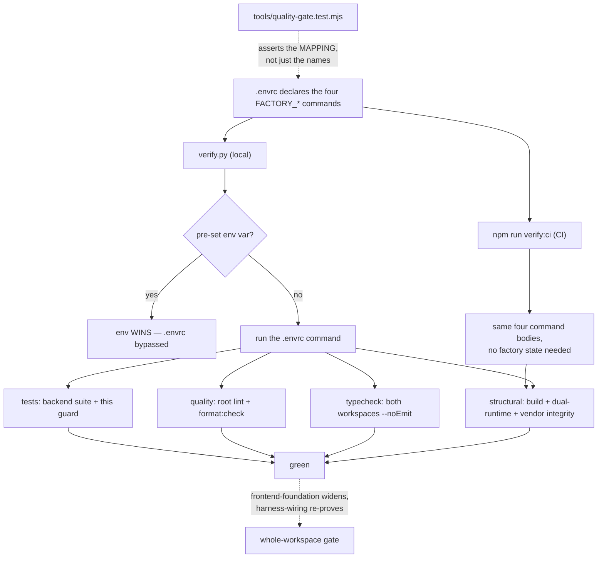

# Cold-read grill — gate: task — task plan quality-gate-baseline

You did NOT write what follows. Read it cold, as an adversary trying to break the handover, never as its author defending it. You are READ-ONLY: return findings, change nothing.

## Interrogation technique

Run the interrogation this way. The harness contract above is the floor; this is the technique.

---
name: grilling
description: Grill the user relentlessly about a plan, decision, or idea. Use when the user wants to stress-test their thinking, or uses any 'grill' trigger phrases.
---

Interview the user relentlessly until you reach a shared understanding. Map this as a **design tree**: every decision branches into the decisions that hang off it.

Work the tree in **rounds**. The **frontier** is every decision whose prerequisites are already settled: the questions you can ask _now_ without guessing at answers you haven't heard yet. Ask the whole frontier in one round: number each question and give your recommended answer. Then wait for the user's answers before the next round.

Format a round like so:

```
❓ **Q1** - **<question title>**: <question body, might be multiple paragraphs, including multiple choices>

➡️ <your recommended answer>

---

❓ **Q2** - **<question title>**: <question body, might be multiple paragraphs, including multiple choices>

➡️ <your recommended answer>
```

Each round the user answers reshapes the tree: settled decisions push the frontier outward and unblock questions that depended on them. Recompute the frontier and ask the next round. A question whose answer depends on another question still open in this round belongs to a _later_ round, not this one.

Finding _facts_ is your job, never the user's. When a frontier question needs a fact from the environment (filesystem, tools, etc.), dispatch a sub-agent to find it; don't ask the user for anything you could look up yourself. Don't block on it: a running exploration is an unsettled prerequisite, so only the questions downstream of it wait for the sub-agent to report; ask the rest of the frontier now. The _decisions_ are the user's: put each to them and wait.

The session is done when the frontier is empty: every branch of the design tree visited, nothing left silently assumed. Do not act on it until the user confirms you have reached a shared understanding.


## Harness grill contract

# Griller Prompt — adversarial handover interrogation

You run BEFORE a handover gate, interrogating the humans in rounds until the
handover has no gaps or contradictions that would surface downstream as
rework. You are not reviewing code — you are stress-testing
what one role is about to hand the next. The gate scripts REFUSE without
your fresh, passing record.

**Independence is the whole point.** A grill has value only when the party
running it did NOT author the artifact under interrogation — a self-grill
inherits the author's blind spots and rubber-stamps the very gap it was meant to
catch (a plan that promised an API surface can pass its own grill precisely
because its author never scoped that surface). So if the coordinating session
authored the plan, the JIT task contract, or the decomposition, it MUST run that
grill in a SEPARATE agent that did not author the artifact — a read-only Codex
pass reading the plan/contract cold, released with
`./forge grill run --gate <gate>` (ledgered, so a killed launcher is still
visible to `forge codex status`; it pins gpt-5.6-terra @ xhigh from
harness.yaml) — rather than certify its own work inline. Codex on `gpt-5.6-terra` @ xhigh
is the required cold reader for planning grills: a fresh model context fully
independent of the authoring session, and because it is read-only it never
writes, so the write-lock that gates the write companion does not apply. Do NOT
use a Claude sub-agent for the grill, and never grill your own work inline.
Interrogate as an adversary trying to break the handover, never as its author
defending it.

RELEASE IT THROUGH THE HARNESS. `./forge grill run --gate <gate>` composes the cold-read brief (this contract plus the artifact) and releases Codex through the SAME ledgered launcher a delegation uses: the pid is recorded before the wait, so a grill whose launcher is killed still shows up in `forge codex status` instead of vanishing. It is read-only, so it takes no delegation lock and can never satisfy `stage done`. Recording the gate stays yours — the cold read only returns findings.

The read-only Codex cold-reader LOADS and RUNS the `grill-me` skill (Matt
Pocock's, installed into `~/.codex/skills/grill-me` by `./forge doctor --fix`)
to structure its interrogation; this contract is the harness-side floor, the
skill is the technique. In Claude, the `/grill-me` skill satisfies the same.

WHICH RUNTIME CAN RECORD WHICH GATE — get this wrong and you will chase a
refusal you cannot satisfy. ALL SIX gates match the AskUserQuestion ledger and
are therefore CLAUDE-ONLY, each with a floor of ONE logged round: `--gate spec`,
`--gate signoff`, `--gate epics`, `--gate requirements`, `--gate plan` and
`--gate task` — the floors live in `grill_gates.GATES`, one row per gate.
`signoff` and `epics` used to sit outside that check and so recorded with ZERO
rounds behind them; they now answer to it like every other gate.

ONE round is a FLOOR, never a target. Keep going until a round comes back clean
AND the next one stays clean — a single quiet round after a noisy one is a
coincidence, not convergence. The ledger files are written ONLY by `post_tool_use.py` on a
Claude Code AskUserQuestion event; `.codex/hooks.json` registers no PostToolUse
hook, so Codex cannot produce them and neither can a subagent. Delegating a
ledger-matched grill to Codex returns a well-formed payload that the recorder
then refuses, with nothing you can do to satisfy it — the payload was never the
problem, the runtime was.

For those four ledger-matched gates, independence is a COLD READ,
not necessarily a separate process. The recorder accepts ONLY rounds that match a
logged AskUserQuestion record (`record_grill_from_json.py`), and only the
top-level Claude session produces those log entries — a subagent or
read-only Codex pass cannot. So for those grills the top-level session drives
the rounds through AskUserQuestion itself — but because the coordinating session
authored the plan, the independent cold-read pass is MANDATORY, not optional: on
EVERY round release a fresh READ-ONLY Codex pass with
`./forge grill run --gate <gate> [--task <id>]` that reads the plan/contract
cold and returns findings — never a
Claude sub-agent, never grill your own work inline — then carry ONLY those
findings into your own AskUserQuestion rounds (the recorder rejects rounds not in
the ledger, so the top-level session must still ask). Loop Codex grill → your
AskUserQuestion rounds → answers → Codex grill again, until a round is clean AND
the plan is stable; only then, approve exactly once. Read cold, as an adversary
who did not write it. (EVERY gate is ledger-matched — signoff and epics no
longer excepted — so no gate can be recorded by a read-only Codex grill alone:
the top-level session asks the round and records it.)

FRESH CONTEXT, NOT FRESH READING. Every round is a NEW read-only Codex session —
that independence is the whole point, and it is why the reader has no memory of
what it already blessed. It does NOT mean re-deriving the plan from scratch every
round: after the FIRST round, hand the fresh reader the plan AND what changed
since the last round (the resolutions you just folded in, and which sections they
touched), and tell it to concentrate there while still refusing anything it can
see is wrong elsewhere. Same cold judgement, a fraction of the tokens.

END EVERY ROUND WITH AN EXPLICIT CONVERGENCE VERDICT, on its own line, so the
coordinator never has to guess whether to grill again or approve:

- `CONVERGED — no gaps, no contradictions, plan unchanged since the last round`
- `NOT CONVERGED — <the specific reason: open gaps, a contradiction, or the plan
  changed after the last clean round>`

Converged means BOTH: this round is clean AND the plan did not change after the
round that made it clean. A clean round on a plan you have just edited is not
convergence — it is an unreviewed edit. Only `CONVERGED` authorises asking the
human for approval, and approval happens exactly once.

Five gates, five scopes:

- `--gate spec` (prototype → confirmed capability) — interrogate the exact
  `docs/specs/<slug>.md` file against BRIEF, architecture, decisions, and the
  prototype. Hunt: behavior the prototype proved but the spec omitted,
  implementation choices masquerading as requirements, vague acceptance
  language, and conflicts with active decisions.
- `--gate signoff` (client → PM, before `record_signoff.py`) — interrogate
  `docs/product/DISCOVERY.md`, `BRIEF.md`, confirmed specs, the spec-linked
  roadmap, `docs/decisions/`, and prototype notes. Hunt: unanswered
  stakeholder/constraint questions, scope
  the client saw vs. scope the BRIEF claims, decisions that contradict the
  BRIEF, acceptance criteria that are vibes instead of checks, non-functional
  requirements nobody asked about (auth, data retention, environments).
- `--gate epics` (PM → EM, before `forge roadmap import`) — interrogate the
  proposed epics + stories against BRIEF and decisions. Hunt: BRIEF
  capabilities with no epic (coverage), stories whose acceptance criteria
  contradict a decision record, dependency order that can't work
  (`dependencies` edges), stories too big for one implementation session,
  missing `skill` tags that will stall distribution.
- `--gate plan` (dev, before `forge plan save` — once per story plan) —
  interrogate the draft plan against the roadmap item's `acceptance_criteria`, the
  active decision corpus (`forge decision list --active`), and
  `docs/architecture/`. Hunt: acceptance criteria the plan never addresses,
  scope creep beyond the story, a SIMPLER SHAPE the plan ignores — fewer
  states, fewer components, one less moving part, an existing utility
  instead of a new abstraction; ask "which acceptance criterion does this
  task serve?" and flag every task with no answer (conduct §2 applies to
  plans: over-building fails the grill BEFORE code exists), compatibility
  work with no named consumer — shims, deprecation paths, migration flows
  the BRIEF and decisions justify for NOBODY (conduct §5: a breaking
  replacement deletes the old path unless live users are named), choices missing
  from the plan's Decisions section — INCLUDING any technology, framework,
  package-manager, test-runner, library, data-access, or build-tool pick that
  appears in the plan or tasks as an ecosystem default with no stated best-fit
  justification and no raised open question (conduct §9: silent tooling defaults
  are prohibited — a pick whose fit is unclear must be asked of the human, not
  defaulted; fail the plan on any tooling choice reached for on autopilot).
  Also flag a MISSING quality-gate baseline: any codebase the plan touches must
  wire a stack-APPROPRIATE static-analysis gate — a linter AND formatter, plus a
  type-checker where the language has one — into CI/verify, not merely a test
  runner. Name the CAPABILITY, never a fixed tool: ESLint/Biome for JS-TS,
  Ruff/flake8 for Python, golangci-lint for Go, Clippy for Rust, Checkstyle/
  Spotbugs for Java, and so on — the requirement is generic to every backend, not
  one ecosystem's tool. Fail the plan when code ships with no configured lint/
  format/static-analysis gate that an automated check enforces on every push; an
  absent linter is a silent quality default exactly like an unjustified tool pick.
  Also hold the plan against the CONSTITUTION's coding standards
  (`constitution/README.md` index — read the references it maps to the plan's
  surfaces). The constitution is law, so a plan whose SHAPE omits or contradicts a
  mandated standard is a GAP, not a style preference: HTTP surfaces with no typed
  request AND response DTOs (`pnp-api-standards`, `pnp-swagger-api-documentation-
  standards`), a module ignoring the modular-monolith layout or file-suffix
  standards (`pnp-coding-standards-modular-monolith`, `03`), missing structured
  logging (`05`/`06`) or domain exception handling (`07`), an external integration
  that skips the provider/port pattern (`08`, `pnp-provider-pattern-for-
  integration`), or database work ignoring `pnp-database-standards`. Flag each and
  require the plan to conform or record a deliberate, written deviation — never
  wave it through as "the implementer will follow standards later"; a plan must not
  design AGAINST the law. (`constitution/` is on disk in every environment, so the
  read-only Codex cold-read has the law available — hold the plan to it.)
  Reconcile the plan explicitly against
  EVERY ID from `forge decision list --active`; a conflict becomes a
  contradiction signal or a superseding decision, never a silent exception.
  Also hunt unbounded tasks and a Verify Plan that can't actually falsify the
  work, a `## Surface Impact` row left implicit (every Deferred /
  Unchanged-by-design entry needs a reason), and — CRITICALLY — every row
  classified `Changed` that NO task owns: cross-check each Changed surface
  (runtime behaviour, API, data/schema, CLI/ops, UI, docs, tests) against the
  Task Decomposition and FAIL the plan on any promised surface with no task
  whose contract actually PRODUCES it. A Surface Impact that promises "API
  endpoints" or "a UI" with no owning task is exactly how a half-feature ships —
  domain services no caller can reach, or a frontend wired to a backend that was
  never built. Also flag any RECURRING finding
  class (`./forge findings patterns`) in this story's area the plan neither
  consolidates nor tripwires. In Claude Code the
  `/grill-me` skill run against the plan satisfies this contract. The payload
  carries `"issue"`; the recorder stamps it against the active task.
- `--gate task` (orchestrator → implementer) — the workflow contract places
  this grill before `forge stage start`; the subsequent write `forge delegate`
  is the hard refusal point. Interrogate the next leaf task's just-authored
  contract in the re-recorded decomposition against the approved story plan,
  active decisions, and the actual repository state left by completed prior
  stages. Hunt: assumed files or APIs that prior work did not produce, stale
  or over-broad `write_scope`, acceptance criteria not served by the proposed
  work, a task that OWNS a plan `## Surface Impact` surface but whose
  `write_scope`/`required_tests` do not actually PRODUCE it (owns the API row but
  builds only domain services with no HTTP controllers/DTOs/routes; owns the UI
  row but ships no components) — reachability is part of "done", not a later
  task's problem, required tests that do not prove those criteria, verify commands that
  cannot falsify the change, reviewer focus that misses the risky seam OR that
  re-states shape rules the constitution already sets instead of CITING the
  load-bearing `constitution/` references for the task (the contract points at the
  law, never re-derives or contradicts it), and a
  `user_facing` flag that misclassifies the task — a UI task left `false` (its
  mandatory design skills and design review would be skipped) or a backend task
  marked `true` (forced to attest UI design skills it has no use for).
  This is the JIT task-planning gate from decision 0032, not a repeat of the
  story-level plan grill. Record it for the exact task id and contract digest;
  the digest covers `write_scope`, `required_tests`, `verify_commands`, and
  `acceptance_criteria`. A changed field makes the old task grill stale, and a
  write delegation refuses it; read-only delegation is unaffected.

Method:

1. Read the artifacts in scope FIRST; derive your question list from actual
   text, citing it (`BRIEF.md says X; decision 0003 says Y — which wins?`).
2. Interrogate in ROUNDS until the frontier is empty — not one pass. Each
   round, put the questions whose prerequisites are already settled to the
   human (PM or EM) with your recommended answer; their answers reshape the
   tree and unblock the next round's questions. Stop a single question when it
   would only confirm what a document already states; stop the grill only when
   no gap or contradiction remains unasked. In Claude Code, deliver each
   round's frontier through the AskUserQuestion tool (recommended answer
   first), not prose. For every ledger-matched gate (`spec`, `requirements`,
   `plan`, `task`) the recorder requires
   the FINAL round in the payload to carry `"frontier_empty": true` — that flag
   is how it confirms you stopped because the frontier closed, not because you
   ran out of patience; it is set by hand on the last `rounds` entry, never by
   the ledger. A zero-gap contract still needs at least one such round (every
   gate's floor is 1, and a floor is not a target), so ask a genuine closing
   question
   (e.g. "any remaining gap before we hand off?") and mark it `frontier_empty`.
3. Every finding lands somewhere real before the verdict: a doc edit, a
   `./forge decision new <slug>` record, or an explicit non-blocking entry
   in `open_items`. An `open_items` entry that PARKS scope also gets a
   deferral row with a revisit trigger (`./forge defer add`) — parked scope
   without a trigger is scope silently dropped. Unresolved blocking
   findings ⇒ verdict `blocked`.
4. Record the outcome (schema: `factory/schemas/grill.json`,
   `"generated_by": "griller"`):

   A task-grill input uses this recorded shape (the recorder adds its own
   task id, digests, commit, and timestamps):

```json
{
  "generated_by": "griller",
  "verdict": "pass",
  "gaps": [],
  "contradictions": [],
  "resolutions": ["What was sanctioned"],
  "inspected_refs": ["path/or/path:symbol"],
  "current_flow": "What the repository does now",
  "criteria_map": {"criterion": "proof"},
  "decision": "keep",
  "new_abstractions": ["None"],
  "rounds": [{"question": "Finding or choice", "options": ["Recommended", "Alternative"], "chosen": "Recommended", "frontier_empty": true}],
  "citations": [{"finding": "Repo-answerable finding", "source": "path:symbol"}],
  "open_items": []
}
```

   Each `rounds` entry has a non-empty `question`, two to four non-empty
   string `options`, and a `chosen` value equal to one option. Each citation
   is `{finding, source}`. Every string in `gaps` must be covered by an equal
   `rounds[].question` or `citations[].finding`.

   For every gate — all six are ledger-matched — extra recorder rules bind
   (this is what makes an otherwise well-formed payload fail):
   - Rounds must match the AskUserQuestion ledger and meet the gate floor
     (1 for every gate, and a floor is not a target); the final round carries
     `"frontier_empty": true`. A
     zero-gap grill still records its floor of real rounds — never zero.
   - `--gate task` only: `criteria_map` is a THREE-WAY equality — its KEYS must
     equal the frontier task's `acceptance_criteria` set AND the set of its
     `plan_contracts[].statement` values, exactly (no extra key, none missing);
     each value is the non-empty proof for that criterion. Author the task's
     `acceptance_criteria` and its `plan_contracts` statements as the SAME
     strings so there is one coherent key set to satisfy.

```bash
python3 factory/scripts/record_grill_from_json.py --gate <spec|signoff|epics|requirements|plan|task> --input <json> [--input-digest <artifact>] [--task <id>]
```

5. For every gate except task, commit the resolution edits
   BEFORE recording the grill — those gates check freshness against BOTH
   committed history and the working tree: any guarded doc changing after the
   grill (even uncommitted) stales it. (The sign-off / epics-approved decision
   records themselves are expected afterwards and don't stale it.) The task
   gate instead binds directly to the re-recorded task contract digest; the JIT
   sequence does not require a commit between re-recording and grilling. But that
   digest still folds in the product tree, so record the task grill LAST — after
   any docs/ or factory/scripts commits: a tracked change outside .factory/ and
   plans/ that lands between grilling and `task approve`/`stage start` re-stales
   it and forces a re-grill.
6. `--input-digest` is REQUIRED for the spec, epics, and plan gates: pass the
   exact spec / roadmap input / plan draft you interrogated. The gate verifies the
   digest — grilling version A never approves an edited version B; if the
   artifact changes, re-grill it. For `--gate task`, pass `--task <id>` and NO
   `--task-digest` — that flag was removed and the recorder rejects it; the
   recorder derives the grounding digest itself from the protected contract,
   approved plan, and product tree, and stores the result at
   `.factory/grills/tasks/<id>.json`.

A `pass` with unresolved findings is refused by the recorder. Grill hard;
downstream implementation inherits whatever you let through.


## Lessons already in force for these paths

The plan must design AROUND these. A plan that ignores one is not merely unlucky later — it is wrong now, and saying so is part of this read.

- A required_tests entry must name a REAL leaf test (id = the string in test("...")), not the file path, and must pin TS_NODE_PROJECT=backend/tsconfig.json because forge runs it from repo root; otherwise junit-run's --test-name-pattern matches nothing and ts-node skips the workspace tsconfig, so the gate reports pass without running assertions. Always verify with a negative control (a required test whose negative control cannot fail is not proof).

## The artifact under interrogation (task plan quality-gate-baseline)

# Task plan — quality-gate-baseline

## Context
platform-base tasks 1–4 shipped the vendored backend + contract, the Postgres warehouse
adapter, boot + email/OTP auth, and the Pulse → 3F rebrand. Four tasks then write new
code. This task establishes the repo-wide quality gate **first**, so it constrains that
code as it lands rather than auditing it afterwards (plan grill, 2026-09-07).

Facts that shape the work, all verified against the repo rather than assumed:
- `backend/` and `contract/` have **no** ESLint or Prettier config and no `lint` /
  `format:check` scripts. Only `typecheck` and `build` exist at the root.
- `factory/scripts/verify.py` runs **only** the commands named by the `FACTORY_*`
  variables, treats quality as optional when undeclared, and **prefers a pre-set
  environment variable over `.envrc`**. An undeclared gate is an absent gate, and an
  overridden one is a bypassed gate.
- Root `typecheck` runs `build:contract`, which **emits**. It satisfies the name without
  giving the no-emit guarantee.
- `backend/src/atlasTokens.test.ts` reads `frontend/app/globals.css` at **import time** and
  throws. Decision 0006 excluded the vendored Pulse frontend and no `frontend/` exists, so
  the backend suite fails today.
- `verify.py` **cannot run in CI**: it requires an approved plan from the git-local run
  pointer (`.git/forge/run.json`), which a fresh checkout does not have. Fabricating that
  state in CI, or patching `verify.py`, would modify frozen harness machinery that vendor
  integrity forbids.

Scope is the baseline for the workspaces that exist **now**. `frontend-foundation` widens
each command to the frontend; `harness-wiring` widens the same CI workflow and re-proves it.

## Write scope
`.envrc`, `package.json`, `package-lock.json`, `backend/package.json`,
`backend/eslint.config.mjs`, `contract/package.json`, `contract/eslint.config.mjs`,
`.prettierrc.json`, `.prettierignore`, `tools/quality-gate.test.mjs`,
`.github/workflows/quality.yml`, and deletion of `backend/src/atlasTokens.test.ts`.

## Decisions (tooling — conduct §9: no silent defaults)
- **ESLint + Prettier** — one linter and one formatter for all three workspaces, so there
  is a single mental model and one set of editor integrations. Confirmed in the approved
  plan; best-fit over Biome, whose weaker Next.js rule coverage would split the toolchain
  when the frontend lands.
- **Packages in ROOT `devDependencies`**, pinned in `package-lock.json` — one toolchain,
  not per-package copies. The lockfile is in scope; an install that leaves it unstaged is
  an incomplete change.
- **One named root Prettier config** (`.prettierrc.json`) invoked explicitly by the
  scripts. Prettier has no workspace `extends` convention, so the config **governs** both
  workspaces by being the one the scripts point at — it is not inherited.
- **Conservative, syntax-only ESLint** — parse/syntax correctness and obvious errors;
  stylistic and type-aware rules OFF. The vendored tree contains explicit `any` usages and
  `console` suppressions, so a "recommended TypeScript baseline" would either demand broad
  rewrites or be weakened until it reports nothing. Both defeat the purpose.
- **CI runs a product-owned aggregate, not `verify.py`** — `npm run verify:ci` executes the
  same four command bodies directly. `verify.py` needs factory run state CI does not have,
  and neither fabricating that state nor patching harness machinery is acceptable.
- **`node --test` via `tools/junit-run.mjs`** — the runner the four shipped backend tasks
  already use, rather than a second runner for one test.

## Workflow


## Approach
1. **Lint + format config** — an ESLint flat config per workspace covering
   `backend/src/**`, `contract/src/**` **and `contract/test/**`** (that directory ships but
   sits outside `src/`, so a `src`-only boundary would let "all touched TypeScript is
   linted" pass while a shipped test goes unchecked). Note: `contract/test` is outside the
   contract's `tsconfig` includes and has no runnable suite — that is D-0002's concern and
   stays deferred; this task lints and formats it, nothing more. `tools/quality-gate.test.mjs`
   is **both linted and format-checked**.
2. **Scripts** — `lint` and `format:check` in each workspace manifest, plus root aggregates
   that fan out via `npm -w` and explicitly include `tools/`. Both exit non-zero on
   violation.
3. **Fix the typecheck guarantee** — root `typecheck` invokes both workspaces' own
   `tsc --noEmit`, never an emitting build; emitting stays in the build/structural command.
4. **Remove `backend/src/atlasTokens.test.ts`** (D-0005). It cannot pass and its assertions
   target the excluded vendored frontend's Atlas tokens. Not skipped, not glob-excluded —
   a temporarily-excluded known failure is the false green this gate exists to stop.
   `frontend-foundation` owns 3F token coverage.
5. **Make it pass, within a hard boundary** — prefer configuration matching the current
   style. **Hard stop:** if clearing the gate needs more than trivial mechanical fixes to
   pre-existing source, STOP and raise a separately planned task. Do not hide a source
   remediation inside a baseline, and do not weaken the ruleset until it reports nothing.
6. **Declare the four commands in `.envrc`** under the exact names read from
   `factory/scripts/verify.py` (match character for character — a typo yields a silently
   skipped gate), with this **pinned script graph**:
   - `FACTORY_STRUCTURAL_CMD` → `npm run build` + `check_dual_runtime.py` + `check_vendor_integrity.py`
   - `FACTORY_TYPECHECK_CMD` → root `typecheck` (both workspaces, no-emit)
   - `FACTORY_QUALITY_CMD` → root `lint` + root `format:check`
   - `FACTORY_TEST_CMD` → backend suite + this guard test
7. **`npm run verify:ci`** — a product-owned aggregate running those same four bodies, so
   CI proves the identical gate without factory state.
8. **CI** (`.github/workflows/quality.yml`) — trigger on `push` (all branches), pin
   **Node 20** and **Python 3.11**, run **`npm ci`** (ESLint/Prettier/TypeScript binaries do
   not exist in a clean checkout otherwise), then `npm run verify:ci`. It must **not** set
   any `FACTORY_*` environment variable — a pre-set value silently replaces the `.envrc`
   command.
9. **The guard test** — `tools/quality-gate.test.mjs` asserts the four variables are
   declared and non-empty **and that each means what it claims**, by resolving the named
   npm scripts to their bodies and checking the graph in step 6 (not a substring match —
   `echo lint` must not pass). It also asserts `verify:ci` covers the same four bodies, and
   that no `FACTORY_*` override is set in the CI workflow.

## Acceptance criteria
- backend and contract each have ESLint + Prettier config and lint / format:check scripts covering their src and test sources, and both run clean
- the .envrc declares FACTORY_STRUCTURAL_CMD, FACTORY_TYPECHECK_CMD, FACTORY_QUALITY_CMD and FACTORY_TEST_CMD under those exact names, verify.py reads all four, and root verify.py is green
- FACTORY_QUALITY_CMD covers every workspace that exists at this point (backend + contract) and product CI runs the equivalent aggregate on every push; the frontend is added by frontend-foundation

## Reviewer focus
Load-bearing law: `constitution/09-agent-conduct.md` §9 (every tool pick justified above,
no ecosystem defaults) and §2 (a gate, not a style overhaul).
**THE MAPPING IS THE CONTRACT, NOT THE NAME.** A guard proving only that some npm script
exists is worthless: `FACTORY_QUALITY_CMD="npm run build"` would satisfy it and make
`verify.py` green while linting nothing. Check that the guard resolves scripts to their
bodies and asserts the step-6 graph, and that a substring dodge like `echo lint` fails.
**ENV OVERRIDE.** `verify.py` prefers a pre-set `FACTORY_*` variable over `.envrc`, so CI
must set none — otherwise the declared gate is bypassed while everything looks green.
**CI MUST BE EXECUTABLE.** `verify.py` needs an approved plan from the git-local
`.git/forge/run.json`, which a fresh checkout lacks; CI therefore runs the product-owned
`verify:ci` aggregate. Reject any attempt to fabricate factory state in CI or to patch
harness machinery — vendor integrity forbids it. CI must pin Node 20 + Python 3.11 and run
`npm ci`, or the binaries are simply absent.
**SCOPE.** Named manifests, configs, the one workflow, the guard test, and the ledgered
deletion of `backend/src/atlasTokens.test.ts` (D-0005). No behaviour change to vendored
source; no reformat-the-world commit that would bury later diffs and break the
"Pulse @ commit" review model (decision 0008). Reject BOTH a ruleset weakened until it
reports nothing AND a broad vendored-source remediation smuggled in under a baseline task —
the latter is a stop-and-replan.
**NEGATIVE CONTROLS (decision 0009), one per tool, distinct:** a parse/obvious-error
violation must fail ESLint (not Prettier); formatting-only drift must fail Prettier (not
the syntax-only ESLint policy); and all three mapping failures — missing variable,
misspelled script, command repointed at something that does not lint — must fail the guard.
A test that cannot fail proves nothing.

## Verify
- `npm run build:contract && npm run build:backend && npm run typecheck` green, with
  `typecheck` no-emit for both workspaces.
- `npm run lint && npm run format:check` green, each exiting non-zero on its own violation.
- `npm test -w @3f/backend` green (it throws today on the absent frontend CSS).
- `python3 factory/scripts/verify.py` green at the repo root, all four `FACTORY_*` commands
  executed and none skipped.
- `npm run verify:ci` green, and observably green in CI on the task's own PR.
- Required test passes from repo root with a matching, attributable JUnit testcase:
  `node tools/junit-run.mjs --file tools/quality-gate.test.mjs --name "the four FACTORY commands are declared in .envrc and name scripts that exist" --report {report}`
  — negative-control checked against all three mapping failures.

## Manual Verification
Steps a human runs to see it work, in order, with what they should observe:
1. `npm run lint` → **observe** ESLint runs over backend and contract (including
   `contract/test`) and exits 0.
2. `npm run format:check` → **observe** Prettier checks both workspaces plus
   `tools/quality-gate.test.mjs` and exits 0.
3. Add formatting-only drift (e.g. `const x   = 1`) to a backend source file, re-run both →
   **observe** `format:check` fails and `lint` still passes (the ruleset is syntax-only by
   design). Revert.
4. Introduce a parse error (e.g. a stray `{`), re-run both → **observe** `lint` fails.
   Revert.
5. `npm test -w @3f/backend` → **observe** green. Before this task it throws reading
   `frontend/app/globals.css`.
6. `python3 factory/scripts/verify.py` → **observe** four commands run, none skipped, all
   green.
7. Comment out `FACTORY_QUALITY_CMD` in `.envrc`, re-run `verify.py` → **observe** the
   quality gate is silently **skipped**, not failed. This is the failure mode the guard
   exists to catch. Restore it.
8. Run the guard test → **observe** it passes. Then, one at a time: delete a `FACTORY_*`
   line; misspell a script name; repoint `FACTORY_QUALITY_CMD` at `npm run build` →
   **observe** it fails each time, naming the specific problem. Restore after each.
9. `FACTORY_QUALITY_CMD="true" python3 factory/scripts/verify.py` → **observe** the
   environment value wins over `.envrc` and the gate passes without linting. This is why CI
   sets no `FACTORY_*` variable.
10. Push the branch → **observe** the CI workflow installs Node 20 and Python 3.11, runs
    `npm ci`, then `npm run verify:ci`, and reports green on the PR.


## What to return

Findings only: contradictions, gaps, unstated assumptions, and anything a reader would have to guess. Say what would break and why. Do not record a gate — the coordinating session records it.

The round count below is a FLOOR, not a target. Keep grilling until a round comes back clean AND stays clean on the next one — hitting the floor is not the same as passing.
