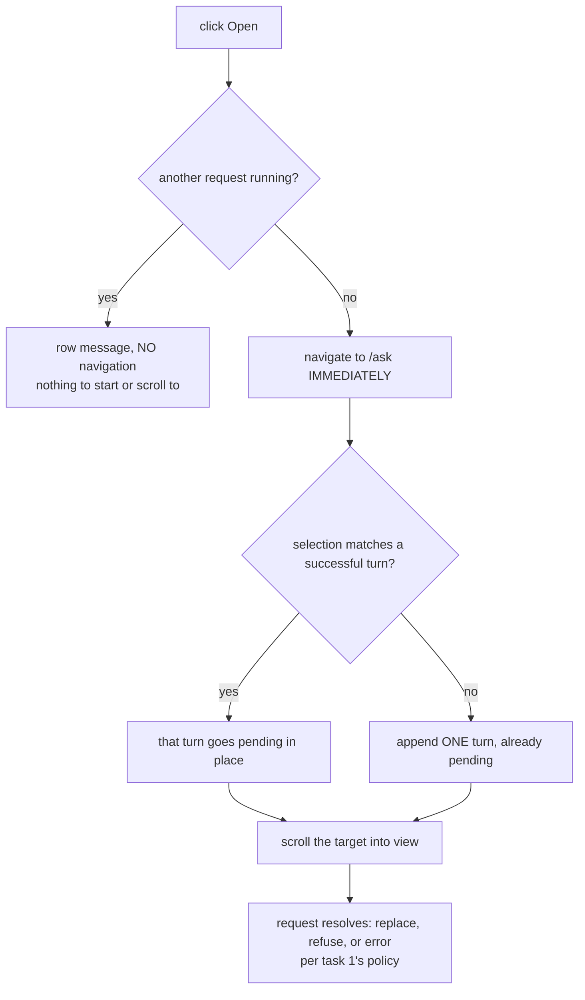

# Cold-read grill — gate: task — task plan reopen-navigation-and-scroll

You did NOT write what follows. Read it cold, as an adversary trying to break the handover, never as its author defending it. You are READ-ONLY: return findings, change nothing.

## Interrogation technique

Run the interrogation this way. The harness contract above is the floor; this is the technique.

---
name: grilling
description: Grill the user relentlessly about a plan, decision, or idea. Use when the user wants to stress-test their thinking, or uses any 'grill' trigger phrases.
---

Interview the user relentlessly until you reach a shared understanding. Map this as a **design tree**: every decision branches into the decisions that hang off it.

Work the tree in **rounds**. The **frontier** is every decision whose prerequisites are already settled: the questions you can ask _now_ without guessing at answers you haven't heard yet. Ask the whole frontier in one round: number each question and give your recommended answer. Then wait for the user's answers before the next round.

Format a round like so:

```
❓ **Q1** - **<question title>**: <question body, might be multiple paragraphs, including multiple choices>

➡️ <your recommended answer>

---

❓ **Q2** - **<question title>**: <question body, might be multiple paragraphs, including multiple choices>

➡️ <your recommended answer>
```

Each round the user answers reshapes the tree: settled decisions push the frontier outward and unblock questions that depended on them. Recompute the frontier and ask the next round. A question whose answer depends on another question still open in this round belongs to a _later_ round, not this one.

Finding _facts_ is your job, never the user's. When a frontier question needs a fact from the environment (filesystem, tools, etc.), dispatch a sub-agent to find it; don't ask the user for anything you could look up yourself. Don't block on it: a running exploration is an unsettled prerequisite, so only the questions downstream of it wait for the sub-agent to report; ask the rest of the frontier now. The _decisions_ are the user's: put each to them and wait.

The session is done when the frontier is empty: every branch of the design tree visited, nothing left silently assumed. Do not act on it until the user confirms you have reached a shared understanding.


## Harness grill contract

# Griller Prompt — adversarial handover interrogation

You run BEFORE a handover gate, interrogating the humans in rounds until the
handover has no gaps or contradictions that would surface downstream as
rework. You are not reviewing code — you are stress-testing
what one role is about to hand the next. The gate scripts REFUSE without
your fresh, passing record.

**Independence is the whole point.** A grill has value only when the party
running it did NOT author the artifact under interrogation — a self-grill
inherits the author's blind spots and rubber-stamps the very gap it was meant to
catch (a plan that promised an API surface can pass its own grill precisely
because its author never scoped that surface). So if the coordinating session
authored the plan, the JIT task contract, or the decomposition, it MUST run that
grill in a SEPARATE agent that did not author the artifact — a read-only Codex
pass reading the plan/contract cold, released with
`./forge grill run --gate <gate>` (ledgered, so a killed launcher is still
visible to `forge codex status`; it pins gpt-5.6-terra @ xhigh from
harness.yaml) — rather than certify its own work inline. Codex on `gpt-5.6-terra` @ xhigh
is the required cold reader for planning grills: a fresh model context fully
independent of the authoring session, and because it is read-only it never
writes, so the write-lock that gates the write companion does not apply. Do NOT
use a Claude sub-agent for the grill, and never grill your own work inline.
Interrogate as an adversary trying to break the handover, never as its author
defending it.

RELEASE IT THROUGH THE HARNESS. `./forge grill run --gate <gate>` composes the cold-read brief (this contract plus the artifact) and releases Codex through the SAME ledgered launcher a delegation uses: the pid is recorded before the wait, so a grill whose launcher is killed still shows up in `forge codex status` instead of vanishing. It is read-only, so it takes no delegation lock and can never satisfy `stage done`. Recording the gate stays yours — the cold read only returns findings.

The technique is Matt Pocock's `grilling` skill — the design tree, the
frontier, numbered questions with recommended answers. `doctor --fix` installs
it into BOTH runtimes, and `./forge grill run` also inlines it into the brief,
so a reader reaches it whether or not its runtime resolves skills. This
contract is the harness-side floor; `grilling` is the technique.

`grill-me` is the HUMAN entry point — you type `/grill-me` and it redirects to
`grilling`. It carries `disable-model-invocation: true`, so no model invokes it
and none should be told to.

WHICH RUNTIME CAN RECORD WHICH GATE — get this wrong and you will chase a
refusal you cannot satisfy. ALL SIX gates match the AskUserQuestion ledger and
are therefore CLAUDE-ONLY, each with a floor of ONE logged round: `--gate spec`,
`--gate signoff`, `--gate epics`, `--gate requirements`, `--gate plan` and
`--gate task` — the floors live in `grill_gates.GATES`, one row per gate.
`signoff` and `epics` used to sit outside that check and so recorded with ZERO
rounds behind them; they now answer to it like every other gate.

ONE round is a FLOOR, never a target. Keep going until a round comes back clean
AND the next one stays clean — a single quiet round after a noisy one is a
coincidence, not convergence. The ledger files are written ONLY by `post_tool_use.py` on a
Claude Code AskUserQuestion event; `.codex/hooks.json` registers no PostToolUse
hook, so Codex cannot produce them and neither can a subagent. Delegating a
ledger-matched grill to Codex returns a well-formed payload that the recorder
then refuses, with nothing you can do to satisfy it — the payload was never the
problem, the runtime was.

For those four ledger-matched gates, independence is a COLD READ,
not necessarily a separate process. The recorder accepts ONLY rounds that match a
logged AskUserQuestion record (`record_grill_from_json.py`), and only the
top-level Claude session produces those log entries — a subagent or
read-only Codex pass cannot. So for those grills the top-level session drives
the rounds through AskUserQuestion itself — but because the coordinating session
authored the plan, the independent cold-read pass is MANDATORY, not optional: on
EVERY round release a fresh READ-ONLY Codex pass with
`./forge grill run --gate <gate> [--task <id>]` that reads the plan/contract
cold and returns findings — never a
Claude sub-agent, never grill your own work inline — then carry ALL of those
findings into your own AskUserQuestion rounds (the recorder rejects rounds not in
the ledger, so the top-level session must still ask). Read cold, as an adversary
who did not write it.

ONE COLD READ PER GATE — put every question to the human INSIDE it. The old
shape was Codex grill → your rounds → amend → Codex grill AGAIN, looping until
clean. That loop cannot converge: a fresh reader has no memory of what the last
one found, so it returns a DIFFERENT frontier rather than a shorter one, and the
artifact you amended to close round one becomes round two's input. Stories
reached eleven, twenty-six and forty rounds that way; the last cost six hours.
`forge grill run` now REFUSES a second unconstrained read on a gate that has
already been read since its last recorded pass.

So the WHOLE grill is:

1. `./forge grill run --gate <gate>` — one cold read. WATCH it.
2. Clean? Record the pass and approve. Nothing else happens.
3. Otherwise resolve every finding the REPOSITORY answers yourself — open the
   file and settle it. Take to the human only what the repository cannot
   answer: a decision nobody has made, a priority, a tradeoff between two
   workable shapes. Put those through AskUserQuestion with your recommended
   answer first, all of them, now. There is no later round to save the hard
   ones for, and a finding is not a menu.
4. Amend the artifact ONCE, to what they decided.
5. Record the pass against the AMENDED version, then approve exactly once.

The price is stated plainly, twice over: nothing independent re-reads the
amended version, and a gap this reader misses is not caught by a second reader
at this gate. Both surface at the next gate, or in review. That is the trade
for ending a loop that was costing whole days.

If the human's answers changed the artifact's SHAPE — a component dropped, a
different approach chosen — the amended artifact is not the one that was read
in any useful sense. Say so and read again: `./forge grill run --gate <gate>
--reread "<what changed shape>"`. It is a choice with a recorded reason, not a
way around the rule, and the five-read cap still backstops it. (EVERY gate is ledger-matched — signoff and epics no
longer excepted — so no gate can be recorded by a read-only Codex grill alone:
the top-level session asks the round and records it.)

FRESH CONTEXT, AND THE ANSWERS SO FAR. Every round is a NEW read-only Codex
session — that independence is the whole point. But a reader that knows nothing
of the earlier rounds does not re-find the same gaps, it finds DIFFERENT ones,
so the rounds never shrink and the grill has no natural end. `./forge grill run`
therefore carries every question already put to the human and the answer they
chose, read from the ledger the recorder validates against.

That gives the reader two obligations: do not re-raise settled questions, and
CHECK EACH ANSWER — that the artifact honours it, and that it contradicts no
other answer, accepted decision or constitution rule. An answer can be wrong, or
right and never applied; saying so is part of the read.

Do NOT tell the reader where to concentrate. A cold read is worth having because
it is unconstrained, and steering it toward the diff is how the thing nobody
looked at survives every round. More information, no direction.

END EVERY ROUND WITH AN EXPLICIT CONVERGENCE VERDICT, on its own line, so the
coordinator never has to guess whether to grill again or approve:

- `CONVERGED — no gaps, no contradictions, plan unchanged since the last round`
- `NOT CONVERGED — <the specific reason: open gaps, a contradiction, or the plan
  changed after the last clean round>`

`CONVERGED` on the cold read means there is nothing to amend: record and
approve. `NOT CONVERGED` does NOT mean read again — it means resolve what the
repository answers, put the rest to the human, amend once, and record the pass
against the amended version. Approval happens exactly once.

Five gates, five scopes:

- `--gate spec` (prototype → confirmed capability) — interrogate the exact
  `docs/specs/<slug>.md` file against BRIEF, architecture, decisions, and the
  prototype. Hunt: behavior the prototype proved but the spec omitted,
  implementation choices masquerading as requirements, vague acceptance
  language, and conflicts with active decisions.
- `--gate signoff` (client → PM, before `record_signoff.py`) — interrogate
  `docs/product/DISCOVERY.md`, `BRIEF.md`, confirmed specs, the spec-linked
  roadmap, `docs/decisions/`, and prototype notes. Hunt: unanswered
  stakeholder/constraint questions, scope
  the client saw vs. scope the BRIEF claims, decisions that contradict the
  BRIEF, acceptance criteria that are vibes instead of checks, non-functional
  requirements nobody asked about (auth, data retention, environments).
- `--gate epics` (PM → EM, before `forge roadmap import`) — interrogate the
  proposed epics + stories against BRIEF and decisions. Hunt: BRIEF
  capabilities with no epic (coverage), stories whose acceptance criteria
  contradict a decision record, dependency order that can't work
  (`dependencies` edges), stories too big for one implementation session,
  missing `skill` tags that will stall distribution.
- `--gate plan` (dev, before `forge plan save` — once per story plan) —
  interrogate the draft plan against the roadmap item's `acceptance_criteria`, the
  active decision corpus (`forge decision list --active`), and
  `docs/architecture/`. Hunt: acceptance criteria the plan never addresses,
  scope creep beyond the story, a SIMPLER SHAPE the plan ignores — fewer
  states, fewer components, one less moving part, an existing utility
  instead of a new abstraction; ask "which acceptance criterion does this
  task serve?" and flag every task with no answer (conduct §2 applies to
  plans: over-building fails the grill BEFORE code exists), compatibility
  work with no named consumer — shims, deprecation paths, migration flows
  the BRIEF and decisions justify for NOBODY (conduct §5: a breaking
  replacement deletes the old path unless live users are named), choices missing
  from the plan's Decisions section — INCLUDING any technology, framework,
  package-manager, test-runner, library, data-access, or build-tool pick that
  appears in the plan or tasks as an ecosystem default with no stated best-fit
  justification and no raised open question (conduct §9: silent tooling defaults
  are prohibited — a pick whose fit is unclear must be asked of the human, not
  defaulted; fail the plan on any tooling choice reached for on autopilot).
  Also flag a MISSING quality-gate baseline: any codebase the plan touches must
  wire a stack-APPROPRIATE static-analysis gate — a linter AND formatter, plus a
  type-checker where the language has one — into CI/verify, not merely a test
  runner. Name the CAPABILITY, never a fixed tool: ESLint/Biome for JS-TS,
  Ruff/flake8 for Python, golangci-lint for Go, Clippy for Rust, Checkstyle/
  Spotbugs for Java, and so on — the requirement is generic to every backend, not
  one ecosystem's tool. Fail the plan when code ships with no configured lint/
  format/static-analysis gate that an automated check enforces on every push; an
  absent linter is a silent quality default exactly like an unjustified tool pick.
  Also hold the plan against the CONSTITUTION's coding standards
  (`constitution/README.md` index — read the references it maps to the plan's
  surfaces). The constitution is law, so a plan whose SHAPE omits or contradicts a
  mandated standard is a GAP, not a style preference: HTTP surfaces with no typed
  request AND response DTOs (`pnp-api-standards`, `pnp-swagger-api-documentation-
  standards`), a module ignoring the modular-monolith layout or file-suffix
  standards (`pnp-coding-standards-modular-monolith`, `03`), missing structured
  logging (`05`/`06`) or domain exception handling (`07`), an external integration
  that skips the provider/port pattern (`08`, `pnp-provider-pattern-for-
  integration`), or database work ignoring `pnp-database-standards`. Flag each and
  require the plan to conform or record a deliberate, written deviation — never
  wave it through as "the implementer will follow standards later"; a plan must not
  design AGAINST the law. (`constitution/` is on disk in every environment, so the
  read-only Codex cold-read has the law available — hold the plan to it.)
  Reconcile the plan explicitly against
  EVERY ID from `forge decision list --active`; a conflict becomes a
  contradiction signal or a superseding decision, never a silent exception.
  Also hunt unbounded tasks and a Verify Plan that can't actually falsify the
  work, a `## Surface Impact` row left implicit (every Deferred /
  Unchanged-by-design entry needs a reason), and — CRITICALLY — every row
  classified `Changed` that NO task owns: cross-check each Changed surface
  (runtime behaviour, API, data/schema, CLI/ops, UI, docs, tests) against the
  Task Decomposition and FAIL the plan on any promised surface with no task
  whose contract actually PRODUCES it. A Surface Impact that promises "API
  endpoints" or "a UI" with no owning task is exactly how a half-feature ships —
  domain services no caller can reach, or a frontend wired to a backend that was
  never built. Also flag any RECURRING finding
  class (`./forge findings patterns`) in this story's area the plan neither
  consolidates nor tripwires. In Claude Code the
  `/grill-me` skill run against the plan satisfies this contract. The payload
  carries `"issue"`; the recorder stamps it against the active task.
- `--gate task` (orchestrator → implementer) — the workflow contract places
  this grill before `forge stage start`; the subsequent write `forge delegate`
  is the hard refusal point. Interrogate the next leaf task's just-authored
  contract in the re-recorded decomposition against the approved story plan,
  active decisions, and the actual repository state left by completed prior
  stages. Hunt: assumed files or APIs that prior work did not produce, a
  `write_scope` whose AREAS miss where the work must land or reach into areas
  the task has no business in (scope is directory prefixes plus named new
  files — a missing existing file under a declared prefix, a drifted line
  number or a renamed module is a NON-BLOCKING note, never a blocking finding;
  `stage done` measures the exact paths), acceptance criteria not served by the proposed
  work, a task that OWNS a plan `## Surface Impact` surface but whose
  `write_scope`/`required_tests` do not actually PRODUCE it (owns the API row but
  builds only domain services with no HTTP controllers/DTOs/routes; owns the UI
  row but ships no components) — reachability is part of "done", not a later
  task's problem, required tests that do not prove those criteria, verify commands that
  cannot falsify the change, reviewer focus that misses the risky seam OR that
  re-states shape rules the constitution already sets instead of CITING the
  load-bearing `constitution/` references for the task (the contract points at the
  law, never re-derives or contradicts it), and a
  `user_facing` flag that misclassifies the task — a UI task left `false` (its
  mandatory design skills and design review would be skipped) or a backend task
  marked `true` (forced to attest UI design skills it has no use for).
  This is the JIT task-planning gate from decision 0032, not a repeat of the
  story-level plan grill. Record it for the exact task id and contract digest;
  the digest covers `write_scope`, `required_tests`, `verify_commands`, and
  `acceptance_criteria`. A changed field makes the old task grill stale, and a
  write delegation refuses it; read-only delegation is unaffected.

Method:

1. Read the artifacts in scope FIRST; derive your question list from actual
   text, citing it (`BRIEF.md says X; decision 0003 says Y — which wins?`).
2. Interrogate in ROUNDS until the frontier is empty — not one pass. Each
   round, put the questions whose prerequisites are already settled to the
   human (PM or EM) with your recommended answer; their answers reshape the
   tree and unblock the next round's questions. Stop a single question when it
   would only confirm what a document already states; stop the grill only when
   no gap or contradiction remains unasked. In Claude Code, deliver each
   round's frontier through the AskUserQuestion tool (recommended answer
   first), not prose. For every ledger-matched gate (`spec`, `requirements`,
   `plan`, `task`) the recorder requires
   the FINAL round in the payload to carry `"frontier_empty": true` — that flag
   is how it confirms you stopped because the frontier closed, not because you
   ran out of patience; it is set by hand on the last `rounds` entry, never by
   the ledger. A zero-gap contract still needs at least one such round (every
   gate's floor is 1, and a floor is not a target), so ask a genuine closing
   question
   (e.g. "any remaining gap before we hand off?") and mark it `frontier_empty`.
3. Every finding lands somewhere real before the verdict: a doc edit, a
   `./forge decision new <slug>` record, or an explicit non-blocking entry
   in `open_items`. An `open_items` entry that PARKS scope also gets a
   deferral row with a revisit trigger (`./forge defer add`) — parked scope
   without a trigger is scope silently dropped. Unresolved blocking
   findings ⇒ verdict `blocked`.
4. Record the outcome (schema: `factory/schemas/grill.json`,
   `"generated_by": "griller"`):

   A task-grill input uses this recorded shape (the recorder adds its own
   task id, digests, commit, and timestamps):

```json
{
  "generated_by": "griller",
  "verdict": "pass",
  "gaps": [],
  "contradictions": [],
  "resolutions": ["What was sanctioned"],
  "inspected_refs": ["path/or/path:symbol"],
  "current_flow": "What the repository does now",
  "criteria_map": {"criterion": "proof"},
  "decision": "keep",
  "new_abstractions": ["None"],
  "rounds": [{"question": "Finding or choice", "options": ["Recommended", "Alternative"], "chosen": "Recommended", "frontier_empty": true}],
  "citations": [{"finding": "Repo-answerable finding", "source": "path:symbol"}],
  "open_items": []
}
```

   Each `rounds` entry has a non-empty `question`, two to four non-empty
   string `options`, and a `chosen` value equal to one option. Each citation
   is `{finding, source}`. Every string in `gaps` must be covered by an equal
   `rounds[].question` or `citations[].finding`.

   For every gate — all six are ledger-matched — extra recorder rules bind
   (this is what makes an otherwise well-formed payload fail):
   - Rounds must match the AskUserQuestion ledger and meet the gate floor
     (1 for every gate, and a floor is not a target); the final round carries
     `"frontier_empty": true`. A
     zero-gap grill still records its floor of real rounds — never zero.
   - `--gate task` only: `criteria_map` is a THREE-WAY equality — its KEYS must
     equal the frontier task's `acceptance_criteria` set AND the set of its
     `plan_contracts[].statement` values, exactly (no extra key, none missing);
     each value is the non-empty proof for that criterion. Author the task's
     `acceptance_criteria` and its `plan_contracts` statements as the SAME
     strings so there is one coherent key set to satisfy.

```bash
python3 factory/scripts/record_grill_from_json.py --gate <spec|signoff|epics|requirements|plan|task> --input <json> [--input-digest <artifact>] [--task <id>]
```

5. For every gate except task, commit the resolution edits
   BEFORE recording the grill — those gates check freshness against BOTH
   committed history and the working tree: any guarded doc changing after the
   grill (even uncommitted) stales it. (The sign-off / epics-approved decision
   records themselves are expected afterwards and don't stale it.) The task
   gate instead binds directly to the re-recorded task contract digest; the JIT
   sequence does not require a commit between re-recording and grilling. But that
   digest still folds in the product tree, so record the task grill LAST — after
   any docs/ or factory/scripts commits: a tracked change outside .factory/ and
   plans/ that lands between grilling and `task approve`/`stage start` re-stales
   it and forces a re-grill.
6. `--input-digest` is REQUIRED for the spec, epics, and plan gates: pass the
   exact spec / roadmap input / plan draft you interrogated. The gate verifies the
   digest — grilling version A never approves an edited version B; if the
   artifact changes, re-grill it. For `--gate task`, pass `--task <id>` and NO
   `--task-digest` — that flag was removed and the recorder rejects it; the
   recorder derives the grounding digest itself from the protected contract,
   approved plan, and product tree, and stores the result at
   `.factory/grills/tasks/<id>.json`.

A `pass` with unresolved findings is refused by the recorder. Grill hard;
downstream implementation inherits whatever you let through.


## Lessons already in force for these paths

The plan must design AROUND these. A plan that ignores one is not merely unlucky later — it is wrong now, and saying so is part of this read.

- A warehouse DATE column read through pg and JSON-serialized arrives at the browser as an IST-shifted UTC timestamp (2026-07-01 becomes 2026-06-30T18:30:00.000Z), so a user-facing table shows the WRONG MONTH. Normalize month/date cells to a date-only YYYY-MM-DD string on the server before they enter a result row, and format them for display on the client.
- The governed-financial percentage measure deliberately returns LABELS ('over-budget', 'credit / negative actual') when the budget is zero, so a renderer that pushes every numeric/percent cell through Number() turns the designed semantics into NaN. A cell formatter must render a non-numeric measure value verbatim.
- Measured against docs/design/3F-Financial-MIS/3F Financial MIS.dc.html, the live MIS Reports filter row drifts from the prototype in four ways: (1) the Generate button uses the shared shell Button's font-h2 (16px) and rounded-md (10px) beside 13px/6px selects, where the prototype's filter-bar Generate is 12.5px type on a 6px radius at the same 34px height; (2) the four filter labels render at 13px ink instead of the prototype's 11px --kl-slate, so a label reads as loudly as its value; (3) the empty state is a single sentence, dropping the prototype's 44px ruled icon block, its 19px deep-forest title and its 13px slate supporting line ('Actuals are read from SAP for the selected period. Nothing is written back - this report is read-only.'); (4) the prototype hides the native select arrow with appearance:none. A filter row and its action button are ONE control group - match their height, radius and type size to each other and to the prototype, and keep .eyebrow at 10px/.22em mono.
- RULING (settles the autoreview P1 and signals S-0021/S-0023): the bucket list must emit ONE row per unmapped GL CODE, never one per master bucket ENTRY, because GL/month is the grain of the only amounts that exist - do NOT add a warehouse query path and do NOT touch sqlBuilder.ts or selectionExecutor.ts to recover triple grain. Fold the master's bucket entries by gl_code in mis-selection.service.ts: costCentre keeps the single cost centre when that GL has exactly one bucket entry and is null when it has several (a GL booked across cost centres is no longer a triple, just as a Budget-only GL is not); provisional is true if any folded entry is provisional; reason names each folded entry's cost centre and reason so the list still says WHICH cost centre is wrong; actual and budget are that GL's totals assigned EXACTLY ONCE. This keeps the settled decision (both an Actual and a Budget amount per row, costCentre null where there is no single cost centre), keeps the gap visible rather than absorbed (decision 0018 as amended), and makes the list reconcilable against the slice totals because no amount is ever copied onto two rows. Acceptance criterion 3's word 'triples' means the reviewable identity of the gap, not one row per cost centre. Prove it in mis-selection.controller.test.ts with a master where ONE GL carries TWO bucket entries: expect a single row, costCentre null, and the GL total counted once.
- RULING (settles the autoreview P2/performance blocker at frontend/src/features/mis/mis-report-view.tsx:233): after folding the bucket to GL grain, costCentre === null means THREE different things - a Budget-only GL, a GL absent from the mapping master but carrying real Actual spend, and a GL whose master entries span several cost centres - so any UI label inferred from null (today 'Budget only') mislabels two of the three. FIX IN THE CONTRACT, not the renderer: replace MisSelectionBucketRow.costCentre (string | null) with costCentres: string[] - the master's cost centres for that GL, empty when the master names none. mis-selection.service.ts populates it (one entry when a single bucket entry, several when folded, empty for a Budget-only or master-absent GL) and the view renders exactly what it is given: the single name when there is one, 'N cost centres' when there are several (the reason line already names each), and 'No cost centre in master' when there are none. Never infer a row's kind from an absent field. Update mis-selection.controller.test.ts and mis-report-view.test.tsx accordingly, including the multi-cost-centre case with nonzero Actual.
- TWO fixes. (1) BLOCKING - dead API surface: the page now imports useMisStatement (mis-report-view.tsx:7,11), so use-mis-selection.ts and the runMisSelection client method it wraps are orphaned, still exposing the replaced /api/mis/run flow. Remove the client method and the dead hook, and drop their now-pointless api.test.ts case. Leave the BACKEND route alone - /api/mis/run is mis-selection's shipped contract and drill-down may consume it; this is about the frontend's dead entry point only. Note use-mis-selection.ts also wrapped the options query, so move nothing: useMisStatement already provides options. (2) P2, and it was observed live during the functional check: when the first statement request rejects, mis-report-view.tsx:71 renders the 'could not be generated' error AND the 'Select Department, Function and Plant, then Generate' empty state together, because run.data is absent and isPending is false. A failure and an invitation to start are contradictory on screen - render the error state INSTEAD of the empty state, per constitution/07-exception-handling.md's one-clear-state rule.
- frontend/src/features/mis/use-mis-selection.ts is the sole caller of the orphaned runMisSelection client method - the page now uses useMisStatement - so it is AUTHORIZED in scope for statement-view and must be DELETED together with the method and its api.test.ts case; removing the method alone will not compile. Do not touch the backend /api/mis/run route: it is mis-selection's shipped contract and drill-down may consume it. This is the frontend's dead entry point only.
- BLOCKING (contract verdict t-sv-c3). formatBlockHeading in statement-view.tsx:161 branches on the block KEY - treating anything keyed 'selected' as a single month and formatting only its 'to'. That breaks the exact degenerate case the human ruled on: when the selected period IS the FY-YTD, the route returns ONE block keyed 'selected' whose from/to span April to July, and the view heads four months as 'July 2026'. Derive the heading from the RANGE, as the criterion says: when from and to fall in the same month, 'July 2026'; when they span months, 'FY 26-27 (YTD to <last month>)'. The block key says which slot it is, not what period it covers. Extend the single-block required leaf to assert the heading of that deduped block, not just that one block renders - the existing leaf passed while the heading was wrong, which is why this reached review.
- tools/junit-run.mjs exits 0 and emits a testcase named after the FILE PATH when --name matches no leaf (D-0024), so a missing-name negative control cannot fail and is not the gate. The gate is that each report's testcase name equals the required leaf id verbatim - a report naming the file path asserted nothing. Verified both halves by hand: a real leaf name yields a testcase named for the leaf, a bogus one yields a testcase named backend/src/mis/mis-drill.service.test.ts. junit-run.mjs stays out of scope for feature tasks; fixing it is D-0024's own trigger.
- t-dp-c5 requires matching the approved prototype, and the prototype's drill overlay carries motion the implementation omitted: the scrim has 'animation: fadein .2s ease' (from opacity 0) and the panel has 'animation: slidein .25s cubic-bezier(.4,0,.2,1)' where slidein is 'from { transform: translateX(24px); opacity: 0 }' - both defined in docs/design/3F-Financial-MIS/3F Financial MIS.dc.html. .mis-drill-scrim and .mis-drill-panel currently have no transition or animation at all, so a drawer covering 86 percent of the viewport simply appears. Add BOTH, using the prototype's own values and keyframe shapes rather than invented ones, and add .mis-drill-scrim and .mis-drill-panel to the existing prefers-reduced-motion block at globals.css:1075 with animation: none, as login-enter already does - the static prototype cannot express reduced motion, so that part is ours. Do not animate from scale(0) and do not use transition: all. The rest of the panel's craft is already right: scale(0.97) on :active, the strong ease-out curve, hover gated behind (hover: hover) and (pointer: fine), named transition properties and focus-visible rings.
- globals.css:768 gives .mis-drill-pagination button the same :active transform scale(0.97) as .mis-actual-action, .mis-drill-close and .mis-drill-back, but .mis-drill-pagination button (globals.css:1041) declares no transition, so its press feedback jumps instantly while every other pressable in the same panel eases. Add the transform transition the close button already uses - transform 140ms cubic-bezier(0.23, 1, 0.32, 1) - naming the property explicitly, never transition: all. Press feedback belongs in the 100-160ms band; an un-eased snap next to eased neighbours reads as an unfinished control.
- The sandbox has no npm registry access (ENOTFOUND), but the orchestrator warmed the shared npm cache from the host on 2026-09-12: recharts@3.10.1 and its full 42-package closure are present, and 'npm install recharts@3.10.1 --offline' was verified to succeed in 675ms from cache alone. Install with the --offline (or --prefer-offline) flag and it will resolve without touching the network. Pin 3.10.1: its peerDependencies accept react ^19, which frontend/package.json:19 sets to 19.0.0. Do not switch charting libraries, hand-roll SVG charts, or treat the dependency as unavailable - decision 0007 names recharts specifically, and frontend/package.json plus the root lockfile are already in this task's write_scope.
- ENOTCACHED in the sandbox is a cache-PATH problem, not a missing package. Verified on the host 2026-09-12: 'npm install recharts@3.10.1 --offline --dry-run -w @3f/frontend' succeeds and resolves 565 packages, so the whole workspace tree including recharts@3.10.1 and its 42-package closure is present in the cache at /Users/caw-dev-m4-5/.npm. The sandbox evidently resolves a different cache directory. Run the install with the cache named explicitly: 'npm install recharts@3.10.1 --offline --cache /Users/caw-dev-m4-5/.npm -w @3f/frontend'. If that still reports ENOTCACHED the sandbox cannot read that path at all - say so in the signal and name the path it DID try (npm config get cache), and the orchestrator will install from the host instead. Do not switch charting libraries or hand-roll SVG: decision 0007 names recharts, and pin 3.10.1 for its react ^19 peer range.
- recharts@3.10.1 is ALREADY INSTALLED and resolving. The orchestrator installed it from the host under ledgered degraded window Q-0032-fcc8 on 2026-09-12, because the sandbox has neither registry access nor a readable npm cache (signals S-0003, S-0004, S-0005). frontend/package.json:21 now carries "recharts": "^3.10.1" and package-lock.json is updated; require.resolve finds it from ./frontend. Do NOT run npm install for it, do not retry --offline, and do not treat the dependency as unavailable - just import and use it. Everything else in the task is untouched and remains yours: the two surfaces, the seven-class renderer, the view-in-report union and its statement-side branch, the in-memory thread, the api client method and its direct test, and the catalog-drawn seed chips.
- node_modules is fully installed in this worktree as of 2026-09-12: zod, typescript-eslint, prettier and recharts all resolve. The orchestrator ran npm install from the host, because a freshly created task worktree starts without node_modules and the sandbox can neither reach the registry nor read the host cache. No product file changed - node_modules is gitignored. Run the five verify commands directly and do NOT attempt npm install, npm ci or any --offline retry; those will fail in the sandbox and are not yours to fix. If a package is genuinely missing, raise a signal naming it rather than trying to install it.
- node_modules is fully installed in THIS worktree as of 2026-09-12, BEFORE delegation: the orchestrator ran 'npm ci --offline --cache /Users/caw-dev-m4-5/.npm' from the host, because forge task start always cuts a fresh worktree without node_modules and the sandbox can neither reach the registry nor read the host cache. Verified after installing: tsc resolves and npm run test:frontend passes 56 tests across 14 files. No product file changed - node_modules is gitignored, so no degraded window was needed. Run the verify commands directly and do NOT attempt npm install, npm ci or any --offline retry; those fail in the sandbox and are not yours to fix. If a package is genuinely missing, raise a signal naming it rather than trying to install it.
- This task is user_facing, so harness.yaml requires emil-design-eng AND frontend-design to be loaded, USED and attested - the test recorder refuses a user-facing automated artifact without both in skills_used. The first run did neither: the job log shows frontend-design mentioned ZERO times anywhere, and emil-design-eng only reached by 'wc -l' on its SKILL.md, never read or applied. Do not attest a skill that was not used. READ both SKILL.md files in full and APPLY them to the two new surfaces - frontend/app/(app)/explore/page.tsx, the saved-views and pinned-reports components, their rules in frontend/app/globals.css, and the new Save view / Pin report controls in ask-panel.tsx - then fix what they find. Precedent from drill-panel: these skills find real defects (dropped prototype motion, a render-time throw with no error boundary, an unformatted paise line), so a pass that changes nothing is a sign the skills were not applied rather than evidence the UI was already right. The surfaces are already functionally verified end to end; this pass is about the design quality the contract promises.
- TWO design skills are mandatory for this user_facing task and only ONE has been used across two runs. emil-design-eng was properly read in the second run (sed -n '321,760p'), but frontend-design has ZERO occurrences in both job logs. Read it explicitly by absolute path: /Users/caw-dev-m4-5/.codex/skills/frontend-design/SKILL.md - read the WHOLE file, then apply it to frontend/app/(app)/explore/page.tsx, frontend/src/features/exploration/*.tsx, the new Save view and Pin report controls in frontend/src/features/assistant/ask-panel.tsx, and the rules those surfaces use in frontend/app/globals.css. The test recorder REFUSES a user-facing automated artifact unless BOTH skill names appear in skills_used, and the orchestrator will not attest a skill whose SKILL.md was never opened - it checks the job log. If after reading it you genuinely find nothing to change, say so explicitly and name at least two specific rules from that file you checked the surfaces against, so the attestation rests on evidence rather than silence.
- Applying frontend-design to the new surfaces found one real defect, observed live: the dashboard rendered 'API request failed with status 500' to the user. Cause: use-exploration.ts:46 errorMessage returns error.message verbatim for any Error, and ApiError (frontend/src/lib/api.ts:28) builds its message as 'API request failed with status ${status}'. The skill is explicit - 'Name things by what people control and recognize, never by how the system is built' and 'Errors ... are never vague about what happened', explain what went wrong and how to fix it. The same function's non-Error fallback, 'The list could not be updated.', is already written correctly, so only the Error branch leaks. FIX inside use-exploration.ts, NOT by changing ApiError's message - that class is shared by every surface in the app and other tests assert on it. Map the failure to human copy for these two surfaces: distinguish the LOAD failure from the DELETE failure, name what the reader can do next, keep sentence case and active voice, and keep the existing role='alert' markup. Update the saved-views and pinned-reports tests that currently assert on 'Delete failed' to assert the new copy. The rest of the quality floor already passes and needs no change: prefers-reduced-motion is present, focus-visible has 20 rules, and there are 3 responsive breakpoints.
- Three verified findings, all confirmed in the code. (1) BLOCKING, t-aev-c3: both Open handlers - pinned-reports.tsx:60 and the saved-views equivalent - call 'void rerun(...)' and then router.push('/ask') UNCONDITIONALLY, while use-ask.ts:29 early-returns 'if (!trimmed || isPending) return;'. So when another Ask request is already in flight the re-run silently never happens and the user is still navigated to /ask, landing on a page with no new answer - the open did not re-run, which is exactly what t-aev-c3 forbids. Make the re-run report whether it was accepted (return a boolean or await it) and navigate ONLY when it actually started; if it was rejected as pending, do not navigate and say so on the row. (2) P2, ask-panel.tsx:154: the Save/Pin notice uses 'error instanceof Error ? error.message : <good copy>' - the SAME inverted pattern already fixed in use-exploration.ts, so an ApiError renders 'API request failed with status 500' in the user-facing Ask panel while the correctly-written copy sits unused in the fallback branch. Put the human copy on the Error branch too, distinguishing save from pin, and do NOT change ApiError itself - it is shared by every surface and other tests assert on it. (3) Cover both in tests: a rerun rejected as pending must not navigate, and a failed save or pin must show human copy rather than the raw message.
- MEASURED on 2026-09-14 with repeated sampling, correcting a single-sample claim in the approved contract. The cap NEVER truncates: at 256, 512 and 2048 every run returned stopReason tool_use with a valid tool block. The model emits the tool call and THEN keeps producing text, so output saturates at whatever cap is set - which means a LOWER cap is strictly better and C1's 'headroom' justification for 2048 is inverted. Latency with one prior turn: cap 2048 -> 5370ms, 4610ms, 19299ms (1153, 1170, 2048 output tokens); cap 512 -> 5610ms, 2667ms, 5833ms (512 every time); cap 256 -> 1162ms and 2681ms. The story's live check expects a follow-up under 5 SECONDS, which 2048 will not meet reliably. Task 3's functional check must therefore expect 5-20s unless LLM_SELECTOR_MAX_TOKENS is lowered - a one-constant change. Do NOT conclude anything from a single sample of this model: run-to-run output length varies from 124 to 24,313 tokens for the same prompt at temperature 0, which is exactly how the orchestrator's original 1,429ms claim came to be wrong.
- This task is user_facing, so harness.yaml requires emil-design-eng AND frontend-design to be loaded, USED and attested; the recorder refuses a user-facing automated artifact without both in skills_used. On the assistant story a delegate run CLAIMED 'Applied emil-design-eng and frontend-design' while its job log contained ZERO occurrences of frontend-design and only a 'wc -l' of the other, and it took three runs before either was genuinely read. The orchestrator greps the job log for an actual read (sed/cat of the SKILL.md at /Users/caw-dev-m4-5/.codex/skills/<name>/SKILL.md) and will not attest a skill whose file was never opened. Read BOTH files in full and apply them to the streamed phase states, the six-state freshness pill and the docked panel; if you genuinely find nothing to change, say so and name at least two specific rules you checked against.
- node_modules is fully installed in THIS worktree as of 2026-09-14: the orchestrator ran 'npm ci --offline --cache /Users/caw-dev-m4-5/.npm' from the host before delegating. No product file changed - node_modules is gitignored. Run the verify commands directly and do NOT attempt npm install, npm ci or any --offline retry. If a package is genuinely missing, raise a signal naming it.
- Three verified findings; the first is BLOCKING and was raised independently by quality AND performance. (1) A stored-selection rerun is UNCANCELLABLE. use-ask.ts:73-77 branches: the selection path calls api.ask({question, selection}) with NO AbortController and NO signal, while only the streamed path does '(abortRef.current = new AbortController()).signal'. So abortRef.current stays undefined for a rerun and the route-change effect has nothing to abort - leaving the assistant mid-rerun does not cancel, which contradicts t-ass-c4. Create and register the controller on BOTH branches, pass its signal to the buffered call, and cover it with a leaf that leaves the assistant during a rerun. (2) api.ts:48 'await request(CSRF_PATH)' and api.ts:61 'await post(/api/auth/refresh)' do NOT forward the supplied signal, so those sub-requests keep running after the user leaves; note the 401 RETRY at :62 already forwards it correctly, so only those two calls need threading. (3) ask-stream.test.ts:80 proves only that the parser ignores a phase frame arriving after a result frame - it does not prove the PENDING RENDER-DELAY TIMER is cleared on a terminal path, which is the thing that would otherwise fire a phase after the answer. Exercise a pending timer: start a request, let the delay be pending, deliver the terminal frame, advance timers, and assert no phase ever rendered.
- Making the stored-selection rerun cancellable changed the call from api.ask({question, selection}) to api.ask({question, selection}, {signal}), and two tests from the previous story assert the EXACT arguments with toHaveBeenCalledWith: frontend/src/features/exploration/saved-views.test.tsx ('a saved row is labelled from the shared catalog...') and frontend/src/features/exploration/pinned-reports.test.tsx ('a pinned row renders metadata only...'). Both now fail with 'expected spy to be called with arguments: [{question: Actual}]' / '[{question: Budget}]'. Both files are added to write_scope because the work mechanically implies them. Update the assertions to match the new two-argument call - assert the FIRST argument still carries question and selection, and that a signal is passed - do NOT loosen them to toHaveBeenCalled(), which would stop proving the stored selection is sent.
- ONE defect behind all three partial contract verdicts (t-ass-c1, c4, c8). ask-stream.ts awaits reader.cancel() BEFORE returning on every terminal path - the malformed-JSON path at :32, the result path at :37 and the error path at :41. Cleanup therefore gates the answer: if cancel() is slow the answer is delayed, and if it REJECTS the answer is lost and surfaces as a failure even though the server delivered it correctly. Fix: capture the response first, then resolve, and perform the cancellation WITHOUT awaiting it - fire it and swallow its rejection (void reader.cancel().catch(() => {})) so cleanup can never delay or fail a delivered answer. Apply it to all three terminal paths. Add a leaf proving the answer still resolves when reader.cancel() REJECTS and when it resolves slowly; ask-panel.test.tsx:409 currently exercises delayed phases but never an asynchronous or rejecting cancellation.

## The contract as recorded (authoritative over any copy in the plan)

## Contract (recorded)

Rendered by the harness from the recorded decomposition; edit the decomposition, not this block. It is excluded from the plan's approval and grill digests, so a re-render never stales either.

**Objective.** Make the click have an instant visible effect. Navigate to Ask before the request completes, append an already-pending turn when there is no match, scroll the target into view, and show the refusal reason on that turn instead of the period control's copy.

**Acceptance criteria**

- router.push('/ask') happens BEFORE the request completes, not after it. Today both handlers run `if (await rerun(...)) router.push('/ask')` (pinned-reports.tsx:67, saved-views.tsx:64), which is why a slow click looks inert and why nothing can be scrolled to - no Ask panel is mounted while the request runs.
- An unmatched open appends ONE turn IMMEDIATELY, already pending, then settles it: replaced on success, carrying the reason on a refusal, carrying an error on a transport failure. run() appends only once the response resolves, so an unmatched open otherwise has nothing to scroll to or show working. One turn, not two.
- A matched open needs no new turn: task 1's rerun (use-ask.ts:146) already routes it through continueTurn, which marks that turn pending. Matching and the failure policy are NOT reimplemented here.
- The panel scrolls the target turn into view, reused or new. AskTurn.id is the handle and already exists. A leaf asserts scrollIntoView is called for the target - it must be mocked, as jsdom does not implement it.
- An Open clicked while another request runs keeps today's behaviour EXACTLY: the row shows its existing 'Another question is still running' message and there is NO navigation, because there would be no target to start or scroll to. An explicit exception to navigate-first.
- Pins and saved views are both covered; they share the defect and must share the fix.
- A refused reopen shows its own reason on that turn and NOT continueTurn's period-specific copy. Task 1 wired it; this task is where it becomes visible.
- Task 1's fifteen leaves all still pass UNMODIFIED. If one needs editing, this task changed behaviour it was told not to touch.

**Write scope** (what `stage done` measures the diff against)

- frontend/app/globals.css
- frontend/src/features/assistant/ask-panel.test.tsx
- frontend/src/features/assistant/ask-panel.tsx
- frontend/src/features/assistant/use-ask.test.tsx
- frontend/src/features/assistant/use-ask.ts
- frontend/src/features/exploration/pinned-reports.test.tsx
- frontend/src/features/exploration/pinned-reports.tsx
- frontend/src/features/exploration/saved-views.test.tsx
- frontend/src/features/exploration/saved-views.tsx

**Required tests** (run by `stage done`)

- `opening a pin navigates before the request resolves` -- `npm exec --no -- vitest run --config frontend/vitest.config.ts --reporter=junit --outputFile={report} {path} -t {id}` (frontend/src/features/exploration/pinned-reports.test.tsx)
- `opening a saved view navigates before the request resolves` -- `npm exec --no -- vitest run --config frontend/vitest.config.ts --reporter=junit --outputFile={report} {path} -t {id}` (frontend/src/features/exploration/saved-views.test.tsx)
- `an unmatched open appends one pending turn before the response arrives` -- `npm exec --no -- vitest run --config frontend/vitest.config.ts --reporter=junit --outputFile={report} {path} -t {id}` (frontend/src/features/assistant/use-ask.test.tsx)
- `an unmatched open that fails leaves one turn carrying the error not two` -- `npm exec --no -- vitest run --config frontend/vitest.config.ts --reporter=junit --outputFile={report} {path} -t {id}` (frontend/src/features/assistant/use-ask.test.tsx)
- `the target turn is scrolled into view for a matched open` -- `npm exec --no -- vitest run --config frontend/vitest.config.ts --reporter=junit --outputFile={report} {path} -t {id}` (frontend/src/features/assistant/ask-panel.test.tsx)
- `the target turn is scrolled into view for an unmatched open` -- `npm exec --no -- vitest run --config frontend/vitest.config.ts --reporter=junit --outputFile={report} {path} -t {id}` (frontend/src/features/assistant/ask-panel.test.tsx)
- `opening while another request runs shows the busy message and does not navigate` -- `npm exec --no -- vitest run --config frontend/vitest.config.ts --reporter=junit --outputFile={report} {path} -t {id}` (frontend/src/features/exploration/pinned-reports.test.tsx)
- `a refused reopen shows its own reason and not the period copy` -- `npm exec --no -- vitest run --config frontend/vitest.config.ts --reporter=junit --outputFile={report} {path} -t {id}` (frontend/src/features/assistant/ask-panel.test.tsx)

**Verify commands**

- `python3 factory/scripts/verify.py`

**Review budget.** 9 files / 700 lines -- Reordering two Open handlers, an eager pending turn in run(), a scroll effect keyed on turn id, and the refusal copy becoming visible. Eight hermetic leaves. UI, so design skills are mandatory. No backend, no contract change, and no new matching or policy logic - task 1 shipped both and its fifteen leaves must pass untouched.

## Already answered on this story — verify, do not re-ask

These questions were put to the human and answered. Two obligations:

1. Do NOT raise them again as open questions. They are settled.
2. DO check each answer still holds — that the artifact actually honours it, and that it does not contradict another answer, an accepted decision, or the constitution. An answer can be wrong, or right and never applied. Saying so is part of this read.

- Q: Where should the 3F app be built, given we're adapting Pulse?
  A: Build in this 3oilpalm repo
- Q: Financial MIS statement — period columns for the PoC?
  A: July + FY 26-27 YTD
- Q: Financial MIS statement — Excel export fidelity?
  A: Clean structured export
- Q: Financial MIS statement — reconciliation / demo-ready bar?
  A: SAP totals = demo-ready; filled month = validated
- Q: SAP ingestion — how does data get in for the PoC?
  A: Excel upload now (SAP export/API later)
- Q: SAP ingestion — how are budgets brought in?
  A: Ingest budgets from the MIS format, as a separate object
- Q: SAP ingestion — grain & raw retention?
  A: Monthly gold + retain raw transaction lines
- Q: SAP ingestion — re-loading a period?
  A: Idempotent replace per period
- Q: Governed joins — how to handle rows in one object but not the other (Budget with no Actual, or Actual with no Budget)?
  A: Full-outer, zero-fill the missing side
- Q: Governed joins — where are 3F financial measures authored?
  A: In code (repo domain files)
- Q: Governed joins — RBAC on a joined query?
  A: Inject scope on both objects
- Q: Governed joins — correctness gate?
  A: Golden-answer fixtures required
- Q: Mapping master — Srihari's Master Table definition is still outstanding. How do we proceed?
  A: Build a provisional master now, reconcile later
- Q: Mapping master — how is it edited in the PoC?
  A: Seed / config file for the PoC (admin UI later)
- Q: Mapping master — selection with no mapping entries?
  A: Empty statement (zeros) + 'no mapping configured' notice
- Q: Drill-down — levels for the PoC?
  A: 2-level now (group → sub-lines → transactions), confirm with Srihari
- Q: Drill-down — showing individual transactions vs Pulse's aggregate suppression?
  A: Show individual lines within the user's RBAC scope, audited
- Q: Drill-down — line-item columns?
  A: Month, Debit, Credit, Value + reference, memo, posting date
- Q: Assistant/exploration — in the first PoC release, or a fast-follow?
  A: Include in the first PoC release
- Q: Assistant — LLM & data residency?
  A: Decide later
- Q: Platform base — how do we bring Pulse's code in?
  A: Snapshot-copy into the repo (own it)
- Q: Platform base — warehouse engine for the PoC?
  A: Postgres for the PoC
- Q: Platform base — auth for the PoC?
  A: Keep Pulse's email+OTP passwordless auth
- Q: Sign-off gate — how do we unlock the build?
  A: Record an internal go-ahead now
- Q: Decision 0029 (every SAP plant selectable on the nursery format, provisional labels, absent budget as a dash) must be accepted before the spec can be confirmed. It supersedes decision 0016's 'single plant DUB' join scope while restating its join key (GL code + month, now within each granted plant) and its deferred mapping-master clause. Accept it as written, confirmed by Rahul Anand?
  A: Accept, confirmed by Rahul Anand (Recommended)
- Q: FY-YTD block on a plant whose budget covers only some of the months in the block: how should Budget and % render? (Today only July is loaded, so the DUB YTD block is unaffected either way.)
  A: Budget = loaded months, % = not loaded (Recommended)
- Q: Conflict with shipped code. The period control's contract says a refused period switch KEEPS the previous answer — you chose that two stories ago, and it's proven by a passing test. This story says a refusal CLEARS it. Both go through the same `continueTurn`. How should that be resolved?
  A: Clear only on saved-report reopens (Recommended)
- Q: Which kinds of refusal should wipe the old numbers? A lost domain grant doesn't come back as `blocked_by_policy` — it returns `not_supported`. An expired login is an HTTP 401/403. Others are plainly not access problems.
  A: Access-related only (Recommended)
- Q: Your access-only clearing rule can't actually be implemented today. A revoked domain or measure grant returns `not_supported` (chat.service.ts:245) — but so do 'no mapping configured' and 'no periods loaded', which aren't access problems at all. The response carries only a class and a message, no reason code. How do you want to handle that?
  A: Narrow it now, record the gap (Recommended)
- Q: The grill is right that I've created a governance problem. Decision 0028 says plainly: "a revoked grant produces a refusal rather than a cached figure." D-0048 permits exactly that cached figure for a revoked domain or measure grant. A deferral can't override an accepted decision — so one of them has to give. Which?
  A: Amend 0028 to record the limit (Recommended)
- Q: When a reopen fails with a terminal 401/403, the session itself is gone — not just that one report. The contract currently says show the refusal on that turn and stop. Should it do more?
  A: Show it on the turn, stay put (Recommended)

## The artifact under interrogation (task plan reopen-navigation-and-scroll)

# Task — reopen-navigation-and-scroll

Story: `ask-reopen-saved-report` · plan: `plans/active/ask-reopen-saved-report-reopening-a-saved-report-returns-to-its-answer.md`

## Objective
Make the click have an instant, visible effect. Task 1 fixed the duplicate — `rerun`
(`use-ask.ts:146`) now finds the most recent successful turn whose `response.selection` is
structurally equal and continues it in place. But **the visible half of the reported bug is still
there**: both handlers `await` the whole re-run before navigating
(`pinned-reports.tsx:67`, `saved-views.tsx:64`), so the user waits on the Dashboard with no
feedback, and the panel has no scroll logic at all — `grep` for `scrollIntoView` / `scrollTo`
across `ask-panel.tsx` still returns nothing.

Task 1's seam is doing its job. Do not reimplement matching or the failure policy.

## Workflow



## Contract

### Navigate first
`router.push("/ask")` happens **before** the request completes, not after it. The user lands on the
thread, sees the target turn working, and the answer arrives under their eyes.

Today's order is `if (await rerun(...)) router.push("/ask")`. That await is why a slow click looks
inert, and why nothing can be scrolled to — there is no Ask panel mounted while the request runs.

### An unmatched open appends its turn immediately, already pending
`run()` (`use-ask.ts:~86`) appends only once the response resolves, so an unmatched open has
**nothing to scroll to or show working**. It must append one turn up front, in a pending state,
then settle it: replaced on success, carrying the reason on a refusal, carrying an error on a
transport failure. **One turn, not two** — this is the same turn the story's criterion counts.

A matched open needs no new turn: task 1's `rerun` already routes it through `continueTurn`, which
marks that turn pending.

### Scroll the target into view
Reused or new, the panel scrolls that turn into view. `AskTurn.id` is the handle and already
exists. A leaf asserts `scrollIntoView` is called for the target — mock it, as jsdom does not
implement it.

### Busy state: refuse, do not navigate
`useAsk` permits one request at a time (`use-ask.ts:111` and `:~72` both refuse while `isPending`).
An Open clicked during another request keeps today's behaviour exactly: the row shows its existing
*"Another question is still running"* message and there is **no navigation** — there would be no
target to start or scroll to. An explicit exception to navigate-first, not an oversight.

### Both entry points
Pins and saved views. They share the defect and must share the fix; a leaf set exercising one
leaves the other unproven.

### The refusal reads like a saved report
Task 1 wired the copy; this task is where it becomes visible. A refused reopen must not show
`continueTurn`'s period-specific string. A leaf asserts the reason reaches the screen on that turn.

## Manual Verification
1. Backend and frontend from a worktree on this branch with `LLM_PROVIDER=bedrock`,
   `BEDROCK_MODEL_ID`, `AWS_REGION=ap-south-1` and the documented `WAREHOUSE_PG_*`. The default is
   `mock` (`config.ts:178`) and `MockLlmProvider` **always** returns `clarify`, so a check against
   it would appear to pass and prove nothing.
2. Ask something that succeeds, pin it, add several more questions so the thread is long.
3. Open the pin from the Dashboard. Expect: **Ask appears immediately**, the existing turn is
   visible and working, and the view has scrolled to it — not left at the top.
4. Open it again. Still **one** turn for that report.
5. Repeat at least 3 times; this surface's failures are intermittent.

## Out of scope
- Selection matching and the failure policy — task 1 shipped and proved both.
- Scrolling for ordinary typed questions.
- Queueing an Open while another request runs.
- Any backend change.

## Proof
`python3 factory/scripts/verify.py`, plus the required leaves. For a **vitest** leaf the
discriminator is the testcase **present AND NOT `<skipped/>` AND NOT `<failure/>`** — a matching
NAME proves nothing, because vitest lists every test in the file under its real name and marks the
ones its `-t` filter missed as skipped (ledgered lesson; a control proved it).

`tests.json` automated status must be exactly **`passed`**, not `pass`, and run
`python3 factory/scripts/check_task_proof.py --base origin/master` **after committing** — the gate
reads the committed tree (ledgered lesson).

Task 1's fifteen leaves must all still pass **unmodified**. If one needs editing, this task changed
behaviour it was told not to touch.

`use-ask.ts`, `ask-panel.tsx`, `pinned-reports.tsx` and `saved-views.tsx` are **not** in
`.prettierignore` — checked against the file, not assumed.

<!-- forge:contract -->
## Contract (recorded)

Rendered by the harness from the recorded decomposition; edit the decomposition, not this block. It is excluded from the plan's approval and grill digests, so a re-render never stales either.

**Objective.** Make the click have an instant visible effect. Navigate to Ask before the request completes, append an already-pending turn when there is no match, scroll the target into view, and show the refusal reason on that turn instead of the period control's copy.

**Acceptance criteria**

- router.push('/ask') happens BEFORE the request completes, not after it. Today both handlers run `if (await rerun(...)) router.push('/ask')` (pinned-reports.tsx:67, saved-views.tsx:64), which is why a slow click looks inert and why nothing can be scrolled to - no Ask panel is mounted while the request runs.
- An unmatched open appends ONE turn IMMEDIATELY, already pending, then settles it: replaced on success, carrying the reason on a refusal, carrying an error on a transport failure. run() appends only once the response resolves, so an unmatched open otherwise has nothing to scroll to or show working. One turn, not two.
- A matched open needs no new turn: task 1's rerun (use-ask.ts:146) already routes it through continueTurn, which marks that turn pending. Matching and the failure policy are NOT reimplemented here.
- The panel scrolls the target turn into view, reused or new. AskTurn.id is the handle and already exists. A leaf asserts scrollIntoView is called for the target - it must be mocked, as jsdom does not implement it.
- An Open clicked while another request runs keeps today's behaviour EXACTLY: the row shows its existing 'Another question is still running' message and there is NO navigation, because there would be no target to start or scroll to. An explicit exception to navigate-first.
- Pins and saved views are both covered; they share the defect and must share the fix.
- A refused reopen shows its own reason on that turn and NOT continueTurn's period-specific copy. Task 1 wired it; this task is where it becomes visible.
- Task 1's fifteen leaves all still pass UNMODIFIED. If one needs editing, this task changed behaviour it was told not to touch.

**Write scope** (what `stage done` measures the diff against)

- frontend/app/globals.css
- frontend/src/features/assistant/ask-panel.test.tsx
- frontend/src/features/assistant/ask-panel.tsx
- frontend/src/features/assistant/use-ask.test.tsx
- frontend/src/features/assistant/use-ask.ts
- frontend/src/features/exploration/pinned-reports.test.tsx
- frontend/src/features/exploration/pinned-reports.tsx
- frontend/src/features/exploration/saved-views.test.tsx
- frontend/src/features/exploration/saved-views.tsx

**Required tests** (run by `stage done`)

- `opening a pin navigates before the request resolves` -- `npm exec --no -- vitest run --config frontend/vitest.config.ts --reporter=junit --outputFile={report} {path} -t {id}` (frontend/src/features/exploration/pinned-reports.test.tsx)
- `opening a saved view navigates before the request resolves` -- `npm exec --no -- vitest run --config frontend/vitest.config.ts --reporter=junit --outputFile={report} {path} -t {id}` (frontend/src/features/exploration/saved-views.test.tsx)
- `an unmatched open appends one pending turn before the response arrives` -- `npm exec --no -- vitest run --config frontend/vitest.config.ts --reporter=junit --outputFile={report} {path} -t {id}` (frontend/src/features/assistant/use-ask.test.tsx)
- `an unmatched open that fails leaves one turn carrying the error not two` -- `npm exec --no -- vitest run --config frontend/vitest.config.ts --reporter=junit --outputFile={report} {path} -t {id}` (frontend/src/features/assistant/use-ask.test.tsx)
- `the target turn is scrolled into view for a matched open` -- `npm exec --no -- vitest run --config frontend/vitest.config.ts --reporter=junit --outputFile={report} {path} -t {id}` (frontend/src/features/assistant/ask-panel.test.tsx)
- `the target turn is scrolled into view for an unmatched open` -- `npm exec --no -- vitest run --config frontend/vitest.config.ts --reporter=junit --outputFile={report} {path} -t {id}` (frontend/src/features/assistant/ask-panel.test.tsx)
- `opening while another request runs shows the busy message and does not navigate` -- `npm exec --no -- vitest run --config frontend/vitest.config.ts --reporter=junit --outputFile={report} {path} -t {id}` (frontend/src/features/exploration/pinned-reports.test.tsx)
- `a refused reopen shows its own reason and not the period copy` -- `npm exec --no -- vitest run --config frontend/vitest.config.ts --reporter=junit --outputFile={report} {path} -t {id}` (frontend/src/features/assistant/ask-panel.test.tsx)

**Verify commands**

- `python3 factory/scripts/verify.py`

**Review budget.** 9 files / 700 lines -- Reordering two Open handlers, an eager pending turn in run(), a scroll effect keyed on turn id, and the refusal copy becoming visible. Eight hermetic leaves. UI, so design skills are mandatory. No backend, no contract change, and no new matching or policy logic - task 1 shipped both and its fifteen leaves must pass untouched.
<!-- /forge:contract -->


## What to return

Findings only: contradictions, gaps, unstated assumptions, and anything a reader would have to guess. Say what would break and why. Do not record a gate — the coordinating session records it.

The round count below is a FLOOR, not a target. Keep grilling until a round comes back clean AND stays clean on the next one — hitting the floor is not the same as passing.
