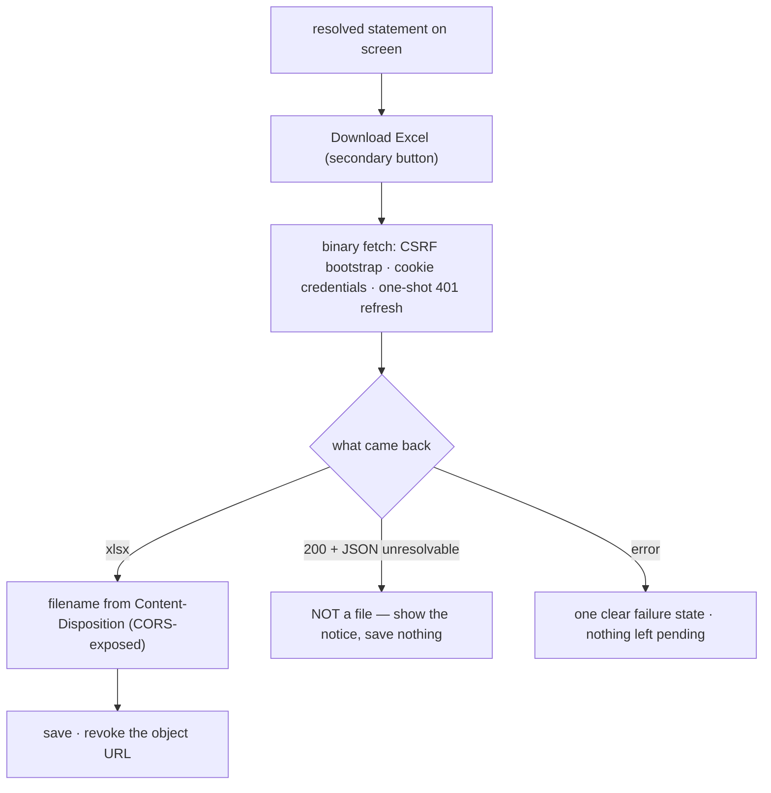

# Cold-read grill — gate: task — task plan statement-export-control

You did NOT write what follows. Read it cold, as an adversary trying to break the handover, never as its author defending it. You are READ-ONLY: return findings, change nothing.

## Interrogation technique

Run the interrogation this way. The harness contract above is the floor; this is the technique.

---
name: grilling
description: Grill the user relentlessly about a plan, decision, or idea. Use when the user wants to stress-test their thinking, or uses any 'grill' trigger phrases.
---

Interview the user relentlessly until you reach a shared understanding. Map this as a **design tree**: every decision branches into the decisions that hang off it.

Work the tree in **rounds**. The **frontier** is every decision whose prerequisites are already settled: the questions you can ask _now_ without guessing at answers you haven't heard yet. Ask the whole frontier in one round: number each question and give your recommended answer. Then wait for the user's answers before the next round.

Format a round like so:

```
❓ **Q1** - **<question title>**: <question body, might be multiple paragraphs, including multiple choices>

➡️ <your recommended answer>

---

❓ **Q2** - **<question title>**: <question body, might be multiple paragraphs, including multiple choices>

➡️ <your recommended answer>
```

Each round the user answers reshapes the tree: settled decisions push the frontier outward and unblock questions that depended on them. Recompute the frontier and ask the next round. A question whose answer depends on another question still open in this round belongs to a _later_ round, not this one.

Finding _facts_ is your job, never the user's. When a frontier question needs a fact from the environment (filesystem, tools, etc.), dispatch a sub-agent to find it; don't ask the user for anything you could look up yourself. Don't block on it: a running exploration is an unsettled prerequisite, so only the questions downstream of it wait for the sub-agent to report; ask the rest of the frontier now. The _decisions_ are the user's: put each to them and wait.

The session is done when the frontier is empty: every branch of the design tree visited, nothing left silently assumed. Do not act on it until the user confirms you have reached a shared understanding.


## Harness grill contract

# Griller Prompt — adversarial handover interrogation

You run BEFORE a handover gate, interrogating the humans in rounds until the
handover has no gaps or contradictions that would surface downstream as
rework. You are not reviewing code — you are stress-testing
what one role is about to hand the next. The gate scripts REFUSE without
your fresh, passing record.

**Independence is the whole point.** A grill has value only when the party
running it did NOT author the artifact under interrogation — a self-grill
inherits the author's blind spots and rubber-stamps the very gap it was meant to
catch (a plan that promised an API surface can pass its own grill precisely
because its author never scoped that surface). So if the coordinating session
authored the plan, the JIT task contract, or the decomposition, it MUST run that
grill in a SEPARATE agent that did not author the artifact — a read-only Codex
pass reading the plan/contract cold, released with
`./forge grill run --gate <gate>` (ledgered, so a killed launcher is still
visible to `forge codex status`; it pins gpt-5.6-terra @ xhigh from
harness.yaml) — rather than certify its own work inline. Codex on `gpt-5.6-terra` @ xhigh
is the required cold reader for planning grills: a fresh model context fully
independent of the authoring session, and because it is read-only it never
writes, so the write-lock that gates the write companion does not apply. Do NOT
use a Claude sub-agent for the grill, and never grill your own work inline.
Interrogate as an adversary trying to break the handover, never as its author
defending it.

RELEASE IT THROUGH THE HARNESS. `./forge grill run --gate <gate>` composes the cold-read brief (this contract plus the artifact) and releases Codex through the SAME ledgered launcher a delegation uses: the pid is recorded before the wait, so a grill whose launcher is killed still shows up in `forge codex status` instead of vanishing. It is read-only, so it takes no delegation lock and can never satisfy `stage done`. Recording the gate stays yours — the cold read only returns findings.

The technique is Matt Pocock's `grilling` skill — the design tree, the
frontier, numbered questions with recommended answers. `doctor --fix` installs
it into BOTH runtimes, and `./forge grill run` also inlines it into the brief,
so a reader reaches it whether or not its runtime resolves skills. This
contract is the harness-side floor; `grilling` is the technique.

`grill-me` is the HUMAN entry point — you type `/grill-me` and it redirects to
`grilling`. It carries `disable-model-invocation: true`, so no model invokes it
and none should be told to.

WHICH RUNTIME CAN RECORD WHICH GATE — get this wrong and you will chase a
refusal you cannot satisfy. ALL SIX gates match the AskUserQuestion ledger and
are therefore CLAUDE-ONLY, each with a floor of ONE logged round: `--gate spec`,
`--gate signoff`, `--gate epics`, `--gate requirements`, `--gate plan` and
`--gate task` — the floors live in `grill_gates.GATES`, one row per gate.
`signoff` and `epics` used to sit outside that check and so recorded with ZERO
rounds behind them; they now answer to it like every other gate.

ONE round is a FLOOR, never a target. Keep going until a round comes back clean
AND the next one stays clean — a single quiet round after a noisy one is a
coincidence, not convergence. The ledger files are written ONLY by `post_tool_use.py` on a
Claude Code AskUserQuestion event; `.codex/hooks.json` registers no PostToolUse
hook, so Codex cannot produce them and neither can a subagent. Delegating a
ledger-matched grill to Codex returns a well-formed payload that the recorder
then refuses, with nothing you can do to satisfy it — the payload was never the
problem, the runtime was.

For those four ledger-matched gates, independence is a COLD READ,
not necessarily a separate process. The recorder accepts ONLY rounds that match a
logged AskUserQuestion record (`record_grill_from_json.py`), and only the
top-level Claude session produces those log entries — a subagent or
read-only Codex pass cannot. So for those grills the top-level session drives
the rounds through AskUserQuestion itself — but because the coordinating session
authored the plan, the independent cold-read pass is MANDATORY, not optional: on
EVERY round release a fresh READ-ONLY Codex pass with
`./forge grill run --gate <gate> [--task <id>]` that reads the plan/contract
cold and returns findings — never a
Claude sub-agent, never grill your own work inline — then carry ALL of those
findings into your own AskUserQuestion rounds (the recorder rejects rounds not in
the ledger, so the top-level session must still ask). Read cold, as an adversary
who did not write it.

ONE COLD READ PER GATE — put every question to the human INSIDE it. The old
shape was Codex grill → your rounds → amend → Codex grill AGAIN, looping until
clean. That loop cannot converge: a fresh reader has no memory of what the last
one found, so it returns a DIFFERENT frontier rather than a shorter one, and the
artifact you amended to close round one becomes round two's input. Stories
reached eleven, twenty-six and forty rounds that way; the last cost six hours.
`forge grill run` now REFUSES a second unconstrained read on a gate that has
already been read since its last recorded pass.

So the WHOLE grill is:

1. `./forge grill run --gate <gate>` — one cold read. WATCH it.
2. Clean? Record the pass and approve. Nothing else happens.
3. Otherwise resolve every finding the REPOSITORY answers yourself — open the
   file and settle it. Take to the human only what the repository cannot
   answer: a decision nobody has made, a priority, a tradeoff between two
   workable shapes. Put those through AskUserQuestion with your recommended
   answer first, all of them, now. There is no later round to save the hard
   ones for, and a finding is not a menu.
4. Amend the artifact ONCE, to what they decided.
5. Record the pass against the AMENDED version, then approve exactly once.

The price is stated plainly, twice over: nothing independent re-reads the
amended version, and a gap this reader misses is not caught by a second reader
at this gate. Both surface at the next gate, or in review. That is the trade
for ending a loop that was costing whole days.

If the human's answers changed the artifact's SHAPE — a component dropped, a
different approach chosen — the amended artifact is not the one that was read
in any useful sense. Say so and read again: `./forge grill run --gate <gate>
--reread "<what changed shape>"`. It is a choice with a recorded reason, not a
way around the rule, and the five-read cap still backstops it. (EVERY gate is ledger-matched — signoff and epics no
longer excepted — so no gate can be recorded by a read-only Codex grill alone:
the top-level session asks the round and records it.)

FRESH CONTEXT, AND THE ANSWERS SO FAR. Every round is a NEW read-only Codex
session — that independence is the whole point. But a reader that knows nothing
of the earlier rounds does not re-find the same gaps, it finds DIFFERENT ones,
so the rounds never shrink and the grill has no natural end. `./forge grill run`
therefore carries every question already put to the human and the answer they
chose, read from the ledger the recorder validates against.

That gives the reader two obligations: do not re-raise settled questions, and
CHECK EACH ANSWER — that the artifact honours it, and that it contradicts no
other answer, accepted decision or constitution rule. An answer can be wrong, or
right and never applied; saying so is part of the read.

Do NOT tell the reader where to concentrate. A cold read is worth having because
it is unconstrained, and steering it toward the diff is how the thing nobody
looked at survives every round. More information, no direction.

END EVERY ROUND WITH AN EXPLICIT CONVERGENCE VERDICT, on its own line, so the
coordinator never has to guess whether to grill again or approve:

- `CONVERGED — no gaps, no contradictions, plan unchanged since the last round`
- `NOT CONVERGED — <the specific reason: open gaps, a contradiction, or the plan
  changed after the last clean round>`

`CONVERGED` on the cold read means there is nothing to amend: record and
approve. `NOT CONVERGED` does NOT mean read again — it means resolve what the
repository answers, put the rest to the human, amend once, and record the pass
against the amended version. Approval happens exactly once.

Five gates, five scopes:

- `--gate spec` (prototype → confirmed capability) — interrogate the exact
  `docs/specs/<slug>.md` file against BRIEF, architecture, decisions, and the
  prototype. Hunt: behavior the prototype proved but the spec omitted,
  implementation choices masquerading as requirements, vague acceptance
  language, and conflicts with active decisions.
- `--gate signoff` (client → PM, before `record_signoff.py`) — interrogate
  `docs/product/DISCOVERY.md`, `BRIEF.md`, confirmed specs, the spec-linked
  roadmap, `docs/decisions/`, and prototype notes. Hunt: unanswered
  stakeholder/constraint questions, scope
  the client saw vs. scope the BRIEF claims, decisions that contradict the
  BRIEF, acceptance criteria that are vibes instead of checks, non-functional
  requirements nobody asked about (auth, data retention, environments).
- `--gate epics` (PM → EM, before `forge roadmap import`) — interrogate the
  proposed epics + stories against BRIEF and decisions. Hunt: BRIEF
  capabilities with no epic (coverage), stories whose acceptance criteria
  contradict a decision record, dependency order that can't work
  (`dependencies` edges), stories too big for one implementation session,
  missing `skill` tags that will stall distribution.
- `--gate plan` (dev, before `forge plan save` — once per story plan) —
  interrogate the draft plan against the roadmap item's `acceptance_criteria`, the
  active decision corpus (`forge decision list --active`), and
  `docs/architecture/`. Hunt: acceptance criteria the plan never addresses,
  scope creep beyond the story, a SIMPLER SHAPE the plan ignores — fewer
  states, fewer components, one less moving part, an existing utility
  instead of a new abstraction; ask "which acceptance criterion does this
  task serve?" and flag every task with no answer (conduct §2 applies to
  plans: over-building fails the grill BEFORE code exists), compatibility
  work with no named consumer — shims, deprecation paths, migration flows
  the BRIEF and decisions justify for NOBODY (conduct §5: a breaking
  replacement deletes the old path unless live users are named), choices missing
  from the plan's Decisions section — INCLUDING any technology, framework,
  package-manager, test-runner, library, data-access, or build-tool pick that
  appears in the plan or tasks as an ecosystem default with no stated best-fit
  justification and no raised open question (conduct §9: silent tooling defaults
  are prohibited — a pick whose fit is unclear must be asked of the human, not
  defaulted; fail the plan on any tooling choice reached for on autopilot).
  Also flag a MISSING quality-gate baseline: any codebase the plan touches must
  wire a stack-APPROPRIATE static-analysis gate — a linter AND formatter, plus a
  type-checker where the language has one — into CI/verify, not merely a test
  runner. Name the CAPABILITY, never a fixed tool: ESLint/Biome for JS-TS,
  Ruff/flake8 for Python, golangci-lint for Go, Clippy for Rust, Checkstyle/
  Spotbugs for Java, and so on — the requirement is generic to every backend, not
  one ecosystem's tool. Fail the plan when code ships with no configured lint/
  format/static-analysis gate that an automated check enforces on every push; an
  absent linter is a silent quality default exactly like an unjustified tool pick.
  Also hold the plan against the CONSTITUTION's coding standards
  (`constitution/README.md` index — read the references it maps to the plan's
  surfaces). The constitution is law, so a plan whose SHAPE omits or contradicts a
  mandated standard is a GAP, not a style preference: HTTP surfaces with no typed
  request AND response DTOs (`pnp-api-standards`, `pnp-swagger-api-documentation-
  standards`), a module ignoring the modular-monolith layout or file-suffix
  standards (`pnp-coding-standards-modular-monolith`, `03`), missing structured
  logging (`05`/`06`) or domain exception handling (`07`), an external integration
  that skips the provider/port pattern (`08`, `pnp-provider-pattern-for-
  integration`), or database work ignoring `pnp-database-standards`. Flag each and
  require the plan to conform or record a deliberate, written deviation — never
  wave it through as "the implementer will follow standards later"; a plan must not
  design AGAINST the law. (`constitution/` is on disk in every environment, so the
  read-only Codex cold-read has the law available — hold the plan to it.)
  Reconcile the plan explicitly against
  EVERY ID from `forge decision list --active`; a conflict becomes a
  contradiction signal or a superseding decision, never a silent exception.
  Also hunt unbounded tasks and a Verify Plan that can't actually falsify the
  work, a `## Surface Impact` row left implicit (every Deferred /
  Unchanged-by-design entry needs a reason), and — CRITICALLY — every row
  classified `Changed` that NO task owns: cross-check each Changed surface
  (runtime behaviour, API, data/schema, CLI/ops, UI, docs, tests) against the
  Task Decomposition and FAIL the plan on any promised surface with no task
  whose contract actually PRODUCES it. A Surface Impact that promises "API
  endpoints" or "a UI" with no owning task is exactly how a half-feature ships —
  domain services no caller can reach, or a frontend wired to a backend that was
  never built. Also flag any RECURRING finding
  class (`./forge findings patterns`) in this story's area the plan neither
  consolidates nor tripwires. In Claude Code the
  `/grill-me` skill run against the plan satisfies this contract. The payload
  carries `"issue"`; the recorder stamps it against the active task.
- `--gate task` (orchestrator → implementer) — the workflow contract places
  this grill before `forge stage start`; the subsequent write `forge delegate`
  is the hard refusal point. Interrogate the next leaf task's just-authored
  contract in the re-recorded decomposition against the approved story plan,
  active decisions, and the actual repository state left by completed prior
  stages. Hunt: assumed files or APIs that prior work did not produce, a
  `write_scope` whose AREAS miss where the work must land or reach into areas
  the task has no business in (scope is directory prefixes plus named new
  files — a missing existing file under a declared prefix, a drifted line
  number or a renamed module is a NON-BLOCKING note, never a blocking finding;
  `stage done` measures the exact paths), acceptance criteria not served by the proposed
  work, a task that OWNS a plan `## Surface Impact` surface but whose
  `write_scope`/`required_tests` do not actually PRODUCE it (owns the API row but
  builds only domain services with no HTTP controllers/DTOs/routes; owns the UI
  row but ships no components) — reachability is part of "done", not a later
  task's problem, required tests that do not prove those criteria, verify commands that
  cannot falsify the change, reviewer focus that misses the risky seam OR that
  re-states shape rules the constitution already sets instead of CITING the
  load-bearing `constitution/` references for the task (the contract points at the
  law, never re-derives or contradicts it), and a
  `user_facing` flag that misclassifies the task — a UI task left `false` (its
  mandatory design skills and design review would be skipped) or a backend task
  marked `true` (forced to attest UI design skills it has no use for).
  This is the JIT task-planning gate from decision 0032, not a repeat of the
  story-level plan grill. Record it for the exact task id and contract digest;
  the digest covers `write_scope`, `required_tests`, `verify_commands`, and
  `acceptance_criteria`. A changed field makes the old task grill stale, and a
  write delegation refuses it; read-only delegation is unaffected.

Method:

1. Read the artifacts in scope FIRST; derive your question list from actual
   text, citing it (`BRIEF.md says X; decision 0003 says Y — which wins?`).
2. Interrogate in ROUNDS until the frontier is empty — not one pass. Each
   round, put the questions whose prerequisites are already settled to the
   human (PM or EM) with your recommended answer; their answers reshape the
   tree and unblock the next round's questions. Stop a single question when it
   would only confirm what a document already states; stop the grill only when
   no gap or contradiction remains unasked. In Claude Code, deliver each
   round's frontier through the AskUserQuestion tool (recommended answer
   first), not prose. For every ledger-matched gate (`spec`, `requirements`,
   `plan`, `task`) the recorder requires
   the FINAL round in the payload to carry `"frontier_empty": true` — that flag
   is how it confirms you stopped because the frontier closed, not because you
   ran out of patience; it is set by hand on the last `rounds` entry, never by
   the ledger. A zero-gap contract still needs at least one such round (every
   gate's floor is 1, and a floor is not a target), so ask a genuine closing
   question
   (e.g. "any remaining gap before we hand off?") and mark it `frontier_empty`.
3. Every finding lands somewhere real before the verdict: a doc edit, a
   `./forge decision new <slug>` record, or an explicit non-blocking entry
   in `open_items`. An `open_items` entry that PARKS scope also gets a
   deferral row with a revisit trigger (`./forge defer add`) — parked scope
   without a trigger is scope silently dropped. Unresolved blocking
   findings ⇒ verdict `blocked`.
4. Record the outcome (schema: `factory/schemas/grill.json`,
   `"generated_by": "griller"`):

   A task-grill input uses this recorded shape (the recorder adds its own
   task id, digests, commit, and timestamps):

```json
{
  "generated_by": "griller",
  "verdict": "pass",
  "gaps": [],
  "contradictions": [],
  "resolutions": ["What was sanctioned"],
  "inspected_refs": ["path/or/path:symbol"],
  "current_flow": "What the repository does now",
  "criteria_map": {"criterion": "proof"},
  "decision": "keep",
  "new_abstractions": ["None"],
  "rounds": [{"question": "Finding or choice", "options": ["Recommended", "Alternative"], "chosen": "Recommended", "frontier_empty": true}],
  "citations": [{"finding": "Repo-answerable finding", "source": "path:symbol"}],
  "open_items": []
}
```

   Each `rounds` entry has a non-empty `question`, two to four non-empty
   string `options`, and a `chosen` value equal to one option. Each citation
   is `{finding, source}`. Every string in `gaps` must be covered by an equal
   `rounds[].question` or `citations[].finding`.

   For every gate — all six are ledger-matched — extra recorder rules bind
   (this is what makes an otherwise well-formed payload fail):
   - Rounds must match the AskUserQuestion ledger and meet the gate floor
     (1 for every gate, and a floor is not a target); the final round carries
     `"frontier_empty": true`. A
     zero-gap grill still records its floor of real rounds — never zero.
   - `--gate task` only: `criteria_map` is a THREE-WAY equality — its KEYS must
     equal the frontier task's `acceptance_criteria` set AND the set of its
     `plan_contracts[].statement` values, exactly (no extra key, none missing);
     each value is the non-empty proof for that criterion. Author the task's
     `acceptance_criteria` and its `plan_contracts` statements as the SAME
     strings so there is one coherent key set to satisfy.

```bash
python3 factory/scripts/record_grill_from_json.py --gate <spec|signoff|epics|requirements|plan|task> --input <json> [--input-digest <artifact>] [--task <id>]
```

5. For every gate except task, commit the resolution edits
   BEFORE recording the grill — those gates check freshness against BOTH
   committed history and the working tree: any guarded doc changing after the
   grill (even uncommitted) stales it. (The sign-off / epics-approved decision
   records themselves are expected afterwards and don't stale it.) The task
   gate instead binds directly to the re-recorded task contract digest; the JIT
   sequence does not require a commit between re-recording and grilling. But that
   digest still folds in the product tree, so record the task grill LAST — after
   any docs/ or factory/scripts commits: a tracked change outside .factory/ and
   plans/ that lands between grilling and `task approve`/`stage start` re-stales
   it and forces a re-grill.
6. `--input-digest` is REQUIRED for the spec, epics, and plan gates: pass the
   exact spec / roadmap input / plan draft you interrogated. The gate verifies the
   digest — grilling version A never approves an edited version B; if the
   artifact changes, re-grill it. For `--gate task`, pass `--task <id>` and NO
   `--task-digest` — that flag was removed and the recorder rejects it; the
   recorder derives the grounding digest itself from the protected contract,
   approved plan, and product tree, and stores the result at
   `.factory/grills/tasks/<id>.json`.

A `pass` with unresolved findings is refused by the recorder. Grill hard;
downstream implementation inherits whatever you let through.


## Lessons already in force for these paths

The plan must design AROUND these. A plan that ignores one is not merely unlucky later — it is wrong now, and saying so is part of this read.

- A warehouse DATE column read through pg and JSON-serialized arrives at the browser as an IST-shifted UTC timestamp (2026-07-01 becomes 2026-06-30T18:30:00.000Z), so a user-facing table shows the WRONG MONTH. Normalize month/date cells to a date-only YYYY-MM-DD string on the server before they enter a result row, and format them for display on the client.
- The governed-financial percentage measure deliberately returns LABELS ('over-budget', 'credit / negative actual') when the budget is zero, so a renderer that pushes every numeric/percent cell through Number() turns the designed semantics into NaN. A cell formatter must render a non-numeric measure value verbatim.
- Measured against docs/design/3F-Financial-MIS/3F Financial MIS.dc.html, the live MIS Reports filter row drifts from the prototype in four ways: (1) the Generate button uses the shared shell Button's font-h2 (16px) and rounded-md (10px) beside 13px/6px selects, where the prototype's filter-bar Generate is 12.5px type on a 6px radius at the same 34px height; (2) the four filter labels render at 13px ink instead of the prototype's 11px --kl-slate, so a label reads as loudly as its value; (3) the empty state is a single sentence, dropping the prototype's 44px ruled icon block, its 19px deep-forest title and its 13px slate supporting line ('Actuals are read from SAP for the selected period. Nothing is written back - this report is read-only.'); (4) the prototype hides the native select arrow with appearance:none. A filter row and its action button are ONE control group - match their height, radius and type size to each other and to the prototype, and keep .eyebrow at 10px/.22em mono.
- RULING (settles the autoreview P1 and signals S-0021/S-0023): the bucket list must emit ONE row per unmapped GL CODE, never one per master bucket ENTRY, because GL/month is the grain of the only amounts that exist - do NOT add a warehouse query path and do NOT touch sqlBuilder.ts or selectionExecutor.ts to recover triple grain. Fold the master's bucket entries by gl_code in mis-selection.service.ts: costCentre keeps the single cost centre when that GL has exactly one bucket entry and is null when it has several (a GL booked across cost centres is no longer a triple, just as a Budget-only GL is not); provisional is true if any folded entry is provisional; reason names each folded entry's cost centre and reason so the list still says WHICH cost centre is wrong; actual and budget are that GL's totals assigned EXACTLY ONCE. This keeps the settled decision (both an Actual and a Budget amount per row, costCentre null where there is no single cost centre), keeps the gap visible rather than absorbed (decision 0018 as amended), and makes the list reconcilable against the slice totals because no amount is ever copied onto two rows. Acceptance criterion 3's word 'triples' means the reviewable identity of the gap, not one row per cost centre. Prove it in mis-selection.controller.test.ts with a master where ONE GL carries TWO bucket entries: expect a single row, costCentre null, and the GL total counted once.
- RULING (settles the autoreview P2/performance blocker at frontend/src/features/mis/mis-report-view.tsx:233): after folding the bucket to GL grain, costCentre === null means THREE different things - a Budget-only GL, a GL absent from the mapping master but carrying real Actual spend, and a GL whose master entries span several cost centres - so any UI label inferred from null (today 'Budget only') mislabels two of the three. FIX IN THE CONTRACT, not the renderer: replace MisSelectionBucketRow.costCentre (string | null) with costCentres: string[] - the master's cost centres for that GL, empty when the master names none. mis-selection.service.ts populates it (one entry when a single bucket entry, several when folded, empty for a Budget-only or master-absent GL) and the view renders exactly what it is given: the single name when there is one, 'N cost centres' when there are several (the reason line already names each), and 'No cost centre in master' when there are none. Never infer a row's kind from an absent field. Update mis-selection.controller.test.ts and mis-report-view.test.tsx accordingly, including the multi-cost-centre case with nonzero Actual.
- TWO fixes. (1) BLOCKING - dead API surface: the page now imports useMisStatement (mis-report-view.tsx:7,11), so use-mis-selection.ts and the runMisSelection client method it wraps are orphaned, still exposing the replaced /api/mis/run flow. Remove the client method and the dead hook, and drop their now-pointless api.test.ts case. Leave the BACKEND route alone - /api/mis/run is mis-selection's shipped contract and drill-down may consume it; this is about the frontend's dead entry point only. Note use-mis-selection.ts also wrapped the options query, so move nothing: useMisStatement already provides options. (2) P2, and it was observed live during the functional check: when the first statement request rejects, mis-report-view.tsx:71 renders the 'could not be generated' error AND the 'Select Department, Function and Plant, then Generate' empty state together, because run.data is absent and isPending is false. A failure and an invitation to start are contradictory on screen - render the error state INSTEAD of the empty state, per constitution/07-exception-handling.md's one-clear-state rule.
- frontend/src/features/mis/use-mis-selection.ts is the sole caller of the orphaned runMisSelection client method - the page now uses useMisStatement - so it is AUTHORIZED in scope for statement-view and must be DELETED together with the method and its api.test.ts case; removing the method alone will not compile. Do not touch the backend /api/mis/run route: it is mis-selection's shipped contract and drill-down may consume it. This is the frontend's dead entry point only.
- BLOCKING (contract verdict t-sv-c3). formatBlockHeading in statement-view.tsx:161 branches on the block KEY - treating anything keyed 'selected' as a single month and formatting only its 'to'. That breaks the exact degenerate case the human ruled on: when the selected period IS the FY-YTD, the route returns ONE block keyed 'selected' whose from/to span April to July, and the view heads four months as 'July 2026'. Derive the heading from the RANGE, as the criterion says: when from and to fall in the same month, 'July 2026'; when they span months, 'FY 26-27 (YTD to <last month>)'. The block key says which slot it is, not what period it covers. Extend the single-block required leaf to assert the heading of that deduped block, not just that one block renders - the existing leaf passed while the heading was wrong, which is why this reached review.

## The contract as recorded (authoritative over any copy in the plan)

## Contract (recorded)

Rendered by the harness from the recorded decomposition; edit the decomposition, not this block. It is excluded from the plan's approval and grill digests, so a re-render never stales either.

**Objective.** Give the statement a Download Excel control in the prototype's secondary-button treatment, which surfaces a failure legibly and never leaves the page pending. Frontend only.

**Acceptance criteria**

- A Download Excel control sits beside the statement in the imported prototype's SECONDARY treatment - white ground, emerald border and text, sharing the Generate button's height and radius - shown only when a resolved statement is on screen, since there is nothing to export otherwise.
- Pressing it fetches the workbook through a BINARY client path that keeps the existing cookie credentials, CSRF bootstrap and one-shot 401 refresh, then saves it using the filename the server sent in Content-Disposition - which main.ts exposes through CORS - falling back to the canonical name if the header is absent. The existing post<T> helper parses JSON and cannot carry bytes, so this is a new helper rather than a reuse.
- The 200-with-JSON unresolvable outcome is NOT saved as a file: the control inspects what came back before treating it as a workbook, so a corrupt .xlsx can never reach the user's disk.
- A failure surfaces as ONE clear state - never a silent no-op, which is worse than an error because the person believes they have the file - and leaves neither the control nor the statement stuck pending.

**Write scope** (what `stage done` measures the diff against)

- frontend/src/features/mis/statement-view.tsx
- frontend/src/features/mis/statement-view.test.tsx
- frontend/src/features/mis/use-mis-statement.ts
- frontend/src/lib/api.ts
- frontend/src/lib/api.test.ts
- frontend/app/globals.css

**Required tests** (run by `stage done`)

- `the download control appears only with a resolved statement and requests the workbook with the csrf header and cookie credentials` -- `npm exec --no -- vitest run --config frontend/vitest.config.ts {path} -t {id} --reporter=junit --outputFile={report}` (frontend/src/features/mis/statement-view.test.tsx)
- `the saved filename comes from the content disposition header and falls back to the canonical name when the header is absent` -- `npm exec --no -- vitest run --config frontend/vitest.config.ts {path} -t {id} --reporter=junit --outputFile={report}` (frontend/src/lib/api.test.ts)
- `a json unresolvable response is not saved as a workbook` -- `npm exec --no -- vitest run --config frontend/vitest.config.ts {path} -t {id} --reporter=junit --outputFile={report}` (frontend/src/features/mis/statement-view.test.tsx)
- `a failed download surfaces one clear error state and leaves neither the control nor the statement pending` -- `npm exec --no -- vitest run --config frontend/vitest.config.ts {path} -t {id} --reporter=junit --outputFile={report}` (frontend/src/features/mis/statement-view.test.tsx)

**Verify commands**

- `npm run typecheck`
- `npm run lint`
- `npm run format:check`
- `npm run test:frontend`
- `npm run build:frontend`

**Review budget.** 6 files / 800 lines -- One control and its failure state on an existing view, plus a binary fetch helper on the api client that the JSON-only post<T> cannot provide. Small by construction: the workbook itself is statement-export-api's, already shipped.

## Already answered on this story — verify, do not re-ask

These questions were put to the human and answered. Two obligations:

1. Do NOT raise them again as open questions. They are settled.
2. DO check each answer still holds — that the artifact actually honours it, and that it does not contradict another answer, an accepted decision, or the constitution. An answer can be wrong, or right and never applied. Saying so is part of this read.

- Q: Where should the 3F app be built, given we're adapting Pulse?
  A: Build in this 3oilpalm repo
- Q: Financial MIS statement — period columns for the PoC?
  A: July + FY 26-27 YTD
- Q: Financial MIS statement — Excel export fidelity?
  A: Clean structured export
- Q: Financial MIS statement — reconciliation / demo-ready bar?
  A: SAP totals = demo-ready; filled month = validated
- Q: SAP ingestion — how does data get in for the PoC?
  A: Excel upload now (SAP export/API later)
- Q: SAP ingestion — how are budgets brought in?
  A: Ingest budgets from the MIS format, as a separate object
- Q: SAP ingestion — grain & raw retention?
  A: Monthly gold + retain raw transaction lines
- Q: SAP ingestion — re-loading a period?
  A: Idempotent replace per period
- Q: Governed joins — how to handle rows in one object but not the other (Budget with no Actual, or Actual with no Budget)?
  A: Full-outer, zero-fill the missing side
- Q: Governed joins — where are 3F financial measures authored?
  A: In code (repo domain files)
- Q: Governed joins — RBAC on a joined query?
  A: Inject scope on both objects
- Q: Governed joins — correctness gate?
  A: Golden-answer fixtures required
- Q: Mapping master — Srihari's Master Table definition is still outstanding. How do we proceed?
  A: Build a provisional master now, reconcile later
- Q: Mapping master — how is it edited in the PoC?
  A: Seed / config file for the PoC (admin UI later)
- Q: Mapping master — selection with no mapping entries?
  A: Empty statement (zeros) + 'no mapping configured' notice
- Q: Drill-down — levels for the PoC?
  A: 2-level now (group → sub-lines → transactions), confirm with Srihari
- Q: Drill-down — showing individual transactions vs Pulse's aggregate suppression?
  A: Show individual lines within the user's RBAC scope, audited
- Q: Drill-down — line-item columns?
  A: Month, Debit, Credit, Value + reference, memo, posting date
- Q: Assistant/exploration — in the first PoC release, or a fast-follow?
  A: Include in the first PoC release
- Q: Assistant — LLM & data residency?
  A: Decide later
- Q: Platform base — how do we bring Pulse's code in?
  A: Snapshot-copy into the repo (own it)
- Q: Platform base — warehouse engine for the PoC?
  A: Postgres for the PoC
- Q: Platform base — auth for the PoC?
  A: Keep Pulse's email+OTP passwordless auth
- Q: Sign-off gate — how do we unlock the build?
  A: Record an internal go-ahead now
- Q: The statement's row hierarchy comes from the budget workbook's own outline, which has UNEVEN depth: most sections are two levels (e.g. '4 Materials Primary Nursery' → '4.1 Shade Net', GL 50001601), but 'Admin Expenses' is three ('9' → '9.01 Vehicle Maintenance', GL 55010900 → 'Petrol and Diesel Charges', GL 55010901). Actuals attach at the GL leaf and parent values are derived by rolling up, never read (decision 0020). How deep should the statement render?
  A: Mirror the workbook outline (Recommended)
- Q: Which identity columns should each statement row carry, on screen and in the Excel export? The legacy workbook's Table-2 carries a serial number, the Budget Component name, a GL code, a Roll-over Budget column and a Payment Office column. The measures themselves are settled (Budget · Roll-over · Actual · %, for the selected month and FY 26-27 YTD).
  A: S.No + Component + GL, Roll-over blank (Recommended)
- Q: My draft put the outline on the budget leaf rows (a parent_key column). The grill showed that breaks: mis_budget stores ONLY leaves, so parent_key would point at a parent node that is never persisted — and the leaf's own lineId is the sheet ROW NUMBER, so any reissued or reordered workbook silently repoints every mapping. Decision 0020 also assumed one parent level, but Admin Expenses has two. How should the statement's hierarchy be stored?
  A: Outline snapshot + stable leaf key (Recommended)
- Q: My draft said the statement would change the governed roll-up's grouping key from gl_code to 'governed line', and claimed decisions 0016/0017 were unchanged. The grill calls that wrong: the shipped selection route, the semantic domain and the future drill-down all deliberately read GL-month rows, so mutating that relation risks breaking them. How should the statement get its numbers?
  A: Separate statement projection (Recommended)
- Q: Task 1 adds a drift check: when a budget workbook is re-uploaded, the parser compares its outline's leaf keys against the ones the Mapping Master targets. If Srihari renames or renumbers a line, its key changes and a master entry now points at nothing — which, unchecked, silently splits one statement line into a budget-only row and an actual-only row. The check itself is settled; what it should DO is not. What should happen to that upload?
  A: Ingest succeeds, drift reported (Recommended)
- Q: The delegate launch for statement-model was declined. The only discretionary choice in it was raising Codex from the harness floor (gpt-5.6-sol @ medium) to high effort. How should I launch it?
  A: High effort (Recommended)
- Q: The statement shows two period blocks side by side: the selected month and FY 26-27 YTD. But the period selector also offers 'FY 26-27 YTD' as a choice — and if someone picks it, both blocks are the same range, so the statement shows every number twice under two different headings. What should it do then?
  A: Show a single YTD block (Recommended)
- Q: The grill found the statement has no way to receive the selection: the four selectors (Department/Function/Plant/period) live only in the MIS Reports page's local state, and the statement route needs all four. So where should the statement actually live?
  A: Inline, below the selector (Recommended)
- Q: The grill found a contradiction in my export plan about the numbers in the spreadsheet. The spec says amounts are 'rounded to the rupee' for display, and the screen shows ₹1,00,50,136. But the underlying payload carries exact paise (10050136.29). Someone reconciling the sheet against SAP would want the paise; someone checking it against the screen would want them to match exactly. What should the exported cells contain?
  A: Rounded to the rupee, matching the screen (Recommended)

## The artifact under interrogation (task plan statement-export-control)

# Task plan — statement-export-control: the Download Excel control

Story: mis-statement · Task 5 of 5 (FINAL) · **user_facing: true**

## Objective
Give the statement a **Download Excel** control. The route and the workbook already ship
(`statement-export-api`, PR #35); this task is the button, the binary fetch that carries
it, and the one clear thing that happens when it fails.

Shipping it completes the **mis-statement** story.

## Acceptance criteria (plan_contracts)
- **t-sec-c1** — a Download Excel control beside the statement in the prototype's
  **secondary** treatment (white ground, emerald border and text, the Generate button's
  height and radius), shown **only when a resolved statement is on screen**.
- **t-sec-c2** — pressing it fetches the workbook through a **binary** client path that
  keeps the cookie credentials, CSRF bootstrap and one-shot 401 refresh, and saves it
  under the filename the **server** sent in `Content-Disposition`, falling back to the
  canonical name if absent.
- **t-sec-c3** — the **200-with-JSON** unresolvable outcome is **not saved as a file**.
- **t-sec-c4** — a failure surfaces as **one clear state**, never a silent no-op, and
  leaves neither the control nor the statement stuck pending.

## Mandatory for a user-facing task
`harness.yaml` — the recorder **refuses** a user-facing testing artifact unless
`skills_used` attests both `emil-design-eng` and `frontend-design`; both are inlined into
the composed brief. A **functional check** is also required — and for a download, that
means **actually downloading a file and opening it**, not watching a button change colour.

## What already exists (grounding, file:line)
- **The route, shipped** — `backend/src/mis/mis-statement.controller.ts:73-124`:
  `POST api/mis/statement/export` sets `Content-Type` to the xlsx MIME type and
  `Content-Disposition: attachment; filename="…"`, and returns **200 `application/json`**
  for an unresolvable selection with **no file headers**.
- **CORS already exposes the filename** — `backend/src/main.ts:32`
  `exposedHeaders: ["Content-Disposition"]`. That entry exists *because* this task needs
  it; deriving the filename client-side instead would make it pointless and let the two
  drift.
- **The client cannot currently carry bytes** — `frontend/src/lib/api.ts:30` `post<T>`
  ends in `response.json()`. Its CSRF bootstrap, cookie credentials and **one-shot 401
  refresh** (`:43-44`) are the parts worth keeping; the JSON parse is the part that cannot
  be reused. Hence a binary sibling, not a reuse.
- **The view** — `frontend/src/features/mis/statement-view.tsx` renders the statement
  inline and already distinguishes resolved from unresolvable. This view is also where a
  failure once rendered **alongside** the empty state; `constitution/07-exception-handling.md`'s
  one-clear-state rule is load-bearing here.
- **The prototype's control** — `docs/design/…dc.html:117`: *Download Excel* as a
  **secondary** button beside the primary Generate — white ground, emerald border and
  text, 34px, 6px radius.

## Design
### A binary sibling, not a reuse
`post<T>` parses JSON and cannot carry a workbook. The new helper does everything `post`
does **except** the parse: CSRF bootstrap, `credentials: "include"`, and the one-shot 401
refresh — dropping that last one would silently break the download for anyone whose access
token has just expired, which is the most ordinary case there is.

### Three outcomes, not two
A download has a third case the rest of the app does not:
- **xlsx** → save it under the server's filename;
- **200 + JSON** (unresolvable) → **not a file**; show the notice, save nothing. Saving it
  would put a corrupt `.xlsx` on someone's disk;
- **error** → one clear state.

The control **inspects what came back** before treating it as a workbook.

### The filename comes from the server
`Content-Disposition` is readable only because the route exposes it through CORS. The
control parses the header and falls back to the canonical name only when it is absent —
deriving it client-side would duplicate a grammar the server already owns.

### Housekeeping
An object URL created for a download is **revoked** after use; a page people click
repeatedly should not leak one per click.

## Workflow


## Manual Verification
1. `npm run typecheck && npm run lint && npm run format:check && npm run test:frontend &&
   npm run build:frontend` — the four required leaves pass. Check each leaf's **executed
   count**: vitest exits 0 when `-t` matches nothing (D-0031).
2. **Functional check (mandatory, user_facing)** — a download is only proven by a file:
   sign in, generate Agriculture / Nursery / DUB / Jul 2026, press **Download Excel**,
   then **open the saved file** and confirm it is the real workbook — worksheet
   `Financial MIS`, the hierarchy, and the grand total **₹1,00,50,136** Budget against
   **₹1,15,12,712** Actual — and that the saved filename is the server's, not a
   browser-generated one.
3. Force a failure (stop the backend) and confirm **one** clear state, nothing pending,
   and no file written.

## Decisions attested
**0019** (the route's house style), **0016** (the grant the download inherits), **0018**,
**0020/0021/0022** (the numbers behind the sheet), **0023**, **0007** (Next.js),
**0010** (3F branding), **0031** (a required leaf must really execute), **0002/0003**,
**0012/0015**.

## Surface impact
- **Frontend**: the Download Excel control and its failure state on `statement-view.tsx`,
  the binary export helper on `src/lib/api.ts`, the hook, `app/globals.css`.
- **Unchanged by design**: every backend file (the route and workbook ship in PR #35),
  `contract/src/api.ts`, the theme tokens, the statement's own rendering.

## Out of scope
A transactions sheet (drill-down), the roll-over calculation, any backend change.

## Task Decomposition
Task 5 (FINAL) of the mis-statement story: (1) statement-model [#30], (2) statement-api
[#32], (3) statement-view [#34], (4) statement-export-api [#35],
(5) **statement-export-control** [this task]. Frontend-only by construction — `WORKFLOW.md`
forbids a task spanning backend and frontend, which is why the export was split in two.
Proven by four vitest leaves plus a functional check that opens a really-downloaded file.
Shipping it completes the story.

<!-- forge:contract -->
## Contract (recorded)

Rendered by the harness from the recorded decomposition; edit the decomposition, not this block. It is excluded from the plan's approval and grill digests, so a re-render never stales either.

**Objective.** Give the statement a Download Excel control in the prototype's secondary-button treatment, which surfaces a failure legibly and never leaves the page pending. Frontend only.

**Acceptance criteria**

- A Download Excel control sits beside the statement in the imported prototype's SECONDARY treatment - white ground, emerald border and text, sharing the Generate button's height and radius - shown only when a resolved statement is on screen, since there is nothing to export otherwise.
- Pressing it fetches the workbook through a BINARY client path that keeps the existing cookie credentials, CSRF bootstrap and one-shot 401 refresh, then saves it using the filename the server sent in Content-Disposition - which main.ts exposes through CORS - falling back to the canonical name if the header is absent. The existing post<T> helper parses JSON and cannot carry bytes, so this is a new helper rather than a reuse.
- The 200-with-JSON unresolvable outcome is NOT saved as a file: the control inspects what came back before treating it as a workbook, so a corrupt .xlsx can never reach the user's disk.
- A failure surfaces as ONE clear state - never a silent no-op, which is worse than an error because the person believes they have the file - and leaves neither the control nor the statement stuck pending.

**Write scope** (what `stage done` measures the diff against)

- frontend/src/features/mis/statement-view.tsx
- frontend/src/features/mis/statement-view.test.tsx
- frontend/src/features/mis/use-mis-statement.ts
- frontend/src/lib/api.ts
- frontend/src/lib/api.test.ts
- frontend/app/globals.css

**Required tests** (run by `stage done`)

- `the download control appears only with a resolved statement and requests the workbook with the csrf header and cookie credentials` -- `npm exec --no -- vitest run --config frontend/vitest.config.ts {path} -t {id} --reporter=junit --outputFile={report}` (frontend/src/features/mis/statement-view.test.tsx)
- `the saved filename comes from the content disposition header and falls back to the canonical name when the header is absent` -- `npm exec --no -- vitest run --config frontend/vitest.config.ts {path} -t {id} --reporter=junit --outputFile={report}` (frontend/src/lib/api.test.ts)
- `a json unresolvable response is not saved as a workbook` -- `npm exec --no -- vitest run --config frontend/vitest.config.ts {path} -t {id} --reporter=junit --outputFile={report}` (frontend/src/features/mis/statement-view.test.tsx)
- `a failed download surfaces one clear error state and leaves neither the control nor the statement pending` -- `npm exec --no -- vitest run --config frontend/vitest.config.ts {path} -t {id} --reporter=junit --outputFile={report}` (frontend/src/features/mis/statement-view.test.tsx)

**Verify commands**

- `npm run typecheck`
- `npm run lint`
- `npm run format:check`
- `npm run test:frontend`
- `npm run build:frontend`

**Review budget.** 6 files / 800 lines -- One control and its failure state on an existing view, plus a binary fetch helper on the api client that the JSON-only post<T> cannot provide. Small by construction: the workbook itself is statement-export-api's, already shipped.
<!-- /forge:contract -->


## What to return

Findings only: contradictions, gaps, unstated assumptions, and anything a reader would have to guess. Say what would break and why. Do not record a gate — the coordinating session records it.

The round count below is a FLOOR, not a target. Keep grilling until a round comes back clean AND stays clean on the next one — hitting the floor is not the same as passing.
