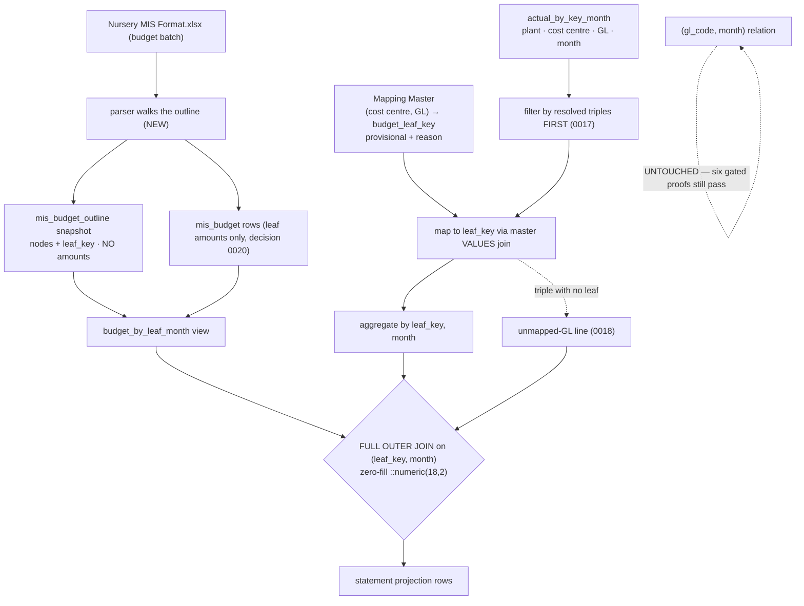

# Cold-read grill — gate: task — task plan statement-model

You did NOT write what follows. Read it cold, as an adversary trying to break the handover, never as its author defending it. You are READ-ONLY: return findings, change nothing.

## Interrogation technique

Run the interrogation this way. The harness contract above is the floor; this is the technique.

---
name: grilling
description: Grill the user relentlessly about a plan, decision, or idea. Use when the user wants to stress-test their thinking, or uses any 'grill' trigger phrases.
---

Interview the user relentlessly until you reach a shared understanding. Map this as a **design tree**: every decision branches into the decisions that hang off it.

Work the tree in **rounds**. The **frontier** is every decision whose prerequisites are already settled: the questions you can ask _now_ without guessing at answers you haven't heard yet. Ask the whole frontier in one round: number each question and give your recommended answer. Then wait for the user's answers before the next round.

Format a round like so:

```
❓ **Q1** - **<question title>**: <question body, might be multiple paragraphs, including multiple choices>

➡️ <your recommended answer>

---

❓ **Q2** - **<question title>**: <question body, might be multiple paragraphs, including multiple choices>

➡️ <your recommended answer>
```

Each round the user answers reshapes the tree: settled decisions push the frontier outward and unblock questions that depended on them. Recompute the frontier and ask the next round. A question whose answer depends on another question still open in this round belongs to a _later_ round, not this one.

Finding _facts_ is your job, never the user's. When a frontier question needs a fact from the environment (filesystem, tools, etc.), dispatch a sub-agent to find it; don't ask the user for anything you could look up yourself. Don't block on it: a running exploration is an unsettled prerequisite, so only the questions downstream of it wait for the sub-agent to report; ask the rest of the frontier now. The _decisions_ are the user's: put each to them and wait.

The session is done when the frontier is empty: every branch of the design tree visited, nothing left silently assumed. Do not act on it until the user confirms you have reached a shared understanding.


## Harness grill contract

# Griller Prompt — adversarial handover interrogation

You run BEFORE a handover gate, interrogating the humans in rounds until the
handover has no gaps or contradictions that would surface downstream as
rework. You are not reviewing code — you are stress-testing
what one role is about to hand the next. The gate scripts REFUSE without
your fresh, passing record.

**Independence is the whole point.** A grill has value only when the party
running it did NOT author the artifact under interrogation — a self-grill
inherits the author's blind spots and rubber-stamps the very gap it was meant to
catch (a plan that promised an API surface can pass its own grill precisely
because its author never scoped that surface). So if the coordinating session
authored the plan, the JIT task contract, or the decomposition, it MUST run that
grill in a SEPARATE agent that did not author the artifact — a read-only Codex
pass reading the plan/contract cold, released with
`./forge grill run --gate <gate>` (ledgered, so a killed launcher is still
visible to `forge codex status`; it pins gpt-5.6-terra @ xhigh from
harness.yaml) — rather than certify its own work inline. Codex on `gpt-5.6-terra` @ xhigh
is the required cold reader for planning grills: a fresh model context fully
independent of the authoring session, and because it is read-only it never
writes, so the write-lock that gates the write companion does not apply. Do NOT
use a Claude sub-agent for the grill, and never grill your own work inline.
Interrogate as an adversary trying to break the handover, never as its author
defending it.

RELEASE IT THROUGH THE HARNESS. `./forge grill run --gate <gate>` composes the cold-read brief (this contract plus the artifact) and releases Codex through the SAME ledgered launcher a delegation uses: the pid is recorded before the wait, so a grill whose launcher is killed still shows up in `forge codex status` instead of vanishing. It is read-only, so it takes no delegation lock and can never satisfy `stage done`. Recording the gate stays yours — the cold read only returns findings.

The technique is Matt Pocock's `grilling` skill — the design tree, the
frontier, numbered questions with recommended answers. `doctor --fix` installs
it into BOTH runtimes, and `./forge grill run` also inlines it into the brief,
so a reader reaches it whether or not its runtime resolves skills. This
contract is the harness-side floor; `grilling` is the technique.

`grill-me` is the HUMAN entry point — you type `/grill-me` and it redirects to
`grilling`. It carries `disable-model-invocation: true`, so no model invokes it
and none should be told to.

WHICH RUNTIME CAN RECORD WHICH GATE — get this wrong and you will chase a
refusal you cannot satisfy. ALL SIX gates match the AskUserQuestion ledger and
are therefore CLAUDE-ONLY, each with a floor of ONE logged round: `--gate spec`,
`--gate signoff`, `--gate epics`, `--gate requirements`, `--gate plan` and
`--gate task` — the floors live in `grill_gates.GATES`, one row per gate.
`signoff` and `epics` used to sit outside that check and so recorded with ZERO
rounds behind them; they now answer to it like every other gate.

ONE round is a FLOOR, never a target. Keep going until a round comes back clean
AND the next one stays clean — a single quiet round after a noisy one is a
coincidence, not convergence. The ledger files are written ONLY by `post_tool_use.py` on a
Claude Code AskUserQuestion event; `.codex/hooks.json` registers no PostToolUse
hook, so Codex cannot produce them and neither can a subagent. Delegating a
ledger-matched grill to Codex returns a well-formed payload that the recorder
then refuses, with nothing you can do to satisfy it — the payload was never the
problem, the runtime was.

For those four ledger-matched gates, independence is a COLD READ,
not necessarily a separate process. The recorder accepts ONLY rounds that match a
logged AskUserQuestion record (`record_grill_from_json.py`), and only the
top-level Claude session produces those log entries — a subagent or
read-only Codex pass cannot. So for those grills the top-level session drives
the rounds through AskUserQuestion itself — but because the coordinating session
authored the plan, the independent cold-read pass is MANDATORY, not optional: on
EVERY round release a fresh READ-ONLY Codex pass with
`./forge grill run --gate <gate> [--task <id>]` that reads the plan/contract
cold and returns findings — never a
Claude sub-agent, never grill your own work inline — then carry ALL of those
findings into your own AskUserQuestion rounds (the recorder rejects rounds not in
the ledger, so the top-level session must still ask). Read cold, as an adversary
who did not write it.

ONE COLD READ PER GATE — put every question to the human INSIDE it. The old
shape was Codex grill → your rounds → amend → Codex grill AGAIN, looping until
clean. That loop cannot converge: a fresh reader has no memory of what the last
one found, so it returns a DIFFERENT frontier rather than a shorter one, and the
artifact you amended to close round one becomes round two's input. Stories
reached eleven, twenty-six and forty rounds that way; the last cost six hours.
`forge grill run` now REFUSES a second unconstrained read on a gate that has
already been read since its last recorded pass.

So the WHOLE grill is:

1. `./forge grill run --gate <gate>` — one cold read. WATCH it.
2. Clean? Record the pass and approve. Nothing else happens.
3. Otherwise resolve every finding the REPOSITORY answers yourself — open the
   file and settle it. Take to the human only what the repository cannot
   answer: a decision nobody has made, a priority, a tradeoff between two
   workable shapes. Put those through AskUserQuestion with your recommended
   answer first, all of them, now. There is no later round to save the hard
   ones for, and a finding is not a menu.
4. Amend the artifact ONCE, to what they decided.
5. Record the pass against the AMENDED version, then approve exactly once.

The price is stated plainly, twice over: nothing independent re-reads the
amended version, and a gap this reader misses is not caught by a second reader
at this gate. Both surface at the next gate, or in review. That is the trade
for ending a loop that was costing whole days.

If the human's answers changed the artifact's SHAPE — a component dropped, a
different approach chosen — the amended artifact is not the one that was read
in any useful sense. Say so and read again: `./forge grill run --gate <gate>
--reread "<what changed shape>"`. It is a choice with a recorded reason, not a
way around the rule, and the five-read cap still backstops it. (EVERY gate is ledger-matched — signoff and epics no
longer excepted — so no gate can be recorded by a read-only Codex grill alone:
the top-level session asks the round and records it.)

FRESH CONTEXT, AND THE ANSWERS SO FAR. Every round is a NEW read-only Codex
session — that independence is the whole point. But a reader that knows nothing
of the earlier rounds does not re-find the same gaps, it finds DIFFERENT ones,
so the rounds never shrink and the grill has no natural end. `./forge grill run`
therefore carries every question already put to the human and the answer they
chose, read from the ledger the recorder validates against.

That gives the reader two obligations: do not re-raise settled questions, and
CHECK EACH ANSWER — that the artifact honours it, and that it contradicts no
other answer, accepted decision or constitution rule. An answer can be wrong, or
right and never applied; saying so is part of the read.

Do NOT tell the reader where to concentrate. A cold read is worth having because
it is unconstrained, and steering it toward the diff is how the thing nobody
looked at survives every round. More information, no direction.

END EVERY ROUND WITH AN EXPLICIT CONVERGENCE VERDICT, on its own line, so the
coordinator never has to guess whether to grill again or approve:

- `CONVERGED — no gaps, no contradictions, plan unchanged since the last round`
- `NOT CONVERGED — <the specific reason: open gaps, a contradiction, or the plan
  changed after the last clean round>`

`CONVERGED` on the cold read means there is nothing to amend: record and
approve. `NOT CONVERGED` does NOT mean read again — it means resolve what the
repository answers, put the rest to the human, amend once, and record the pass
against the amended version. Approval happens exactly once.

Five gates, five scopes:

- `--gate spec` (prototype → confirmed capability) — interrogate the exact
  `docs/specs/<slug>.md` file against BRIEF, architecture, decisions, and the
  prototype. Hunt: behavior the prototype proved but the spec omitted,
  implementation choices masquerading as requirements, vague acceptance
  language, and conflicts with active decisions.
- `--gate signoff` (client → PM, before `record_signoff.py`) — interrogate
  `docs/product/DISCOVERY.md`, `BRIEF.md`, confirmed specs, the spec-linked
  roadmap, `docs/decisions/`, and prototype notes. Hunt: unanswered
  stakeholder/constraint questions, scope
  the client saw vs. scope the BRIEF claims, decisions that contradict the
  BRIEF, acceptance criteria that are vibes instead of checks, non-functional
  requirements nobody asked about (auth, data retention, environments).
- `--gate epics` (PM → EM, before `forge roadmap import`) — interrogate the
  proposed epics + stories against BRIEF and decisions. Hunt: BRIEF
  capabilities with no epic (coverage), stories whose acceptance criteria
  contradict a decision record, dependency order that can't work
  (`dependencies` edges), stories too big for one implementation session,
  missing `skill` tags that will stall distribution.
- `--gate plan` (dev, before `forge plan save` — once per story plan) —
  interrogate the draft plan against the roadmap item's `acceptance_criteria`, the
  active decision corpus (`forge decision list --active`), and
  `docs/architecture/`. Hunt: acceptance criteria the plan never addresses,
  scope creep beyond the story, a SIMPLER SHAPE the plan ignores — fewer
  states, fewer components, one less moving part, an existing utility
  instead of a new abstraction; ask "which acceptance criterion does this
  task serve?" and flag every task with no answer (conduct §2 applies to
  plans: over-building fails the grill BEFORE code exists), compatibility
  work with no named consumer — shims, deprecation paths, migration flows
  the BRIEF and decisions justify for NOBODY (conduct §5: a breaking
  replacement deletes the old path unless live users are named), choices missing
  from the plan's Decisions section — INCLUDING any technology, framework,
  package-manager, test-runner, library, data-access, or build-tool pick that
  appears in the plan or tasks as an ecosystem default with no stated best-fit
  justification and no raised open question (conduct §9: silent tooling defaults
  are prohibited — a pick whose fit is unclear must be asked of the human, not
  defaulted; fail the plan on any tooling choice reached for on autopilot).
  Also flag a MISSING quality-gate baseline: any codebase the plan touches must
  wire a stack-APPROPRIATE static-analysis gate — a linter AND formatter, plus a
  type-checker where the language has one — into CI/verify, not merely a test
  runner. Name the CAPABILITY, never a fixed tool: ESLint/Biome for JS-TS,
  Ruff/flake8 for Python, golangci-lint for Go, Clippy for Rust, Checkstyle/
  Spotbugs for Java, and so on — the requirement is generic to every backend, not
  one ecosystem's tool. Fail the plan when code ships with no configured lint/
  format/static-analysis gate that an automated check enforces on every push; an
  absent linter is a silent quality default exactly like an unjustified tool pick.
  Also hold the plan against the CONSTITUTION's coding standards
  (`constitution/README.md` index — read the references it maps to the plan's
  surfaces). The constitution is law, so a plan whose SHAPE omits or contradicts a
  mandated standard is a GAP, not a style preference: HTTP surfaces with no typed
  request AND response DTOs (`pnp-api-standards`, `pnp-swagger-api-documentation-
  standards`), a module ignoring the modular-monolith layout or file-suffix
  standards (`pnp-coding-standards-modular-monolith`, `03`), missing structured
  logging (`05`/`06`) or domain exception handling (`07`), an external integration
  that skips the provider/port pattern (`08`, `pnp-provider-pattern-for-
  integration`), or database work ignoring `pnp-database-standards`. Flag each and
  require the plan to conform or record a deliberate, written deviation — never
  wave it through as "the implementer will follow standards later"; a plan must not
  design AGAINST the law. (`constitution/` is on disk in every environment, so the
  read-only Codex cold-read has the law available — hold the plan to it.)
  Reconcile the plan explicitly against
  EVERY ID from `forge decision list --active`; a conflict becomes a
  contradiction signal or a superseding decision, never a silent exception.
  Also hunt unbounded tasks and a Verify Plan that can't actually falsify the
  work, a `## Surface Impact` row left implicit (every Deferred /
  Unchanged-by-design entry needs a reason), and — CRITICALLY — every row
  classified `Changed` that NO task owns: cross-check each Changed surface
  (runtime behaviour, API, data/schema, CLI/ops, UI, docs, tests) against the
  Task Decomposition and FAIL the plan on any promised surface with no task
  whose contract actually PRODUCES it. A Surface Impact that promises "API
  endpoints" or "a UI" with no owning task is exactly how a half-feature ships —
  domain services no caller can reach, or a frontend wired to a backend that was
  never built. Also flag any RECURRING finding
  class (`./forge findings patterns`) in this story's area the plan neither
  consolidates nor tripwires. In Claude Code the
  `/grill-me` skill run against the plan satisfies this contract. The payload
  carries `"issue"`; the recorder stamps it against the active task.
- `--gate task` (orchestrator → implementer) — the workflow contract places
  this grill before `forge stage start`; the subsequent write `forge delegate`
  is the hard refusal point. Interrogate the next leaf task's just-authored
  contract in the re-recorded decomposition against the approved story plan,
  active decisions, and the actual repository state left by completed prior
  stages. Hunt: assumed files or APIs that prior work did not produce, a
  `write_scope` whose AREAS miss where the work must land or reach into areas
  the task has no business in (scope is directory prefixes plus named new
  files — a missing existing file under a declared prefix, a drifted line
  number or a renamed module is a NON-BLOCKING note, never a blocking finding;
  `stage done` measures the exact paths), acceptance criteria not served by the proposed
  work, a task that OWNS a plan `## Surface Impact` surface but whose
  `write_scope`/`required_tests` do not actually PRODUCE it (owns the API row but
  builds only domain services with no HTTP controllers/DTOs/routes; owns the UI
  row but ships no components) — reachability is part of "done", not a later
  task's problem, required tests that do not prove those criteria, verify commands that
  cannot falsify the change, reviewer focus that misses the risky seam OR that
  re-states shape rules the constitution already sets instead of CITING the
  load-bearing `constitution/` references for the task (the contract points at the
  law, never re-derives or contradicts it), and a
  `user_facing` flag that misclassifies the task — a UI task left `false` (its
  mandatory design skills and design review would be skipped) or a backend task
  marked `true` (forced to attest UI design skills it has no use for).
  This is the JIT task-planning gate from decision 0032, not a repeat of the
  story-level plan grill. Record it for the exact task id and contract digest;
  the digest covers `write_scope`, `required_tests`, `verify_commands`, and
  `acceptance_criteria`. A changed field makes the old task grill stale, and a
  write delegation refuses it; read-only delegation is unaffected.

Method:

1. Read the artifacts in scope FIRST; derive your question list from actual
   text, citing it (`BRIEF.md says X; decision 0003 says Y — which wins?`).
2. Interrogate in ROUNDS until the frontier is empty — not one pass. Each
   round, put the questions whose prerequisites are already settled to the
   human (PM or EM) with your recommended answer; their answers reshape the
   tree and unblock the next round's questions. Stop a single question when it
   would only confirm what a document already states; stop the grill only when
   no gap or contradiction remains unasked. In Claude Code, deliver each
   round's frontier through the AskUserQuestion tool (recommended answer
   first), not prose. For every ledger-matched gate (`spec`, `requirements`,
   `plan`, `task`) the recorder requires
   the FINAL round in the payload to carry `"frontier_empty": true` — that flag
   is how it confirms you stopped because the frontier closed, not because you
   ran out of patience; it is set by hand on the last `rounds` entry, never by
   the ledger. A zero-gap contract still needs at least one such round (every
   gate's floor is 1, and a floor is not a target), so ask a genuine closing
   question
   (e.g. "any remaining gap before we hand off?") and mark it `frontier_empty`.
3. Every finding lands somewhere real before the verdict: a doc edit, a
   `./forge decision new <slug>` record, or an explicit non-blocking entry
   in `open_items`. An `open_items` entry that PARKS scope also gets a
   deferral row with a revisit trigger (`./forge defer add`) — parked scope
   without a trigger is scope silently dropped. Unresolved blocking
   findings ⇒ verdict `blocked`.
4. Record the outcome (schema: `factory/schemas/grill.json`,
   `"generated_by": "griller"`):

   A task-grill input uses this recorded shape (the recorder adds its own
   task id, digests, commit, and timestamps):

```json
{
  "generated_by": "griller",
  "verdict": "pass",
  "gaps": [],
  "contradictions": [],
  "resolutions": ["What was sanctioned"],
  "inspected_refs": ["path/or/path:symbol"],
  "current_flow": "What the repository does now",
  "criteria_map": {"criterion": "proof"},
  "decision": "keep",
  "new_abstractions": ["None"],
  "rounds": [{"question": "Finding or choice", "options": ["Recommended", "Alternative"], "chosen": "Recommended", "frontier_empty": true}],
  "citations": [{"finding": "Repo-answerable finding", "source": "path:symbol"}],
  "open_items": []
}
```

   Each `rounds` entry has a non-empty `question`, two to four non-empty
   string `options`, and a `chosen` value equal to one option. Each citation
   is `{finding, source}`. Every string in `gaps` must be covered by an equal
   `rounds[].question` or `citations[].finding`.

   For every gate — all six are ledger-matched — extra recorder rules bind
   (this is what makes an otherwise well-formed payload fail):
   - Rounds must match the AskUserQuestion ledger and meet the gate floor
     (1 for every gate, and a floor is not a target); the final round carries
     `"frontier_empty": true`. A
     zero-gap grill still records its floor of real rounds — never zero.
   - `--gate task` only: `criteria_map` is a THREE-WAY equality — its KEYS must
     equal the frontier task's `acceptance_criteria` set AND the set of its
     `plan_contracts[].statement` values, exactly (no extra key, none missing);
     each value is the non-empty proof for that criterion. Author the task's
     `acceptance_criteria` and its `plan_contracts` statements as the SAME
     strings so there is one coherent key set to satisfy.

```bash
python3 factory/scripts/record_grill_from_json.py --gate <spec|signoff|epics|requirements|plan|task> --input <json> [--input-digest <artifact>] [--task <id>]
```

5. For every gate except task, commit the resolution edits
   BEFORE recording the grill — those gates check freshness against BOTH
   committed history and the working tree: any guarded doc changing after the
   grill (even uncommitted) stales it. (The sign-off / epics-approved decision
   records themselves are expected afterwards and don't stale it.) The task
   gate instead binds directly to the re-recorded task contract digest; the JIT
   sequence does not require a commit between re-recording and grilling. But that
   digest still folds in the product tree, so record the task grill LAST — after
   any docs/ or factory/scripts commits: a tracked change outside .factory/ and
   plans/ that lands between grilling and `task approve`/`stage start` re-stales
   it and forces a re-grill.
6. `--input-digest` is REQUIRED for the spec, epics, and plan gates: pass the
   exact spec / roadmap input / plan draft you interrogated. The gate verifies the
   digest — grilling version A never approves an edited version B; if the
   artifact changes, re-grill it. For `--gate task`, pass `--task <id>` and NO
   `--task-digest` — that flag was removed and the recorder rejects it; the
   recorder derives the grounding digest itself from the protected contract,
   approved plan, and product tree, and stores the result at
   `.factory/grills/tasks/<id>.json`.

A `pass` with unresolved findings is refused by the recorder. Grill hard;
downstream implementation inherits whatever you let through.


## Lessons already in force for these paths

The plan must design AROUND these. A plan that ignores one is not merely unlucky later — it is wrong now, and saying so is part of this read.

- A required_tests entry must name a REAL leaf test (id = the string in test("...")), not the file path, and must pin TS_NODE_PROJECT=backend/tsconfig.json because forge runs it from repo root; otherwise junit-run's --test-name-pattern matches nothing and ts-node skips the workspace tsconfig, so the gate reports pass without running assertions. Always verify with a negative control (a required test whose negative control cannot fail is not proof).
- Enforce at the DB level (a trigger, like the immutability trigger) that sap_transaction.month equals its ingest_batch.period and mis_budget.period equals its batch period; otherwise a mis-periodized row double-counts in actual_by_key_month, which groups by ROW month while active-uniqueness is keyed on BATCH period.
- The WAREHOUSE_PG_* separation guard must REJECT when the normalized host AND port match the app DB, regardless of database name (canonicalize localhost/127.0.0.1/::1 and equivalent aliases) — otherwise warehouse DDL can be applied to the application Postgres server under a different db name.
- Bulk-insert ingest rows in bounded chunks INSIDE the atomic transaction; a single parameterized INSERT of a whole-file batch exceeds Postgres's ~65535 bind-parameter ceiling (~12 params/row -> ~5.4k rows) and fails before the active-batch switch.
- The demonstrated warehouse proof must RUN migrate + the fixture against the warehouse DB via a committed, re-runnable warehouse:proof script that EXERCISES IngestionRepository's atomic candidate-load-then-flip; a hermetic test that only greps seed-proof.sql text is false-green. Do NOT build a controller/API here (that is the actuals-loader task) — exercise the repository directly.
- The WAREHOUSE_PG_* separation guard must RESOLVE both the warehouse host and the app pg host via dns.promises.lookup(host,{all:true}) and reject when their resolved IP sets INTERSECT and the ports match (normalize IPv4-mapped ::ffff: and IPv6 loopback). A hand-picked list of loopback spellings + isIP() cannot catch DNS aliases or IPv6-mapped aliases of the app host. This makes loadWarehousePostgresConfig async — make createWarehouseWritePool async and await it in warehouse:migrate/proof and the hermetic test.
- The D-0008 live warehouse proof must be a COMMITTED, reviewer-visible DB-backed test (e.g. backend/src/warehouse/warehouse-proof.db.test.ts calling proveWarehouse, registered in the backend package.json test:db script) so the required execution is provable from the diff itself — a tests.json narrative alone is invisible to the cold-diff reviewer and reads as an absent D-0008 record.
- Put the DB-backed warehouse proof in its OWN file backend/src/warehouse/warehouse-proof.db.test.ts registered ONLY in test:db (and the db list of tools/quality-gate.test.mjs); keep warehouse-schema.test.ts hermetic-only. NEVER register one test file in both test:hermetic and test:db — tools/quality-gate.test.mjs asserts exactly one suite per file and fails the whole verify if a file appears twice.
- SUPERSEDES the separate-file guidance for warehouse-schema: its write_scope does NOT include warehouse-proof.db.test.ts, so do NOT create that file. Keep the DB proof test INSIDE backend/src/warehouse/warehouse-schema.test.ts gated by WAREHOUSE_DB_TEST=1 (skips under plain test:hermetic, runs the migrate + IngestionRepository proof when the env + WAREHOUSE_PG_* are set), registered ONLY in test:hermetic. REMOVE warehouse-schema.test.ts from the test:db script and the db-list in tools/quality-gate.test.mjs, and drop the WAREHOUSE_DB_TEST env added to test:db — quality-gate requires each test file in exactly ONE suite and fails verify otherwise. This is the ONLY remaining fix.
- The global constitution-07 exception filter (backend/src/common/global-exception.filter.ts) deliberately reduces every 400 to field-names-only {field, reason:'invalid'} and NEVER surfaces client values or messages. Do NOT modify it. Carry row-level ingest diagnostics as ZOD ISSUE PATHS over the parsed rows array (e.g. rows.42.debit, rows.42.month for a period mismatch) so the existing filter emits {field:'rows.<n>.<column>', reason:'invalid'} — that IS the sanitized row+column diagnostic. Expect no free-text message in the envelope.
- The sap_transaction 'raw' jsonb column is ADDITIVE - add it to warehouse-schema.ts + a NEW backend/drizzle-warehouse/0001_*.sql migration (generate-once, apply-only via warehouse:migrate). Do NOT modify backend/src/warehouse/warehouse-schema.test.ts (out of write_scope); its column/constraint assertions use .includes and are non-exhaustive and the 0000 migration is unchanged, so it stays green untouched. Assert the raw column IN-SCOPE: sap-actuals.parser.test.ts (parser emits the full raw row) and the WAREHOUSE_DB_TEST=1-gated ingest.service.test.ts (raw persists).
- tools/quality-gate.test.mjs validateIgnoredBaseline asserts .prettierignore's non-comment lines deep-equal the keys of its ignoredBaselineHashes map. So when D-0006 requires removing a file (e.g. backend/src/db/migrate.ts) from .prettierignore, you MUST also remove that path's entry from the ignoredBaselineHashes map in tools/quality-gate.test.mjs (both in write_scope) in the SAME change, and ensure the now-unignored file is prettier-formatted so format:check passes. Keep .prettierignore and ignoredBaselineHashes in sync.
- In mis-budget.parser.ts round monetary values to paise with decimal-safe, symmetric semantics - Math.round(value*100) rounds half-up and mishandles negative half-paise and binary float drift. Use a decimal-safe rounder (round-half-away-from-zero on the scaled value with an epsilon, matching the actuals numeric path) so budget/rollover amounts are exact at paise.
- In mis-budget.parser.ts the 25,000-row cap is applied only to SOURCE GL rows, but each GL line row is expanded into one mis_budget row per date-headed month block (up to 12). Enforce the cap on the EXPANDED output row count (glRowCount * blockCount, or count emitted rows), not just source GL rows, so a workbook that fans out past the limit is rejected before any write (DoS/unbounded-memory bound). Reject with the same limit error the shared guard uses.
- The pinned WAREHOUSE_DB_TEST=1 host command must be prefixed with TS_NODE_PROJECT=backend/tsconfig.json TS_NODE_TRANSPILE_ONLY=1; without them 'node --require ts-node/register --test <file.ts>' loads the TypeScript file as a single empty testcase that FALSE-PASSES (tests 1/pass 1) even against a dead DB port — verified: with the prefix the good port gives tests 4/pass 4 and a bad port fails the 2 gated DB leaves (ECONNREFUSED); without it a bad port still 'passes'.
- In findPeriodColumns, firstOfMonth() returns undefined for BOTH a non-date header (a label / YTD / FY column, correctly skipped) AND a genuine Excel Date whose day != 1 (currently ALSO skipped — the bug). A malformed non-first-of-month date block is then silently omitted while the other periods commit and the endpoint returns 201, leaving that month's prior active budget untouched. Fix: distinguish the two — if the resolved header value IS a Date but not the first of its month, push a ['file','headers', <label>] validation issue and reject the workbook; only a genuinely non-date header may be skipped. Every date-headed block must be handled (grill resolution #3). Cover with a mis-budget.parser.test.ts case: a mid-month date header alongside valid blocks is rejected before any write.
- autoreview blocks a PROOF task whose gated WAREHOUSE_DB_TEST=1 leaf is registered only in test:hermetic (where it self-skips) — from the diff there is no registered command that RUNS it. Add the gated test file to backend/package.json test:db (the DB-backed suite a Postgres/warehouse runner executes with WAREHOUSE_DB_TEST=1), alongside the committed tests.json execution record + the pinned host command in the plan. This makes the execution path provable from the diff itself; the demonstrated-host-evidence model (decision 0009 / D-0008) is unchanged — CI without a warehouse container still skips it.
- Registering the gated reconciliation test in test:db is NOT enough: test:db does not set WAREHOUSE_DB_TEST=1, so the leaf still self-skips there and autoreview reads it as an unrunnable proof. FIX: add a dedicated backend package.json script 'test:warehouse-proof' that itself sets WAREHOUSE_DB_TEST=1 and runs backend/src/warehouse/reconciliation.repository.test.ts (the WAREHOUSE_PG_*/PGHOST/PGPORT connection env is still supplied by the host/operator, NOT hardcoded), and REMOVE the file from test:db (it is a warehouse-DB test, not an app-DB test). Then the registered command actually EXECUTES the proof when run against a warehouse; the pinned host command in tests.json becomes 'WAREHOUSE_PG_*... npm --prefix backend run test:warehouse-proof'. Keep it in test:hermetic too (self-skips there). Still demonstrated-host-evidence (decision 0009/D-0008), NOT CI-enforced.
- Not a defect (Decisions): Factually incorrect and contradicts the settled D-0008 model. (1) The claim that the supplied evidence contains no invocation of test:warehouse-proof is false: the committed tests.json commands_run records 'npm --prefix backend run test:warehouse-proof -> tests 4 / pass 4 / fail 0 / skipped 0' (the gated warehouse leaf EXECUTES because the script sets WAREHOUSE_DB_TEST=1) plus a dead-port negative control (fail 1, ECONNREFUSED). Performance and security accepted this same evidence and approved this round. (2) The warehouse proof is committed, reviewer-visible and runnable via the registered test:warehouse-proof script. (3) The story plan Decisions section settles that DB-backed warehouse proofs run as DEMONSTRATED HOST EVIDENCE (docker warehouse, WAREHOUSE_PG_*) per D-0008, NOT inside the enforced hermetic path; demanding a non-skipped enforced execution is CI-enforcement the plan defers. — raised as "[P1] Record an execution of the gated warehouse proof (backend/src/warehouse/reconciliation.repository.test.ts:107): The only recorded execution is `npm run tes"
- The reconciliation D-0008 gated leaf TRUNCATEs ingest_batch + sap_transaction CASCADE on whatever DB WAREHOUSE_PG_* points at. Guard it: BEFORE truncating, assert the warehouse host (WAREHOUSE_PG_HOST) is loopback/local (127.0.0.1, ::1, or localhost) and THROW a clear error refusing to run against a non-local warehouse — so a misconfigured WAREHOUSE_PG_* can never wipe a shared/production warehouse. Also fix the P2: tools/quality-gate.test.mjs wrapping the declared test lists in new Set removes the gate's exactly-one-suite detection (a file registered in two suites is silently deduped) — compare with duplicate detection preserved (e.g. detect duplicates before dedup, or assert no file appears in more than one suite) instead of Set-then-compare.
- Not a defect (Decisions): Factually incorrect and contradicts the settled D-0008 model. (1) tests.json IS committed at f9c6b1d with the full host-execution record: 'npm --prefix backend run test:warehouse-proof -> tests 7 / pass 7 / fail 0 / skipped 0' plus a dead-port negative control (fail 2, ECONNREFUSED). The reviewer cannot see it only because the review bundle deliberately excludes .factory bookkeeping ('review tip excludes 9 harness bookkeeping paths; the bundle is the product delta only') - not because it is absent. (2) The runnable command that executes the proof (test:warehouse-proof, serialized) IS in the product delta at backend/package.json, and the gated test is committed and reviewer-visible. (3) The security lens accepted this identical evidence and approved. (4) The story plan Decisions section settles that the DB-backed warehouse proof is DEMONSTRATED HOST EVIDENCE (D-0008), not CI-enforced execution. — raised as "[P1] Commit the required host-execution evidence for the new proof (backend/package.json:19): The new `test:warehouse-proof` command is registered, but the chan"
- Not a defect (Decisions): Factually incorrect and contradicts the settled D-0008 model, same as the quality lens. tests.json IS committed at f9c6b1d with the host-execution record (test:warehouse-proof -> tests 7 / pass 7; dead-port negative control fail 2, ECONNREFUSED); the reviewer cannot see it only because the review bundle excludes .factory bookkeeping ('the bundle is the product delta only'). The runnable serialized test:warehouse-proof command IS in the product delta (backend/package.json) and the gated test is committed reviewer-visible; the security lens approved this identical evidence. The story plan Decisions section settles the warehouse proof as demonstrated host evidence (D-0008), not CI-enforced. — raised as "[P1] Commit the required warehouse-proof execution evidence (backend/src/warehouse/gl-month-rollups.db.test.ts:22): This DB-backed proof is skipped unless WAREH"
- The composed-relation gated proof failed only because month (a Postgres DATE) is read back by node-pg as a JS Date at LOCAL midnight, so in a non-UTC host timezone (IST) the ISO string shifts a day (2099-09-01 stored -> 2099-08-31T18:30:00Z read). The composed relation values were correct (matched key actual 125.00 + budget 200.00, zero-fill and no-fan-out work). FIX (test-only, backend/src/warehouse/composed-relation.db.test.ts): compare month as a DATE-ONLY value - either select month as text in the assertion query (to_char(month,'YYYY-MM-DD')), or normalize both sides to the yyyy-mm-dd date part - never compare the full Date/ISO across timezones. Do NOT change the composed relation SQL; the logic is proven correct.
- In the composed relation builder (backend/src/sql/sqlBuilder.ts composedCtes), the zero-fill COALESCE(actual_src.actual_net, 0) returns a scaleless numeric: for a key present on only one side the literal 0 prints as '0', while a real SUM(...)::numeric(18,2) prints as '125.00'. A governed financial relation MUST return consistent 2-decimal scale so downstream measures/% and golden fixtures compare deterministically. FIX: cast each zero-filled projection to numeric(18,2) - e.g. COALESCE(actual_src.actual_net, 0)::numeric(18,2) (and budget_net, rollover_net likewise). The gl-month rollups already cast their SUMs to numeric(18,2); the composed layer must preserve that scale through the FULL OUTER JOIN zero-fill. Proven by the D-0008 host proof: BUDGET-ONLY key returned actual '0' vs expected '0.00'.
- A structurally single-plant source in a FULL OUTER JOIN must still compare its trusted plant constant with the user's validated scope inside that source CTE; filtering only the other side exposes unauthorized one-sided rows.
- A review may flag editing backend/src/db/migrate.ts as needing the D-0006 de-ignore ritual (remove from .prettierignore + drop its ignoredBaselineHashes entry). This is FALSE for migrate.ts: it is NOT listed in .prettierignore (only migrate.trim.test.ts is), it is NOT a key in tools/quality-gate.test.mjs ignoredBaselineHashes, and Checking formatting...
All matched files use Prettier code style! passes clean. Task 2 (composed-relation, merged PR #21) edited migrate.ts to seed the 'report' action WITHOUT any D-0006 de-ignore and merged green. So editing migrate.ts requires NO .prettierignore or quality-gate baseline change — do NOT add/remove it there. The stale D-0006 deferral text lists ~71 historically-drifting files; migrate.ts has since been de-ignored, so a finding treating it as still-ignored contradicts the actual repo state and is not a defect.
- Unlike migrate.ts (which is NOT ignored), backend/src/chat/chat.service.ts IS a D-0006 vendored file: it is listed in .prettierignore AND is a key in tools/quality-gate.test.mjs ignoredBaselineHashes with a pinned baseline hash. The quality-gate test 'the four FACTORY commands ... / D-0006' fails with 'chat.service.ts changed while still excluded by D-0006' whenever its content changes but it stays ignored. FIX per the D-0006 protocol: (1) ensure the file is prettier-clean (npx prettier --write if needed), (2) REMOVE the 'backend/src/chat/chat.service.ts' line from .prettierignore, (3) REMOVE its '<hash> backend/src/chat/chat.service.ts' entry from the ignoredBaselineHashes map in tools/quality-gate.test.mjs — all in the same change. Do this for ANY D-0006-ignored file a task edits; check membership with  and . (.prettierignore is editable by the worker and is recorded via stage amend-scope at stage done.)
- In the composed builder (backend/src/sql/sqlBuilder.ts), adding source_presence / component-labels / batch-id / month to the outer GROUP BY forces every composed query to the (gl_code, month) grain: a caller who selects only gl_code (a YTD-style aggregation over months) then wrongly gets one row per month, changing measure semantics. FIX: the provenance columns are AGGREGATE expressions over the caller's selected-dimension groups, NOT grouping keys — remove them from GROUP BY and wrap them: source_presence -> a SET via json_agg(DISTINCT ...) (a singleton at the natural (gl_code,month) grain, a set for aggregate rows, matching C2's 'or a set for aggregate rows'); Budget-Components labels -> the distinct label set aggregated; active batch ids -> json_agg(DISTINCT jsonb_build_object('source',..,'period',month,'batchId',..)) so the (source,period,batchId) tuple key survives multi-period aggregates. Emit them as JSON (json_agg / to_json), NOT text[]: PostgresAdapter stringifies text[] as a comma-joined string (postgres.adapter.ts:112-117) which selectionExecutor then splits on every comma - ambiguous for a label like 'Admin, East'; a JSON string is unambiguously JSON.parse-able in the executor. So: aggregate provenance as JSON in the outer query (grain preserved) + JSON.parse it in SelectionExecutor (no comma-split). Update the golden fixture/test + hermetic SQL-shape tests for the aggregated JSON provenance.
- In the composed provenance aggregation (backend/src/sql/sqlBuilder.ts), jsonb_agg(DISTINCT(budget_component_labels)) over an Actual-only key (the budget side of the FULL OUTER JOIN is NULL) returns [null] (jsonb_agg includes the SQL NULL as a JSON null), but the correct provenance for a one-sided key is an EMPTY set []. This broke composed-relation.db.test.ts for the ACTUAL-ONLY case (actual [null] vs expected []). FIX: guard every provenance jsonb_agg against the missing FULL-OUTER-JOIN side with FILTER + COALESCE, e.g. COALESCE(jsonb_agg(DISTINCT x) FILTER (WHERE x IS NOT NULL), '[]'::jsonb)::text. Apply the same to budget_component_labels AND to the active-batch-id tuple aggregates (a Budget-only key has NULL actual_batch_id, an Actual-only key may have NULL budget_batch_id per gl_code) so one-sided keys never carry a null-filled tuple or label. Re-run the composed-relation.db + golden D-0008 proofs.
- In the composed provenance (backend/src/sql/sqlBuilder.ts), the active actuals/budget batch-id subqueries are keyed only by (source_kind, COALESCEd month), so ANY row in a period where both an active Actual and an active Budget batch exist receives BOTH ids — including one-sided rows. An ACTUAL-ONLY row (no budget contribution for that gl_code) then falsely cites the budget batch as its provenance, and a BUDGET-ONLY row falsely cites the actuals batch. That breaks C2's attribution (a number must name only the batches that produced it). FIX: gate each batch id on the presence of ITS side of the FULL OUTER JOIN, e.g. CASE WHEN actual_src.gl_code IS NOT NULL THEN (SELECT id FROM ingest_batch WHERE source_kind='actuals' AND period=<month> AND is_active) END AS actual_batch_id, and the mirror for budget on budget_src.gl_code IS NOT NULL. The existing FILTER (WHERE ... IS NOT NULL) aggregation then drops the absent side naturally, so a one-sided row's active_batch_ids contains only the contributing tuple. Update the frozen golden fixture's ACTUAL-ONLY / BUDGET-ONLY expectations to carry only their own batch tuple.
- Three fixes from the selection-resolution review. (1) BLOCKING: resolveMappingTriple(triple, master = MAPPING_MASTER) has a DEFAULTED second parameter, so calling it with only the triple compiles and silently resolves against the module-level default rather than the master the service was given. Always pass the master explicitly (selection-resolver.service.ts:95) — otherwise an injected/alternate master is ignored and the tests prove nothing about it. (2) SECURITY: the mis service authorizes the action, domain, measures and dimensions but never checks user.scope before returning mapping-master metadata (mis-selection.service.ts:45), so a user scoped away from DUB can still read DUB selector options and the resolved scope readout. Enforce the validated plant scope BEFORE exposing master metadata or a resolved scope — this is the same disclosure class as the composed-relation Budget-scope bug fixed in governed-joins. (3) PERFORMANCE: the selection's month range is applied to the JOINED relation while actual_src is filtered only by scope+triples and budget_src only by GL membership; push the period predicate INTO both source CTEs so each side filters before the full outer join, consistent with decision 0017's filter-before-the-rollup principle.
- A warehouse DATE column read through pg and JSON-serialized arrives at the browser as an IST-shifted UTC timestamp (2026-07-01 becomes 2026-06-30T18:30:00.000Z), so a user-facing table shows the WRONG MONTH. Normalize month/date cells to a date-only YYYY-MM-DD string on the server before they enter a result row, and format them for display on the client.
- node-postgres parses a DATE column into a JS Date at LOCAL midnight of the process timezone, so the exact inverse is to read back the PROCESS-LOCAL date parts (getFullYear/getMonth/getDate). Formatting with a hardcoded timeZone such as Asia/Kolkata only happens to work on hosts at or west of that offset and silently returns the previous day on hosts east of it (e.g. Asia/Tokyo), so a date-only normalizer must never pin a timezone.

## Already answered on this story — verify, do not re-ask

These questions were put to the human and answered. Two obligations:

1. Do NOT raise them again as open questions. They are settled.
2. DO check each answer still holds — that the artifact actually honours it, and that it does not contradict another answer, an accepted decision, or the constitution. An answer can be wrong, or right and never applied. Saying so is part of this read.

- Q: Where should the 3F app be built, given we're adapting Pulse?
  A: Build in this 3oilpalm repo
- Q: Financial MIS statement — period columns for the PoC?
  A: July + FY 26-27 YTD
- Q: Financial MIS statement — Excel export fidelity?
  A: Clean structured export
- Q: Financial MIS statement — reconciliation / demo-ready bar?
  A: SAP totals = demo-ready; filled month = validated
- Q: SAP ingestion — how does data get in for the PoC?
  A: Excel upload now (SAP export/API later)
- Q: SAP ingestion — how are budgets brought in?
  A: Ingest budgets from the MIS format, as a separate object
- Q: SAP ingestion — grain & raw retention?
  A: Monthly gold + retain raw transaction lines
- Q: SAP ingestion — re-loading a period?
  A: Idempotent replace per period
- Q: Governed joins — how to handle rows in one object but not the other (Budget with no Actual, or Actual with no Budget)?
  A: Full-outer, zero-fill the missing side
- Q: Governed joins — where are 3F financial measures authored?
  A: In code (repo domain files)
- Q: Governed joins — RBAC on a joined query?
  A: Inject scope on both objects
- Q: Governed joins — correctness gate?
  A: Golden-answer fixtures required
- Q: Mapping master — Srihari's Master Table definition is still outstanding. How do we proceed?
  A: Build a provisional master now, reconcile later
- Q: Mapping master — how is it edited in the PoC?
  A: Seed / config file for the PoC (admin UI later)
- Q: Mapping master — selection with no mapping entries?
  A: Empty statement (zeros) + 'no mapping configured' notice
- Q: Drill-down — levels for the PoC?
  A: 2-level now (group → sub-lines → transactions), confirm with Srihari
- Q: Drill-down — showing individual transactions vs Pulse's aggregate suppression?
  A: Show individual lines within the user's RBAC scope, audited
- Q: Drill-down — line-item columns?
  A: Month, Debit, Credit, Value + reference, memo, posting date
- Q: Assistant/exploration — in the first PoC release, or a fast-follow?
  A: Include in the first PoC release
- Q: Assistant — LLM & data residency?
  A: Decide later
- Q: Platform base — how do we bring Pulse's code in?
  A: Snapshot-copy into the repo (own it)
- Q: Platform base — warehouse engine for the PoC?
  A: Postgres for the PoC
- Q: Platform base — auth for the PoC?
  A: Keep Pulse's email+OTP passwordless auth
- Q: Sign-off gate — how do we unlock the build?
  A: Record an internal go-ahead now
- Q: The statement's row hierarchy comes from the budget workbook's own outline, which has UNEVEN depth: most sections are two levels (e.g. '4 Materials Primary Nursery' → '4.1 Shade Net', GL 50001601), but 'Admin Expenses' is three ('9' → '9.01 Vehicle Maintenance', GL 55010900 → 'Petrol and Diesel Charges', GL 55010901). Actuals attach at the GL leaf and parent values are derived by rolling up, never read (decision 0020). How deep should the statement render?
  A: Mirror the workbook outline (Recommended)
- Q: Which identity columns should each statement row carry, on screen and in the Excel export? The legacy workbook's Table-2 carries a serial number, the Budget Component name, a GL code, a Roll-over Budget column and a Payment Office column. The measures themselves are settled (Budget · Roll-over · Actual · %, for the selected month and FY 26-27 YTD).
  A: S.No + Component + GL, Roll-over blank (Recommended)
- Q: My draft put the outline on the budget leaf rows (a parent_key column). The grill showed that breaks: mis_budget stores ONLY leaves, so parent_key would point at a parent node that is never persisted — and the leaf's own lineId is the sheet ROW NUMBER, so any reissued or reordered workbook silently repoints every mapping. Decision 0020 also assumed one parent level, but Admin Expenses has two. How should the statement's hierarchy be stored?
  A: Outline snapshot + stable leaf key (Recommended)
- Q: My draft said the statement would change the governed roll-up's grouping key from gl_code to 'governed line', and claimed decisions 0016/0017 were unchanged. The grill calls that wrong: the shipped selection route, the semantic domain and the future drill-down all deliberately read GL-month rows, so mutating that relation risks breaking them. How should the statement get its numbers?
  A: Separate statement projection (Recommended)

## The artifact under interrogation (task plan statement-model)

# Task plan — statement-model: the outline snapshot, the stable leaf key, and the statement projection

Story: mis-statement · Task 1 of 4 · **user_facing: false**

## Objective
Give the statement something to stand on. Three coupled pieces, none of which works
without the others: persist the budget workbook's **outline** as a per-batch snapshot
keyed by a **stable leaf key** (decision **0021**), record the **budget-leaf ↔ SAP
(cost centre, GL) correspondence** in the versioned Mapping Master, and add the
statement's **own governed projection at leaf/month grain** (decision **0022**) — with
the shipped `(gl_code, month)` relation left exactly as it is.

No HTTP route, no UI, no export: those are tasks 2, 3 and 4.

## Acceptance criteria (plan_contracts)
- **t-sm-c1** — the parser walks the outline and records it as a per-batch snapshot
  (ordered section → component → leaf, each node carrying `S. No.`, label and ordering)
  carrying **no monetary amount**, and every leaf gains a **stable key derived from its
  identity, not its sheet row number**, so re-ingesting a reordered workbook maps onto
  the same lines.
- **t-sm-c2** — the Mapping Master records the budget-leaf correspondence for the DUB
  nursery selection as **provisional entries with reasons**, so a SAP
  `(cost centre, GL)` triple resolves to **exactly one** statement leaf, recorded rather
  than inferred at runtime.
- **t-sm-c3** — the statement projection returns Budget and Actual **full-outer-joined at
  leaf/month grain**, filtering Actuals by the master's resolved triples **before**
  aggregating (decision 0017), with **no fan-out**; the `(gl_code, month)` relation and
  all six existing gated warehouse proofs are **unchanged**.

## What already exists (grounding, file:line)
- **`mis_budget`** — `warehouse-schema.ts:86`: `batchId, formatId, period, lineId,
  glCode, costCenter, budgetAmount, rolloverAmount`, unique on
  `(batchId, formatId, period, lineId, glCode, costCenter)`. **No outline, no ordering,
  no parent.** `lineId` is the workbook's **sheet row number** (set by the D-0029 fix) —
  it is a uniqueness token and **must not** become the leaf key.
- **The three views** — `warehouse-schema.ts:117-169`: `actual_by_key_month`
  (plant, cost_centre, GL, month — the grain the statement needs), `actual_by_gl_month`
  and `budget_by_gl_month` (both roll up to GL+month). The statement needs a **fourth**
  shape; the three existing ones are not touched.
- **The governed builder** — `sqlBuilder.ts:143-175` `composedCtes`: `actual_src` reads
  `actual_by_key_month` when a `resolvedScope` is present, injects the resolved triples
  as a literal `(plant, cost_center, gl_code) IN (...)` list, then `GROUP BY gl_code,
  month`; `budget_src` reads `budget_by_gl_month` gated on `'DUB' IN (scopeValues)`;
  both are FULL OUTER JOINed into `financial_relation`. **This is the pattern to
  follow — and the relation to leave alone.**
- **The parser** — `mis-budget.parser.ts`: `isSubtotal()` tests each row's Budget cell
  formula **independently** for a cell reference. That excludes subtotals correctly but
  **builds no tree**. Walking the outline is new work.
- **The master** — `mis-mapping-master.ts`: a compiled TS const with `entry()`/`bucket()`
  helpers; `mapping-master.ts` is the strict loader that already rejects duplicate
  selection keys, duplicate entries, alias reuse and reason-less provisional entries.
- **Gated proofs** — `backend/package.json` `test:warehouse-proof` runs six serialized
  DB proofs. The new one is **added**, the six are **retained unchanged**.

## Design
### The outline snapshot (t-sm-c1)
A new `mis_budget_outline` table, one row per node, keyed by `batch_id`:
`node_key`, `parent_key` (null at the root), `depth`, `s_no`, `label`, `sort_order`,
and for leaves `gl_code` + `leaf_key`. **No amount column exists**, which is what makes
double-counting structurally impossible rather than merely avoided — decision 0020's
rule (a Budget cell that is a formula containing a cell reference is a derived subtotal)
is what classifies a node as a parent.

**The stable leaf key** is derived from identity, never position:
`<nearest ancestor S.No>|<gl_code>|<slug(component label)>`. Reordering rows cannot
change it; `50001605` under `4.x`, `5.x` and `6.x` yields three distinct keys, which is
exactly the split the statement needs. It changes only when Srihari renumbers or renames
a line — which *is* a structural change, and should be visible as one.

### The master correspondence (t-sm-c2)
Each master entry gains its `budget_leaf_key`, **provisional with a reason**, following
the pattern `mis-selection` established for the `unmapped-GL` bucket. The loader gains
one more rejection: **two entries claiming the same triple for different leaves**, since
that would make a triple resolve to two statement lines. The Primary / Secondary /
Tertiary correspondence is legible from the two vocabularies but is **recorded, never
inferred at runtime from label similarity**.

### The statement projection (t-sm-c3)
- **Budget side** — a `budget_by_leaf_month` view: `mis_budget` INNER JOINed to the
  active batch's outline snapshot on `(batch_id, lineId→node)`, grouped by
  `(leaf_key, month)`. Entirely DB-side, so it is a view like its siblings.
- **Actual side** — built in `sqlBuilder`, because the master lives in TypeScript, not
  the database. `actual_by_key_month` is filtered by the resolved triples **first**
  (decision 0017, the same literal IN-list `composedCtes` already uses), then mapped to
  `leaf_key` through the master's correspondence injected as a `VALUES` join, then
  aggregated by `(leaf_key, month)`.
- **Joined** FULL OUTER on `(leaf_key, month)` with `COALESCE(...,0)::numeric(18,2)`
  zero-fill — the scale cast matters, or a one-sided key returns a scaleless `'0'`.
- An actual triple whose leaf the master does not cover lands on the **`unmapped-GL`**
  line (decision 0018), never dropped and never absorbed into a parent.

### What must not change
`composedCtes`' existing `resolvedScope` path, `actual_by_gl_month`, `budget_by_gl_month`
and `actual_by_key_month` stay byte-identical in behaviour. **Decision 0022's promise is
kept by evidence**: the six existing gated proofs must pass unchanged.

## Workflow


## Manual Verification
1. `npm run build:contract && npm run build:backend && npm run typecheck && npm run lint
   && npm run format:check && npm run test:hermetic` — the three required leaves pass.
2. **Migrate and re-ingest**: run the warehouse migration, then re-ingest
   `Nursery MIS Format.xlsx` (a batch ingested before this change carries no snapshot and
   must be re-ingested, per decision 0021) and confirm the snapshot has the expected
   node counts with **no amount column**.
3. **Gated D-0008 host proof** — the new `statement-projection.db.test.ts`, registered in
   `test:warehouse-proof`, asserts against the pinned July batch: Actual
   **₹1,15,12,712.07** and Budget **₹1,00,50,136.29**; every parent equals the sum of its
   leaves and the grand total foots; `50001605`, `50001606` and `50001901` **split across
   Primary / Secondary / Tertiary** instead of summing onto one line; and **no fan-out**
   (exact row counts, not merely non-empty). Run the dead-port **negative control** — a
   green run that cannot fail is not evidence.
4. **The six existing gated proofs pass unchanged** — the evidence for decision 0022.

## Decisions attested
**0021** (the outline snapshot and stable leaf key — this task implements it), **0022**
(the separate statement projection; the GL-month relation untouched), **0020** (leaf rows
only, no stored parent amounts; parents derived), **0017** (filter before the roll-up),
**0018** (the `unmapped-GL` line stays visible), **0016** (governed access, scope
injection, provenance, golden fixtures), **0015** (warehouse snake_case), **0009**
(required tests name a real leaf and pin `TS_NODE_PROJECT`), **0002/0003** (the Phase-1
deliverable), **0012** (the vendored-API deviation).

## Surface impact
- **Warehouse**: `mis_budget_outline` table + `budget_by_leaf_month` view + migration.
- **Backend**: `mis-budget.parser.ts` walks and records the outline;
  `ingestion.repository.ts` persists the snapshot with the batch;
  `mis-mapping-master.ts` + `mapping-master.ts` gain the leaf correspondence and its
  rejection rule; `sqlBuilder.ts` gains the statement projection.
- **Tests**: `mis-budget.parser.test.ts`, `mapping-master.test.ts`,
  `sqlBuilder.statement.test.ts` (hermetic) and `statement-projection.db.test.ts`
  (gated), registered in `backend/package.json` and `tools/quality-gate.test.mjs`.
- **Unchanged by design**: the three existing views, `composedCtes`' existing
  `resolvedScope` path, the semantic domain and its measures, every HTTP route, the UI.

## Out of scope
The statement route and payload assembly (task 2), the on-screen statement (task 3), the
Excel export (task 4), the roll-over calculation, Table-1 and Table-3.

## Task Decomposition
This is task 1 of the mis-statement story's 4-task decomposition
(`.factory/stories/mis-statement/decomposition.json`): (1) **statement-model** [this
task], (2) statement-api, (3) statement-view, (4) statement-export. It is one bounded
unit because the projection is meaningless without the leaf key it groups by, and the
leaf key is meaningless without the snapshot that defines it; its three criteria are
proven by the three hermetic required tests plus the gated D-0008 proof.


## What to return

Findings only: contradictions, gaps, unstated assumptions, and anything a reader would have to guess. Say what would break and why. Do not record a gate — the coordinating session records it.

The round count below is a FLOOR, not a target. Keep grilling until a round comes back clean AND stays clean on the next one — hitting the floor is not the same as passing.
