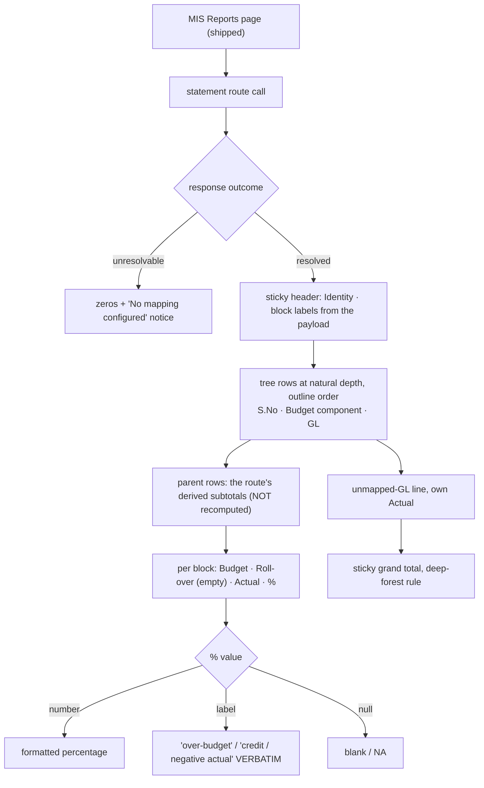

# Cold-read grill — gate: task — task plan statement-view

You did NOT write what follows. Read it cold, as an adversary trying to break the handover, never as its author defending it. You are READ-ONLY: return findings, change nothing.

## Interrogation technique

Run the interrogation this way. The harness contract above is the floor; this is the technique.

---
name: grilling
description: Grill the user relentlessly about a plan, decision, or idea. Use when the user wants to stress-test their thinking, or uses any 'grill' trigger phrases.
---

Interview the user relentlessly until you reach a shared understanding. Map this as a **design tree**: every decision branches into the decisions that hang off it.

Work the tree in **rounds**. The **frontier** is every decision whose prerequisites are already settled: the questions you can ask _now_ without guessing at answers you haven't heard yet. Ask the whole frontier in one round: number each question and give your recommended answer. Then wait for the user's answers before the next round.

Format a round like so:

```
❓ **Q1** - **<question title>**: <question body, might be multiple paragraphs, including multiple choices>

➡️ <your recommended answer>

---

❓ **Q2** - **<question title>**: <question body, might be multiple paragraphs, including multiple choices>

➡️ <your recommended answer>
```

Each round the user answers reshapes the tree: settled decisions push the frontier outward and unblock questions that depended on them. Recompute the frontier and ask the next round. A question whose answer depends on another question still open in this round belongs to a _later_ round, not this one.

Finding _facts_ is your job, never the user's. When a frontier question needs a fact from the environment (filesystem, tools, etc.), dispatch a sub-agent to find it; don't ask the user for anything you could look up yourself. Don't block on it: a running exploration is an unsettled prerequisite, so only the questions downstream of it wait for the sub-agent to report; ask the rest of the frontier now. The _decisions_ are the user's: put each to them and wait.

The session is done when the frontier is empty: every branch of the design tree visited, nothing left silently assumed. Do not act on it until the user confirms you have reached a shared understanding.


## Harness grill contract

# Griller Prompt — adversarial handover interrogation

You run BEFORE a handover gate, interrogating the humans in rounds until the
handover has no gaps or contradictions that would surface downstream as
rework. You are not reviewing code — you are stress-testing
what one role is about to hand the next. The gate scripts REFUSE without
your fresh, passing record.

**Independence is the whole point.** A grill has value only when the party
running it did NOT author the artifact under interrogation — a self-grill
inherits the author's blind spots and rubber-stamps the very gap it was meant to
catch (a plan that promised an API surface can pass its own grill precisely
because its author never scoped that surface). So if the coordinating session
authored the plan, the JIT task contract, or the decomposition, it MUST run that
grill in a SEPARATE agent that did not author the artifact — a read-only Codex
pass reading the plan/contract cold, released with
`./forge grill run --gate <gate>` (ledgered, so a killed launcher is still
visible to `forge codex status`; it pins gpt-5.6-terra @ xhigh from
harness.yaml) — rather than certify its own work inline. Codex on `gpt-5.6-terra` @ xhigh
is the required cold reader for planning grills: a fresh model context fully
independent of the authoring session, and because it is read-only it never
writes, so the write-lock that gates the write companion does not apply. Do NOT
use a Claude sub-agent for the grill, and never grill your own work inline.
Interrogate as an adversary trying to break the handover, never as its author
defending it.

RELEASE IT THROUGH THE HARNESS. `./forge grill run --gate <gate>` composes the cold-read brief (this contract plus the artifact) and releases Codex through the SAME ledgered launcher a delegation uses: the pid is recorded before the wait, so a grill whose launcher is killed still shows up in `forge codex status` instead of vanishing. It is read-only, so it takes no delegation lock and can never satisfy `stage done`. Recording the gate stays yours — the cold read only returns findings.

The technique is Matt Pocock's `grilling` skill — the design tree, the
frontier, numbered questions with recommended answers. `doctor --fix` installs
it into BOTH runtimes, and `./forge grill run` also inlines it into the brief,
so a reader reaches it whether or not its runtime resolves skills. This
contract is the harness-side floor; `grilling` is the technique.

`grill-me` is the HUMAN entry point — you type `/grill-me` and it redirects to
`grilling`. It carries `disable-model-invocation: true`, so no model invokes it
and none should be told to.

WHICH RUNTIME CAN RECORD WHICH GATE — get this wrong and you will chase a
refusal you cannot satisfy. ALL SIX gates match the AskUserQuestion ledger and
are therefore CLAUDE-ONLY, each with a floor of ONE logged round: `--gate spec`,
`--gate signoff`, `--gate epics`, `--gate requirements`, `--gate plan` and
`--gate task` — the floors live in `grill_gates.GATES`, one row per gate.
`signoff` and `epics` used to sit outside that check and so recorded with ZERO
rounds behind them; they now answer to it like every other gate.

ONE round is a FLOOR, never a target. Keep going until a round comes back clean
AND the next one stays clean — a single quiet round after a noisy one is a
coincidence, not convergence. The ledger files are written ONLY by `post_tool_use.py` on a
Claude Code AskUserQuestion event; `.codex/hooks.json` registers no PostToolUse
hook, so Codex cannot produce them and neither can a subagent. Delegating a
ledger-matched grill to Codex returns a well-formed payload that the recorder
then refuses, with nothing you can do to satisfy it — the payload was never the
problem, the runtime was.

For those four ledger-matched gates, independence is a COLD READ,
not necessarily a separate process. The recorder accepts ONLY rounds that match a
logged AskUserQuestion record (`record_grill_from_json.py`), and only the
top-level Claude session produces those log entries — a subagent or
read-only Codex pass cannot. So for those grills the top-level session drives
the rounds through AskUserQuestion itself — but because the coordinating session
authored the plan, the independent cold-read pass is MANDATORY, not optional: on
EVERY round release a fresh READ-ONLY Codex pass with
`./forge grill run --gate <gate> [--task <id>]` that reads the plan/contract
cold and returns findings — never a
Claude sub-agent, never grill your own work inline — then carry ALL of those
findings into your own AskUserQuestion rounds (the recorder rejects rounds not in
the ledger, so the top-level session must still ask). Read cold, as an adversary
who did not write it.

ONE COLD READ PER GATE — put every question to the human INSIDE it. The old
shape was Codex grill → your rounds → amend → Codex grill AGAIN, looping until
clean. That loop cannot converge: a fresh reader has no memory of what the last
one found, so it returns a DIFFERENT frontier rather than a shorter one, and the
artifact you amended to close round one becomes round two's input. Stories
reached eleven, twenty-six and forty rounds that way; the last cost six hours.
`forge grill run` now REFUSES a second unconstrained read on a gate that has
already been read since its last recorded pass.

So the WHOLE grill is:

1. `./forge grill run --gate <gate>` — one cold read. WATCH it.
2. Clean? Record the pass and approve. Nothing else happens.
3. Otherwise resolve every finding the REPOSITORY answers yourself — open the
   file and settle it. Take to the human only what the repository cannot
   answer: a decision nobody has made, a priority, a tradeoff between two
   workable shapes. Put those through AskUserQuestion with your recommended
   answer first, all of them, now. There is no later round to save the hard
   ones for, and a finding is not a menu.
4. Amend the artifact ONCE, to what they decided.
5. Record the pass against the AMENDED version, then approve exactly once.

The price is stated plainly, twice over: nothing independent re-reads the
amended version, and a gap this reader misses is not caught by a second reader
at this gate. Both surface at the next gate, or in review. That is the trade
for ending a loop that was costing whole days.

If the human's answers changed the artifact's SHAPE — a component dropped, a
different approach chosen — the amended artifact is not the one that was read
in any useful sense. Say so and read again: `./forge grill run --gate <gate>
--reread "<what changed shape>"`. It is a choice with a recorded reason, not a
way around the rule, and the five-read cap still backstops it. (EVERY gate is ledger-matched — signoff and epics no
longer excepted — so no gate can be recorded by a read-only Codex grill alone:
the top-level session asks the round and records it.)

FRESH CONTEXT, AND THE ANSWERS SO FAR. Every round is a NEW read-only Codex
session — that independence is the whole point. But a reader that knows nothing
of the earlier rounds does not re-find the same gaps, it finds DIFFERENT ones,
so the rounds never shrink and the grill has no natural end. `./forge grill run`
therefore carries every question already put to the human and the answer they
chose, read from the ledger the recorder validates against.

That gives the reader two obligations: do not re-raise settled questions, and
CHECK EACH ANSWER — that the artifact honours it, and that it contradicts no
other answer, accepted decision or constitution rule. An answer can be wrong, or
right and never applied; saying so is part of the read.

Do NOT tell the reader where to concentrate. A cold read is worth having because
it is unconstrained, and steering it toward the diff is how the thing nobody
looked at survives every round. More information, no direction.

END EVERY ROUND WITH AN EXPLICIT CONVERGENCE VERDICT, on its own line, so the
coordinator never has to guess whether to grill again or approve:

- `CONVERGED — no gaps, no contradictions, plan unchanged since the last round`
- `NOT CONVERGED — <the specific reason: open gaps, a contradiction, or the plan
  changed after the last clean round>`

`CONVERGED` on the cold read means there is nothing to amend: record and
approve. `NOT CONVERGED` does NOT mean read again — it means resolve what the
repository answers, put the rest to the human, amend once, and record the pass
against the amended version. Approval happens exactly once.

Five gates, five scopes:

- `--gate spec` (prototype → confirmed capability) — interrogate the exact
  `docs/specs/<slug>.md` file against BRIEF, architecture, decisions, and the
  prototype. Hunt: behavior the prototype proved but the spec omitted,
  implementation choices masquerading as requirements, vague acceptance
  language, and conflicts with active decisions.
- `--gate signoff` (client → PM, before `record_signoff.py`) — interrogate
  `docs/product/DISCOVERY.md`, `BRIEF.md`, confirmed specs, the spec-linked
  roadmap, `docs/decisions/`, and prototype notes. Hunt: unanswered
  stakeholder/constraint questions, scope
  the client saw vs. scope the BRIEF claims, decisions that contradict the
  BRIEF, acceptance criteria that are vibes instead of checks, non-functional
  requirements nobody asked about (auth, data retention, environments).
- `--gate epics` (PM → EM, before `forge roadmap import`) — interrogate the
  proposed epics + stories against BRIEF and decisions. Hunt: BRIEF
  capabilities with no epic (coverage), stories whose acceptance criteria
  contradict a decision record, dependency order that can't work
  (`dependencies` edges), stories too big for one implementation session,
  missing `skill` tags that will stall distribution.
- `--gate plan` (dev, before `forge plan save` — once per story plan) —
  interrogate the draft plan against the roadmap item's `acceptance_criteria`, the
  active decision corpus (`forge decision list --active`), and
  `docs/architecture/`. Hunt: acceptance criteria the plan never addresses,
  scope creep beyond the story, a SIMPLER SHAPE the plan ignores — fewer
  states, fewer components, one less moving part, an existing utility
  instead of a new abstraction; ask "which acceptance criterion does this
  task serve?" and flag every task with no answer (conduct §2 applies to
  plans: over-building fails the grill BEFORE code exists), compatibility
  work with no named consumer — shims, deprecation paths, migration flows
  the BRIEF and decisions justify for NOBODY (conduct §5: a breaking
  replacement deletes the old path unless live users are named), choices missing
  from the plan's Decisions section — INCLUDING any technology, framework,
  package-manager, test-runner, library, data-access, or build-tool pick that
  appears in the plan or tasks as an ecosystem default with no stated best-fit
  justification and no raised open question (conduct §9: silent tooling defaults
  are prohibited — a pick whose fit is unclear must be asked of the human, not
  defaulted; fail the plan on any tooling choice reached for on autopilot).
  Also flag a MISSING quality-gate baseline: any codebase the plan touches must
  wire a stack-APPROPRIATE static-analysis gate — a linter AND formatter, plus a
  type-checker where the language has one — into CI/verify, not merely a test
  runner. Name the CAPABILITY, never a fixed tool: ESLint/Biome for JS-TS,
  Ruff/flake8 for Python, golangci-lint for Go, Clippy for Rust, Checkstyle/
  Spotbugs for Java, and so on — the requirement is generic to every backend, not
  one ecosystem's tool. Fail the plan when code ships with no configured lint/
  format/static-analysis gate that an automated check enforces on every push; an
  absent linter is a silent quality default exactly like an unjustified tool pick.
  Also hold the plan against the CONSTITUTION's coding standards
  (`constitution/README.md` index — read the references it maps to the plan's
  surfaces). The constitution is law, so a plan whose SHAPE omits or contradicts a
  mandated standard is a GAP, not a style preference: HTTP surfaces with no typed
  request AND response DTOs (`pnp-api-standards`, `pnp-swagger-api-documentation-
  standards`), a module ignoring the modular-monolith layout or file-suffix
  standards (`pnp-coding-standards-modular-monolith`, `03`), missing structured
  logging (`05`/`06`) or domain exception handling (`07`), an external integration
  that skips the provider/port pattern (`08`, `pnp-provider-pattern-for-
  integration`), or database work ignoring `pnp-database-standards`. Flag each and
  require the plan to conform or record a deliberate, written deviation — never
  wave it through as "the implementer will follow standards later"; a plan must not
  design AGAINST the law. (`constitution/` is on disk in every environment, so the
  read-only Codex cold-read has the law available — hold the plan to it.)
  Reconcile the plan explicitly against
  EVERY ID from `forge decision list --active`; a conflict becomes a
  contradiction signal or a superseding decision, never a silent exception.
  Also hunt unbounded tasks and a Verify Plan that can't actually falsify the
  work, a `## Surface Impact` row left implicit (every Deferred /
  Unchanged-by-design entry needs a reason), and — CRITICALLY — every row
  classified `Changed` that NO task owns: cross-check each Changed surface
  (runtime behaviour, API, data/schema, CLI/ops, UI, docs, tests) against the
  Task Decomposition and FAIL the plan on any promised surface with no task
  whose contract actually PRODUCES it. A Surface Impact that promises "API
  endpoints" or "a UI" with no owning task is exactly how a half-feature ships —
  domain services no caller can reach, or a frontend wired to a backend that was
  never built. Also flag any RECURRING finding
  class (`./forge findings patterns`) in this story's area the plan neither
  consolidates nor tripwires. In Claude Code the
  `/grill-me` skill run against the plan satisfies this contract. The payload
  carries `"issue"`; the recorder stamps it against the active task.
- `--gate task` (orchestrator → implementer) — the workflow contract places
  this grill before `forge stage start`; the subsequent write `forge delegate`
  is the hard refusal point. Interrogate the next leaf task's just-authored
  contract in the re-recorded decomposition against the approved story plan,
  active decisions, and the actual repository state left by completed prior
  stages. Hunt: assumed files or APIs that prior work did not produce, a
  `write_scope` whose AREAS miss where the work must land or reach into areas
  the task has no business in (scope is directory prefixes plus named new
  files — a missing existing file under a declared prefix, a drifted line
  number or a renamed module is a NON-BLOCKING note, never a blocking finding;
  `stage done` measures the exact paths), acceptance criteria not served by the proposed
  work, a task that OWNS a plan `## Surface Impact` surface but whose
  `write_scope`/`required_tests` do not actually PRODUCE it (owns the API row but
  builds only domain services with no HTTP controllers/DTOs/routes; owns the UI
  row but ships no components) — reachability is part of "done", not a later
  task's problem, required tests that do not prove those criteria, verify commands that
  cannot falsify the change, reviewer focus that misses the risky seam OR that
  re-states shape rules the constitution already sets instead of CITING the
  load-bearing `constitution/` references for the task (the contract points at the
  law, never re-derives or contradicts it), and a
  `user_facing` flag that misclassifies the task — a UI task left `false` (its
  mandatory design skills and design review would be skipped) or a backend task
  marked `true` (forced to attest UI design skills it has no use for).
  This is the JIT task-planning gate from decision 0032, not a repeat of the
  story-level plan grill. Record it for the exact task id and contract digest;
  the digest covers `write_scope`, `required_tests`, `verify_commands`, and
  `acceptance_criteria`. A changed field makes the old task grill stale, and a
  write delegation refuses it; read-only delegation is unaffected.

Method:

1. Read the artifacts in scope FIRST; derive your question list from actual
   text, citing it (`BRIEF.md says X; decision 0003 says Y — which wins?`).
2. Interrogate in ROUNDS until the frontier is empty — not one pass. Each
   round, put the questions whose prerequisites are already settled to the
   human (PM or EM) with your recommended answer; their answers reshape the
   tree and unblock the next round's questions. Stop a single question when it
   would only confirm what a document already states; stop the grill only when
   no gap or contradiction remains unasked. In Claude Code, deliver each
   round's frontier through the AskUserQuestion tool (recommended answer
   first), not prose. For every ledger-matched gate (`spec`, `requirements`,
   `plan`, `task`) the recorder requires
   the FINAL round in the payload to carry `"frontier_empty": true` — that flag
   is how it confirms you stopped because the frontier closed, not because you
   ran out of patience; it is set by hand on the last `rounds` entry, never by
   the ledger. A zero-gap contract still needs at least one such round (every
   gate's floor is 1, and a floor is not a target), so ask a genuine closing
   question
   (e.g. "any remaining gap before we hand off?") and mark it `frontier_empty`.
3. Every finding lands somewhere real before the verdict: a doc edit, a
   `./forge decision new <slug>` record, or an explicit non-blocking entry
   in `open_items`. An `open_items` entry that PARKS scope also gets a
   deferral row with a revisit trigger (`./forge defer add`) — parked scope
   without a trigger is scope silently dropped. Unresolved blocking
   findings ⇒ verdict `blocked`.
4. Record the outcome (schema: `factory/schemas/grill.json`,
   `"generated_by": "griller"`):

   A task-grill input uses this recorded shape (the recorder adds its own
   task id, digests, commit, and timestamps):

```json
{
  "generated_by": "griller",
  "verdict": "pass",
  "gaps": [],
  "contradictions": [],
  "resolutions": ["What was sanctioned"],
  "inspected_refs": ["path/or/path:symbol"],
  "current_flow": "What the repository does now",
  "criteria_map": {"criterion": "proof"},
  "decision": "keep",
  "new_abstractions": ["None"],
  "rounds": [{"question": "Finding or choice", "options": ["Recommended", "Alternative"], "chosen": "Recommended", "frontier_empty": true}],
  "citations": [{"finding": "Repo-answerable finding", "source": "path:symbol"}],
  "open_items": []
}
```

   Each `rounds` entry has a non-empty `question`, two to four non-empty
   string `options`, and a `chosen` value equal to one option. Each citation
   is `{finding, source}`. Every string in `gaps` must be covered by an equal
   `rounds[].question` or `citations[].finding`.

   For every gate — all six are ledger-matched — extra recorder rules bind
   (this is what makes an otherwise well-formed payload fail):
   - Rounds must match the AskUserQuestion ledger and meet the gate floor
     (1 for every gate, and a floor is not a target); the final round carries
     `"frontier_empty": true`. A
     zero-gap grill still records its floor of real rounds — never zero.
   - `--gate task` only: `criteria_map` is a THREE-WAY equality — its KEYS must
     equal the frontier task's `acceptance_criteria` set AND the set of its
     `plan_contracts[].statement` values, exactly (no extra key, none missing);
     each value is the non-empty proof for that criterion. Author the task's
     `acceptance_criteria` and its `plan_contracts` statements as the SAME
     strings so there is one coherent key set to satisfy.

```bash
python3 factory/scripts/record_grill_from_json.py --gate <spec|signoff|epics|requirements|plan|task> --input <json> [--input-digest <artifact>] [--task <id>]
```

5. For every gate except task, commit the resolution edits
   BEFORE recording the grill — those gates check freshness against BOTH
   committed history and the working tree: any guarded doc changing after the
   grill (even uncommitted) stales it. (The sign-off / epics-approved decision
   records themselves are expected afterwards and don't stale it.) The task
   gate instead binds directly to the re-recorded task contract digest; the JIT
   sequence does not require a commit between re-recording and grilling. But that
   digest still folds in the product tree, so record the task grill LAST — after
   any docs/ or factory/scripts commits: a tracked change outside .factory/ and
   plans/ that lands between grilling and `task approve`/`stage start` re-stales
   it and forces a re-grill.
6. `--input-digest` is REQUIRED for the spec, epics, and plan gates: pass the
   exact spec / roadmap input / plan draft you interrogated. The gate verifies the
   digest — grilling version A never approves an edited version B; if the
   artifact changes, re-grill it. For `--gate task`, pass `--task <id>` and NO
   `--task-digest` — that flag was removed and the recorder rejects it; the
   recorder derives the grounding digest itself from the protected contract,
   approved plan, and product tree, and stores the result at
   `.factory/grills/tasks/<id>.json`.

A `pass` with unresolved findings is refused by the recorder. Grill hard;
downstream implementation inherits whatever you let through.


## Lessons already in force for these paths

The plan must design AROUND these. A plan that ignores one is not merely unlucky later — it is wrong now, and saying so is part of this read.

- A warehouse DATE column read through pg and JSON-serialized arrives at the browser as an IST-shifted UTC timestamp (2026-07-01 becomes 2026-06-30T18:30:00.000Z), so a user-facing table shows the WRONG MONTH. Normalize month/date cells to a date-only YYYY-MM-DD string on the server before they enter a result row, and format them for display on the client.
- The governed-financial percentage measure deliberately returns LABELS ('over-budget', 'credit / negative actual') when the budget is zero, so a renderer that pushes every numeric/percent cell through Number() turns the designed semantics into NaN. A cell formatter must render a non-numeric measure value verbatim.
- Measured against docs/design/3F-Financial-MIS/3F Financial MIS.dc.html, the live MIS Reports filter row drifts from the prototype in four ways: (1) the Generate button uses the shared shell Button's font-h2 (16px) and rounded-md (10px) beside 13px/6px selects, where the prototype's filter-bar Generate is 12.5px type on a 6px radius at the same 34px height; (2) the four filter labels render at 13px ink instead of the prototype's 11px --kl-slate, so a label reads as loudly as its value; (3) the empty state is a single sentence, dropping the prototype's 44px ruled icon block, its 19px deep-forest title and its 13px slate supporting line ('Actuals are read from SAP for the selected period. Nothing is written back - this report is read-only.'); (4) the prototype hides the native select arrow with appearance:none. A filter row and its action button are ONE control group - match their height, radius and type size to each other and to the prototype, and keep .eyebrow at 10px/.22em mono.
- RULING (settles the autoreview P1 and signals S-0021/S-0023): the bucket list must emit ONE row per unmapped GL CODE, never one per master bucket ENTRY, because GL/month is the grain of the only amounts that exist - do NOT add a warehouse query path and do NOT touch sqlBuilder.ts or selectionExecutor.ts to recover triple grain. Fold the master's bucket entries by gl_code in mis-selection.service.ts: costCentre keeps the single cost centre when that GL has exactly one bucket entry and is null when it has several (a GL booked across cost centres is no longer a triple, just as a Budget-only GL is not); provisional is true if any folded entry is provisional; reason names each folded entry's cost centre and reason so the list still says WHICH cost centre is wrong; actual and budget are that GL's totals assigned EXACTLY ONCE. This keeps the settled decision (both an Actual and a Budget amount per row, costCentre null where there is no single cost centre), keeps the gap visible rather than absorbed (decision 0018 as amended), and makes the list reconcilable against the slice totals because no amount is ever copied onto two rows. Acceptance criterion 3's word 'triples' means the reviewable identity of the gap, not one row per cost centre. Prove it in mis-selection.controller.test.ts with a master where ONE GL carries TWO bucket entries: expect a single row, costCentre null, and the GL total counted once.
- RULING (settles the autoreview P2/performance blocker at frontend/src/features/mis/mis-report-view.tsx:233): after folding the bucket to GL grain, costCentre === null means THREE different things - a Budget-only GL, a GL absent from the mapping master but carrying real Actual spend, and a GL whose master entries span several cost centres - so any UI label inferred from null (today 'Budget only') mislabels two of the three. FIX IN THE CONTRACT, not the renderer: replace MisSelectionBucketRow.costCentre (string | null) with costCentres: string[] - the master's cost centres for that GL, empty when the master names none. mis-selection.service.ts populates it (one entry when a single bucket entry, several when folded, empty for a Budget-only or master-absent GL) and the view renders exactly what it is given: the single name when there is one, 'N cost centres' when there are several (the reason line already names each), and 'No cost centre in master' when there are none. Never infer a row's kind from an absent field. Update mis-selection.controller.test.ts and mis-report-view.test.tsx accordingly, including the multi-cost-centre case with nonzero Actual.

## The contract as recorded (authoritative over any copy in the plan)

## Contract (recorded)

Rendered by the harness from the recorded decomposition; edit the decomposition, not this block. It is excluded from the plan's approval and grill digests, so a re-render never stales either.

**Objective.** Render the statement a person can read and hand to Srihari: the workbook's hierarchy at its natural depth, derived subtotals, the grand total, both zero states kept distinct, and the visible unmapped-GL line - reached from MIS Reports and matching the imported design prototype's metrics.

**Acceptance criteria**

- The statement renders as a TREE at the workbook's natural depth in outline order - two levels for most sections, three under Admin Expenses - each row carrying its S. No., Budget Component and, for leaves, the GL code; parent rows show the subtotals the route derived and a grand total foots the statement. Payment Office is NOT rendered: it belongs to Table-3, which the spec puts out of scope.
- Each period block renders Budget, Roll-over, Actual and % - Roll-over visibly present but EMPTY until Srihari's rule - with money in Indian digit grouping prefixed by the rupee sign and rounded to the rupee for display only, and a non-numeric percentage such as over-budget or credit / negative actual passed through VERBATIM rather than numeric-formatted. When the route returns a single block the table shows one block, not the same figures twice.
- The two zero states render distinctly, branched on the response outcome rather than row emptiness: an unresolvable selection shows zeros plus the no-mapping-configured notice, while a resolved selection with no transactions shows a configured zero statement without it. The unmapped-GL line is visible with its own Actual.
- The statement is reached from the existing MIS Reports page and matches the imported design prototype's metrics for the surfaces it reuses - the eyebrow at 10px with .22em tracking in mono, the deep-forest grand-total rule, sticky identity columns and block headers - adding no theme token, since tokens.test.ts guards the set.

**Write scope** (what `stage done` measures the diff against)

- frontend/app/(app)/mis-reports/statement/page.tsx
- frontend/src/features/mis/statement-view.tsx
- frontend/src/features/mis/statement-view.test.tsx
- frontend/src/features/mis/use-mis-statement.ts
- frontend/src/features/mis/mis-report-view.tsx
- frontend/src/features/mis/mis-report-view.test.tsx
- frontend/src/lib/api.ts
- frontend/src/lib/api.test.ts
- frontend/app/globals.css

**Required tests** (run by `stage done`)

- `the statement renders the outline as a tree in order with parent subtotals the route derived and a grand total footing the table` -- `npm exec --no -- vitest run --config frontend/vitest.config.ts {path} -t {id} --reporter=junit --outputFile={report}` (frontend/src/features/mis/statement-view.test.tsx)
- `each period block renders budget rollover actual and percentage with rollover empty money in indian grouping and a non numeric percentage label kept verbatim` -- `npm exec --no -- vitest run --config frontend/vitest.config.ts {path} -t {id} --reporter=junit --outputFile={report}` (frontend/src/features/mis/statement-view.test.tsx)
- `the two zero states render distinctly branched on the response outcome and the unmapped GL line is visible with its own actual` -- `npm exec --no -- vitest run --config frontend/vitest.config.ts {path} -t {id} --reporter=junit --outputFile={report}` (frontend/src/features/mis/statement-view.test.tsx)
- `a single block response renders one block rather than the same figures twice` -- `npm exec --no -- vitest run --config frontend/vitest.config.ts {path} -t {id} --reporter=junit --outputFile={report}` (frontend/src/features/mis/statement-view.test.tsx)

**Verify commands**

- `npm run typecheck`
- `npm run lint`
- `npm run format:check`
- `npm run test:frontend`
- `npm run build:frontend`

**Review budget.** 9 files / 1500 lines -- One page plus its view, hook and styles, consuming the already-shipped statement route, and a small edit to the existing MIS Reports page to reach it. The substance is the hierarchical table - sticky identity columns, two period blocks, derived subtotals rendered rather than recomputed, both zero states - and its design fidelity. No backend change, no contract change.

## Already answered on this story — verify, do not re-ask

These questions were put to the human and answered. Two obligations:

1. Do NOT raise them again as open questions. They are settled.
2. DO check each answer still holds — that the artifact actually honours it, and that it does not contradict another answer, an accepted decision, or the constitution. An answer can be wrong, or right and never applied. Saying so is part of this read.

- Q: Where should the 3F app be built, given we're adapting Pulse?
  A: Build in this 3oilpalm repo
- Q: Financial MIS statement — period columns for the PoC?
  A: July + FY 26-27 YTD
- Q: Financial MIS statement — Excel export fidelity?
  A: Clean structured export
- Q: Financial MIS statement — reconciliation / demo-ready bar?
  A: SAP totals = demo-ready; filled month = validated
- Q: SAP ingestion — how does data get in for the PoC?
  A: Excel upload now (SAP export/API later)
- Q: SAP ingestion — how are budgets brought in?
  A: Ingest budgets from the MIS format, as a separate object
- Q: SAP ingestion — grain & raw retention?
  A: Monthly gold + retain raw transaction lines
- Q: SAP ingestion — re-loading a period?
  A: Idempotent replace per period
- Q: Governed joins — how to handle rows in one object but not the other (Budget with no Actual, or Actual with no Budget)?
  A: Full-outer, zero-fill the missing side
- Q: Governed joins — where are 3F financial measures authored?
  A: In code (repo domain files)
- Q: Governed joins — RBAC on a joined query?
  A: Inject scope on both objects
- Q: Governed joins — correctness gate?
  A: Golden-answer fixtures required
- Q: Mapping master — Srihari's Master Table definition is still outstanding. How do we proceed?
  A: Build a provisional master now, reconcile later
- Q: Mapping master — how is it edited in the PoC?
  A: Seed / config file for the PoC (admin UI later)
- Q: Mapping master — selection with no mapping entries?
  A: Empty statement (zeros) + 'no mapping configured' notice
- Q: Drill-down — levels for the PoC?
  A: 2-level now (group → sub-lines → transactions), confirm with Srihari
- Q: Drill-down — showing individual transactions vs Pulse's aggregate suppression?
  A: Show individual lines within the user's RBAC scope, audited
- Q: Drill-down — line-item columns?
  A: Month, Debit, Credit, Value + reference, memo, posting date
- Q: Assistant/exploration — in the first PoC release, or a fast-follow?
  A: Include in the first PoC release
- Q: Assistant — LLM & data residency?
  A: Decide later
- Q: Platform base — how do we bring Pulse's code in?
  A: Snapshot-copy into the repo (own it)
- Q: Platform base — warehouse engine for the PoC?
  A: Postgres for the PoC
- Q: Platform base — auth for the PoC?
  A: Keep Pulse's email+OTP passwordless auth
- Q: Sign-off gate — how do we unlock the build?
  A: Record an internal go-ahead now
- Q: The statement's row hierarchy comes from the budget workbook's own outline, which has UNEVEN depth: most sections are two levels (e.g. '4 Materials Primary Nursery' → '4.1 Shade Net', GL 50001601), but 'Admin Expenses' is three ('9' → '9.01 Vehicle Maintenance', GL 55010900 → 'Petrol and Diesel Charges', GL 55010901). Actuals attach at the GL leaf and parent values are derived by rolling up, never read (decision 0020). How deep should the statement render?
  A: Mirror the workbook outline (Recommended)
- Q: Which identity columns should each statement row carry, on screen and in the Excel export? The legacy workbook's Table-2 carries a serial number, the Budget Component name, a GL code, a Roll-over Budget column and a Payment Office column. The measures themselves are settled (Budget · Roll-over · Actual · %, for the selected month and FY 26-27 YTD).
  A: S.No + Component + GL, Roll-over blank (Recommended)
- Q: My draft put the outline on the budget leaf rows (a parent_key column). The grill showed that breaks: mis_budget stores ONLY leaves, so parent_key would point at a parent node that is never persisted — and the leaf's own lineId is the sheet ROW NUMBER, so any reissued or reordered workbook silently repoints every mapping. Decision 0020 also assumed one parent level, but Admin Expenses has two. How should the statement's hierarchy be stored?
  A: Outline snapshot + stable leaf key (Recommended)
- Q: My draft said the statement would change the governed roll-up's grouping key from gl_code to 'governed line', and claimed decisions 0016/0017 were unchanged. The grill calls that wrong: the shipped selection route, the semantic domain and the future drill-down all deliberately read GL-month rows, so mutating that relation risks breaking them. How should the statement get its numbers?
  A: Separate statement projection (Recommended)
- Q: Task 1 adds a drift check: when a budget workbook is re-uploaded, the parser compares its outline's leaf keys against the ones the Mapping Master targets. If Srihari renames or renumbers a line, its key changes and a master entry now points at nothing — which, unchecked, silently splits one statement line into a budget-only row and an actual-only row. The check itself is settled; what it should DO is not. What should happen to that upload?
  A: Ingest succeeds, drift reported (Recommended)
- Q: The delegate launch for statement-model was declined. The only discretionary choice in it was raising Codex from the harness floor (gpt-5.6-sol @ medium) to high effort. How should I launch it?
  A: High effort (Recommended)
- Q: The statement shows two period blocks side by side: the selected month and FY 26-27 YTD. But the period selector also offers 'FY 26-27 YTD' as a choice — and if someone picks it, both blocks are the same range, so the statement shows every number twice under two different headings. What should it do then?
  A: Show a single YTD block (Recommended)

## The artifact under interrogation (task plan statement-view)

# Task plan — statement-view: the Financial MIS statement on screen

Story: mis-statement · Task 3 of 4 · **user_facing: true**

## Objective
Put Srihari's statement on a screen. The route already returns the tree with every
subtotal derived and the grand total footed; this task **renders** it — the workbook's
hierarchy at its natural depth, two period blocks, both zero states kept distinct, and the
`unmapped-GL` line visible — reached from the existing MIS Reports page.

No backend change and no contract change: the payload is fixed and shipped.

## Acceptance criteria (plan_contracts)
- **t-sv-c1** — the tree at natural depth in outline order, each row carrying `S. No.`,
  Budget Component and (leaves) GL code, parents showing the **route's** subtotals, a
  grand total footing. **Payment Office is not rendered** — Table-3 is out of scope.
- **t-sv-c2** — each block renders **Budget · Roll-over · Actual · %**, Roll-over visibly
  **empty**, money in Indian grouping with `₹` rounded to the rupee **for display only**,
  and a non-numeric `%` label passed through **verbatim**. A single-block response renders
  one block.
- **t-sv-c3** — the two zero states distinct, branched on the **outcome**; the
  `unmapped-GL` line visible with its own Actual.
- **t-sv-c4** — reached from MIS Reports, matching the prototype's metrics for the
  surfaces it reuses, **adding no theme token**.

## Mandatory for a user-facing task
`harness.yaml` — the recorder **refuses** a user-facing testing artifact unless
`skills_used` attests **both `emil-design-eng` and `frontend-design`**. A **functional
check** is also required, recorded via `record_test_from_json.py --kind functional`; the
automated artifact alone does not satisfy this task.

## What already exists (grounding, file:line)
- **The payload, shipped in task 2** — `contract/src/api.ts:270` `MisStatementNode`
  (`nodeKey, sNo, budgetComponent, glCode, measures[], children[]`) and `:260`
  `MisStatementMeasureBlock` (`key: "selected" | "fy26-27-ytd"`, `label`, `from`, `to`,
  `budget`, `rollover: null`, `actual`, `percentage: string | null`, `sourcePresence`),
  with `MisStatementResolvedResponse` carrying `tree`, `grandTotal` and `provenance`, and
  `MisStatementUnresolvableResponse` carrying `notice: "No mapping configured"`.
  **Every subtotal is already computed** — the view renders, it does not re-sum.
- **Money** — `FixedScaleMoney` (`api.ts:258`) is a fixed-scale decimal **string**
  (`${bigint}.${digit}${digit}`), so paise survive the wire. Display rounds to the rupee;
  the string is never turned into float arithmetic.
- **The API client** — `frontend/src/lib/api.ts:60-63` has `misOptions` and
  `runMisSelection`; the statement call is the next data method on the same
  cookie/CSRF/one-shot-refresh `request`/`post` helpers.
- **The page it hangs off** — `frontend/app/(app)/mis-reports/page.tsx` +
  `src/features/mis/mis-report-view.tsx`: the shipped selector, its resolved-scope
  readout, its two zero states and the unmapped-GL list. The statement is reached from
  there, and that page's patterns (branch on the union, labels verbatim) are the ones to
  follow.
- **The prototype** — `docs/design/3F-Financial-MIS/3F Financial MIS.dc.html:157-193`:
  sticky header groups (`Identity`, `FY 26-27 (YTD)`, `July 2026`), identity columns
  `S.No · Budget component · Rollover · Payment office · GL code`, `Budget`/`Actual` per
  block, and a sticky grand-total row ruled in `--kl-deep-forest`. **We omit Payment
  office** (Table-3) and **add `%`** per the spec.
- **Tests are vitest** — `npm exec --no -- vitest run --config frontend/vitest.config.ts`.
  A required leaf whose `-t` matches nothing still exits 0 (D-0031), so the report's
  executed count is what proves a leaf ran.

## Design
### Render, never recompute
Every parent subtotal and the grand total arrive computed. The view **displays** them. A
client that re-sums creates a second source of truth that can disagree with the Excel
export task 4 builds from the same payload — the exact drift the wire types exist to
prevent.

### The table
One table, sticky identity columns on the left and sticky block headers on top, so a deep
statement stays legible while scrolling — the prototype's structure. Depth is shown by
indentation **and** by real structure for assistive technology: a row's level is carried
in markup, not implied by padding alone, and the sticky columns must not trap focus.

### Money and the nil rules
`FixedScaleMoney` is a string carrying exact paise. Display rounds it to the rupee in
Indian digit grouping with `₹`, and that is the **only** place rounding happens.
`percentage` is `string | null`: `null` renders as blank/NA, and a non-numeric label —
`over-budget`, `credit / negative actual` — renders **verbatim**. Numeric-formatting it is
the defect `mis-selection` shipped to a live page.

### Blocks
The route returns one or two blocks and labels each. The view renders **what it is
given** — one block when the selected period is itself the FY-YTD — rather than assuming
two.

## Workflow


## Manual Verification
1. `npm run typecheck && npm run lint && npm run format:check && npm run test:frontend &&
   npm run build:frontend` — the four required vitest leaves pass. Check each leaf's
   **executed count**, not the exit code: a `-t` that matches nothing still exits 0
   (D-0031).
2. `frontend/src/theme/tokens.test.ts` still passes, proving no token was added or renamed.
3. **Functional check (mandatory, user_facing)**: with the stack up and the July batch
   ingested, sign in, open MIS Reports, generate Agriculture / Nursery / DUB / Jul 2026,
   open the statement, and confirm the hierarchy at its natural depth, parent subtotals
   footing to the grand total **₹1,15,12,712** Actual against **₹1,00,50,136** Budget,
   both period blocks with Roll-over empty, the `unmapped-GL` line, and no `NaN` anywhere.
   The **unresolvable** state is not walked live — the single-selection master makes it
   unreachable — and is proven by the component test instead.

## Decisions attested
**0018** (the `unmapped-GL` line stays visible; the two zero states), **0021/0022**
(the outline and the projection behind the numbers), **0020** (parents derived — here,
rendered not recomputed), **0019** (the route this consumes), **0016** (governed access),
**0023** (drift reports, never blocks), **0007** (Next.js), **0010** (3F branding),
**0009/0031** (a required leaf must really execute), **0002/0003**.

## Surface impact
- **Frontend**: `app/(app)/mis-reports/statement/page.tsx` (NEW),
  `src/features/mis/statement-view.tsx` + its hook (NEW), the statement data method on
  `src/lib/api.ts`, a link from `mis-report-view.tsx`, `app/globals.css` page classes.
- **Unchanged by design**: every backend file, `contract/src/api.ts`, the theme tokens
  (`tokens.test.ts` guards them), the selection flow and its tests beyond the added link,
  `SessionGuard`/`AppShell` auth, the gated warehouse proofs.

## Out of scope
The Excel export (task 4), the roll-over calculation, Table-1 and Table-3 including
Payment Office, drill-down, and any backend or contract change.

## Task Decomposition
Task 3 of the mis-statement story's 4-task decomposition: (1) statement-model [#30],
(2) statement-api [#32], (3) **statement-view** [this task], (4) statement-export. One
bounded unit — a page rendering an already-shipped payload — proven by four vitest leaves
plus the mandatory functional check.

<!-- forge:contract -->
## Contract (recorded)

Rendered by the harness from the recorded decomposition; edit the decomposition, not this block. It is excluded from the plan's approval and grill digests, so a re-render never stales either.

**Objective.** Render the statement a person can read and hand to Srihari: the workbook's hierarchy at its natural depth, derived subtotals, the grand total, both zero states kept distinct, and the visible unmapped-GL line - reached from MIS Reports and matching the imported design prototype's metrics.

**Acceptance criteria**

- The statement renders as a TREE at the workbook's natural depth in outline order - two levels for most sections, three under Admin Expenses - each row carrying its S. No., Budget Component and, for leaves, the GL code; parent rows show the subtotals the route derived and a grand total foots the statement. Payment Office is NOT rendered: it belongs to Table-3, which the spec puts out of scope.
- Each period block renders Budget, Roll-over, Actual and % - Roll-over visibly present but EMPTY until Srihari's rule - with money in Indian digit grouping prefixed by the rupee sign and rounded to the rupee for display only, and a non-numeric percentage such as over-budget or credit / negative actual passed through VERBATIM rather than numeric-formatted. When the route returns a single block the table shows one block, not the same figures twice.
- The two zero states render distinctly, branched on the response outcome rather than row emptiness: an unresolvable selection shows zeros plus the no-mapping-configured notice, while a resolved selection with no transactions shows a configured zero statement without it. The unmapped-GL line is visible with its own Actual.
- The statement is reached from the existing MIS Reports page and matches the imported design prototype's metrics for the surfaces it reuses - the eyebrow at 10px with .22em tracking in mono, the deep-forest grand-total rule, sticky identity columns and block headers - adding no theme token, since tokens.test.ts guards the set.

**Write scope** (what `stage done` measures the diff against)

- frontend/app/(app)/mis-reports/statement/page.tsx
- frontend/src/features/mis/statement-view.tsx
- frontend/src/features/mis/statement-view.test.tsx
- frontend/src/features/mis/use-mis-statement.ts
- frontend/src/features/mis/mis-report-view.tsx
- frontend/src/features/mis/mis-report-view.test.tsx
- frontend/src/lib/api.ts
- frontend/src/lib/api.test.ts
- frontend/app/globals.css

**Required tests** (run by `stage done`)

- `the statement renders the outline as a tree in order with parent subtotals the route derived and a grand total footing the table` -- `npm exec --no -- vitest run --config frontend/vitest.config.ts {path} -t {id} --reporter=junit --outputFile={report}` (frontend/src/features/mis/statement-view.test.tsx)
- `each period block renders budget rollover actual and percentage with rollover empty money in indian grouping and a non numeric percentage label kept verbatim` -- `npm exec --no -- vitest run --config frontend/vitest.config.ts {path} -t {id} --reporter=junit --outputFile={report}` (frontend/src/features/mis/statement-view.test.tsx)
- `the two zero states render distinctly branched on the response outcome and the unmapped GL line is visible with its own actual` -- `npm exec --no -- vitest run --config frontend/vitest.config.ts {path} -t {id} --reporter=junit --outputFile={report}` (frontend/src/features/mis/statement-view.test.tsx)
- `a single block response renders one block rather than the same figures twice` -- `npm exec --no -- vitest run --config frontend/vitest.config.ts {path} -t {id} --reporter=junit --outputFile={report}` (frontend/src/features/mis/statement-view.test.tsx)

**Verify commands**

- `npm run typecheck`
- `npm run lint`
- `npm run format:check`
- `npm run test:frontend`
- `npm run build:frontend`

**Review budget.** 9 files / 1500 lines -- One page plus its view, hook and styles, consuming the already-shipped statement route, and a small edit to the existing MIS Reports page to reach it. The substance is the hierarchical table - sticky identity columns, two period blocks, derived subtotals rendered rather than recomputed, both zero states - and its design fidelity. No backend change, no contract change.
<!-- /forge:contract -->


## What to return

Findings only: contradictions, gaps, unstated assumptions, and anything a reader would have to guess. Say what would break and why. Do not record a gate — the coordinating session records it.

The round count below is a FLOOR, not a target. Keep grilling until a round comes back clean AND stays clean on the next one — hitting the floor is not the same as passing.
