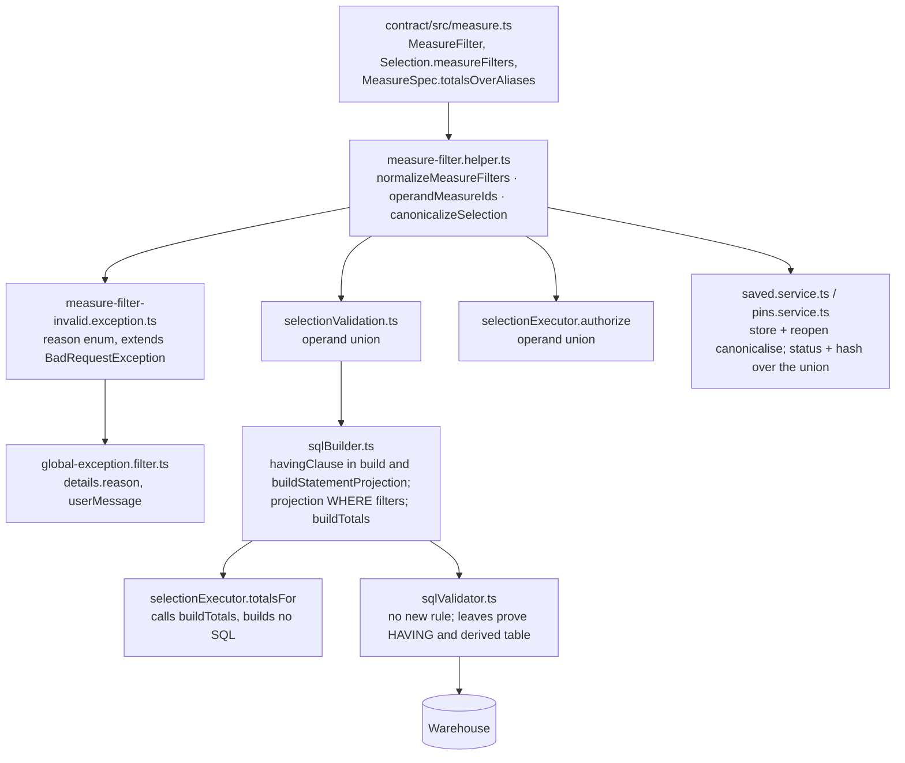

# Task — measure-filter-foundation

Story: `ask-measure-filter` · plan: `plans/active/ask-measure-filter-ask-filters-by-a-comparison-between-measures.md`
· spec: `docs/specs/ask-measure-comparison-filter.md` · decision 0039.

## Objective
Give the selection contract an additive optional `measureFilters` list and build the trust spine
under it, backend only: one pure helper that normalises, canonicalises and appends operand
measures; one typed exception and its envelope branch; the operand union read by validation,
executor authorization, saved and pin runnable status and the pin definition-version hash; the
SQL builder compiling each filter to `HAVING` over verified expressions in both domains, the
statement projection now honouring dimension filters, and a builder-owned totals query over a
derived table; validator leaves proving every existing check still fires. No provider, chat,
Swagger, help or frontend change: those are tasks 2 and 3.

## Workflow

This task starts at the contract and stops at the SQL the warehouse runs. The chat service, the
provider and every reader-facing surface are untouched here.

## Read before you write
- `contract/src/measure.ts:151-164` — `Selection` and `SelectionFilter`; add the new types beside
  them. `MeasureSpec` (line 11) gains `totalsOverAliases?: string`.
- `contract/src/api.ts:630-660` — `AskResponse` (`appliedFilters`, `totals: Record<string,
  number>`); line 730 `ConversationAnswerSnapshot`. Add `appliedMeasureFilters?: MeasureFilter[]`
  to both; totals stay numbers.
- `backend/src/semantic/selectionValidation.ts:5-30` — `validateSelectionForUser` reads
  `selection.measureIds`; it must read the operand union. **D-0006:** this file is listed in
  `.prettierignore` with a pinned hash in `tools/quality-gate.test.mjs` (`ignoredBaselineHashes`);
  before editing it, format it and remove it from BOTH lists in the same change, per the
  `.prettierignore` header. Same for `backend/src/sql/sqlValidator.ts` if you touch it (you should
  not need to: it gains no rule).
- `backend/src/semantic/semanticLayer.ts:52-80,110-130` — the `%` measures are text `CASE`
  expressions with `format: "percent"`; money measures carry `format: "money"`. Set
  `totalsOverAliases` on `governed-financial.percentage` and `mis-statement.percentage`.
- `backend/src/sql/sqlBuilder.ts:93-140` — `build`: user filters, time predicate, `GROUP BY`,
  `ORDER BY`, `LIMIT`; `HAVING` goes between `GROUP BY` and `ORDER BY`. Lines 203-260 —
  `buildStatementProjection`: today it never reads `selection.filters`; add the `WHERE`
  predicates on `relation.<column>` beside the period predicate and the `HAVING` after its
  grouping. `lit()` quotes every literal.
- `backend/src/chat/selectionExecutor.ts:109-119` — `authorize` reads `selection.measureIds`;
  lines 221-256 — `totalsFor` re-runs `executeResolved` with `dimensionIds: []` and reads the
  first row. Replace the query construction with `builder.buildTotals(...)`; keep the row
  reading and `Number()` conversion.
- `backend/src/sql/sqlValidator.ts:19-70` — object allowlist via `Parser.tableList`, blocked
  columns via `columnList`, mandatory bounded `LIMIT` read from the top-level statement.
- `backend/src/saved/saved.schemas.ts:18-45` — `selectionSchema` (zod, strict); add
  `measureFilters` as an optional strict array. `backend/src/saved/saved.service.ts:110-135` and
  `backend/src/pins/pins.service.ts:255-285` — `selectionStatus` builds `dimensionIds` from
  filters; do the same for measures through `operandMeasureIds`. `pins.service.ts:40,225` —
  `computeDefinitionVersion(selectedMeasures)` (`definitionVersion.ts`): feed it the operand
  union so a pin's hash changes when an operand's expression changes.
- `backend/src/common/global-exception.filter.ts:17-80` — `message` is fixed to "HTTP exception"
  for non-500s and `details` is `{}` unless zod validation; add the one branch.
- `backend/src/common/error-envelope.wiring.test.ts` — the pattern for asserting an envelope
  through `configureApp` + `app.init`.
- `backend/package.json:18` — `test:hermetic` is an explicit file list; add the new helper test.
  `tools/quality-gate.test.mjs:64,121,134` — the hermetic list is pinned there too; both must
  agree.
- `docs/decisions/0039-ask-measure-comparison-filter.md` — the six rules.

## Contract

### The shape (C1)
- `contract/src/measure.ts`: `MeasureFilterOp = "gt" | "gte" | "lt" | "lte"`;
  `MeasureFilterOperand = { kind: "measure"; measureId: string } | { kind: "value"; value: string }`;
  `MeasureFilter { measureId; op; compareTo }`; `Selection.measureFilters?: MeasureFilter[]`;
  `MeasureSpec.totalsOverAliases?: string`. `contract/src/api.ts`: `AskResponse.appliedMeasureFilters?`
  and `ConversationAnswerSnapshot.appliedMeasureFilters?`. `filters` unchanged. The saved-selection
  zod schema accepts the field. Every shipped leaf that builds or stores a selection passes
  unmodified; `npm run typecheck` green in all three workspaces.

### The helper — one seam, one canonicaliser (C2, C4)
- `backend/src/semantic/measure-filter.helper.ts` (suffix `helper`: pure, no IO, no Nest
  injection). Exports:
  - `normalizeMeasureFilters(domain: DomainSpec, filters: MeasureFilter[] | undefined): MeasureFilter[]`
    — value must match `^-?\d+(\.\d{1,2})?$` and is normalised to exactly two decimals
    **lexically** (split on the point, pad the fraction to two digits, keep the integer digits
    verbatim, canonicalise `-0`, `-0.0` and `-0.00` to `0.00`): never through `Number(...)` or
    `toFixed`, so `12345678901234567.89` survives unchanged; a leaf asserts a value above
    `Number.MAX_SAFE_INTEGER` and the negative-zero case. Both operands must be measures of the
    domain with `format === "money"` (a `%` measure or an unknown id is refused); a measure
    compared with itself is refused; two entries identical after normalisation are refused; order
    is preserved.
  - `operandMeasureIds(selection: Selection): string[]` — `measureIds` followed by every operand
    measure id not already present, in first-appearance order across the filters.
  - `canonicalizeSelection(domain: DomainSpec, selection: Selection): Selection` — normalises the
    filters and returns the selection with `measureIds = operandMeasureIds(...)`; the first entry
    of `measureIds` is never moved, so the shipped ordering rule (largest first by the first
    measure) is unchanged. A selection without `measureFilters` is returned unchanged
    (byte-for-byte equal), so every shipped path is a no-op.
- Refusals raise `MeasureFilterInvalidException`
  (`backend/src/semantic/measure-filter-invalid.exception.ts`), which extends `BadRequestException`
  and carries `reason: MeasureFilterInvalidReason` — `not_comparable | unknown_measure |
  self_comparison | duplicate | malformed_value` — as a typed enum, never a string literal. It is
  the only exception the helper throws. An operand outside the **user's permissions** is NOT a
  helper concern: `validateSelectionForUser` and the executor's `authorize` read the operand union
  and refuse through their existing displayed-measure paths ("Measure not available: <id>",
  `SelectionExecutionBlockedError`).
- `global-exception.filter.ts` gains one branch: when the exception is a
  `MeasureFilterInvalidException`, `details = { reason }` and `userMessage` is the reader sentence
  for that reason (five sentences, in the exception file as a typed map); `code` stays `HTTP_400`
  and `type` is already the constructor name. Everything else in the filter is unchanged. The
  contract owns the shape: `ErrorPayload.details` (`contract/src/api.ts:26`) becomes
  `{ fieldErrors?: ErrorFieldDetail[]; reason?: MeasureFilterInvalidReason }` with the reason enum
  exported from the contract, and the saved and pin error DTOs document the `reason` member in
  Swagger, so the public 400 shape is typed and documented, not implicit.

### Ask stays closed until task 2 (human ruling at this grill)
- `chat.schemas.ts` imports `selectionSchema` for the Ask request, so widening the saved schema
  would let a direct `/api/chat` request carry a measure filter into the new SQL path before task
  2 wires Ask's canonicalisation and refusal. Task 1 therefore gives the Ask request its own
  strict selection schema in `backend/src/chat/chat.schemas.ts` that **omits** `measureFilters`
  (a request carrying it answers 400 `VALIDATION_ERROR` through the existing zod path); a leaf in
  `chat.schemas.test.ts` proves it. Task 2 replaces that schema when it lifts the gate. No other
  file under `backend/src/chat` changes except `selectionExecutor.ts` and its composed test.

### Every non-chat ingress canonicalises and authorises the union (C2, C4)
- `saved.service.ts` and `pins.service.ts`: on store (`POST /api/saved`, `POST /api/pins`) the
  selection is canonicalised before it is validated and written. On reopen the order is fixed:
  **status first, over the raw operand union** (`operandMeasureIds` of the stored selection,
  without canonicalising), so an operand no longer registered reports `definition_unregistered`
  and an unpermitted one reports the existing not-permitted reason exactly as a displayed measure
  would; **only a runnable selection is then canonicalised** before it is re-run. A leaf proves a
  stored selection whose operand was removed from the registry reports `definition_unregistered`
  rather than throwing `unknown_measure`.
- `computeDefinitionVersion` receives the measures for the operand union, so a pin whose filter
  operand's expression changes is flagged `definitionChanged`.
- `validateSelectionForUser` and `selectionExecutor.authorize` read `operandMeasureIds`.
- The chat service's own call sites (provider door, direct `AskRequest.selection`, grounded
  selection) belong to task 2; this task exposes the helper and must not edit
  `backend/src/chat/chat.service.ts`. Under `backend/src/chat` it edits exactly three files:
  `selectionExecutor.ts`, `selectionExecutor.composed.test.ts` and `chat.schemas.ts` (with its
  test), the last only to keep Ask closed as above.

### SQL, built in one place (C3, C5, C6)
- `sqlBuilder.ts`: a private `havingClause(domain, measures, filters)` renders
  `<left.expr> <op> <right.expr | lit(value)>` joined by ` AND `, with `op` mapped `gt >`, `gte
  >=`, `lt <`, `lte <=`. In `build` it is appended after `GROUP BY` (and, with no dimensions,
  directly after `WHERE`, where the single aggregate row is kept or dropped). In
  `buildStatementProjection` it is appended after the projection's grouping. The projection also
  renders `selection.filters` as `WHERE` predicates on `relation.<column>` (`eq` =, `neq` <>,
  `in (...)`) beside the period predicate, only when a filter is present, so the golden
  statement proofs see identical SQL.
- New public `buildTotals(domain, selection, user, resolvedScope?)`: when `measureFilters` is
  empty it returns exactly what `totalsFor` builds today (the ungrouped query with
  `dimensionIds: []`); otherwise it wraps the grouped, filtered query **without its `LIMIT`** as
  `SELECT <totals> FROM (<grouped query>) AS filtered LIMIT 1`, where each selected measure totals
  as `SUM(<alias>) AS <alias>` when `format === "money"`, as `<totalsOverAliases> AS <alias>` when
  the measure declares one, and `NULL AS <alias>` otherwise. Aliases are the measure id's last
  segment, so they differ per domain and the two `%` expressions are concrete, not one literal:
  - `governed-financial.percentage` (aliases `actual`, `budget`):
    `CASE WHEN SUM(budget) = 0 AND SUM(actual) = 0 THEN NULL WHEN SUM(budget) = 0 AND SUM(actual) > 0
    THEN 'over-budget' WHEN SUM(budget) = 0 AND SUM(actual) < 0 THEN 'credit / negative actual'
    ELSE (SUM(actual) / SUM(budget))::text END`;
  - `mis-statement.percentage` (aliases `actual_net`, `budget_net`): the same `CASE` over
    `SUM(actual_net)` and `SUM(budget_net)`.
  Leaves assert `buildTotals` for both domains. `objectsTouched` is unchanged.
- `selectionExecutor.totalsFor` calls `this.builder.buildTotals(...)` and runs the returned SQL
  through the same validator and warehouse path as `executeResolved`; it constructs no SQL.
- `sqlValidator.ts` is not edited. Leaves prove: a `HAVING` query and the derived totals query
  are accepted; an unapproved object referenced only inside the derived table is refused with the
  existing "unapproved object" reason; a blocked column referenced only inside `HAVING` is refused
  with the existing blocked-column reason; a derived query with no outer `LIMIT` is refused; and
  `Parser.tableList` on the derived query returns the base objects (pinned so a parser upgrade
  cannot widen the allowlist unnoticed).

### Design (code shape, constitution)
- Two new files, constitution suffixes: `measure-filter.helper.ts`, `measure-filter-invalid.exception.ts`.
  The reason enum and the reader sentences live in the exception file; no string literals for
  reasons anywhere else.
- No new dependency. No migration. `node-sql-parser` already parses `HAVING` and derived tables.
- Money on the wire: `compareTo.value` is a two-decimal string; totals stay numbers as shipped.
- Any D-0006-listed file this task edits (`selectionValidation.ts` is the one it must) is
  formatted and removed from `.prettierignore` and from `ignoredBaselineHashes` in the same
  commit; `tools/quality-gate.test.mjs` and `backend/package.json` both list the new helper test.

## Manual Verification
1. `npm run typecheck` green in `contract`, `backend`, `frontend`; `npm run test:hermetic` green.
2. `TS_NODE_PROJECT=backend/tsconfig.json TS_NODE_TRANSPILE_ONLY=1 node --require ts-node/register
   --test backend/src/semantic/measure-filter.helper.test.ts` lists the four helper leaves passing.
3. In `sqlBuilder.selection.test.ts` output, the rendered SQL for `Actual gt Budget` by `gl_code`
   for July shows `GROUP BY gl_code` followed by `HAVING SUM(actual_net) > SUM(budget_net)` and
   the totals SQL shows `FROM (` ... `) AS filtered LIMIT 1` with no inner `LIMIT`.
4. Backend up against the documented `WAREHOUSE_PG_*` with the July batches loaded: `POST
   /api/saved` with a selection carrying `{ measureId: "governed-financial.percentage", op: "gt",
   compareTo: { kind: "value", value: "1" } }` answers 400 with `type:
   "MeasureFilterInvalidException"` and `details.reason: "not_comparable"`; the same with
   `governed-financial.actual gt governed-financial.budget` is stored, and `GET /api/saved`
   reports it runnable with `measureIds` showing Budget appended.
5. `python3 factory/scripts/verify.py` passes.

## Out of scope
- The Bedrock schema, prompt and parser; the chat service's ingress call, refusal translation,
  chips, readback, `viewInReport`, grounding merge, `appliedMeasureFilters` population; chat
  Swagger; help; the warehouse proof; the leaf proving provider, direct Ask and stored re-run
  refuse identically — task 2. Task 1 proves the stored, save and pin handling only.
- Labels, identity, the readout line, the empty state, the functional check — task 3.

## Proof
Every required leaf is named in the recorded decomposition; each is judged by its junit testcase
name present and executed, never skipped (decision 0009). `python3 factory/scripts/verify.py`
passes on the final tree.

<!-- forge:contract -->
## Contract (recorded)

Rendered by the harness from the recorded decomposition; edit the decomposition, not this block. It is excluded from the plan's approval and grill digests, so a re-render never stales either.

**Objective.** Give the selection contract an additive optional measureFilters list (measure vs measure or vs a fixed-scale decimal value; gt, gte, lt, lte; AND; order-preserving) and build the trust spine under it: one pure helper that normalises, canonicalises and appends operand measures; one typed exception; the operand union read by validation, executor authorization, saved and pin runnable status and the pin definition-version hash; the SQL builder compiling each filter to HAVING over verified expressions in both the governed-financial query and the statement projection, the projection now applying dimension filters as WHERE predicates, and a builder-owned totals query over a derived table with an outer LIMIT 1; validator leaves proving every existing check still fires inside HAVING and the derived table. No provider, chat, Swagger, help or frontend change: those are the next two tasks.

**Acceptance criteria**

- contract/src/measure.ts: MeasureFilterOp (gt|gte|lt|lte), MeasureFilterOperand ({kind:'measure', measureId} | {kind:'value', value}), MeasureFilter, Selection.measureFilters?: MeasureFilter[] and MeasureSpec.totalsOverAliases?: string; contract/src/api.ts: AskResponse.appliedMeasureFilters?: MeasureFilter[], the same optional field on ConversationAnswerSnapshot, the exported MeasureFilterInvalidReason enum and ErrorPayload.details widened to { fieldErrors?: ErrorFieldDetail[]; reason?: MeasureFilterInvalidReason }; filters is unchanged; the saved-selection zod schema accepts measureFilters; every shipped leaf that builds or stores a selection passes unmodified and npm run typecheck stays green for all three workspaces.
- backend/src/semantic/measure-filter.helper.ts is the ONE seam and canonicaliser, a pure helper with no IO: normalizeMeasureFilters(domain, filters) enforces the value grammar ^-?\d+(\.\d{1,2})?$ and normalises lexically to exactly two decimals (split on the point, pad the fraction, keep integer digits verbatim, canonicalise negative zero to 0.00; never Number() or toFixed, so a value above Number.MAX_SAFE_INTEGER survives unchanged), comparability (measure.format === 'money' on both sides, so both domains' % measures are refused), unknown-measure, self-comparison and duplicate-after-normalisation refusal; operandMeasureIds(selection) returns the union of measureIds and every operand measure id in first-appearance order; canonicalizeSelection(domain, selection) normalises and appends operand measures missing from measureIds, leaving the first entry of measureIds unchanged so row ordering is unchanged, and returns a selection without measureFilters byte-for-byte unchanged.
- backend/src/semantic/measure-filter-invalid.exception.ts: MeasureFilterInvalidException extends BadRequestException with reason: MeasureFilterInvalidReason (not_comparable | unknown_measure | self_comparison | duplicate | malformed_value) and a typed map of five reader sentences; it is the only shape refusal the helper raises, never a bare Error; an operand outside the user's permissions follows the existing displayed-measure path (validateSelectionForUser 'Measure not available', the executor's SelectionExecutionBlockedError) over the operand union; backend/src/common/global-exception.filter.ts gains one branch so a MeasureFilterInvalidException answers HTTP 400 with code HTTP_400, type 'MeasureFilterInvalidException', details { reason } and the reader userMessage; the saved and pin ExplorationErrorDto documents the reason member in Swagger; a leaf in error-envelope.wiring.test.ts pins the envelope.
- Ask stays closed until task 2: backend/src/chat/chat.schemas.ts gives the Ask request its own strict selection schema that omits measureFilters, so a direct AskRequest.selection carrying one answers 400 VALIDATION_ERROR through the existing zod path, proven by a leaf in chat.schemas.test.ts; under backend/src/chat this task edits exactly selectionExecutor.ts, selectionExecutor.composed.test.ts, chat.schemas.ts and chat.schemas.test.ts, and never chat.service.ts.
- Every non-chat ingress this task owns is canonicalised and authorises the union: saved.service.ts and pins.service.ts canonicalise on store before validation and write; on reopen the order is status first over the raw operand union (an unregistered operand reports definition_unregistered, an unpermitted one the existing not-permitted reason, exactly as a displayed measure would), then canonicalisation of a runnable selection only; validateSelectionForUser, the executor's authorize, both runnable-status checks and the pin definition-version hash (computeDefinitionVersion over the operand union's measures) read operandMeasureIds instead of selection.measureIds; leaves prove each site, the reopen order, and that a stored selection with a bad entry is refused with its reason on store.
- backend/src/sql/sqlBuilder.ts renders each measure filter as <left expr> <op> <right expr | lit(value)> joined by AND in a HAVING clause placed after GROUP BY in build (directly after WHERE when there are no dimensions) and after the projection's grouping in buildStatementProjection; buildStatementProjection additionally renders selection.filters as WHERE predicates on relation.<column> (eq, neq, in) beside the period predicate, emitted only when a filter is present; leaves assert the emitted SQL for measure-vs-measure, measure-vs-value, an ungrouped selection (one aggregate row kept or dropped), the combination with a dimension filter and a time window, and a leaf_key filter on the projection; every existing sqlBuilder and golden statement leaf passes with its expectations unchanged.
- A new public SqlBuilder.buildTotals(domain, selection, user, resolvedScope) returns the ungrouped totals query: byte-for-byte today's shape when measureFilters is empty, and 'SELECT <totals over the aliases> FROM (<the grouped, filtered query with no LIMIT>) AS filtered LIMIT 1' when it is not, where a money measure totals as SUM(<alias>) AS <alias>, a measure with totalsOverAliases totals through that expression, and any other measure totals as NULL; backend/src/semantic/semanticLayer.ts sets totalsOverAliases on governed-financial.percentage to the nil-rule CASE over SUM(actual) and SUM(budget) and on mis-statement.percentage to the same CASE over SUM(actual_net) and SUM(budget_net); selectionExecutor.totalsFor calls buildTotals and constructs no SQL itself; leaves assert the unchanged shape, the money-only shape, the percent-display shape in both domains, and that the inner query carries no LIMIT.
- backend/src/sql/sqlValidator.ts gains no rule: leaves prove a query with HAVING and the derived-table totals query are accepted, that an unapproved object referenced inside the derived table and a blocked column referenced inside HAVING are refused with the existing reasons, that a missing or oversize outer LIMIT is still refused, and pin that Parser.tableList on the derived table returns the base objects.
- D-0006 and registration: backend/src/semantic/selectionValidation.ts is formatted and removed from .prettierignore and from ignoredBaselineHashes in tools/quality-gate.test.mjs in the same change; the new helper test is listed in backend/package.json test:hermetic and in tools/quality-gate.test.mjs; every required leaf exists under its exact name, is executed (junit testcase present and executed, never skipped) and passes; python3 factory/scripts/verify.py passes; no file under backend/src/llm, backend/src/help, backend/src/conversations or frontend changes.

**Write scope** (what `stage done` measures the diff against)

- contract/src/measure.ts
- contract/src/api.ts
- backend/src/semantic
- backend/src/sql
- backend/src/saved
- backend/src/pins
- backend/src/chat/selectionExecutor.ts
- backend/src/chat/selectionExecutor.composed.test.ts
- backend/src/chat/chat.schemas.ts
- backend/src/chat/chat.schemas.test.ts
- backend/src/common/global-exception.filter.ts
- backend/src/common/error-envelope.wiring.test.ts
- backend/package.json
- tools/quality-gate.test.mjs
- .prettierignore

**Required tests** (run by `stage done`)

- `normalizeMeasureFilters accepts gt gte lt lte between two money measures and normalises a decimal value lexically to two decimals including a value above MAX_SAFE_INTEGER and negative zero` -- `TS_NODE_PROJECT=backend/tsconfig.json TS_NODE_TRANSPILE_ONLY=1 node tools/junit-run.mjs --file {path} --name {id} --report {report} --require ts-node/register` (backend/src/semantic/measure-filter.helper.test.ts)
- `normalizeMeasureFilters refuses a percent operand an unknown measure a self comparison a duplicate entry and a malformed value with typed reasons` -- `TS_NODE_PROJECT=backend/tsconfig.json TS_NODE_TRANSPILE_ONLY=1 node tools/junit-run.mjs --file {path} --name {id} --report {report} --require ts-node/register` (backend/src/semantic/measure-filter.helper.test.ts)
- `canonicalizeSelection appends operand measures in first appearance order leaves the first measure unchanged and returns a selection without filters unchanged` -- `TS_NODE_PROJECT=backend/tsconfig.json TS_NODE_TRANSPILE_ONLY=1 node tools/junit-run.mjs --file {path} --name {id} --report {report} --require ts-node/register` (backend/src/semantic/measure-filter.helper.test.ts)
- `validateSelectionForUser refuses an operand measure outside the domain or the user permissions even when measureIds are permitted` -- `TS_NODE_PROJECT=backend/tsconfig.json TS_NODE_TRANSPILE_ONLY=1 node tools/junit-run.mjs --file {path} --name {id} --report {report} --require ts-node/register` (backend/src/semantic/measure-filter.helper.test.ts)
- `the builder renders a HAVING over the verified expressions for measure versus measure measure versus value and an ungrouped selection with a dimension filter and a time window` -- `TS_NODE_PROJECT=backend/tsconfig.json TS_NODE_TRANSPILE_ONLY=1 node tools/junit-run.mjs --file {path} --name {id} --report {report} --require ts-node/register` (backend/src/sql/sqlBuilder.selection.test.ts)
- `buildTotals is unchanged without measure filters and wraps the grouped query without its LIMIT as a derived table with an outer LIMIT 1 when filters are present` -- `TS_NODE_PROJECT=backend/tsconfig.json TS_NODE_TRANSPILE_ONLY=1 node tools/junit-run.mjs --file {path} --name {id} --report {report} --require ts-node/register` (backend/src/sql/sqlBuilder.selection.test.ts)
- `buildTotals totals a percent display measure through totalsOverAliases in both domains and a money measure as the sum of its alias` -- `TS_NODE_PROJECT=backend/tsconfig.json TS_NODE_TRANSPILE_ONLY=1 node tools/junit-run.mjs --file {path} --name {id} --report {report} --require ts-node/register` (backend/src/sql/sqlBuilder.selection.test.ts)
- `the statement projection renders a HAVING for a measure filter and a WHERE predicate for a leaf key filter and is unchanged when neither is present` -- `TS_NODE_PROJECT=backend/tsconfig.json TS_NODE_TRANSPILE_ONLY=1 node tools/junit-run.mjs --file {path} --name {id} --report {report} --require ts-node/register` (backend/src/sql/sqlBuilder.statement.test.ts)
- `the validator accepts HAVING and a derived table totals query and still refuses an unapproved object inside the derived table a blocked column inside HAVING and a missing outer LIMIT` -- `TS_NODE_PROJECT=backend/tsconfig.json TS_NODE_TRANSPILE_ONLY=1 node tools/junit-run.mjs --file {path} --name {id} --report {report} --require ts-node/register` (backend/src/sql/sqlValidator.composed.test.ts)
- `saved query store refuses a bad measure filter with its reason canonicalises a good one and reports an unregistered operand as definition unregistered on reopen` -- `TS_NODE_PROJECT=backend/tsconfig.json TS_NODE_TRANSPILE_ONLY=1 node tools/junit-run.mjs --file {path} --name {id} --report {report} --require ts-node/register` (backend/src/saved/saved.service.test.ts)
- `pin runnable status and the definition version hash cover the operand measures` -- `TS_NODE_PROJECT=backend/tsconfig.json TS_NODE_TRANSPILE_ONLY=1 node tools/junit-run.mjs --file {path} --name {id} --report {report} --require ts-node/register` (backend/src/pins/pins.service.test.ts)
- `a MeasureFilterInvalidException answers HTTP 400 with its type its reason in details and a reader userMessage` -- `TS_NODE_PROJECT=backend/tsconfig.json TS_NODE_TRANSPILE_ONLY=1 node tools/junit-run.mjs --file {path} --name {id} --report {report} --require ts-node/register` (backend/src/common/error-envelope.wiring.test.ts)
- `a direct Ask request carrying measureFilters is refused with a validation error until task two lifts the gate` -- `TS_NODE_PROJECT=backend/tsconfig.json TS_NODE_TRANSPILE_ONLY=1 node tools/junit-run.mjs --file {path} --name {id} --report {report} --require ts-node/register` (backend/src/chat/chat.schemas.test.ts)

**Verify commands**

- `python3 factory/scripts/verify.py`

**Review budget.** 26 files / 1500 lines -- Two contract files; the new helper and exception with the helper test; selectionValidation.ts (formatted and un-ignored) with .prettierignore and the quality-gate baseline; the builder in both domains plus buildTotals and the semantic layer's two totalsOverAliases; the validator's leaves; saved and pins services, schemas and DTOs with their tests; the executor and its composed test; chat.schemas.ts and its test; the exception filter and the envelope test; backend/package.json registration. Thirteen hermetic leaves across nine test files.
<!-- /forge:contract -->
