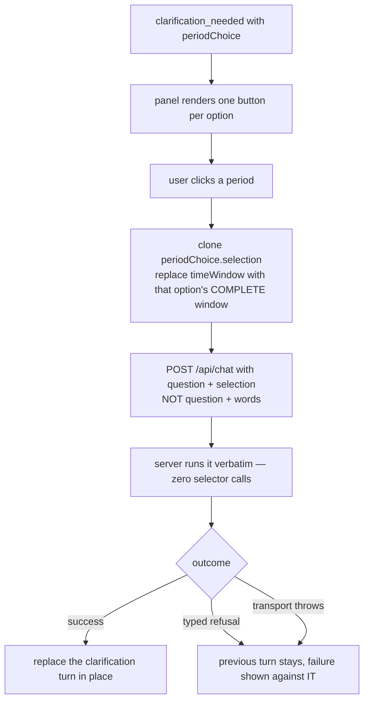

# Task — ask-period-continuation

Story: `ask-period-control` · plan: `plans/active/ask-period-control-recoverable-periods-in-ask.md`

## Objective
Let a clicked period reach the warehouse as **data**, not as words. Task 1 shipped the server side:
a statement ask with no period now returns `clarification_needed` carrying `periodChoice` — verified
live, 3/3, prompt *"Which statement period should this answer use?"*, options `['2026-07-01']`,
FY-YTD correctly excluded. Nothing renders it, so the user still sees nothing they can click.

This task renders that choice, continues deterministically, and gives `use-ask` the per-turn state
that holding a previous answer through pending and failure requires.

## Workflow



## Contract

### Render the choice, do not disturb the old one
A `clarification_needed` response carrying `periodChoice` renders `periodChoice.prompt` and one
button per `periodChoice.options` entry, labelled `option.label`.

The existing `clarify.options` / `resumesQuestion` path at `ask-panel.tsx:131-141` **stays exactly as
it is** — `requiredTimeWindowClarify` and `domainRoutingAmbiguity` still produce it, and its
word-appending behaviour is correct for them. A response carries one or the other, never both
(task 1 asserts that server-side). Decide which to render by which field is present.

### Continue with data, never with words
Clicking an option posts `AskRequest.selection`:

```
selection = { ...periodChoice.selection, timeWindow: option.timeWindow }
question  = periodChoice.question      // VERBATIM — never re-typed, never appended to
```

`api.ask` (`frontend/src/lib/api.ts:154`) already accepts `{question, selection}`. **Never build a
string like `"<question> (July 2026)"`** — measured, that route succeeds only 2/4 and 3/4, because it
sends a period the user explicitly clicked back through the model to be re-guessed.

A test asserts the **exact request body**: the cloned selection, that option's complete
`timeWindow`, and the question string unchanged.

### The turn this replaces, and what may replace it
**Correcting this contract's first draft:** it said the continuation "retains the previous answer".
There is no previous answer — the turn being replaced is a **clarification**. What must survive a
failure is the clarification itself, with its buttons.

- **Target by a stable id.** `AskTurn` (`use-ask.ts:7`) is `{question, response}` with no identity,
  so two identical questions are indistinguishable and index targeting is unsafe. Give a turn an id
  and target by it.
- **Only `success` replaces the clarification** (human round 3). Every other typed response —
  another clarification, informational, blocked, not-supported — and every transport failure is
  shown as **that turn's** failure, with the prompt and period buttons still present and re-enabled
  so the user can pick again or retry. A clicked period that comes back as a glossary definition is
  a failed click however well-typed the response is.
- **A failed click is never a dead end** (human round 2). Replacing the turn with a bare failure
  would delete the buttons the user was offered a second earlier and leave retyping the whole
  question as the only way back.
- An `AbortError` clears that turn's pending state and is **not** shown as a failure.

### Concurrency: leave it alone
**Human round 1: keep today's single-in-flight rule.** `use-ask.ts:62` rejects a second request
while one is running, and `ask-panel.tsx:66` disables the suggestions and composer from the global
`isPending`. That stays. A continuation is a warehouse query with no selector call, so the lock is
brief.

This is deliberate scope protection, not laziness: per-request controllers and per-turn pending
would rewrite cancellation and streamed-phase ownership — one `abortRef` and one phase stream become
many — and that is exactly where the existing behaviour proven by
`ask-panel.test.tsx:450` ("leaving the assistant aborts while collapsing the dock and moving to the
ask page do not") lives. Do not regress it.

So "pending" is per-turn only for **presentation**: the turn being replaced shows it is working. The
panel is still locked to one request at a time.

### The question must arrive byte-identical
`use-ask.ts:61` calls `question.trim()` on every send. `periodChoice.question` must reach the request
**exactly** as the server issued it, or the audit record shows a question the user did not ask.
The exact-body leaf **must use a `periodChoice.question` with leading and trailing whitespace** —
otherwise it passes while the trim is still corrupting the record.

### Design
`user_facing: true`. Load **emil-design-eng** and **frontend-design** and do the work with them; the
test recorder refuses this task's artifact unless `skills_used` attests both. The period buttons live
in an existing, quite dense panel — match the surrounding weight rather than introducing a new
visual idiom, and keep the pending state legible at the 360px docked width as well as the page width.

## Manual Verification
1. Backend from a worktree on this branch with `LLM_PROVIDER=bedrock`, `BEDROCK_MODEL_ID`,
   `AWS_REGION=ap-south-1` and the documented `WAREHOUSE_PG_*`. The default provider is `mock`
   (`config.ts:178`) and `MockLlmProvider` **always** returns `clarify`, so a check against it would
   appear to pass and prove nothing.
2. Sign in as `admin@example.invalid` (OTP `000000`); go to `/ask`.
3. Ask `Show the MIS statement Actual by statement leaf`. Expect the prompt and a `2026-07-01`
   button — **not** a red failure.
4. Click it. Expect 81 rows in place of the clarification, the question still reading exactly as
   typed, and no second model call (watch backend latency: a continuation is a warehouse query, so
   it should return far faster than the ~1s selector round trip).
5. Repeat 3–4 at least 3 times; this surface's failures are intermittent.
6. Check the docked panel on `/mis-reports` too — same flow, 360px column.

## Out of scope
- The period control on **successful** answers and replace-in-place from it — task 3. Task 1 already
  emits `periodControl`; leave it unrendered here.
- Any backend change. If the server looks wrong, raise a signal rather than editing it.
- Measure and dimension chips.

## Proof
`python3 factory/scripts/verify.py`, plus the required frontend leaves. Judge each by its testcase
**name**, never its executed count: a `--name` matching nothing still exits 0 and reports
`tests 1` with the **file path** as the testcase name (ledgered lesson). Run the negative control
once per leaf before trusting a green.

Register new test files where the runner will see them or CI runs none of them.
`frontend/src/features/assistant/ask-panel.tsx` and `use-ask.ts` are **not** in `.prettierignore` —
checked against the file, not assumed — so no D-0006 treatment is needed unless you touch one that is.

<!-- forge:contract -->
## Contract (recorded)

Rendered by the harness from the recorded decomposition; edit the decomposition, not this block. It is excluded from the plan's approval and grill digests, so a re-render never stales either.

**Objective.** Let a clicked period reach the warehouse as data rather than as words. Render the typed periodChoice, clone its base selection with the chosen window, post it as AskRequest.selection, and give use-ask.ts the per-turn state that holding a previous answer through pending and failure requires.

**Acceptance criteria**

- A clarification_needed response carrying periodChoice renders periodChoice.prompt and one button per option, labelled option.label. The existing clarify.options / resumesQuestion path at ask-panel.tsx:131-141 is UNCHANGED - requiredTimeWindowClarify and domainRoutingAmbiguity still produce it and its word-appending behaviour is correct for them. Which to render is decided by which field is present; task 1 asserts server-side that a response never carries both.
- Clicking an option posts AskRequest.selection built as { ...periodChoice.selection, timeWindow: option.timeWindow } with question = periodChoice.question. Never a string like '<question> (July 2026)': measured, that route succeeds only 2/4 and 3/4 because it sends a period the user explicitly clicked back through the model to be re-guessed. A test asserts the EXACT request body.
- The question reaches the request BYTE-IDENTICAL. use-ask.ts:61 calls question.trim() on every send, so the exact-body leaf MUST use a periodChoice.question carrying leading and trailing whitespace - otherwise it passes while the trim is still corrupting the audit record with a question the user did not ask.
- A turn gains a STABLE ID and the continuation targets it by that id. AskTurn (use-ask.ts:7) is {question, response} with no identity, so two identical questions are indistinguishable and index targeting is unsafe.
- ONLY a success response replaces the clarification turn. Every other typed response - another clarification, informational, blocked, not-supported - and every transport failure is shown as THAT TURN'S failure with the prompt and period buttons still present and re-enabled, so the user can pick again or retry. A clicked period that returns a glossary definition is a failed click however well-typed the response is. An AbortError clears that turn's pending state and is NOT shown as a failure.
- Concurrency is UNCHANGED: use-ask.ts:62 still rejects a second request while one runs and ask-panel.tsx:66 still disables suggestions and the composer from the global isPending. Per-turn pending is presentation only. Per-request controllers would rewrite cancellation and streamed-phase ownership, which is where the behaviour proven by ask-panel.test.tsx:450 lives; that test must still pass unchanged.
- Frontend leaves cover: rendering a periodChoice; the exact continuation request body including untrimmed whitespace; the untouched clarify.options path; a non-success typed response keeping the buttons; and a thrown transport failure keeping the buttons. Each judged by its testcase NAME, never its executed count - a --name matching nothing still exits 0 reporting 'tests 1' with the FILE PATH as the testcase name.
- user_facing: true. emil-design-eng and frontend-design are loaded and the work is done with them; the recorder refuses this task's test artifact unless skills_used attests both. The buttons live in an existing dense panel - match the surrounding weight rather than introduce a new visual idiom, and keep the pending and failure states legible at the 360px docked width as well as the page width.

**Write scope** (what `stage done` measures the diff against)

- frontend/src/features/assistant/ask-panel.tsx
- frontend/src/features/assistant/ask-panel.test.tsx
- frontend/src/features/assistant/use-ask.ts
- frontend/src/features/assistant/use-ask.test.tsx
- frontend/app/globals.css

**Required tests** (run by `stage done`)

- `a period choice renders its prompt and one button per offered period` -- `npm exec --no -- vitest run --config frontend/vitest.config.ts --reporter=junit --outputFile={report} {path} -t {id}` (frontend/src/features/assistant/ask-panel.test.tsx)
- `clicking a period posts the cloned selection and the question untrimmed` -- `npm exec --no -- vitest run --config frontend/vitest.config.ts --reporter=junit --outputFile={report} {path} -t {id}` (frontend/src/features/assistant/ask-panel.test.tsx)
- `the untouched clarify options path still appends the chosen words` -- `npm exec --no -- vitest run --config frontend/vitest.config.ts --reporter=junit --outputFile={report} {path} -t {id}` (frontend/src/features/assistant/ask-panel.test.tsx)
- `a continuation targets its turn by a stable id not by question or index` -- `npm exec --no -- vitest run --config frontend/vitest.config.ts --reporter=junit --outputFile={report} {path} -t {id}` (frontend/src/features/assistant/use-ask.test.tsx)
- `a non success typed response keeps the clarification and its period buttons` -- `npm exec --no -- vitest run --config frontend/vitest.config.ts --reporter=junit --outputFile={report} {path} -t {id}` (frontend/src/features/assistant/use-ask.test.tsx)
- `a continuation whose transport throws keeps the clarification and its period buttons` -- `npm exec --no -- vitest run --config frontend/vitest.config.ts --reporter=junit --outputFile={report} {path} -t {id}` (frontend/src/features/assistant/use-ask.test.tsx)

**Verify commands**

- `python3 factory/scripts/verify.py`

**Review budget.** 5 files / 600 lines -- Rendering one new payload, one request-body change, and per-turn state in a provider that today holds a single global pending flag. Six hermetic leaves. UI, so design skills are mandatory, but the surface is small: buttons in an existing panel plus a pending state. No backend, no contract change - task 1 shipped both.
<!-- /forge:contract -->
