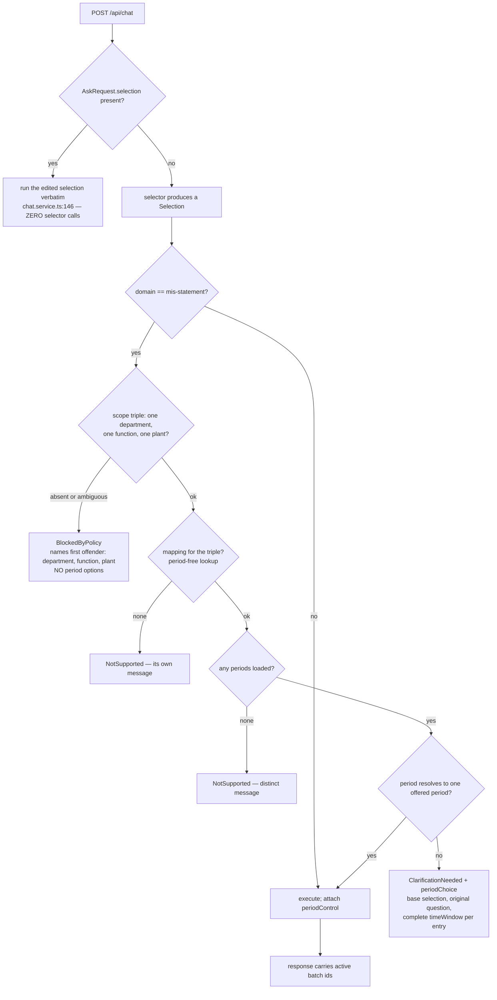

# Task — ask-period-contract-and-branch

Story: `ask-period-control` · plan: `plans/active/ask-period-control-recoverable-periods-in-ask.md`

## Objective
Turn a dead-end refusal into a recoverable clarification, on the server. Today four different causes
collapse into one `undefined` in `statementRequest` (`backend/src/chat/chat.service.ts:726`) and one
`NotSupported` message, so the product cannot say which one happened. Measured 4/4 against the
running PoC: `Show the MIS statement Actual by statement leaf` returns
*"The answer does not resolve to one statement selector set and offered period."* The same question
with a period works 6/6 with 81 rows.

Backend only. No UI — that is tasks 2 and 3. This task ships the recoverable clarification on its own.

## Workflow



## Contract

### The two carriers — exact wire shape
`contract/src/api.ts` gains one entry type and two OPTIONAL fields on `AskResponse` (a flat
optional-field interface at `:496`, so exclusivity is **asserted by test, not by the type**):

```ts
export interface AskPeriodOption {
  value: string;                 // the resolver's period value, e.g. "2026-07-01"
  label: string;                 // what the user reads
  timeWindow: { grain: TimeGrain; column: string; from: string; to: string };  // COMPLETE
}
export interface AskPeriodChoice {   // on ClarificationNeeded
  prompt: string;                    // names the missing part, in the user's words
  selection: Selection;              // the base the selector already produced
  question: string;                  // the original question, VERBATIM
  options: AskPeriodOption[];
}
export interface AskPeriodControl {  // on a successful data answer
  current: string | null;            // the `value` of the entry the answer ran on; null = no window
  options: AskPeriodOption[];
  coverage?: string;                 // present only when current is null — the honest-coverage line
}
```
`AskResponse` gains `periodChoice?: AskPeriodChoice` and `periodControl?: AskPeriodControl`. A test
asserts **no response ever carries both**.

The complete `timeWindow` is load-bearing, not a nicety — a period-less base selection has **no**
`timeWindow` at all and `Selection.timeWindow` (`contract/src/measure.ts:155`) requires `grain`, so
an entry of only `{value,label,from,to}` would force the client to invent both the grain and the
time column.

**`clarify: { options: string[], defaultOption?, resumesQuestion? }` (`contract/src/api.ts:547`) is
untouched.** `requiredTimeWindowClarify` (`ambiguity.ts:15`) and `domainRoutingAmbiguity` still use
it and must not regress. Two carriers, never one.

### Canonical window, and what "current" means
The resolver's monthly options carry `from == to == the first of the month`
(`selection-resolver.service.ts:133`), while a natural-language "July 2026" reaches
`statementPeriod` as `2026-07-01..2026-07-31`. Those are the SAME period and must compare equal, so
the task defines one canonical form and uses it everywhere:

- An emitted entry's `timeWindow` is `{ grain: "month", column: <the domain's timeColumn>,
  from: <first of month>, to: <last of month> }` — the whole month, **not** the resolver's
  `from == to` point, because the client posts this window back as a real query window.
- `current` is the entry whose canonical month equals the month of the answer's applied window.
  Compare by **month**, never by raw string: a clicked single-day period and a natural-language
  whole month must both resolve to the same `current`. Prove both.

### The four outcomes, totally ordered
`statementRequest` stops returning a bare `undefined` and returns a discriminated result naming the
failed precondition. `chat.service.ts:318-338` maps each to its own outcome, first match wins:

| # | Cause | Response | Message |
|---|---|---|---|
| 1 | department, function or plant absent **or ambiguous** | `BlockedByPolicy` | names the first offender in that order **and directs the user to an administrator**; **no period options** |
| 2 | no mapping for the resolved triple | `NotSupported` | its own message |
| 3 | no periods loaded at all | `NotSupported` | **distinct** from a missing period |
| 4 | period missing, unoffered, or spanning more than one | `ClarificationNeeded` | `periodChoice.prompt` **names the missing part**; carries the options |

Note 1 uses `BlockedByPolicy`, not `NotSupported`: scope attributes are provisioned, not
user-selectable (decision 0016), so this is a policy state an administrator resolves.

### The seam this ordering needs
`SelectionResolverService.resolve()` (`selection-resolver.service.ts:57`) finds the mapping first —
but is only reachable with a period supplied, and throws `SelectionPeriodUnavailableError` at `:68`
before it can report anything else. **So today outcomes 2 and 3 are indistinguishable.** Add a
**period-free mapping lookup** over the same `this.master.selections` data `resolve()` already
uses — not a second copy of the rule — and call it from `chat.service.ts` before consulting periods.

It **must reuse `canonicalPlant()`** (`selection-resolver.service.ts:53`). `resolve()` canonicalises
the plant before matching, so a lookup that compares the raw string would report "no mapping" for
`DUB-NUR` and the display aliases that work today. A leaf that only tests an already-canonical
`DUB` would pass while that regressed — test an alias.

**Human round:** the method goes on the **concrete `SelectionResolverService` only**, not on
`ISelectionResolverService` (`selection-resolver.interface.ts:32`). `chat.service.ts:56` injects the
concrete class, so nothing else changes and none of the six-plus test fakes breaks. The port then
describes less than the class offers; record that as a deferral with a trigger rather than leaving
it silent.

### Eligible periods
From `SelectionResolverService.options()` (`selection-resolver.service.ts:40`) — the **same** source
as the MIS Reports period dropdown, so Ask and the report screen can never disagree about which
periods exist — filtered to those the asked question can resolve. Do **not** re-derive months;
re-derivation is how the two surfaces drift apart.

Measured: the raw list includes `FY 26-27 YTD`, a twelve-month range, which is `not_supported` 4/4
for a statement because `statementPeriod` needs a single period point. An eligible list that
contains it would offer a choice guaranteed to fail.

### Who builds `periodControl` — this task, not task 3
The story plan splits C5/C6 into "server half" and "client half"; **the server half is this task**,
for BOTH domains. A frontend task cannot create data the API does not send. This task therefore
emits `periodControl` on every successful data answer — statement and governed-financial — including
the `current: null` plus `coverage` case for an answer that resolved to no window. Task 3 renders it,
replaces in place, and owns the copy. Two of this task's `required_tests` already pin the server
behaviour; this section removes the ambiguity about who owns it.

### Batch ids and determinism
The response carries the active batch ids that produced the displayed values. The determinism claim
is about **selector calls**, not stable values: under decision **0028** a re-run re-authorizes and
reads the currently active batches, so an identical choice may legitimately return different numbers
after a batch replacement. Do not write a test asserting values are stable across reloads.

## Manual Verification
1. Start the backend from this worktree with `LLM_PROVIDER=bedrock`, `BEDROCK_MODEL_ID`,
   `AWS_REGION=ap-south-1` and the documented `WAREHOUSE_PG_*`. The default provider is `mock`
   (`config.ts:178`) and `MockLlmProvider` **always** returns `clarify`, so a check against it would
   appear to pass and prove nothing.
2. Sign in as `admin@example.invalid` (OTP `000000`).
3. `POST /api/chat` with `Show the MIS statement Actual by statement leaf` — **before** this task it
   is `not_supported`; **after**, it is `clarification_needed` carrying `periodChoice` whose entries
   include `2026-07-01` and **exclude** `FY 26-27 YTD`.
4. `POST /api/chat` with `{question, selection}` cloned from that `periodChoice` with the July
   window. Expect `success` with 81 rows, and confirm the server made no selector call.
5. `POST /api/chat` with `Show the MIS statement Actual by statement leaf for July 2026` — still
   `success` 81 rows. Sample each of steps 3–5 at least 3 times; this surface's failures are
   intermittent and a single run proves nothing.

## Out of scope
- Any UI. No `ask-panel.tsx`, no `use-ask.ts`, no CSS.
- Letting a user choose among several granted plants, departments or functions.
- A typed response DTO for `/api/chat` — deferred as **D-0046** under decision 0012.
- `requiredTimeWindowClarify`'s day-range options.

## Proof
`python3 factory/scripts/verify.py`, plus the eleven hermetic leaves in `required_tests`. Judge every
one by its junit testcase **name** and **executed count**, never an exit code (D-0024, D-0031).
Register new test files in `backend/package.json` **and** `tools/quality-gate.test.mjs` or CI runs
none of them.

**Run the negative control before trusting any green.** `tools/junit-run.mjs` reports success when
its `--name` filter matches NOTHING, so a typo in a leaf id is indistinguishable from a pass. For
each of the eleven leaves, once: run it with a deliberately wrong `--name` and confirm the report
shows **zero executed**, then run it with the real name and confirm the count is non-zero and the
testcase name appears. A leaf whose executed count is zero has not run, whatever the exit code
says (D-0024, D-0031).

Under **D-0006**, `backend/src/chat/chat.constants.ts` is in `.prettierignore` with a pinned baseline
hash. The new messages belong there, so format it, remove the path from `.prettierignore`, and drop
its `ignoredBaselineHashes` entry in `tools/quality-gate.test.mjs` **in this same change**.
`chat.service.ts`, `contract/src/api.ts` and `selection-resolver.service.ts` are **not** ignored —
checked against the file, not assumed. Note `prettier --write` on a still-ignored path is a silent
no-op and `--check` reports it clean having matched nothing: remove the entry first, then format.

<!-- forge:contract -->
## Contract (recorded)

Rendered by the harness from the recorded decomposition; edit the decomposition, not this block. It is excluded from the plan's approval and grill digests, so a re-render never stales either.

**Objective.** Turn a dead-end refusal into a recoverable clarification, on the server. Today four different causes - an absent or ambiguous scope triple, no mapping, no loaded periods, and a missing period - all collapse into one undefined in statementRequest and one NotSupported message, so the product cannot say which one happened. Add the two typed response carriers, the period-free mapping lookup the ordering needs, and the four ordered outcomes. Ships the recoverable clarification on its own; the UI is tasks 2 and 3.

**Acceptance criteria**

- AskResponse gains TWO optional fields sharing one entry type: periodChoice on a ClarificationNeeded response and periodControl on a successful data response. Two carriers, never one, so a recovery and a settled answer cannot be confused. The existing clarify { options: string[], resumesQuestion } at contract/src/api.ts:547 is UNTOUCHED - requiredTimeWindowClarify (ambiguity.ts:15) and domainRoutingAmbiguity still use it and must not regress.
- Each period entry carries a COMPLETE timeWindow - grain, column, from, to - plus value and label. The complete window is required, not a nicety: a period-less base selection has no timeWindow at all, and Selection.timeWindow (contract/src/measure.ts:155) requires grain, so an entry of only {value,label,from,to} would force the client to invent both the grain and the time column. periodChoice also carries the base Selection the selector already produced and the original question verbatim.
- Choosing an offered period issues EXACTLY ZERO selector calls, proven on the SERVER where the claim lives: a hermetic ChatService test over a fake LlmProvider counts one select() call for the original question and ZERO for a request carrying AskRequest.selection. chat.service.ts:146 already runs an edited selection verbatim; this task proves it, and a frontend test could never carry this claim.
- The four causes that today collapse into one undefined resolve in a fixed, first-match-wins order, each with its own response class and message, and ONLY THE LAST offers period options: (1) scope - any of department, function, plant absent OR ambiguous - BlockedByPolicy naming the first offending attribute in that order; (2) no mapping for the resolved triple - NotSupported, its own message; (3) no periods loaded at all - NotSupported, a message DISTINCT from a missing period; (4) period missing, unoffered, or spanning more than one - ClarificationNeeded carrying periodChoice.
- That order needs a seam the resolver does not have. SelectionResolverService.resolve() (selection-resolver.service.ts:57) finds the mapping first but is only reachable with a period supplied, and throws SelectionPeriodUnavailableError at :68 before it can report anything else - so today 'no mapping' and 'no periods loaded' are indistinguishable. This task adds a PERIOD-FREE mapping lookup over the same master data resolve() already uses, and chat.service.ts calls it before consulting periods. statementRequest (chat.service.ts:726) stops returning a bare undefined and returns a discriminated result naming which precondition failed.
- Eligible periods come from SelectionResolverService.options() (selection-resolver.service.ts:40) - the SAME source as the MIS Reports period dropdown, so Ask and the report screen can never disagree about which periods exist - filtered to those the asked question can actually resolve. Measured: offering the raw list would include FY 26-27 YTD, a twelve-month range, which is not_supported 4/4 for a statement because statementPeriod needs a single period point.
- A re-run's response carries the active batch ids that produced the displayed values. The determinism claim is about SELECTOR CALLS, not about values being stable across reloads: under decision 0028 a re-run re-authorizes and reads the currently active batches, so an identical choice may legitimately return different numbers after a batch replacement.
- Hermetic tests over a fake provider and warehouse cover the backend half of the whole matrix, not a sample: missing period; a same-day period that is NOT among the offered ones; a partial-month range; a multi-month range; an empty period list; each of department, function and plant absent AND ambiguous; no mapping; a successful statement answer; a successful governed answer with a window; a successful governed answer with no window. Judged by junit testcase NAME and executed count, never an exit code (D-0024, D-0031).
- New backend test files are registered in backend/package.json and tools/quality-gate.test.mjs, or CI runs none of them. The new failure messages belong in backend/src/chat/chat.constants.ts, which IS listed in .prettierignore, so under D-0006 this task formats it, removes the path, and drops its ignoredBaselineHashes entry in the same change. chat.service.ts, contract/src/api.ts and selection-resolver.service.ts are NOT ignored - checked against .prettierignore, not assumed.
- Every successful data answer in BOTH domains carries periodControl built by the SERVER - statement and governed-financial - including current: null plus the coverage line for an answer that resolved to no window. The story plan's 'server half / client half' split for C5 and C6 means the server half is THIS task: a frontend task cannot create data the API does not send. Task 3 renders it, replaces in place, and owns the copy.

**Write scope** (what `stage done` measures the diff against)

- .prettierignore
- backend/package.json
- backend/src/chat/ask-period.test.ts
- backend/src/chat/chat.constants.ts
- backend/src/chat/chat.service.test.ts
- backend/src/chat/chat.service.ts
- backend/src/mapping/selection-resolver.service.test.ts
- backend/src/mapping/selection-resolver.service.ts
- contract/src/api.ts
- tools/quality-gate.test.mjs

**Required tests** (run by `stage done`)

- `a statement question with no period clarifies with the offered periods instead of refusing` -- `TS_NODE_PROJECT=backend/tsconfig.json TS_NODE_TRANSPILE_ONLY=1 node tools/junit-run.mjs --file {path} --name {id} --report {report} --require ts-node/register` (backend/src/chat/ask-period.test.ts)
- `the period choice carries the base selection the original question and a complete time window per entry` -- `TS_NODE_PROJECT=backend/tsconfig.json TS_NODE_TRANSPILE_ONLY=1 node tools/junit-run.mjs --file {path} --name {id} --report {report} --require ts-node/register` (backend/src/chat/ask-period.test.ts)
- `a request carrying an edited selection makes zero selector calls` -- `TS_NODE_PROJECT=backend/tsconfig.json TS_NODE_TRANSPILE_ONLY=1 node tools/junit-run.mjs --file {path} --name {id} --report {report} --require ts-node/register` (backend/src/chat/ask-period.test.ts)
- `an unoffered same day period a partial month and a multi month range each clarify` -- `TS_NODE_PROJECT=backend/tsconfig.json TS_NODE_TRANSPILE_ONLY=1 node tools/junit-run.mjs --file {path} --name {id} --report {report} --require ts-node/register` (backend/src/chat/ask-period.test.ts)
- `each of department function and plant absent or ambiguous blocks by policy naming the first offender` -- `TS_NODE_PROJECT=backend/tsconfig.json TS_NODE_TRANSPILE_ONLY=1 node tools/junit-run.mjs --file {path} --name {id} --report {report} --require ts-node/register` (backend/src/chat/ask-period.test.ts)
- `no mapping and no periods loaded keep distinct outcomes and neither reads as a missing period` -- `TS_NODE_PROJECT=backend/tsconfig.json TS_NODE_TRANSPILE_ONLY=1 node tools/junit-run.mjs --file {path} --name {id} --report {report} --require ts-node/register` (backend/src/chat/ask-period.test.ts)
- `a successful answer carries a period control whose current entry is the window it ran on` -- `TS_NODE_PROJECT=backend/tsconfig.json TS_NODE_TRANSPILE_ONLY=1 node tools/junit-run.mjs --file {path} --name {id} --report {report} --require ts-node/register` (backend/src/chat/ask-period.test.ts)
- `a governed answer with no window carries no defaulted period control` -- `TS_NODE_PROJECT=backend/tsconfig.json TS_NODE_TRANSPILE_ONLY=1 node tools/junit-run.mjs --file {path} --name {id} --report {report} --require ts-node/register` (backend/src/chat/ask-period.test.ts)
- `a rerun response carries the active batch ids that produced its values` -- `TS_NODE_PROJECT=backend/tsconfig.json TS_NODE_TRANSPILE_ONLY=1 node tools/junit-run.mjs --file {path} --name {id} --report {report} --require ts-node/register` (backend/src/chat/ask-period.test.ts)
- `the period free mapping lookup reports a mapped triple without being given a period` -- `TS_NODE_PROJECT=backend/tsconfig.json TS_NODE_TRANSPILE_ONLY=1 node tools/junit-run.mjs --file {path} --name {id} --report {report} --require ts-node/register` (backend/src/mapping/selection-resolver.service.test.ts)
- `eligible periods exclude a multi month range that a statement cannot resolve` -- `TS_NODE_PROJECT=backend/tsconfig.json TS_NODE_TRANSPILE_ONLY=1 node tools/junit-run.mjs --file {path} --name {id} --report {report} --require ts-node/register` (backend/src/mapping/selection-resolver.service.test.ts)

**Verify commands**

- `python3 factory/scripts/verify.py`

**Review budget.** 10 files / 900 lines -- Two optional response fields and one shared entry type in the contract, statementRequest becoming a discriminated result, a period-free mapping lookup on the resolver so 'no mapping' and 'no periods loaded' can be told apart, the four-way ordered branch with its own message per cause in chat.constants.ts, and eligible-period filtering from options(). Eleven hermetic leaves. No UI. D-0006 de-listing of chat.constants.ts accounts for part of the line count because formatting an ignored file rewrites it.
<!-- /forge:contract -->
