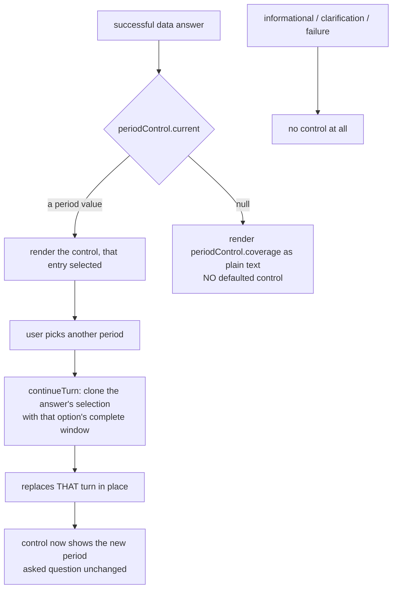

# Task — ask-period-control-on-answers

Story: `ask-period-control` · plan: `plans/active/ask-period-control-recoverable-periods-in-ask.md`

## Objective
Let any settled answer move to another period without retyping the question. The last piece: task 1
already emits `periodControl` on every successful data answer, task 2 already built
`continueTurn(turnId, question, selection)` and proved the deterministic path. **Nothing renders
`periodControl` — `grep` finds zero references in `ask-panel.tsx`.** So the data is on the wire and
the machinery is in place; this task is the surface.

## Workflow



## Contract

### The control, on successful answers only
A response whose `responseClass` is `success` and which carries `periodControl` renders it:

- `periodControl.current` names the `value` of the entry the answer actually ran on; that entry is
  the selected one.
- `periodControl.options` are the alternatives.
- Informational, clarification and failure responses render **no** control. A clarification's
  `periodChoice` is the recovery task 2 built, not a control — do not conflate them.

### A no-window answer says so, and offers nothing
When `periodControl.current` is `null`, render `periodControl.coverage` as plain text and **no
defaulted control**. This case is real and measured: `Show Actual and Budget by GL code` succeeds
with no time window at all and sums every loaded month. Defaulting a control there would invent a
period the answer never used.

### Changing a period replaces that answer in place
Picking another option calls `continueTurn(turn.id, turn.question, selection)` where

```
selection = { ...response.selection, timeWindow: option.timeWindow }
```

`continueTurn` (`use-ask.ts:97`) already does the rest: it marks only that turn pending, keeps the
previous response through the flight, attaches a typed refusal or a thrown transport failure to that
turn, and only replaces on success. **Do not reimplement any of that** — task 2 shipped and proved
it. If it needs a change, raise a signal.

### The period switch never changes the question — and that is the whole claim
**Correcting this contract's first draft.** It said the question stays "exactly as typed". That is
already false: `use-ask.ts:86` stores `question: trimmed`, so leading and trailing whitespace is
dropped the moment anyone asks anything, on every path. Human round: narrow the claim to what is
true rather than widen the task into the shared ask path for a whitespace difference.

The guarantee is: **a period switch re-sends exactly what the turn holds and never rewrites it.**
`turn.question` passes to `continueTurn` untouched, so someone who asked "for July 2026" and
switches to August keeps their wording while the control carries the period now shown. The turn's
question was trimmed once when it was asked; nothing here trims, rebuilds or appends to it.

### The control shape
A compact **labelled native `<select>`** ("Period"), `value` bound to `periodControl.current`. Not
the `.ask-options` pill buttons task 2 uses for the recovery: those style an unselected pill and have
no selected state, and a settled answer needs to SHOW which period it is on, not offer a row of
equal choices. A native select gives a real selected entry, keyboard and screen-reader behaviour for
free, and fits the 360px dock without competing with the result.

### Pending and failure on a SETTLED answer
`SuccessAnswer` (`ask-panel.tsx:193`) takes only `response` today, so `turn.isPending` and
`turn.error` — which `continueTurn` already sets — reach it nowhere. A period switch would show
neither that it was working nor why it failed. Pass the turn through and render both, the way the
clarification branch already does at `:141-167`. This is presentation of state that already exists,
not new state.

### Locking, consistently
The panel disables its suggestions and composer from the global `isPending` (`ask-panel.tsx:72,110`).
The period control must do the same. Otherwise a control on a second answer stays clickable while
another request is in flight, `continueTurn` silently rejects it (`use-ask.ts:98` returns false), and
the user gets no feedback at all.

### Design
`user_facing: true`. Load **emil-design-eng** and **frontend-design** and do the work with them; the
recorder refuses this task's test artifact unless `skills_used` attests both. The control sits under
an answer that may already carry a totals strip, a table and a provenance disclosure, and the panel
has two widths — the 360px docked column and the page. Match the surrounding weight; a period
switcher is a quiet control, not a headline.

## Manual Verification
1. Backend and frontend from a worktree on this branch with `LLM_PROVIDER=bedrock`,
   `BEDROCK_MODEL_ID`, `AWS_REGION=ap-south-1` and the documented `WAREHOUSE_PG_*`. The default
   provider is `mock` (`config.ts:178`) and `MockLlmProvider` **always** returns `clarify`, so a
   check against it would appear to pass and prove nothing.
2. Sign in as `admin@example.invalid` (OTP `000000`).
3. Ask `Show the MIS statement Actual by statement leaf for July 2026`. Expect 81 rows **and** a
   period control showing `2026-07-01`.
4. Ask `Show Actual and Budget by GL code` (no period). Expect the coverage sentence and **no**
   defaulted control.
5. Ask `Show Actual and Budget by GL code for July 2026`. Expect a control showing the July window.
6. Repeat 3–5 at least 3 times; this surface's failures are intermittent.
7. Check the docked panel on `/mis-reports` at its 360px width.

## Out of scope
- Any backend change. Task 1 emits `periodControl`; if it looks wrong, raise a signal.
- `continueTurn`'s pending, failure and replacement semantics — task 2 shipped and proved them.
- Measure and dimension chips; the provenance disclosure's batch ids (deferred, D-0046).

## Proof
`python3 factory/scripts/verify.py`, plus the required leaves.

**Two leaves must be adversarial or they prove nothing.** The "no control" leaf must build
informational, clarification and failure fixtures that DELIBERATELY carry a `periodControl` —
`AskResponse` is a flat optional interface, so a renderer that ignores `responseClass` passes a
fixture that simply omits the field. And the click leaf must not assert only on the eventual API
request: that cannot tell `continueTurn` from a prohibited direct `api.ask` call. It must also prove
the continuation behaviour reaches the screen — targeted in-place pending, the previous answer
retained, and a visible failure. For a **vitest** leaf the
discriminator is the testcase being **present AND NOT `<skipped/>` AND NOT `<failure/>`** — a
matching NAME proves nothing, because vitest lists every test in the file under its real name and
marks the ones its `-t` filter missed as skipped (ledgered lesson; a control proved it). Run the
negative control once before trusting a green.

`tests.json` automated status must be exactly **`passed`**, not `pass`, or the shipped-task proof
gate refuses the PR (ledgered lesson). Run
`python3 factory/scripts/check_task_proof.py --base origin/master` **after committing** and before
pushing.

`ask-panel.tsx` and `globals.css` are **not** in `.prettierignore` — checked against the file, not
assumed.

<!-- forge:contract -->
## Contract (recorded)

Rendered by the harness from the recorded decomposition; edit the decomposition, not this block. It is excluded from the plan's approval and grill digests, so a re-render never stales either.

**Objective.** Let any settled answer move to another period without retyping the question. Show the period each successful answer ran on in both domains, replace in place on change without rewriting the asked question, and state honest coverage for an answer that resolved to no window at all.

**Acceptance criteria**

- A response whose responseClass is success and which carries periodControl renders it as a compact labelled native <select> ('Period') with value bound to periodControl.current. NOT the .ask-options pill buttons task 2 uses for the recovery: those style an unselected pill and have no selected state, while a settled answer must SHOW which period it is on. A native select also gives keyboard and screen-reader behaviour for free and fits the 360px dock.
- Informational, clarification and failure responses render NO period control, and the leaf proving it uses fixtures that DELIBERATELY carry a periodControl - AskResponse is a flat optional interface, so a renderer that ignores responseClass passes a fixture that merely omits the field.
- When periodControl.current is null the answer renders periodControl.coverage as plain text and NO defaulted control. Measured: 'Show Actual and Budget by GL code' succeeds with no time window at all and sums every loaded month, so defaulting a control there would invent a period the answer never used.
- Picking another option calls continueTurn(turn.id, turn.question, { ...response.selection, timeWindow: option.timeWindow }) and nothing else. continueTurn (use-ask.ts:97) already marks only that turn pending, keeps the previous response through the flight, attaches a typed refusal or a thrown transport failure to that turn, and replaces ONLY on success - task 2 shipped and proved it, so none of it is reimplemented.
- A period switch NEVER CHANGES the question: turn.question passes to continueTurn untouched - not trimmed, rebuilt or appended to. The contract's first draft claimed the question stays 'exactly as typed'; that was already false because use-ask.ts:86 stores question: trimmed on every path. Human round narrowed the claim to what is true rather than widening this task into the shared ask path.
- SuccessAnswer renders turn.isPending and turn.error. It takes only `response` today (ask-panel.tsx:193), so the state continueTurn already sets reaches it nowhere and a period switch would show neither that it was working nor why it failed. This is presentation of existing state, mirroring the clarification branch at ask-panel.tsx:141-167.
- The period control is disabled while the panel is globally pending, as the suggestions and composer already are (ask-panel.tsx:72,110). Otherwise a control on a second answer stays clickable during another request, continueTurn silently returns false (use-ask.ts:98), and the user gets no feedback.
- The click leaf does not assert only on the eventual API request - that cannot distinguish continueTurn from a prohibited direct api.ask call. It also proves the continuation behaviour reaches the screen: targeted in-place pending, the previous answer retained, and a visible failure.
- The control appears in BOTH semantic domains - a statement answer offering the loaded months, a governed-financial answer offering the same months plus the window it ran on.

**Write scope** (what `stage done` measures the diff against)

- frontend/src/features/assistant/ask-panel.tsx
- frontend/src/features/assistant/ask-panel.test.tsx
- frontend/app/globals.css

**Required tests** (run by `stage done`)

- `a successful statement answer renders its period select with the period it ran on selected` -- `npm exec --no -- vitest run --config frontend/vitest.config.ts --reporter=junit --outputFile={report} {path} -t {id}` (frontend/src/features/assistant/ask-panel.test.tsx)
- `a successful governed answer with a window renders its period select` -- `npm exec --no -- vitest run --config frontend/vitest.config.ts --reporter=junit --outputFile={report} {path} -t {id}` (frontend/src/features/assistant/ask-panel.test.tsx)
- `a successful answer with no window shows its coverage and no period select` -- `npm exec --no -- vitest run --config frontend/vitest.config.ts --reporter=junit --outputFile={report} {path} -t {id}` (frontend/src/features/assistant/ask-panel.test.tsx)
- `a non success response carrying a period control still renders no period select` -- `npm exec --no -- vitest run --config frontend/vitest.config.ts --reporter=junit --outputFile={report} {path} -t {id}` (frontend/src/features/assistant/ask-panel.test.tsx)
- `picking another period calls continue turn with the cloned selection and the unchanged question` -- `npm exec --no -- vitest run --config frontend/vitest.config.ts --reporter=junit --outputFile={report} {path} -t {id}` (frontend/src/features/assistant/ask-panel.test.tsx)
- `a pending period switch shows on its own answer and a failed one keeps the answer and shows why` -- `npm exec --no -- vitest run --config frontend/vitest.config.ts --reporter=junit --outputFile={report} {path} -t {id}` (frontend/src/features/assistant/ask-panel.test.tsx)
- `the period select is disabled while the panel is globally pending` -- `npm exec --no -- vitest run --config frontend/vitest.config.ts --reporter=junit --outputFile={report} {path} -t {id}` (frontend/src/features/assistant/ask-panel.test.tsx)

**Verify commands**

- `python3 factory/scripts/verify.py`

**Review budget.** 3 files / 450 lines -- Rendering one payload that already arrives, wired to a continuation API that already exists and is already proven. Five hermetic leaves. UI, so design skills are mandatory, across two panel widths. No backend, no contract change, and no new state machinery - tasks 1 and 2 shipped both.
<!-- /forge:contract -->
