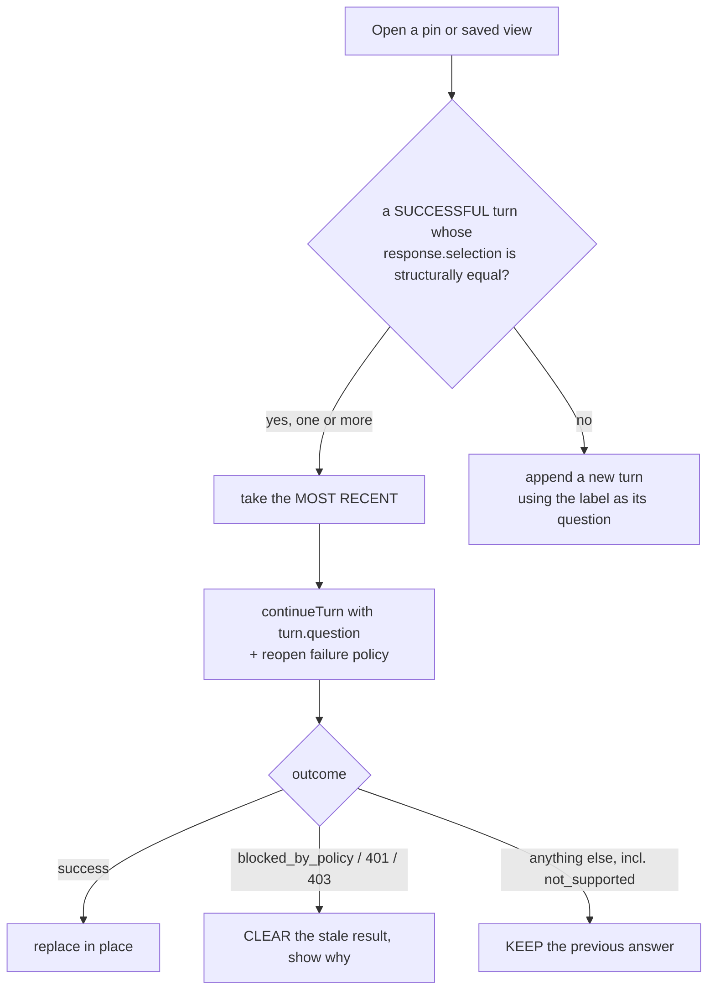

# Task — reopen-identity-and-policy

Story: `ask-reopen-saved-report` · plan: `plans/active/ask-reopen-saved-report-reopening-a-saved-report-returns-to-its-answer.md`

## Objective
Stop appending a duplicate turn every time a saved report is opened, and make the failure policy
something the caller states rather than something one caller imposes on another.

`pinned-reports.tsx:67` calls `rerun(...)` → `run(question, selection)` (`use-ask.ts:147`) →
`use-ask.ts:86` appends unconditionally. `saved-views.tsx:64` does the same. Nothing looks for an
existing turn.

Backend untouched. Navigation, the immediate pending turn and the scroll are **task 2**.

## Workflow

## Contract

### Identity is the selection, never the title
A new pure module - named `.helper.ts` per the constitution's Helper convention for stateless,
IO-free utility logic (`constitution/pnp-coding-standards-modular-monolith.md` §3.2) - `frontend/src/features/exploration/selection-identity.helper.ts`, exporting
`sameSelection(a: Selection, b: Selection): boolean`. **Strict structural equality** over `domain`,
`measureIds`, `dimensionIds`, `filters`, `timeWindow` and `limit` — including optional fields and
array order. No normalising, no field skipping.

**Why not the title.** The open paths pass `selectionLabel(selection).title`, which is
`measures.join(" · ")` (`selection-label.ts`). A pin of *Actual and Budget by GL code for July* and
a pin of *Actual and Budget by month* are **both** `Actual · Budget`. Matching on it merges
unrelated reports.

**Candidates** are turns whose response was a `success` and which carry `response.selection` —
nothing else holds a selection to compare. **When several match, the most recent wins.**

**A pin predating a normalised `timeWindow` is NOT equal** and opens as a new turn. The spec's
first draft claimed it would still match; the client holds only `pin.selection` and a turn's
`response.selection`, so that is unsupportable — and ignoring the window to force a match would
match the **wrong period**. This is the honest behaviour, not a gap.

### The re-run sends the turn's own question
A matched turn re-runs with **`turn.question`**. `continueTurn` displays the turn's question but
**sends the one it is given**, so passing the label would display the user's wording while auditing
`Actual · Budget` — a question nobody asked. **Assert the request body**, not the outcome.
A **new** turn still uses the label; there is no better text.

### The caller states the failure policy
`continueTurn` gains a **required** policy argument. `ask-panel.tsx` is therefore **in scope** and
its two shipped period-control calls pass `"retain"` explicitly: a mandatory argument with the
existing callers left alone would not type-check, and a defaulted one would recreate the implicit
policy this task exists to remove. Their behaviour does not change - only the call sites become
explicit. Two callers, two behaviours, one seam:

| caller | on refusal |
| --- | --- |
| period control (**shipped**) | **retains** the previous answer — unchanged |
| saved-report reopen | **clears** on access refusals |

**Clears on exactly two signals:** `blocked_by_policy`, and a terminal HTTP **401/403**.
**Everything else keeps the answer, including `not_supported`.**

That last one looks like an omission and is not. A revoked domain or measure grant returns
`not_supported` (`chat.service.ts:245`) — but so do *"No mapping configured"* (`:337`) and *"no
periods loaded"*, and the response carries only a class and human copy, no reason code
(`contract/src/api.ts:515`). Clearing on it would wipe good answers for reasons that say nothing
about entitlement. Human round chose to narrow the rule; the residual gap — losing one measure's
grant leaves stale numbers until reload — is deferral **D-0048**. Do not "fix" this.

Terminal 401/403 uses **generic** copy: `ApiError` retains only the status, not server text.

### Clearing means the result is GONE, not hidden
`AskTurn` holds an `AskResponse`, and the renderer draws from it (`ask-panel.tsx:129`). Setting
`turn.error` alone leaves the successful response in place, **so the old numbers still render** -
the leak would survive the fix. A cleared turn must carry a **result-free renderable state**: the
response it holds no longer has a result to draw, and the turn shows the refusal instead. A leaf
must assert the numbers are **absent from the DOM**, not merely that an error string appeared.

### Do not break what shipped
`ask-period-control`'s leaf — *"a continuation refused by the server keeps the previous answer and
shows the failure against it"* — must pass **unmodified**. If it needs editing, the policy leaked
instead of being stated by the caller. A leaf in this task re-asserts it.

## Manual Verification
1. Backend and frontend from a worktree on this branch with `LLM_PROVIDER=bedrock`,
   `BEDROCK_MODEL_ID`, `AWS_REGION=ap-south-1` and the documented `WAREHOUSE_PG_*`. The default is
   `mock` (`config.ts:178`) and `MockLlmProvider` **always** returns `clarify`, so a check against
   it would appear to pass and prove nothing.
2. Ask something that succeeds, pin it, then open that pin from the Dashboard **twice**.
3. Expect **one** turn in the thread, its numbers refreshed. Before this task there were three.
4. Pin a second report with the same measures but a different breakdown — both show as
   `Actual · Budget`. Open both. Expect **two** distinct turns, not one being reused.
5. Repeat at least 3 times; this surface's failures are intermittent.

## Out of scope
- Navigation order, the immediate pending turn, `scrollIntoView` — task 2.
- Any backend or contract change. If the server looks wrong, raise a signal.
- `continueTurn`'s pending and replace-on-success semantics.

## Proof
`python3 factory/scripts/verify.py`, plus the required leaves. For a **vitest** leaf the
discriminator is the testcase **present AND NOT `<skipped/>` AND NOT `<failure/>`** — a matching
NAME proves nothing, because vitest lists every test in the file under its real name and marks the
ones its `-t` filter missed as skipped (ledgered lesson; a control proved it). Run the negative
control once before trusting a green.

The identity leaves must cover **every field**, not a sample: `domain`, `measureIds`,
`dimensionIds`, `filters`, `limit`, optional `timeWindow` fields, and **array order** — a
comparison that ignores any one of them matches the wrong report. A separate leaf proves that
**non-success responses carrying a `selection` are excluded** as candidates.

**Both Open entry points are proven against a MATCHED turn.** The hook leaves can pass while one
route still bypasses matching, and the existing component tests only cover an empty thread.

`tests.json` automated status must be exactly **`passed`**, not `pass`, and run
`python3 factory/scripts/check_task_proof.py --base origin/master` **after committing** — the gate
reads the committed tree (ledgered lesson).

This task is **`user_facing: true`**: it changes the Open flow and what a refused reopen displays,
so **emil-design-eng** and **frontend-design** are mandatory and the recorder refuses the artifact
without both in `skills_used`.

`use-ask.ts`, `ask-panel.tsx`, `pinned-reports.tsx` and `saved-views.tsx` are **not** in
`.prettierignore` — checked against the file, not assumed.

<!-- forge:contract -->
## Contract (recorded)

Rendered by the harness from the recorded decomposition; edit the decomposition, not this block. It is excluded from the plan's approval and grill digests, so a re-render never stales either.

**Objective.** Stop appending a duplicate turn every time a saved report is opened. Find the existing turn by its resolved Selection - never the displayed title, which is only the measure names - re-run it in place, and give continueTurn a caller-stated failure policy so a reopen can clear on access refusals without changing the period control's shipped retain-on-refusal behaviour. No visual change; the navigation and scroll are task 2.

**Acceptance criteria**

- Opening a saved report whose resolved Selection already has a SUCCESSFUL turn re-runs that turn and appends nothing; thread length unchanged. Candidates are successful turns carrying response.selection - nothing else holds a selection to compare.
- Identity is STRICT STRUCTURAL EQUALITY over domain, measureIds, dimensionIds, filters, timeWindow and limit, including optional fields and array order - never the displayed title. selectionLabel().title is only measures.join(' · '), so a pin by GL code and a pin by month are both 'Actual · Budget'. A leaf opens two reports sharing a title but differing in dimensions and asserts TWO distinct turns.
- A pin whose selection predates a normalised timeWindow is NOT equal and opens as a new turn. The spec's first draft claimed it would still match; that is unsupportable with the data the client holds - only pin.selection and a turn's response.selection - and ignoring the window to force a match would match the WRONG period.
- When several successful turns carry that selection, the MOST RECENT is the one re-run.
- A matched turn re-runs with turn.question, asserted on the REQUEST BODY. The existing paths pass selectionLabel().title, so auditing 'Actual · Budget' while displaying the user's real wording would put a question in the record nobody asked. A new turn uses the label, because no better text exists.
- A reopen refused for access clears the stale result and shows the reason, and the ONLY two signals that qualify are blocked_by_policy and a terminal HTTP 401/403 - the only refusals the client can recognise. Everything else KEEPS the answer, INCLUDING not_supported: a revoked domain or measure grant returns it (chat.service.ts:245) but so do 'No mapping configured' (:337) and 'no periods loaded', and the response carries no reason code (contract/src/api.ts:515). The display-lifetime limit this creates is recorded in the 2026-09-15 AMENDMENT to decision 0028 and tracked as D-0048 - a deferral alone could not override an accepted decision.
- THE PERIOD CONTROL IS UNCHANGED. ask-period-control requires a refused period switch to RETAIN the previous answer and proves it with a shipped leaf that must pass UNMODIFIED. Both paths use the same continueTurn seam, so the CALLER states which failure policy it wants rather than one silently overriding the other.
- CLEARING MEANS THE RESULT IS GONE, NOT HIDDEN. AskTurn holds an AskResponse and the renderer draws from it (ask-panel.tsx:129), so setting turn.error alone leaves the successful response in place and the old numbers still render - the leak would survive the fix. A cleared turn carries a result-free renderable state, and a leaf asserts the numbers are ABSENT FROM THE DOM, not merely that an error string appeared.
- continueTurn's policy argument is REQUIRED, so ask-panel.tsx is in scope and its two shipped period-control calls pass 'retain' explicitly. A mandatory argument with the existing callers untouched would not type-check, and a defaulted one would recreate the implicit policy this task removes. Their behaviour does not change.
- The helper is named selection-identity.helper.ts, per the constitution's Helper convention for stateless, IO-free utility logic (pnp-coding-standards-modular-monolith.md section 3.2).
- user_facing: true - the Open flow and the displayed refusal both change - so emil-design-eng and frontend-design are loaded and the work done with them; the recorder refuses the test artifact unless skills_used attests both.

**Write scope** (what `stage done` measures the diff against)

- frontend/src/features/assistant/ask-panel.tsx
- frontend/src/features/assistant/use-ask.ts
- frontend/src/features/assistant/use-ask.test.tsx
- frontend/src/features/exploration/pinned-reports.tsx
- frontend/src/features/exploration/pinned-reports.test.tsx
- frontend/src/features/exploration/saved-views.tsx
- frontend/src/features/exploration/saved-views.test.tsx
- frontend/src/features/exploration/selection-identity.helper.ts
- frontend/src/features/exploration/selection-identity.helper.test.ts

**Required tests** (run by `stage done`)

- `selections differing in any single field are not equal` -- `npm exec --no -- vitest run --config frontend/vitest.config.ts --reporter=junit --outputFile={report} {path} -t {id}` (frontend/src/features/exploration/selection-identity.helper.test.ts)
- `selections differing only in array order are not equal` -- `npm exec --no -- vitest run --config frontend/vitest.config.ts --reporter=junit --outputFile={report} {path} -t {id}` (frontend/src/features/exploration/selection-identity.helper.test.ts)
- `two reports sharing a label title but differing in dimensions are not the same selection` -- `npm exec --no -- vitest run --config frontend/vitest.config.ts --reporter=junit --outputFile={report} {path} -t {id}` (frontend/src/features/exploration/selection-identity.helper.test.ts)
- `reopening a report already answered reruns that turn and appends nothing` -- `npm exec --no -- vitest run --config frontend/vitest.config.ts --reporter=junit --outputFile={report} {path} -t {id}` (frontend/src/features/assistant/use-ask.test.tsx)
- `a non success turn carrying a selection is not a candidate` -- `npm exec --no -- vitest run --config frontend/vitest.config.ts --reporter=junit --outputFile={report} {path} -t {id}` (frontend/src/features/assistant/use-ask.test.tsx)
- `the most recent matching turn is the one rerun` -- `npm exec --no -- vitest run --config frontend/vitest.config.ts --reporter=junit --outputFile={report} {path} -t {id}` (frontend/src/features/assistant/use-ask.test.tsx)
- `a matched rerun sends the turn question not the report label` -- `npm exec --no -- vitest run --config frontend/vitest.config.ts --reporter=junit --outputFile={report} {path} -t {id}` (frontend/src/features/assistant/use-ask.test.tsx)
- `a reopen blocked by policy removes the numbers from the turn` -- `npm exec --no -- vitest run --config frontend/vitest.config.ts --reporter=junit --outputFile={report} {path} -t {id}` (frontend/src/features/assistant/use-ask.test.tsx)
- `a terminal unauthorized and a terminal forbidden both clear with generic copy` -- `npm exec --no -- vitest run --config frontend/vitest.config.ts --reporter=junit --outputFile={report} {path} -t {id}` (frontend/src/features/assistant/use-ask.test.tsx)
- `not supported and a transport failure both keep the previous answer` -- `npm exec --no -- vitest run --config frontend/vitest.config.ts --reporter=junit --outputFile={report} {path} -t {id}` (frontend/src/features/assistant/use-ask.test.tsx)
- `a refused period switch still retains the previous answer` -- `npm exec --no -- vitest run --config frontend/vitest.config.ts --reporter=junit --outputFile={report} {path} -t {id}` (frontend/src/features/assistant/use-ask.test.tsx)
- `opening a pin that matches an existing turn reruns it rather than appending` -- `npm exec --no -- vitest run --config frontend/vitest.config.ts --reporter=junit --outputFile={report} {path} -t {id}` (frontend/src/features/exploration/pinned-reports.test.tsx)
- `opening a saved view that matches an existing turn reruns it rather than appending` -- `npm exec --no -- vitest run --config frontend/vitest.config.ts --reporter=junit --outputFile={report} {path} -t {id}` (frontend/src/features/exploration/saved-views.test.tsx)

**Verify commands**

- `python3 factory/scripts/verify.py`

**Review budget.** 9 files / 900 lines -- A pure equality helper, a required failure-policy argument threaded through one seam and its two shipped call sites, and rewiring two Open handlers. Thirteen hermetic leaves, several of which exist only to pin deliberate non-obvious choices: not_supported keeps the answer, clearing removes the result rather than hiding it, and the period control is untouched. UI, so design skills are mandatory. No backend, no contract change.
<!-- /forge:contract -->
