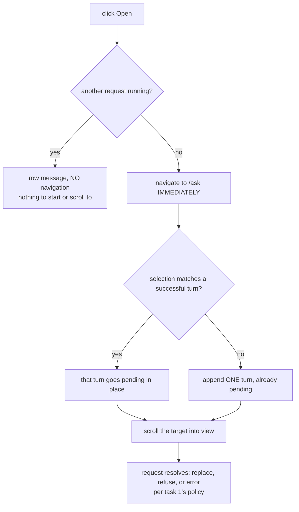

# Task — reopen-navigation-and-scroll

Story: `ask-reopen-saved-report` · plan: `plans/active/ask-reopen-saved-report-reopening-a-saved-report-returns-to-its-answer.md`

## Objective
Make the click have an instant, visible effect. Task 1 fixed the duplicate — `rerun`
(`use-ask.ts:146`) now finds the most recent successful turn whose `response.selection` is
structurally equal and continues it in place. But **the visible half of the reported bug is still
there**: both handlers `await` the whole re-run before navigating
(`pinned-reports.tsx:67`, `saved-views.tsx:64`), so the user waits on the Dashboard with no
feedback, and the panel has no scroll logic at all — `grep` for `scrollIntoView` / `scrollTo`
across `ask-panel.tsx` still returns nothing.

Task 1's seam is doing its job. Do not reimplement matching or the failure policy.

## Workflow

## Contract

### Navigate first
`router.push("/ask")` happens **before** the request completes, not after it. The user lands on the
thread, sees the target turn working, and the answer arrives under their eyes.

Today's order is `if (await rerun(...)) router.push("/ask")`. That await is why a slow click looks
inert, and why nothing can be scrolled to — there is no Ask panel mounted while the request runs.

The handlers therefore **guard `isPending` themselves**, `router.push("/ask")`, then fire `rerun`
**without awaiting**. The guard is what preserves the busy-state rule below; without it,
navigate-first would navigate to a request that was never going to start.

### The pending turn is a CLIENT state, not a fabricated server response
`AskTurn.response` is mandatory (`use-ask.ts:8`) and the panel renders from it
(`ask-panel.tsx:134`), so an unmatched open has nothing to render before the request resolves.

**Do not fabricate an `AskResponse`.** Inventing a `responseClass` the server never sent puts a lie
in the client model, and the next reader cannot tell it from a real one. Instead the turn carries a
dedicated **result-free pending state** with a `role="status"` message, and the SAME turn id is
settled when the response arrives. Confine it to reopens, so ordinary typed questions are unchanged.

### An unmatched open appends its turn immediately, already pending
`run()` (`use-ask.ts:~86`) appends only once the response resolves, so an unmatched open has
**nothing to scroll to or show working**. It must append one turn up front, in a pending state,
then settle it: replaced on success, carrying the reason on a refusal, carrying an error on a
transport failure. **One turn, not two** — this is the same turn the story's criterion counts.

A matched open needs no new turn: task 1's `rerun` already routes it through `continueTurn`, which
marks that turn pending.

### Scroll the target into view — always
Reused or new, the panel scrolls that turn into view, **even when it is already on screen** (human
round). One rule, no visibility check: the view is moving anyway because the user just arrived from
another page, and "sometimes it moves, sometimes it does not" is both harder to describe and easy
to get subtly wrong at the two panel widths.

**The handoff keeps one seam.** `rerun` returns `Promise<boolean>` and no component learns which
turn to scroll to. Rather than add a second public entry point, `rerun` records the target id
inside `AskProvider` as a **one-shot**; the page Ask panel consumes it once the target node exists,
calls `scrollIntoView`, and clears it. The provider survives `/dashboard` → `/ask` because it lives
in the authenticated layout, so no URL parameter or storage is needed.

A leaf asserts `scrollIntoView` is called for the target — **mock it**, as jsdom does not implement
it, so an unmocked call silently does nothing and a test passes without proving anything.

### Busy state: refuse, do not navigate
`useAsk` permits one request at a time (`use-ask.ts:111` and `:~72` both refuse while `isPending`).
An Open clicked during another request keeps today's behaviour exactly: the row shows its existing
*"Another question is still running"* message and there is **no navigation** — there would be no
target to start or scroll to. An explicit exception to navigate-first, not an oversight.

### Both entry points
Pins and saved views. They share the defect and must share the fix; a leaf set exercising one
leaves the other unproven.

### The refusal reads like a saved report
Task 1 wired the copy; this task is where it becomes visible. A refused reopen must not show
`continueTurn`'s period-specific string. A leaf asserts the reason reaches the screen on that turn.

## Manual Verification
1. Backend and frontend from a worktree on this branch with `LLM_PROVIDER=bedrock`,
   `BEDROCK_MODEL_ID`, `AWS_REGION=ap-south-1` and the documented `WAREHOUSE_PG_*`. The default is
   `mock` (`config.ts:178`) and `MockLlmProvider` **always** returns `clarify`, so a check against
   it would appear to pass and prove nothing.
2. Ask something that succeeds, pin it, add several more questions so the thread is long.
3. Open the pin from the Dashboard. Expect: **Ask appears immediately**, the existing turn is
   visible and working, and the view has scrolled to it — not left at the top.
4. Open it again. Still **one** turn for that report.
5. Repeat at least 3 times; this surface's failures are intermittent.

## Out of scope
- Selection matching and the failure policy — task 1 shipped and proved both.
- Scrolling for ordinary typed questions.
- Queueing an Open while another request runs.
- Any backend change.

## Proof
`python3 factory/scripts/verify.py`, plus the required leaves. For a **vitest** leaf the
discriminator is the testcase **present AND NOT `<skipped/>` AND NOT `<failure/>`** — a matching
NAME proves nothing, because vitest lists every test in the file under its real name and marks the
ones its `-t` filter missed as skipped (ledgered lesson; a control proved it).

`tests.json` automated status must be exactly **`passed`**, not `pass`, and run
`python3 factory/scripts/check_task_proof.py --base origin/master` **after committing** — the gate
reads the committed tree (ledgered lesson).

Task 1's fifteen leaves must all still pass **unmodified**. If one needs editing, this task changed
behaviour it was told not to touch.

`use-ask.ts`, `ask-panel.tsx`, `pinned-reports.tsx` and `saved-views.tsx` are **not** in
`.prettierignore` — checked against the file, not assumed.

<!-- forge:contract -->
## Contract (recorded)

Rendered by the harness from the recorded decomposition; edit the decomposition, not this block. It is excluded from the plan's approval and grill digests, so a re-render never stales either.

**Objective.** Make the click have an instant visible effect. Navigate to Ask before the request completes, append an already-pending turn when there is no match, scroll the target into view, and show the refusal reason on that turn instead of the period control's copy.

**Acceptance criteria**

- router.push('/ask') happens BEFORE the request completes, not after it. Today both handlers run `if (await rerun(...)) router.push('/ask')` (pinned-reports.tsx:67, saved-views.tsx:64), which is why a slow click looks inert and why nothing can be scrolled to - no Ask panel is mounted while the request runs.
- An unmatched open appends ONE turn IMMEDIATELY, already pending, then settles it: replaced on success, carrying the reason on a refusal, carrying an error on a transport failure. run() appends only once the response resolves, so an unmatched open otherwise has nothing to scroll to or show working. One turn, not two.
- A matched open needs no new turn: task 1's rerun (use-ask.ts:146) already routes it through continueTurn, which marks that turn pending. Matching and the failure policy are NOT reimplemented here.
- The panel scrolls the target turn into view, reused or new. AskTurn.id is the handle and already exists. A leaf asserts scrollIntoView is called for the target - it must be mocked, as jsdom does not implement it.
- An Open clicked while another request runs keeps today's behaviour EXACTLY: the row shows its existing 'Another question is still running' message and there is NO navigation, because there would be no target to start or scroll to. An explicit exception to navigate-first.
- Pins and saved views are both covered; they share the defect and must share the fix.
- A refused reopen shows its own reason on that turn and NOT continueTurn's period-specific copy. Task 1 wired it; this task is where it becomes visible.
- Task 1's fifteen leaves all still pass UNMODIFIED. If one needs editing, this task changed behaviour it was told not to touch.

**Write scope** (what `stage done` measures the diff against)

- frontend/app/globals.css
- frontend/src/features/assistant/ask-panel.test.tsx
- frontend/src/features/assistant/ask-panel.tsx
- frontend/src/features/assistant/use-ask.test.tsx
- frontend/src/features/assistant/use-ask.ts
- frontend/src/features/exploration/pinned-reports.test.tsx
- frontend/src/features/exploration/pinned-reports.tsx
- frontend/src/features/exploration/saved-views.test.tsx
- frontend/src/features/exploration/saved-views.tsx

**Required tests** (run by `stage done`)

- `opening a pin navigates before the request resolves` -- `npm exec --no -- vitest run --config frontend/vitest.config.ts --reporter=junit --outputFile={report} {path} -t {id}` (frontend/src/features/exploration/pinned-reports.test.tsx)
- `opening a saved view navigates before the request resolves` -- `npm exec --no -- vitest run --config frontend/vitest.config.ts --reporter=junit --outputFile={report} {path} -t {id}` (frontend/src/features/exploration/saved-views.test.tsx)
- `an unmatched open appends one pending turn before the response arrives` -- `npm exec --no -- vitest run --config frontend/vitest.config.ts --reporter=junit --outputFile={report} {path} -t {id}` (frontend/src/features/assistant/use-ask.test.tsx)
- `an unmatched open that fails leaves one turn carrying the error not two` -- `npm exec --no -- vitest run --config frontend/vitest.config.ts --reporter=junit --outputFile={report} {path} -t {id}` (frontend/src/features/assistant/use-ask.test.tsx)
- `the target turn is scrolled into view for a matched open` -- `npm exec --no -- vitest run --config frontend/vitest.config.ts --reporter=junit --outputFile={report} {path} -t {id}` (frontend/src/features/assistant/ask-panel.test.tsx)
- `the target turn is scrolled into view for an unmatched open` -- `npm exec --no -- vitest run --config frontend/vitest.config.ts --reporter=junit --outputFile={report} {path} -t {id}` (frontend/src/features/assistant/ask-panel.test.tsx)
- `opening while another request runs shows the busy message and does not navigate` -- `npm exec --no -- vitest run --config frontend/vitest.config.ts --reporter=junit --outputFile={report} {path} -t {id}` (frontend/src/features/exploration/pinned-reports.test.tsx)
- `a refused reopen shows its own reason and not the period copy` -- `npm exec --no -- vitest run --config frontend/vitest.config.ts --reporter=junit --outputFile={report} {path} -t {id}` (frontend/src/features/assistant/ask-panel.test.tsx)

**Verify commands**

- `python3 factory/scripts/verify.py`

**Review budget.** 9 files / 700 lines -- Reordering two Open handlers, an eager pending turn in run(), a scroll effect keyed on turn id, and the refusal copy becoming visible. Eight hermetic leaves. UI, so design skills are mandatory. No backend, no contract change, and no new matching or policy logic - task 1 shipped both and its fifteen leaves must pass untouched.
<!-- /forge:contract -->
