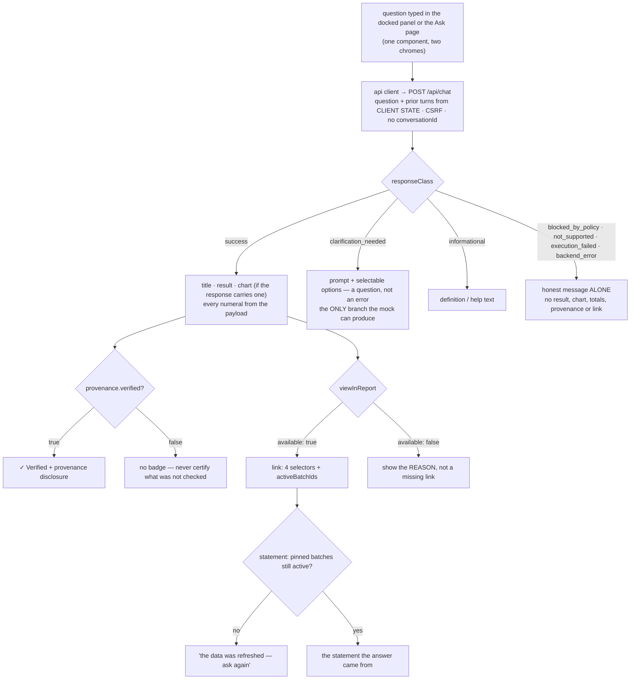

# Task plan — assistant-ask-surfaces: the docked Ask panel and the standalone Ask page

Story: assistant · Task 2 of 4 · **user_facing: true**

## Objective
Build the two Ask surfaces the prototype draws — a **docked panel** beside the MIS report and a
**standalone Ask page** — rendering the governed answer task 1 now serves, and rendering every
non-success outcome **honestly and alone**.

Frontend only: no contract change, no backend change, and no saved or pinned surface (task 4).

## Acceptance criteria (plan_contracts)
- **t-aas-c1** — both surfaces from one component; **Ask becomes a live shell destination**; the
  thread **carries across** the internal navigation but never a reload.
- **t-aas-c2** — every numeral from the response; the badge only when `verified`; **recharts**
  added per 0007, with an honest fallback for any shape it cannot draw.
- **t-aas-c3** — the union's both arms, **and** the statement side: the client's return type and
  the report view's refresh-required branch, proven where they live.
- **t-aas-c4** — all **seven** classes, which do **not** share one shape.
- **t-aas-c5** — **successful** turns only as prior turns; the api leaf asserts the exact body.
- **t-aas-c6** — ten vitest leaves, catalog-drawn seed chips, the design skills, and a live
  Success check with `BEDROCK_MODEL_ID` set.

## What already exists (grounding, file:line)
- `contract/src/api.ts:486` — `viewInReport` is a **required discriminated union**:
  `{ available: true, department, function, plant, period, activeBatchIds }` or
  `{ available: false, reason }`. Task 1 made it required precisely so the unavailable case can
  explain itself.
- `contract/src/api.ts:9` — `ResponseClass` has **seven** values: `Success`, `Informational`,
  `ClarificationNeeded`, `BlockedByPolicy`, `NotSupported`, `ExecutionFailed`, `BackendError`.
- `AskResponse` carries `title`, `chips`, `selection`, `result`, `totals`, `chartType`,
  `availableChartTypes`, `availableFields`, `provenance`, `appliedTimeWindow`, `appliedFilters`,
  `message`, `clarify`, `latencyMs`. `Provenance` carries `verified`, `measures`, `readback`,
  `scope`, `dataAsOf`, `activeBatchIds`.
- `backend/src/app.routes.test.ts:33` — `POST /api/chat` and `POST /api/chat/stream` are now
  registered and governed. **The client has no method for either yet.**
- `frontend/src/lib/api.ts:100` — the `api` object: `misOptions`, `runMisStatement`,
  `runMisDrill`, `exportMisStatement`, the auth methods. `post<T>` bootstraps CSRF and retries
  once on 401 — the shape to follow.
- `frontend/app/` — four pages: `/`, `/login`, `/(app)/mis-reports`, `/(app)/dashboard`. **There
  is no `/ask` route.**
- `frontend/src/features/` — `auth` and `mis` only. The assistant feature directory is new.
- `frontend/src/components/shell/app-shell.tsx:15` — the nav lists **Ask** and **Explore / Saved**
  with **no `href`**: they are disabled. The prototype makes Ask a live destination.
- `frontend/src/lib/api.ts:102` — `runMisStatement` still returns **`MisStatementRunResponse`**,
  not the `MisStatementRouteResponse` task 1 introduced. A refresh-required response would reach
  `StatementView` missing the fields it reads.
- `contract/src/api.ts:122` — `AskPriorTurn` requires a **`selection`**, which only a *successful*
  answer supplies. Prior turns can therefore only be successful turns.
- `backend/src/chat/chat.service.ts:115,125` — an **informational** answer spreads `lookup` /
  `reconcile`: `title`, `definition`, `suggestedQuestions`. It carries **no `message`**.
- `frontend/package.json` — **no `recharts`**, while decision **0007** says to use it when charts
  are needed.
- The prototype (`docs/design/3F-Financial-MIS`) draws the docked panel: the Ask header, *"Ask
  about this report. Answers are verified against the source."*, a **Suggested** chip row, the
  message list with a `✓ Verified` badge and a collapsible provenance block, a **View in report**
  link, the composer with its send control, **⤢ Open in Ask** and a collapse control. It also
  draws the collapsed Ask affordance on the report page.
- `frontend/src/features/mis/drill-panel.tsx` — the house pattern for a panel built this story:
  paise-exact rendering, dialog behaviour, prototype-matched chrome.

## Design

### One component, two surfaces
The docked panel and the Ask page render the **same** component with different chrome, so the
two cannot drift — the prototype's "Open in Ask" is a route change, not a second implementation.

### Charts need a dependency this repo does not have
Decision **0007** names **recharts** for charts, and it is absent from `frontend/package.json`.
So the dependency and the lockfile are in scope. Each `chartType` the response can carry — `kpi`,
`line`, `bar`, `pie`, `table` — renders truthfully **or not at all**: a shape the client cannot
draw honestly falls back to the **table**, never to a chart that misrepresents it.

### Numerals come from the response, always
`result`, `totals` and the response's own labels are the only sources of a figure on screen. The
client formats what it is given; it never derives, sums or interpolates. A row count phrased in
prose is a derived number and is out.

The **verified badge** renders only when `provenance.verified` is true. A badge driven by "we got
a 200" would certify answers nobody checked, which is worse than no badge at all.

### View in report
Rendered from the union. `available: true` → a link carrying the four selectors and
`activeBatchIds`. `available: false` → the **reason is shown**; the grill's whole point was that
an absent link cannot explain itself. Following a link whose batches were replaced surfaces the
statement's typed refreshed-data outcome as its own clear state — *the data was refreshed, ask
again* — never an empty report.

### Seven outcomes, one at a time — and they do not share a shape
This is the part the contract had wrong. An **informational** answer carries `title`,
`definition` and `suggestedQuestions` and **no `message`** — a renderer keyed on `message` alone
would show a blank answer or invite the client to invent one. A **clarification** carries its
prompt and options and reads as a **question, not an error**. Only the four failure classes —
`blocked_by_policy`, `not_supported`, `execution_failed`, `backend_error` — carry `message`, and
they show it **alone**: no result, chart, totals, provenance or link.

That branch deserves attention beyond its share, because **without `BEDROCK_MODEL_ID` it is the
only branch the mock provider can produce** — so it is what a demo actually shows.

### No durable history, and only successful turns
Prior turns live in **in-memory app state**, and **only successful turns qualify**: `AskPriorTurn`
requires a `selection`, which only a success supplies — the hook must never invent one for a
clarification or an error turn, or the model is sent something the user never received.

The thread **survives "Open in Ask"** (in-memory app state, so the control expands the
conversation rather than discarding it) and **never survives a reload**; a direct visit to `/ask`
starts fresh. The client sends no `conversationId` (task 1's route rejects it) and writes nothing
to storage. Decision **0028** holds because nothing durable is created. **Human-decided at the
task grill.**

### The statement side of the link
`runMisStatement` is widened to the route union, `mis-report-view.tsx` branches on the
refresh-required outcome and replaces the report with that notice, and the proof lives in
`mis-report-view.test.tsx` — an ask-panel test cannot show that the statement route parsed the
server-supplied selectors, posted them, and rendered the refusal.

### Seeded chips must be answerable
The Suggested row appears before any answer exists, and the backend supplies `suggestedQuestions`
only afterwards. The human chose **3F-specific prompts** rather than generic ones, so they are
drawn from the **registered catalog** — the `governed-financial` and `mis-statement` measures over
the proven DUB slice — because a seeded chip that returns *unsupported* reads as the product being
broken. Server-supplied suggestions replace them when they arrive. **Human-decided at the task
grill.**

## Workflow

## Manual Verification
1. `npm run typecheck && npm run lint && npm run format:check && npm run test:frontend &&
   npm run build:frontend` — the **ten** required leaves pass, each confirmed by its junit
   testcase name and a non-zero executed count (`vitest run -t` exits 0 having run nothing when
   the name matches no test — D-0031).
2. **Live, against this worktree's servers** — open the MIS report, expand the docked Ask panel,
   and confirm the prototype's chrome: the header line, the Suggested chips, the composer, the
   collapse control and **Open in Ask**, which must navigate to `/ask` showing the same component.
3. **The Success path depends on a model.** With `LLM_PROVIDER=bedrock` and `BEDROCK_MODEL_ID`
   set, ask a real question of the July statement, confirm the answer's figures match the report,
   the `✓ Verified` badge appears, the provenance block discloses the readback and measures, and
   **View in report** opens the statement the answer came from.
   The human is supplying a model id for this check, so the Success path is expected to run for
   real. If it is unavailable at check time, record it as **blocked with the reason**, never as
   passed — `MockLlmProvider` only ever returns a clarification.
4. **The clarification branch is checkable either way** — with the mock provider, ask anything and
   confirm the clarify prompt renders with selectable options and does **not** read as an error.
5. Reload the page mid-thread and confirm a **fresh thread**: no prior turns, nothing restored.

## Decisions attested
0026 (the assistant ships in the PoC), 0027 (the client sends only the question and prior turns;
nothing else leaves), 0028 (no governed data at rest — no durable history, no stored answers),
0018 (a zero is not an absence — a non-success class is not a zero-valued answer), 0022 (the
statement the report link agrees with), 0007 (Next.js), 0006 (frontend built fresh from the
approved design), 0010 (3F identifiers), 0011 (deployment inputs ride with the pilot).

## Surface impact
- **New:** `frontend/src/features/assistant/ask-panel.tsx` and its test, `use-ask.ts`, the
  `/(app)/ask` route.
- **Changed:** `mis-report-view.tsx` (+ test) gains the docked panel, its affordance **and the
  refresh-required branch**; `frontend/src/lib/api.ts` (+ test) gains the ask method **and the
  widened statement return type**; `app-shell.tsx` (+ test) makes **Ask** a live destination;
  `frontend/package.json` and the lockfile gain **recharts**; `frontend/app/globals.css`.
- **Unchanged:** every contract type, the whole backend, the statement and drill surfaces.

## Out of scope
Saved views and pinned reports and their routes (tasks 3 and 4); durable chat history; the SSE
streaming surface (the panel uses `POST /api/chat`; `/api/chat/stream` is registered but its UI
is not this task); any change to what the client sends beyond the question and prior turns.

<!-- forge:contract -->
## Contract (recorded)

Rendered by the harness from the recorded decomposition; edit the decomposition, not this block. It is excluded from the plan's approval and grill digests, so a re-render never stales either.

**Objective.** Build the two Ask surfaces the prototype draws: a docked panel beside the MIS report and a standalone Ask page, rendering the governed answer task 1 now serves - its result, chart, verified badge, provenance disclosure and view-in-report link - and rendering every non-success outcome honestly and alone. Frontend only: no contract change, no backend change, and no saved or pinned surface, which is task 4.

**Acceptance criteria**

- Both surfaces exist and match the approved prototype: a DOCKED Ask panel beside the MIS report and a STANDALONE Ask page. Both render from the SAME component so they cannot drift. 'Ask' becomes a LIVE destination in the app shell - app-shell.tsx:15 renders it today with no href, which contradicts the prototype - so the page is reached from the navigation as well as from the panel's 'Open in Ask'. The active thread is carried in in-memory app state ACROSS that internal navigation, so opening the page expands the conversation rather than discarding it; a direct visit to /ask starts fresh and a reload always starts fresh, so nothing durable is created. Human-decided at the task grill.
- A successful answer renders its title, its result and its chart, and EVERY numeric character on screen comes from the deterministic result - the response's own values, totals and labels - never from prose the client composes. Charts use RECHARTS per decision 0007, which means adding the dependency: it is absent from frontend/package.json today, so that file and the lockfile are in scope. Each chartType the response can carry - kpi, line, bar, pie, table - renders truthfully or not at all; a shape the client cannot draw honestly falls back to the table rather than to a misleading chart. The verified badge renders ONLY when provenance.verified is true, and the provenance block discloses the readback, measures, scope and dataAsOf behind a disclosure control.
- View in report renders from the response's DISCRIMINATED union and never reconstructs a selection: available true gives a link carrying the four selectors and activeBatchIds; available false SHOWS the reason rather than silently omitting the link. Following such a link exercises the STATEMENT side, so it is proven where it lives: frontend/src/lib/api.ts still types runMisStatement as MisStatementRunResponse rather than the MisStatementRouteResponse task 1 introduced, so a refresh-required response would reach StatementView missing the fields it reads. The client type is widened, mis-report-view.tsx branches on the refresh-required outcome and replaces the report with that notice, and the required leaf for it lives in mis-report-view.test.tsx - an ask-panel test cannot prove the statement route parsed the selectors, posted them and rendered the refusal.
- All SEVEN ResponseClass values render honestly and exactly one at a time - and they do NOT share one shape. An INFORMATIONAL answer carries title, definition and suggestedQuestions rather than message (chat.service.ts spreads the lookup and reconcile payloads), so rendering only message would show a blank answer or invite the client to invent one. A CLARIFICATION carries its prompt and options and reads as a question, not an error. The message-bearing failures - blocked_by_policy, not_supported, execution_failed, backend_error - show their honest message and NO result, chart, totals, provenance or report link.
- The client sends only what the contract carries. Prior turns live in in-memory app state and only SUCCESSFUL turns qualify: AskPriorTurn requires a selection (contract/src/api.ts:122) and only a successful answer supplies one, so the hook must never invent a selection for a clarification or an error turn. No conversationId is sent (task 1's route rejects it) and nothing is written to storage that outlives the tab. The required leaf in frontend/src/lib/api.test.ts drives the client directly and asserts the EXACT request body - question and qualifying priorTurns only - rather than merely the absence of conversationId, because a component test mocks the client and proves nothing about the route or the CSRF header.
- The surfaces are proven by vitest leaves covering a rendered success with its verified badge, provenance disclosure and chart fallback; the view-in-report union's two arms; the refresh-required branch in the report view; each non-success class rendering alone with its own shape; a clarification's options being selectable; prior turns carrying only successful turns across the docked-to-page navigation; and the api client's route, CSRF header and exact body. The Suggested row is seeded with prompts drawn from the REGISTERED CATALOG - the governed-financial and mis-statement measures over the proven DUB slice - so a seeded chip is answerable rather than invented phrasing that returns unsupported, and server-supplied suggestedQuestions replace them when they arrive. Human-decided at the task grill. The task is user_facing, so the design skills are loaded, used and attested, and the live check exercises the Success path with BEDROCK_MODEL_ID set.

**Write scope** (what `stage done` measures the diff against)

- frontend/src/features/assistant/ask-panel.tsx
- frontend/src/features/assistant/ask-panel.test.tsx
- frontend/src/features/assistant/use-ask.ts
- frontend/app/(app)/ask/page.tsx
- frontend/app/(app)/mis-reports/page.tsx
- frontend/src/components/shell/app-shell.tsx
- frontend/src/components/shell/app-shell.test.tsx
- frontend/src/features/mis/mis-report-view.tsx
- frontend/src/features/mis/mis-report-view.test.tsx
- frontend/src/lib/api.ts
- frontend/src/lib/api.test.ts
- frontend/app/globals.css
- frontend/package.json
- package-lock.json

**Required tests** (run by `stage done`)

- `a successful answer renders its result with the verified badge the provenance disclosure and no number the response did not carry` -- `npm exec --no -- vitest run --config frontend/vitest.config.ts {path} -t {id} --reporter=junit --outputFile={report}` (frontend/src/features/assistant/ask-panel.test.tsx)
- `a chart shape the client cannot draw honestly falls back to the table rather than a misleading chart` -- `npm exec --no -- vitest run --config frontend/vitest.config.ts {path} -t {id} --reporter=junit --outputFile={report}` (frontend/src/features/assistant/ask-panel.test.tsx)
- `view in report renders the link when available and shows the reason when it is not` -- `npm exec --no -- vitest run --config frontend/vitest.config.ts {path} -t {id} --reporter=junit --outputFile={report}` (frontend/src/features/assistant/ask-panel.test.tsx)
- `a refresh required statement response replaces the report with its notice instead of rendering an empty statement` -- `npm exec --no -- vitest run --config frontend/vitest.config.ts {path} -t {id} --reporter=junit --outputFile={report}` (frontend/src/features/mis/mis-report-view.test.tsx)
- `an informational answer renders its definition and suggested questions rather than an empty message` -- `npm exec --no -- vitest run --config frontend/vitest.config.ts {path} -t {id} --reporter=junit --outputFile={report}` (frontend/src/features/assistant/ask-panel.test.tsx)
- `each message bearing failure class renders its honest message alone with no result chart provenance or report link` -- `npm exec --no -- vitest run --config frontend/vitest.config.ts {path} -t {id} --reporter=junit --outputFile={report}` (frontend/src/features/assistant/ask-panel.test.tsx)
- `a clarification renders its options selectably and does not read as an error` -- `npm exec --no -- vitest run --config frontend/vitest.config.ts {path} -t {id} --reporter=junit --outputFile={report}` (frontend/src/features/assistant/ask-panel.test.tsx)
- `only successful turns become prior turns and the thread survives opening the ask page but not a reload` -- `npm exec --no -- vitest run --config frontend/vitest.config.ts {path} -t {id} --reporter=junit --outputFile={report}` (frontend/src/features/assistant/ask-panel.test.tsx)
- `the docked panel and the standalone ask page render from the same component and ask is a live shell destination` -- `npm exec --no -- vitest run --config frontend/vitest.config.ts {path} -t {id} --reporter=junit --outputFile={report}` (frontend/src/features/assistant/ask-panel.test.tsx)
- `the ask client posts to the governed chat route with the csrf header and a body of question and qualifying prior turns only` -- `npm exec --no -- vitest run --config frontend/vitest.config.ts {path} -t {id} --reporter=junit --outputFile={report}` (frontend/src/lib/api.test.ts)

**Verify commands**

- `npm run typecheck`
- `npm run lint`
- `npm run format:check`
- `npm run test:frontend`
- `npm run build:frontend`

**Review budget.** 14 files / 2400 lines -- Two surfaces sharing one component, a renderer handling seven outcome classes that do NOT share a shape, the view-in-report union plus the statement side's refresh-required branch (which drags the api client's return type and the report view with it), a first chart dependency with an honest-fallback rule across five chart types, an in-memory thread that survives internal navigation but not a reload, the shell's Ask destination, the api client method and its own direct test, and the styles for all of it. Ten required leaves, most of them outcome-class cases that exist only here. No contract change and no backend change.
<!-- /forge:contract -->
