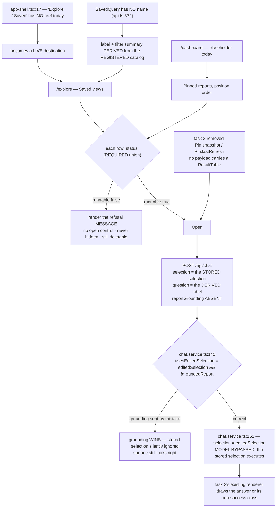

# Task plan — assistant-exploration-view: the Explore surface and pinned reports

Story: assistant · Task 4 of 4 · **user_facing: true** · **the last task before the story closeout**

## Objective
Build the Explore / saved-views surface and the dashboard's pinned-reports list, opening each by RE-RUNNING its stored selection through POST /api/chat rather than replaying a stored answer - there is no stored answer to replay, by decision 0028. Frontend only: every route this consumes is already registered and allow-listed, and chat.service.ts already bypasses the model when the request carries a selection.

## Acceptance criteria (plan_contracts)
- **t-aev-c1** — Explore becomes a **live** destination and renders Saved views with **derived** labels.
- **t-aev-c2** — the dashboard renders Pinned reports, in position order, `definitionChanged` surfaced.
- **t-aev-c3** — opening **re-runs** via `POST /api/chat` with the stored selection; the client widens.
- **t-aev-c4** — a refusal renders **as a refusal**, never as an empty result.
- **t-aev-c5** — delete works from both surfaces; a failed delete surfaces its error.
- **t-aev-c6** — six vitest leaves, the two design skills, and a **live** functional check.

## What already exists (grounding, file:line)
- `frontend/src/components/shell/app-shell.tsx:17` — `{ label: "Explore / Saved", icon: Compass }`,
  **no `href`**. Exactly the state Ask was in before task 2, and the same contradiction with the
  approved prototype.
- `frontend/app/(app)/dashboard/page.tsx` — a placeholder ("Your financial overview will appear
  here when reporting data is available"). The prototype puts **Pinned reports** here.
- `frontend/src/lib/api.ts:106` — `ask` is typed `Pick<AskRequest, "question" | "priorTurns">`.
  It cannot carry a selection today, so it must widen.
- **The re-run path already exists and needs no backend change**:
  `backend/src/chat/chat.controller.ts:38` passes `parsed.data.selection` into the service, and
  `backend/src/chat/chat.service.ts:162` assigns `selection = editedSelection`, **bypassing the
  model**. Every route these surfaces need is already registered and allow-listed.
- **Two silent traps on that path**: `chat.service.ts:145` computes
  `usesEditedSelection = Boolean(editedSelection && !groundedReport)` — sending `reportGrounding`
  makes grounding win and the stored selection is ignored, with the surface still *looking* right;
  and `chat.constants.ts:2` sets `questionMinLength: 1`, so a re-run still needs a question string.
- `contract/src/api.ts:372` — `SavedQuery` is `id, selection, status, chartType, createdAt`:
  **no name, no title**. The prototype's Explore rows show a name and a filter summary, so both
  are **derived**. `:389` `Pin` **does** carry `title`.
- `contract/src/api.ts:400` — `ExplorationSelectionStatus`, the **required** discriminated union
  task 3 shipped. Task 3 also removed `Pin.snapshot` and `Pin.lastRefresh`: **nothing at rest**.
- The prototype (`docs/design/3F-Financial-MIS`): Explore shows eyebrow "Explore", heading
  "Saved views", the line "Selections you can reopen without rebuilding the filter row." and rows
  of `{name, filters, when}`; the dashboard's "Pinned reports" rows show `{name, pct, meta}`.
- Frontend tests are **discovered by glob** (`frontend/vitest.config.ts:15`), so unlike backend
  leaves they need no registration in `quality-gate.test.mjs`.

## What the grill changed (human-decided 2026-09-12)
The cold read returned **NOT CONVERGED** on four product decisions. All four were verified against
the repository first; three were defects in the contract as I first wrote it.

- **Labels have no client-side source.** `GET /api/mis/options` returns the four report selectors,
  not measures or dimensions, and the labels live only in `semanticLayer.ts:14-95`. So "derive from
  the registered catalog" was not achievable frontend-only. **Decided:** move the labels into
  **`@3f/contract`** and have `semanticLayer.ts` import them — one constant, both sides, no drift.
  A static client copy was rejected *because nothing would catch its drift*.
- **Nothing could create a saved view or a pin.** There is no frontend caller of `POST /api/saved`
  or `POST /api/pins` anywhere, so task 3's routes are unreachable and the approved plan's own
  functional check ("save and re-open, pin and re-open") could not be performed. **Decided:** task 4
  owns visible **Save and Pin controls** on a successful answer.
- **The opened result had nowhere to render.** `ask-panel.tsx` exports only `AskPanel`, and
  `AskContextValue` types `ask` as `(question: string) => Promise<void>` — it cannot carry a
  selection. Resolved from the contract itself, which forbids a second renderer: **extend
  `AskProvider`** with a selection-bearing re-run and navigate to `/ask`.
- **The pinned card's figure.** The prototype draws `pct`/`meta`, but 0028 deleted every stored
  figure, so drawing one means a governed execution per pin on every dashboard load. **Decided:**
  **metadata only until an explicit Open** — a deliberate, recorded divergence from the prototype.

Also folded in from the grill's closing notes: `frontend/app/globals.css` is in scope (task 2's
`.ask-panel` rules live there), delete and open are covered on **both** surfaces, and the
unavailable-definition fallback is defined — the row renders the unregistered id verbatim, marked
unavailable, so it stays identifiable and deletable.

## Workflow

## Manual Verification
1. Sign in and confirm **Explore / Saved** is clickable in the left nav and lands on `/explore` —
   not reachable only by typing the URL.
2. Ask a question on `/ask`, save it, then open `/explore`: the row is labelled from the
   **registered catalog** (real measure and dimension labels), not a uuid and not invented prose.
3. Open that saved view. In DevTools → Network, confirm the request is `POST /api/chat`, that its
   body carries the **stored `selection`**, and that **no `reportGrounding` field is present** —
   if grounding is sent, the stored selection is silently ignored and the surface still looks right.
4. Confirm the figures shown came from that fresh execution, and that **no** response carried a
   stored `ResultTable`.
5. Pin a selection, open `/dashboard`, confirm it appears in **Pinned reports** in position order
   and reopens the same way.
6. Revoke the caller's grant (or use a user without it) and reload both surfaces: each affected row
   shows its **refusal message**, offers **no open control**, is **not hidden**, and can still be
   **deleted**.
7. Delete a saved view and a pin from their surfaces; confirm the row goes. Then force a delete to
   fail and confirm the error is **surfaced** rather than the row optimistically vanishing.
8. `npm run build:contract && npm run build:frontend && npm run typecheck && npm run lint &&
   npm run format:check && npm run test:hermetic` — the six required leaves pass, each confirmed by
   its junit testcase **name** and **executed count**, never the exit code (D-0024, D-0031).

## Out of scope
Any backend change (every route exists); saved-view renaming (`SavedQuery` has no name column and
adding one is a migration); shareable pins and answer snapshots (**0028**); the `HelpService`
suggestions naming an unregistered dimension (**D-0040**).

<!-- forge:contract -->
## Contract (recorded)

Rendered by the harness from the recorded decomposition; edit the decomposition, not this block. It is excluded from the plan's approval and grill digests, so a re-render never stales either.

**Objective.** Build the Explore / saved-views surface and the dashboard's pinned-reports list, plus the Save and Pin controls that make task 3's routes reachable at all, opening each by RE-RUNNING its stored selection through the existing model-bypass on POST /api/chat rather than replaying a stored answer - there is none to replay, by decision 0028. Mostly frontend, with one deliberate shared change: the measure and dimension labels move into @3f/contract so the server registry and the client read one constant that cannot drift.

**Acceptance criteria**

- Saved-view labels come from ONE source that cannot drift. SavedQuery carries no name (contract/src/api.ts:372) and the human-readable labels - 'Actual', 'Budget', 'GL code', 'Month', 'Statement leaf' - live only in backend/src/semantic/semanticLayer.ts:14-95, which no endpoint publishes: GET /api/mis/options returns the four report selectors, not measures or dimensions. So the labels move into the SHARED @3f/contract package and backend/src/semantic/semanticLayer.ts IMPORTS them, making server and client read the same constant - human-decided 2026-09-12 over a backend display descriptor, a static frontend copy and a persisted label column. A static copy was rejected precisely because nothing would catch its drift. semanticLayer.financial.test.ts:21 asserts those exact label strings and must still pass unchanged, which is the proof the move altered no published vocabulary. The Explore page then follows the prototype - eyebrow 'Explore', heading 'Saved views', the line 'Selections you can reopen without rebuilding the filter row.' - with each row's label and filter summary derived from that shared constant, never invented prose and never a raw uuid. A selection naming a definition the layer no longer registers has a DEFINED FALLBACK: the row renders the unregistered id verbatim, marked as unavailable, so the reader can still identify and delete it rather than meeting a blank or a crash.
- Explore becomes a LIVE destination and the dashboard renders Pinned reports. frontend/src/components/shell/app-shell.tsx:17 lists 'Explore / Saved' with NO href today - the same disabled state Ask was in before task 2 - so it gains one and the shell test proves it. frontend/app/(app)/dashboard/page.tsx is a placeholder today and gains the prototype's 'Pinned reports' list, labelled from Pin.title (contract/src/api.ts:389) in stored position order, with Pin.definitionChanged surfaced because a pin whose definitions moved is what a reader must not mistake for a stable number. A pinned card is METADATA ONLY until it is opened - title, definition-changed state and an Open control, and NO figure - human-decided 2026-09-12 against both re-running every pin on dashboard load and a lazy viewport-triggered fan-out. The prototype draws a figure on each card; decision 0028 deleted every stored figure, so drawing one would mean a governed warehouse execution per pin on every dashboard visit. That divergence from the prototype is deliberate and recorded here.
- Opening RE-RUNS the stored selection and never replays an answer - nothing at rest could be replayed, since task 3 removed Pin.snapshot and Pin.lastRefresh and no payload carries a ResultTable. The path is POST /api/chat carrying the stored selection: chat.controller.ts:38 passes the request's selection into the service and chat.service.ts:162 assigns it directly, BYPASSING the model. Two traps on that path are silent when got wrong and both must be honoured: usesEditedSelection is Boolean(editedSelection && !groundedReport) (chat.service.ts:145), so sending reportGrounding makes grounding WIN and the stored selection is ignored while the surface still looks correct; and the route requires a non-empty question (chat.constants.ts:2), so the client sends the row's DERIVED label rather than fabricating a sentence the product would then appear to have answered. The result is rendered by TASK 2's EXISTING renderer, not a second implementation: ask-panel.tsx exports only AskPanel and parseActiveBatchIds, and use-ask.ts's AskContextValue types ask as (question: string) => Promise<void>, which cannot carry a selection - so AskProvider gains a selection-bearing re-run action and opening navigates to /ask and appends to the existing thread. frontend/src/lib/api.ts:106 types ask as Pick<AskRequest, 'question' | 'priorTurns'> and widens to carry selection, proven by a direct api-client leaf asserting the EXACT body: selection present, reportGrounding ABSENT.
- A refusal renders AS a refusal, never as an empty result, following decision 0018's principle that an unresolved thing becomes a VISIBLE, distinctly-labelled outcome carrying its status rather than being excluded - 0018 applied that to the unmapped-GL bucket; a refused saved view is the same shape of problem. Both surfaces read the REQUIRED discriminated status task 3 shipped (contract/src/api.ts:400: {runnable:true} | {runnable:false, reason:'grant_revoked'|'definition_unregistered', message}). A non-runnable row shows its message and offers NO open control, because opening it would only produce the refusal again; it is never hidden and never silently dropped, and it remains deletable - a row the reader can see but not remove is worse than one never shown. A re-run returning a non-success ResponseClass renders honestly through task 2's existing renderer, which already handles all seven classes.
- Saved views and pins can be CREATED and DELETED from the product, not only from the API. There is no frontend caller of POST /api/saved or POST /api/pins anywhere today, so task 3's routes are unreachable and the approved story plan's own functional check - 'save and re-open, pin and re-open' - cannot be performed. Task 4 therefore adds visible Save and Pin controls to a SUCCESSFUL Ask answer, human-decided 2026-09-12 over seeding by API and over deferring self-serve creation; without them the story would ship a read-only surface over dead routes. Controls appear only on a successful answer, since only a success carries a runnable selection. Deleting works from BOTH surfaces (DELETE /api/saved/:id and DELETE /api/pins/:id, both registered and allow-listed), and a delete that FAILS surfaces its error rather than optimistically dropping the row from the list.
- The surfaces are proven by vitest leaves covering, on BOTH surfaces where both apply: the Explore nav item resolving to a live destination; a saved row labelled from the shared constant rather than a raw id, and the unavailable-definition fallback rendering the id verbatim as unavailable; a pinned row rendering from Pin.title in position order, metadata-only with definitionChanged surfaced and NO figure before open; a non-runnable row rendering its refusal message with no open control on each surface; an open issuing POST /api/chat with the stored selection and NO reportGrounding, asserted on the exact request body in frontend/src/lib/api.test.ts because a component test mocks the client and proves nothing about the route, the CSRF header or the body; Save and Pin controls appearing only on a successful answer and calling their routes; and a delete removing the row on each surface while a FAILED delete surfaces its error. Styling lives in frontend/app/globals.css beside task 2's .ask-panel rules, which is in scope. The task is user_facing, so emil-design-eng and frontend-design are loaded, used and attested - the recorder REFUSES a user-facing automated artifact without them - and the functional check runs LIVE with BEDROCK_MODEL_ID set and is now actually performable because the Save and Pin controls exist: ask, save, reopen from Explore and confirm the figures came from a fresh execution, pin, reopen from the dashboard, and confirm a revoked grant produces a visible refusal rather than a blank card. If BEDROCK_MODEL_ID is unavailable that is a BLOCKED functional check reported as such, never one quietly passed against the mock provider, which can only ever return a clarification. Every artifact is judged on its testcase NAME and EXECUTED COUNT, never an exit code (D-0024, D-0031).

**Write scope** (what `stage done` measures the diff against)

- contract/src/api.ts
- backend/src/semantic/semanticLayer.ts
- backend/src/semantic/semanticLayer.financial.test.ts
- frontend/app/(app)/explore/page.tsx
- frontend/app/(app)/dashboard/page.tsx
- frontend/app/globals.css
- frontend/src/components/shell/app-shell.tsx
- frontend/src/components/shell/app-shell.test.tsx
- frontend/src/features/assistant/ask-panel.tsx
- frontend/src/features/assistant/ask-panel.test.tsx
- frontend/src/features/assistant/use-ask.ts
- frontend/src/features/exploration/saved-views.tsx
- frontend/src/features/exploration/saved-views.test.tsx
- frontend/src/features/exploration/pinned-reports.tsx
- frontend/src/features/exploration/pinned-reports.test.tsx
- frontend/src/features/exploration/use-exploration.ts
- frontend/src/features/exploration/selection-label.ts
- frontend/src/features/exploration/selection-label.test.ts
- frontend/src/lib/api.ts
- frontend/src/lib/api.test.ts

**Required tests** (run by `stage done`)

- `the explore nav item resolves to a live destination` -- `npm exec --no -- vitest run --config frontend/vitest.config.ts {path} -t {id} --reporter=junit --outputFile={report}` (frontend/src/components/shell/app-shell.test.tsx)
- `a saved row is labelled from the shared catalog and an unregistered definition falls back to its identifier marked unavailable` -- `npm exec --no -- vitest run --config frontend/vitest.config.ts {path} -t {id} --reporter=junit --outputFile={report}` (frontend/src/features/exploration/saved-views.test.tsx)
- `a pinned row renders metadata only in position order with a changed definition surfaced and no figure` -- `npm exec --no -- vitest run --config frontend/vitest.config.ts {path} -t {id} --reporter=junit --outputFile={report}` (frontend/src/features/exploration/pinned-reports.test.tsx)
- `a non runnable row renders its refusal message and offers no open control on both surfaces` -- `npm exec --no -- vitest run --config frontend/vitest.config.ts {path} -t {id} --reporter=junit --outputFile={report}` (frontend/src/features/exploration/pinned-reports.test.tsx)
- `opening a saved view posts the stored selection with no report grounding` -- `npm exec --no -- vitest run --config frontend/vitest.config.ts {path} -t {id} --reporter=junit --outputFile={report}` (frontend/src/lib/api.test.ts)
- `save and pin controls appear only on a successful answer and call their routes` -- `npm exec --no -- vitest run --config frontend/vitest.config.ts {path} -t {id} --reporter=junit --outputFile={report}` (frontend/src/features/assistant/ask-panel.test.tsx)
- `a failed delete surfaces its error instead of dropping the row` -- `npm exec --no -- vitest run --config frontend/vitest.config.ts {path} -t {id} --reporter=junit --outputFile={report}` (frontend/src/features/exploration/saved-views.test.tsx)

**Verify commands**

- `npm run build:contract`
- `npm run build:backend`
- `npm run build:frontend`
- `npm run typecheck`
- `npm run lint`
- `npm run format:check`
- `npm run test:hermetic`

**Review budget.** 20 files / 2600 lines -- Two new surfaces plus the shell, dashboard and Ask panel they attach to; Save and Pin controls without which task 3's routes are unreachable and the approved functional check cannot run; AskProvider extended to re-run a stored selection so the existing seven-class renderer is reused rather than duplicated; the measure and dimension labels moved into @3f/contract with semanticLayer.ts importing them so one constant serves both sides; a derived-label module with an unavailable-definition fallback; and the shared stylesheet. Seven required vitest leaves plus a user-facing live functional check and the two mandatory design skills.
<!-- /forge:contract -->
