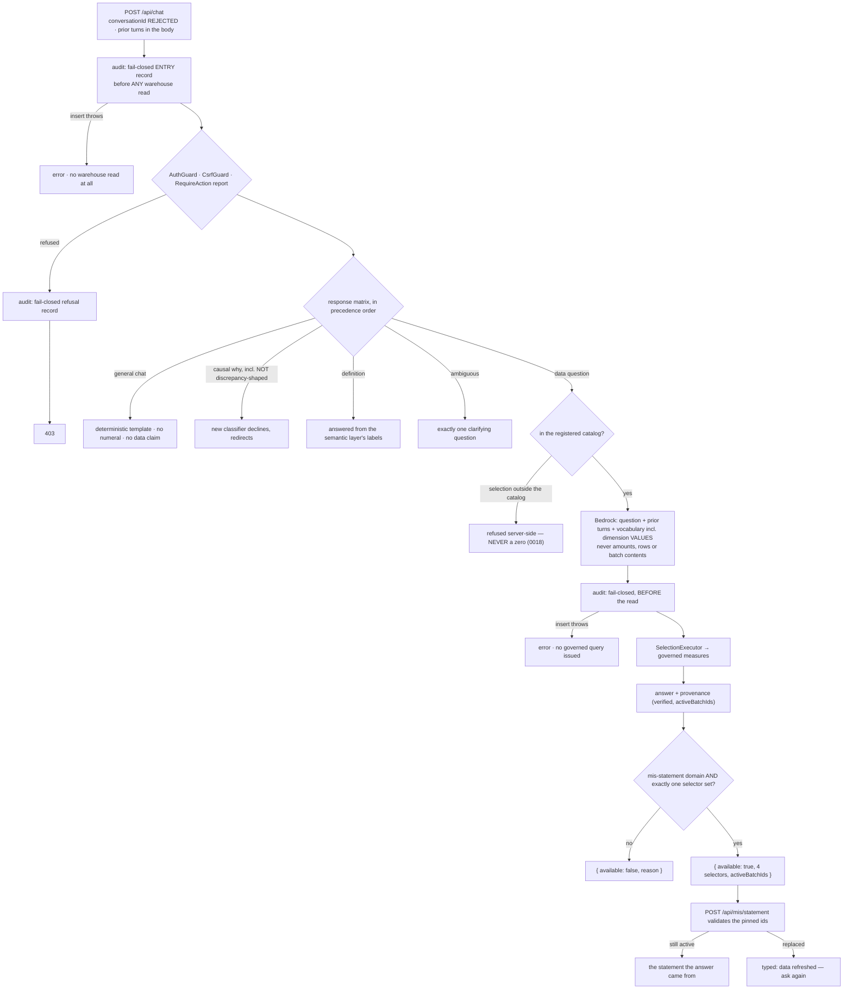

# Task plan — assistant-governed-ask: register and govern the vendored assistant

Story: assistant · Task 1 of 4 · **user_facing: false**

## Objective
Make the vendored chat stack **reachable and governed**, and give "view in report" both halves it
needs to mean anything.

Register the module, put it behind the governed action, enforce the Bedrock input boundary **by
test**, implement the five-branch response matrix and the out-of-catalog refusal, move the
fail-closed audit onto every branch, and add the view-in-report field **together with** the
statement-side pinned-batch validation.

Backend only. No migration, no UI, no saved/pins routes — those are tasks 2–4.

## Acceptance criteria (plan_contracts)
- **t-aga-c1** — registered and governed, **no second `LLM_PROVIDER` binding**, and the Help /
  Reports / Conversations **services** provided directly so no unowned route appears.
- **t-aga-c2** — the provider boundary asserted on its arguments, **presence and absence**; the
  mock default stated honestly.
- **t-aga-c3** — the matrix including its **collisions**; the causal branch needs new code.
- **t-aga-c4** — the **enforceable half** of the catalog rule, and only that half claimed.
- **t-aga-c5** — view-in-report as a **discriminated union** with an explicit mapping rule, and
  pinned ids on a **statement-only** schema.
- **t-aga-c6** — the fail-closed audit at **request entry**, before any warehouse read.
- **t-aga-c7** — `conversationId` **rejected**, prior turns in the request; D-0006 and test
  registration honoured.

## What already exists (grounding, file:line)
- `backend/src/chat/` — eighteen files, 3,758 lines. `ChatService.ask()` (`chat.service.ts:59`)
  already does smalltalk classification (`:119`), ambiguity/clarify, the reconciliation guard,
  verified-selection checks, provenance assembly, SSE streaming, and a **fail-closed audit inside
  `beforeExecute`** (`:315`). Its collaborators all exist: `ConversationsService`,
  `ReportsService`, `HelpService`, `DimensionValuesService`.
- `backend/src/chat/chat.controller.ts:13` — `@Controller("api/chat")` with **`@UseGuards(AuthGuard)`
  only**. It authenticates; it does not authorize. Governing it means adding
  `RequireAction("report")`.
- `backend/src/app.module.ts:14` — imports `CoreModule`, `HealthModule`, `IngestModule`,
  `MisSelectionModule`, `MisModule`. **No chat, saved or pins.** There is no `ChatModule` file to
  import; it must be written.
- `backend/src/app.routes.test.ts:20` — the strict allow-list, fourteen routes, no `/api/chat`.
  **This is the only artifact that proves a route exists.**
- `backend/src/grants/grants.constants.ts:3` — `GRANT_ACTIONS = ["admin","save","pin","ingest","report"]`.
  **No new action is needed**; the assistant uses `report`, exactly as the statement does.
- `backend/src/chat/chat.service.ts:167` — `dimensionValuesForAllowedDomains(...)` →
  `dimensionValues.values(domain.goldObject, dimension.column)`: a `SELECT DISTINCT` against the
  **warehouse**, serialized into the prompt at `:172`. Decision **0027 as amended** permits these
  and requires a test asserting the provider's input.
- `backend/src/llm/mock.provider.ts` — `select()` always returns `kind: "clarify"`. It never
  selects. Development-only.
- `backend/src/core/audit.service.ts` — `writeRequestEvent` throws (fail-closed);
  `writeResultEvent` is documented **best-effort and never blocks**. The denied and unsupported
  branches currently use the latter.
- `contract/src/api.ts` — `AskResponse` already carries `selection`, `result`, `totals`,
  `chartType`, `provenance`, `appliedTimeWindow`, `chips`, `clarify`; `Provenance` carries
  `verified` and `activeBatchIds`. `AskReportGrounding { reportId, timeWindow }` grounds a question
  *in* a report — nothing carries an answer *back* to one.
- `backend/src/mis/mis-statement.controller.ts` — `POST api/mis/statement` takes
  `misSelectionRunRequestSchema`: four selectors, **no `pinnedBatches`**. Only `MisDrillRequest`
  has them. The drill's `MisDrillBatchStatus` is the precedent for the typed stale outcome.
- `.prettierignore` — contains `chat.controller.ts` and `smalltalk-guard.ts`, **not**
  `chat.service.ts`. D-0006 therefore applies to the first two only.

## Design

### Registration and governance
Write `ChatModule`, import it in `app.module.ts`, add `RequireAction("report")` to the controller,
and add both routes to the allow-list.

**No new provider module.** `core.module.ts:45` already provides `LLM_PROVIDER` from config; a
second binding would shadow or duplicate it. And `ChatModule` provides the **Help, Reports and
Conversations services directly** — importing their modules would register `/api/help` and
`/api/conversations`, routes this story does not own. The allow-list assertion is what catches
that, so it must fail on an unexpected route as well as a missing one.

### The provider boundary
Permitted: the question, the prior turns, the governed vocabulary — names, labels **and dimension
distinct values capped by `dimensionEnumMax`**. Forbidden: amounts, measure values, transaction
lines, batch contents, result rows. The test asserts the provider's **arguments**, checking both
that the permitted things are present and that the forbidden ones are **absent**; a happy-path
assertion alone would not catch a later change that starts passing rows.

`config.ts:178` defaults `llmProvider` to **mock in every environment**, not just development. So
the honest statement is: a deployment without `LLM_PROVIDER=bedrock` and a set
`BEDROCK_MODEL_ID` can only ever return a clarification.

### The response matrix
In precedence order — data, definition, ambiguous, causal, general chat — and the tests must prove
the **collisions**, not one clean example per branch.

**The causal branch needs new code.** `reconciliation-guard.ts:8` declines only questions that
*also* look like a discrepancy, so *"Why is labour high?"* reaches Bedrock today and may come back
with data. A causal classifier declines it and redirects to what the numbers show; the required
test drives a causal question that is **not** discrepancy-shaped.

**General chat is deterministic**, extending `smalltalk-guard.ts`: the model is never asked for
prose. The numeral rule is precise — no numeral that could read as a **data value**; **brand
tokens such as "3F" are exempt**, which the existing copy (`smalltalk-guard.ts:64`) relies on.

### Out of catalog — what is enforceable, and what is not
**Enforceable, and enforced:** a *selection* naming any measure or dimension outside the registered
domains is refused server-side and deterministically, and a refusal is never rendered as a zero.
Decision **0018** made a zero mean something; conflating them would teach the reader to distrust
every zero on the statement.

**Not enforceable, and not claimed:** that an off-topic *question* is refused.
`bedrock.provider.ts:265` validates the ids an emitted selection uses — not whether the question
was about your data. A model can turn an irrelevant question into a valid governed selection and
return real numbers with honest provenance. That is best-effort prompt behaviour, said plainly in
the plan and in the code comment rather than implied as a guarantee. **Human-decided at the task
grill.**

### View in report, both halves
The field is a **discriminated union** —
`{ available: true, department, function, plant, period, activeBatchIds }` or
`{ available: false, reason }` — because "absent with a reason" cannot be represented by an absent
optional field.

**The mapping rule has to be stated, because none is derivable.** The statement domain exposes
only `leaf_key` as a dimension (`semanticLayer.ts:141`); there is no department, function or plant
to read off a selection. A link is offered **only** when the answer was executed against the
`mis-statement` domain **and** its resolved scope names exactly one department, function, plant
and an offered period. Everything else returns `available: false` with the reason.

`POST api/mis/statement` accepts pinned ids on a **statement-only** request schema.
`misSelectionRunRequestSchema` is parsed at **three** call sites — `mis-selection.controller.ts:86`
(`/api/mis/run`) and `mis-statement.controller.ts:66` and `:115` (statement and export) — so
extending the shared schema would silently change all three. **With no pinned ids the route
behaves exactly as it does today**; the report and the drill both call it.

### Audit at request entry
The existing fail-closed write sits at `chat.service.ts:317`, immediately before the governed
execution — but `:167` has **already** read distinct values from the warehouse to build the
prompt, and `HelpService.buildIndex` reaches the warehouse for definitions. An audit failure can
therefore happen *after* governed data was read and identifiers prepared for Bedrock.

So the fail-closed record moves to **request entry**, naming the actor and the question, before
any warehouse access; the existing pre-execution record still names the resolved selection.
Denied and unsupported branches are covered by the entry record rather than by `writeResultEvent`,
which `audit.service.ts` documents as best-effort and never blocking. The test makes the entry
insert fail and asserts **no warehouse read of any kind** occurred.

### Durable conversation is disabled, not merely unused
A client-supplied `conversationId` makes `chat.service.ts:139` read the conversations table and
`:412` persist an answer snapshot. Those tables are deliberately absent and `:412` writes exactly
what decision **0028** forbids, so a crafted request could trigger a missing-table failure or
governed data at rest. The route **rejects** `conversationId` with a typed 400 — ignoring it would
leave both paths reachable — and **prior turns travel in the request body** from client state,
capped by the existing token budget.

## Workflow

## Manual Verification
1. `npm run build:contract && npm run build:backend && npm run typecheck && npm run lint &&
   npm run format:check && npm run test:hermetic` — the **ten** required leaves pass. Read each
   junit report's **testcase name and executed count**, never the exit code (D-0024, D-0031).
2. **The allow-list is the proof, in both directions.** Confirm it lists `POST /api/chat` and
   `POST /api/chat/stream`, that it fails if either is removed, **and** that no `/api/help` or
   `/api/conversations` route appeared — which is what importing those modules would cause.
3. **Against the live backend with `LLM_PROVIDER=bedrock` and `BEDROCK_MODEL_ID` set**, ask a real
   question of the July statement and confirm the answer's figures match the report, that
   `provenance.verified` is true, and that the view-in-report field carries the selectors and
   batch ids. Without the model id the assistant can only return a clarification — say so rather
   than reporting a pass.
4. **The regression that matters:** run the existing statement and drill suites unchanged and
   confirm `POST /api/mis/statement` with **no** pinned ids behaves exactly as before.
5. `SELECT event_type, question FROM audit_events ORDER BY ts DESC LIMIT 5` — a denied and an
   unsupported request each left a record.

## Decisions attested
0026 (the assistant ships in the PoC), 0027 (Bedrock `ap-south-1`; the permitted-input boundary as
amended), 0028 (no governed data at rest — this task registers no saved/pins route and stores
nothing), 0016 (all-or-nothing governed access), 0018 (a zero is not an absence), 0022 (the
statement projection the answers and the link agree with), 0019 (house style for the routes),
0012 (the vendored API's constitution deviation covers these controllers), 0011 (retention and
residency contracts ride with the pilot), 0006/0008/0010 (vendored backend, pinned snapshot, 3F
identifiers), 0009 (required tests name a real leaf and pin `TS_NODE_PROJECT`).

## Surface impact
- **New:** `chat.module.ts`, the LLM provider module, `chat.service.test.ts`, the view-in-report
  contract field.
- **Changed:** `app.module.ts` (two imports), `app.routes.test.ts` (the allow-list),
  `chat.controller.ts` (+`RequireAction`, +D-0006 reformat), `chat.service.ts` (matrix, catalog
  refusal, audit boundary, the link field), `smalltalk-guard.ts` (+templates, +D-0006 reformat),
  `mis-statement.{controller,service,dto,interface}.ts` (pinned ids and the typed stale outcome),
  `backend/package.json` and `tools/quality-gate.test.mjs` (test registration), `.prettierignore`
  (two entries removed).
- **Unchanged:** the semantic layer, the warehouse schema, every governed measure, the drill path,
  and every saved/pins/conversations route — none is registered here.

## Out of scope
Durable chat history and `/api/conversations` (deferred at the plan grill; `conversationId` is
rejected here, not supported); a topicality classifier for off-topic questions (the human accepted
the enforceable half at the task grill);
The migration and the saved/pins routes (task 3); both UI surfaces (tasks 2 and 4); durable chat
history and `/api/conversations` (deferred at the plan grill); removing the pins snapshot
behaviour (task 3); historical statement rendering against arbitrary past batches (refused, not
rebuilt).

<!-- forge:contract -->
## Contract (recorded)

Rendered by the harness from the recorded decomposition; edit the decomposition, not this block. It is excluded from the plan's approval and grill digests, so a re-render never stales either.

**Objective.** Make the vendored chat stack reachable and governed: register it, enforce the Bedrock input boundary by test, implement the response matrix and the out-of-catalog refusal, move the fail-closed audit onto every branch, and add the view-in-report field together with the statement-side pinned-batch validation that makes it mean something. Backend only.

**Acceptance criteria**

- The vendored chat module is REGISTERED and GOVERNED: a ChatModule is imported by app.module.ts, POST /api/chat and POST /api/chat/stream appear in the strict allow-list in backend/src/app.routes.test.ts - the only thing that proves a route exists - and both sit behind AuthGuard, the globally registered CsrfGuard and RequireAction('report'), the same governed action the statement uses. No new grant action is minted (GRANT_ACTIONS already carries report, save and pin) and NO new LLM provider module is created: CoreModule already provides LLM_PROVIDER from config, and a second binding would shadow it. ChatModule provides the Help, Reports and Conversations SERVICES it needs directly rather than importing their modules, because importing those modules would register /api/help and /api/conversations - routes this story does not own. The allow-list assertion must fail if any unowned route appears.
- The Bedrock input boundary is enforced BY TEST on the provider's arguments, asserting both that the permitted things are present and that the forbidden ones are ABSENT. Permitted: the question, the prior turns, and the governed vocabulary INCLUDING dimension distinct values capped by dimensionEnumMax (chat.service.ts:167, permitted by decision 0027 as amended). Forbidden: amounts, measure values, transaction lines, batch contents and any row of a governed result. The provider is chosen by config.llmProvider, which DEFAULTS TO MOCK IN EVERY ENVIRONMENT (config.ts:178) - so the contract states plainly that a deployment without LLM_PROVIDER=bedrock and a set BEDROCK_MODEL_ID can only ever return a clarification, rather than calling mock 'development-only'.
- The response matrix holds in precedence order and each branch is proven, INCLUDING the collisions rather than one clean example each. A DATA question is answered from the governed measures with provenance.verified true and every visible numeric character rendered from the deterministic result; a DEFINITION question from the semantic layer's labels; an AMBIGUOUS question returns exactly one clarifying question; GENERAL CHAT comes from DETERMINISTIC templates extending smalltalk-guard, which may contain no numeral that could read as a data value - brand tokens such as '3F' are exempt, which the existing copy relies on. CAUSAL 'why' needs NEW work: reconciliation-guard.ts:8 declines only questions that also look like a discrepancy, so 'Why is labour high?' reaches the model today. A causal classifier declines it and redirects to what the numbers show, and a test drives a causal question that is NOT discrepancy-shaped.
- The enforceable half of the catalog rule is enforced, and only that half is claimed. A selection referencing any measure or dimension outside the registered domains - governed-financial and mis-statement - is REFUSED server-side and deterministically, and a refusal is NEVER rendered as a zero: decision 0018 made a zero a meaningful value, and conflating them would teach the reader to distrust every zero on the statement. What is NOT claimed as a guarantee: that an off-topic question is refused. bedrock.provider.ts:265 validates the ids an emitted selection uses, not whether the question was about the catalog, so an irrelevant question that yields a valid selection returns governed numbers with honest provenance. That is a best-effort prompt behaviour, stated as such in the plan and in the code comment, not proven by a test that stubs kind 'unsupported'. Human-decided at the task grill.
- View-in-report has a real wire contract and a stated mapping rule. The field is a DISCRIMINATED union - { available: true, department, function, plant, period, activeBatchIds } | { available: false, reason } - because 'absent with a reason' cannot be represented by an absent optional field. The mapping rule is explicit, because none is derivable from the domain: the statement domain exposes only leaf_key as a dimension (semanticLayer.ts:141), so a link is offered ONLY when the answer was executed against the mis-statement domain AND its resolved scope names exactly one department, function, plant and an offered period; every other answer returns available: false with the reason. POST /api/mis/statement then accepts pinned batch ids on a STATEMENT-ONLY request schema - misSelectionRunRequestSchema is parsed by three call sites (mis-selection.controller.ts:86 for /api/mis/run, and mis-statement.controller.ts:66 and :115 for statement and export), so extending the shared schema would silently change all three - validates them, and returns a typed 'the data was refreshed - ask again' outcome when they are no longer active. With NO pinned ids the route behaves exactly as it does today, and the existing statement, export and drill tests pass untouched.
- The fail-closed audit moves to REQUEST ENTRY, before any warehouse access. Today the only fail-closed write is at chat.service.ts:317, immediately before the governed execution - but chat.service.ts:167 has already read distinct values from the warehouse to build the prompt, and HelpService.buildIndex reaches the warehouse for definitions, so an audit failure can occur AFTER governed data was read and identifiers were prepared for Bedrock. An entry record naming the actor and the question is written first and fails closed; the existing pre-execution record still names the resolved selection. Denied and unsupported branches are covered by the entry record rather than by writeResultEvent, which audit.service.ts documents as best-effort and never blocking. Proven by a test that makes the entry insert fail and asserts that NO warehouse read of any kind occurred - not merely that no governed query ran.
- Durable conversation is disabled, not merely unused, and prior turns get a transport. A client-supplied conversationId today makes chat.service.ts:139 read the conversations table and :412 persist an answer snapshot - tables this story deliberately does not create - so a client could trigger either a missing-table failure or governed data at rest, which decision 0028 forbids. The route REJECTS conversationId with a typed 400, and prior turns travel in the request body from client state, capped by the existing token budget, so the permitted-input boundary still has something to permit. No conversations, saved or pins route is registered here. D-0006 is honoured for every prettier-ignored file this task edits - chat.controller.ts and smalltalk-guard.ts are formatted and their .prettierignore entries removed in the same change, while chat.service.ts is NOT in that file and needs no reformat - and new hermetic tests are registered in backend/package.json test:hermetic AND tools/quality-gate.test.mjs, or CI runs none of them.

**Write scope** (what `stage done` measures the diff against)

- contract/src/api.ts
- backend/src/app.module.ts
- backend/src/app.routes.test.ts
- backend/src/chat/chat.module.ts
- backend/src/chat/chat.controller.ts
- backend/src/chat/chat.schemas.ts
- backend/src/chat/chat.service.ts
- backend/src/chat/chat.service.test.ts
- backend/src/chat/chat.sse.test.ts
- backend/src/chat/smalltalk-guard.ts
- backend/src/chat/smalltalk-guard.test.ts
- backend/src/chat/reconciliation-guard.ts
- backend/src/mis/mis-statement.controller.ts
- backend/src/mis/mis-statement.controller.test.ts
- backend/src/mis/mis-statement.service.ts
- backend/src/mis/mis-statement.service.test.ts
- backend/src/mis/mis-statement.dto.ts
- backend/src/mis/mis-statement.interface.ts
- backend/package.json
- tools/quality-gate.test.mjs
- .prettierignore

**Required tests** (run by `stage done`)

- `the chat routes are registered behind the governed report action and no unowned help or conversations route appears in the allow list` -- `TS_NODE_PROJECT=backend/tsconfig.json TS_NODE_TRANSPILE_ONLY=1 node tools/junit-run.mjs --file {path} --name {id} --report {report} --require ts-node/register` (backend/src/app.routes.test.ts)
- `the llm provider receives the question prior turns and dimension values and never an amount or a result row` -- `TS_NODE_PROJECT=backend/tsconfig.json TS_NODE_TRANSPILE_ONLY=1 node tools/junit-run.mjs --file {path} --name {id} --report {report} --require ts-node/register` (backend/src/chat/chat.service.test.ts)
- `a data question answers from the governed measures and a definition question answers from the semantic layer labels` -- `TS_NODE_PROJECT=backend/tsconfig.json TS_NODE_TRANSPILE_ONLY=1 node tools/junit-run.mjs --file {path} --name {id} --report {report} --require ts-node/register` (backend/src/chat/chat.service.test.ts)
- `a causal why question that is not discrepancy shaped is declined before it reaches the provider` -- `TS_NODE_PROJECT=backend/tsconfig.json TS_NODE_TRANSPILE_ONLY=1 node tools/junit-run.mjs --file {path} --name {id} --report {report} --require ts-node/register` (backend/src/chat/chat.service.test.ts)
- `general chat is answered from deterministic templates containing no numeral that could read as a data value` -- `TS_NODE_PROJECT=backend/tsconfig.json TS_NODE_TRANSPILE_ONLY=1 node tools/junit-run.mjs --file {path} --name {id} --report {report} --require ts-node/register` (backend/src/chat/smalltalk-guard.test.ts)
- `a selection naming a measure outside the registered domains is refused server side and never rendered as a zero` -- `TS_NODE_PROJECT=backend/tsconfig.json TS_NODE_TRANSPILE_ONLY=1 node tools/junit-run.mjs --file {path} --name {id} --report {report} --require ts-node/register` (backend/src/chat/chat.service.test.ts)
- `the view in report field is available only for a statement domain answer resolving to one selector set and otherwise carries a reason` -- `TS_NODE_PROJECT=backend/tsconfig.json TS_NODE_TRANSPILE_ONLY=1 node tools/junit-run.mjs --file {path} --name {id} --report {report} --require ts-node/register` (backend/src/chat/chat.service.test.ts)
- `the statement route refuses a pinned batch that is no longer active and behaves unchanged when no pinned ids are sent` -- `TS_NODE_PROJECT=backend/tsconfig.json TS_NODE_TRANSPILE_ONLY=1 node tools/junit-run.mjs --file {path} --name {id} --report {report} --require ts-node/register` (backend/src/mis/mis-statement.controller.test.ts)
- `a failing entry audit aborts the request before any warehouse read including the dimension value lookup` -- `TS_NODE_PROJECT=backend/tsconfig.json TS_NODE_TRANSPILE_ONLY=1 node tools/junit-run.mjs --file {path} --name {id} --report {report} --require ts-node/register` (backend/src/chat/chat.service.test.ts)
- `a request carrying a conversation id is rejected and prior turns are read from the request body instead` -- `TS_NODE_PROJECT=backend/tsconfig.json TS_NODE_TRANSPILE_ONLY=1 node tools/junit-run.mjs --file {path} --name {id} --report {report} --require ts-node/register` (backend/src/chat/chat.service.test.ts)

**Verify commands**

- `npm run build:contract`
- `npm run build:backend`
- `npm run typecheck`
- `npm run lint`
- `npm run format:check`
- `npm run test:hermetic`

**Review budget.** 20 files / 3000 lines -- Registration is small; everything around it is not. The task governs a 3,758-line vendored stack it did not write, moves a fail-closed audit boundary in front of a warehouse read that currently precedes it, disables a durable-conversation path reachable by a crafted request, adds a causal classifier the existing guard does not cover, enforces a provider boundary by asserting absence as well as presence, and changes a SHIPPED statement route - on a schema shared by three routes - to accept and validate pinned batch ids, which two merged stories depend on not breaking. It also carries two D-0006 reformats whose diffs are mechanical but large, and the registration files without which the routes are unproven and the new tests unrun. No migration and no UI.
<!-- /forge:contract -->
