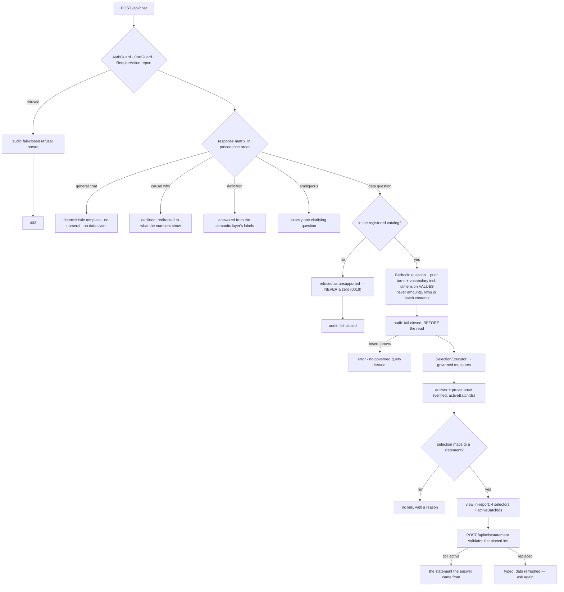

# Task plan — assistant-governed-ask: register and govern the vendored assistant

Story: assistant · Task 1 of 4 · **user_facing: false**

## Objective
Make the vendored chat stack **reachable and governed**, and give "view in report" both halves it
needs to mean anything.

Register the module, put it behind the governed action, enforce the Bedrock input boundary **by
test**, implement the five-branch response matrix and the out-of-catalog refusal, move the
fail-closed audit onto every branch, and add the view-in-report field **together with** the
statement-side pinned-batch validation.

Backend only. No migration, no UI, no saved/pins routes — those are tasks 2–4.

## Acceptance criteria (plan_contracts)
- **t-aga-c1** — registered and governed, with the routes in the strict allow-list.
- **t-aga-c2** — the Bedrock input boundary asserted on the provider's arguments.
- **t-aga-c3** — the five-branch response matrix, general chat deterministic.
- **t-aga-c4** — out-of-catalog questions refused, never answered zero.
- **t-aga-c5** — view-in-report on **both** sides, including the statement's typed stale refusal.
- **t-aga-c6** — fail-closed audit on every branch, including denials.
- **t-aga-c7** — nothing else disturbed; D-0006 and test registration honoured.

## What already exists (grounding, file:line)
- `backend/src/chat/` — eighteen files, 3,758 lines. `ChatService.ask()` (`chat.service.ts:59`)
  already does smalltalk classification (`:119`), ambiguity/clarify, the reconciliation guard,
  verified-selection checks, provenance assembly, SSE streaming, and a **fail-closed audit inside
  `beforeExecute`** (`:315`). Its collaborators all exist: `ConversationsService`,
  `ReportsService`, `HelpService`, `DimensionValuesService`.
- `backend/src/chat/chat.controller.ts:13` — `@Controller("api/chat")` with **`@UseGuards(AuthGuard)`
  only**. It authenticates; it does not authorize. Governing it means adding
  `RequireAction("report")`.
- `backend/src/app.module.ts:14` — imports `CoreModule`, `HealthModule`, `IngestModule`,
  `MisSelectionModule`, `MisModule`. **No chat, saved or pins.** There is no `ChatModule` file to
  import; it must be written.
- `backend/src/app.routes.test.ts:20` — the strict allow-list, fourteen routes, no `/api/chat`.
  **This is the only artifact that proves a route exists.**
- `backend/src/grants/grants.constants.ts:3` — `GRANT_ACTIONS = ["admin","save","pin","ingest","report"]`.
  **No new action is needed**; the assistant uses `report`, exactly as the statement does.
- `backend/src/chat/chat.service.ts:167` — `dimensionValuesForAllowedDomains(...)` →
  `dimensionValues.values(domain.goldObject, dimension.column)`: a `SELECT DISTINCT` against the
  **warehouse**, serialized into the prompt at `:172`. Decision **0027 as amended** permits these
  and requires a test asserting the provider's input.
- `backend/src/llm/mock.provider.ts` — `select()` always returns `kind: "clarify"`. It never
  selects. Development-only.
- `backend/src/core/audit.service.ts` — `writeRequestEvent` throws (fail-closed);
  `writeResultEvent` is documented **best-effort and never blocks**. The denied and unsupported
  branches currently use the latter.
- `contract/src/api.ts` — `AskResponse` already carries `selection`, `result`, `totals`,
  `chartType`, `provenance`, `appliedTimeWindow`, `chips`, `clarify`; `Provenance` carries
  `verified` and `activeBatchIds`. `AskReportGrounding { reportId, timeWindow }` grounds a question
  *in* a report — nothing carries an answer *back* to one.
- `backend/src/mis/mis-statement.controller.ts` — `POST api/mis/statement` takes
  `misSelectionRunRequestSchema`: four selectors, **no `pinnedBatches`**. Only `MisDrillRequest`
  has them. The drill's `MisDrillBatchStatus` is the precedent for the typed stale outcome.
- `.prettierignore` — contains `chat.controller.ts` and `smalltalk-guard.ts`, **not**
  `chat.service.ts`. D-0006 therefore applies to the first two only.

## Design

### Registration and governance
Write `ChatModule` (and the provider module that binds `LLM_PROVIDER`), import both in
`app.module.ts`, add `RequireAction("report")` to the controller, and add both routes to the
allow-list. Nothing about the vendored service's behaviour changes here — this step only makes it
reachable to an authorized user.

### The provider boundary
Permitted: the question, the prior turns, the governed vocabulary — names, labels **and dimension
distinct values capped by `dimensionEnumMax`**. Forbidden: amounts, measure values, transaction
lines, batch contents, result rows. The test asserts the provider's **arguments**, checking both
that the permitted things are present and that the forbidden ones are **absent**; a happy-path
assertion alone would not catch a later change that starts passing rows.

### The response matrix
In precedence order — data, definition, ambiguous, causal, general chat. The first four already
have machinery (`ambiguity.ts`, `HelpService`, the verified-selection path); this task makes the
precedence explicit and proves each branch. **General chat is deterministic**, extending
`smalltalk-guard.ts`: the model is never asked for prose, so "never fabricates a number" is
structural rather than instructed.

### Out of catalog
The catalog is what `semanticLayer.ts` registers: `governed-financial` and `mis-statement`. A
question outside it is refused as unsupported **and says so**. It must never resolve to an empty
governed result rendered as zero — decision **0018** made a zero mean something, and conflating
them here would teach the reader to distrust every zero on the statement.

### View in report, both halves
`AskResponse` gains an optional field with the four statement selectors plus the answer's
`activeBatchIds`, present only when the selection maps to a statement and **absent with a reason**
otherwise. `POST api/mis/statement` gains optional pinned batch ids, validates them, and returns a
typed *"the data was refreshed — ask again"* outcome when they are no longer active.

**When the ids are absent the route must behave exactly as it does today** — the report and the
drill both call it, and two merged stories depend on it not changing.

### Audit on every branch
Move the fail-closed boundary so every branch that consults governed data — including denials and
unsupported requests — writes its record **before** the read. The test makes the insert fail and
asserts **no governed query was issued**, not that an error was logged.

## Workflow

## Manual Verification
1. `npm run build:contract && npm run build:backend && npm run typecheck && npm run lint &&
   npm run format:check && npm run test:hermetic` — the **nine** required leaves pass. Read each
   junit report's **testcase name and executed count**, never the exit code (D-0024, D-0031).
2. **The allow-list is the proof.** Confirm `app.routes.test.ts` now lists `POST /api/chat` and
   `POST /api/chat/stream`, and that the test fails if either is removed from the module.
3. **Against the live backend with `LLM_PROVIDER=bedrock` and `BEDROCK_MODEL_ID` set**, ask a real
   question of the July statement and confirm the answer's figures match the report, that
   `provenance.verified` is true, and that the view-in-report field carries the selectors and
   batch ids. Without the model id the assistant can only return a clarification — say so rather
   than reporting a pass.
4. **The regression that matters:** run the existing statement and drill suites unchanged and
   confirm `POST /api/mis/statement` with **no** pinned ids behaves exactly as before.
5. `SELECT event_type, question FROM audit_events ORDER BY ts DESC LIMIT 5` — a denied and an
   unsupported request each left a record.

## Decisions attested
0026 (the assistant ships in the PoC), 0027 (Bedrock `ap-south-1`; the permitted-input boundary as
amended), 0028 (no governed data at rest — this task registers no saved/pins route and stores
nothing), 0016 (all-or-nothing governed access), 0018 (a zero is not an absence), 0022 (the
statement projection the answers and the link agree with), 0019 (house style for the routes),
0012 (the vendored API's constitution deviation covers these controllers), 0011 (retention and
residency contracts ride with the pilot), 0006/0008/0010 (vendored backend, pinned snapshot, 3F
identifiers), 0009 (required tests name a real leaf and pin `TS_NODE_PROJECT`).

## Surface impact
- **New:** `chat.module.ts`, the LLM provider module, `chat.service.test.ts`, the view-in-report
  contract field.
- **Changed:** `app.module.ts` (two imports), `app.routes.test.ts` (the allow-list),
  `chat.controller.ts` (+`RequireAction`, +D-0006 reformat), `chat.service.ts` (matrix, catalog
  refusal, audit boundary, the link field), `smalltalk-guard.ts` (+templates, +D-0006 reformat),
  `mis-statement.{controller,service,dto,interface}.ts` (pinned ids and the typed stale outcome),
  `backend/package.json` and `tools/quality-gate.test.mjs` (test registration), `.prettierignore`
  (two entries removed).
- **Unchanged:** the semantic layer, the warehouse schema, every governed measure, the drill path,
  and every saved/pins/conversations route — none is registered here.

## Out of scope
The migration and the saved/pins routes (task 3); both UI surfaces (tasks 2 and 4); durable chat
history and `/api/conversations` (deferred at the plan grill); removing the pins snapshot
behaviour (task 3); historical statement rendering against arbitrary past batches (refused, not
rebuilt).

<!-- forge:contract -->
## Contract (recorded)

Rendered by the harness from the recorded decomposition; edit the decomposition, not this block. It is excluded from the plan's approval and grill digests, so a re-render never stales either.

**Objective.** Make the vendored chat stack reachable and governed: register it, enforce the Bedrock input boundary by test, implement the response matrix and the out-of-catalog refusal, move the fail-closed audit onto every branch, and add the view-in-report field together with the statement-side pinned-batch validation that makes it mean something. Backend only.

**Acceptance criteria**

- The vendored chat module is REGISTERED and GOVERNED: a ChatModule (and the LLM provider module it needs) is imported by app.module.ts, POST /api/chat and POST /api/chat/stream appear in the strict allow-list in backend/src/app.routes.test.ts - the only thing that proves a route exists - and both sit behind AuthGuard, the globally registered CsrfGuard and RequireAction('report'), the same governed action the statement uses. No new grant action is minted: GRANT_ACTIONS already carries report, save and pin.
- The Bedrock input boundary is enforced BY TEST, not by inspection: a test asserts what the provider is called with. Permitted are the question, the prior turns, and the governed vocabulary INCLUDING dimension distinct values capped by dimensionEnumMax - which is chat.service.ts:167 calling dimensionValuesForAllowedDomains against the warehouse, permitted by decision 0027 as amended. Forbidden, and asserted absent, are amounts, measure values, transaction lines, batch contents and any row of a governed result. The provider is selected by LLM_PROVIDER; the mock only ever returns kind 'clarify' and is development-only.
- The response matrix holds in precedence order and each branch is proven: a DATA question is answered from the governed measures with provenance.verified true and every visible numeric character rendered from the deterministic result; a DEFINITION question is answered from the semantic layer's own labels; an AMBIGUOUS question returns exactly one clarifying question; a CAUSAL 'why' is DECLINED as out of scope and redirected to what the numbers show; and GENERAL CHAT is answered from DETERMINISTIC templates extending the existing smalltalk-guard - the model is never asked for prose and can emit no numeral, so 'never fabricates a number' holds structurally rather than by instruction.
- A question outside the governed catalog is REFUSED as unsupported and says so. The catalog is exactly the domains semanticLayer.ts registers - governed-financial and mis-statement - over the proven Agriculture / Nursery / DUB slice and the periods the statement offers. It is never answered with a zero: decision 0018 established that a zero is a meaningful value distinct from an absence, and conflating them here would teach the reader to distrust every zero on the statement.
- View-in-report works on BOTH sides. AskResponse gains an optional field carrying the statement's department, function, plant and period PLUS the answer's activeBatchIds, populated only when the selection maps to a statement and ABSENT WITH A REASON otherwise - the client links from it and never reconstructs a selection itself. POST /api/mis/statement ACCEPTS those pinned batch ids, VALIDATES them, and returns a typed 'the data was refreshed - ask again' outcome when they are no longer the active batches, following the drill's precedent rather than silently rendering different numbers. Its path is a CHANGE to a shipped, reviewed route that the report and the drill both depend on, so the existing statement and drill tests must still pass untouched.
- Authorization and audit are per-request on EVERY branch. The fail-closed request event currently guards only the final governed execution, while the denied and unsupported branches fall to writeResultEvent, which audit.service.ts documents as best-effort and never blocking. Every branch that consults governed data - including refusals and unsupported requests - now writes its record BEFORE the read and fails closed: if the audit write throws, no governed query is issued. Proven by a test that makes the insert fail and asserts the warehouse was never queried.
- The task leaves the rest of the system as it found it and registers what it adds. The semantic layer, the warehouse schema, every governed measure and the drill path are untouched; no saved, pins or conversations route is registered here; and D-0006 is honoured for every prettier-ignored file this task edits - chat.controller.ts and smalltalk-guard.ts are formatted and their .prettierignore entries removed in the same change. New hermetic tests are registered in backend/package.json test:hermetic AND tools/quality-gate.test.mjs, or CI runs none of them.

**Write scope** (what `stage done` measures the diff against)

- contract/src/api.ts
- backend/src/app.module.ts
- backend/src/app.routes.test.ts
- backend/src/chat/chat.module.ts
- backend/src/chat/chat.controller.ts
- backend/src/chat/chat.service.ts
- backend/src/chat/chat.service.test.ts
- backend/src/chat/smalltalk-guard.ts
- backend/src/chat/smalltalk-guard.test.ts
- backend/src/llm/llm.module.ts
- backend/src/mis/mis-statement.controller.ts
- backend/src/mis/mis-statement.controller.test.ts
- backend/src/mis/mis-statement.service.ts
- backend/src/mis/mis-statement.service.test.ts
- backend/src/mis/mis-statement.dto.ts
- backend/src/mis/mis-statement.interface.ts
- backend/package.json
- tools/quality-gate.test.mjs
- .prettierignore

**Required tests** (run by `stage done`)

- `the chat routes are registered behind the governed report action and appear in the strict route allow list` -- `TS_NODE_PROJECT=backend/tsconfig.json TS_NODE_TRANSPILE_ONLY=1 node tools/junit-run.mjs --file {path} --name {id} --report {report} --require ts-node/register` (backend/src/app.routes.test.ts)
- `the llm provider receives the question prior turns and dimension values and never an amount or a result row` -- `TS_NODE_PROJECT=backend/tsconfig.json TS_NODE_TRANSPILE_ONLY=1 node tools/junit-run.mjs --file {path} --name {id} --report {report} --require ts-node/register` (backend/src/chat/chat.service.test.ts)
- `a data question answers from the governed measures and a definition question answers from the semantic layer labels` -- `TS_NODE_PROJECT=backend/tsconfig.json TS_NODE_TRANSPILE_ONLY=1 node tools/junit-run.mjs --file {path} --name {id} --report {report} --require ts-node/register` (backend/src/chat/chat.service.test.ts)
- `an ambiguous question returns one clarifying question and a causal why is declined rather than answered` -- `TS_NODE_PROJECT=backend/tsconfig.json TS_NODE_TRANSPILE_ONLY=1 node tools/junit-run.mjs --file {path} --name {id} --report {report} --require ts-node/register` (backend/src/chat/chat.service.test.ts)
- `general chat is answered from deterministic templates that assert nothing about the data and contain no numeral` -- `TS_NODE_PROJECT=backend/tsconfig.json TS_NODE_TRANSPILE_ONLY=1 node tools/junit-run.mjs --file {path} --name {id} --report {report} --require ts-node/register` (backend/src/chat/smalltalk-guard.test.ts)
- `a question outside the registered domains is refused as unsupported and never answered with a zero` -- `TS_NODE_PROJECT=backend/tsconfig.json TS_NODE_TRANSPILE_ONLY=1 node tools/junit-run.mjs --file {path} --name {id} --report {report} --require ts-node/register` (backend/src/chat/chat.service.test.ts)
- `the answer carries the statement selectors and batch ids when it maps to a statement and is absent with a reason when it does not` -- `TS_NODE_PROJECT=backend/tsconfig.json TS_NODE_TRANSPILE_ONLY=1 node tools/junit-run.mjs --file {path} --name {id} --report {report} --require ts-node/register` (backend/src/chat/chat.service.test.ts)
- `the statement route refuses a pinned batch that is no longer active with its typed refreshed data outcome` -- `TS_NODE_PROJECT=backend/tsconfig.json TS_NODE_TRANSPILE_ONLY=1 node tools/junit-run.mjs --file {path} --name {id} --report {report} --require ts-node/register` (backend/src/mis/mis-statement.controller.test.ts)
- `a failing audit insert aborts a denied request and an unsupported request before any governed query is issued` -- `TS_NODE_PROJECT=backend/tsconfig.json TS_NODE_TRANSPILE_ONLY=1 node tools/junit-run.mjs --file {path} --name {id} --report {report} --require ts-node/register` (backend/src/chat/chat.service.test.ts)

**Verify commands**

- `npm run build:contract`
- `npm run build:backend`
- `npm run typecheck`
- `npm run lint`
- `npm run format:check`
- `npm run test:hermetic`

**Review budget.** 19 files / 2600 lines -- Registration is small; everything around it is not. The task governs a 3,758-line vendored chat stack it did not write, enforces a provider boundary by test, implements and proves five response-matrix branches, moves a fail-closed audit boundary onto branches that currently use a best-effort writer, and changes a SHIPPED statement route to accept and validate pinned batch ids with a typed refusal - a change two merged stories depend on not breaking. It also carries two D-0006 reformats (chat.controller.ts, smalltalk-guard.ts) whose diffs are mechanical but large, and the four registration files without which the routes are unproven and the new tests unrun. No migration and no UI.
<!-- /forge:contract -->
