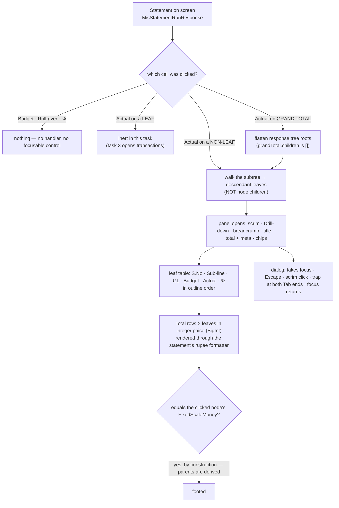

# Task plan — drill-panel: the drill overlay and the Actual-only affordance

Story: drill-down · Task 2 of 3 · **user_facing: true**

## Objective
Make Actuals interactive and give the drill its panel. Clicking any **non-leaf** Actual —
including the **Grand Total** — opens the approved prototype's overlay on a flattened list of
that node's **descendant leaves**, footing to the number that was clicked in exact paise.

Per decision **0024** this is a pure projection of the statement payload already on screen:
no request, no audit record, and it works with the network down. The leaf drill to
transactions is task 3; **nothing in this task calls `api/mis/statement/drill`**.

## Acceptance criteria (plan_contracts)
- **t-dp-c1** — non-leaf Actual cells become real buttons inside their gridcells; Budget,
  Roll-over and % expose nothing; leaf Actuals are **plain non-focusable text** in the
  statement *and* in the panel, and the "Click any Actual…" copy is **held for task 3**.
- **t-dp-c2** — a non-leaf opens **all** descendant leaves in the **clicked block**, from the
  payload, with **zero network calls proven by a spy**, under a "Statement outline order" chip.
- **t-dp-c3** — the Grand Total special case: flatten `response.tree` roots, not its own
  empty `children`.
- **t-dp-c4** — the Total row foots in **exact paise** (three levels deep, and on a divergent
  FY-YTD block), shows the paise beneath the rupees, and **derives** its percentage by the
  statement's nil rules.
- **t-dp-c5** — the prototype's chrome, and all five dialog behaviours: initial focus,
  Escape, **scrim click**, a trap at **both** Tab boundaries, and focus return.
- **t-dp-c6** — the seven vitest leaves, and a live functional check with the design skills
  attested.

## What already exists (grounding, file:line)
- `contract/src/api.ts` — `MisStatementNode { nodeKey, sNo, budgetComponent, glCode,
  measures, children }` and `MisStatementMeasureBlock { key, label, from, to, budget,
  rollover, actual, percentage, sourcePresence }`. `budget` and `actual` are
  `FixedScaleMoney` — a **fixed two-decimal string** — which is what makes a paise-exact
  client-side sum possible at all.
- `backend/src/mis/mis-statement.service.ts` — `grandTotal` is built by `toWireNode` with
  `children: []` and is returned **beside** `tree`, not inside it; the synthetic
  `unmapped-GL` root is pushed into `roots`, so it **is** one of `response.tree`'s entries.
- `frontend/src/features/mis/statement-view.tsx` — `StatementRow` recurses over
  `node.children` with `aria-level`; `MeasureCells` renders Budget / Roll-over / Actual / %
  as plain `<td data-numeric>`; the grand total is a `<tfoot>` row rendering the same
  `MeasureCells`; `formatMoney` rounds a `FixedScaleMoney` **to the rupee** for display;
  `formatPercentage` passes non-numeric labels through verbatim.
- `frontend/app/globals.css:566+` — every statement style lives in this one global
  stylesheet (`.mis-statement`, `.mis-statement-table`, `.mis-statement-row`, …). The panel's
  styles belong here too.
- `docs/design/3F-Financial-MIS/3F Financial MIS.dc.html` — the drill overlay as drawn: a
  scrim (`rgba(12,53,41,.32)`), the eyebrow **Drill-down**, a breadcrumb (group › sub-line),
  the title, a total + meta line, a "Sorted" chip row, a `✕` close control, the L1 table
  *S.No · Sub-line · GL code · Budget · Actual · %* with a **Total** row, and the guidance
  copy "Click any Actual to see its transactions. Budget is not drillable."
- Task 1 shipped `MisDrillRequest`/`MisDrillResponse` and the endpoint. **This task must not
  use them.**

## Design

### What "descendant leaves" means
A leaf is a node with `children.length === 0`. The flatten walks the clicked node's subtree
and collects leaves in encounter order, which is the statement's own outline order. It is
**not** `node.children`: under `9 Admin Expenses` the tree is three deep
(`9.01 Vehicle Maintenance` → its GL leaves), so stopping at children would list the wrong
rows — and still foot, because parents are derived subtotals (decision **0020**). That is
why the three-level case is a required test rather than a nicety.

The **Grand Total** is the one node whose descendants are not under it: it is a sibling of
`tree` with `children: []`, so clicking it flattens the **roots of `response.tree`** — which
already include the synthetic `unmapped-GL` root.

### Footing in paise
`FixedScaleMoney` is `` `${bigint}.${digit}${digit}` ``. Sum by parsing each value to integer
paise and adding as `BigInt`, then compare to the clicked node's own value as **string
equality after normalisation**. Never `Number()`: a float sum over a hundred-odd leaves loses
the last paise, and `formatMoney` rounds to the rupee, so a rounded comparison can hide a
real mismatch. The Total row **renders** through the statement's existing `formatMoney`, so
it reads identically to the cell that was clicked; the equality lives in the test.

The Total row shows the rupee figure through the statement's existing `formatMoney` **with
the exact paise value on a secondary line**, matching what the story plan settled for the
drill footer.

The percentage on the Total row is **derived** from the summed budget and actual by the same
nil rules the statement already applies — `NA` for 0/0, **over-budget** for a zero budget
with a positive actual, **credit / negative actual** for a zero budget with a negative one —
never summed, and never passed through a numeric formatter: `mis-selection` shipped `NaN`
once by pushing a label through `Intl.NumberFormat`. Each of the three cases is tested
directly.

**The clicked block, not the first one.** A panel that reads `measures[0]` passes every
single-block fixture. The FY-YTD test exists to catch exactly that: its two blocks hold
different numbers and the assertions are against the clicked one.

### Two deliberate departures from the prototype, both recorded
- The level-one sort chip in the prototype reads **Actual descending**. These rows are in the
  statement's **outline order**, so the chip reads **"Statement outline order"** — a static,
  non-interactive label. Copying the drawn label would misdescribe the data.
- The guidance copy **"Click any Actual to see its transactions. Budget is not drillable."**
  is **held back to task 3**, which is when clicking a leaf actually opens transactions.
  Shipping it now would promise a behaviour the task does not deliver. Leaf Actuals render as
  plain, non-focusable text — no underline, no pointer, no handler — in the panel as well as
  in the statement, so there is no false affordance either.

### The affordance
`MeasureCells` gains an `onOpen` seam. For a **non-leaf** node the Actual cell renders a
`<button>` *inside* its `<td role="gridcell">` — not a handler on the cell and not a role
swap — so the `role="treegrid"` structure stays valid and the control is keyboard-reachable
and named for screen readers. Budget, Roll-over and % render exactly as today: no handler,
no `tabIndex`, no pointer cursor, no hover affordance. Leaf rows keep their plain Actual in
this task.

### The panel
A modal dialog over the statement, built from the prototype: scrim, eyebrow, breadcrumb,
title, total + meta, the sort chip, close control and the leaf table. It is labelled by its
own title, and **all five dialog behaviours are required**: it takes focus when it opens,
**Escape** closes it, **clicking the scrim** closes it (the prototype's own scrim carries a
close handler), focus is **trapped at both Tab boundaries** while it is open, and on close
focus **returns to the Actual button** that opened it.

## Workflow

No node in this flow touches the network — and a required test spies the API client across
both an aggregate and the Grand Total to prove it, rather than leaving it to inspection.

## Manual Verification
1. `npm run typecheck && npm run lint && npm run format:check && npm run test:frontend &&
   npm run build:frontend` — the **seven** required vitest leaves pass. Confirm each report's
   testcase name is the leaf and its executed count is non-zero: `vitest run -t <name>` exits
   **0 having run nothing** when the name matches no test (D-0031).
2. **Live, against this worktree's servers on 3000/4000** — generate the Agriculture /
   Nursery / DUB / 2026-07-01 statement, then:
   - click `9 Admin Expenses`' Actual and confirm the panel lists its **GL leaves**, not
     `9.01 Vehicle Maintenance`, and that the Total reads the same rupee figure as the cell;
   - click the **Grand Total** and confirm the panel lists every root including
     `unmapped-GL`, with the Total equal to the grand total and the exact paise beneath it;
   - click the same node's Actual under the **FY 26-27 YTD** block and confirm the panel's
     numbers are that block's, not the selected month's;
   - confirm a leaf's Actual inside the panel is plain text: no underline, no pointer, not
     reachable by Tab, and clicking it does nothing;
   - click a **Budget**, a **Roll-over** and a **%** cell and confirm nothing happens and
     nothing takes focus by keyboard;
   - open the panel and check all five dialog behaviours: it takes focus, **Escape** closes,
     a **scrim click** closes, Tab and Shift+Tab stay inside it, and focus returns to the
     Actual button.
3. **With the network disabled in devtools**, open and close the panel several times — it
   must behave identically. That is decision 0024 made visible.
4. Compare the panel against `docs/design/3F-Financial-MIS` side by side: scrim, eyebrow,
   breadcrumb, total/meta line, chip, close control and table columns — with the two recorded
   departures (the chip reads "Statement outline order", and the "Click any Actual…" copy is
   absent until task 3).

## Decisions attested
0024 (the aggregate drill is a client projection; only the leaf drill crosses the network),
0020 (Actuals attach at the GL leaf and parents are derived — so a node HAS descendant leaves
and its subtotal already equals their sum), 0018 (`unmapped-GL` is explicit and visible — so
it appears among the flattened roots), 0021 (the outline snapshot is the row order the panel
preserves), 0007 (Next.js/React), 0006 (frontend built fresh from the approved design),
0010 (3F identifiers), 0019 (house style for anything that touches the API layer — nothing
here does).

## Surface impact
- **New:** `frontend/src/features/mis/drill-panel.tsx` and its test.
- **Changed:** `statement-view.tsx` (the Actual affordance and the panel's open/close state)
  and its test; the panel's styles in `frontend/app/globals.css`.
- **Unchanged:** every contract type, `use-mis-statement.ts`, `frontend/src/lib/api.ts` — this
  task adds no request — and the whole backend.

## Out of scope
The leaf → transactions state, the "Click any Actual to see its transactions" copy,
pagination, the batch-replaced and stale-snapshot notices and anything that calls
`api/mis/statement/drill` (task 3); Excel export of transactions
(D-0035); drilling Budget, Roll-over or %.

<!-- forge:contract -->
## Contract (recorded)

Rendered by the harness from the recorded decomposition; edit the decomposition, not this block. It is excluded from the plan's approval and grill digests, so a re-render never stales either.

**Objective.** Make Actuals interactive and give the drill its panel. Clicking any non-leaf Actual - including the Grand Total - opens the approved prototype's overlay on a flattened list of that node's descendant leaves, footing to the number that was clicked in exact paise. Per decision 0024 this is a pure projection of the statement payload already on screen: no request, no audit record, and it works with the network down. Frontend only; the leaf drill to transactions is task 3, and nothing in this task calls api/mis/statement/drill.

**Acceptance criteria**

- Every NON-LEAF Actual cell in the statement tree and in the grand-total footer row becomes a real <button> inside its gridcell, so the role='treegrid' table keeps a valid structure and the affordance is keyboard-reachable; Budget, Roll-over and % carry no click handler, no focusable control and no pointer affordance anywhere in the table. LEAF Actuals stay inert - in the statement AND in the panel's own leaf rows, where they render as plain non-focusable text with no underline, pointer or handler - and the prototype's 'Click any Actual to see its transactions' guidance is held back to task 3 so nothing on screen promises a behaviour this task does not deliver. Task 3 upgrades those cells and adds that copy together.
- Clicking a non-leaf Actual opens the panel on a flattened list of ALL its descendant leaves, not just its immediate children, rendered in the CLICKED measure block as the prototype's table - S.No, Sub-line, GL code, Budget, Actual, % - in the statement's own outline order, under a static non-interactive chip reading 'Statement outline order' rather than the prototype's 'Actual descending', which would misdescribe the rows. It issues NO network request and writes no audit record, proven falsifiably by spying on the API client across opening both a nested aggregate and the Grand Total and asserting zero calls - not by inspection.
- The Grand Total opens the same way, by a deliberate special case: grandTotal is a SIBLING of the tree carrying children: [], so flattening its own children would render an empty panel. Clicking it flattens the roots of response.tree instead, which already include the synthetic unmapped-GL root, and the panel's Total row equals the statement's grand total.
- The panel's Total row foots in EXACT PAISE: budget and actual are summed over the flattened leaves as integer paise from their FixedScaleMoney two-decimal strings and compared to the clicked node's own value as an equality, never through Number(). Proven for a three-level node (9 Admin Expenses to 9.01 Vehicle Maintenance to its leaves) where a one-level flatten lists different rows, and for the Grand Total, and against a divergent FY-YTD fixture so the test cannot pass while silently reading the default selected block. The Total row renders the rupee figure through the statement's own formatMoney so it reads identically to the cell that was clicked, with the exact paise value on a secondary line. Its percentage is DERIVED from the summed budget and actual by the statement's nil rules - NA for zero over zero, over-budget for a zero budget with positive actual, and credit / negative actual for a zero budget with negative actual - each proven directly, never summed and never passed through a numeric formatter.
- The panel matches the approved prototype: a scrim over the statement, the eyebrow 'Drill-down', a breadcrumb (group then sub-line where there is one), the node title, a total and meta line, the sort chip row, and a close control. It is a real modal dialog: it takes focus when it opens, Escape closes it, CLICKING THE SCRIM closes it as the prototype's own scrim handler does, focus is trapped across Tab and Shift+Tab at both boundaries while it is open, and on close focus returns to the Actual control that opened it.
- The behaviour is proven by vitest leaves covering the descendant flatten and its paise-exact footing at three levels and on a divergent FY-YTD block, the Grand Total special case over response.tree roots, the zero-budget percentage labels, that Budget, Roll-over and % expose no control and that leaf Actuals do nothing when clicked, the zero-network assertion, and the dialog's initial focus, Escape, scrim-click, focus trap and focus return; plus a live functional check against this worktree's servers confirming design parity with the prototype panel. The task is user_facing, so the design skills are loaded, used and attested.

**Write scope** (what `stage done` measures the diff against)

- frontend/src/features/mis/drill-panel.tsx
- frontend/src/features/mis/drill-panel.test.tsx
- frontend/src/features/mis/statement-view.tsx
- frontend/src/features/mis/statement-view.test.tsx
- frontend/app/globals.css

**Required tests** (run by `stage done`)

- `a non leaf actual opens the panel on all its descendant leaves and the total foots to the clicked node in exact paise at three levels` -- `npm exec --no -- vitest run --config frontend/vitest.config.ts {path} -t {id} --reporter=junit --outputFile={report}` (frontend/src/features/mis/drill-panel.test.tsx)
- `the panel renders the clicked measure block and foots to it when the financial year to date block differs from the selected month` -- `npm exec --no -- vitest run --config frontend/vitest.config.ts {path} -t {id} --reporter=junit --outputFile={report}` (frontend/src/features/mis/drill-panel.test.tsx)
- `the grand total opens the flattened roots of the statement tree including the unmapped gl line and foots to the grand total` -- `npm exec --no -- vitest run --config frontend/vitest.config.ts {path} -t {id} --reporter=junit --outputFile={report}` (frontend/src/features/mis/drill-panel.test.tsx)
- `the total row derives its percentage by the statement nil rules for a zero budget with no actual a positive actual and a negative actual` -- `npm exec --no -- vitest run --config frontend/vitest.config.ts {path} -t {id} --reporter=junit --outputFile={report}` (frontend/src/features/mis/drill-panel.test.tsx)
- `opening a nested aggregate and the grand total issues no api call at all` -- `npm exec --no -- vitest run --config frontend/vitest.config.ts {path} -t {id} --reporter=junit --outputFile={report}` (frontend/src/features/mis/drill-panel.test.tsx)
- `the drill panel takes focus traps tab and shift tab closes on escape and on a scrim click and returns focus to the actual control that opened it` -- `npm exec --no -- vitest run --config frontend/vitest.config.ts {path} -t {id} --reporter=junit --outputFile={report}` (frontend/src/features/mis/drill-panel.test.tsx)
- `budget rollover and percentage cells expose no control and leaf actuals do nothing when clicked` -- `npm exec --no -- vitest run --config frontend/vitest.config.ts {path} -t {id} --reporter=junit --outputFile={report}` (frontend/src/features/mis/statement-view.test.tsx)

**Verify commands**

- `npm run typecheck`
- `npm run lint`
- `npm run format:check`
- `npm run test:frontend`
- `npm run build:frontend`

**Review budget.** 5 files / 1000 lines -- A new panel component carrying three structural pieces (the descendant flatten, paise-exact footing with derived nil-rule percentages, and full modal-dialog behaviour), the statement view's Actual affordance and panel state, their two test files covering seven required leaves, and the panel's styles in the one global stylesheet the frontend uses. No new dependency, no network layer, no contract change - the wire types this renders from already shipped with task 1.
<!-- /forge:contract -->
