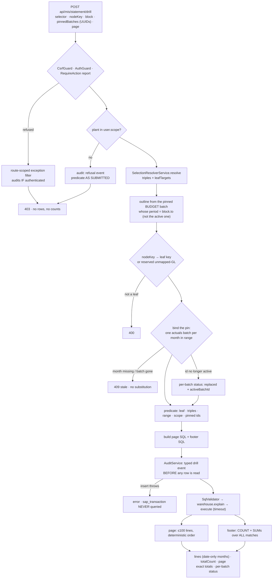

# Task plan — drill-transactions-api: the pinned, audited leaf transactions read

Story: drill-down · Task 1 of 3 · **user_facing: false**

## Objective
Build the one read path in this story that crosses the network: the SAP transaction lines
behind a statement **leaf**, read from `sap_transaction` under a predicate derived entirely
server-side and pinned to **both** the actuals batches and the budget batch the displayed
statement was built from, audited before the read, and **refused rather than answered** when
the pin does not hold.

This is the raw-row exception to the aggregate-only rules the governed layer enforces
everywhere else, so its authorization and audit are load-bearing, not adjectival.

No UI, no schema migration, and no change to the statement response, the statement
projection, `actual_by_key_month`, or the k-anon suppression the aggregate paths use.

## Acceptance criteria (plan_contracts)
Six criteria, each identical to its recorded `plan_contracts` statement:
- **t-dta-c1** — the route: unversioned, raw response, the three guards, fixed page size 100,
  typed 400/401/403/409, **and its path added to the strict allow-list in
  `app.routes.test.ts`**, which is the only thing that proves it exists (0019).
- **t-dta-c2** — every predicate term except the pinned ids derived server-side, the reserved
  `unmapped-GL` key handled, and **every pinned id validated as a UUID before it reaches SQL
  construction**, with a negative test.
- **t-dta-c3** — the pin is bound, not trusted: one actuals id per month in range, the outline
  taken from **the budget batch whose period equals the block's `to`**, and **per-batch
  status** in the response rather than a scalar flag.
- **t-dta-c4** — a typed, pre-query, fail-closed audit event, plus a **route-scoped exception
  filter** auditing authenticated guard-level refusals, never echoing the resolved predicate
  (0025). `applyKSuppression` stays out of this read, and no aggregate path loses it.
- **t-dta-c5** — two statements under one predicate through validator/explain/timeout,
  fixed-scale money strings, and **date-only normalization** away from `toISOString()`.
- **t-dta-c6** — exact-paise footing as an equality, the FY-YTD fixture, the empty-result and
  bad-page cases, **and the new tests registered in the scripts CI actually runs**.

## What already exists (grounding, file:line)
- `backend/src/warehouse/warehouse-schema.ts:48` — `sap_transaction`: `txn_no`, `line_id`,
  `posting_date`, `month`, `plant`, `cost_center`, `gl_code`, `debit`/`credit` as
  **`numeric(18,2)`**, `memo`, `reference`, `batch_id`. Index
  `idx_sap_transaction_month_plant_cost_center_gl_code` covers the selective predicate.
- `backend/src/warehouse/warehouse-schema.ts:154` — `actual_by_key_month` is
  `SUM(debit - credit)::numeric(18,2) … WHERE batch.source_kind = 'actuals' AND batch.is_active`.
  **No batch parameter.** This is why the drill cannot be a lower-grain read of it.
- `backend/src/warehouse/warehouse-schema.ts:24` — `ingest_batch` has **no plant column**;
  `ingest_batch_active_source_period_unique` gives exactly one active batch per
  `(source_kind, period)`.
- `backend/src/mis/mis-statement.service.ts` — `authorizedSelection` (domain `mis-statement`,
  measures, `dimensionIds: ["leaf_key"]`), the plant-scope check against `user.scope`,
  `blockDefinitions` (`selected` + `fy26-27-ytd`, collapsing to one when they coincide), and
  the synthetic `unmapped-GL` root pushed into the tree **outside** the outline.
- `backend/src/warehouse/statement-outline.repository.ts:10` — `findByBudgetPeriod(period)`,
  which filters `batch.is_active`. **This is the drift hazard**: it must gain a by-batch-id
  sibling.
- `backend/src/mapping/selection-resolver.interface.ts` — `MasterResolvedSelection.leafTargets`:
  `{ plant, costCenter, glCode, target: { kind: "leaf"; leafKey } | { kind: "bucket" } }`.
- `backend/src/chat/selectionExecutor.ts` — `authorize()` (domain/measure/dimension/action
  grants); `executeResolved` is measure-and-dimension shaped and applies `applyKSuppression`
  for `piiSensitive` measures. `withTimeout` is module-private.
- `backend/src/sql/sqlValidator.ts` — object allowlist, no `SELECT *`, **mandatory bounded
  `LIMIT` ≤ `maxRows`**, blocked columns. Generic: takes SQL and an allowlist.
- `backend/src/core/audit.service.ts:43` — `writeRequestEvent` throws on failure (documented
  "no audit, no query") and returns the inserted id; its `selection` parameter is typed as the
  governed `Selection`. Only caller today: `backend/src/chat/chat.service.ts:317`, inside
  `beforeExecute`.
- `backend/src/db/schema.ts:209` — `audit_events`: `event_type`, `user_id`, `session_id`
  (uuid), `question`, `selection` (**jsonb**), `generated_sql`, `objects_touched`.
- `backend/src/auth/auth.guard.ts:77,92,100` — `RequireAction`, `CurrentUser`, `SessionId`.
  `backend/src/app.module.ts:16` registers `CsrfGuard` as an `APP_GUARD`, so every POST needs
  `x-csrf-token`.
- `backend/src/mis/mis.module.ts` — controllers/providers for the MIS surface;
  `SelectionExecutor`, `SemanticLayer` and `AuditService` come from `CoreModule`.
- `backend/src/warehouse/statement-projection.db.test.ts` — the gated-proof pattern:
  `skip: process.env.WAREHOUSE_DB_TEST !== "1"`, `assertLocalWarehouseHost`, truncate,
  ingest the client workbooks, assert. Its `FY_YTD_PERIODS` span comes from the **budget**
  workbook; the actuals extract is **July only**.

## Design

### 1. The predicate, derived server-side
```
nodeKey  → leaf key, resolved against the PINNED budget batch's outline snapshot
           (or the reserved key "unmapped-GL", which the statement synthesises)
leaf key → triples, from resolver.leafTargets filtered to that leaf
           (target.kind === "leaf" && leafKey match; kind === "bucket" for unmapped-GL)
block    → from/to, from the statement's own blockDefinitions — never the client's dates
scope    → user.scope where attribute === "plant"
```
A `nodeKey` that is neither a leaf in that snapshot nor the reserved key is a **400**. Only
the pinned ids come from the browser, and they can only **narrow** the read.

### 2. Binding the pin
The client sends `provenance.activeBatchIds` **verbatim**; the server splits it by `source`.

- Compute the months in `[from, to]` that have an actuals batch at all.
- Require **exactly one** pinned actuals id per such month. Missing month, duplicate,
  wrong-source or wrong-period id → refusal (`409` stale, `400` malformed).
- A pinned id that is valid but no longer active for its month → **read the pinned batch**
  and report `batchState: "replaced"`.
- A pinned id that no longer exists → `409`, reported as gone. **Never** substitute the
  active batch.
- **Budget: there are twelve of them, not one.** Budget ingest writes a batch per workbook
  month, so FY-YTD provenance carries several budget ids. The outline is taken from the
  budget batch whose `period` equals the **block's `to`** — which is exactly what
  `mis-statement.service.ts` itself reads (`findByBudgetPeriod(resolution.period.to)`) — and
  that id is bound by the same replaced/gone rules. The other budget ids are not used: the
  drill reads no budget.
- **Status is reported per pinned batch**, not as a scalar: `{ source, period,
  requestedBatchId, status: "current" | "replaced" | "gone", activeBatchId }`. Task 3 cannot
  name *which* batch changed from a single flag.
- **Every pinned id is validated as a UUID by the request schema** before it reaches SQL
  construction. The repository interpolates literals and `SqlValidator` is a post-check that
  does not make interpolation safe.

The mapping master needs no pin **within a process**: `MIS_MAPPING_MASTER` is a compiled-in
constant with a `version` (0014). A statement rendered before a deployment and drilled after
one is a real but bounded window — ledgered as **D-0038**, with the audit record naming the
version so any such drill is attributable rather than invisible.

**Not reopened here:** a signed or server-held statement snapshot would bind the pin to the
*displayed* statement outright, and a client can otherwise substitute a different historical
batch for a month. That was put to the human at the plan gate and **rejected** in favour of
the completeness rule: the substitution is a user misleading themselves with data they are
already authorized to read — plant scope and triples still apply, so it discloses nothing —
and the audit record names the exact ids read.

### 3. The read
Two statements, one predicate, both through `SqlValidator` → `warehouse.explain` → execute
under the configured timeout:

```sql
-- page
SELECT month, posting_date, debit, credit, (debit - credit) AS value, reference, memo
FROM sap_transaction AS txn INNER JOIN ingest_batch AS batch ON batch.id = txn.batch_id
WHERE txn.batch_id IN (<pinned>) AND (txn.plant, txn.cost_center, txn.gl_code) IN (<triples>)
  AND txn.plant IN (<scope>) AND txn.month >= <from> AND txn.month < <next(to)>
ORDER BY (txn.debit - txn.credit) DESC, txn.month DESC, txn.posting_date DESC,
         txn.txn_no, txn.line_id
LIMIT 100 OFFSET <(page - 1) * 100>

-- footer: COUNT(*), SUM(debit), SUM(credit), SUM(debit - credit) … LIMIT 1
```
Page size is **fixed at 100** server-side. Money leaves the service as a fixed-scale decimal
**string**, never a JSON number.

`month` and `posting_date` are normalized to **date-only strings from process-local date
parts**. `postgres.adapter.ts:112` serializes `DATE` through `toISOString()`, so east of UTC
a month of `2026-07-01` comes back as `2026-06-30` — the same bug the statement already hit.
The required test sets a non-UTC `TZ`; one that runs under UTC proves nothing.

### 4. The audit
Derive predicate → build SQL → **write the record** → only then touch `sap_transaction`. A
throw aborts before the read, exactly as `chat.service.ts` does inside `beforeExecute`.
`AuditService` gains a typed drill event (actor, `nodeKey`, leaf key, triples, range, pinned
actuals **and** budget ids, mapping-master version, SQL, objects touched) — `selection` is
`jsonb`, so this is a TypeScript widening, not a migration.

**Refusals need two paths, because the guards run first.** `AuthGuard`, the global
`CsrfGuard` and `RequireAction("report")` all reject before the controller is reached, so the
service can only audit its own refusals (plant scope, governed grants, stale or vanished
pin). Guard-level refusals are caught by an exception filter registered **on this route
only**, which audits any refusal where a user is authenticated and **skips unauthenticated
callers** so an anonymous caller cannot flood `audit_events`. Every refusal event carries the
predicate **as submitted**, never the resolved one.

### 5. The FY-YTD fixture
The client extract is July only, so criterion "FY-YTD spans batches" cannot be proven against
client data. The gated proof constructs a deliberate multi-period actuals fixture (the July
rows re-stamped into two earlier months as their own batches) and the evidence says which
assertions rest on client data and which on the fixture.

## Workflow


## Manual Verification
1. `npm run build:contract && npm run build:backend && npm run typecheck && npm run lint &&
   npm run format:check && npm run test:hermetic` — the **nine** required leaves pass, and
   the new hermetic files appear in both `backend/package.json`'s `test:hermetic` **and**
   `tools/quality-gate.test.mjs`; a file in neither is a test CI never runs. Read
   the junit report's **testcase name and executed count**, not the exit code: both runners
   report green having asserted nothing when a named leaf does not exist (D-0024, D-0031).
2. **Gated warehouse proof** — with `WAREHOUSE_DB_TEST=1` and the documented `WAREHOUSE_PG_*`
   env, run `backend/src/warehouse/drill-transactions.db.test.ts`: a leaf and the
   `unmapped-GL` bucket each foot to the statement's Actual in **exact paise**; the
   multi-period fixture proves the FY-YTD case; requesting a page twice returns identical
   rows; and a result larger than 100 has a footer covering all matches.
3. **Against the live warehouse**, call the route for Agriculture / Nursery / DUB /
   2026-07-01 with a leaf `nodeKey` and the statement's own `provenance.activeBatchIds`, and
   confirm the footer equals that leaf's Actual. Then drop one month's id from the payload
   and confirm a **409**, not a smaller answer.
4. `SELECT event_type, question, selection FROM audit_events ORDER BY ts DESC LIMIT 3` —
   the drill event carries the leaf, the triples, the range, both pinned sources and the
   mapping-master version; a drill attempted without plant scope leaves a refusal event whose
   `selection` holds the **submitted** predicate only.
5. The existing gated proofs still pass unchanged — this task adds SQL but changes none.

## Decisions attested
0024 (only the leaf drill crosses the network), 0025 (pinned raw read beside the governed
executor, fail-closed audit), 0017 (triples filter the Actual side), 0018 (`unmapped-GL` is
explicit — so it drills), 0020 (Actuals attach at the GL leaf), 0021 (the outline snapshot is
what maps `nodeKey` to a leaf — hence the budget pin), 0022 (the statement projection whose
numbers this must foot to), 0019 (unversioned route, raw response, typed error responses),
0014 (compiled-in mapping master), 0015 (snake_case warehouse), 0008/0012 (vendored backend
house style), 0009 (required tests name a real leaf and pin `TS_NODE_PROJECT`).

## Surface impact
- **New:** `mis-drill.{controller,service,interface,dto}.ts` + tests;
  `warehouse/drill-transactions.{repository,interface}.ts` + unit and gated tests; drill
  request/response types in `contract/src/api.ts`.
- **Changed (additive only):** `StatementOutlineRepository` gains a by-batch-id lookup;
  `AuditService` gains the typed drill event; `mis.module.ts` registers the new providers and
  the route-scoped audit filter; `mis-statement.service.ts`/`.interface.ts` expose their block
  definitions and authorization helper for reuse rather than duplication.
- **Registration, without which nothing above is proven:** the route path in
  `backend/src/app.routes.test.ts` (the strict allow-list), the new hermetic tests in
  `backend/package.json` `test:hermetic` and `tools/quality-gate.test.mjs`, the gated proof in
  `test:warehouse-proof`, and — because this task edits `audit.service.ts` — formatting it and
  dropping its `.prettierignore` entry per **D-0006**.
- **Unchanged:** the statement response contract, the statement projection,
  `actual_by_key_month`, `suppression.ts`, and the database schema. **No migration.**

## Out of scope
The panel and both of its states (tasks 2 and 3); any Excel export of transactions (D-0035);
auditing the statement and export routes (D-0036); pinning the mapping-master version across
deployments (D-0038); auditing guard refusals on routes other than this one; drilling Budget,
Roll-over or %.

<!-- forge:contract -->
## Contract (recorded)

Rendered by the harness from the recorded decomposition; edit the decomposition, not this block. It is excluded from the plan's approval and grill digests, so a re-render never stales either.

**Objective.** Build the one read path in this story that crosses the network: the SAP transaction lines behind a statement LEAF, read from sap_transaction under a predicate derived entirely server-side and pinned to BOTH the actuals batches and the budget batch the displayed statement was built from, audited before the read and refused rather than answered when the pin does not hold. Decision 0025 governs the path; decision 0024 is why there is only one endpoint - aggregates are a client projection, task 2. Backend only: no UI, no schema migration, and no change to the statement response, the statement projection, actual_by_key_month or the k-anon suppression the aggregate paths use.

**Acceptance criteria**

- POST api/mis/statement/drill is registered as an unversioned route returning a raw response with direct module imports, behind AuthGuard, RequireAction('report') and the globally registered CsrfGuard, taking the statement's own selector plus nodeKey, the measure block key, the statement's provenance.activeBatchIds passed through verbatim as pinnedBatches, and a 1-based page; page size is FIXED SERVER-SIDE at 100 and is not client-settable; it declares typed 400/401/403/409 responses alongside its success schema the way mis-statement.controller.ts does, and its path is added to the strict allow-list in backend/src/app.routes.test.ts, which is the only place that proves the route exists.
- Every term of the predicate except the pinned batch ids is derived server-side on EVERY request and never read off the client: the leaf key from nodeKey against the PINNED budget batch's outline snapshot or the reserved key 'unmapped-GL' that the statement synthesises outside the outline; the (plant, cost centre, GL) triples from SelectionResolverService.leafTargets filtered to that leaf (target.kind 'leaf' with a matching leafKey, or target.kind 'bucket' for the reserved key); the month range from the statement's own block definitions; and the plant scope from user.scope. A nodeKey that is neither a leaf in that snapshot nor the reserved key is a 400. Every pinned batch id is validated as a UUID by the request schema BEFORE it reaches SQL construction, with a negative test, because the repository interpolates literals and SqlValidator is a post-check that does not make interpolation safe.
- The pin is BOUND, not trusted. The server splits pinnedBatches by source; it computes which months in the block's range have an actuals batch and requires exactly one pinned id per such month - a missing month, a duplicate, a wrong-source or wrong-period id is a REFUSAL, never an authorized but partial footer. Budget ingest creates a batch per workbook month, so FY-YTD provenance carries several budget ids: the outline is taken from the budget batch whose period equals the block's `to`, matching what the statement itself read, and the other budget ids are not used. A pinned id that is valid but no longer active for its period means a re-upload: read the PINNED batch and report it. A pinned id that no longer exists is reported as gone and refused. The response reports status PER PINNED BATCH - source, period, requested id, current/replaced/gone, and the now-active id where there is one - not a single scalar flag, because task 3 cannot name what changed from a scalar.
- Every drill writes its audit record BEFORE any sap_transaction read and fails closed: a TYPED drill event naming the actor, nodeKey, the resolved leaf key, the triples, the month range, the pinned actuals AND budget ids, the mapping-master version, the generated SQL and the objects touched, and if the insert throws the endpoint errors with NO transaction query issued. audit_events.selection is already jsonb, so this widens AuditService in TypeScript rather than the schema. Refusals are audited too: the service's own refusals directly, and guard-level refusals through an exception filter registered ON THIS ROUTE ONLY, which audits any refusal where a user is authenticated and skips unauthenticated callers so an anonymous caller cannot flood the audit table. A refusal event carries the predicate AS SUBMITTED, never the resolved one.
- The read is two statements over sap_transaction joined to ingest_batch under one identical predicate, so the footer cannot drift from the page: the page (ORDER BY (debit - credit) DESC, month DESC, posting_date DESC, txn_no, line_id with LIMIT/OFFSET) and the footer (COUNT(*) plus the three SUMs, LIMIT 1). Both go through SqlValidator.validate and warehouse.explain before execution and run under the configured query timeout, reusing the governed layer's guards rather than reimplementing them, and applyKSuppression is NOT wired in - this read is the documented exception (0025) and no aggregate path loses it. Money crosses the wire as a fixed-scale decimal STRING, never a JSON number. month and posting_date are normalized to date-only strings from process-local date parts, because the Postgres adapter serializes DATE through toISOString() and east of UTC that turns 2026-07-01 into the previous day; a test proves the normalization under a non-UTC TZ.
- Footing is proven in EXACT PAISE as an equality, never a tolerance - for a leaf and for the unmapped-GL bucket against the pinned July batch - because sap_transaction.debit and .credit are numeric(18,2), so the actual_by_key_month view's ::numeric(18,2) cast is a no-op and the statement's paise ARE these rows' paise summed. The FY-YTD multi-batch case CANNOT be proven against client data (the supplied SAP extract is July only), so this task builds a deliberate multi-period actuals fixture for it and the evidence states which proofs rest on client data and which on the fixture. An empty result is a SUCCESS with zero rows and a zero footer; a non-integer or out-of-range page is a 400. The new gated proof is registered in backend/package.json's test:warehouse-proof and the new hermetic tests in test:hermetic and tools/quality-gate.test.mjs, or CI runs none of them.

**Write scope** (what `stage done` measures the diff against)

- contract/src/api.ts
- backend/src/mis/mis-drill.controller.ts
- backend/src/mis/mis-drill.controller.test.ts
- backend/src/mis/mis-drill.service.ts
- backend/src/mis/mis-drill.service.test.ts
- backend/src/mis/mis-drill.interface.ts
- backend/src/mis/mis-drill.dto.ts
- backend/src/mis/mis-drill.audit.filter.ts
- backend/src/mis/mis.module.ts
- backend/src/warehouse/drill-transactions.repository.ts
- backend/src/warehouse/drill-transactions.interface.ts
- backend/src/warehouse/drill-transactions.repository.test.ts
- backend/src/warehouse/drill-transactions.db.test.ts
- backend/src/warehouse/statement-outline.repository.ts
- backend/src/warehouse/statement-outline.interface.ts
- backend/src/core/audit.service.ts
- backend/src/mis/mis-statement.service.ts
- backend/src/mis/mis-statement.interface.ts
- backend/src/app.routes.test.ts
- backend/package.json
- tools/quality-gate.test.mjs
- .prettierignore

**Required tests** (run by `stage done`)

- `the drill resolves its leaf and triples server side rejecting a node key that is neither a snapshot leaf nor the reserved unmapped gl bucket` -- `TS_NODE_PROJECT=backend/tsconfig.json TS_NODE_TRANSPILE_ONLY=1 node tools/junit-run.mjs --file {path} --name {id} --report {report} --require ts-node/register` (backend/src/mis/mis-drill.service.test.ts)
- `the request schema rejects a pinned batch id that is not a uuid before any sql is built` -- `TS_NODE_PROJECT=backend/tsconfig.json TS_NODE_TRANSPILE_ONLY=1 node tools/junit-run.mjs --file {path} --name {id} --report {report} --require ts-node/register` (backend/src/mis/mis-drill.controller.test.ts)
- `the pinned batch set is refused when it does not cover every month in the block range and reports per batch status when a pinned batch is no longer active` -- `TS_NODE_PROJECT=backend/tsconfig.json TS_NODE_TRANSPILE_ONLY=1 node tools/junit-run.mjs --file {path} --name {id} --report {report} --require ts-node/register` (backend/src/mis/mis-drill.service.test.ts)
- `the drill takes its outline from the pinned budget batch whose period equals the block end rather than the currently active one` -- `TS_NODE_PROJECT=backend/tsconfig.json TS_NODE_TRANSPILE_ONLY=1 node tools/junit-run.mjs --file {path} --name {id} --report {report} --require ts-node/register` (backend/src/mis/mis-drill.service.test.ts)
- `a failing audit insert aborts the drill before any transaction query is issued` -- `TS_NODE_PROJECT=backend/tsconfig.json TS_NODE_TRANSPILE_ONLY=1 node tools/junit-run.mjs --file {path} --name {id} --report {report} --require ts-node/register` (backend/src/mis/mis-drill.service.test.ts)
- `an authenticated drill refused by the route guards is audited with the predicate as submitted and never the resolved predicate` -- `TS_NODE_PROJECT=backend/tsconfig.json TS_NODE_TRANSPILE_ONLY=1 node tools/junit-run.mjs --file {path} --name {id} --report {report} --require ts-node/register` (backend/src/mis/mis-drill.controller.test.ts)
- `the drill page and footer queries share one predicate and emit the deterministic order with a bounded limit the validator accepts` -- `TS_NODE_PROJECT=backend/tsconfig.json TS_NODE_TRANSPILE_ONLY=1 node tools/junit-run.mjs --file {path} --name {id} --report {report} --require ts-node/register` (backend/src/warehouse/drill-transactions.repository.test.ts)
- `drill line dates are normalized to date only strings under a non utc timezone` -- `TS_NODE_PROJECT=backend/tsconfig.json TS_NODE_TRANSPILE_ONLY=1 node tools/junit-run.mjs --file {path} --name {id} --report {report} --require ts-node/register` (backend/src/warehouse/drill-transactions.repository.test.ts)
- `the drill route refuses an out of range page and returns an empty result as a zero row success with a zero footer` -- `TS_NODE_PROJECT=backend/tsconfig.json TS_NODE_TRANSPILE_ONLY=1 node tools/junit-run.mjs --file {path} --name {id} --report {report} --require ts-node/register` (backend/src/mis/mis-drill.controller.test.ts)

**Verify commands**

- `npm run build:contract`
- `npm run build:backend`
- `npm run typecheck`
- `npm run lint`
- `npm run format:check`
- `npm run test:hermetic`

**Review budget.** 22 files / 2600 lines -- One route, but five pieces of machinery none of which exists today: server-side predicate derivation including the reserved unmapped-GL key the statement synthesises outside the outline, with UUID validation before SQL; the batch-binding rule in four states across two pinned sources, which drags a by-batch-id lookup into StatementOutlineRepository and per-batch status into the response; a typed drill audit event plus a route-scoped exception filter for guard-level refusals, widening AuditService past the governed Selection shape it takes today; a two-query raw-row repository that must pass SqlValidator, normalize DATE columns away from toISOString and foot in exact paise; and the multi-period fixture the FY-YTD criterion cannot be proven without. The file count carries four registration files the grill showed are load-bearing (app.routes.test.ts, package.json, quality-gate.test.mjs, .prettierignore) without which the route is unproven and the tests unrun. No schema change and no UI.
<!-- /forge:contract -->
