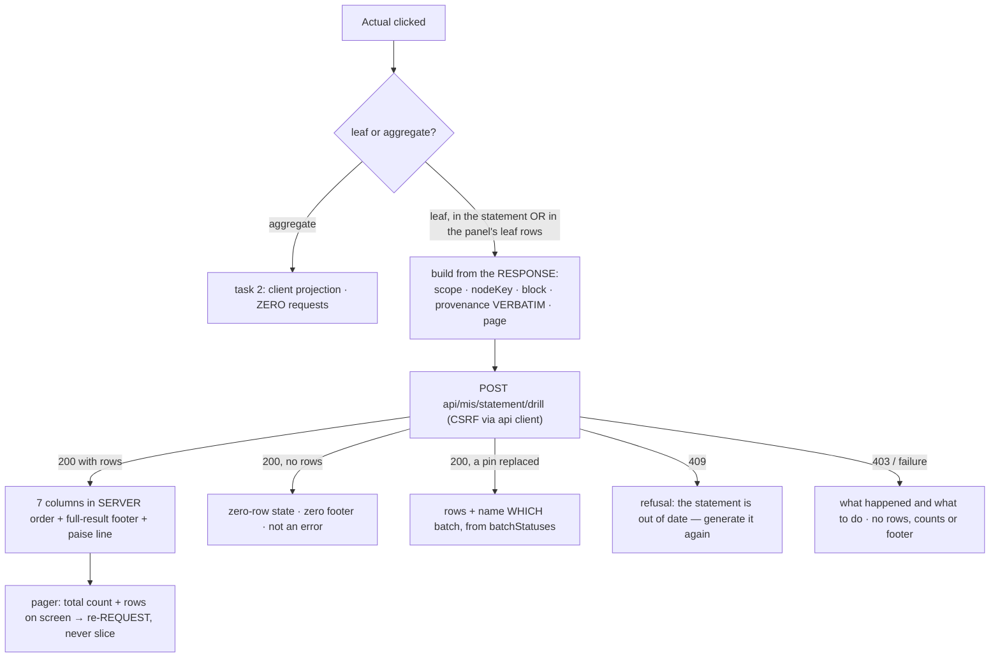

# Task plan — drill-transactions-view: the transactions state of the drill panel

Story: drill-down · Task 3 of 3 · **user_facing: true**

## Objective
Finish the drill. Wire the panel's **leaf** state to `POST api/mis/statement/drill`, render the
transaction lines behind a leaf with a footer that foots to the number on the statement, page a
large result **server-side**, and give every refusal its own clear state.

This is the only task in the story that calls the endpoint task 1 shipped. Frontend only: no
contract change, no backend change, and task 2's aggregate state stays a pure client
projection (decision **0024**) — its zero-request test must keep passing untouched.

## Acceptance criteria (plan_contracts)
- **t-dtv-c1** — leaf Actuals activate in **both** places task 2 left inert; the held guidance
  copy is added; and drilling a leaf **from inside the panel** swaps the body in place, with a
  **Back** control on the breadcrumb's group crumb and a focus contract that can never land on
  an unmounted control.
- **t-dtv-c2** — the request is built from the **displayed response**, with
  `provenance.activeBatchIds` passed through **verbatim**.
- **t-dtv-c3** — seven columns in **server order** with **UTC-safe** dates and their **own**
  column styling; footer = the server's **full-result** total.
- **t-dtv-c4** — pagination is the server's; **pending is a state with rules**; empty is a
  success.
- **t-dtv-c5** — **every** replaced batch named; stale / forbidden / failed / empty each render
  **alone**; the footer's paise equality to the clicked leaf is checked.
- **t-dtv-c6** — ten vitest leaves, two of them deliberately outside the component tests; the
  live check (which does **not** page); the design skills attested.

## What already exists (grounding, file:line)
- `contract/src/api.ts` — `MisDrillRequest { …MisSelectionRunRequest, nodeKey, block,
  pinnedBatches: ProvenanceBatch[], page }`; `MisDrillResponse { nodeKey, leafKey, lines,
  footer, totalCount, page, pageSize: 100, actualBatchIds, budgetBatchId, batchStatuses }`;
  `MisDrillLine { month, postingDate, debit, credit, value, reference, memo }`;
  `MisDrillBatchStatus { source, period, requestedBatchId, status: "current" | "replaced" |
  "gone", activeBatchId }`. All shipped by task 1.
- `frontend/src/features/mis/drill-panel.tsx` — `DrillPanelSelection { node, roots, blockKey,
  breadcrumb, opener }`, the dialog behaviour, the paise helpers and the footing refusal state.
- `frontend/src/features/mis/statement-view.tsx:210` — `onOpen` is passed **only when
  `parent`** is true; that is the line that makes leaf Actuals inert today.
- `frontend/src/lib/api.ts:53,100` — `post<T>(path, body, refreshOn401)` bootstraps CSRF and
  retries once on 401; `runMisStatement` is the shape to follow. The drill needs the same.
- `frontend/src/features/mis/use-mis-statement.ts` — the react-query seam.
- The statement's own export control already builds its request from
  `response.scope`, not from the selectors — the precedent this task follows.

## Design

### The request
Built from the **resolved response**: `scope.department`, `scope.function`, `scope.plant`,
`scope.period`, the clicked `nodeKey`, the clicked block's `key`, `provenance.activeBatchIds`
**verbatim**, and a 1-based `page`. Through the shared `post<T>` so it carries CSRF.

**Pass the provenance array untouched.** The server computes which months need a pin and
refuses an incomplete set. A client that "helpfully" filters it to `source === "actuals"`, or
to the block's months, converts a refusal into a silently wrong footer — the exact failure the
completeness rule exists to prevent. Splitting by source is the server's job.

### Navigating between the two states
Drilling a leaf from inside the aggregate panel **replaces the panel's body in place** — not a
second dialog. The breadcrumb's group crumb becomes a **Back** control, which is the
prototype's own `drill.toGroup` seam, returning to the aggregate list with focus on the leaf
row's Actual that was used. **Close** always returns focus to the statement Actual button that
opened the panel; that button stays mounted throughout, so focus can never land on an
unmounted control.

### The table
Seven columns — **Month · Posting date · Debit · Credit · Value · Reference · Memo** — in the
**server's** order. Posting date is the recorded departure from the prototype's six, settled
because the spec's column list is normative and a line's `month` is its booking month, not the
day it was posted. Never re-sort on the client: the server's order is deterministic by
contract and pagination depends on it.

The footer is the response's `footer`, the **full-result** total, rendered through the
statement's rupee formatter with the exact paise beneath, plus the prototype's note that it
matches the Actual in the report. Summing the rows on screen would give a **page** subtotal
that matches on a single-page leaf and quietly lies on a paged one.

`month` and `postingDate` arrive as **date-only strings** and are formatted **UTC-safe** —
parsed at UTC midnight, as `statement-view` already does — because a local-time `Date` shifts
them a day east of UTC and rendering them raw repeats the ISO-label defect task 2 fixed.

The table declares **its own** column styling. `.mis-drill-table`'s existing positional rules
(`first-child`, `nth-child(3)`, `nth-child(n + 4)`, `last-child`) encode the **six-column
aggregate** layout and would misalign seven columns.

The sort chips read the server's order (Value ↓, Month ↓) in this state, replacing task 2's
outline-order chip.

### Pagination
1-based; the size is the server's fixed 100 and the client neither sets nor overrides it. The
control states the total count and which rows are on screen, and moving pages **re-requests**.
An empty result is a success: zero rows, zero footer, no error.

**Pending is a state with rules**, not a vague promise: while a page is in flight, page
navigation is **disabled**, the previous successful page stays visible with a loading
indication, and a terminal refusal or failure **clears** those rows, the count and the footer.
Stale numbers beside an error is precisely the constitution-07 defect this codebase has
shipped before.

### The five outcomes
| outcome | what the reader sees |
|---|---|
| rows | the table and its full-result footer |
| empty | a zero-row state with a zero footer |
| replaced pin | the rows, **plus every** replaced source and period — `batchStatuses` is a **list**, and an FY-YTD drill can carry several; a `find()` would render one and hide the rest |
| stale / gone pin (409) | a refusal: the statement is out of date, generate it again |
| forbidden (403) / failed | what happened and what to do — no rows, no counts, no footer |
| footer ≠ clicked leaf | the total is **withheld**, in the same treatment task 2 established — the panel never shows a figure it cannot vouch for |

Exactly one at a time. `mis-report-view` once shipped an error and an empty state together;
`constitution/07-exception-handling.md` exists for that class.

## Workflow

## Manual Verification
1. `npm run typecheck && npm run lint && npm run format:check && npm run test:frontend &&
   npm run build:frontend` — the **ten** required leaves pass, each confirmed by its junit
   testcase name and a non-zero executed count (vitest exits 0 having run nothing when `-t`
   matches no leaf, D-0031). Two are deliberately not component tests: one drives the **api
   client directly** in `frontend/src/lib/api.test.ts` — component tests mock the client and so
   prove nothing about the route, the CSRF header, the retry-on-401 or the untouched payload —
   and one re-asserts **task 2's zero-network proof as a required leaf of this task**, so
   regressing decision 0024 fails this task rather than relying on the suite happening to keep
   it.
2. **Live, against this worktree's servers** — generate Agriculture / Nursery / DUB /
   2026-07-01, then:
   - click a **leaf** Actual in the statement and confirm the transactions footer equals that
     leaf's Actual cell;
   - open an aggregate, then click a leaf **inside the panel**, and confirm it drills too;
   - drill **`unmapped-GL`** and confirm it behaves like any other leaf;
   - click a **Budget**, **Roll-over** and **%** cell and confirm nothing happens;
   - confirm the guidance copy "Click any Actual to see its transactions. Budget is not
     drillable." is now present.
3. **The paged case cannot come from client data** — the largest `(plant, cost centre, GL)`
   group in the July extract is 18 rows, so no leaf reaches one 100-row page. Pagination is
   proven by the vitest leaves against a fabricated response; say so in the evidence rather
   than implying a live paged drill.
4. Compare against `docs/design/3F-Financial-MIS`: the transactions table, its Total row and
   the "Matches the Actual in the report" note, with Posting date as the recorded seventh
   column.

## Decisions attested
0025 (the pinned raw read this consumes), 0024 (the aggregate path stays offline — this task
must not regress it), 0018 (`unmapped-GL` drills like any leaf), 0019 (house style for the
client call), 0007, 0006, 0010, 0011.

## Surface impact
- **Changed:** `drill-panel.tsx` (+ test) gains the transactions state; `statement-view.tsx`
  (+ test) activates leaf Actuals and adds the guidance copy; `use-mis-statement.ts` gains the
  drill hook; `frontend/src/lib/api.ts` (+ test) gains the client method;
  `frontend/app/globals.css` gains the table and pager styles.
- **Unchanged:** every contract type, the whole backend, and task 2's aggregate projection.

## Out of scope
Excel export of transactions (**D-0035**); drilling Budget, Roll-over or %; any change to the
endpoint, its binding rules or its audit; client-side sorting or filtering of the returned
rows.

<!-- forge:contract -->
## Contract (recorded)

Rendered by the harness from the recorded decomposition; edit the decomposition, not this block. It is excluded from the plan's approval and grill digests, so a re-render never stales either.

**Objective.** Finish the drill: wire the panel's leaf state to POST api/mis/statement/drill, render the transaction lines behind a leaf with a footer that foots to the number on the statement, page a large result server-side, and give every refusal its own clear state. This is the only task in the story that calls the endpoint task 1 shipped. Frontend only: no contract change, no backend change, and the aggregate state task 2 built stays a pure client projection (decision 0024).

**Acceptance criteria**

- Leaf Actuals become activatable in BOTH places task 2 deliberately left inert: the statement tree and the drill panel's own leaf rows. Each becomes a real <button> inside its gridcell or cell, keeping the treegrid valid and the control keyboard-reachable, and the prototype's guidance copy 'Click any Actual to see its transactions. Budget is not drillable.' is added now that it is true. Budget, Roll-over and % remain inert everywhere - no handler, no focusable control, no pointer affordance - and the unmapped-GL line drills like any other leaf. Drilling a leaf from INSIDE the aggregate panel replaces the panel's body in place rather than opening a second dialog, and the breadcrumb's group crumb becomes a Back control - the prototype's own drill.toGroup seam - that returns to the aggregate list and moves focus to the leaf row's Actual that was used. Close always returns focus to the statement Actual button that opened the panel, which stays mounted throughout, so focus can never land on an unmounted control.
- The request is built from the DISPLAYED statement, never from the mutable filter selectors, exactly as the export control already does: the resolved response's scope (department, function, plant, period), the clicked nodeKey, the clicked measure block's key, the response's provenance.activeBatchIds passed through VERBATIM as pinnedBatches, and a 1-based page. It goes through the shared api client so it carries the CSRF header the global guard requires, as POST /api/mis/statement/drill. The client never filters, reorders or reconstructs the pinned array: the server binds it, and a client that trims it would turn a refusal into a silently wrong footer.
- The transactions state renders the server's rows in the server's order - never re-sorted on the client - as SEVEN columns: Month, Posting date, Debit, Credit, Value, Reference and Memo. Posting date is the recorded departure from the prototype's six columns, settled because the spec's column list is normative and a line's month is its booking month rather than the day it was posted. month and postingDate arrive as date-only strings and are formatted for display in a UTC-SAFE way - parsed at UTC midnight like statement-view already does, never through a local-time Date - because rendering them raw repeats the ISO-label defect this story already fixed once. The seven-column table gets its OWN column styling: the existing .mis-drill-table positional rules (first-child, nth-child(3), nth-child(n+4), last-child) were written for the six-column aggregate table and misalign these columns, so the transactions table declares which of its columns are numeric and which read left. The footer renders the server's FULL-RESULT totals through the statement's rupee formatter with the exact paise on a secondary line, never a page subtotal, and carries the prototype's note that it matches the Actual in the report.
- Pagination is server-side and the client obeys it: pages are 1-based and page size is the server's fixed 100, never set or overridden by the client. The control states the total matching count and which rows are on screen, and moving between pages re-requests rather than slicing what is already loaded. An empty result is a valid response and renders a zero-row state with a zero footer, not an error. While a page is in flight the policy is explicit: page navigation is DISABLED, the previous successful page stays on screen with a loading indication, and a terminal refusal or failure CLEARS those rows, the count and the footer - stale numbers must never sit beside an error.
- Every server outcome has exactly ONE clear state on screen, never two at once. Replacement is reported per batch: batchStatuses is a LIST and an FY-YTD drill can carry several replaced entries, so the panel names EVERY replaced source and period, never the first match from a find(). A stale or vanished pin (409) is a refusal that says the statement is out of date and to generate it again - it never silently shows different numbers. An authorization refusal (403) and a generic failure each say what happened and what to do, in the interface's voice, and neither renders alongside rows, counts or a footer. The displayed footer is also checked against the clicked leaf's own Actual in exact paise; a mismatch withholds the total in the same treatment task 2 established rather than showing a figure the panel cannot vouch for.
- The behaviour is proven by vitest leaves covering: the request built from the displayed scope with provenance passed verbatim; the seven-column table in server order with the full-result footer and its paise equality to the clicked leaf; pagination re-requesting rather than slicing, and the pending-then-failed transition clearing the previous page; the empty result; multi-batch replacement naming every replaced period; and the forbidden and failed states rendering alone. Two of the leaves are deliberately NOT component tests: one exercises the api client directly in frontend/src/lib/api.test.ts, because component tests mock the client and therefore prove nothing about the route, the CSRF header, the retry-on-401 or the untouched payload; and one re-asserts task 2's zero-network aggregate proof as a REQUIRED leaf of this task, so regressing decision 0024 fails this task rather than relying on the suite happening to keep it. The live check runs against this worktree's servers and drills a real leaf, compares the footer to the statement cell and confirms design parity with the prototype panel; it does NOT page, because the July extract's largest (plant, cost centre, GL) group is 18 rows and no real leaf can reach a 100-row page - pagination is proven against a fabricated response and the evidence says so.

**Write scope** (what `stage done` measures the diff against)

- frontend/src/features/mis/drill-panel.tsx
- frontend/src/features/mis/drill-panel.test.tsx
- frontend/src/features/mis/statement-view.tsx
- frontend/src/features/mis/statement-view.test.tsx
- frontend/src/features/mis/use-mis-statement.ts
- frontend/src/lib/api.ts
- frontend/src/lib/api.test.ts
- frontend/app/globals.css

**Required tests** (run by `stage done`)

- `a leaf actual requests the drill with the displayed scope the clicked node and block and the provenance batches passed through verbatim` -- `npm exec --no -- vitest run --config frontend/vitest.config.ts {path} -t {id} --reporter=junit --outputFile={report}` (frontend/src/features/mis/drill-panel.test.tsx)
- `the drill client posts to the governed drill route with the csrf header and the pinned batches untouched` -- `npm exec --no -- vitest run --config frontend/vitest.config.ts {path} -t {id} --reporter=junit --outputFile={report}` (frontend/src/lib/api.test.ts)
- `the transactions table renders the server rows in server order across seven columns with the full result footer equal to the clicked leaf actual in exact paise` -- `npm exec --no -- vitest run --config frontend/vitest.config.ts {path} -t {id} --reporter=junit --outputFile={report}` (frontend/src/features/mis/drill-panel.test.tsx)
- `paging re-requests the next page and a failed next page clears the previous rows count and footer` -- `npm exec --no -- vitest run --config frontend/vitest.config.ts {path} -t {id} --reporter=junit --outputFile={report}` (frontend/src/features/mis/drill-panel.test.tsx)
- `an empty transaction result renders a zero row state with a zero footer and not an error` -- `npm exec --no -- vitest run --config frontend/vitest.config.ts {path} -t {id} --reporter=junit --outputFile={report}` (frontend/src/features/mis/drill-panel.test.tsx)
- `every replaced pinned batch is named and a stale pin refuses and tells the reader to generate the statement again` -- `npm exec --no -- vitest run --config frontend/vitest.config.ts {path} -t {id} --reporter=junit --outputFile={report}` (frontend/src/features/mis/drill-panel.test.tsx)
- `a forbidden drill and a failed drill each render alone with no rows counts or footer` -- `npm exec --no -- vitest run --config frontend/vitest.config.ts {path} -t {id} --reporter=junit --outputFile={report}` (frontend/src/features/mis/drill-panel.test.tsx)
- `drilling a leaf inside the aggregate panel replaces the body in place and back returns to the group with focus on the leaf row` -- `npm exec --no -- vitest run --config frontend/vitest.config.ts {path} -t {id} --reporter=junit --outputFile={report}` (frontend/src/features/mis/drill-panel.test.tsx)
- `leaf actuals are activatable in the statement and in the panel while budget rollover and percentage stay inert` -- `npm exec --no -- vitest run --config frontend/vitest.config.ts {path} -t {id} --reporter=junit --outputFile={report}` (frontend/src/features/mis/statement-view.test.tsx)
- `opening a nested aggregate and the grand total issues no api call at all` -- `npm exec --no -- vitest run --config frontend/vitest.config.ts {path} -t {id} --reporter=junit --outputFile={report}` (frontend/src/features/mis/drill-panel.test.tsx)

**Verify commands**

- `npm run typecheck`
- `npm run lint`
- `npm run format:check`
- `npm run test:frontend`
- `npm run build:frontend`

**Review budget.** 8 files / 1500 lines -- The panel gains a second body state with its own data lifecycle - request, pending policy, pagination and five distinct failure outcomes - plus in-place navigation between the aggregate and leaf states with a Back seam and its focus contract, the api client method and its own direct test, the leaf affordance in two places, and dedicated styling for a seven-column table whose existing positional rules encode the six-column layout. Ten required leaves, most of them state-machine cases that exist only in this task. No contract change and no backend change.
<!-- /forge:contract -->
