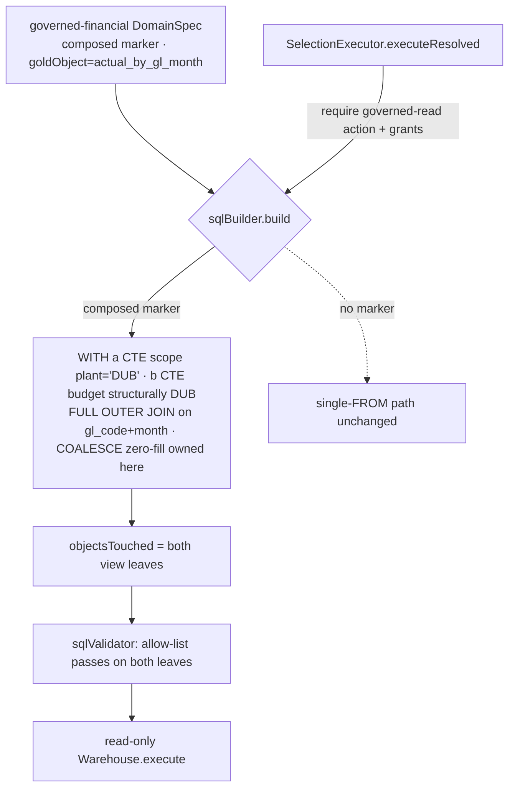

# Task plan — composed-relation: code-composed Budget⋈Actual join + governed-read action

Story: governed-joins · Task 2 of 4 · user_facing: false

## Objective
Provide ONE closed, typed, code-composed governed financial relation that
FULL-OUTER-joins the two GL+month rollup views (task 1) on `(gl_code, month)` with
COALESCE zero-fill — replacing the SQL builder's multi-gold-object rejection — and
enforce a governed-financial **read action** at the shared execution boundary with
the row-scope predicate injected **inside both source CTEs**. This is the cross-
object join the measures (task 3) and the golden fixtures (task 4) build on.

## Acceptance criteria (plan_contracts)
- **t-cr-c1** (narrowed, grill round + 0016) — a single closed, typed code-composed
  relation full-outer-joins the two rollups on `(gl_code, month)` with COALESCE
  zero-fill (Budget-only and Actual-only keys both appear), replacing
  `sqlBuilder.ts:29-32`'s throw and listing both source view leaves in
  `objectsTouched`. **Freshness / dimension enumeration / RBAC scope-validation stay
  pointed at the real source views, and composed reconciliation is deferred (measures
  kept non-critical), with a revisit trigger (multi-plant / production)** — NOT
  reworked here.
- **t-cr-c2** — a governed-financial **read action** is required at the shared
  `SelectionExecutor` boundary with the domain + measure grants, and the scope
  predicate is injected **inside each source CTE** (Actual by plant; Budget by the
  trusted derived constant DUB); a denial case and a predicate-placement test.
- **t-cr-c3** — a demonstrated warehouse-DB test proves correct zero-fill and **no
  fan-out**.

## What already exists (grounding, file:line)
- `sqlBuilder.ts:22` `build(domain, selection, user)`; `:28` collects goldObjects;
  **`:29-32` throws "cross-object composition not implemented in scaffold"** (branch
  here); `:52-59` the `scopeColumn IN (...)` scope injection to reuse; `:98` `FROM
  ${goldObject}`; `:104` `objectsTouched:[goldObject]`; `lit()`/`nextIsoDate()`
  helpers.
- `selectionExecutor.ts:87-155` `executeResolved` — the **shared chokepoint**
  (chat/pins/reports/measures all hit it); `:94` `builder.build`; `:101-106`
  `validator.validate(sql, objectsTouched, ...)`. **No action check exists today.**
- `sqlValidator.ts` — single-SELECT + `type==='select'` + allow-list (leaf-matched)
  + LIMIT; a `WITH … FULL OUTER JOIN` is one SELECT statement and passes; **not in
  write_scope — do not edit**.
- `auth.guard.ts:77-90` `RequireAction(action)` = `permissions.actions.includes`;
  `grants.constants.ts:3` `GRANT_ACTIONS=["admin","save","pin","ingest"]`;
  `migrate.ts:18-28` `baseRolePerms` seed rows (e.g. `{role:"admin",grantType:
  "action",grantId:"ingest"}`), `:75` `onConflictDoNothing`.
- `contract/src/measure.ts:51-66` `DomainSpec` (`goldObject:string`, assumed
  physical); `semanticLayer.ts:11` `baseDomains=[]` (measures/domain are task 3).
- warehouse: `actual_by_gl_month` (constant `plant='DUB'`), `budget_by_gl_month`
  (task 1). `IngestionRepository` for seeding the gated proof.

## Design
### Composed marker (keep other consumers working)
Every non-builder consumer (freshness, `distinctValues`, RBAC scope-validation,
reconciliation, Help) issues `FROM <goldObject>`, so goldObject must stay a **real**
view. Add a **builder-only** optional field to `DomainSpec` (contract) — e.g.
`composed?: { sources: string[]; joinKeys: string[] }` naming the two source views
+ `["gl_code","month"]` — while `goldObject`/`freshnessColumn`/`scopeColumn` still
point at a real source view (`actual_by_gl_month`) — keeping freshness /
enumeration / scope-validation working per the narrowed scope. The builder branches
on the marker for the composed JOIN only.

### Composed builder (sqlBuilder.ts)
Branch before `:29`'s throw when the domain carries `composed`:
```sql
WITH a AS (SELECT gl_code, month, actual_net FROM actual_by_gl_month WHERE plant IN (:scope)),
     b AS (SELECT gl_code, month, budget_net, rollover_net, budget_component_labels FROM budget_by_gl_month)
SELECT COALESCE(a.gl_code,b.gl_code) AS gl_code, COALESCE(a.month,b.month) AS month,
       COALESCE(a.actual_net,0) AS actual_net, COALESCE(b.budget_net,0) AS budget_net, ...
FROM a FULL OUTER JOIN b ON a.gl_code=b.gl_code AND a.month=b.month
LIMIT :max
```
**Grill fixes:**
- **CTE aliases (`a`/`b`) MUST differ from the view names** — naming a CTE after the
  view it selects from self-shadows (a recursive self-reference) and won't run.
- **Budget takes NO plant predicate** — `budget_by_gl_month` has no plant column;
  Budget is structurally DUB-only by construction (0016 single plant). The two-sided
  scope is: Actual filtered by its `plant='DUB'` column against the user's validated
  scope; Budget inherently DUB. Never scope only on the outer query.
- **COALESCE zero-fill is owned HERE** — the two rollups are already one row per
  `(gl_code, month)`, so this is a 1:1 full-outer join with NO re-aggregation; the
  relation 0-fills `actual_net`/`budget_net` and the join keys, so task-3 measures
  reference already-0-filled columns (never NULL).
- CTEs select from the real views; `objectsTouched = ["actual_by_gl_month",
  "budget_by_gl_month"]`; verify `tableList` returns those two leaves (not `a`/`b`).

### Governed-read action (t-cr-c2)
Add one action to `GRANT_ACTIONS` (a governed-financial read action, e.g. `report`).
**Task 2 seeds ONLY the action grant** to role `admin` in `migrate.ts` `baseRolePerms`
(mirror the `ingest` row, `onConflictDoNothing`) and **owns `migrate.test.ts`** to
update its assertion — the domain/measure/dimension grants are **task 3's** (they
arrive with the domain). **Enforce at `executeResolved` (before `:94`)**: for a
governed-financial / composed domain, require ALL of — the read action, the domain
grant, AND a grant for every selected measure and dimension — else throw a fail-closed
`SelectionExecutionBlockedError`. (`allowedFor` only filters metadata; the executor
accepts a supplied domain/selection directly, so a user with the action but without
the domain/measure grant must still be denied here.)

### Validator compatibility
The composed WITH query must PASS the existing validator. After `npm install`,
verify `node-sql-parser` `tableList` on the exact SQL returns only the two base view
leaves (the CTE aliases `a`/`b` differ from the views and must NOT appear); assert in
`sqlValidator.composed.test.ts` (passes with both leaves allow-listed; rejects when
one is missing).

## Workflow


## Manual Verification
1. `npm run test:hermetic` — builder emits the WITH/FULL-OUTER-JOIN/COALESCE SQL,
   objectsTouched lists both leaves, scope is inside each CTE; the composed SQL
   passes the validator with both leaves allow-listed and is rejected without one;
   the executor denies a user lacking the read action and allows a granted user.
2. `docker compose up -d warehouse-db`; `npm --prefix backend run warehouse:migrate`.
3. Gated proof host-side (`WAREHOUSE_DB_TEST=1 … npm --prefix backend run
   test:warehouse-proof`) — observe `tests N / pass N / skipped 0`: a matched key
   nets both sides, a Budget-only key zero-fills actual, an Actual-only key
   zero-fills budget, and a multi-cost-centre GL does NOT repeat Budget.
4. Dead-port negative control (`WAREHOUSE_PG_PORT=5599`) — the gated leaf FAILS
   (ECONNREFUSED).

## Decisions attested
0004 (governed joins: code-composed, validated, RBAC both objects), 0016
(gl_code+month within DUB; role-based RBAC; Budget scoped by derived DUB), 0009
(required_tests real leaves + TS_NODE_PROJECT), 0015. D-0008 = demonstrated host
evidence (the review bundle excludes `.factory`, so the runnable `test:warehouse-
proof` command in package.json is the reviewer-visible proof).

## Surface impact
- Contract: `DomainSpec.composed?` builder-only marker.
- Backend: `sqlBuilder.ts` (composed path + in-CTE scope), `selectionExecutor.ts`
  (read-action enforcement), `grants.constants.ts` (new action), `db/migrate.ts`
  (seed). No warehouse object, no `baseDomains` measures (task 3), no endpoint.
- Tests: hermetic builder/validator/executor-denial + gated D-0008 no-fan-out proof.

## Out of scope
The Actual/Budget/% measures + the governed-financial domain in `baseDomains`
(task 3); golden fixtures + provenance (task 4); mapping master, roll-over, plant
beyond DUB, per-plant row-scoping.
