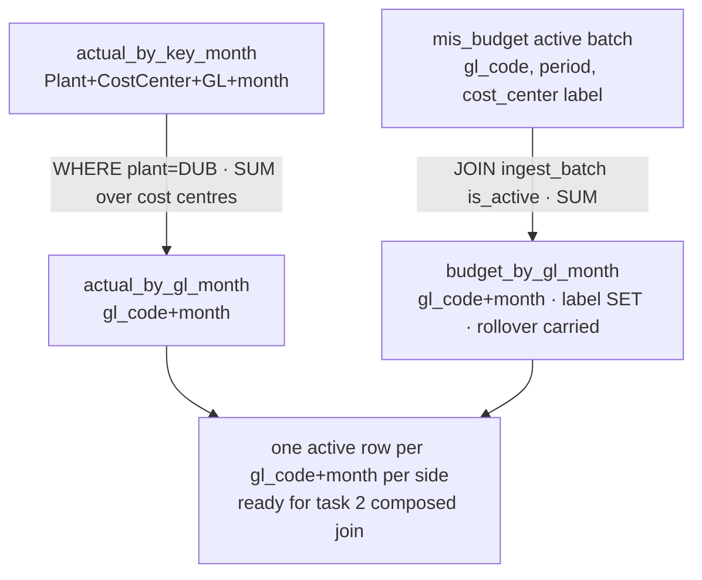

# Task plan — gl-month-rollups: GL+month active rollups for Actual (DUB) and Budget

Story: governed-joins · Task 1 of 4 · user_facing: false

## Objective
Reduce each ingested object to **one active row per `(gl_code, month)`** via two
read-only warehouse views, so the later cross-object composition (task 2) cannot
fan out. This is the fan-out fix the plan grill required: `actual_by_key_month` is
Plant+**CostCenter**+GL+month, so joining it raw to a GL+month budget would repeat
Budget across cost centres.

## Acceptance criteria (plan_contracts)
- **t-glm-c1** — `actual_by_gl_month` reduces DUB actuals to `(gl_code, month)` as
  `SUM(actual_net)` over cost centres (plant DUB, active batch); `budget_by_gl_month`
  rolls the ACTIVE budget batch up to `(gl_code, month)` as `SUM(budget_amount)`
  with `period` aliased to `month`.
- **t-glm-c2** — `budget_by_gl_month` preserves the SET of `cost_center`
  (Budget Components) labels per key as informational (never a grouping/join key),
  and carries raw `rollover_amount` summed but exposed by no measure.
- **t-glm-c3** — a demonstrated warehouse-DB test proves each rollup reflects only
  the active batch (a retained prior batch does not change it; a budget reload
  swaps the active batch without altering actuals).

## What already exists (reuse, do not re-create)
- `backend/src/warehouse/warehouse-schema.ts:117-134` — `actual_by_key_month`
  drizzle `pgView` (`SUM(debit-credit)::numeric(18,2)` over active actuals, grouped
  Plant+CostCenter+GL+month); its DDL is emitted in
  `backend/drizzle-warehouse/0000_*.sql`. **Mirror this exactly.**
- `warehouse-schema.ts:86-115` — `mis_budget` (no plant; month col is `period`;
  `cost_center` = Budget Components label; `budget_amount`/`rollover_amount`).
- `warehouse-schema.ts:23-46` — `ingest_batch` partial-unique active pointer on
  `(source_kind, period) WHERE is_active`.
- `warehouse-migrate.ts` / `warehouse:migrate` (apply-only) — how 0000/0001 migrations run.
- The gated-proof + flag-setting-script + loopback-guard pattern from sap-ingestion
  (`reconciliation.repository.test.ts` + the `test:warehouse-proof` script).

## Design
### View 1 — `actual_by_gl_month`
```sql
SELECT 'DUB'::text AS plant, gl_code, month, SUM(actual_net)::numeric(18,2) AS actual_net
FROM actual_by_key_month WHERE plant = 'DUB'
GROUP BY gl_code, month
```
Reduces the existing gold view across cost centres for the single DUB plant (the
fan-out fix). Exposes a **constant `plant='DUB'` column** (grill-round decision) so
task 2 can inject/verify its Actual-side scope predicate against the rollup. The
active-batch filter is **inherited** through `actual_by_key_month` (no direct
`ingest_batch` predicate here — do not duplicate the join).

### View 2 — `budget_by_gl_month`
```sql
SELECT b.gl_code, b.period AS month,
       SUM(b.budget_amount)::numeric(18,2)   AS budget_net,
       SUM(b.rollover_amount)::numeric(18,2) AS rollover_net,   -- carried, no measure
       array_agg(DISTINCT b.cost_center ORDER BY b.cost_center) AS budget_component_labels  -- deterministic informational set
FROM mis_budget b JOIN ingest_batch bt ON bt.id = b.batch_id
WHERE bt.source_kind = 'budget' AND bt.is_active
GROUP BY b.gl_code, b.period
```
Active budget batch only; `cost_center` is NEVER a grouping/join key, only an
informational label set; `rollover_net` is exposed by no measure (roll-over
deferred, 0016).

### Wiring
Add both as drizzle `pgView`s in `warehouse-schema.ts` and their `CREATE VIEW` DDL
in a new `backend/drizzle-warehouse/0002_gl_month_rollups.sql` **and its journal entry in
`backend/drizzle-warehouse/meta/_journal.json`** (a migration absent from the journal
won't apply on a clean warehouse), applied by `npm --prefix backend run warehouse:migrate`
(follow 0000/0001).

### Tests
- **Hermetic** (`warehouse-schema.test.ts`, in `test:hermetic`): SQL-shape
  assertions on each view (active-batch filter, `(gl_code, month)` GROUP BY,
  numeric(18,2) casts, the DUB filter, the label-set aggregate, rollover carried)
  — regex/string like the existing `actual_by_key_month` tests, no DB.
- **D-0008 gated** (`gl-month-rollups.db.test.ts`, `{ skip: WAREHOUSE_DB_TEST !==
  "1" }`): `migrateWarehouse()`, then use **IngestionRepository** (not direct SQL —
  to exercise the atomic candidate-load-then-flip invariant): load a PRIOR then a
  REPLACEMENT actuals batch (multi-cost-centre, one `gl_code+month`, DUB) → assert
  the prior stays inactive, only the replacement contributes, and `actual_by_gl_month`
  sums to ONE row (`plant='DUB'`); load a PRIOR then a REPLACEMENT budget batch →
  assert `budget_by_gl_month` reflects only the active batch and exposes the
  deterministic label set; a budget reload swaps the active batch without changing
  actuals. TRUNCATE guarded to loopback-only hosts; dead-port negative control.
  Registration: add the file to `test:hermetic` + its `hermeticTests` registry in
  `tools/quality-gate.test.mjs` (gated leaf self-skips there); **EXTEND** the existing
  `test:warehouse-proof` script to run BOTH this and `reconciliation.repository.test.ts`
  **serialized** (`--test-concurrency=1`) since both TRUNCATE shared tables. Pinned
  host command: `... WAREHOUSE_DB_TEST=1 npm --prefix backend run test:warehouse-proof`.

## Workflow


## Manual Verification
1. `docker compose up -d warehouse-db`; `npm --prefix backend run warehouse:migrate` — observe both
   views exist.
2. Run the gated proof host-side (`WAREHOUSE_DB_TEST=1 ... npm --prefix backend run test:warehouse-proof`) —
   observe `tests N / pass N / skipped 0`: a multi-cost-centre GL sums to one
   actual row; the budget rollup reflects only the active batch and lists the
   label set; a reload leaves actuals unchanged.
3. Dead-port negative control (`WAREHOUSE_PG_PORT=5599`) — the gated proof FAILS
   (ECONNREFUSED), proving it truly connects.
4. `npm run test:hermetic` — passes; the gated leaf is SKIPPED there.

## Decisions attested
0004 (governed joins), 0015 (warehouse snake_case), 0016 (gl_code+month within
DUB; Budget-Components label informational; roll-over measure deferred, raw kept),
0009 (required_tests real leaves + TS_NODE_PROJECT). D-0008 = demonstrated host
evidence.

## Surface impact
- Data: two read-only views (`actual_by_gl_month`, `budget_by_gl_month`) + a
  migration; no new base table, no change to `sap_transaction`/`mis_budget`.
- No endpoint, grant, or dependency.
- Tests: hermetic SQL-shape + the gated D-0008 rollup proof (+ quality-gate entry).

## Out of scope
The cross-object JOIN (task 2), the measures (task 3), golden fixtures/provenance
(task 4); any mapping master, roll-over measure, or plant beyond DUB.
