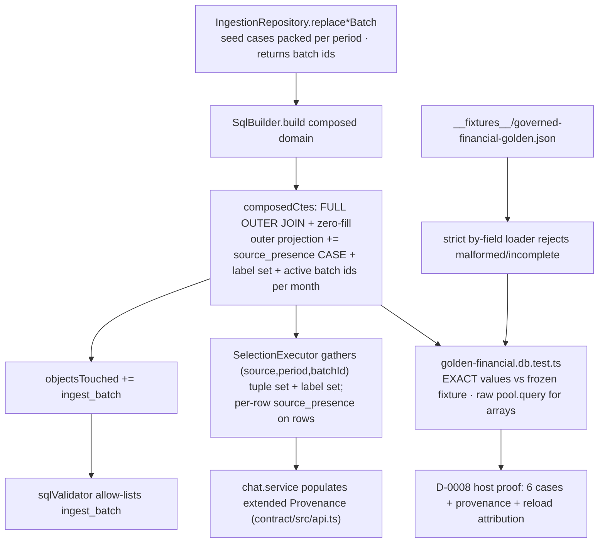

# Task plan — golden-provenance: golden-answer fixtures (no fan-out) + in-query provenance lineage

Story: governed-joins · Task 4 of 4 (LAST) · user_facing: false

## Objective
Gate the composed financial relation's correctness with **exact golden-answer
fixtures** (D-0008 host proof) across all six decision-0016 cases, and make every
governed number **reproducible + explainable** by capturing provenance — row-aligned
source-presence, the deterministic Budget-Components label set, and the active source
batch ids per (source, period) — **within the same composed query**.

## Acceptance criteria (plan_contracts)
- **t-gp-c1** — a golden-answer reconciliation fixture asserts EXACT expected values
  for matched, Budget-only (zero-filled), Actual-only (zero-filled), duplicate/
  multi-cost-centre (no fan-out), reload/active-swap (answer unchanged, actuals
  untouched), and %-edge (0/0 NA, positive over-budget, negative credit/negative-actual)
  cases, as demonstrated host evidence (D-0008).
- **t-gp-c2** — provenance for every governed number carries the measure definition +
  composed SQL PLUS active source batch ids keyed by (source, period), row-aligned
  source-presence (matched / budget-only / actual-only, or a set for aggregate rows),
  and a deterministic set of Budget-Components labels, all captured within the same
  composed query. **(Captured in-query AND surfaced on the API `Provenance` type here —
  honouring the story plan; the reporting epic only RENDERS it. Grill round, see Design.)**

## What already exists (grounding, file:line)
- `sqlBuilder.ts:116-141` `composedCtes` — `actual_src` / `budget_src` /
  `financial_relation` (FULL OUTER JOIN on gl_code+month, COALESCE zero-fill to
  numeric(18,2), `budget_component_labels` already flowing through); `:110-112`
  `objectsTouched = [...sources, actual_src, budget_src, financial_relation]`;
  `:38-45` outer `selectCols` (measures + dims).
- `sqlValidator.ts:44-49` — allow-lists every referenced table against `objectsTouched`
  leaves (so a new `ingest_batch` reference needs it added to `objectsTouched`).
- `warehouse-schema.ts:23-46` `ingest_batch` — `id`, `source_kind` (actuals|budget),
  `period` (month-truncated), `is_active`, partial-unique active pointer on
  `(source_kind, period) WHERE is_active` → exactly one active batch per (source,period).
- `composed-relation.db.test.ts` (task 2) — the exact D-0008 harness: WAREHOUSE_DB_TEST
  gate, loopback TRUNCATE guard, `migrateWarehouse()`, seed via
  `IngestionRepository.replaceActualsBatch/replaceBudgetBatch` (candidate-load-then-flip,
  returns batch id), query via `SqlBuilder`+`PostgresAdapter`, assert EXACT values.
- `reconciliation.repository.ts:62-77` `loadReconciliationExpectation` +
  `__fixtures__/july-dub-reconciliation.json` — the frozen-fixture + strict-loader pattern.
- `postgres.adapter.ts:112-117` — **stringifies `text[]` to a comma-joined string**;
  `gl-month-rollups.db.test.ts:131-143` asserts arrays via raw `pool.query`.
- `Provenance` type `contract/src/api.ts:251-261` + its single population site
  `chat.service.ts:377-394` (carries measures+sql+freshness; no batch/presence/labels).
- `package.json` `test:warehouse-proof` (serialized `--test-concurrency=1`:
  reconciliation + gl-month-rollups + composed-relation) + `test:hermetic`.

## Design
### C1 — golden-answer fixtures (D-0008)
New gated `backend/src/warehouse/golden-financial.db.test.ts`, cloning the
`composed-relation.db.test.ts` harness. It seeds each case via `IngestionRepository`
and asserts EXACT `numeric(18,2)` values (and the `%` labels) against a **frozen**
`__fixtures__/governed-financial-golden.json`, via a strict **loader** (JSON.parse +
type/format guards — paise-exact `^-?\d+\.\d{2}$`, a COMPLETE case set — mirroring
`loadReconciliationExpectation`), whose reject-invalid path is tested hermetically.
The six cases (decision 0016:54-57):
1. **matched** — both sides net.
2. **Budget-only** — actual zero-filled `0.00`.
3. **Actual-only** — budget zero-filled `0.00`.
4. **duplicate/multi-cost-centre** — a GL with several Actual cost centres does NOT
   repeat Budget (one row per gl_code+month; Budget not fanned out).
5. **reload/active-swap** (grill: **changed-answer attribution**, per 0016) — a
   **second** `replaceBudgetBatch` with a **distinct** Budget value: the Budget/% output
   **changes**, the prior budget batch goes **inactive**, **actuals are untouched**, and
   the **new** budget batch id is returned in the same query — so a reload's *changed*
   answer is attributable to the batch swap. (Do **not** assert "answer unchanged" for
   the reloaded side.)
6. **%-edges** — 0/0 → `NULL`/NA, `+Actual & Budget=0` → `'over-budget'`,
   `-Actual & Budget=0` → `'credit / negative actual'` (the task-3 `%` CASE).

**Fixture-state model (grill):** `replaceBatch` deactivates *every* prior active batch
for that (source, period), so **pack** the matched / Budget-only / Actual-only /
multi-cost-centre cases as **distinct gl_codes inside ONE actuals batch + ONE budget
batch** for a single period; drive case 5 with a second `replaceBudgetBatch`. Batch
UUIDs are runtime-generated → the frozen JSON holds the **exact numeric values +
expected source-presence + label sets**, never the UUIDs; batch ids are compared to the
ids **returned** by `replace*Batch`.

**Loader (grill):** validate **by field type** — money fields paise-exact
`^-?\d+\.\d{2}$`, the `%` field a **union** (a decimal-ratio string | `null` | one of the
two labels), and a **complete** six-case set — rejecting a malformed/incomplete fixture
(tested hermetically).

### C2 — provenance captured in the same composed query
Extend `composedCtes` so the composed query projects, **row-aligned**:
- **source_presence** — `CASE WHEN actual_src.gl_code IS NULL THEN 'budget-only' WHEN
  budget_src.gl_code IS NULL THEN 'actual-only' ELSE 'matched' END` (the FULL OUTER
  JOIN already knows the side — **no view/validator change**).
- **budget_component_labels** — project the already-flowing deterministic label set
  (`array_agg(DISTINCT cost_center ORDER BY cost_center)`).
- **active batch ids per (source, period=month)** — correlated scalar subqueries
  `(SELECT id FROM ingest_batch WHERE source_kind='actuals' AND period = <month> AND
  is_active)` and the budget equivalent. **This references `ingest_batch`, so it MUST
  be added to `objectsTouched`** (else `sqlValidator` rejects it); a hermetic
  `sqlBuilder.provenance.test.ts` asserts the emitted SQL, that `objectsTouched`
  includes `ingest_batch`, and that the validator still passes.

**Grill (query boundary):** the outer `SELECT` emits only requested dims/measures
(`sqlBuilder.ts:38,99`), so the provenance columns are **added to the outer projection**
(not just inside `financial_relation`) and ride on **every result row** (adding keys) —
so task 2's `sqlBuilder.composed.test.ts` (objectsTouched + selectCols),
`sqlValidator.composed.test.ts` (ingest_batch allow-list), and
`composed-relation.db.test.ts` (row shape) exact assertions are **updated** (all in
write_scope).

**Aggregate semantics (grill):** capture provenance at the composed relation's natural
**(gl_code, month) grain**, where presence is scalar and there is exactly ONE active
actuals + ONE active budget batch per (source, period=month). `SelectionExecutor`
gathers the per-row batch ids across the query into a **set of `(source, period,
batchId)` tuples** (never bare ids — the period key must survive month/YTD aggregates)
plus the union of label sets on the `Provenance` object, and carries the per-row
**source_presence** on `ResultTable` rows. Coarser YTD/aggregate-row rollup is the
reporting epic.

**Array caveat**: `PostgresAdapter` stringifies `text[]` to a comma-joined string
(`postgres.adapter.ts:112-117`); the golden db test asserts the label-set / batch-id
arrays via a **raw `pool.query`** (like `gl-month-rollups.db.test.ts:131-143`), and the
executor-side gather accounts for the stringified form on the adapter path.

### C2 surfacing (grill round — HUMAN decision: wire the API surface here)
Honouring the story plan's Surface Impact: **extend the `Provenance` type**
(`contract/src/api.ts:251-261`) with the `(source, period, batchId)` tuple set + the
Budget-Components label set (and expose per-row source-presence on `ResultTable` rows);
**thread** it from the composed query result through `SelectionExecutor`
(`selectionExecutor.ts:15-21,68-74,157`) into the single `Provenance` population site
`chat.service.ts:377-394`. The reporting epic only **renders** the trust strip.

## Workflow

## Manual Verification
1. `npm run test:hermetic` — `sqlBuilder.provenance.test.ts` proves the composed SQL
   projects source_presence / label-set / active batch-id columns and lists
   `ingest_batch` in `objectsTouched` and still passes the validator;
   `selectionExecutor.composed.test.ts` proves the result carries per-row
   source-presence and the `Provenance` object carries the label set + the
   `(source, period, batchId)` tuple set; the golden loader rejects a
   malformed/incomplete fixture; the updated `sqlBuilder.composed` /
   `sqlValidator.composed` / `composed-relation.db` assertions pass.
2. `docker compose up -d warehouse-db`; `npm --prefix backend run warehouse:migrate`.
3. D-0008 host proof: `WAREHOUSE_PG_* … npm --prefix backend run test:warehouse-proof`
   — observe `tests N / pass N / skipped 0`; the golden leaf seeds all six cases and
   asserts EXACT values + the provenance columns (source-presence, label set, active
   batch ids per source/period).
4. Dead-port negative control (`WAREHOUSE_PG_PORT=5599`) — the gated golden leaf FAILS
   (ECONNREFUSED), proving it genuinely connects.

## Decisions attested
0004 (governed joins: correct join semantics, no fan-out, golden-answer fixtures
proving the numbers), 0016 (six golden cases with exact values; provenance carries
active source batch ids + per-row source-presence so a reload's changed answer is
attributable to a batch swap; Budget-Components label informational), 0009
(required_tests real leaves + TS_NODE_PROJECT; committed tests.json + flag-setting
proof command + loopback guard), 0015. The API Provenance-type surfacing + trust-strip
rendering are the reporting epic.

## Surface impact
- Backend: `sqlBuilder.ts` (outer-projected in-query provenance columns + `ingest_batch`
  in `objectsTouched`), `selectionExecutor.ts` (gather the `(source,period,batchId)`
  tuple set + label set + per-row presence onto the result), `chat.service.ts` (populate
  the extended `Provenance`).
- Contract: `contract/src/api.ts` — extend `Provenance` (+ per-row source-presence on
  `ResultTable`).
- Tests: `sqlBuilder.provenance.test.ts` (NEW hermetic),
  `selectionExecutor.composed.test.ts` (extended, provenance payload),
  `golden-financial.db.test.ts` (NEW gated) + `__fixtures__/governed-financial-golden.json`
  (NEW), updated `sqlBuilder.composed.test.ts` + `sqlValidator.composed.test.ts` +
  `composed-relation.db.test.ts` (objectsTouched + row shape); `package.json` +
  `quality-gate.test.mjs` registration.
- No new endpoint, no new warehouse object, no measure change (task 3).

## Out of scope
The trust-strip **rendering** of provenance (reporting epic); coarser YTD/aggregate-row
provenance rollup (reporting epic); the Budget-label→SAP-cost-centre mapping master +
roll-over measure + multi-plant (deferred); the mis-statement UI.

## Task Decomposition
This is task 4 (LAST) of the governed-joins story's 4-task decomposition
(`.factory/stories/governed-joins/decomposition.json`): (1) gl-month-rollups [#20],
(2) composed-relation [#21], (3) governed-domain-measures [#22], (4)
**golden-provenance** [this task]. It is a single bounded unit — the golden-answer
D-0008 gate (C1) plus the in-query provenance lineage (C2) over the composed relation
tasks 1-3 built — and is not further subdivided; its two acceptance criteria are
proven by the gated golden proof (C1) and the hermetic provenance-SQL test + the
golden proof's provenance-column assertions (C2). Shipping it closes the governed-joins
story and unblocks the reporting epic.
