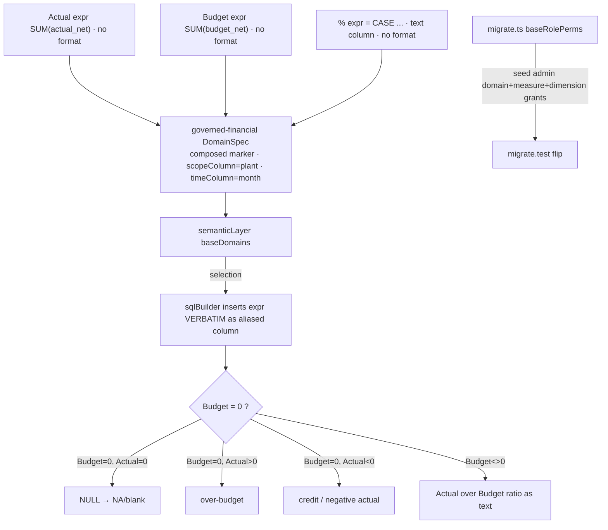

# Task plan — governed-domain-measures: code-authored Actual / Budget / % over the composed relation

Story: governed-joins · Task 3 of 4 · user_facing: false

## Objective
Author ONE code-authored governed-financial `DomainSpec` with **Actual**, **Budget**
and **%** `MeasureSpec`s in `semanticLayer.ts` `baseDomains` (today `[]`), reading the
code-composed `financial_relation` that task 2 built, so report / drill-down /
assistant share one definition and the LLM only *selects* measures (never authors
SQL). Seed the governed-financial domain/measure/dimension **grants** task 2's grill
deferred here. No new endpoint, warehouse object, or builder/validator/executor edit.

## Acceptance criteria (plan_contracts)
- **t-dm-c1** — a code-authored financial `DomainSpec` and Actual (`SUM(actual_net)`),
  Budget (`SUM(budget_net)`) and % MeasureSpecs are registered in `baseDomains` over
  the composed relation; the two-column/ratio expressions are **code-authored** (the
  runtime builder inserts `expr` verbatim), and the LLM/runtime never authors the SQL.
- **t-dm-c2** — % follows the full nil rule: `0/0 → NA/blank`; `Actual>0, Budget=0 →
  over-budget (no %)`; `Actual<0, Budget=0 → credit / negative actual (no %)`; i.e. no
  percentage for any non-zero Actual against zero Budget, with the positive/negative
  labels distinguished. **(Narrowed by the grill round below — see Design.)**

## What already exists (grounding, file:line)
- `sqlBuilder.ts:38-41` — `selectCols` inserts each measure **verbatim**:
  `${m.expr} AS ${m.id.split(".").pop()}` (alias = the id's last dot-segment); dims →
  `GROUP BY d.column` (`:83`). So a `NULLIF`/division lives **inside `expr`**.
- `sqlBuilder.ts:96-141` — the composed path: `FROM financial_relation`, exposing
  exactly `gl_code, month, actual_net, budget_net, rollover_net,
  budget_component_labels` (`:131-136`), zero-filled `::numeric(18,2)`. Measure exprs
  reference **these** columns.
- `contract/src/measure.ts:6-41` `MeasureSpec` (`expr`, `allowedDimensions`,
  `format?:"percent"` — a **display hint only**: `selectionExecutor.ts:120-139`
  attaches it to the column; the server never numerically formats, the client renders
  the `0..1` ratio as a %). `DomainSpec` (`:51-71`): `composed?` marker,
  `scopeColumn` (**required** by `composedCtes`, `sqlBuilder.ts:121`), `routingHints`.
- `semanticLayer.ts:11` `baseDomains: DomainSpec[] = []`; `all()`/`domain()`/
  `allowedFor()` register + filter (`:15-33`).
- `migrate.ts` `baseRolePerms` seeds e.g. `{role:"admin",grantType:"action",
  grantId:"report"}` (task 2). `migrate.test.ts:33` currently asserts baseRolePerms
  has **no** domain/measure/dimension grants — task 3 flips it.
- `docs/specs/financial-mis-statement.md:40-42` (nil & format) + `:48` (“% guards
  divide-by-zero per the nil rules”); decision 0016 Q4 (negative-actual = *credit*).

## Design
### The three measures (expr is inserted verbatim)
- **Actual** — `expr: "SUM(actual_net)"`, **omit `format`** (numeric; `"number"` is not
  a valid `MeasureSpec.format` — only `"percent"` is), `timeColumn:"month"`,
  `defaultTimeGrain:"month"`, `goldObject:"actual_by_gl_month"`.
- **Budget** — `expr: "SUM(budget_net)"`, omit `format`, `timeColumn:"month"`,
  `goldObject:"budget_by_gl_month"`.
- **%** — a SQL **`CASE`** (see below), **omit `format`** (text column),
  `timeColumn:"month"`.

### The %-nil rule + label distinction (grill round — HUMAN-decided: the CASE in the % measure)
There is **no server-side row/label layer** anywhere in the repo: `selectionExecutor`
returns `raw.rows` verbatim, no cell rewrite; `chat.service.ts` only picks a chart. The
MIS spec itself describes the “%” column as **mixed** — a ratio, or `"NA"`/blank, or an
over-budget flag (`financial-mis-statement.md:40-42`). So the full nil rule + labels
live **inside the `%` measure's `expr`** as a `CASE` (the builder inserts it verbatim):
```sql
CASE
  WHEN SUM(budget_net) = 0 AND SUM(actual_net) = 0 THEN NULL                        -- NA/blank
  WHEN SUM(budget_net) = 0 AND SUM(actual_net) > 0 THEN 'over-budget'               -- no %
  WHEN SUM(budget_net) = 0 AND SUM(actual_net) < 0 THEN 'credit / negative actual'  -- no % (0016 Q4)
  ELSE (SUM(actual_net) / SUM(budget_net))::text
END
```
The text branches force the `CASE` result type to text, so the ratio `ELSE` is cast
`::text`; the column therefore **omits `format:"percent"`** (it is not a pure numeric).
Exact ratio display/rounding is **task 4's** golden fixtures. This is the self-contained
realisation of C2 — no downstream label layer is added here.

### Bounded periods (grill finding)
Setting `timeColumn:"month"` on the measures makes the executor recognise `month` as a
valid date column (`validDateColumns` honours `measureTimeColumns`,
`selectionExecutor.ts:248-259`), so a period `timeWindow` **binds** instead of reading
all months. Mandatory-window enforcement (`requiresTimeWindow`) is deferred to the
reporting epic.

### Governed-financial domain
`{ name, label, goldObject:"actual_by_gl_month", composed:{ sources:
["actual_by_gl_month","budget_by_gl_month"], joinKeys:["gl_code","month"] },
scopeColumn:"plant", routingHints:[…], measures:[Actual,Budget,%],
dimensions:[{id:"gl_code",…},{id:"month",…}] }`. The `composed` marker + `name` are
what fire task 2's `executeResolved` governed-read enforcement and the composed
builder path.

### Grants (task-2-deferred)
Seed to role `admin` in `migrate.ts` `baseRolePerms` (mirror the `report` action seed,
`onConflictDoNothing`): the governed-financial **domain** grant, a **measure** grant
per measure id, and a **dimension** grant per dimension id. Flip `migrate.test.ts:33`
to assert these now exist for admin (keep the `save`/`pin`/`report` action asserts).
`migrate.test.ts` is `test:db` (app-Postgres, **D-0008-deferred** — the 42 app-DB
tests are not CI-enforced and not host-run per task); its assertion flip is a
`baseRolePerms` **constant** change verified by type-check/build via `verify` +
review, exactly as task 2's `report`-action `migrate.test` change was handled. No
per-task app-DB host run; task 4 owns the end-to-end golden D-0008 proof.

## Workflow


## Manual Verification
1. `npm run test:hermetic` — the governed-financial domain + 3 measures register
   (exact exprs incl. the `%` `CASE`, `allowedDimensions` gl_code + month,
   `timeColumn:"month"`); building a selection emits the `%` `CASE` expr **verbatim**
   as its aliased column; against a fake warehouse a matched key returns the ratio, a
   **zero-budget & zero-actual** key returns `NULL` (NA), a **zero-budget & positive
   actual** key returns `'over-budget'`, and a **zero-budget & negative actual** key
   returns `'credit / negative actual'` — the full nil rule.
2. `npm run typecheck && npm run build:backend` — the seeded domain/measure/dimension
   grants + the flipped `migrate.test.ts:33` assertion type-check (app-DB execution is
   D-0008-deferred, as for task 2); the new test is in both the `backend/package.json`
   `test:hermetic` list and the `quality-gate` registry.
3. `python3 factory/scripts/verify.py` — build/lint/format/hermetic all green.

## Decisions attested
0004 (governed joins: one code-composed governed definition; LLM selects, never
authors SQL), 0016 (gl_code+month within DUB; % = Actual÷Budget; negative-actual =
credit), 0009 (required_tests real leaves + TS_NODE_PROJECT), 0015. The over-budget/
credit label **values** are produced in the `%` measure `CASE` here; the statement
**rendering** (layout, exact %-ratio rounding, mandatory-window) is the reporting
epic; task 4 owns golden fixtures + provenance + the end-to-end D-0008 proof.

## Surface impact
- Backend: `semanticLayer.ts` (register the domain + measures + dims),
  `migrate.ts` (grant seeds), `migrate.test.ts` (assertion flip).
- Tests: `semanticLayer.financial.test.ts` (NEW, hermetic) registered in **both**
  `backend/package.json` `test:hermetic` **and** `tools/quality-gate.test.mjs`
  (exactly one suite per test file — both maintain explicit lists).
- No endpoint, warehouse object, contract change, or builder/validator/executor edit.

## Out of scope
Golden fixtures + provenance + the end-to-end golden D-0008 proof (task 4); the
mis-statement **rendering** — layout, exact %-ratio display/rounding, mandatory
time-window (`requiresTimeWindow`) — which is the reporting epic; Roll-over measure
(deferred); any per-plant scoping beyond DUB; the measure-authoring UI.

## Task Decomposition
This is task 3 of the governed-joins story's 4-task decomposition (recorded in
`.factory/stories/governed-joins/decomposition.json`): (1) gl-month-rollups [done,
#20], (2) composed-relation [done, #21], (3) **governed-domain-measures** [this
task], (4) golden-provenance. This task is a single bounded unit — the code-authored
governed-financial domain + its Actual/Budget/% measures + the deferred grant seeds —
and is not further subdivided; its two acceptance criteria (t-dm-c1 registration,
t-dm-c2 the %-nil rule) are proven hermetically in `test:hermetic`.
