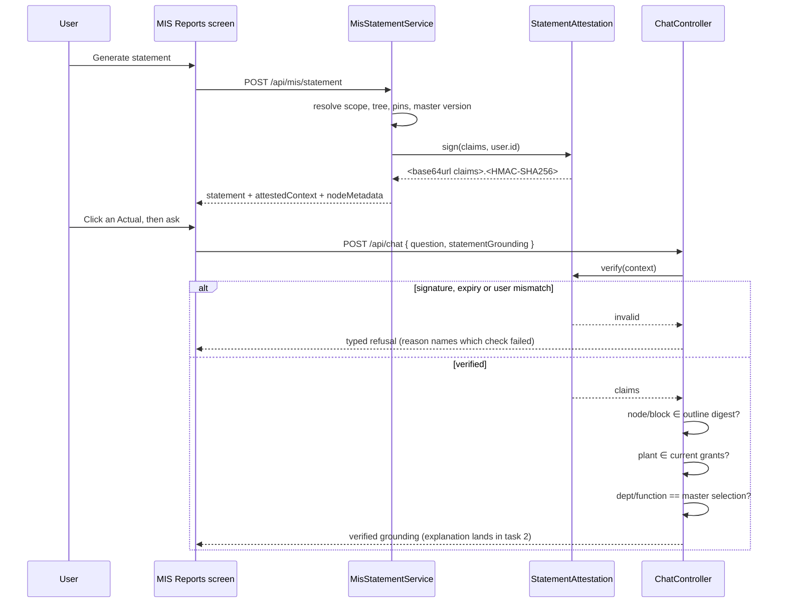

# Task plan — explain-grounding-and-attestation

## What this task is
Make a grounded question **provably about the statement on screen**. Re-deriving scope proves the
user is entitled to the data; it does not prove the question is about what they are looking at.
That gap is why C14's tamper refusal was unprovable until the human chose an attested context.

No explanation is produced here and no UI changes. This task ends with a request that either
verifies or is refused with a typed reason.

## Workflow

## Approach

**The envelope.** `<base64url(canonical JSON claims)>.<base64url(HMAC-SHA256)>`. Canonical means
sorted keys and no insignificant whitespace, so the same claims always sign to identical bytes -
without that, verification is flaky rather than secure.

**The claims.** department, function, plant, period; a **digest of the outline** - the leaf keys
and their blocks, hashed - rather than the outline itself, so the token does not grow with the
statement; the pinned batch ids with their sources; the mapping-master version; the **user id**;
and `exp`.

**Why the user id and not the session.** `mis-statement.controller.ts:81` takes `@CurrentUser()
user: AuthUser` and no session id - `AuthUser.id` is right there (`contract/src/rbac.ts:29`) - and
a session-bound token would die on the next refresh while the statement is still on screen.

**The secret.** A new required config entry beside `authJwtSecret`, as an **ordered list** so the
first signs and any listed key verifies, letting a key rotate without invalidating live
statements. Absence is a **startup failure**: a development fallback would silently produce
unsigned contexts, which is the exact failure this task exists to prevent. TTL defaults to 30
minutes.

**Node metadata.** `MisStatementNode` carries `nodeKey`, `glCode` and `children` but no approved
GL/cost-centre set. C7's aggregate explanation is a browser projection, and an opaque token cannot
hand the browser what it does not contain - so the response carries a **readable** per-leaf
projection of the approved GL codes and cost centres, covered by the same attestation digest.

**The request.** `chat.schemas.ts` is `.strict()`, so `statementGrounding` is added deliberately
and a leaf proves an unknown key is still rejected. The context is authority; the node and block
travel **unsigned** and are checked against the signed outline digest; the client's department and
function are **verified context** sent only so a mismatch can be refused.

**Every refusal is typed.** Invalid signature, expired, other-user, node or block outside the
attested outline, plant outside grants, department/function mismatch. A generic 400 or a silent
substitution is the defect.

## Manual Verification
1. Start the backend with the new secret unset and confirm it **fails to start** rather than
   serving unsigned contexts.
2. Set the secret, restart, sign in and generate a statement for Agriculture Nursery DUB, July 2026.
3. In the network tab, confirm the statement response carries `attestedContext` and the per-leaf
   node metadata, and that the existing report still renders unchanged.
4. Replay the chat request with one character of the context altered - expect a typed refusal
   naming the signature check, not a generic 400.
5. Replay it with a `nodeKey` from a different statement - expect the outline-digest refusal.
6. Replay it with `department` changed to a value the master does not pair with that plant - expect
   the mismatch refusal, not "No mapping configured".
7. Set the TTL to one minute, wait it out, ask again - expect the expiry refusal.
8. Confirm `/api/mis/statement/export` still downloads the workbook unchanged.

<!-- forge:contract -->
## Contract (recorded)

Rendered by the harness from the recorded decomposition; edit the decomposition, not this block. It is excluded from the plan's approval and grill digests, so a re-render never stales either.

**Objective.** Make a grounded question provably about the statement on screen. The statement response gains a signed attested context and a readable node-metadata projection; AskRequest gains statementGrounding; the server re-derives every input and refuses what does not verify. No explanation is produced yet and no UI changes.

**Acceptance criteria**

- The statement response carries an ADDITIVE attested context: base64url canonical-JSON claims plus an HMAC-SHA256 signature. Claims are department, function, plant, period, a DIGEST of the outline (leaf keys and their blocks, not the outline itself), the pinned batch ids with their sources, the mapping-master version, the user id, and exp. Existing statement and export consumers keep working and their shipped leaves pass UNMODIFIED.
- The context is bound to the USER ID, not the session: the statement route receives no session id today (mis-statement.controller.ts:81) and a session binding would die on refresh. Plumbing the user id into the statement service is this task's work.
- The signing secret is REQUIRED configuration and its absence is a STARTUP FAILURE. A silently unsigned or unverified token is the failure mode this whole task exists to prevent, so there is no development fallback. The verifier accepts an ordered list of keys and signs with the first, so a key can rotate without invalidating live statements. TTL defaults to 30 minutes.
- The statement response also carries a READABLE node-metadata projection - the approved GL codes and cost centres per leaf - covered by the same attestation digest. C7's aggregate explanation needs it and statement nodes do not carry it today; an opaque token cannot hand a browser what it does not contain.
- AskRequest gains statementGrounding: the attested context, plus the UNSIGNED node and block, plus the client's department and function as VERIFIED CONTEXT. chat.schemas.ts is .strict(), so it is extended deliberately and a leaf proves an unknown key is still rejected.
- The server re-derives everything and trusts nothing: department and function from the master's selection for that plant, the plant against the user's CURRENT grants, the pins validated. Each of these is a TYPED REFUSAL, never a silent substitution and never an ordinary 'no mapping' answer: an invalid signature, an expired context, a context whose user id is not the caller, a node or block absent from the attested outline digest, a plant outside grants, and a department or function disagreeing with the master.
- Decision 0019: the extended chat request and the statement response's new fields carry typed Zod schemas and Swagger documentation.
- Decision 0038's front matter names ask-reopen-saved-report because it was minted during that run; it governs THIS story and the stories field is corrected here.
- Every new backend test file is added to backend/package.json's test:hermetic ALLOW-LIST. It is an allow-list, so an unlisted leaf never runs and the gate goes green having asserted nothing.

**Write scope** (what `stage done` measures the diff against)

- contract/src/api.ts
- backend/package.json
- backend/src/config.ts
- backend/src/chat/chat.controller.ts
- backend/src/chat/chat.schemas.ts
- backend/src/chat/chat.schemas.test.ts
- backend/src/chat/chat.service.ts
- backend/src/mis/mis-statement.controller.ts
- backend/src/mis/mis-statement.controller.test.ts
- backend/src/mis/mis-statement.service.ts
- backend/src/mis/mis-statement.service.test.ts
- backend/src/mis/statement-attestation.ts
- backend/src/mis/statement-attestation.test.ts
- docs/decisions/0038-mis-assistant-explains-without-touching-ask.md

**Required tests** (run by `stage done`)

- `a statement response carries an attested context whose claims bind scope outline pins master version user and expiry` -- `TS_NODE_PROJECT=backend/tsconfig.json TS_NODE_TRANSPILE_ONLY=1 node tools/junit-run.mjs --file {path} --name {id} --report {report} --require ts-node/register` (backend/src/mis/statement-attestation.test.ts)
- `a tampered claim fails verification because the signature no longer matches the canonical encoding` -- `TS_NODE_PROJECT=backend/tsconfig.json TS_NODE_TRANSPILE_ONLY=1 node tools/junit-run.mjs --file {path} --name {id} --report {report} --require ts-node/register` (backend/src/mis/statement-attestation.test.ts)
- `an expired context and a context issued to another user are both refused` -- `TS_NODE_PROJECT=backend/tsconfig.json TS_NODE_TRANSPILE_ONLY=1 node tools/junit-run.mjs --file {path} --name {id} --report {report} --require ts-node/register` (backend/src/mis/statement-attestation.test.ts)
- `a missing signing secret fails startup rather than issuing an unsigned context` -- `TS_NODE_PROJECT=backend/tsconfig.json TS_NODE_TRANSPILE_ONLY=1 node tools/junit-run.mjs --file {path} --name {id} --report {report} --require ts-node/register` (backend/src/mis/statement-attestation.test.ts)
- `the verifier accepts a context signed by a rotated older key while signing new ones with the first key` -- `TS_NODE_PROJECT=backend/tsconfig.json TS_NODE_TRANSPILE_ONLY=1 node tools/junit-run.mjs --file {path} --name {id} --report {report} --require ts-node/register` (backend/src/mis/statement-attestation.test.ts)
- `a node or block absent from the attested outline digest is refused rather than answered` -- `TS_NODE_PROJECT=backend/tsconfig.json TS_NODE_TRANSPILE_ONLY=1 node tools/junit-run.mjs --file {path} --name {id} --report {report} --require ts-node/register` (backend/src/chat/chat.schemas.test.ts)
- `a department or function disagreeing with the master selection for that plant is a typed refusal not a silent substitution` -- `TS_NODE_PROJECT=backend/tsconfig.json TS_NODE_TRANSPILE_ONLY=1 node tools/junit-run.mjs --file {path} --name {id} --report {report} --require ts-node/register` (backend/src/chat/chat.schemas.test.ts)
- `the strict chat schema accepts statementGrounding and still rejects an unknown key` -- `TS_NODE_PROJECT=backend/tsconfig.json TS_NODE_TRANSPILE_ONLY=1 node tools/junit-run.mjs --file {path} --name {id} --report {report} --require ts-node/register` (backend/src/chat/chat.schemas.test.ts)
- `the statement response carries per leaf approved gl codes and cost centres` -- `TS_NODE_PROJECT=backend/tsconfig.json TS_NODE_TRANSPILE_ONLY=1 node tools/junit-run.mjs --file {path} --name {id} --report {report} --require ts-node/register` (backend/src/mis/mis-statement.service.test.ts)

**Verify commands**

- `python3 factory/scripts/verify.py`

**Review budget.** 14 files / 900 lines -- A signed context module with its own leaves, an additive statement field, a node-metadata projection, the chat schema extension and its refusals. No UI, no explanation logic.
<!-- /forge:contract -->
