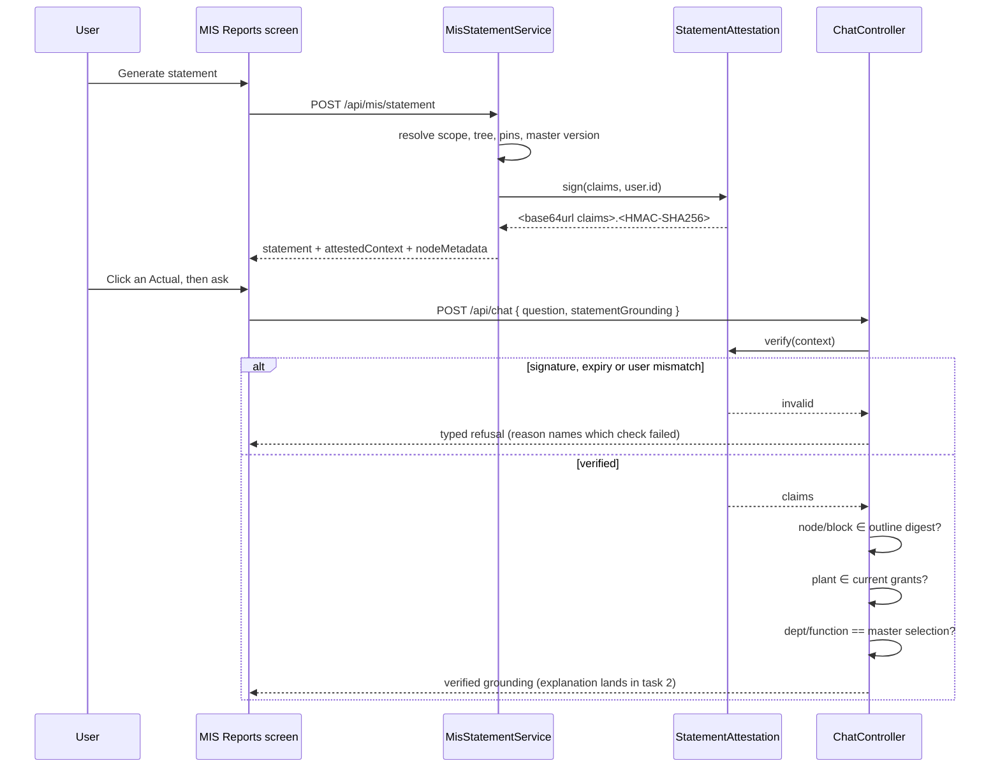

# Task plan — explain-grounding-and-attestation

## What this task is
Make a grounded question **provably about the statement on screen**. Re-deriving scope proves the
user is entitled to the data; it does not prove the question is about what they are looking at.
That gap is why C14's tamper refusal was unprovable until the human chose an attested context.

No explanation is produced here and no UI changes. This task ends with a request that either
verifies or is refused with a typed reason.

## Workflow

## Approach

**The envelope.** `<base64url(canonical JSON claims)>.<base64url(HMAC-SHA256)>`. Canonical means
sorted keys and no insignificant whitespace, so the same claims always sign to identical bytes -
without that, verification is flaky rather than secure.

**The claims.** department, function, plant, period; a **digest of the outline** - leaf keys and
their blocks, hashed - rather than the outline itself, so the token does not grow with the
statement; a **digest of the node-metadata projection**; the pinned batch ids with their sources;
the mapping-master version; the **user id**; and `exp`.

The metadata digest is signed for a reason: if only the outline were covered, a client could alter
the readable GL/cost-centre metadata and task 3's aggregate explanation would present a **false
mapping as attested**.

**Membership needs the outline, not just its digest.** A digest can prove the outline is unchanged;
it cannot answer whether a node belongs to it. The chat path therefore **re-reads the pinned
outline**, compares its digest to the claim, and only then tests membership - which means exposing
the outline lookup to `ChatModule`, since chat has no outline repository today.

**Why the user id and not the session.** `mis-statement.controller.ts:81` takes `@CurrentUser()
user: AuthUser` and no session id - `AuthUser.id` is right there (`contract/src/rbac.ts:29`) - and
a session-bound token would die on the next refresh while the statement is still on screen.

**The secret.** A named environment variable holding a delimiter-separated **ordered list**: the
first key signs, any listed key verifies, so a key rotates without invalidating live statements.
Empty entries are rejected rather than silently skipped, and the TTL has explicit bounds with a
30-minute default.

The requirement is enforced **where the attestation provider is constructed**, not inside
`loadConfig()`. `loadConfig()` runs throughout the backend and every existing hermetic leaf would
fail for want of a secret. Absence still fails startup - the module cannot construct - and the
hermetic command supplies a fixture secret explicitly.

**Node metadata.** `MisStatementNode` carries `nodeKey`, `glCode` and `children` but no approved
GL/cost-centre set. C7's aggregate explanation is a browser projection and an opaque token cannot
hand the browser what it does not contain - so the response carries a **readable** per-leaf
projection of the approved GL codes and cost centres, with its digest inside the signed claims.

**Both new fields are optional in the type, always populated in practice.** Making them required
would break typed fixtures in the backend export test and three frontend test files this task does
not own. A leaf asserts they are present on every resolved response, so the guarantee holds; task 3
still treats absence as a real case rather than trusting the type.

**Typed refusals need somewhere to live.** `AskResponse` carries only a broad `ResponseClass` and a
free-form message, so this task introduces the **refusal variants** of the response union it needs;
task 2 adds the explanation variants. A verified grounded request must **not** fall through into
the existing LLM path - it returns a verified-but-unanswered outcome that task 2 replaces.

**Registration is two files.** `backend/package.json`'s hermetic list is an allow-list, and
`tools/quality-gate.test.mjs` independently owns and compares it. Updating one without the other
either fails the gate or leaves the leaf silently never running.

**The request.** `chat.schemas.ts` is `.strict()`, so `statementGrounding` is added deliberately
and a leaf proves an unknown key is still rejected. The context is authority; the node and block
travel **unsigned** and are checked against the signed outline digest; the client's department and
function are **verified context** sent only so a mismatch can be refused.

**Every refusal is typed.** Invalid signature, expired, other-user, node or block outside the
attested outline, plant outside grants, department/function mismatch. A generic 400 or a silent
substitution is the defect.

## Manual Verification
1. Start the backend with the new secret unset and confirm it **fails to start** rather than
   serving unsigned contexts.
2. Set the secret, restart, sign in and generate a statement for Agriculture Nursery DUB, July 2026.
3. In the network tab, confirm the statement response carries `attestedContext` and the per-leaf
   node metadata, and that the existing report still renders unchanged.
4. Replay the chat request with one character of the context altered - expect a typed refusal
   naming the signature check, not a generic 400.
5. Replay it with a `nodeKey` from a different statement - expect the outline-digest refusal.
6. Replay it with `department` changed to a value the master does not pair with that plant - expect
   the mismatch refusal, not "No mapping configured".
7. Set the TTL to one minute, wait it out, ask again - expect the expiry refusal.
8. Confirm `/api/mis/statement/export` still downloads the workbook unchanged.
9. Replay with the readable node metadata edited but the context untouched - expect refusal,
   because the metadata digest is signed.
10. Ask a normal ungrounded question on `/ask` and confirm it is answered exactly as before.

<!-- forge:contract -->
## Contract (recorded)

Rendered by the harness from the recorded decomposition; edit the decomposition, not this block. It is excluded from the plan's approval and grill digests, so a re-render never stales either.

**Objective.** Make a grounded question provably about the statement on screen. The statement response gains a signed attested context and a readable node-metadata projection; AskRequest gains statementGrounding; the server re-derives every input and refuses what does not verify, with typed reasons. No explanation is produced yet and no UI changes.

**Acceptance criteria**

- The statement response carries an ADDITIVE attested context: base64url canonical-JSON claims plus an HMAC-SHA256 signature, where canonical means sorted keys and no insignificant whitespace so identical claims always sign to identical bytes. Claims are department, function, plant, period, a DIGEST of the outline (leaf keys and their blocks), a DIGEST of the node-metadata projection, the pinned batch ids with their sources, the mapping-master version, the user id, and exp. The metadata digest is part of the signed material because otherwise a client could alter the readable metadata and a later aggregate explanation would present a false mapping as attested.
- The context is bound to the USER ID, not the session: mis-statement.controller.ts:81 receives @CurrentUser() user: AuthUser and no session id, AuthUser.id is available (contract/src/rbac.ts:29), and a session-bound token would die on the next refresh while the statement is still on screen.
- The signing secret is supplied as an ordered, delimiter-separated list under a named environment variable: the first key signs, any listed key verifies, so a key rotates without invalidating live statements. Empty or whitespace-only entries are rejected rather than silently skipped, and the TTL has explicit bounds with a 30-minute default. The requirement is enforced where the attestation provider is CONSTRUCTED, not inside loadConfig(), because loadConfig() runs throughout the backend and every existing hermetic leaf would otherwise fail for want of a secret. Absence therefore still fails startup, and the hermetic test command supplies a fixture secret explicitly.
- The statement response carries a READABLE per-leaf node-metadata projection - the approved GL codes and cost centres - because MisStatementNode carries nodeKey, glCode and children but no approved mapping set, and C7's aggregate explanation is a browser projection that an opaque token cannot supply.
- Both new response fields are OPTIONAL in the contract type so the existing typed fixtures in the backend export test and the frontend statement, drill and report tests keep compiling, while the resolved statement path ALWAYS populates them and a leaf asserts their presence on every resolved response. Task 3 must therefore treat absence as a real case rather than relying on the type.
- AskRequest gains statementGrounding carrying the attested context, the UNSIGNED node and block, and the client's department and function as verified context. chat.schemas.ts is .strict(), so it is extended deliberately and a leaf proves an unknown key is still rejected.
- Node and block membership is checked by RE-READING the pinned outline and comparing its digest to the signed claim before testing membership - a digest alone cannot answer whether a node belongs to the outline. The outline lookup is exposed to ChatModule for this, since chat has no outline repository today.
- The server re-derives everything and trusts nothing from the client, producing a TYPED REFUSAL - never a silent substitution and never an ordinary 'no mapping' answer - for each of: an invalid signature, an expired context, a context whose user id is not the caller, a node or block absent from the attested outline, a plant outside the user's CURRENT grants, a pinned batch that does not validate, and a department or function disagreeing with the master's selection for that plant.
- This task introduces the typed REFUSAL variants of the response union it needs, because AskResponse carries only a broad ResponseClass and free-form message today; task 2 adds the explanation variants. A verified grounded request must NOT fall through into the existing LLM path - it returns a verified-but-unanswered outcome that task 2 replaces.
- Decision 0019: the extended chat request and the statement response's new fields carry typed Zod schemas and Swagger documentation, which means mis-statement.dto.ts - it owns the strict response schema and MisStatementResolvedResponseDto, and without changing it the added fields are rejected or undocumented.
- Every new backend test file is registered in BOTH backend/package.json's test:hermetic allow-list AND tools/quality-gate.test.mjs, which independently owns and compares that list - updating only one of them fails the quality gate.

**Write scope** (what `stage done` measures the diff against)

- backend/package.json
- backend/src/chat/ask-period.test.ts
- backend/src/chat/chat.controller.test.ts
- backend/src/chat/chat.controller.ts
- backend/src/chat/chat.module.ts
- backend/src/chat/chat.schemas.test.ts
- backend/src/chat/chat.schemas.ts
- backend/src/chat/chat.service.test.ts
- backend/src/chat/chat.service.ts
- backend/src/chat/statement-grounding.service.test.ts
- backend/src/chat/statement-grounding.service.ts
- backend/src/mis/mis-statement.controller.test.ts
- backend/src/mis/mis-statement.controller.ts
- backend/src/mis/mis-statement.dto.ts
- backend/src/mis/mis-statement.service.test.ts
- backend/src/mis/mis-statement.service.ts
- backend/src/mis/mis.module.ts
- backend/src/mis/statement-attestation.test.ts
- backend/src/mis/statement-attestation.ts
- backend/src/warehouse/all-plants-reconciliation.db.test.ts
- backend/src/warehouse/statement-outline.interface.ts
- contract/src/api.ts
- tools/quality-gate.test.mjs

**Required tests** (run by `stage done`)

- `the attested context binds scope outline digest metadata digest pins master version user and expiry` -- `TS_NODE_PROJECT=backend/tsconfig.json TS_NODE_TRANSPILE_ONLY=1 node tools/junit-run.mjs --file {path} --name {id} --report {report} --require ts-node/register` (backend/src/mis/statement-attestation.test.ts)
- `a tampered claim fails verification because the signature no longer matches the canonical encoding` -- `TS_NODE_PROJECT=backend/tsconfig.json TS_NODE_TRANSPILE_ONLY=1 node tools/junit-run.mjs --file {path} --name {id} --report {report} --require ts-node/register` (backend/src/mis/statement-attestation.test.ts)
- `altering the readable node metadata invalidates the context because its digest is signed` -- `TS_NODE_PROJECT=backend/tsconfig.json TS_NODE_TRANSPILE_ONLY=1 node tools/junit-run.mjs --file {path} --name {id} --report {report} --require ts-node/register` (backend/src/mis/statement-attestation.test.ts)
- `an expired context and a context issued to another user are both refused` -- `TS_NODE_PROJECT=backend/tsconfig.json TS_NODE_TRANSPILE_ONLY=1 node tools/junit-run.mjs --file {path} --name {id} --report {report} --require ts-node/register` (backend/src/mis/statement-attestation.test.ts)
- `constructing the provider without a secret throws and an empty key entry is rejected rather than skipped` -- `TS_NODE_PROJECT=backend/tsconfig.json TS_NODE_TRANSPILE_ONLY=1 node tools/junit-run.mjs --file {path} --name {id} --report {report} --require ts-node/register` (backend/src/mis/statement-attestation.test.ts)
- `a context signed by a rotated older key still verifies while new ones are signed with the first key` -- `TS_NODE_PROJECT=backend/tsconfig.json TS_NODE_TRANSPILE_ONLY=1 node tools/junit-run.mjs --file {path} --name {id} --report {report} --require ts-node/register` (backend/src/mis/statement-attestation.test.ts)
- `a node or block absent from the re read pinned outline is refused with its own typed reason` -- `TS_NODE_PROJECT=backend/tsconfig.json TS_NODE_TRANSPILE_ONLY=1 node tools/junit-run.mjs --file {path} --name {id} --report {report} --require ts-node/register` (backend/src/chat/statement-grounding.service.test.ts)
- `a plant outside the users current grants is refused and a pinned batch that does not validate is refused` -- `TS_NODE_PROJECT=backend/tsconfig.json TS_NODE_TRANSPILE_ONLY=1 node tools/junit-run.mjs --file {path} --name {id} --report {report} --require ts-node/register` (backend/src/chat/statement-grounding.service.test.ts)
- `a department or function disagreeing with the master selection is a typed refusal not a silent substitution and not a no mapping answer` -- `TS_NODE_PROJECT=backend/tsconfig.json TS_NODE_TRANSPILE_ONLY=1 node tools/junit-run.mjs --file {path} --name {id} --report {report} --require ts-node/register` (backend/src/chat/statement-grounding.service.test.ts)
- `a verified grounded request does not fall through into the llm path` -- `TS_NODE_PROJECT=backend/tsconfig.json TS_NODE_TRANSPILE_ONLY=1 node tools/junit-run.mjs --file {path} --name {id} --report {report} --require ts-node/register` (backend/src/chat/statement-grounding.service.test.ts)
- `the strict chat schema accepts statementGrounding and still rejects an unknown key` -- `TS_NODE_PROJECT=backend/tsconfig.json TS_NODE_TRANSPILE_ONLY=1 node tools/junit-run.mjs --file {path} --name {id} --report {report} --require ts-node/register` (backend/src/chat/chat.schemas.test.ts)
- `every resolved statement response populates the attested context and the per leaf approved gl codes and cost centres` -- `TS_NODE_PROJECT=backend/tsconfig.json TS_NODE_TRANSPILE_ONLY=1 node tools/junit-run.mjs --file {path} --name {id} --report {report} --require ts-node/register` (backend/src/mis/mis-statement.service.test.ts)

**Verify commands**

- `python3 factory/scripts/verify.py`

**Review budget.** 24 files / 1300 lines -- A signed attestation module with its own leaves, two additive statement fields and their DTO/Swagger, the outline lookup exposed to chat, the chat schema extension, and a grounding service that produces typed refusals. No UI and no explanation logic. Scope extended mid-stage for two MECHANICALLY IMPLIED files (signal S-0019-701b): backend/src/chat/chat.controller.ts, because it is what forwards parsed request fields to ChatService on BOTH the buffered and streamed paths (chat.controller.ts:37-40 and :76-77) - without it the server-side verification this task exists to build is unreachable; and backend/src/mis/mis.module.ts, because a Nest provider must be registered in the module that supplies it and the new attestation provider has nowhere else to live. Neither adds behaviour beyond the recorded criteria. Scope extended again mid-stage (signal S-0021-e132) for five MECHANICALLY IMPLIED fixture files. The review's binding P1 ruling is to delete the compatibility constructor defaults on ChatService and MisStatementService; every file that constructs those services DIRECTLY must therefore pass the new dependency or it will not compile. `grep -rln 'new ChatService(|new MisStatementService(' backend/src` names exactly these: ask-period.test.ts, chat.controller.test.ts, chat.service.test.ts, mis-statement.controller.test.ts and all-plants-reconciliation.db.test.ts (the last is a DB-gated leaf, skipped in the hermetic run but still type-checked). The budget rises with them because the ceiling is measured on the finished diff, and these are constructor-argument edits rather than new behaviour.
<!-- /forge:contract -->
