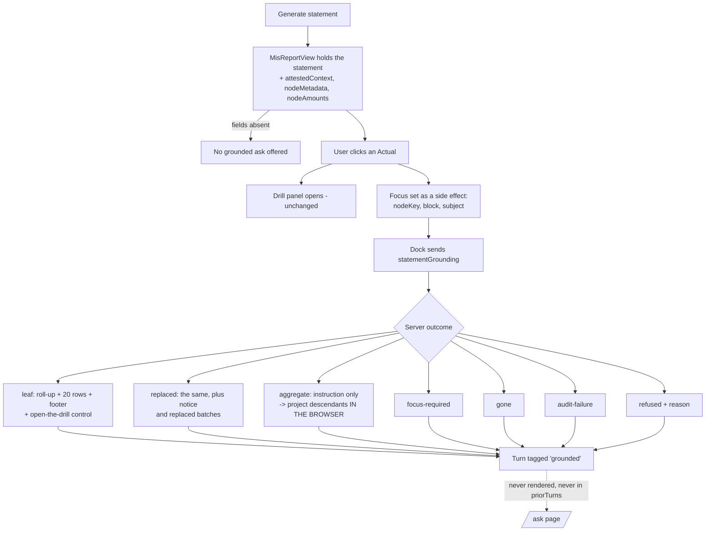

# Task plan — explain-on-screen

## What this task is
The visible half. Tasks 1 and 2 built an attested, audited explanation that nobody can see yet;
this puts it on screen — click a figure, ask, read how it was built — and keeps `/ask` exactly as
it is while doing so.

## Workflow

## Approach

**Focus lifts, the drill does not move.** `StatementView` owns the drill internally
(`statement-view.tsx:22`) while `AskPanel` is its sibling in `mis-report-view`, so the focused
`{ nodeKey, block, subject }` moves up to the report view. Clicking an Actual **still opens the
drill exactly as today** — focus is a side effect, never a replacement. There is no selected-block
control: the block always comes from the focused node.

**The aggregate is projected here, not fetched.** The server deliberately returns
`instruction: "project-descendants-from-attested-statement"` and **no rows**, because decision
0024 puts aggregate projection on the client. The browser derives the descendant lines **and their
values** from the statement it already holds. A labels-only rendering fails the criterion — the
point is showing which amounts add up to the figure.

**Seven variants, seven renderings.** `focus-required`, `leaf`, `replaced`, `aggregate`, `gone`,
`audit-failure`, `refused`. `replaced` is the one most likely to be mishandled: it carries the
full `StatementLeafExplanation` *and* a notice *and* `replacedBatches`, and dropping either half
either hides stale data or hides the figures.

**Isolation is turn ownership.** Both panels share one `AskProvider`; every turn renders from it
and successful turns feed the next request's `priorTurns` (`use-ask.ts:86`). So each turn is
tagged with its origin and grounded turns are partitioned out of **both** `/ask`'s rendering and
the `priorTurns` `/ask` sends — otherwise a grounded explanation leaks into an ungrounded
request's context and `/ask`'s wire behaviour changes after all.

**Absence is a real case.** The attested context and node metadata are **optional** in the
contract type by the human's decision, so the client cannot trust the type. When they are missing
the dock simply does not offer a grounded ask, rather than crashing or sending a request it cannot
ground.

**Design.** UI, so `emil-design-eng` and `frontend-design` are mandatory and must be genuinely
applied. The surface to judge is a dense financial explanation inside a narrow docked panel: a
roll-up list, twenty transaction rows, a footer that must read as authoritative, and a staleness
notice that has to be impossible to miss without shouting over the figures.

## Manual Verification
1. Start the backend with `LLM_PROVIDER=bedrock`, `BEDROCK_MODEL_ID` and
   `STATEMENT_ATTESTATION_SECRETS` set; sign in as a seeded admin.
2. On MIS Reports, generate Agriculture Nursery DUB for July 2026 and open the Assistant.
3. Click a leaf Actual — confirm the drill panel still opens exactly as before.
4. Ask "how is this 85000" — confirm the roll-up path names GL codes and cost centres, the
   transactions list, and the footer matches the cell you clicked.
5. Use the explanation's control to open the full drill on that node.
6. Click a subtotal and ask — confirm descendant lines appear **with values**, and the network tab
   shows **no** extra request for them.
7. Ask without clicking anything — confirm the focus-required copy, which comes from the server.
8. Ask "why is this so high?" — confirm the causal decline, unchanged.
9. Navigate to `/ask` — confirm the grounded turns are **not** shown there, and that asking an
   ordinary question there behaves exactly as before.
10. Generate a statement for a non-owner plant — confirm "Budget not loaded for this plant" reads
    as a normal state, not as an error.

<!-- forge:contract -->
## Contract (recorded)

Rendered by the harness from the recorded decomposition; edit the decomposition, not this block. It is excluded from the plan's approval and grill digests, so a re-render never stales either.

**Objective.** Put the capability on screen: lift focus to the report view, wire the dock to send the attested context, project aggregates client-side, render every outcome, and keep /ask isolated by owning turns rather than branching on render.

**Acceptance criteria**

- The MIS report view OWNS the shared statement context and the focused { nodeKey, block, subject }. StatementView owns the drill internally today (statement-view.tsx:22) while AskPanel is its sibling in mis-report-view, so focus must lift. There is NO independent selected block before focus: the block always comes from the focused node.
- Clicking an Actual STILL opens the drill panel exactly as it does today. Focus is set as a SIDE EFFECT, never a replacement, so drill-down does not regress, and the user may ask with the panel open or closed.
- The docked panel sends statementGrounding - attestedContext, department, function, the optional focus, nodeMetadata and nodeAmounts - taken from the rendered statement response. The /ask page sends none of it.
- An AGGREGATE explanation is projected IN THE BROWSER from the attested statement payload, per decision 0024. The server returns instruction 'project-descendants-from-attested-statement' and no rows; the client derives the descendant lines AND THEIR VALUES from the statement it already holds. A labels-only rendering does not satisfy this.
- All SEVEN variants render their own copy: focus-required, leaf, replaced, aggregate, gone, audit-failure and refused. A variant that falls through to generic copy is a defect, and replaced must show the notice and the replaced batches alongside the full explanation rather than dropping either.
- /ask is isolated by TURN OWNERSHIP, not a rendering branch. Both panels share one AskProvider, every turn renders from it, and successful turns feed the next request's priorTurns (use-ask.ts:86) - so each turn is tagged with its origin, and grounded turns are partitioned out of BOTH /ask's rendering AND the priorTurns /ask sends. Leaves prove both halves.
- The frontend request types admit statementGrounding on the buffered AND the streamed path.
- The explanation offers a declared control that opens the shipped drill panel on the focused node, for paging beyond the inline 20 rows that transactions.pageSize fixes.
- With no rendered statement, or no mapping for the scope, the dock says so LOCALLY and submits no grounded ask. That is the ONLY local case: an absent focus is a SERVER outcome returning focus-required, because task 2 made it one.
- Both new statement-response fields are OPTIONAL in the contract type, so the client treats their absence as a real case rather than trusting the type - when they are missing the dock does not offer a grounded ask.
- Budget is not focusable from the surface, matching the statement's shipped footnote that Budget is not drillable - while the backend refusal task 2 shipped remains the authority, because a client-side rule cannot catch a crafted request.
- The shipped /ask leaves and the statement view's shipped leaves pass UNMODIFIED.
- Every criterion is proven by hermetic frontend leaves judged by the vitest discriminator - present AND NOT skipped AND NOT failed (D-0031) - because vitest exits 0 and marks an unmatched -t leaf skipped, so a name drift would report green having asserted nothing.

**Write scope** (what `stage done` measures the diff against)

- frontend/app/globals.css
- frontend/src/features/assistant/ask-panel.test.tsx
- frontend/src/features/assistant/ask-panel.tsx
- frontend/src/features/assistant/statement-explanation.test.tsx
- frontend/src/features/assistant/statement-explanation.tsx
- frontend/src/features/assistant/use-ask.test.tsx
- frontend/src/features/assistant/use-ask.ts
- frontend/src/features/mis/aggregate-projection.helper.test.ts
- frontend/src/features/mis/aggregate-projection.helper.ts
- frontend/src/features/mis/drill-panel.tsx
- frontend/src/features/mis/mis-report-view.test.tsx
- frontend/src/features/mis/mis-report-view.tsx
- frontend/src/features/mis/statement-view.test.tsx
- frontend/src/features/mis/statement-view.tsx
- frontend/src/features/mis/use-mis-statement.ts
- frontend/src/lib/api.test.ts
- frontend/src/lib/api.ts

**Required tests** (run by `stage done`)

- `clicking an actual opens the drill panel and sets assistant focus without replacing the drill` -- `npm exec --no -- vitest run --config frontend/vitest.config.ts --reporter=junit --outputFile={report} {path} -t {id}` (frontend/src/features/mis/statement-view.test.tsx)
- `the block comes from the focused node and there is no selected block before focus` -- `npm exec --no -- vitest run --config frontend/vitest.config.ts --reporter=junit --outputFile={report} {path} -t {id}` (frontend/src/features/mis/mis-report-view.test.tsx)
- `an aggregate explanation projects descendant lines with their values from the rendered statement` -- `npm exec --no -- vitest run --config frontend/vitest.config.ts --reporter=junit --outputFile={report} {path} -t {id}` (frontend/src/features/mis/aggregate-projection.helper.test.ts)
- `all seven outcome variants render their own copy and none falls through to the generic message` -- `npm exec --no -- vitest run --config frontend/vitest.config.ts --reporter=junit --outputFile={report} {path} -t {id}` (frontend/src/features/assistant/statement-explanation.test.tsx)
- `the replaced variant shows its notice and replaced batches alongside the full explanation` -- `npm exec --no -- vitest run --config frontend/vitest.config.ts --reporter=junit --outputFile={report} {path} -t {id}` (frontend/src/features/assistant/statement-explanation.test.tsx)
- `a grounded turn is not rendered on the ask page` -- `npm exec --no -- vitest run --config frontend/vitest.config.ts --reporter=junit --outputFile={report} {path} -t {id}` (frontend/src/features/assistant/use-ask.test.tsx)
- `a grounded turn is excluded from the prior turns an ungrounded ask sends` -- `npm exec --no -- vitest run --config frontend/vitest.config.ts --reporter=junit --outputFile={report} {path} -t {id}` (frontend/src/features/assistant/use-ask.test.tsx)
- `the docked panel sends the attested context and the focused node while the ask page sends neither` -- `npm exec --no -- vitest run --config frontend/vitest.config.ts --reporter=junit --outputFile={report} {path} -t {id}` (frontend/src/features/assistant/ask-panel.test.tsx)
- `grounding is admitted on the buffered and the streamed request path` -- `npm exec --no -- vitest run --config frontend/vitest.config.ts --reporter=junit --outputFile={report} {path} -t {id}` (frontend/src/lib/api.test.ts)
- `with no rendered statement the dock says so locally and submits no grounded ask` -- `npm exec --no -- vitest run --config frontend/vitest.config.ts --reporter=junit --outputFile={report} {path} -t {id}` (frontend/src/features/mis/mis-report-view.test.tsx)
- `a statement response missing the attested context does not offer a grounded ask` -- `npm exec --no -- vitest run --config frontend/vitest.config.ts --reporter=junit --outputFile={report} {path} -t {id}` (frontend/src/features/mis/mis-report-view.test.tsx)
- `the explanation offers a control that opens the drill panel on the focused node` -- `npm exec --no -- vitest run --config frontend/vitest.config.ts --reporter=junit --outputFile={report} {path} -t {id}` (frontend/src/features/assistant/statement-explanation.test.tsx)

**Verify commands**

- `python3 factory/scripts/verify.py`

**Review budget.** 20 files / 1500 lines -- Sized from the file set at the start rather than raised mid-stage, which is the lesson from task 2's three budget raises. Seventeen declared files: focus lifted into the report view, the dock wired to send grounding, a browser-side aggregate projection with its own helper and leaves, a renderer for seven variants, turn partitioning across rendering and priorTurns, and the request types on two paths. UI, so design skills are mandatory and a functional check is required.
<!-- /forge:contract -->
