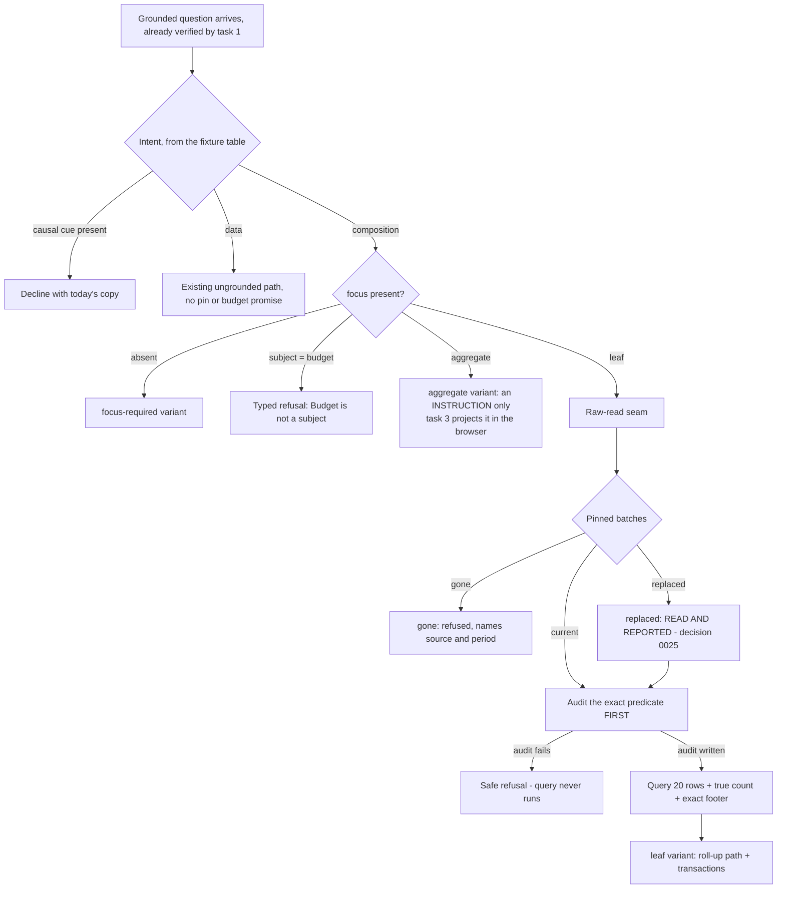

# Task plan — explain-the-number

## What this task is
Turn an attested, verified grounding into an **explanation**. Task 1 ended at a
verified-but-unanswered outcome; this task replaces it with the answer, and does so through the
drill's existing governed-read protections rather than beside them.

Still no UI. Task 3 renders what this returns.

## Workflow

## Approach

**The focus is one optional typed object.** Task 1 made `nodeKey` and `block` REQUIRED together,
which quietly makes two recorded criteria impossible: an unfocused request is rejected by the
schema before the service runs, so `focus-required` can never be returned, and without a subject a
crafted Budget focus is indistinguishable from an Actual one, so the backend Budget refusal cannot
exist. The pair becomes an optional `focus` of `{ nodeKey, block, subject: "actual" | "budget" }`:
absent means `focus-required`, `budget` is a typed refusal, and only `actual` reaches the seam.

**One verified-grounding context, server-only.** `StatementGroundingService.verify()` returns a
public status today, while the seam needs the server-derived resolution, scope, pins, range and
focus. Rebuilding those from client fields would create a second, inconsistent validation path;
re-running the checks would repeat the sensitive batch reads. So verification produces a
server-only context from the SINGLE authoritative batch-state read - which is also how D-0053 is
actually fixed - and both the chat path and the drill controller feed the seam from it. A drill
request is never reconstructed from client input.

**Replaced is a whole answer, not a flag.** It is its own outcome carrying the full leaf
explanation, the transaction page and the footer, plus a notice naming the source and period that
went stale - a flag on an otherwise-normal answer is the kind of detail a renderer drops, and then
stale figures read as current.

**The limit must reach the SQL.** `drill-transactions` hard-codes `LIMIT 100` and its interface
takes no limit argument, so "the assistant asks for 20" is cosmetic until the interface, the
repository and its test change.

**Extract, do not copy.** `MisDrillService.run` (mis-drill.service.ts:27) already holds everything
this needs - authorize, canonical plant and scope, resolve, block, `bindPins`, outline lookup,
`leafTriples`, `buildQueries`, and the pre-query audit - but it is controller-oriented: it returns
HTTP-shaped refusals through `refuse(...)` and is not available to `ChatModule`. The seam moves
that body out and returns **typed outcomes** (`ok`, `replaced`, `gone`, `audit-failed`) with the
row limit as an argument. The drill controller maps those back to its shipped response so its
behaviour does not change; the assistant renders them as variants. **Exactly one pinned-batch
query may exist afterwards.**

**The roll-up path is nearly computed.** `leafTriples(resolution, leafKey)` yields the
(plant, cost centre, GL) triples the master folds into that leaf - the "how did it come to be"
half, with no new query. But it DROPS the mapping target, the provisional flag and the reason, so
the typed roll-up payload must carry them; without that an unmapped-GL line cannot honestly be
called provisional.

**Intent is a table, not prose.** Today's guard matches "why", "reason" and "explain" and does
**not** classify "how is this 85000" as causal at all, so the boundary is built here. A causal cue
wins when both appear, because the safe reading wins.

**Rows.** The assistant asks the seam for 20; the drill panel keeps its 100. The answer always
carries the exact footer and the **true** total count, so a bounded list never reads as the whole
list.

**Footing is paise.** Against the statement payload, never the rendered cell - the statement
rounds to rupees and the shipped drill contract already tolerates up to Rs 1 there.

**Staleness is decision 0025, not intuition.** Replaced-but-present is read and reported; only
gone is refused. The shipped drill panel hides those lines instead, which is D-0051's ledgered
divergence - do not "fix" the panel here.

**The two deferrals whose trigger is this task.** D-0052: the digest leaf must return a
**different** outline than the one attested, because today it returns the same one and varies only
the node, so the mismatch branch is unexercised and the comparison could be skipped entirely
without failing; also bound the client-supplied `nodeMetadata` arrays and strings, which are
sorted and hashed. D-0053: read batch existence and the active batch in **one** query.

## Manual Verification
1. Start the backend with `LLM_PROVIDER=bedrock`, `BEDROCK_MODEL_ID` and
   `STATEMENT_ATTESTATION_SECRETS` set, sign in as a seeded admin, and generate the Agriculture
   Nursery DUB statement for July 2026.
2. Click a leaf Actual and ask "how is this 85000" - expect the roll-up path naming GL codes and
   cost centres, then transactions with a footer that foots to the cell.
3. Ask "why is this so high?" on the same node - expect today's causal decline, not an explanation.
4. Ask "how is this built and why is it high" - expect the decline, because the causal cue wins.
5. Ask an ordinary data question with the statement on screen - expect the normal ungrounded answer.
6. Click a subtotal and ask - expect the aggregate variant carrying an instruction and no raw rows.
7. Click a Budget cell and craft the same request against the API - expect a backend refusal.
8. Re-ingest that period so the pinned actual batch is replaced, then ask again - expect the
   figures WITH a replaced notice naming source and period, not a refusal.
9. Check the audit table: the drill event is written before the query, and a forced audit failure
   returns the safe refusal with no query in the log.
10. Confirm `/ask` still answers an ordinary question exactly as before.

<!-- forge:contract -->
## Contract (recorded)

Rendered by the harness from the recorded decomposition; edit the decomposition, not this block. It is excluded from the plan's approval and grill digests, so a re-render never stales either.

**Objective.** Turn an attested, grounded question into an explanation. Extract the drill's raw-read seam so the assistant and the drill controller share one sensitive query, classify intent deterministically, and answer a leaf with its roll-up path and transactions through a typed response union. Still no UI.

**Acceptance criteria**

- A domain seam is EXTRACTED from MisDrillService returning typed outcomes - ok, replaced, gone, audit-failed - instead of throwing HTTP exceptions, and takes the row limit as an argument. MisDrillService is controller-oriented today (mis-drill.service.ts:27) and unavailable to ChatModule, so without the extraction this task would either duplicate the sensitive pinned-batch query or lose its typed outcomes to the global error filter. The drill controller and the assistant both call the ONE seam; the assistant asks for 20 rows and the drill panel keeps its 100.
- Intent is a closed enum - composition, causal, data - resolved against a FIXTURE TABLE the tests own, with a causal cue WINNING when both appear. Today's guard does not classify 'how is this 85000' as causal at all (reconciliation-guard.ts:31); it matches why, reason and explain. Composition is answered, causal is still declined with today's copy, and data falls through to the existing ungrounded path with NO pin or budget promise attached.
- A LEAF explanation names the roll-up path - the GL codes and cost centres the master folds into that leaf, and the bucket they arrive through - and lists transactions with an exact footer, the true total count, and the first 20 rows.
- Footing is asserted in PAISE against the statement payload, not the rendered cell. The statement displays rupees and the shipped drill contract permits the exact footer to differ from the displayed cell by up to Rs 1 with paise equality underneath, so a leaf asserts paise equality and never rupee equality.
- The leaf read carries the drill's governed-read protections, not the ordinary chat audit: inputs re-derived, pins validated, current scope applied, the exact predicate audited BEFORE the query runs, and a failed audit returning a SAFE TYPED REFUSAL having never queried.
- Staleness follows decision 0025 exactly: a REPLACED but still present batch is READ AND REPORTED as replaced; only a GONE batch is refused. Both are typed, naming source, period and batch status. The shipped drill PANEL diverges from this by hiding the lines - that divergence is ledgered as D-0051 and is deliberately NOT fixed here.
- Budget is refused as a subject IN THE BACKEND, because a crafted focus on a Budget cell cannot be caught by a client-side rule.
- Every grounded explanation carries a distinct budgetState of not-loaded when the plant is not the budget owner (decision 0034), kept distinct from a replaced or gone batch. An unmapped-GL line is described as provisional, not as an approved mapping.
- The explanation is an in-band TYPED RESPONSE UNION on the existing chat transport with a variant per outcome: focus-required, leaf, aggregate, replaced, gone and safe audit-failure. 'No focus' is a SERVER outcome returning focus-required, not a local guess, and it extends the refusal variants task 1 already shipped rather than inventing a second union.
- No SERVER-SOURCED transaction row, amount, batch identifier, measure value or result row reaches the model. A leaf asserts the PROVIDER PAYLOAD, not the rendered answer. The user's own question and prior-turn text may carry figures - the motivating question does - so the rule binds what the server read, never what the user typed.
- The union is schema'd and documented on BOTH the buffered and the streamed chat route (decision 0019); they are separate routes and must not drift. Hermetic leaves use a deterministic classifier and a FAKE provider, never Bedrock, and every new test file is registered in BOTH backend/package.json's test:hermetic allow-list AND tools/quality-gate.test.mjs.
- D-0052, whose trigger is this task: the leaf that proves the re-read outline digest check must exercise the MISMATCH path by returning a DIFFERENT outline than the one attested, because today it returns the same outline and varies only the node - so the comparison could be skipped entirely and the leaf would still pass. Bound the client-supplied nodeMetadata arrays and their strings in chat.schemas.ts as well, since that structure is sorted and hashed during verification.
- D-0053, whose trigger is this task: read pinned-batch existence and the authoritative active-batch state in ONE query in statement-grounding.service.ts, so a stale row cannot be reconciled against an active-batch answer read at a different instant.
- The wire carries an OPTIONAL typed focus instead of a required nodeKey/block pair: absent means the server returns focus-required, and present means { nodeKey, block, subject: 'actual' | 'budget' }. Task 1 made the pair REQUIRED, which makes both focus-required and the backend Budget refusal impossible - an unfocused request is rejected before the service ever runs, and without a subject a crafted Budget focus is indistinguishable from an Actual one. Only subject 'actual' reaches the read seam; 'budget' is a typed refusal.
- REPLACED is its own outcome carrying the FULL leaf explanation - roll-up path, transaction page and exact footer - plus a notice naming the source and period that went stale, rather than a status flag on an otherwise-normal answer that a renderer can drop. It extends the statement-grounding union task 1 shipped; no parallel response channel is created.
- A server-only VERIFIED-GROUNDING CONTEXT is produced from the single authoritative batch-state read and passed to the seam, carrying the server-derived resolution, scope, pins, range and focus. The drill controller uses the same seam's preparation path. A drill request is NEVER reconstructed from client fields, because that would either create a second inconsistent validation path or repeat the sensitive batch reads.
- The row limit reaches the SQL: drill-transactions hard-codes LIMIT 100 and its interface takes no limit argument, so the assistant's 20 would be cosmetic without changing the interface, the repository and its test.
- The typed roll-up payload carries the mapping target, the provisional flag and the reason, because leafTriples() drops them today - without those an unmapped-GL line cannot honestly be described as provisional, which criterion 8 requires.
- Both chat routes carry a NAMED response DTO or schema for the union with a Swagger assertion - they have description-only responses today, and decision 0019 is not satisfied by a description.

**Write scope** (what `stage done` measures the diff against)

- backend/package.json
- backend/src/chat/chat.controller.ts
- backend/src/chat/chat.module.ts
- backend/src/chat/chat.schemas.test.ts
- backend/src/chat/chat.schemas.ts
- backend/src/chat/chat.service.test.ts
- backend/src/chat/chat.service.ts
- backend/src/chat/chat.sse.test.ts
- backend/src/chat/reconciliation-guard.test.ts
- backend/src/chat/reconciliation-guard.ts
- backend/src/chat/statement-explanation.service.test.ts
- backend/src/chat/statement-explanation.service.ts
- backend/src/chat/statement-grounding.service.test.ts
- backend/src/chat/statement-grounding.service.ts
- backend/src/chat/statement-intent.test.ts
- backend/src/chat/statement-intent.ts
- backend/src/mis/mis-drill.controller.test.ts
- backend/src/mis/mis-drill.controller.ts
- backend/src/mis/mis-drill.interface.ts
- backend/src/mis/mis-drill.service.test.ts
- backend/src/mis/mis-drill.service.ts
- backend/src/mis/mis-statement.service.ts
- backend/src/mis/mis.module.ts
- backend/src/mis/statement-attestation.test.ts
- backend/src/mis/statement-attestation.ts
- backend/src/swagger.test.ts
- backend/src/warehouse/drill-transactions.interface.ts
- backend/src/warehouse/drill-transactions.repository.test.ts
- backend/src/warehouse/drill-transactions.repository.ts
- contract/src/api.ts
- tools/quality-gate.test.mjs

**Required tests** (run by `stage done`)

- `the extracted seam returns a typed replaced outcome instead of throwing and the drill controller still maps it to its shipped response` -- `TS_NODE_PROJECT=backend/tsconfig.json TS_NODE_TRANSPILE_ONLY=1 node tools/junit-run.mjs --file {path} --name {id} --report {report} --require ts-node/register` (backend/src/mis/mis-drill.service.test.ts)
- `the assistant asks the seam for twenty rows while the drill panel keeps its hundred row page` -- `TS_NODE_PROJECT=backend/tsconfig.json TS_NODE_TRANSPILE_ONLY=1 node tools/junit-run.mjs --file {path} --name {id} --report {report} --require ts-node/register` (backend/src/mis/mis-drill.service.test.ts)
- `a gone batch is refused while a replaced but present batch is read and reported` -- `TS_NODE_PROJECT=backend/tsconfig.json TS_NODE_TRANSPILE_ONLY=1 node tools/junit-run.mjs --file {path} --name {id} --report {report} --require ts-node/register` (backend/src/chat/statement-explanation.service.test.ts)
- `a failed audit returns a safe typed refusal and never runs the query` -- `TS_NODE_PROJECT=backend/tsconfig.json TS_NODE_TRANSPILE_ONLY=1 node tools/junit-run.mjs --file {path} --name {id} --report {report} --require ts-node/register` (backend/src/chat/statement-explanation.service.test.ts)
- `a leaf explanation foots in paise against the statement payload and reports the true total count with twenty rows` -- `TS_NODE_PROJECT=backend/tsconfig.json TS_NODE_TRANSPILE_ONLY=1 node tools/junit-run.mjs --file {path} --name {id} --report {report} --require ts-node/register` (backend/src/chat/statement-explanation.service.test.ts)
- `a leaf explanation names the gl codes and cost centres the master folds into that leaf` -- `TS_NODE_PROJECT=backend/tsconfig.json TS_NODE_TRANSPILE_ONLY=1 node tools/junit-run.mjs --file {path} --name {id} --report {report} --require ts-node/register` (backend/src/chat/statement-explanation.service.test.ts)
- `a crafted budget focus is refused by the backend` -- `TS_NODE_PROJECT=backend/tsconfig.json TS_NODE_TRANSPILE_ONLY=1 node tools/junit-run.mjs --file {path} --name {id} --report {report} --require ts-node/register` (backend/src/chat/statement-explanation.service.test.ts)
- `a non owner plant carries budgetState not loaded distinct from a replaced or gone batch` -- `TS_NODE_PROJECT=backend/tsconfig.json TS_NODE_TRANSPILE_ONLY=1 node tools/junit-run.mjs --file {path} --name {id} --report {report} --require ts-node/register` (backend/src/chat/statement-explanation.service.test.ts)
- `no server sourced row amount batch id or measure value appears in the provider payload while the users own question may carry a figure` -- `TS_NODE_PROJECT=backend/tsconfig.json TS_NODE_TRANSPILE_ONLY=1 node tools/junit-run.mjs --file {path} --name {id} --report {report} --require ts-node/register` (backend/src/chat/statement-explanation.service.test.ts)
- `a grounded question with no focused node returns the focus required variant from the server` -- `TS_NODE_PROJECT=backend/tsconfig.json TS_NODE_TRANSPILE_ONLY=1 node tools/junit-run.mjs --file {path} --name {id} --report {report} --require ts-node/register` (backend/src/chat/statement-explanation.service.test.ts)
- `the intent fixture table resolves composition and causal and lets the causal cue win when both appear` -- `TS_NODE_PROJECT=backend/tsconfig.json TS_NODE_TRANSPILE_ONLY=1 node tools/junit-run.mjs --file {path} --name {id} --report {report} --require ts-node/register` (backend/src/chat/statement-intent.test.ts)
- `an ungrounded causal question still receives the shipped causal copy` -- `TS_NODE_PROJECT=backend/tsconfig.json TS_NODE_TRANSPILE_ONLY=1 node tools/junit-run.mjs --file {path} --name {id} --report {report} --require ts-node/register` (backend/src/chat/reconciliation-guard.test.ts)
- `a re read outline that differs from the attested one is refused on the digest mismatch` -- `TS_NODE_PROJECT=backend/tsconfig.json TS_NODE_TRANSPILE_ONLY=1 node tools/junit-run.mjs --file {path} --name {id} --report {report} --require ts-node/register` (backend/src/chat/statement-grounding.service.test.ts)
- `oversized node metadata arrays are rejected by the schema before being sorted and hashed` -- `TS_NODE_PROJECT=backend/tsconfig.json TS_NODE_TRANSPILE_ONLY=1 node tools/junit-run.mjs --file {path} --name {id} --report {report} --require ts-node/register` (backend/src/chat/chat.schemas.test.ts)
- `pinned batch existence and the active batch are read in one query so a stale row cannot override the active one` -- `TS_NODE_PROJECT=backend/tsconfig.json TS_NODE_TRANSPILE_ONLY=1 node tools/junit-run.mjs --file {path} --name {id} --report {report} --require ts-node/register` (backend/src/chat/statement-grounding.service.test.ts)
- `a grounded data question falls through to the ungrounded path with no pin or budget promise attached` -- `TS_NODE_PROJECT=backend/tsconfig.json TS_NODE_TRANSPILE_ONLY=1 node tools/junit-run.mjs --file {path} --name {id} --report {report} --require ts-node/register` (backend/src/chat/statement-explanation.service.test.ts)
- `a crafted budget subject is refused before the read seam is reached` -- `TS_NODE_PROJECT=backend/tsconfig.json TS_NODE_TRANSPILE_ONLY=1 node tools/junit-run.mjs --file {path} --name {id} --report {report} --require ts-node/register` (backend/src/chat/statement-explanation.service.test.ts)
- `an absent focus returns focus required rather than being rejected by the schema` -- `TS_NODE_PROJECT=backend/tsconfig.json TS_NODE_TRANSPILE_ONLY=1 node tools/junit-run.mjs --file {path} --name {id} --report {report} --require ts-node/register` (backend/src/chat/chat.schemas.test.ts)
- `the replaced outcome carries the full leaf explanation and a notice naming the source and period` -- `TS_NODE_PROJECT=backend/tsconfig.json TS_NODE_TRANSPILE_ONLY=1 node tools/junit-run.mjs --file {path} --name {id} --report {report} --require ts-node/register` (backend/src/chat/statement-explanation.service.test.ts)
- `an unmapped gl line is described as provisional with its reason` -- `TS_NODE_PROJECT=backend/tsconfig.json TS_NODE_TRANSPILE_ONLY=1 node tools/junit-run.mjs --file {path} --name {id} --report {report} --require ts-node/register` (backend/src/chat/statement-explanation.service.test.ts)
- `the audit record names the mapping master version` -- `TS_NODE_PROJECT=backend/tsconfig.json TS_NODE_TRANSPILE_ONLY=1 node tools/junit-run.mjs --file {path} --name {id} --report {report} --require ts-node/register` (backend/src/chat/statement-explanation.service.test.ts)
- `the repository honours the supplied row limit so twenty reaches the sql and the drill keeps one hundred` -- `TS_NODE_PROJECT=backend/tsconfig.json TS_NODE_TRANSPILE_ONLY=1 node tools/junit-run.mjs --file {path} --name {id} --report {report} --require ts-node/register` (backend/src/warehouse/drill-transactions.repository.test.ts)
- `the drill controller maps every typed seam outcome to its shipped response` -- `TS_NODE_PROJECT=backend/tsconfig.json TS_NODE_TRANSPILE_ONLY=1 node tools/junit-run.mjs --file {path} --name {id} --report {report} --require ts-node/register` (backend/src/mis/mis-drill.controller.test.ts)
- `both chat routes document the explanation union with a named schema` -- `TS_NODE_PROJECT=backend/tsconfig.json TS_NODE_TRANSPILE_ONLY=1 node tools/junit-run.mjs --file {path} --name {id} --report {report} --require ts-node/register` (backend/src/swagger.test.ts)

**Verify commands**

- `python3 factory/scripts/verify.py`

**Review budget.** 32 files / 1900 lines -- A seam extraction with typed outcomes shared by two callers, a deterministic intent table, the explanation service, and the response union across two chat routes - plus D-0052 and D-0053, whose recorded trigger is this task and which open the same files. No UI. The largest of the three tasks, and the one where the governed-read protections live. Raised after the task grill: the limit must reach the SQL (the repository hard-codes LIMIT 100), the drill controller must map typed outcomes, the roll-up payload must carry provisional data leafTriples drops, and both chat routes need a named union schema - each pulling its own file and leaf. The ceiling is measured on the finished diff. Scope extended mid-stage (signal S-0022-462a) for backend/src/mis/statement-attestation.ts and its test, which are MECHANICALLY IMPLIED by the review's binding paise-footing fix. The footer must be compared against the statement amount that was ON SCREEN, and for a REPLACED-but-present batch re-deriving that amount now returns a different number than the user saw - so the amount has to be bound at ISSUE time, which means the attestation. Following the nodeMetadata pattern already shipped: the per-node actual paise travel READABLE in the statement response and their DIGEST joins the signed claims, so the token does not grow with the statement and the amounts still cannot be altered independently of the context.
<!-- /forge:contract -->
