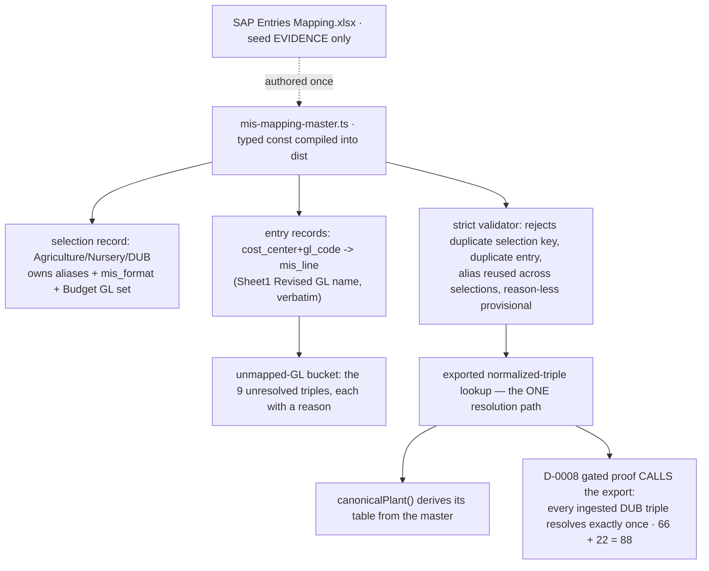

# Task plan — mapping-master: the versioned Mapping Master + unmapped-GL bucket

Story: mis-selection · Task 1 of 3 · user_facing: false

## Objective
Build the **versioned, repo-owned Mapping Master** that becomes the single runtime
authority for selection and validation — owning the plant aliases, the MIS format, the
`(cost_center, gl_code) → mis_line` entries and the Budget GL coverage set — with the
**`unmapped-GL` bucket** keeping the DUB slice complete without inventing financial meaning.
The Excel workbooks become **seed evidence**, never runtime input.

No resolution API, no HTTP route, no governed-builder change, no UI (tasks 2 and 3).

## Standards
`constitution/03-modular-monolith-structure.md` and
`constitution/pnp-coding-standards-modular-monolith.md` govern the layout, boundaries and
naming of the new `backend/src/mapping` module;
`constitution/07-exception-handling.md` governs the loader's failure mode — one clear typed
error, never a silent fallback.

## Acceptance criteria (plan_contracts)
- **t-mm-c1** — selection records keyed by `(department, function, plant_canonical)` own the
  aliases + `mis_format`; entry records map `(cost_center, gl_code) → mis_line` with
  `provisional` + `reason`; a strict loader makes resolution deterministic; the workbooks are
  seed evidence recorded as a `source` provenance string, so **renaming a source file cannot
  change the output**.
- **t-mm-c2** — the **nine** unresolved DUB triples map to the reserved `unmapped-GL` line
  with a reason, and every DUB raw triple resolves **exactly once** — 66 mapped + 22
  bucketed = **88** rows, no fan-out.
- **t-mm-c3** — plant alias authority lives in the master; **no hard-coded alias table
  remains** in ingestion.

## What already exists (grounding, file:line)
- **Runtime-config precedent** — typed TS consts compiled into `dist`:
  `db/migrate.ts:18-35` `baseRolePerms`, `semantic/semanticLayer.ts:11` `baseDomains`.
  The frozen-JSON + strict-loader pattern (`__fixtures__/july-dub-reconciliation.json` +
  `reconciliation.repository.ts:62-77`, and `golden-financial.db.test.ts:117-160`'s
  exact-key-set + canonical-sort validation) is the precedent for **test expectations**.
- **Alias authority today** — `ingest/plant-mapping.ts:1-7` hard-codes
  `{"DUB-NUR":"DUB"}`; `canonicalPlant()` runs at **ingest** (`sap-actuals.parser.ts:142`,
  import `:4`), writing canonical `plant` + raw `plant_src`. Dependents that must keep
  working: `warehouse-migrate.ts:59,72`, `golden-financial.db.test.ts:350`,
  `gl-month-rollups.db.test.ts:86`, `composed-relation.db.test.ts:150`,
  `sap-actuals.parser.test.ts:31,59`.
- **Gated-proof harness** — `reconciliation.repository.test.ts` ingests the **real** SAP
  workbook via `IngestService` behind `{ skip: … WAREHOUSE_DB_TEST !== "1" }` (`:109`), with
  `assertLocalWarehouseHost` (`:162-167`) guarding `TRUNCATE` (`:115`) and
  `migrateWarehouse()` (`:112`). `backend/package.json:19` `test:warehouse-proof` runs the
  four existing proofs serialized.
- **Seed evidence (verified in the workbook)** — `SAP Entries Mapping.xlsx` `Sheet1`:
  `Plant | Cost Center | GL code | Revised GL name | Cost Center` — **two** Cost Center
  columns, **94 rows where B ≠ E**, only column **E** matches what SAP books (**E is
  authoritative**); no Department/Function/format/line; every `Plant` is literal `DUB`.
  `SAP Report`: only DUB-family plant is **`DUB-NUR`** — 88 rows, **28 distinct triples**;
  `50001605` appears three times, so **GL alone is not unique**.
  **`Nursery MIS Format.xlsx`'s format sheet is Table-1 (Operational MIS)** — which
  `docs/specs/financial-mis-statement.md` puts **out of scope** (Table-2 Financial MIS only),
  so MIS lines cannot be sourced from it.

## Design
### The artifact — a compiled TS module (not runtime-loaded JSON)
Production runs `node dist/main.js`, so a `JSON.parse` of a file under `backend/src` would
pass every ts-node test and **fail at app boot**. The master is therefore a typed const in
`backend/src/mapping/mis-mapping-master.ts` — compiled into `dist`, zero runtime file IO —
exactly the existing runtime precedent (`baseRolePerms`, `baseDomains`). The strict
validator runs over that const; frozen JSON stays where it belongs, in test expectations.

### Shape — two record kinds
- **Selection records** keyed by `(department, function, plant_canonical)`, owning the
  **aliases**, the **`mis_format`**, and the **Budget GL coverage set**.
- **Entry records** under a selection: `(cost_center, gl_code) → mis_line`, plus
  `provisional` and `reason`.

A flat per-triple row is wrong: repeating department/function/aliases/format per triple lets
a conflicting alias or format make resolution non-deterministic with no principled winner.

### Pinned data — the master must not be guesswork
One selection: **Department = Agriculture, Function = Nursery, `plant_canonical` = `DUB`**,
aliases = SAP `DUB-NUR` + display `Agri - Nursery - DUB`, `mis_format` = the pinned
Financial-MIS (Table-2) identifier. **Each resolved triple's `mis_line` is Sheet1's
`Revised GL name` for that GL, copied verbatim and frozen** (human-decided this grill) — the
only line-like label the source provides, so nothing is invented. The whole master is
provisional; bucket entries additionally carry a `reason`. The exact triple→line mapping is
frozen and asserted, so a fixture cannot satisfy the 28-triple count while assigning triples
to wrong or identical lines.

### Determinism — what the loader must reject
A malformed master; a duplicate **selection key**; a duplicate **`(cost_center, gl_code)`
within one selection**; an **alias reused across selections** (two canonical plants for one
alias); and a **provisional entry with no reason**. The last three would each produce two
matching entries or an ambiguous canonical plant — directly violating "exactly once / no
fan-out". The module **exports the canonical normalized-triple lookup**; the D-0008 proof
**calls that export** rather than reimplementing resolution, or the proof is circular.

### The Budget bucket — GL-only
Budget has **no SAP plant and no SAP cost centre**; `mis_budget.cost_center` is an
informational **Budget-Components label** (0016). A `(cost_center, gl_code)` key therefore
cannot express a Budget rule. The selection record carries a **Budget GL coverage set**: a
budget GL outside it resolves to `unmapped-GL`. Task 2 applies the rule; the master stays the
single authority. Cost centre is never part of the Budget key.

### The unmapped-GL bucket (decision 0018 — never infer, never drop)
| triple | rows | reason |
|---|---|---|
| `DUB-NUR / Primary / 50001701–50001706` | 8 | GL absent from Sheet1 |
| `DUB-NUR / Tertiary / 50001905` | 3 | GL absent from Sheet1 |
| `DUB-NUR / Primary / 50001902` | 8 | Sheet1 says Tertiary, SAP books Primary |
| `DUB-NUR / Primary / 50001903` | 3 | Sheet1 says Tertiary, SAP books Primary |

Nine triples, 22 rows; 66 + 22 = **88**. The conflict pair is recorded **as a conflict** — we
do **not** silently pick one of the two Cost Center columns.

### Alias authority (C3) and filename independence (C1)
`canonicalPlant()` keeps its export and ingest call site but **derives its table from the
master**, so there is exactly one authority and the dependents above keep working. **If
July's DUB reconciliation total moves, the change is wrong.** A required test **mutates the
`source` provenance string** and proves every triple still resolves to the same line and the
same bucket outcome — nothing may consult the workbook name at runtime.

## Workflow

## Manual Verification
1. `npm run test:hermetic` — the validator accepts the master and rejects a malformed
   master, a duplicate selection key, a duplicate `(cost_center, gl_code)` within a
   selection, an alias reused across selections, and a reason-less provisional entry; the
   master is the single authority for the canonical, SAP and display aliases; the nine
   triples each map to `unmapped-GL` with a reason and mapped + bucketed are exactly the 28
   distinct DUB triples; and mutating the `source` string changes **no** resolution.
2. `npm run build:backend && node -e "require('./backend/dist/mapping/mis-mapping-master.js')"`
   — the master loads from the **compiled** output, not just under ts-node.
3. `docker compose up -d warehouse-db`; `npm --prefix backend run warehouse:migrate`.
4. D-0008 host proof: `WAREHOUSE_PG_* … npm --prefix backend run test:warehouse-proof` —
   `tests N / pass N / fail 0 / skipped 0`; the new gated leaf ingests the **real** SAP
   workbook and, **calling the module's exported lookup**, asserts every ingested DUB triple
   resolves exactly once (66 + 22 = 88; none unresolved, none matching two entries).
5. Dead-port negative control (`WAREHOUSE_PG_PORT=5599`) — the gated leaves FAIL
   (`ECONNREFUSED`).
6. July DUB reconciliation total unchanged at ₹11,512,712.07 (the alias refactor is
   behaviour-preserving).

## Decisions attested
0018 (the unmapped-GL bucket — never inferred, never dropped), 0017 (the composite-key seam
this master feeds), 0016 (Budget's cost_center is an informational Budget-Components label —
hence the GL-only Budget key), 0014 (this story fulfils its deferral of the governed master;
ingestion still retains unmapped rows raw), 0002/0003 (the master is the config that resolves
cost centres, GLs and format), 0009, 0015.

## Surface impact
- Backend: `mapping/mis-mapping-master.ts` (NEW — the typed master const),
  `mapping/mapping-master.ts` (NEW — types, strict validator, exported lookup, alias table),
  `ingest/plant-mapping.ts` (alias table derived from the master).
- Tests: `mapping/mapping-master.test.ts` (NEW hermetic),
  `mapping/mapping-master.db.test.ts` (NEW gated D-0008),
  `ingest/sap-actuals.parser.test.ts` (updated), `backend/package.json` +
  `tools/quality-gate.test.mjs` (registration).
- **Unchanged by design**: the warehouse views and migrations (the master filters later, it
  does not re-shape data); `sap-actuals.parser.ts`'s call site and the canonical/raw plant
  columns; the governed builder, executor and semantic layer (task 2); the July DUB
  reconciliation total.

## Out of scope
Resolving a selection to a scope and the FY-YTD derivation, the governed narrowing, and the
options/run routes (task 2); the MIS Reports page (task 3); in-app authoring of the master
(spec `:43-44`); reconciling against Srihari's authoritative Master Table (the bucket is the
artifact that drives it).

## Task Decomposition
This is task 1 of the mis-selection story's 3-task decomposition
(`.factory/stories/mis-selection/decomposition.json`): (1) **mapping-master** [this task],
(2) selection-resolution — resolution + governed narrowing + the options/run routes,
(3) selection-ui — the authenticated MIS Reports page (`user_facing: true`). This task is a
single bounded unit — the master const, its strict validator and exported lookup, the bucket,
and alias authority — and is not further subdivided; its three criteria are proven by the
three hermetic required_tests plus the gated D-0008 completeness proof.
