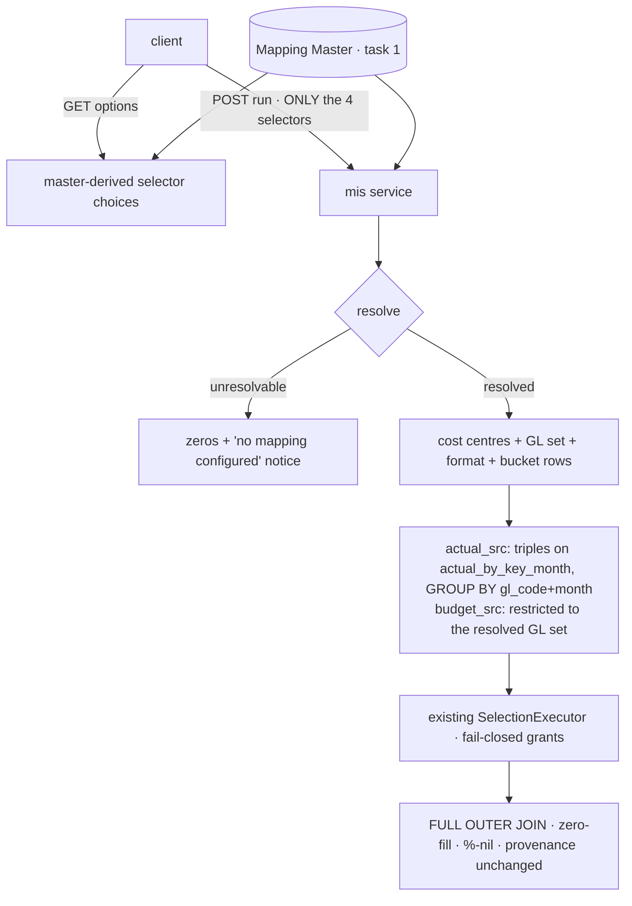

# Task plan — selection-resolution: master-driven resolution, governed narrowing, first governed-query routes

Story: mis-selection · Task 2 of 3 · user_facing: false

(The approved story plan's Task Decomposition has been reconciled to the recorded 3-task
split, so this task owns the routes — there is no separate `selection-endpoint` task.)

## Objective
Make a selection **resolve through the Mapping Master** and **narrow the single governed
query path** to it, exposed by the **first governed-query HTTP routes** — so a client can
never widen a report. This is the story's core: task 1 built the authority, task 3 renders
it; this task turns a selection into governed numbers.

## Standards
Decision **0019** (human-decided this grill) settles the shape: fresh routes follow the
**vendored house style** — unversioned `api/mis/...`, **raw typed bodies** (no
`{success,data,error}` envelope), and `mis` **may** import `mapping` directly, matching the
existing surface. What 0019 does **not** relax, and is still required: **named typed
request/response DTOs**, **documented Swagger responses including typed 400/401/403**,
cookie auth via the existing guards, **strict rejection of unknown request fields**, and
`constitution/07-exception-handling.md`'s failure model. New service files take a role
suffix (`selection-resolver.service.ts`) and an explicit interface per
`constitution/pnp-coding-standards-modular-monolith.md` naming rules.

## Acceptance criteria (plan_contracts)
- **t-sr-c1** — resolving `(department, function, plant, period)` returns cost centres, GL
  set, `mis_format` and bucket rows, or an **unresolvable** outcome; the "no mapping
  configured" notice is decided by master resolution and **never** by row count; period
  options are the loaded actual months plus a server-derived `fy26-27-ytd`.
- **t-sr-c2** — the governed path is **narrowed, never forked**: the Actual side filters
  resolved triples on `actual_by_key_month` and re-aggregates to `(gl_code, month)` before
  the join; the Budget side is restricted to the resolved GL set at its unchanged grain;
  the new object is in `objectsTouched`; a demonstrated warehouse test proves no fan-out.
- **t-sr-c3** — two authenticated routes: **options** (master-derived choices) and **run**
  (accepts **only** the four selectors — never triples, GLs, format ids or scope), with
  named DTOs and documented errors, registered in the module + route allow-list, reusing
  the existing fail-closed governed authorization.

## What already exists (grounding, file:line)
- **Task 1, merged (#25)** — `backend/src/mapping/mapping-master.ts` exports
  `MAPPING_MASTER`, `resolveMappingTriple(triple, master)`, `canonicalPlantFromMaster()`,
  `UNMAPPED_GL_LINE`, and the `MappingResolution` / `MappingSelection` / `MappingEntry`
  types. Selection records carry `department`, `function`, `plant_canonical`,
  `plant_aliases`, `mis_format`, `budget_gl_codes`; entries carry `cost_center`, `gl_code`,
  `mis_line`, `provisional`, `reason`. **Resolution must go through these** — the master
  stays the single authority.
- **Cost-centre grain** — `warehouse-schema.ts:117-134` `actual_by_key_month`
  `(plant, cost_center, gl_code, month, actual_net)` with the active-batch filter **baked
  into the view**; index `idx_sap_transaction_month_plant_cost_center_gl_code` (`:77-82`).
- **Pre-rolled grain** — `warehouse-schema.ts:136-150` `actual_by_gl_month`: `plant` is a
  constant literal and `cost_center` is gone (hence 0017).
- **Budget** — `warehouse-schema.ts:152-169` `budget_by_gl_month` has **no plant column**
  and admits **every** active budget GL.
- **Builder** — `sqlBuilder.ts:124-166` `composedCtes`; `scopePredicate` built `:60-66` and
  injected inside the CTEs (`:65`); `objectsTouched` `:117-121`; `sqlValidator.ts:43-49`
  rejects unlisted leaves. **A filter whose `dimensionId` is not a declared dimension is
  silently dropped** (`sqlBuilder.ts:70`), and there is no `cost_center` dimension by
  design (`semanticLayer.ts:65-68`). Pinned assertions live at
  `sqlBuilder.composed.test.ts:73` and `sqlValidator.composed.test.ts`.
- **Governed gate** — `selectionExecutor.ts:109-117` fail-closed on the `report` action +
  domain + every selected measure/dimension; grants seeded to `admin` (`migrate.ts:19-29`).
- **Routing reality** — `app.module.ts:11-16` imports only Core/Health/Ingest;
  `app.routes.test.ts:20-30` is a `deepEqual` **allow-list of 9 routes**; Reports/Chat
  controllers exist but are **unrouted**. Template: `reports.controller.ts` +
  `reports.service.ts:69-92`. Guards: `auth.guard.ts` `AuthGuard`, `RequireAction` (`:77-90`),
  `@CurrentUser()` (`:92-98`); CSRF global (`app.module.ts:14`).

## Design
### Resolution (C1)
`(department, function, plant, period)` → the master's selection record → cost centres, GL
set, `mis_format`, and the bucket rows. The `plant` argument may arrive as **any** master
alias (canonical `DUB`, SAP `DUB-NUR`, display `Agri - Nursery - DUB`) and resolves via
`canonicalPlantFromMaster` — never a local table.

**The response is a discriminated union** — a FULL OUTER JOIN over two empty sources
returns **no rows**, and `ResultTable` alone cannot distinguish that from an unresolvable
selection. So the contract carries an explicit *resolved* outcome (scope readout + result +
bucket) versus an *unresolvable* outcome (the "no mapping configured" notice + a zero
payload). Task 3 consumes exactly that union.

**Two zero states, decided by resolution — never by row count:**
- unresolvable → the unresolvable outcome: zeros + the notice;
- resolved but no transactions → the **resolved** outcome with zeros and **no** notice.

**Period.** Options are the **loaded** actual months (from the active ingest batches — July
2026 today) **plus one derived `fy26-27-ytd`**. The server resolves FY-YTD as
`2026-04-01 → the latest active loaded month`, **never `Date.now()`**. Both edges are
defined: with **no active actuals batch** there are no month options and `fy26-27-ytd` is
**not offered**; if the latest active month falls **outside FY 26-27** the window clamps to
the FY's own end, and if no active month falls inside FY 26-27 at all the option is **not
offered**.

### Governed narrowing (C2 — decision 0017: filter before the roll-up, one path)
```sql
actual_src AS (
  SELECT gl_code, month, SUM(actual_net)::numeric(18,2) AS actual_net
  FROM actual_by_key_month
  WHERE <existing scopePredicate>                    -- plant IN (validated scope)
    AND (plant, cost_center, gl_code) IN (<resolved triples>)
  GROUP BY gl_code, month
),
budget_src AS ( ... FROM budget_by_gl_month
  WHERE 'DUB' IN (<scope values>)                    -- unchanged derived-constant guard
    AND gl_code IN (<resolved GL set> UNION <bucketed budget GLs>) )   -- NEW
```
**Two Budget cases must not be conflated** (they were, in the first draft): a GL the master
covers but which is **not in this selection's** resolved set is *out of selection* and must
**not** appear; a GL present in the active budget batch but **absent from the master
entirely** is *unmapped* and **must** appear, attributed to the `unmapped-GL` line — that is
the settled decision, and dropping it is the exact truncation 0018 rejected. The gated proof
exercises **both** cases distinctly.

### The server-owned Selection
`SelectionExecutor.run` (`selectionExecutor.ts:49`) needs a full semantic `Selection` and
then **re-executes an ungrouped totals query** via `totalsFor` (`:160-182`). The immutable
server-owned selection is pinned here: domain `governed-financial`, the three governed
measures, dimensions `gl_code` + `month`, **no client filters**, and a `timeWindow` derived
from the resolved period. The resolved-scope carrier **must** propagate through
`run → executeResolved → totalsFor → SqlBuilder`: reaching only the grouped query would
narrow the rows while the **totals leak unfiltered** numbers for the whole plant. A required
test proves rows **and** totals carry the same triples and GL set.

### Authorization on every branch
`RequireAction("report")` checks only the action, but `executeResolved` (`:109-117`) is
fail-closed on the action **and** the domain **and** every selected measure **and** every
selected dimension. The options route and the unresolvable branch bypass the executor
entirely, so the **full semantic authorization** runs before any master metadata or
unresolvable result is returned, and each denial mode is tested to yield no query and no
result.
`actual_src` **absorbs** the `GROUP BY` that `actual_by_gl_month` performed, so the
reduction to one row per `(gl_code, month)` still happens **before** the FULL OUTER JOIN —
the no-fan-out invariant holds. Restricting `budget_src` fixes a **real defect** the story
grill found: otherwise every active DUB budget GL flows through and budget-only rows outside
the selection appear, breaking "exactly the DUB nursery slice". Budget is **not** re-grained
and cost centre is **never** part of the Budget key (0016).

`actual_by_key_month` **must** join `objectsTouched` or the validator rejects the query. The
resolved triples travel as a **distinct resolved-scope input** on the build path — they
cannot ride in `selection.filters` (silently dropped). An **unselected** composed query keeps
its existing behaviour: the narrowing is additive. Everything governed-joins established
still holds — the fail-closed gate, two-sided scope, zero-fill, the `%` CASE nil rule, and
in-query provenance.

### The first governed-query routes (C3)
A new `mis` module + controller + service on the `reports.controller` template, at
unversioned `api/mis/...` per decision 0019, registered in `app.module.ts` and in the
`app.routes.test.ts` allow-list (that test fails otherwise), guarded by `AuthGuard` +
`RequireAction("report")`, with named DTOs, documented Swagger 400/401/403, and **strict**
rejection of unknown request fields.

- **options** — master-derived Department / Function / Plant / period choices.
- **run** — accepts **only** `{department, function, plant, period}`. It never accepts
  triples, GL codes, format ids or scope; a client able to supply resolved scope could
  **widen** a report, and a test must prove the DTO rejects the attempt. The server resolves,
  authorizes, and invokes the **existing** `SelectionExecutor`.

## Workflow


## Manual Verification
1. `npm run test:hermetic` — resolution returns the scope for Agriculture/Nursery/DUB and
   the unresolvable outcome for an uncovered selection; the notice never depends on row
   count; `fy26-27-ytd` derives from the latest loaded month, not the clock; the builder
   emits the triple-filtered `actual_src` and the GL-restricted `budget_src`, lists
   `actual_by_key_month` in `objectsTouched` and still passes the validator; an unselected
   composed query is unchanged; the run DTO rejects triples/GLs/format/scope; both routes
   refuse an unauthorised caller; `app.routes.test.ts` lists exactly the new routes.
2. `docker compose up -d warehouse-db`; `npm --prefix backend run warehouse:migrate`.
3. **D-0008 host proof**: `WAREHOUSE_PG_* … npm --prefix backend run test:warehouse-proof` —
   `tests N / pass N / fail 0 / skipped 0`; the new slice leaf proves a cost-centre-filtered
   selection returns **one row per `(gl_code, month)` with no fan-out and exact values**, and
   that a budget GL outside the resolved set does **not** appear.
4. Dead-port negative control (`WAREHOUSE_PG_PORT=5599`) — the gated leaves FAIL
   (`ECONNREFUSED`).
5. The five pre-existing gated proofs still pass — the narrowing must not regress
   governed-joins.

## Decisions attested
0017 (filter before the roll-up, ONE governed path), 0018 (the bucket rows this resolution
returns), 0016 (Budget's cost_center is an informational label — hence the GL-only Budget
restriction and no cost-centre Budget key), 0014 (this story fulfils its deferral), 0004
(one governed definition; the LLM selects, never authors SQL), 0012 (its vendored deviation
does **not** excuse these fresh routes from DTOs/Swagger), 0009, 0015.

## Surface impact
- Backend: `mapping/selection-resolver.ts` (NEW), `sql/sqlBuilder.ts` (selection-aware Actual
  CTE, restricted Budget CTE, `objectsTouched`), `chat/selectionExecutor.ts` (thread the
  resolved scope), `mis/` module + controller + service + DTOs (NEW), `app.module.ts`.
- Contract: `contract/src/api.ts` — the options/run request and response types.
- Tests: `selection-resolver.test.ts`, `sqlBuilder.selection.test.ts`,
  `mis-selection.controller.test.ts` (NEW hermetic); `selection-slice.db.test.ts` (NEW
  gated); updated `sqlBuilder.composed.test.ts`, `sqlValidator.composed.test.ts`,
  `selectionExecutor.composed.test.ts`, `app.routes.test.ts`; `backend/package.json` +
  `tools/quality-gate.test.mjs`.
- **Unchanged by design**: the warehouse views and migrations (the master filters, it does
  not re-shape data); Budget's grain; the `%` CASE, zero-fill and provenance; the executor's
  authorization rules (reused, never widened); ingestion; the mapping master itself (task 1).

## Out of scope
The MIS Reports page and its rendering of the bucket (task 3); the hierarchical statement and
Excel export (`mis-statement`); drill-down; in-app authoring of the master; plants beyond DUB;
the balanced budget allocation (0014/0016, still deferred).

## Task Decomposition
This is task 2 of the mis-selection story's 3-task decomposition
(`.factory/stories/mis-selection/decomposition.json`): (1) mapping-master [done, #25],
(2) **selection-resolution** [this task], (3) selection-ui (`user_facing: true`). It is a
single bounded unit — resolution, the governed narrowing it drives, and the routes that
expose it are inseparable — and is not further subdivided; its three criteria are proven by
the three hermetic required_tests plus the gated D-0008 slice proof.
