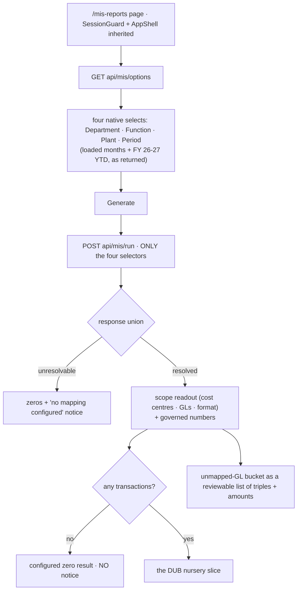

# Task plan — selection-ui: the authenticated MIS Reports page

Story: mis-selection · Task 3 of 3 (FINAL) · **user_facing: true**

## Objective
Make the selection real for a person: an authenticated **MIS Reports** page where a user
picks Department → Function → Plant → period, presses **Generate**, and sees the resolved
scope, the governed numbers, the correct zero state, and — visibly, not absorbed — the
**unmapped-GL bucket**. This is the artifact we put in front of Srihari to get the
authoritative mapping back.

It mostly **consumes** what tasks 1 and 2 shipped — but the grill found it also needs a
small, specific **backend** change (see *Grill-resolved* below): the seeded admin has no DUB
plant scope, and `MisSelectionBucketRow` carries no amount, so C3 is otherwise impossible.

## Mandatory for a user-facing task
`harness.yaml:113-116` — the recorder **refuses** a user-facing testing artifact unless
`skills_used` attests **both `emil-design-eng` and `frontend-design`**; both are installed
in the Codex runtime. A **functional check** is also required (owner
`codex:functional-checker`), recorded via `record_test_from_json.py --kind functional` — the
automated artifact alone does not satisfy this task.

## Acceptance criteria (plan_contracts)
- **t-ui-c1** — Department / Function / Plant / period as native selects populated from the
  options route, offering only the loaded actual months plus FY 26-27 YTD; **Generate** runs
  the selection through the run route, so Agriculture/Nursery/DUB returns exactly the DUB
  nursery slice.
- **t-ui-c2** — a resolved-scope readout naming the cost centres, GL codes and MIS format,
  and the **two zero states rendered distinctly**.
- **t-ui-c3** — the unmapped-GL bucket rendered as a **reviewable list** of its triples with
  amounts; the MIS Reports nav item and page title enabled in the shell.

## What already exists (grounding, file:line)
- **Task 2's contract, shipped** — `contract/src/api.ts:189-250`: `MisSelectionRunRequest`
  `{department, function, plant, period}`; `MisSelectionOptionsResponse` +
  `MisSelectionPeriodOption`; and the **discriminated union**
  `MisSelectionResolvedResponse | MisSelectionUnresolvableResponse` carrying
  `MisSelectionScopeReadout`, `MisSelectionBucketRow[]`, `MisSelectionTotals`.
- **Routes** — `backend/src/mis/mis-selection.controller.ts:28,33,55`:
  `GET api/mis/options`, `POST api/mis/run`, unversioned with raw typed bodies per
  decision **0019**.
- **API client** — `frontend/src/lib/api.ts` exposes **only 5 auth methods**; its
  cookie-credentialed fetch, CSRF bootstrap and one-shot 401 refresh live at `:18-37`, and
  it throws `ApiError`. These become the first **data** methods.
- **Shell** — `app/(app)/layout.tsx:7-9` gives `SessionGuard` + `AppShell` free to any page
  at `app/(app)/<route>/page.tsx`. `components/shell/app-shell.tsx:12-18` hard-codes
  `navItems`, rendering **"MIS Reports" as a disabled ``**
  (`:110-115`), with the page title hard-coded at `:156`. `app-shell.test.tsx` and
  `nav-drawer.test.tsx` assert against that table.
- **Components/tokens** — only `components/ui/button.tsx` is reusable; there is **no**
  Select/Input/Table primitive. Tokens are CSS variables in `src/theme/*.css`
  (`--kl-emerald`, `--kl-line`, `--surface-card`, `--space-*`, `--radius-*`), guarded by
  `src/theme/tokens.test.ts`; layout classes live in `app/globals.css`.
- **Design prototype** — `docs/design/3F-Financial-MIS/3F Financial MIS.dc.html`: filter bar
  `:79-122` (four native selects, 34px, `--kl-line`, `--radius-sm`, then Generate); empty
  state `:126-140` ("Select Department, Function and Plant, then Generate"); provenance
  popover `:545` rendering scope in mono.
- **Frontend tests** — **vitest**, not `node --test`:
  `npm exec --no -- vitest run --config frontend/vitest.config.ts`.

## Design
### The page
`frontend/app/(app)/mis-reports/page.tsx` inherits `SessionGuard` + `AppShell` — no auth is
re-implemented. The feature lives in `src/features/mis/`.

### Branch on the union, never on emptiness
The two zero states are distinguished **by the response shape**:
- **unresolvable** → zeros **plus** the "no mapping configured" notice;
- **resolved with no transactions** → a configured zero result with **no** notice.

Conflating them is the exact defect this story exists to avoid, so both are tested.

### UI shape — no design system
Styled **native `<select>`** controls local to the MIS feature plus the existing `Button`.
**No** shared Select/Input/Table primitives: that serves no acceptance criterion and creates
a component API for one page (settled on the story plan grill). Styling uses the existing
CSS-variable tokens and `globals.css` classes — **no token is added or renamed**, since
`tokens.test.ts` guards the set.

### Period
Render **only what the options route returns** — the loaded actual months plus the derived
`fy26-27-ytd`. No client-side month computation, and not the prototype's June/May, which
have no Actual data; task 2 derives FY-YTD server-side from the latest active loaded month.

### The bucket (C3, decision 0018 as amended)
`MisSelectionBucketRow[]` renders as a **reviewable list**, so the mapping gap is **visible
rather than absorbed into a total**. The type carries no amount today, so this task extends
it and the service populates it. **Each row shows both its Actual and its Budget amount**
for the selected period (human-decided this grill), with `costCentre` **null** for
Budget-only rows — they are GL-only, not triples — so the gap is legible on each side and
reconcilable against the slice totals.

Decision **0018 has been amended**: it previously assigned *all* visible bucket rendering to
`mis-statement`. The settled split is now explicit — **mis-selection renders the reviewable
list** (the artifact for Srihari), **mis-statement renders the bucket line inside the
statement**. Both are required; they are different surfaces.

## Grill-resolved (four blockers)
- **The happy path was unusable as seeded.** The admin has the `report` action but **no DUB
  plant scope** (`migrate.ts:37`), so `plantScope(user)` is empty, options return nothing and
  a DUB run is refused. This task seeds it and asserts it in `migrate.test.ts`.
- **C3 needed a contract change** — see the bucket section above.
- **Decision 0018 reconciled** — see above.
- **The live no-mapping walkthrough is unreachable.** The master has exactly one selection
  (Agriculture/Nursery/DUB) and the options route derives its controls *from* master
  selections, so the UI cannot offer a non-matching combination. The **functional check
  therefore covers the resolved path end-to-end**, and the **unresolvable branch is proven by
  the component test** against a mocked response. We do not claim a walkthrough that cannot
  be performed.

### Shell
Enable the MIS Reports nav item to link to the new route and make the title reflect the
active page; `app-shell.test.tsx` moves with the nav table. `nav-drawer.test.tsx` stays
**untouched** — it tests the drawer's toggle/Escape/focus behaviour, not the nav table.

## Workflow

## Manual Verification
1. `npm run test:hermetic` (includes `npm run test:frontend`) — the **four** required vitest
   leaves pass: selects populated from options with only loaded months + FY-YTD and Generate
   posting exactly four selectors; the scope readout plus **both** zero states rendered
   distinctly; the bucket rendered as a reviewable list with Actual and Budget amounts; and
   the resolved response's **result rows and totals actually rendered** (so the page cannot
   pass while showing nothing).
   `npm run build:frontend` — this adds a Next.js route, so the frontend must build.
2. `npm run typecheck && npm run lint && npm run format:check` — and `tokens.test.ts` still
   passes, proving no token was added or renamed.
3. **Functional check (mandatory, user_facing)**: with the backend running and the warehouse
   seeded, sign in, open **MIS Reports** from the nav, select Agriculture / Nursery / DUB /
   Jul 2026, press Generate, and confirm the DUB nursery slice, the scope readout, and the
   bucket list with both amounts. The **unresolvable** state is NOT walked through live — the
   single-selection master makes it unreachable from the UI — and is proven by the component
   test instead.
4. The six existing gated warehouse proofs still pass — this task adds no query path.

## Decisions attested
0019 (vendored house style: the unversioned `api/mis` routes and raw bodies this page
consumes), 0018 (the bucket must stay visible), 0017 (the governed narrowing behind the
numbers), 0007 (Next.js), 0010 (3F branding), 0005/0011, 0009, 0012 (the vendored client
conventions this page reuses).

## Surface impact
- Frontend: `app/(app)/mis-reports/page.tsx` (NEW), `src/features/mis/` view + hook (NEW),
  `src/lib/api.ts` (first data methods), `src/components/shell/app-shell.tsx` (enable the
  nav item + title), `app/globals.css` (page classes).
- Backend: `contract/src/api.ts` (`MisSelectionBucketRow` gains Actual + Budget amounts),
  `backend/src/mis/mis-selection.service.ts` (populate them), `backend/src/db/migrate.ts`
  (seed the admin's DUB plant scope).
- Tests: `src/features/mis/mis-report-view.test.tsx` (NEW), `src/lib/api.test.ts` (the new
  data methods' CSRF/credential/refresh), `app-shell.test.tsx` (nav table),
  `backend/src/mis/mis-selection.controller.test.ts`, `backend/src/db/migrate.test.ts`.
- **Unchanged by design**: the resolution, the governed narrowing and the routes
  (tasks 1-2), the theme tokens (`tokens.test.ts` guards them), the six gated warehouse
  proofs, `SessionGuard`/`AppShell` auth, and `nav-drawer.test.tsx` — it tests the drawer's
  toggle/Escape/focus behaviour, **not** the nav table, so it stays untouched.

## Out of scope
The hierarchical statement and **Excel export** — the prototype's "Download Excel" button
belongs to `mis-statement`; actuals drill-down (`drill-down`); the prototype's Admin
mapping-master screen (in-app authoring is not in this PoC); shared design-system
primitives; any backend or query change.

## Task Decomposition
This is task 3 (FINAL) of the mis-selection story's 3-task decomposition
(`.factory/stories/mis-selection/decomposition.json`): (1) mapping-master [#25],
(2) selection-resolution [#26], (3) **selection-ui** [this task]. It is a single bounded
unit — one page consuming already-shipped routes — and is not further subdivided; its three
criteria are proven by the three vitest required_tests plus the mandatory functional check.
Shipping it completes the story.
