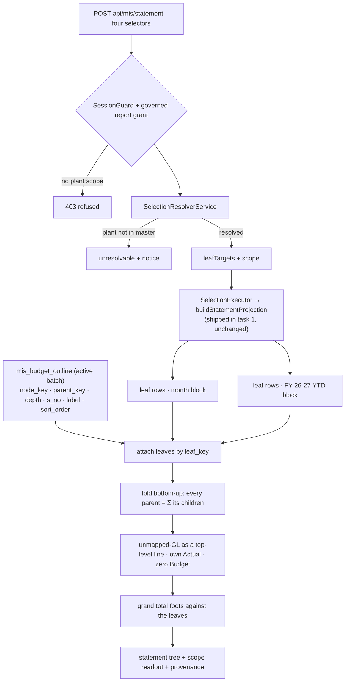

# Task plan — statement-api: the governed statement route

Story: mis-statement · Task 2 of 4 · **user_facing: false**

## Objective
Turn the leaf/month rows `statement-model` produces into the **Financial MIS statement**:
a tree built from the budget batch's outline, parents derived bottom-up, the grand total
footing, both period blocks present, and the two outcomes kept distinct — served at
`POST api/mis/statement`.

No UI and no export: those are tasks 3 and 4.

## Acceptance criteria (plan_contracts)
- **t-sa-c1** — the route returns the outline as a **tree**: every parent a subtotal
  **derived** from its leaves, the grand total footing, rows in the outline's
  `sort_order`, each row carrying `S. No.`, Budget Component and (for leaves) the GL code.
- **t-sa-c2** — each row carries **Budget · Roll-over · Actual · %** for **both** the
  selected month and **FY 26-27 YTD**, Roll-over present but unpopulated, exact paise
  rounded only at the presentation boundary, and the `%` label kept verbatim.
- **t-sa-c3** — the outcome split holds (unauthorized plant refused; uncovered plant
  **unresolvable**; resolved-but-empty a configured zero **without** the notice), and the
  **`unmapped-GL`** line is present with its own Actual, zero Budget, counted in the
  grand total.

## What already exists (grounding, file:line)
- **The projection, shipped in task 1** — `sqlBuilder.ts:48` dispatches to
  `buildStatementProjection` whenever `resolvedScope.leafTargets` is present, so the route
  reaches it through the **normal governed execution path**; no new SQL is written here.
  It returns flat rows: `leaf_key, month, actual_net, budget_net, rollover_net,
  source_presence, sort_order`, already ordered by the outline's `sort_order`.
- **The outline table** — `warehouse-schema.ts` `mis_budget_outline`: `node_key,
  parent_key, depth, s_no, label, sort_order, gl_code, leaf_key`, per batch, **carrying no
  amount**. Only the **insert** path exists (`ingestion.repository.ts:84`) — **nothing
  reads the tree back**, so this task adds that reader.
- **`leafTargets`** — `selection-resolver.interface.ts:21` and `sqlBuilder.ts:15`: the
  resolver already emits the `(plant, costCentre, glCode) → tagged target` mapping the
  projection needs.
- **The route precedent** — `mis-selection.controller.ts` + `mis-selection.dto.ts`:
  unversioned `api/mis` path, raw typed body, `misSelectionRunRequestSchema` validating
  the same four selectors, DTOs with `@ApiProperty`, guarded by the governed `report`
  grant. Decision **0019** says follow it.
- **The outcome union** — `contract/src/api.ts` `MisSelectionResolvedResponse |
  MisSelectionUnresolvableResponse`, and the service split `mis-selection` had to make
  mid-review: **coverage is not authorization**.

## Design
### The tree is assembled, never queried
The projection returns **leaves**. The outline supplies the **structure**. The service
reads the active budget batch's outline nodes, attaches each projection row to its leaf by
`leaf_key`, then folds **bottom-up**: every parent's Budget and Actual are the sum of its
children, to arbitrary depth. Nothing reads a parent amount — decision **0020** stores
none and the snapshot carries no money at all, so a parent value that came from anywhere
but its own leaves is by construction a bug.

The reader must honour the **same active-batch rule** the projection uses
(`source_kind = 'budget' AND is_active`), or the tree and the numbers describe different
batches — a failure that would look like a footing error and be diagnosed as one.

### Two period blocks
The spec requires the **selected month** and **FY 26-27 YTD** side by side. Both come from
the same projection over different month ranges; the FY-YTD range is the one the options
route already derives. `%` is the governed measure's, labels intact.

### Exact paise
Aggregate in paise as integers and round **once**, at the presentation boundary. Rounding
each line first is precisely what makes a subtotal disagree with its children.

### The unmapped-GL line
Decision **0018**'s reserved bucket has no workbook leaf (it is a *tagged* target, not a
leaf key), so it is rendered as a **distinct top-level line** carrying its own Actual and
zero Budget, and it **is** counted in the grand total — the slice must still reconcile to
the full DUB total.

## Workflow

## Manual Verification
1. `npm run build:contract && npm run build:backend && npm run typecheck && npm run lint
   && npm run format:check && npm run test:hermetic` — the four required leaves pass.
   Check the junit report's **testcase name** is the leaf, not the file path: `junit-run`
   false-passes a nonexistent `--name` (D-0024), so an exit code proves nothing.
2. **Against the live warehouse**, call the route for Agriculture / Nursery / DUB /
   2026-07-01 and confirm: the tree mirrors the workbook outline at its natural depth,
   every parent equals the sum of its children, the grand total is **₹1,15,12,712.07**
   Actual and **₹1,00,50,136.29** Budget, both period blocks are present with Roll-over
   empty, and the `unmapped-GL` line carries its own Actual.
3. The seven gated warehouse proofs still pass **unchanged** — this task adds no SQL.

## Decisions attested
**0022** (the statement reads its own projection — consumed here, unchanged), **0021**
(the outline snapshot this tree is built from), **0020** (parents derived, never stored),
**0018** (the `unmapped-GL` line stays visible and counted), **0019** (the route's house
style), **0017** (the governed narrowing behind the numbers), **0016** (all-or-nothing
governed access, scope injection, provenance), **0023** (drift reports, never blocks),
**0009** (required tests name a real leaf), **0012/0015**, **0002/0003**.

## Surface impact
- **Backend**: a `statement-outline` repository read (NEW) with its `.interface.ts`; the
  statement service assembling the tree (NEW); `mis-statement.controller.ts` +
  `mis-statement.dto.ts` (NEW); module registration.
- **Contract**: the statement tree/row types in `contract/src/api.ts` (NEW).
- **Unchanged by design**: `buildStatementProjection` and all SQL (task 1), the
  `(gl_code, month)` relation, the selection/options routes, the seven gated proofs, the
  warehouse schema, every frontend file.

## Out of scope
The on-screen statement (task 3), the Excel export (task 4), the roll-over calculation,
Table-1 and Table-3, any schema or SQL change.

## Task Decomposition
Task 2 of the mis-statement story's 4-task decomposition: (1) statement-model [shipped,
PR #30], (2) **statement-api** [this task], (3) statement-view, (4) statement-export. One
bounded unit — a route and the tree assembly it exists to serve — proven by four hermetic
required tests plus the live reconciliation in Manual Verification.
