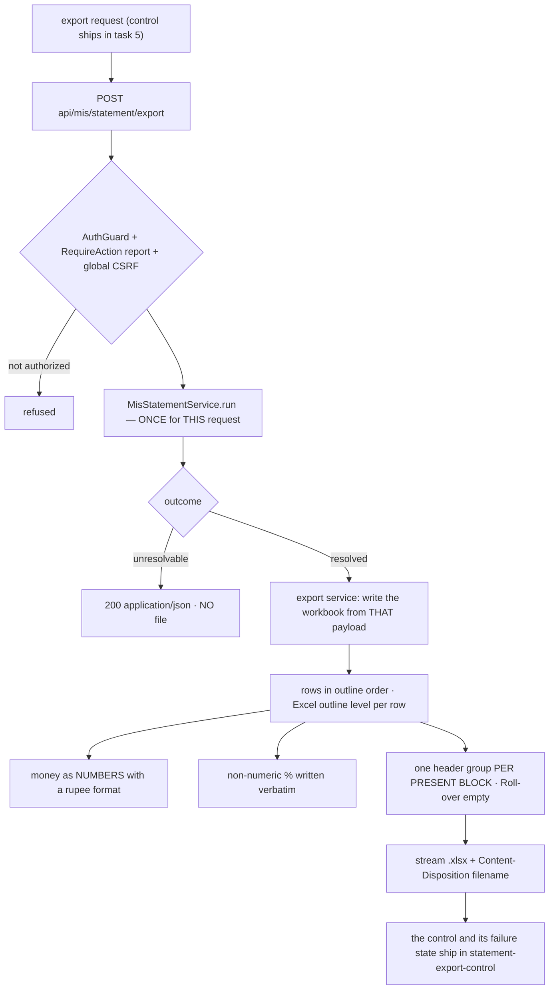

# Task plan — statement-export-api: the Excel export route and workbook writer

Story: mis-statement · Task 4 of 5 · **user_facing: false**

## Objective
Let Srihari take the statement away. `POST api/mis/statement/export` streams an `exceljs`
workbook written from the payload the statement service assembles **for that request**.

**Backend only.** The Download Excel control is `statement-export-control` — `WORKFLOW.md`
is explicit that backend and frontend never share a task, and the first draft of this
contract broke that rule.

This is the **first download route in the app**, so it sets the pattern drill-down's
transactions sheet will follow.

## Acceptance criteria (plan_contracts)
- **t-sea-c1** — same selectors, same protections as the statement route: **`AuthGuard` +
  `RequireAction("report")`** under the **global CSRF guard**, documented in Swagger (xlsx
  content type, `Content-Disposition`, the JSON unresolvable outcome, the CSRF header,
  decision 0019's typed 400/401/403), added **once** to the strict allow-list, and
  `Content-Disposition` added to the **CORS `exposedHeaders`** in `main.ts` — without which
  the browser cannot read the filename at all.
- **t-sea-c2** — calls `MisStatementService.run` **once** and branches on its outcome
  **before setting any header**: resolved → stream
  `financial-mis-<department>-<function>-<plant>-<active-from>-to-<active-to>.xlsx` from
  lowercase ASCII slugs of the **resolved scope**; unresolvable → ordinary
  `200 application/json`, **no file headers, no xlsx body**; unauthorized → refused.
- **t-sea-c3** — written from that single payload, on worksheet **`Financial MIS`**: row 1
  merged identity and per-block groups, row 2 column labels, data from **row 3 in
  preorder** with root **outline level 1**, a final row merging the three identity cells as
  **Grand Total**. The test **reopens the generated bytes** and asserts cell by cell.
- **t-sea-c4** — amounts are **numbers rounded to the rupee** (the human's ruling — the
  sheet matches the screen line for line) with a rupee format; a numeric `%` is a number
  with a percentage format, a label is **literal text verbatim**, `null` is literal **NA**;
  **one header group per present block**.
- **t-sea-c5** — every text cell originating in an uploaded workbook is **neutralised
  against formula injection**: a value beginning `=`, `+`, `-` or `@` must not reopen as a
  formula.

## What already exists (grounding, file:line)
- **The payload** — `contract/src/api.ts:270-300`: `MisStatementNode` (`nodeKey, sNo,
  budgetComponent, glCode, measures[], children[]`), `MisStatementMeasureBlock`
  (`key, label, from, to, budget, rollover: null, actual, percentage, sourcePresence`),
  `tree`, `grandTotal`, `provenance`. **Every subtotal is already derived** — the export
  writes, it does not compute.
- **The statement service** — `backend/src/mis/mis-statement.service.ts` assembles that
  tree today and returns it as JSON. The export must consume **that same assembly**, which
  is the whole point of splitting this task from task 2.
- **`exceljs@^4.4.0`** is already a backend dependency (`backend/package.json`) — used for
  *parsing* the client workbooks, and it writes too. **No new dependency.**
- **No download route exists** — there is no `Content-Disposition` or `StreamableFile`
  anywhere in `backend/src`. This is the first.
- **The route allow-list** — `backend/src/app.routes.test.ts` is strict and names every
  sanctioned route; a new one fails hermetic verification until it is listed (the lesson
  `statement-api` paid for).
- **The prototype's control** — `docs/design/…dc.html:117`: *Download Excel* as a
  **secondary** button — white ground, emerald border and text, 34px, 6px radius — beside
  the primary Generate.
- **The view** — `frontend/src/features/mis/statement-view.tsx` renders the statement
  inline; the control belongs beside it, and `constitution/07-exception-handling.md`'s
  one-clear-state rule already bit this view once.

## Design
### Rounding: the sheet matches the screen
**Human-decided this grill.** Amounts are written **rounded to the rupee** — the same
₹1,00,50,136 the statement shows — so Srihari can lay the sheet beside the screen and every
figure agrees. The cost is accepted and named: because each line is rounded before summing,
a column total can differ by a rupee or two from the paise-exact source. Exact paise, and a
second paise column, were both considered and rejected — one makes the sheet disagree with
the screen on nearly every line, the other widens a statement the spec wants clean.

They are still **numbers**, not pre-formatted strings: a recipient who cannot sum a column
has been handed a picture of a statement.

### Formula injection
The sheet's text — `S. No.`, Budget Component, GL — originates in a **client-supplied
workbook**, and the export is the artifact sent to other people. A value beginning `=`,
`+`, `-` or `@` must not reopen as a formula. This is the security lens's main object here.

### The drift guarantee is PER REQUEST
The defect this task exists to prevent is **drift**: a sheet that disagrees with the
screen. The first draft claimed "one assembly feeds both the JSON response and the
workbook" — **impossible**, because `/statement` and `/statement/export` are separate HTTP
requests with no shared object between them.

The guarantee that *is* achievable, and the one this task makes: **each endpoint invokes
`MisStatementService.run` exactly once per authorized request, and the export writer
receives that resolved payload** — it does not re-read the projection, re-walk the
outline, or re-derive a subtotal. Identical inputs therefore produce identical numbers,
and the cell-by-cell test holds that line.

### The sheet is a statement, not a picture of one
Hierarchy survives as Excel **outline level** per row plus the workbook's own order, so
the structure is navigable rather than implied by leading spaces. Both blocks sit under
their spec labels. A non-numeric `%` — `over-budget`, `credit / negative actual` — is
written **verbatim**, not coerced.

### The route, and the JSON/XLSX boundary
`POST api/mis/statement/export`, same body, decision **0019** house style, protected by
`AuthGuard` + `RequireAction("report")` under the global CSRF guard.

A **resolved** request streams the workbook with a sanitized filename. An **unresolvable**
one keeps its `200 application/json` outcome and produces **no file** — a naive blob client
would otherwise save that JSON body as an `.xlsx` and hand Srihari a corrupt download. The
unresolvable outcome stays unresolvable: a download must not become a way around the
access contract, nor turn coverage into a 403.

### Blocks are dynamic
The payload carries **one or two** blocks — a selected FY-YTD period yields a single one —
so the sheet writes **one header group per present block**. A sheet that always writes two
contradicts the settled rule.

## Workflow

## Manual Verification
1. `npm run build:contract && npm run build:backend && npm run typecheck && npm run lint
   && npm run format:check && npm run test:hermetic && npm run test:frontend &&
   npm run build:frontend` — the four required leaves pass. Check each leaf's **executed
   count / testcase name**, not the exit code: `junit-run` false-passes a nonexistent
   `--name` (D-0024) and vitest exits 0 when `-t` matches nothing (D-0031).
2. The seven gated warehouse proofs still pass **unchanged** — this task adds no SQL.
3. **Open a really-generated workbook** (this task has no UI, so this is a host check,
   not the story's functional check): call the route for Agriculture / Nursery / DUB /
   Jul 2026 against the live stack, save the bytes, open them with `exceljs`, and confirm
   the hierarchy and outline order match the statement payload, the grand total reads
   **₹1,00,50,136** Budget against **₹1,15,12,712** Actual, amounts are **numeric** (a
   summed column agrees), Roll-over is empty, and the `unmapped-GL` line is present.

## Decisions attested
**0019** (the route's house style), **0016** (the grant and scope the download inherits),
**0018** (the `unmapped-GL` line travels into the sheet), **0020/0021/0022** (the derived
parents, outline and projection behind the numbers), **0023**, **0007/0010**,
**0009/0024/0031** (a required leaf must really execute), **0002/0003**, **0012/0015**.

## Surface impact
- **Backend**: `mis-statement-export.service.ts` + `.interface.ts` (NEW), the export route
  and its typed Swagger on `mis-statement.controller.ts` and `mis-statement.dto.ts`,
  `main.ts` for the CORS `exposedHeaders`, the route allow-list entry, and the test
  registration in `backend/package.json` + `tools/quality-gate.test.mjs`.
- **`mis-statement.service.ts` is NOT touched**: it already returns the assembled response,
  so the export route simply calls it once. The first draft promised a refactor that is
  both out of scope and unnecessary.
- **`contract/src/api.ts` is NOT touched**: the request schema and the JSON unresolvable
  DTO already exist, and the workbook is bytes, not a typed response.
- **Unchanged by design**: the statement's SQL and projection, the warehouse schema, the
  gated proofs, the selection routes, and **every frontend file** — the control is task 5.

## Out of scope
A transactions/line-items sheet (that ships with **drill-down**), the roll-over
calculation, Table-1 and Table-3, any pixel replica of the legacy 95-column workbook —
the spec asks for a **clean, correctly-structured** export, not a facsimile.

## Task Decomposition
Task 4 of the mis-statement story's **five**: (1) statement-model [#30], (2) statement-api
[#32], (3) statement-view [#34], (4) **statement-export-api** [this task],
(5) statement-export-control. The story grew from four tasks to five because this
contract originally held both the workbook writer and its download control, which
`WORKFLOW.md` forbids — backend and frontend never share a task. Proven by three backend
leaves plus a host check that opens a really-generated workbook.

<!-- forge:contract -->
## Contract (recorded)

Rendered by the harness from the recorded decomposition; edit the decomposition, not this block. It is excluded from the plan's approval and grill digests, so a re-render never stales either.

**Objective.** Serve the statement as a downloadable workbook: POST api/mis/statement/export writes an exceljs sheet from the payload the statement service assembles for THAT request, streamed with a Content-Disposition filename. Backend only - the download control is statement-export-control.

**Acceptance criteria**

- POST api/mis/statement/export takes the same four selectors and the same protections as the statement route - AuthGuard plus RequireAction('report') under the global CSRF guard - documented in Swagger with the xlsx content type, the Content-Disposition header, the JSON unresolvable outcome, the required CSRF header and decision 0019's typed 400/401/403 responses, added once to the strict route allow-list, and with Content-Disposition added to the CORS exposedHeaders in main.ts, without which the browser cannot read the filename at all.
- The route calls MisStatementService.run ONCE and branches on its outcome BEFORE setting any header: a resolved request streams the xlsx named financial-mis-<department>-<function>-<plant>-<active-from>-to-<active-to>.xlsx from lowercase ASCII slugs of the RESOLVED scope rather than raw input, where the active block is 'selected' or the only block; an unresolvable request returns ordinary 200 application/json with NO file headers and NO xlsx body; an unauthorized plant is refused.
- The workbook is written from the payload that single run() returned - the writer never re-queries the projection, re-walks the outline or re-derives a subtotal - on worksheet 'Financial MIS': row 1 merged identity and per-block header groups, row 2 column labels, data from row 3 in preorder with root outline level 1, and a final row merging the three identity cells as Grand Total. A test reopens the generated bytes and asserts them cell by cell against the payload, including derived parent subtotals, the grand total, the unmapped-GL line and the empty Roll-over column.
- Amounts are written as NUMBERS ROUNDED TO THE RUPEE - the same values the screen shows, so the sheet and the statement agree line for line - with a rupee number format; a numeric percentage is a number with a percentage format, a non-numeric percentage is literal text kept verbatim, and a null percentage is the literal NA. One header group is written per PRESENT block, one or two, matching the payload.
- Every text cell whose value originates in an uploaded workbook - S. No., Budget Component, GL code - is neutralised against spreadsheet formula injection: a value beginning =, +, - or @ must not reopen as a formula. This matters because the statement's text comes from a client-supplied file and the export is the artifact sent to other people.

**Write scope** (what `stage done` measures the diff against)

- backend/src/mis/mis-statement-export.service.ts
- backend/src/mis/mis-statement-export.interface.ts
- backend/src/mis/mis-statement-export.test.ts
- backend/src/mis/mis-statement.controller.ts
- backend/src/mis/mis-statement.dto.ts
- backend/src/mis/mis.module.ts
- backend/src/main.ts
- backend/src/app.routes.test.ts
- backend/package.json
- tools/quality-gate.test.mjs

**Scope amendments** (measured paths the scope did not name, recorded with `forge stage amend-scope`)

- backend/src/mis/mis-statement.controller.test.ts -- backend/src/mis/mis-statement.controller.test.ts was authorized mid-stage as signal S-0007-c166: making MisStatementExportService a REQUIRED constructor dependency - the blocking fix both the performance and security lenses raised on the same line - breaks that test's construction with TS2554 until it supplies an exporter stub. Only the constructor call changed; no assertion moved, because those assertions are statement-api's shipped evidence for the statement route and must still hold.

**Required tests** (run by `stage done`)

- `the export route calls the statement service once and branches before setting headers so a resolved request streams an xlsx with the canonical slug filename while an unresolvable request returns plain json with no file headers` -- `TS_NODE_PROJECT=backend/tsconfig.json TS_NODE_TRANSPILE_ONLY=1 node tools/junit-run.mjs --file {path} --name {id} --report {report} --require ts-node/register` (backend/src/mis/mis-statement-export.test.ts)
- `the reopened workbook equals the statement payload cell by cell on the financial mis worksheet including derived parent subtotals the grand total row the unmapped GL line and the empty rollover column` -- `TS_NODE_PROJECT=backend/tsconfig.json TS_NODE_TRANSPILE_ONLY=1 node tools/junit-run.mjs --file {path} --name {id} --report {report} --require ts-node/register` (backend/src/mis/mis-statement-export.test.ts)
- `amounts are numbers rounded to the rupee with a rupee format a numeric percentage is a number with a percentage format a label is literal text and a null percentage is NA with one header group per present block` -- `TS_NODE_PROJECT=backend/tsconfig.json TS_NODE_TRANSPILE_ONLY=1 node tools/junit-run.mjs --file {path} --name {id} --report {report} --require ts-node/register` (backend/src/mis/mis-statement-export.test.ts)
- `a text cell whose value begins with an equals plus minus or at sign is neutralised so it does not reopen as a formula` -- `TS_NODE_PROJECT=backend/tsconfig.json TS_NODE_TRANSPILE_ONLY=1 node tools/junit-run.mjs --file {path} --name {id} --report {report} --require ts-node/register` (backend/src/mis/mis-statement-export.test.ts)

**Verify commands**

- `npm run build:contract`
- `npm run build:backend`
- `npm run typecheck`
- `npm run lint`
- `npm run format:check`
- `npm run test:hermetic`

**Review budget.** 10 files / 1500 lines -- The workbook writer and its route with typed Swagger documentation, the CORS exposedHeaders entry without which the filename is unreadable, the allow-list entry, and the test registration. The substance is the writer, the reopened-workbook equality proof and formula-injection neutralisation. No schema change, no SQL change, no frontend file - the control is statement-export-control.
<!-- /forge:contract -->
