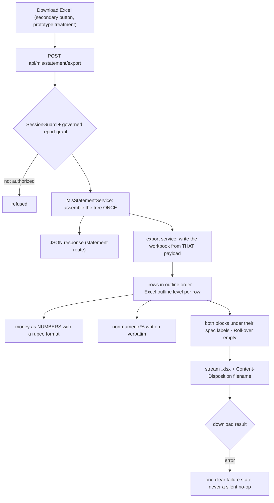

# Task plan — statement-export: the Excel download

Story: mis-statement · Task 4 of 4 (FINAL) · **user_facing: true**

## Objective
Let Srihari take the statement away. `POST api/mis/statement/export` streams an `exceljs`
workbook built from the **same payload the screen renders**, and the statement view gains
a **Download Excel** control. Shipping it completes the story.

This is the **first download route in the app**, so it sets the pattern drill-down's
transactions sheet will follow.

## Acceptance criteria (plan_contracts)
- **t-se-c1** — the route streams an `.xlsx` with a `Content-Disposition` filename naming
  the selection and period, behind the **same** guard and governed `report` grant as the
  statement route, preserving the outcome split (unauthorized → refused; uncovered plant →
  **unresolvable**, never 403).
- **t-se-c2** — the workbook is written from the **same assembled payload** as the JSON
  response, proven **cell by cell**: rows, identity columns, amounts, the derived parent
  subtotals, the grand total, the `unmapped-GL` line and the empty Roll-over column.
- **t-se-c3** — the sheet carries **structure, not a flat dump**: outline order and depth
  (an indent/level per row), both blocks under their spec labels, money as **numbers with
  a rupee format** — not pre-formatted strings — and a non-numeric `%` written **verbatim**.
- **t-se-c4** — a **Download Excel** control beside the statement, in the prototype's
  secondary-button treatment, surfacing failure legibly and never leaving the page pending.

## Mandatory for a user-facing task
`harness.yaml` — the recorder **refuses** a user-facing testing artifact unless
`skills_used` attests both `emil-design-eng` and `frontend-design`, and a **functional
check** is required.

## What already exists (grounding, file:line)
- **The payload** — `contract/src/api.ts:270-300`: `MisStatementNode` (`nodeKey, sNo,
  budgetComponent, glCode, measures[], children[]`), `MisStatementMeasureBlock`
  (`key, label, from, to, budget, rollover: null, actual, percentage, sourcePresence`),
  `tree`, `grandTotal`, `provenance`. **Every subtotal is already derived** — the export
  writes, it does not compute.
- **The statement service** — `backend/src/mis/mis-statement.service.ts` assembles that
  tree today and returns it as JSON. The export must consume **that same assembly**, which
  is the whole point of splitting this task from task 2.
- **`exceljs@^4.4.0`** is already a backend dependency (`backend/package.json`) — used for
  *parsing* the client workbooks, and it writes too. **No new dependency.**
- **No download route exists** — there is no `Content-Disposition` or `StreamableFile`
  anywhere in `backend/src`. This is the first.
- **The route allow-list** — `backend/src/app.routes.test.ts` is strict and names every
  sanctioned route; a new one fails hermetic verification until it is listed (the lesson
  `statement-api` paid for).
- **The prototype's control** — `docs/design/…dc.html:117`: *Download Excel* as a
  **secondary** button — white ground, emerald border and text, 34px, 6px radius — beside
  the primary Generate.
- **The view** — `frontend/src/features/mis/statement-view.tsx` renders the statement
  inline; the control belongs beside it, and `constitution/07-exception-handling.md`'s
  one-clear-state rule already bit this view once.

## Design
### One assembly, two renderings
The defect this task exists to prevent is **drift**: a sheet that disagrees with the
screen. So the statement service assembles the tree **once**, and both the JSON response
and the workbook are written from that one object. The export service takes a payload; it
does **not** re-read the projection, re-walk the outline, or re-derive a subtotal. The
cell-by-cell test is what holds that line.

### The sheet is a statement, not a picture of one
Money is written as **numbers** with a rupee number format, so the recipient can sum,
filter and pivot. Writing display strings would hand Srihari an image of his own
statement — the thing he already has. `FixedScaleMoney` is an exact decimal string:
convert it directly, never via the display-rounded value the screen shows.

Hierarchy survives as Excel **outline level** per row plus the workbook's own order, so
the structure is navigable rather than implied by leading spaces. Both blocks sit under
their spec labels. A non-numeric `%` — `over-budget`, `credit / negative actual` — is
written **verbatim**, not coerced.

### The route
`POST api/mis/statement/export`, same body as the statement route, decision **0019** house
style, same guard and governed grant, streamed with a `Content-Disposition` filename
naming the selection and period. The **unresolvable** outcome stays unresolvable — a
download must not become a way around the access contract, nor turn coverage into a 403.

## Workflow

## Manual Verification
1. `npm run build:contract && npm run build:backend && npm run typecheck && npm run lint
   && npm run format:check && npm run test:hermetic && npm run test:frontend &&
   npm run build:frontend` — the four required leaves pass. Check each leaf's **executed
   count / testcase name**, not the exit code: `junit-run` false-passes a nonexistent
   `--name` (D-0024) and vitest exits 0 when `-t` matches nothing (D-0031).
2. The seven gated warehouse proofs still pass **unchanged** — this task adds no SQL.
3. **Functional check (mandatory, user_facing)**: with the stack up and the July batch
   ingested, sign in, generate Agriculture / Nursery / DUB / Jul 2026, press **Download
   Excel**, then **open the downloaded file** and confirm: the hierarchy and outline order
   match the screen, the grand total reads **₹1,00,50,136** Budget against
   **₹1,15,12,712** Actual for July, amounts are **numeric** (a summed column agrees),
   Roll-over is empty, and the `unmapped-GL` line is present.

## Decisions attested
**0019** (the route's house style), **0016** (the grant and scope the download inherits),
**0018** (the `unmapped-GL` line travels into the sheet), **0020/0021/0022** (the derived
parents, outline and projection behind the numbers), **0023**, **0007/0010**,
**0009/0024/0031** (a required leaf must really execute), **0002/0003**, **0012/0015**.

## Surface impact
- **Backend**: `mis-statement-export.service.ts` + `.interface.ts` (NEW), the export route
  on `mis-statement.controller.ts`, `mis-statement.service.ts` refactored so one assembly
  feeds both renderings, the route allow-list entry.
- **Contract**: the export request/response shape in `contract/src/api.ts`.
- **Frontend**: the Download Excel control and its failure state on `statement-view.tsx`,
  the export data method on `src/lib/api.ts`, `app/globals.css`.
- **Unchanged by design**: the statement's SQL and projection, the warehouse schema, the
  gated proofs, the selection routes, the theme tokens.

## Out of scope
A transactions/line-items sheet (that ships with **drill-down**), the roll-over
calculation, Table-1 and Table-3, any pixel replica of the legacy 95-column workbook —
the spec asks for a **clean, correctly-structured** export, not a facsimile.

## Task Decomposition
Task 4 (FINAL) of the mis-statement story: (1) statement-model [#30], (2) statement-api
[#32], (3) statement-view [#34], (4) **statement-export** [this task]. One bounded unit —
a workbook writer over an already-assembled payload, plus its control — proven by three
backend leaves, one frontend leaf and the mandatory functional check. Shipping it
completes the story.

<!-- forge:contract -->
## Contract (recorded)

Rendered by the harness from the recorded decomposition; edit the decomposition, not this block. It is excluded from the plan's approval and grill digests, so a re-render never stales either.

**Objective.** Let Srihari take the statement away: POST api/mis/statement/export streams an exceljs workbook built from the SAME payload the screen renders, with the hierarchy and values intact - the first download route in the app - plus the download affordance on the statement view.

**Acceptance criteria**

- POST api/mis/statement/export returns an xlsx workbook as a streamed download with a Content-Disposition filename naming the selection and period, behind the SAME SessionGuard and governed report grant as the statement route, preserving the same outcome split - an unauthorized plant refused, a plant the master does not cover returning the unresolvable outcome rather than a 403. It is the first download route in the app, so it sets the pattern that drill-down's transactions sheet will follow.
- The workbook is built from the SAME statement payload the screen renders - the service assembles the tree once and both the JSON response and the sheet are written from it - so the export cannot drift from the page. A test asserts cell-by-cell that the sheet's rows, identity columns and amounts equal the payload's, including the derived parent subtotals, the grand total, the unmapped-GL line and the empty Roll-over column.
- The sheet carries the statement's structure, not a flat dump: the workbook outline order and depth, an indent or level per row so the hierarchy survives in Excel, both period blocks under their spec labels, money as NUMBERS with a rupee number format rather than pre-formatted strings so the recipient can sum and pivot, and the percentage written as its label verbatim when it is not numeric.
- The statement view offers a Download Excel control beside the statement, following the imported prototype's secondary-button treatment, which surfaces a failure legibly rather than silently doing nothing and does not leave the page in a pending state after an error.

**Write scope** (what `stage done` measures the diff against)

- backend/src/mis/mis-statement-export.service.ts
- backend/src/mis/mis-statement-export.interface.ts
- backend/src/mis/mis-statement-export.test.ts
- backend/src/mis/mis-statement.controller.ts
- backend/src/mis/mis-statement.service.ts
- backend/src/mis/mis-statement.interface.ts
- backend/src/mis/mis-statement.dto.ts
- backend/src/mis/mis.module.ts
- backend/src/app.routes.test.ts
- contract/src/api.ts
- frontend/src/features/mis/statement-view.tsx
- frontend/src/features/mis/statement-view.test.tsx
- frontend/src/lib/api.ts
- frontend/app/globals.css

**Required tests** (run by `stage done`)

- `the export route streams an xlsx workbook with a content disposition filename behind the same guard and grant as the statement route` -- `TS_NODE_PROJECT=backend/tsconfig.json TS_NODE_TRANSPILE_ONLY=1 node tools/junit-run.mjs --file {path} --name {id} --report {report} --require ts-node/register` (backend/src/mis/mis-statement-export.test.ts)
- `the exported sheet equals the statement payload cell by cell including derived parent subtotals the grand total the unmapped GL line and the empty rollover column` -- `TS_NODE_PROJECT=backend/tsconfig.json TS_NODE_TRANSPILE_ONLY=1 node tools/junit-run.mjs --file {path} --name {id} --report {report} --require ts-node/register` (backend/src/mis/mis-statement-export.test.ts)
- `the sheet preserves outline order and depth writes money as numbers with a rupee format and writes a non numeric percentage label verbatim` -- `TS_NODE_PROJECT=backend/tsconfig.json TS_NODE_TRANSPILE_ONLY=1 node tools/junit-run.mjs --file {path} --name {id} --report {report} --require ts-node/register` (backend/src/mis/mis-statement-export.test.ts)
- `the download control surfaces a failure legibly and does not leave the statement in a pending state` -- `npm exec --no -- vitest run --config frontend/vitest.config.ts {path} -t {id} --reporter=junit --outputFile={report}` (frontend/src/features/mis/statement-view.test.tsx)

**Verify commands**

- `npm run build:contract`
- `npm run build:backend`
- `npm run typecheck`
- `npm run lint`
- `npm run format:check`
- `npm run test:hermetic`
- `npm run test:frontend`
- `npm run build:frontend`

**Review budget.** 14 files / 1600 lines -- The export service and its route, the statement service refactored so one assembled payload feeds both the JSON response and the workbook, the route allow-list entry every new route needs, and the download control with its failure state on the existing statement view. The substance is the workbook writer and the cell-by-cell equality proof against the payload. No schema change, no SQL change.
<!-- /forge:contract -->
