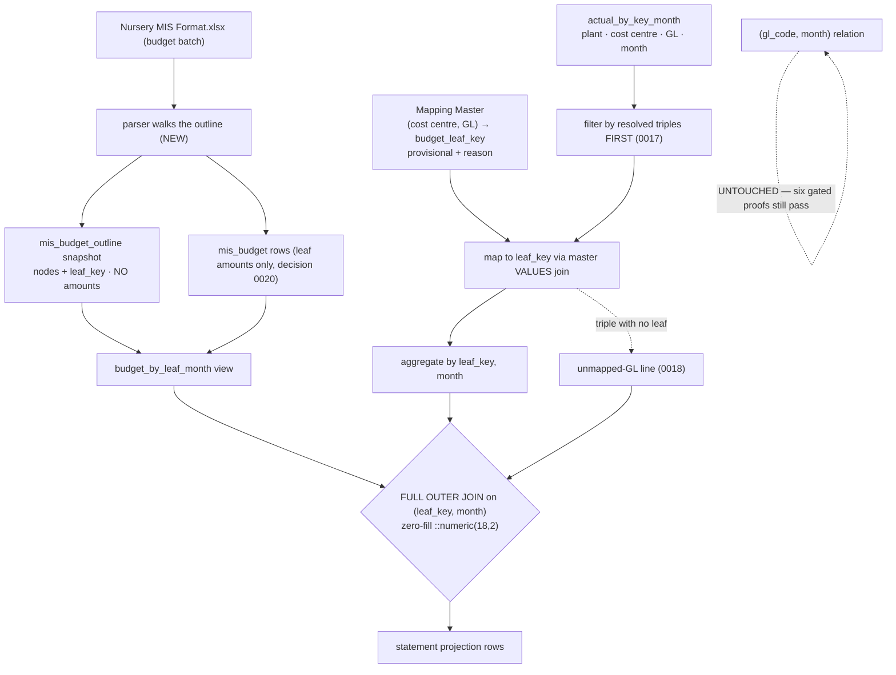

# Task plan — statement-model: the outline snapshot, the stable leaf key, and the statement projection

Story: mis-statement · Task 1 of 4 · **user_facing: false**

## Objective
Give the statement something to stand on. Three coupled pieces, none of which works
without the others: persist the budget workbook's **outline** as a per-batch snapshot
keyed by a **stable leaf key** (decision **0021**), record the **budget-leaf ↔ SAP
(cost centre, GL) correspondence** in the versioned Mapping Master, and add the
statement's **own governed projection at leaf/month grain** (decision **0022**) — with
the shipped `(gl_code, month)` relation left exactly as it is.

No HTTP route, no UI, no export: those are tasks 2, 3 and 4.

## Acceptance criteria (plan_contracts)
- **t-sm-c1** — the parser walks the outline and records it as a per-batch snapshot
  (ordered section → component → leaf, each node carrying `S. No.`, label and ordering)
  carrying **no monetary amount**, and every leaf gains a **stable key derived from its
  identity, not its sheet row number**, so re-ingesting a reordered workbook maps onto
  the same lines.
- **t-sm-c2** — the Mapping Master records the budget-leaf correspondence for the DUB
  nursery selection as **provisional entries with reasons**, so a SAP
  `(cost centre, GL)` triple resolves to **exactly one** statement leaf, recorded rather
  than inferred at runtime.
- **t-sm-c3** — the statement projection returns Budget and Actual **full-outer-joined at
  leaf/month grain**, filtering Actuals by the master's resolved triples **before**
  aggregating (decision 0017), with **no fan-out** and with leaf-grain totals exact
  against the pinned July batch; the `(gl_code, month)` relation and all six existing
  gated warehouse proofs are **unchanged**. Parent-by-parent footing is **task 2's**,
  which owns tree derivation.

## What already exists (grounding, file:line)
- **`mis_budget`** — `warehouse-schema.ts:86`: `batchId, formatId, period, lineId,
  glCode, costCenter, budgetAmount, rolloverAmount`, unique on
  `(batchId, formatId, period, lineId, glCode, costCenter)`. **No outline, no ordering,
  no parent.** `lineId` is the workbook's **sheet row number** (set by the D-0029 fix) —
  it is a uniqueness token and **must not** become the leaf key.
- **The three views** — `warehouse-schema.ts:117-169`: `actual_by_key_month`
  (plant, cost_centre, GL, month — the grain the statement needs), `actual_by_gl_month`
  and `budget_by_gl_month` (both roll up to GL+month). The statement needs a **fourth**
  shape; the three existing ones are not touched.
- **The governed builder** — `sqlBuilder.ts:143-175` `composedCtes`: `actual_src` reads
  `actual_by_key_month` when a `resolvedScope` is present, injects the resolved triples
  as a literal `(plant, cost_center, gl_code) IN (...)` list, then `GROUP BY gl_code,
  month`; `budget_src` reads `budget_by_gl_month` gated on `'DUB' IN (scopeValues)`;
  both are FULL OUTER JOINed into `financial_relation`. **This is the pattern to
  follow — and the relation to leave alone.**
- **The parser** — `mis-budget.parser.ts`: `isSubtotal()` tests each row's Budget cell
  formula **independently** for a cell reference. That excludes subtotals correctly but
  **builds no tree**. Walking the outline is new work.
- **The master** — `mis-mapping-master.ts`: a compiled TS const with `entry()`/`bucket()`
  helpers; `mapping-master.ts` is the strict loader that already rejects duplicate
  selection keys, duplicate entries, alias reuse and reason-less provisional entries.
- **Gated proofs** — `backend/package.json` `test:warehouse-proof` runs six serialized
  DB proofs. The new one is **added**, the six are **retained unchanged**.

## Design
### The outline snapshot (t-sm-c1)
A new `mis_budget_outline` table, one row per node, keyed by `batch_id`:
`node_key`, `parent_key` (null at the root), `depth`, `s_no`, `label`, `sort_order`,
and for leaves `gl_code` + `leaf_key`. **No amount column exists**, which is what makes
double-counting structurally impossible rather than merely avoided — decision 0020's
rule (a Budget cell that is a formula containing a cell reference is a derived subtotal)
is what classifies a node as a parent.

`mis_budget` itself gains a **`leaf_key`** column, written by the parser at ingest, so
the amount row and its snapshot node share one key — there is **no join on GL**, which
would re-merge the very `50001605` / `50001606` / `50001901` lines this story exists to
split. Uniqueness is enforced per `(batch_id, period, leaf_key)`, and `parent_key` must
reference a node **in the same batch**, so an outline cannot straddle two uploads.

**The stable leaf key** is derived from identity, never position:
`<nearest ancestor S.No>|<gl_code>|<slug(component label)>`. Reordering rows cannot
change it; `50001605` under `4.x`, `5.x` and `6.x` yields three distinct keys, which is
exactly the split the statement needs. It changes only when Srihari renumbers or renames
a line — which *is* a structural change, and should be visible as one.

### The master correspondence (t-sm-c2)
A master entry's target is **tagged**, not a bare key: either
`{ kind: "leaf", leafKey }` or `{ kind: "bucket" }` — the reserved `unmapped-GL` line of
decision **0018**. The nine triples that deliberately resolve to the bucket have **no**
workbook leaf and must not be forced to invent one. A bucket row carries **zero Budget**
and its own Actual, is placed as a **distinct top-level line** rather than inside a
section, and **is included in the grand total** — the slice must still reconcile to the
full DUB total, which is the whole point of decision 0018.

Each leaf-tagged entry carries its `budget_leaf_key`, **provisional with a reason**, following
the pattern `mis-selection` established for the `unmapped-GL` bucket. The loader gains
one more rejection: **two entries claiming the same triple for different leaves**, since
that would make a triple resolve to two statement lines. The Primary / Secondary /
Tertiary correspondence is legible from the two vocabularies but is **recorded, never
inferred at runtime from label similarity**.

**Structural drift must fail visibly.** A reissued workbook that renames or renumbers a
line changes its leaf key, which would otherwise split one statement line into a
budget-only row and an actual-only row — silently. So budget ingest **validates the
candidate snapshot's leaf keys against the master's declared targets** and records any
master target with no matching leaf in the batch's validation result, the way the
uncomputed roll-over count already is.

**The upload still succeeds** (human-decided this grill): Srihari is never blocked from
loading a new plan, and the drift is visible for us to reconcile the master. Flagging
drifted lines on the statement itself was considered and rejected — it reaches into
task 2's payload and task 3's rendering, beyond this task. Drift is reported, never
absorbed.

### The statement projection (t-sm-c3)
- **Budget side** — a `budget_by_leaf_month` view: `mis_budget` INNER JOINed to the
  active batch's outline snapshot on `(batch_id, lineId→node)`, grouped by
  `(leaf_key, month)`. Entirely DB-side, so it is a view like its siblings.
- **The mapping reaches the builder through the governed boundary, not a global import.**
  `GovernedSelectionScope` (`sqlBuilder.ts:11`) carries triples and GL arrays only, and
  `SelectionResolverService` (`selection-resolver.service.ts:70`) emits the same, so both
  gain a typed `leafTargets` entry — `(plant, costCentre, glCode) → tagged target`.
  Importing `MAPPING_MASTER` directly inside the builder would bypass the injectable-
  master seam that `selection-resolution` was made to fix, and is forbidden here.
- **Actual side** — built in `sqlBuilder`, because the master lives in TypeScript, not
  the database. `actual_by_key_month` is filtered by the resolved triples **first**
  (decision 0017, the same literal IN-list `composedCtes` already uses), then mapped to
  `leaf_key` through the master's correspondence injected as a `VALUES` join, then
  aggregated by `(leaf_key, month)`.
- **Joined** FULL OUTER on `(leaf_key, month)` with `COALESCE(...,0)::numeric(18,2)`
  zero-fill — the scale cast matters, or a one-sided key returns a scaleless `'0'`.
- An actual triple whose leaf the master does not cover lands on the **`unmapped-GL`**
  line (decision 0018), never dropped and never absorbed into a parent.

### The route from parse to persisted batch (t-sm-c1)
The outline has no path to storage today: `parseMisBudgetWorkbook` returns period rows,
`IngestService.ingestBudget` (`ingest.service.ts:55`) calls
`replaceBudgetBatch(metadata, rows)`, and the repository accepts only rows. So the parse
result carries the outline alongside the rows, `replaceBudgetBatch` takes and persists it,
and it is written **inside the same transaction** that writes the rows and activates the
batch — a snapshot that could survive a rolled-back batch would be worse than none. The
ingest service and its atomic-rollback test are therefore in scope.

### The migration
Warehouse migrations are committed SQL under `backend/drizzle-warehouse` applied by the
runner, with journal metadata, and `warehouse-schema.test.ts:223` **pins the last
migration as `0002`**. The new table, the new column, the new view and that pin all move
together — omitting any one of them leaves the runner and the test disagreeing.

### What must not change
`composedCtes`' existing `resolvedScope` path, `actual_by_gl_month`, `budget_by_gl_month`
and `actual_by_key_month` stay byte-identical in behaviour. **Decision 0022's promise is
kept by evidence**: the six existing gated proofs must pass unchanged.

## Workflow

## Manual Verification
1. `npm run build:contract && npm run build:backend && npm run typecheck && npm run lint
   && npm run format:check && npm run test:hermetic` — the three required leaves pass.
2. **Migrate and re-ingest**: run the warehouse migration, then re-ingest
   `Nursery MIS Format.xlsx` (a batch ingested before this change carries no snapshot and
   must be re-ingested, per decision 0021) and confirm the snapshot has the expected
   node counts with **no amount column**.
3. **Gated D-0008 host proof** — the new `statement-projection.db.test.ts`, registered in
   `test:warehouse-proof` and in the quality-gate expected-script registry, asserts
   against the pinned July batch: Actual **₹1,15,12,712.07** and Budget
   **₹1,00,50,136.29** summed over the leaf rows; every parent equals the sum of its
   leaves — **parent-by-parent footing belongs to task 2**, which owns tree derivation;
   this task proves the leaf grain it actually produces — `50001605`, `50001606` and
   `50001901` **split across
   Primary / Secondary / Tertiary** instead of summing onto one line; and **no fan-out**
   (exact row counts, not merely non-empty). Run the dead-port **negative control** — a
   green run that cannot fail is not evidence.
4. **The six existing gated proofs pass unchanged** — the evidence for decision 0022.

## Decisions attested
**0021** (the outline snapshot and stable leaf key — this task implements it), **0022**
(the separate statement projection; the GL-month relation untouched), **0020** (leaf rows
only, no stored parent amounts; parents derived), **0017** (filter before the roll-up),
**0018** (the `unmapped-GL` line stays visible), **0016** (governed access, scope
injection, provenance, golden fixtures), **0015** (warehouse snake_case), **0009**
(required tests name a real leaf and pin `TS_NODE_PROJECT`), **0002/0003** (the Phase-1
deliverable), **0012** (the vendored-API deviation).

## Surface impact
- **Warehouse**: `mis_budget_outline` table + `budget_by_leaf_month` view + migration.
- **Backend**: `mis-budget.parser.ts` walks and records the outline;
  `ingestion.repository.ts` persists the snapshot with the batch;
  `mis-mapping-master.ts` + `mapping-master.ts` gain the leaf correspondence and its
  rejection rule; `sqlBuilder.ts` gains the statement projection.
- **Tests**: `mis-budget.parser.test.ts`, `mapping-master.test.ts`,
  `sqlBuilder.statement.test.ts` (hermetic) and `statement-projection.db.test.ts`
  (gated), registered in `backend/package.json` and `tools/quality-gate.test.mjs`.
- **Unchanged by design**: the three existing views, `composedCtes`' existing
  `resolvedScope` path, the semantic domain and its measures, every HTTP route, the UI.

## Out of scope
The statement route and payload assembly (task 2), the on-screen statement (task 3), the
Excel export (task 4), the roll-over calculation, Table-1 and Table-3.

## Task Decomposition
This is task 1 of the mis-statement story's 4-task decomposition
(`.factory/stories/mis-statement/decomposition.json`): (1) **statement-model** [this
task], (2) statement-api, (3) statement-view, (4) statement-export. It is one bounded
unit because the projection is meaningless without the leaf key it groups by, and the
leaf key is meaningless without the snapshot that defines it; its three criteria are
proven by the three hermetic required tests plus the gated D-0008 proof.
