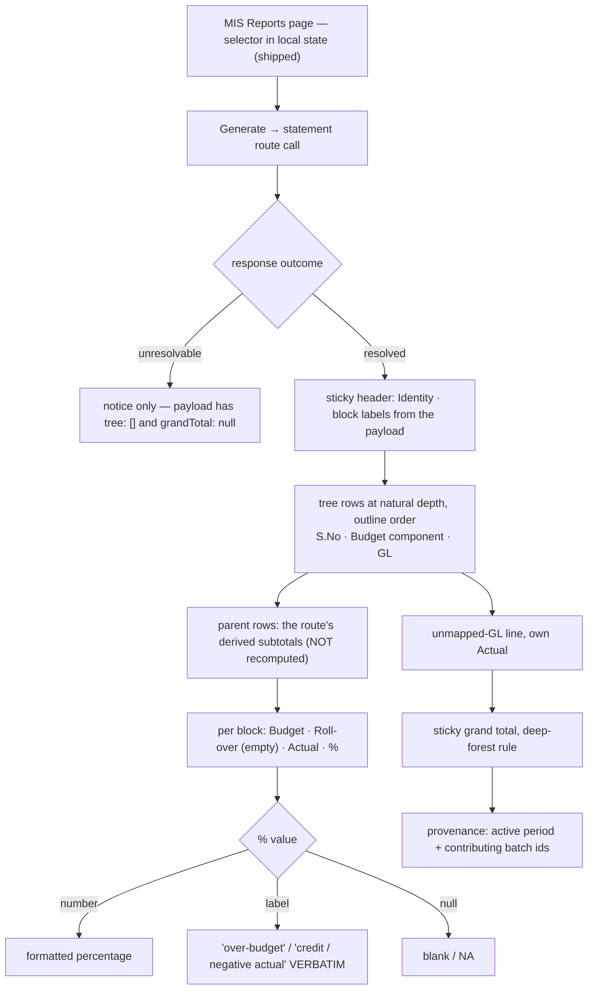

# Task plan — statement-view: the Financial MIS statement on screen

Story: mis-statement · Task 3 of 4 · **user_facing: true**

## Objective
Put Srihari's statement on a screen. The route already returns the tree with every
subtotal derived and the grand total footed; this task **renders** it — the workbook's
hierarchy at its natural depth, two period blocks, both outcomes kept distinct, and the
`unmapped-GL` line visible.

It renders **inline on the MIS Reports page**, below the existing selector (human-decided
this grill). The four selectors the statement route needs live only in that page's local
state, so a separate page would have to invent a handoff and then defend itself against a
stale or missing selection. Inline, there is nothing to hand off.

No backend change and no contract change: the payload is fixed and shipped.

## Acceptance criteria (plan_contracts)
- **t-sv-c1** — renders **inline** below the selector, replacing the flat GL table once
  Generate runs; the tree at natural depth in outline order, each row carrying `S. No.`
  and Budget Component, the GL code shown for leaves that have one and **blank for
  `unmapped-GL`, whose `glCode` is `null` by contract**.
- **t-sv-c2** — parent rows show the **route's** subtotals and the grand total foots;
  **nothing is re-summed on the client**, because task 4's export renders the same payload.
- **t-sv-c3** — each block renders **Budget · Roll-over · Actual · %**, Roll-over visibly
  **empty**; headings are the **spec's** labels — *July 2026*, *FY 26-27 (YTD to Jul)* —
  formatted in the view from each block's `from`/`to`, since the API emits `2026-07-01`
  and `FY 26-27 YTD`; money in Indian grouping with `₹`, rounded to the rupee **half-up
  away from zero** from the decimal string, **never through float**; a non-numeric `%`
  **verbatim**, a null `%` as **NA**; a single-block response renders one block.
- **t-sv-c4** — the two outcomes distinct, branched on the **outcome**: unresolvable shows
  the notice and **no table** (its payload is `tree: []`, `grandTotal: null` — there is
  nothing to zero-fill); resolved-but-empty shows the full statement with zeros and no
  notice. The statement also **names its provenance** — the active period and contributing
  batch ids — which the spec requires of a report built from an uploaded extract.

## Mandatory for a user-facing task
`harness.yaml` — the recorder **refuses** a user-facing testing artifact unless
`skills_used` attests **both `emil-design-eng` and `frontend-design`**. A **functional
check** is also required, recorded via `record_test_from_json.py --kind functional`; the
automated artifact alone does not satisfy this task.

## What already exists (grounding, file:line)
- **The payload, shipped in task 2** — `contract/src/api.ts:270` `MisStatementNode`
  (`nodeKey, sNo, budgetComponent, glCode, measures[], children[]`) and `:260`
  `MisStatementMeasureBlock` (`key: "selected" | "fy26-27-ytd"`, `label`, `from`, `to`,
  `budget`, `rollover: null`, `actual`, `percentage: string | null`, `sourcePresence`),
  with `MisStatementResolvedResponse` carrying `tree`, `grandTotal` and `provenance`, and
  `MisStatementUnresolvableResponse` carrying `notice: "No mapping configured"`.
  **Every subtotal is already computed** — the view renders, it does not re-sum.
- **Money** — `FixedScaleMoney` (`api.ts:258`) is a fixed-scale decimal **string**
  (`${bigint}.${digit}${digit}`), so paise survive the wire. Display rounds to the rupee;
  the string is never turned into float arithmetic.
- **The API client** — `frontend/src/lib/api.ts:60-63` has `misOptions` and
  `runMisSelection`; the statement call is the next data method on the same
  cookie/CSRF/one-shot-refresh `request`/`post` helpers.
- **The page it renders into** — `frontend/app/(app)/mis-reports/page.tsx` +
  `src/features/mis/mis-report-view.tsx`: the shipped selector holds all four values in
  **local state**, which is exactly why the statement renders here rather than on a second
  page. Its patterns — branch on the union, labels verbatim — are the ones to follow.
- **The unresolvable payload** — `contract/src/api.ts:291`: `tree: []`,
  `grandTotal: null`, `notice: "No mapping configured"`. There is **no zero-valued tree to
  draw**, so that state is the notice, not a table of zeros.
- **The prototype** — `docs/design/3F-Financial-MIS/3F Financial MIS.dc.html:157-193`:
  sticky header groups (`Identity`, `FY 26-27 (YTD)`, `July 2026`), identity columns
  `S.No · Budget component · Rollover · Payment office · GL code`, `Budget`/`Actual` per
  block, and a sticky grand-total row ruled in `--kl-deep-forest`. **We omit Payment
  office** (Table-3) and **add `%`** per the spec.
- **Tests are vitest** — `npm exec --no -- vitest run --config frontend/vitest.config.ts`.
  A required leaf whose `-t` matches nothing still exits 0 (D-0031), so the report's
  executed count is what proves a leaf ran.

## Design
### Render, never recompute
Every parent subtotal and the grand total arrive computed. The view **displays** them. A
client that re-sums creates a second source of truth that can disagree with the Excel
export task 4 builds from the same payload — the exact drift the wire types exist to
prevent.

### The table
One table, sticky identity columns on the left and sticky block headers on top, so a deep
statement stays legible while scrolling — the prototype's structure. Depth is shown by
indentation **and** by real structure for assistive technology: a row's level is carried
in markup, not implied by padding alone, and the sticky columns must not trap focus.

### Block headings
The API emits `2026-07-01` and `FY 26-27 YTD`; the confirmed spec requires *July 2026* and
*FY 26-27 (YTD to Jul)*. The view formats each heading from the block's own `from`/`to`,
so the label follows the data rather than a hard-coded month.

### Money and the nil rules
`FixedScaleMoney` is a string carrying exact paise. Display rounds it to the rupee
**half-up away from zero**, in Indian digit grouping with `₹`, and that is the **only**
place rounding happens — over the string, never through float arithmetic, which is how a
statement starts disagreeing with its own export.
`percentage` is `string | null`: `null` renders as blank/NA, and a non-numeric label —
`over-budget`, `credit / negative actual` — renders **verbatim**. Numeric-formatting it is
the defect `mis-selection` shipped to a live page.

### Blocks
The route returns one or two blocks and labels each. The view renders **what it is
given** — one block when the selected period is itself the FY-YTD — rather than assuming
two.

## Workflow

## Manual Verification
1. `npm run typecheck && npm run lint && npm run format:check && npm run test:frontend &&
   npm run build:frontend` — the four required vitest leaves pass. Check each leaf's
   **executed count**, not the exit code: a `-t` that matches nothing still exits 0
   (D-0031).
2. `frontend/src/theme/tokens.test.ts` still passes. **It does not prove no token was
   added**: it compares only the files under `frontend/src/theme` against their source, so
   a new custom property in `globals.css` sails past it. Adding no token is checked by
   **reading the diff**, and the reviewer is told so.
3. **Functional check (mandatory, user_facing)**: with the stack up and the July batch
   ingested, sign in, open MIS Reports, generate Agriculture / Nursery / DUB / Jul 2026,
   and confirm the statement renders inline below the selector with the hierarchy at its natural depth, parent subtotals
   footing to the grand total **₹1,15,12,712** Actual against **₹1,00,50,136** Budget,
   both period blocks with Roll-over empty, the `unmapped-GL` line, and no `NaN` anywhere.
   The **unresolvable** state is not walked live — the single-selection master makes it
   unreachable — and is proven by the component test instead.

## Decisions attested
**0018** (the `unmapped-GL` line stays visible; the two zero states), **0021/0022**
(the outline and the projection behind the numbers), **0020** (parents derived — here,
rendered not recomputed), **0019** (the route this consumes), **0016** (governed access),
**0023** (drift reports, never blocks), **0007** (Next.js), **0010** (3F branding),
**0009/0031** (a required leaf must really execute), **0002/0003**.

## Surface impact
- **Frontend**: `src/features/mis/statement-view.tsx` + its hook (NEW), rendered inline
  by `mis-report-view.tsx`, the statement data method on `src/lib/api.ts`,
  `app/globals.css` table classes. **No new route** — the statement lives on the existing
  MIS Reports page.
- **Unchanged by design**: every backend file, `contract/src/api.ts`, the theme tokens
  (`tokens.test.ts` guards them), the selection flow and its tests beyond the added link,
  `SessionGuard`/`AppShell` auth, the gated warehouse proofs.

## Out of scope
The Excel export (task 4), the roll-over calculation, Table-1 and Table-3 including
Payment Office, drill-down, and any backend or contract change.

## Task Decomposition
Task 3 of the mis-statement story's 4-task decomposition: (1) statement-model [#30],
(2) statement-api [#32], (3) **statement-view** [this task], (4) statement-export. One
bounded unit — a page rendering an already-shipped payload — proven by four vitest leaves
plus the mandatory functional check.

<!-- forge:contract -->
## Contract (recorded)

Rendered by the harness from the recorded decomposition; edit the decomposition, not this block. It is excluded from the plan's approval and grill digests, so a re-render never stales either.

**Objective.** Render the statement a person can read and hand to Srihari: the workbook's hierarchy at its natural depth, derived subtotals, the grand total, both zero states kept distinct, and the visible unmapped-GL line - reached from MIS Reports and matching the imported design prototype's metrics.

**Acceptance criteria**

- The statement renders INLINE on the MIS Reports page, below the existing selector, replacing the flat GL table once Generate runs - so the four selectors it needs are the ones already in hand and there is no second surface reachable with a stale or missing selection. It draws the tree at the workbook's natural depth in outline order, each row carrying its S. No. and Budget Component, with the GL code shown for leaves that have one and left blank for the unmapped-GL line, whose glCode is null by contract.
- Parent rows display the subtotals the ROUTE derived and a grand total foots the table - nothing is re-summed on the client, because the Excel export in task 4 renders the same payload and a second computation could disagree with it.
- Each period block renders Budget, Roll-over, Actual and % with Roll-over visibly EMPTY; block headings are the SPEC's labels - 'July 2026' and 'FY 26-27 (YTD to Jul)' - formatted in the view from each block's from/to, since the API emits raw values like 2026-07-01; money is displayed in Indian digit grouping with the rupee sign, rounded to the rupee HALF-UP AWAY FROM ZERO from the fixed-scale decimal string without ever going through float arithmetic; a non-numeric percentage is passed through VERBATIM and a null percentage renders as NA; and a single-block response renders one block.
- The two outcomes render distinctly, branched on the response outcome rather than row emptiness: an unresolvable selection shows the 'No mapping configured' notice and NO statement table, because that payload carries tree: [] and grandTotal: null and there is nothing to zero-fill; a resolved selection with no transactions shows the full configured statement with zero values and no notice. The statement also names its provenance - the active period and the contributing batch ids the response carries - which the spec requires of a report generated from an uploaded extract rather than a live connection.

**Write scope** (what `stage done` measures the diff against)

- frontend/src/features/mis/statement-view.tsx
- frontend/src/features/mis/statement-view.test.tsx
- frontend/src/features/mis/use-mis-statement.ts
- frontend/src/features/mis/mis-report-view.tsx
- frontend/src/features/mis/mis-report-view.test.tsx
- frontend/src/lib/api.ts
- frontend/src/lib/api.test.ts
- frontend/app/globals.css

**Scope amendments** (measured paths the scope did not name, recorded with `forge stage amend-scope`)

- frontend/src/features/mis/use-mis-selection.ts -- frontend/src/features/mis/use-mis-selection.ts was DELETED as the mechanically-implied consequence of a blocking review finding, authorized mid-stage as signal S-0006-e528: the page now imports useMisStatement, so that hook was the sole remaining caller of the orphaned runMisSelection client method, which still exposed the replaced /api/mis/run flow. Removing the method without deleting its only caller would not compile. The backend route is untouched - it is mis-selection's shipped contract and drill-down may consume it. 9 files against an 8 budget is that one deletion; 1107 lines is well inside the 1500 allowed.

**Required tests** (run by `stage done`)

- `the statement renders inline below the selector as a tree in outline order showing the routes parent subtotals and a grand total without recomputing them` -- `npm exec --no -- vitest run --config frontend/vitest.config.ts {path} -t {id} --reporter=junit --outputFile={report}` (frontend/src/features/mis/statement-view.test.tsx)
- `block headings use the spec labels formatted from each blocks range and money renders in indian grouping rounded to the rupee with rollover empty` -- `npm exec --no -- vitest run --config frontend/vitest.config.ts {path} -t {id} --reporter=junit --outputFile={report}` (frontend/src/features/mis/statement-view.test.tsx)
- `a non numeric percentage label is kept verbatim a null percentage renders as NA and a single block response renders one block` -- `npm exec --no -- vitest run --config frontend/vitest.config.ts {path} -t {id} --reporter=junit --outputFile={report}` (frontend/src/features/mis/statement-view.test.tsx)
- `an unresolvable outcome shows the notice with no statement table while a resolved selection with no transactions shows the configured statement with zeros and no notice` -- `npm exec --no -- vitest run --config frontend/vitest.config.ts {path} -t {id} --reporter=junit --outputFile={report}` (frontend/src/features/mis/statement-view.test.tsx)
- `the unmapped GL line renders with a blank gl code and its own actual and the statement names its active period and contributing batch ids` -- `npm exec --no -- vitest run --config frontend/vitest.config.ts {path} -t {id} --reporter=junit --outputFile={report}` (frontend/src/features/mis/statement-view.test.tsx)

**Verify commands**

- `npm run typecheck`
- `npm run lint`
- `npm run format:check`
- `npm run test:frontend`
- `npm run build:frontend`

**Review budget.** 8 files / 1500 lines -- The statement view, its hook and styles, rendering an already-shipped payload inline on the existing MIS Reports page, plus the statement data method on the api client. The substance is the hierarchical table - sticky identity columns, two spec-labelled period blocks, the route's subtotals rendered rather than recomputed, both outcomes, and provenance - with its design fidelity and accessibility. No backend, contract or schema change.
<!-- /forge:contract -->
