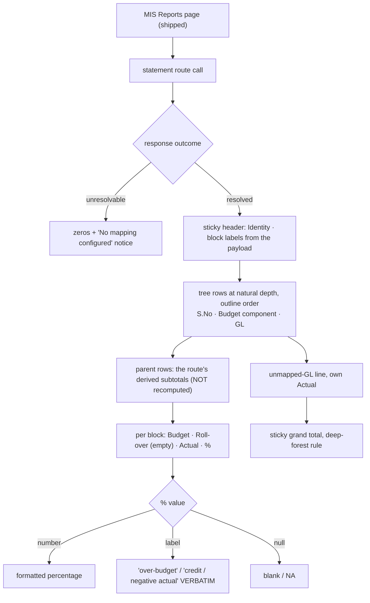

# Task plan — statement-view: the Financial MIS statement on screen

Story: mis-statement · Task 3 of 4 · **user_facing: true**

## Objective
Put Srihari's statement on a screen. The route already returns the tree with every
subtotal derived and the grand total footed; this task **renders** it — the workbook's
hierarchy at its natural depth, two period blocks, both zero states kept distinct, and the
`unmapped-GL` line visible — reached from the existing MIS Reports page.

No backend change and no contract change: the payload is fixed and shipped.

## Acceptance criteria (plan_contracts)
- **t-sv-c1** — the tree at natural depth in outline order, each row carrying `S. No.`,
  Budget Component and (leaves) GL code, parents showing the **route's** subtotals, a
  grand total footing. **Payment Office is not rendered** — Table-3 is out of scope.
- **t-sv-c2** — each block renders **Budget · Roll-over · Actual · %**, Roll-over visibly
  **empty**, money in Indian grouping with `₹` rounded to the rupee **for display only**,
  and a non-numeric `%` label passed through **verbatim**. A single-block response renders
  one block.
- **t-sv-c3** — the two zero states distinct, branched on the **outcome**; the
  `unmapped-GL` line visible with its own Actual.
- **t-sv-c4** — reached from MIS Reports, matching the prototype's metrics for the
  surfaces it reuses, **adding no theme token**.

## Mandatory for a user-facing task
`harness.yaml` — the recorder **refuses** a user-facing testing artifact unless
`skills_used` attests **both `emil-design-eng` and `frontend-design`**. A **functional
check** is also required, recorded via `record_test_from_json.py --kind functional`; the
automated artifact alone does not satisfy this task.

## What already exists (grounding, file:line)
- **The payload, shipped in task 2** — `contract/src/api.ts:270` `MisStatementNode`
  (`nodeKey, sNo, budgetComponent, glCode, measures[], children[]`) and `:260`
  `MisStatementMeasureBlock` (`key: "selected" | "fy26-27-ytd"`, `label`, `from`, `to`,
  `budget`, `rollover: null`, `actual`, `percentage: string | null`, `sourcePresence`),
  with `MisStatementResolvedResponse` carrying `tree`, `grandTotal` and `provenance`, and
  `MisStatementUnresolvableResponse` carrying `notice: "No mapping configured"`.
  **Every subtotal is already computed** — the view renders, it does not re-sum.
- **Money** — `FixedScaleMoney` (`api.ts:258`) is a fixed-scale decimal **string**
  (`${bigint}.${digit}${digit}`), so paise survive the wire. Display rounds to the rupee;
  the string is never turned into float arithmetic.
- **The API client** — `frontend/src/lib/api.ts:60-63` has `misOptions` and
  `runMisSelection`; the statement call is the next data method on the same
  cookie/CSRF/one-shot-refresh `request`/`post` helpers.
- **The page it hangs off** — `frontend/app/(app)/mis-reports/page.tsx` +
  `src/features/mis/mis-report-view.tsx`: the shipped selector, its resolved-scope
  readout, its two zero states and the unmapped-GL list. The statement is reached from
  there, and that page's patterns (branch on the union, labels verbatim) are the ones to
  follow.
- **The prototype** — `docs/design/3F-Financial-MIS/3F Financial MIS.dc.html:157-193`:
  sticky header groups (`Identity`, `FY 26-27 (YTD)`, `July 2026`), identity columns
  `S.No · Budget component · Rollover · Payment office · GL code`, `Budget`/`Actual` per
  block, and a sticky grand-total row ruled in `--kl-deep-forest`. **We omit Payment
  office** (Table-3) and **add `%`** per the spec.
- **Tests are vitest** — `npm exec --no -- vitest run --config frontend/vitest.config.ts`.
  A required leaf whose `-t` matches nothing still exits 0 (D-0031), so the report's
  executed count is what proves a leaf ran.

## Design
### Render, never recompute
Every parent subtotal and the grand total arrive computed. The view **displays** them. A
client that re-sums creates a second source of truth that can disagree with the Excel
export task 4 builds from the same payload — the exact drift the wire types exist to
prevent.

### The table
One table, sticky identity columns on the left and sticky block headers on top, so a deep
statement stays legible while scrolling — the prototype's structure. Depth is shown by
indentation **and** by real structure for assistive technology: a row's level is carried
in markup, not implied by padding alone, and the sticky columns must not trap focus.

### Money and the nil rules
`FixedScaleMoney` is a string carrying exact paise. Display rounds it to the rupee in
Indian digit grouping with `₹`, and that is the **only** place rounding happens.
`percentage` is `string | null`: `null` renders as blank/NA, and a non-numeric label —
`over-budget`, `credit / negative actual` — renders **verbatim**. Numeric-formatting it is
the defect `mis-selection` shipped to a live page.

### Blocks
The route returns one or two blocks and labels each. The view renders **what it is
given** — one block when the selected period is itself the FY-YTD — rather than assuming
two.

## Workflow

## Manual Verification
1. `npm run typecheck && npm run lint && npm run format:check && npm run test:frontend &&
   npm run build:frontend` — the four required vitest leaves pass. Check each leaf's
   **executed count**, not the exit code: a `-t` that matches nothing still exits 0
   (D-0031).
2. `frontend/src/theme/tokens.test.ts` still passes, proving no token was added or renamed.
3. **Functional check (mandatory, user_facing)**: with the stack up and the July batch
   ingested, sign in, open MIS Reports, generate Agriculture / Nursery / DUB / Jul 2026,
   open the statement, and confirm the hierarchy at its natural depth, parent subtotals
   footing to the grand total **₹1,15,12,712** Actual against **₹1,00,50,136** Budget,
   both period blocks with Roll-over empty, the `unmapped-GL` line, and no `NaN` anywhere.
   The **unresolvable** state is not walked live — the single-selection master makes it
   unreachable — and is proven by the component test instead.

## Decisions attested
**0018** (the `unmapped-GL` line stays visible; the two zero states), **0021/0022**
(the outline and the projection behind the numbers), **0020** (parents derived — here,
rendered not recomputed), **0019** (the route this consumes), **0016** (governed access),
**0023** (drift reports, never blocks), **0007** (Next.js), **0010** (3F branding),
**0009/0031** (a required leaf must really execute), **0002/0003**.

## Surface impact
- **Frontend**: `app/(app)/mis-reports/statement/page.tsx` (NEW),
  `src/features/mis/statement-view.tsx` + its hook (NEW), the statement data method on
  `src/lib/api.ts`, a link from `mis-report-view.tsx`, `app/globals.css` page classes.
- **Unchanged by design**: every backend file, `contract/src/api.ts`, the theme tokens
  (`tokens.test.ts` guards them), the selection flow and its tests beyond the added link,
  `SessionGuard`/`AppShell` auth, the gated warehouse proofs.

## Out of scope
The Excel export (task 4), the roll-over calculation, Table-1 and Table-3 including
Payment Office, drill-down, and any backend or contract change.

## Task Decomposition
Task 3 of the mis-statement story's 4-task decomposition: (1) statement-model [#30],
(2) statement-api [#32], (3) **statement-view** [this task], (4) statement-export. One
bounded unit — a page rendering an already-shipped payload — proven by four vitest leaves
plus the mandatory functional check.

<!-- forge:contract -->
## Contract (recorded)

Rendered by the harness from the recorded decomposition; edit the decomposition, not this block. It is excluded from the plan's approval and grill digests, so a re-render never stales either.

**Objective.** Render the statement a person can read and hand to Srihari: the workbook's hierarchy at its natural depth, derived subtotals, the grand total, both zero states kept distinct, and the visible unmapped-GL line - reached from MIS Reports and matching the imported design prototype's metrics.

**Acceptance criteria**

- The statement renders as a TREE at the workbook's natural depth in outline order - two levels for most sections, three under Admin Expenses - each row carrying its S. No., Budget Component and, for leaves, the GL code; parent rows show the subtotals the route derived and a grand total foots the statement. Payment Office is NOT rendered: it belongs to Table-3, which the spec puts out of scope.
- Each period block renders Budget, Roll-over, Actual and % - Roll-over visibly present but EMPTY until Srihari's rule - with money in Indian digit grouping prefixed by the rupee sign and rounded to the rupee for display only, and a non-numeric percentage such as over-budget or credit / negative actual passed through VERBATIM rather than numeric-formatted. When the route returns a single block the table shows one block, not the same figures twice.
- The two zero states render distinctly, branched on the response outcome rather than row emptiness: an unresolvable selection shows zeros plus the no-mapping-configured notice, while a resolved selection with no transactions shows a configured zero statement without it. The unmapped-GL line is visible with its own Actual.
- The statement is reached from the existing MIS Reports page and matches the imported design prototype's metrics for the surfaces it reuses - the eyebrow at 10px with .22em tracking in mono, the deep-forest grand-total rule, sticky identity columns and block headers - adding no theme token, since tokens.test.ts guards the set.

**Write scope** (what `stage done` measures the diff against)

- frontend/app/(app)/mis-reports/statement/page.tsx
- frontend/src/features/mis/statement-view.tsx
- frontend/src/features/mis/statement-view.test.tsx
- frontend/src/features/mis/use-mis-statement.ts
- frontend/src/features/mis/mis-report-view.tsx
- frontend/src/features/mis/mis-report-view.test.tsx
- frontend/src/lib/api.ts
- frontend/src/lib/api.test.ts
- frontend/app/globals.css

**Required tests** (run by `stage done`)

- `the statement renders the outline as a tree in order with parent subtotals the route derived and a grand total footing the table` -- `npm exec --no -- vitest run --config frontend/vitest.config.ts {path} -t {id} --reporter=junit --outputFile={report}` (frontend/src/features/mis/statement-view.test.tsx)
- `each period block renders budget rollover actual and percentage with rollover empty money in indian grouping and a non numeric percentage label kept verbatim` -- `npm exec --no -- vitest run --config frontend/vitest.config.ts {path} -t {id} --reporter=junit --outputFile={report}` (frontend/src/features/mis/statement-view.test.tsx)
- `the two zero states render distinctly branched on the response outcome and the unmapped GL line is visible with its own actual` -- `npm exec --no -- vitest run --config frontend/vitest.config.ts {path} -t {id} --reporter=junit --outputFile={report}` (frontend/src/features/mis/statement-view.test.tsx)
- `a single block response renders one block rather than the same figures twice` -- `npm exec --no -- vitest run --config frontend/vitest.config.ts {path} -t {id} --reporter=junit --outputFile={report}` (frontend/src/features/mis/statement-view.test.tsx)

**Verify commands**

- `npm run typecheck`
- `npm run lint`
- `npm run format:check`
- `npm run test:frontend`
- `npm run build:frontend`

**Review budget.** 9 files / 1500 lines -- One page plus its view, hook and styles, consuming the already-shipped statement route, and a small edit to the existing MIS Reports page to reach it. The substance is the hierarchical table - sticky identity columns, two period blocks, derived subtotals rendered rather than recomputed, both zero states - and its design fidelity. No backend change, no contract change.
<!-- /forge:contract -->
