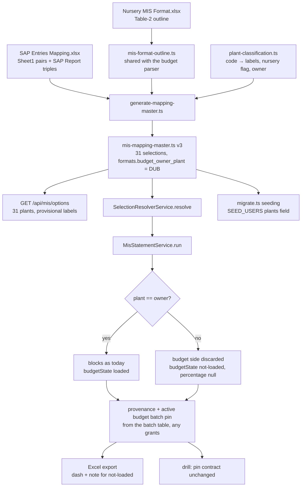

# Task — all-plants-backend

Story: `multi-plant` · plan: `plans/active/multi-plant-all-plants-in-the-mis-statement.md`

## Objective
Seed the mapping master for all 31 SAP plants from the client's mapping sheet through a
committed, re-runnable generator, so the plant dropdown offers every plant with provisional
Department / Function labels. Add the one rule the data cannot express — the format's budget
belongs to DUB — so a statement for any other plant carries a **not-loaded** budget state, the
Excel export writes a dash, and every statement pins the period's active budget batch as its
outline source regardless of the user's grants. Grant the demo admin every plant, with an
optional per-user plant list in `SEED_USERS`. Nothing in ingestion, the batch model, the drill
service or the assistant is edited (decisions 0034, 0036, 0037).

## Workflow

This task starts at the workbooks and stops at the wire: the statement and run responses, the
export, provenance and the seeded grants. It does not render anything (task 2) and does not
touch ingestion, the drill service or the assistant.

## Read before you write
- `contract/src/api.ts:287` — `MisStatementMeasureBlock` after PR #60: optional `budgetState`,
  `budget` still non-null. This task turns it into the discriminated union (in scope now).
- `backend/src/mapping/mis-mapping-master.ts` — the shipped one-selection master and its
  `entry()` / `bucket()` helpers with the two reason literals (`ABSENT_GL_REASON`,
  `CONFLICT_REASON`). Your generated file replaces it and MUST keep DUB's 28 entries and nine
  bucket rows byte-for-byte equal in meaning (same targets, same reasons).
- `backend/src/mapping/mapping-master.ts:100` — the duplicate-pair guard keyed on
  `(cost_center, gl_code)` across the whole master. It will reject the same 95 pairs recurring
  per plant; re-key it to `(plant_canonical, cost_center, gl_code)` and keep the alias-reuse and
  provisional-without-reason checks.
- `backend/src/ingest/mis-budget.parser.ts:60-130,199` — the outline walk and `stableLeafKey`.
  Extract them into `backend/src/ingest/mis-format-outline.ts` and import from both the parser
  and the generator; the parser's behaviour and its tests must not change.
- `backend/src/mis/mis-statement.service.ts:63-111` — `run()`: the outline comes from
  `outlines.findByBudgetPeriod`, the blocks from the governed projection, provenance from the
  blocks' `activeBatchIds`. `sqlBuilder.ts:216` gates the budget CTE on `'DUB' IN (scope)`, so
  for a user without DUB the budget batch never reaches provenance — the pin you add must come
  from the batch table, not from the SQL.
- `backend/src/mis/mis-selection.service.ts:84-100` — the run endpoint builds the same
  `MisSelectionScopeReadout`; both routes populate the new fields.
- `backend/src/mis/mis-statement-export.service.ts:80-90` — `writeMoney` for Budget and the
  percentage cell; add the dash branch here.
- `backend/src/config.ts:89-112` — `parseSeedUsers`; `backend/src/db/migrate.ts:43-80` — the
  admin scope seeding (today department / function / plant for DUB).
- `contract/src/api.ts:236,285` — `MisSelectionScopeReadout`, `MisStatementMeasureBlock`.

## Contract

### The generator and the classification table (0032)
- `backend/src/mapping/generate-mapping-master.ts`, run by a new backend script
  `master:generate` (`ts-node -T`, like `db:migrate`). Inputs: `docs/context/2026-08-20-srihari-phase1-data/SAP Entries Mapping.xlsx`
  (Sheet1 pairs on its **second** `Cost Center` column + GL; the SAP Report's observed
  `(plant, cost centre, GL)` triples), `Nursery MIS Format.xlsx` Table-2 through the shared
  outline helper, and `backend/src/mapping/plant-classification.ts`.
- `plant-classification.ts` is a committed table keyed by SAP plant code: canonical id, display
  label, department, function, `nursery` override, `provisional: true`. The nursery flag is
  derived from the extract (books Primary, secondary, Tertiary or Imported Sprouts) unless the
  table overrides it. `DUB-NUR` maps to canonical `DUB`, display `Agri - Nursery - DUB`, and
  carries DUB's nine bucket rows with their existing reasons. `H.O` → Corporate / Office. Every
  other code → its own canonical id, Operations / Unit unless nursery.
- Output: `mis-mapping-master.ts` with `version: 3`, one selection per plant, `mis_format:
  "nursery-mis-financial-v1"`, `provisional_labels: true`, entries = the 95 sheet pairs as leaf
  targets (a GL under several S.No rows resolved by the sheet's cost centre → section rule, as
  the shipped master did; an entry that resolves to zero or several leaves makes the generator
  fail loudly) plus one bucket row per observed pair the sheet does not name, reason
  `ABSENT_GL_REASON`, and `CONFLICT_REASON` for 50001902 / 50001903 booked under Primary. A new
  top-level `formats` map names `budget_owner_plant: "DUB"` for the format; the loader refuses
  a format without an owner.
- A hermetic test regenerates in memory and asserts deep equality with the checked-in constant.

### Budget owner and the not-loaded state (0034)
- **Contract, second half (this task owns `contract/src/api.ts`):** `MisStatementMeasureBlock`
  becomes a discriminated union — `{ budgetState: "loaded"; budget: FixedScaleMoney; rollover:
  null; percentage: string | null }` or `{ budgetState: "not-loaded"; budget: null; rollover:
  null; percentage: null }`. `budgetState` becomes REQUIRED on both members (the frontend
  already treats it as the discriminant and typechecks unchanged; if it does not, raise a
  signal rather than editing frontend files). **Never a placeholder amount on the wire.**
- **DUB unchanged means values, not bytes** (human-decided at this grill): DUB blocks now carry
  `budgetState: "loaded"` explicitly; the regression proves identical amounts, percentages,
  tree, provenance batch ids and Excel export bytes against the shipped output, and additionally
  the new fields.
- **Runtime enforcement of the union, not decorator typing.** The statement service parses its
  own result through a zod response schema (`misStatementResponseSchema.parse(...)`, the
  pattern `ingest.service.ts:41,79` already uses) before returning it; the schema accepts only
  the two valid pairs and a negative test proves that `not-loaded` with money and `loaded` with
  null are rejected. The controller keeps returning the service result (`mis-statement.controller.ts:86`).
- **The owner reaches the service through the resolver, never global config.** The master
  gains `formats: { <formatId>: { budget_owner_plant } }`; the loader validates that the owner
  is a canonical selection carrying that format (a format without a valid owner fails
  `loadMappingMaster`). `MasterResolvedSelection` gains `budgetOwnerPlant`, so
  `MisStatementService` decides `selection.plant === resolution.budgetOwnerPlant` from the
  injected master its tests already control. **The service is the sole owner-rule authority**:
  it discards the budget side before `buildTree` for non-owners (row structure, zero-fill and
  DUB's values unchanged) and stamps `budgetState`; the export and every other consumer render
  from `budgetState` alone and never re-derive ownership.
- Export: on a not-loaded block write `–` into Budget, Roll-over and % cells and add one note
  row under the title: "Budget not loaded for this plant". The filename already carries the
  plant (`mis-statement.controller.ts:145`); assert it, do not change it.
- Decision 0037 governs the Ask view: `actual_by_gl_month` keeps its DUB literal; decision
  0034's consequence about that view belongs to the plant-aware assistant and is deferred, as
  the spec's "Settled by the task grill" section records — cite that section in the code
  comment at the view, since neither accepted record can be edited.

### The outline pin for every plant — atomic, not two reads
- `StatementOutlineRepository` (and its interface) gains ONE method,
  `findActiveBudgetOutline(period)`, returning `{ batchId, nodes }` from a single query over
  the active budget batch for the block-end period, so the outline the tree is built from and
  the batch id pinned in provenance can never come from two different batches. `run()` uses
  it instead of `findByBudgetPeriod`, adds `{ source: "budget", period, batchId }` to
  `provenance.activeBatchIds` for EVERY plant (de-duplicated against what the blocks already
  reported), and never reads a budget amount for a non-owner. A race-shaped hermetic test
  (the fake repository swaps the active batch between the tree build and a second call) proves
  provenance and outline agree. The drill's pin contract (`mis-drill.service.ts:139`) is
  unchanged and the drill service is NOT edited.

### Scope readout (both routes)
- The contract's `provisional` / `plantDisplay` on the scope readout and `provisional` on the
  plant option (added by the frontend task) are always populated by `GET /api/mis/options`,
  `POST /api/mis/statement` and `POST /api/mis/run`. DTOs and Swagger updated once, in
  `mis-selection.dto.ts` and `mis-statement.dto.ts`.

### Seeding — the list is authoritative for listed users (human-decided at this grill)
- `SEED_USERS` grammar: `email|display_name|role1+role2|PLANT1+PLANT2` — the fourth field is
  optional and validated against the master's canonical plant ids (an unknown code fails
  migrate loudly). For EVERY user named in `SEED_USERS`, plant scope is reconciled to the
  list on every run: missing grants added, extra grants removed, so a re-run is idempotent
  and a revoked demo grant does not survive. An admin with no list is granted every
  `plant_canonical` in the master; a non-admin with no list is granted none (as today).
  Users not named in `SEED_USERS` are never touched. Department / function scope seeding is
  unchanged. `README.md` documents the field next to the existing `SEED_USERS` sentence.
- Proof of no-row-leak at the service seam, not only options: a user granted only DUB is
  refused a statement for `H.O` (`SelectionExecutionBlockedError`, the existing check at
  `mis-statement.service.ts:66`) and sees only DUB in options.

### Design (code shape, constitution)
`constitution/pnp-coding-standards-modular-monolith.md` and `03-modular-monolith-structure.md`
govern layout; `pnp-api-standards.md` and `pnp-swagger-api-documentation-standards.md` govern
the DTO change; `07-exception-handling.md` governs the generator's and loader's failures (typed
domain errors, never a bare `Error`). Task-specific: the generator, the classification table,
the outline helper and the master constant are four files with four jobs — never one file that
reads workbooks and also defines the master. The budget-owner rule lives in ONE place the
statement service and the export both call; the export must not re-derive it.

## Manual Verification
1. `npm -w @3f/backend run master:generate` from a clean checkout produces no diff.
2. Backend up against the documented `WAREHOUSE_PG_*` with the July batches loaded; sign in
   as the seeded admin; `GET /api/mis/options` lists 31 plants.
3. `POST /api/mis/statement` for `H.O` (Corporate / Office, July 2026): every block
   `budgetState: not-loaded`, `percentage: null` everywhere, Actual total ₹2,38,55,951;
   provenance carries the July budget batch. For DUB: byte-identical to before the change.
4. Export H.O: dashes in Budget / Roll-over / %, the note row, filename naming H.O.
5. Drill an H.O leaf from a user seeded with plants `H.O` only: footer foots.
6. `WAREHOUSE_DB_TEST=1 npm -w @3f/backend run test:warehouse-proof` includes the new 31-plant
   reconciliation proof: the 31 grand totals sum to ₹11,02,73,718.00 exactly.

## Out of scope
- Any frontend file; the assistant; ingestion; the drill service; a migration of any kind.
- Cascading selection tuples, plant-keyed budgets, the outline object, partial-YTD, upload
  reporting, the master-version pin (deferred, decision 0034); plant-aware Ask (0037).

## Proof
`python3 factory/scripts/verify.py`, plus the required hermetic leaves below, each judged by its
testcase **name** and executed count (a `--name` matching nothing still exits 0 — run the
negative control once per leaf). The exactly-once resolution, the 31-plant sum and H.O's
sections are hermetic leaves computed from the July extract through the master; the 31
rendered statements, DUB's unchanged output and the non-owner drill footing live in the new
`backend/src/warehouse/all-plants-reconciliation.db.test.ts` under `WAREHOUSE_DB_TEST=1`,
registered in `test:warehouse-proof` and the SELF-SKIPPING hermetic list (never `test:db`).
**That proof MUST be executed on the host before this task closes** — `WAREHOUSE_DB_TEST=1
npm -w @3f/backend run test:warehouse-proof` against the documented local warehouse — and
recorded in tests.json with its three testcase NAMES verbatim ("WAREHOUSE_DB_TEST renders all
thirty one plant statements and their grand totals sum to the company net in exact paise",
"WAREHOUSE_DB_TEST keeps the DUB statement values tree provenance and export identical to the
shipped output", "WAREHOUSE_DB_TEST foots a non owner leaf and unmapped GL drill for a user
granted that plant alone") and executed counts; a tests.json without them is refused at
review. Like every destructive warehouse proof it refuses a non-loopback
`WAREHOUSE_PG_HOST` before any migrate or truncate (the `assertLocalWarehouseHost` pattern of
`drill-transactions.db.test.ts:220`) and carries that refusal as its own named negative leaf. The generated master uses a compact layout
(a shared pair table plus per-plant bucket lists expanded by a small builder at import) so
the checked-in constant stays a few hundred lines. None of the files in scope is in
`.prettierignore` (checked).

<!-- forge:contract -->
## Contract (recorded)

Rendered by the harness from the recorded decomposition; edit the decomposition, not this block. It is excluded from the plan's approval and grill digests, so a re-render never stales either.

**Objective.** Seed the mapping master for all 31 SAP plants from the client's mapping sheet through a committed generator and classification table, so the plant dropdown offers every plant with provisional Department / Function labels. Add the one rule the data cannot express: the format's budget belongs to DUB, so a statement for any other plant carries budgetState 'not-loaded' with Budget, Roll-over and % null on the wire (the contract was widened by the frontend task) and no over-budget label, the Excel export writes a dash, and every statement pins the period's active budget batch as its outline source regardless of the user's grants so the shipped drill keeps working. Grant the demo admin every plant, with an optional per-user plant list in SEED_USERS so a DUB-only user can be seeded. Ingestion, the batch model, the drill service and the assistant are not edited (decisions 0034, 0036, 0037).

**Acceptance criteria**

- Against the pinned July actuals batch, all 31 SAP plant codes are offered to a fully granted user, each renders a statement, and the 31 Grand Total Actuals sum to ₹11,02,73,718.00 in exact paise, proven by a gated warehouse fixture run per plant.
- DUB is unchanged in values: identical amounts, percentages, tree, provenance batch ids and Excel export bytes against the shipped output, now with budgetState 'loaded' on every block (human-decided: values, not bytes); the existing statement-projection and golden proofs keep passing.
- Every (plant, cost centre, GL) triple in the July extract resolves exactly once via the generated master (version 3); classification is a pure function of the committed table and the extract's cost centres (fourteen July nursery codes Agriculture / Nursery, H.O Corporate / Office, the rest Operations / Unit); the eleven unnamed pairs resolve to unmapped-GL reusing the two existing reason literals so DUB's nine bucket rows are byte-for-byte unchanged; every new row is provisional with a reason; a hermetic test proves the checked-in master equals the generator's output; the format names DUB as budget owner and a format without an owner fails validation; the validator's duplicate-pair rule is re-keyed to (plant_canonical, cost_center, gl_code).
- The measure block becomes a discriminated union with budgetState REQUIRED on both members (loaded with money, or not-loaded with budget null, rollover null, percentage null); the statement service parses its result through a zod response schema before returning it and a negative test proves not-loaded-with-money and loaded-with-null are rejected; a non-owner plant's statement carries not-loaded on every block including the Grand Total with no over-budget or credit label; the Excel export renders from budgetState alone (dash cells plus a 'Budget not loaded for this plant' note); H.O renders 100% of its July net inside sections 8 Manpower and 9 Admin and ₹0 Actual on every nursery-only section; the frontend typechecks unchanged; the plant-specific filename is asserted as a regression.
- MisSelectionScopeReadout's provisional and plantDisplay and the plant option's provisional (contract widened by the frontend task) are populated by GET /api/mis/options, POST /api/mis/statement and POST /api/mis/run, with the DTOs and Swagger updated and each route's response tests covering them.
- Every statement pins the period's active budget batch in provenance for every plant through ONE atomic outline-repository method that returns the batch id and its outline nodes together, so provenance and outline cannot diverge under a concurrent budget replacement (race-shaped hermetic test); no budget amount is returned for a non-owner plant; the drill service and its pin contract are not edited.
- SEED_USERS gains an optional fourth field of canonical plant codes validated against the master; for every listed user the plant scope is reconciled to the list on each run (added and removed, idempotent); an admin with no list gets every master plant, a non-admin with no list gets none; unlisted users are never touched; README documents it; a user granted only DUB is refused an H.O statement at the service seam and sees only DUB in options; the assistant's hermetic suite passes unchanged.
- The two zero states and the three nil states stay distinct from the not-loaded state in hermetic tests; every proof is judged by junit testcase name and executed count (D-0024, D-0032); new test files are registered in backend/package.json and tools/quality-gate.test.mjs; no D-0006-listed file is edited.
- Decision 0037 governs the Ask view: actual_by_gl_month keeps its DUB literal; decision 0034's consequence about that view is deferred with the plant-aware assistant.
- Proof split: exactly-once resolution, the 31-plant sum (₹11,02,73,718.00) and H.O's sections are proven hermetically from the July extract through the master; the 31 rendered statements, DUB's unchanged values and the non-owner drill footing are proven by backend/src/warehouse/all-plants-reconciliation.db.test.ts under WAREHOUSE_DB_TEST=1 — registered in test:warehouse-proof and the self-skipping hermetic list (never test:db), refusing a non-loopback warehouse host before any destructive setup with its own negative leaf — EXECUTED on the host before close and recorded in tests.json with its testcase names verbatim and executed counts.
- The budget owner reaches the statement service through the resolver: the master's formats map names budget_owner_plant, the loader validates the owner is a canonical selection carrying that format, MasterResolvedSelection carries budgetOwnerPlant, and the service is the sole owner-rule authority; no consumer re-derives ownership.

**Write scope** (what `stage done` measures the diff against)

- contract/src/api.ts
- backend/src/mapping
- backend/src/ingest/mis-format-outline.ts
- backend/src/ingest/mis-budget.parser.ts
- backend/src/mis
- backend/src/warehouse/statement-outline.repository.ts
- backend/src/warehouse/statement-outline.interface.ts
- backend/src/warehouse/all-plants-reconciliation.db.test.ts
- backend/src/db/migrate.ts
- backend/src/db/seed-users.test.ts
- backend/src/config.ts
- backend/package.json
- tools/quality-gate.test.mjs
- README.md

**Scope amendments** (measured paths the scope did not name, recorded with `forge stage amend-scope`)

- backend/src/warehouse/selection-slice.db.test.ts -- Fixture-only edits mechanically implied by the contract: four frontend test fixtures gain the now-required budgetState (signal S-0014) and selection-slice.db.test.ts's resolver stub gains plantDisplay, provisional and budgetOwnerPlant (signal S-0013). No component, behaviour or proof-expectation changes; frontend typecheck and vitest green.
- frontend/src/features/mis/drill-panel.test.tsx -- Fixture-only edits mechanically implied by the contract: four frontend test fixtures gain the now-required budgetState (signal S-0014) and selection-slice.db.test.ts's resolver stub gains plantDisplay, provisional and budgetOwnerPlant (signal S-0013). No component, behaviour or proof-expectation changes; frontend typecheck and vitest green.
- frontend/src/features/mis/mis-report-view.test.tsx -- Fixture-only edits mechanically implied by the contract: four frontend test fixtures gain the now-required budgetState (signal S-0014) and selection-slice.db.test.ts's resolver stub gains plantDisplay, provisional and budgetOwnerPlant (signal S-0013). No component, behaviour or proof-expectation changes; frontend typecheck and vitest green.
- frontend/src/features/mis/statement-view.test.tsx -- Fixture-only edits mechanically implied by the contract: four frontend test fixtures gain the now-required budgetState (signal S-0014) and selection-slice.db.test.ts's resolver stub gains plantDisplay, provisional and budgetOwnerPlant (signal S-0013). No component, behaviour or proof-expectation changes; frontend typecheck and vitest green.

**Required tests** (run by `stage done`)

- `the generated master equals the checked in master and names every SAP plant in the July extract with provisional labels and DUB as the budget owner` -- `TS_NODE_PROJECT=backend/tsconfig.json TS_NODE_TRANSPILE_ONLY=1 node tools/junit-run.mjs --file {path} --name {id} --report {report} --require ts-node/register` (backend/src/mapping/mapping-master.test.ts)
- `every plant cost centre and GL triple in the July extract resolves exactly once with the eleven unnamed pairs bucketed under the existing reason literals and the DUB selection unchanged` -- `TS_NODE_PROJECT=backend/tsconfig.json TS_NODE_TRANSPILE_ONLY=1 node tools/junit-run.mjs --file {path} --name {id} --report {report} --require ts-node/register` (backend/src/mapping/mapping-master.test.ts)
- `the thirty one plants resolved actual totals computed from the July extract through the master sum to the company net and HO resolves entirely to the manpower and admin sections` -- `TS_NODE_PROJECT=backend/tsconfig.json TS_NODE_TRANSPILE_ONLY=1 node tools/junit-run.mjs --file {path} --name {id} --report {report} --require ts-node/register` (backend/src/mapping/mapping-master.test.ts)
- `plant classification is a pure function of the committed table and the extract cost centres yielding fourteen nursery plants HO as corporate office and the rest as operations unit` -- `TS_NODE_PROJECT=backend/tsconfig.json TS_NODE_TRANSPILE_ONLY=1 node tools/junit-run.mjs --file {path} --name {id} --report {report} --require ts-node/register` (backend/src/mapping/mapping-master.test.ts)
- `the loader requires a budget owner that is a canonical selection of its format and re-keys the duplicate pair guard per plant while still rejecting one triple claiming two targets` -- `TS_NODE_PROJECT=backend/tsconfig.json TS_NODE_TRANSPILE_ONLY=1 node tools/junit-run.mjs --file {path} --name {id} --report {report} --require ts-node/register` (backend/src/mapping/mapping-master.test.ts)
- `a user granted only DUB is offered only DUB in the selection options and the resolution carries the budget owner plant` -- `TS_NODE_PROJECT=backend/tsconfig.json TS_NODE_TRANSPILE_ONLY=1 node tools/junit-run.mjs --file {path} --name {id} --report {report} --require ts-node/register` (backend/src/mapping/selection-resolver.service.test.ts)
- `a non owner plant carries a not loaded budget state on every block with null budget rollover and percentage and no over budget or credit label` -- `TS_NODE_PROJECT=backend/tsconfig.json TS_NODE_TRANSPILE_ONLY=1 node tools/junit-run.mjs --file {path} --name {id} --report {report} --require ts-node/register` (backend/src/mis/mis-statement.service.test.ts)
- `the DUB statement keeps identical values tree and provenance and carries a loaded budget state on every block` -- `TS_NODE_PROJECT=backend/tsconfig.json TS_NODE_TRANSPILE_ONLY=1 node tools/junit-run.mjs --file {path} --name {id} --report {report} --require ts-node/register` (backend/src/mis/mis-statement.service.test.ts)
- `the response schema rejects a not loaded block with money and a loaded block with a null budget` -- `TS_NODE_PROJECT=backend/tsconfig.json TS_NODE_TRANSPILE_ONLY=1 node tools/junit-run.mjs --file {path} --name {id} --report {report} --require ts-node/register` (backend/src/mis/mis-statement.service.test.ts)
- `every statement pins the active budget batch through the atomic outline read so provenance and outline agree even when the batch is replaced between calls` -- `TS_NODE_PROJECT=backend/tsconfig.json TS_NODE_TRANSPILE_ONLY=1 node tools/junit-run.mjs --file {path} --name {id} --report {report} --require ts-node/register` (backend/src/mis/mis-statement.service.test.ts)
- `a user granted only DUB is refused a statement for another plant at the service seam` -- `TS_NODE_PROJECT=backend/tsconfig.json TS_NODE_TRANSPILE_ONLY=1 node tools/junit-run.mjs --file {path} --name {id} --report {report} --require ts-node/register` (backend/src/mis/mis-statement.service.test.ts)
- `the two zero states and the three nil states stay distinct from the not loaded state` -- `TS_NODE_PROJECT=backend/tsconfig.json TS_NODE_TRANSPILE_ONLY=1 node tools/junit-run.mjs --file {path} --name {id} --report {report} --require ts-node/register` (backend/src/mis/mis-statement.service.test.ts)
- `the export renders a dash and a not loaded note from the budget state alone and keeps the plant specific filename and DUB export bytes` -- `TS_NODE_PROJECT=backend/tsconfig.json TS_NODE_TRANSPILE_ONLY=1 node tools/junit-run.mjs --file {path} --name {id} --report {report} --require ts-node/register` (backend/src/mis/mis-statement-export.test.ts)
- `the statement response scope readout carries provisional and plant display` -- `TS_NODE_PROJECT=backend/tsconfig.json TS_NODE_TRANSPILE_ONLY=1 node tools/junit-run.mjs --file {path} --name {id} --report {report} --require ts-node/register` (backend/src/mis/mis-statement.controller.test.ts)
- `the run response scope readout and the plant options carry provisional and plant display` -- `TS_NODE_PROJECT=backend/tsconfig.json TS_NODE_TRANSPILE_ONLY=1 node tools/junit-run.mjs --file {path} --name {id} --report {report} --require ts-node/register` (backend/src/mis/mis-selection.controller.test.ts)
- `seed users reconcile listed users plant scope to the list grant every master plant to an admin without one none to a non admin without one and never touch unlisted users` -- `TS_NODE_PROJECT=backend/tsconfig.json TS_NODE_TRANSPILE_ONLY=1 node tools/junit-run.mjs --file {path} --name {id} --report {report} --require ts-node/register` (backend/src/db/seed-users.test.ts)

**Verify commands**

- `python3 factory/scripts/verify.py`

**Review budget.** 30 files / 2600 lines -- The surface is the shared contract union, the generator, the classification table, the shared outline helper, the compact generated master, the loader and resolver (budget owner), the statement service with its zod response schema and atomic outline pin, the outline repository and interface, the export, three DTO files and Swagger, the seeder and config grammar, README, package.json and quality-gate registration, one warehouse proof file and sixteen hermetic leaves across six test files. The generated master stays a few hundred lines by construction.
<!-- /forge:contract -->
