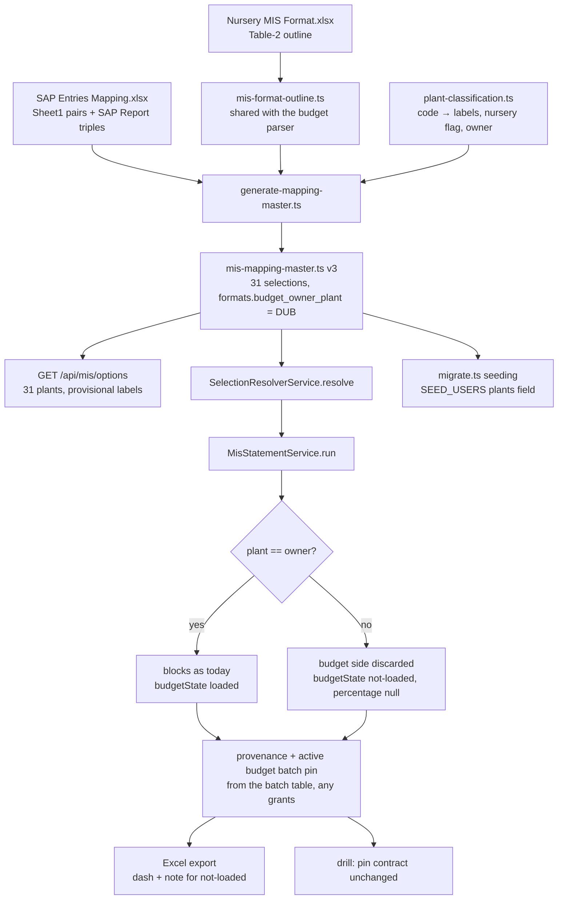

# Task — all-plants-backend

Story: `multi-plant` · plan: `plans/active/multi-plant-all-plants-in-the-mis-statement.md`

## Objective
Seed the mapping master for all 31 SAP plants from the client's mapping sheet through a
committed, re-runnable generator, so the plant dropdown offers every plant with provisional
Department / Function labels. Add the one rule the data cannot express — the format's budget
belongs to DUB — so a statement for any other plant carries a **not-loaded** budget state, the
Excel export writes a dash, and every statement pins the period's active budget batch as its
outline source regardless of the user's grants. Grant the demo admin every plant, with an
optional per-user plant list in `SEED_USERS`. Nothing in ingestion, the batch model, the drill
service or the assistant is edited (decisions 0033, 0035, 0036).

## Workflow

This task starts at the workbooks and stops at the wire: the statement and run responses, the
export, provenance and the seeded grants. It does not render anything (task 2) and does not
touch ingestion, the drill service or the assistant.

## Read before you write
- `backend/src/mapping/mis-mapping-master.ts` — the shipped one-selection master and its
  `entry()` / `bucket()` helpers with the two reason literals (`ABSENT_GL_REASON`,
  `CONFLICT_REASON`). Your generated file replaces it and MUST keep DUB's 28 entries and nine
  bucket rows byte-for-byte equal in meaning (same targets, same reasons).
- `backend/src/mapping/mapping-master.ts:100` — the duplicate-pair guard keyed on
  `(cost_center, gl_code)` across the whole master. It will reject the same 95 pairs recurring
  per plant; re-key it to `(plant_canonical, cost_center, gl_code)` and keep the alias-reuse and
  provisional-without-reason checks.
- `backend/src/ingest/mis-budget.parser.ts:60-130,199` — the outline walk and `stableLeafKey`.
  Extract them into `backend/src/ingest/mis-format-outline.ts` and import from both the parser
  and the generator; the parser's behaviour and its tests must not change.
- `backend/src/mis/mis-statement.service.ts:63-111` — `run()`: the outline comes from
  `outlines.findByBudgetPeriod`, the blocks from the governed projection, provenance from the
  blocks' `activeBatchIds`. `sqlBuilder.ts:216` gates the budget CTE on `'DUB' IN (scope)`, so
  for a user without DUB the budget batch never reaches provenance — the pin you add must come
  from the batch table, not from the SQL.
- `backend/src/mis/mis-selection.service.ts:84-100` — the run endpoint builds the same
  `MisSelectionScopeReadout`; both routes populate the new fields.
- `backend/src/mis/mis-statement-export.service.ts:80-90` — `writeMoney` for Budget and the
  percentage cell; add the dash branch here.
- `backend/src/config.ts:89-112` — `parseSeedUsers`; `backend/src/db/migrate.ts:43-80` — the
  admin scope seeding (today department / function / plant for DUB).
- `contract/src/api.ts:236,285` — `MisSelectionScopeReadout`, `MisStatementMeasureBlock`.

## Contract

### The generator and the classification table (0031)
- `backend/src/mapping/generate-mapping-master.ts`, run by a new backend script
  `master:generate` (`ts-node -T`, like `db:migrate`). Inputs: `docs/context/2026-08-20-srihari-phase1-data/SAP Entries Mapping.xlsx`
  (Sheet1 pairs on its **second** `Cost Center` column + GL; the SAP Report's observed
  `(plant, cost centre, GL)` triples), `Nursery MIS Format.xlsx` Table-2 through the shared
  outline helper, and `backend/src/mapping/plant-classification.ts`.
- `plant-classification.ts` is a committed table keyed by SAP plant code: canonical id, display
  label, department, function, `nursery` override, `provisional: true`. The nursery flag is
  derived from the extract (books Primary, secondary, Tertiary or Imported Sprouts) unless the
  table overrides it. `DUB-NUR` maps to canonical `DUB`, display `Agri - Nursery - DUB`, and
  carries DUB's nine bucket rows with their existing reasons. `H.O` → Corporate / Office. Every
  other code → its own canonical id, Operations / Unit unless nursery.
- Output: `mis-mapping-master.ts` with `version: 3`, one selection per plant, `mis_format:
  "nursery-mis-financial-v1"`, `provisional_labels: true`, entries = the 95 sheet pairs as leaf
  targets (a GL under several S.No rows resolved by the sheet's cost centre → section rule, as
  the shipped master did; an entry that resolves to zero or several leaves makes the generator
  fail loudly) plus one bucket row per observed pair the sheet does not name, reason
  `ABSENT_GL_REASON`, and `CONFLICT_REASON` for 50001902 / 50001903 booked under Primary. A new
  top-level `formats` map names `budget_owner_plant: "DUB"` for the format; the loader refuses
  a format without an owner.
- A hermetic test regenerates in memory and asserts deep equality with the checked-in constant.

### Budget owner and the not-loaded state (0033)
- `MisStatementMeasureBlock` gains `budgetState: "loaded" | "not-loaded"`. **The wire types of
  `budget`, `rollover`, `actual` and `percentage` do not change** — widening `budget` to null
  breaks the frontend build (`statement-view.tsx:286` types `formatMoney(FixedScaleMoney)`), and
  this task cannot touch the frontend. For a not-loaded block the service emits `budget: "0.00"`,
  `percentage: null`, and no over-budget / credit label; the frontend task switches on
  `budgetState` and never renders those placeholders. Say so in a code comment at the seam.
- The owner comes from the master (`formats[...].budget_owner_plant`). The service decides per
  statement: selection plant ≠ owner → every block `not-loaded`, the budget side of the
  projection result discarded before `buildTree` (row structure, zero-fill and DUB's output are
  unchanged). DUB → `loaded`, identical output to today (the existing service tests prove it).
- Export: on a not-loaded block write `–` into Budget, Roll-over and % cells and add one note
  row under the title: "Budget not loaded for this plant". The filename already carries the
  plant (`mis-statement.controller.ts:145`); assert it, do not change it.

### The outline pin for every plant
- `run()` adds the period's active budget batch to `provenance.activeBatchIds`
  (`source: "budget"`, the block-end period) from the batch table (a repository read, not the
  scope-gated SQL), de-duplicated against what the blocks already reported. For a non-owner
  plant this is the only budget entry and no amount is read. The drill's pin contract
  (`mis-drill.service.ts:139`, exactly one budget batch covering the block end) is unchanged and
  the drill service is NOT edited.

### Scope readout (both routes)
- `MisSelectionScopeReadout` gains `provisional?: boolean` and `plantDisplay?: string`
  (optional in the contract so the frontend build is untouched; always populated by both
  `POST /api/mis/statement` and `POST /api/mis/run`). DTOs and Swagger updated once, in
  `mis-selection.dto.ts` and `mis-statement.dto.ts`.

### Seeding
- `SEED_USERS` grammar: `email|display_name|role1+role2|PLANT1+PLANT2` — the fourth field is
  optional. An admin with no plant list is granted every `plant_canonical` in the master;
  a listed user is granted exactly those plants (validated against the master; an unknown code
  fails migrate loudly). Seeding reconciles `user_scope` plant rows to the list on every run
  (idempotent: re-running changes nothing). Department / function scope seeding is unchanged.
  Document the field in `README.md` next to the existing `SEED_USERS` sentence.

### Design (code shape, constitution)
`constitution/pnp-coding-standards-modular-monolith.md` and `03-modular-monolith-structure.md`
govern layout; `pnp-api-standards.md` and `pnp-swagger-api-documentation-standards.md` govern
the DTO change; `07-exception-handling.md` governs the generator's and loader's failures (typed
domain errors, never a bare `Error`). Task-specific: the generator, the classification table,
the outline helper and the master constant are four files with four jobs — never one file that
reads workbooks and also defines the master. The budget-owner rule lives in ONE place the
statement service and the export both call; the export must not re-derive it.

## Manual Verification
1. `npm -w @3f/backend run master:generate` from a clean checkout produces no diff.
2. Backend up against the documented `WAREHOUSE_PG_*` with the July batches loaded; sign in
   as the seeded admin; `GET /api/mis/options` lists 31 plants.
3. `POST /api/mis/statement` for `H.O` (Corporate / Office, July 2026): every block
   `budgetState: not-loaded`, `percentage: null` everywhere, Actual total ₹2,38,55,951;
   provenance carries the July budget batch. For DUB: byte-identical to before the change.
4. Export H.O: dashes in Budget / Roll-over / %, the note row, filename naming H.O.
5. Drill an H.O leaf from a user seeded with plants `H.O` only: footer foots.
6. `WAREHOUSE_DB_TEST=1 npm -w @3f/backend run test:warehouse-proof` includes the new 31-plant
   reconciliation proof: the 31 grand totals sum to ₹11,02,73,718.00 exactly.

## Out of scope
- Any frontend file; the assistant; ingestion; the drill service; a migration of any kind.
- Cascading selection tuples, plant-keyed budgets, the outline object, partial-YTD, upload
  reporting, the master-version pin (deferred, decision 0033); plant-aware Ask (0036).

## Proof
`python3 factory/scripts/verify.py`, plus the required hermetic leaves below, each judged by its
testcase **name** and executed count (a `--name` matching nothing still exits 0 — run the
negative control once per leaf). The 31-plant reconciliation and the non-owner drill footing
are warehouse-backed (`WAREHOUSE_DB_TEST=1`, `test:warehouse-proof`) and are recorded in the
task's tests.json with their executed counts; register the new DB file in `test:db`,
`test:warehouse-proof` and the db list of `tools/quality-gate.test.mjs`, and the new hermetic
file in `test:hermetic` and the hermetic list. None of the files in scope is in
`.prettierignore` (checked).

<!-- forge:contract -->
## Contract (recorded)

Rendered by the harness from the recorded decomposition; edit the decomposition, not this block. It is excluded from the plan's approval and grill digests, so a re-render never stales either.

**Objective.** Seed the mapping master for all 31 SAP plants from the client's mapping sheet through a committed generator and classification table, so the plant dropdown offers every plant with provisional Department / Function labels. Add the one rule the data cannot express: the format's budget belongs to DUB, so a statement for any other plant carries budgetState 'not-loaded' with Budget, Roll-over and % null on the wire (the contract was widened by the frontend task) and no over-budget label, the Excel export writes a dash, and every statement pins the period's active budget batch as its outline source regardless of the user's grants so the shipped drill keeps working. Grant the demo admin every plant, with an optional per-user plant list in SEED_USERS so a DUB-only user can be seeded. Ingestion, the batch model, the drill service and the assistant are not edited (decisions 0033, 0035, 0036).

**Acceptance criteria**

- Against the pinned July actuals batch, all 31 SAP plant codes are offered to a fully granted user, each renders a statement, and the 31 Grand Total Actuals sum to ₹11,02,73,718.00 in exact paise, proven by a gated warehouse fixture run per plant.
- DUB is unchanged: Actual ₹1,15,12,712.07 and Budget ₹1,00,50,136.29 for July 2026, every parent footing, unmapped-GL carrying its own Actual, the export matching; the existing statement-projection and golden proofs keep passing.
- Every (plant, cost centre, GL) triple in the July extract resolves exactly once via the generated master (version 3); classification is a pure function of the committed table and the extract's cost centres (fourteen July nursery codes Agriculture / Nursery, H.O Corporate / Office, the rest Operations / Unit); the eleven unnamed pairs resolve to unmapped-GL reusing the two existing reason literals so DUB's nine bucket rows are byte-for-byte unchanged; every new row is provisional with a reason; a hermetic test proves the checked-in master equals the generator's output; the format names DUB as budget owner and a format without an owner fails validation; the validator's duplicate-pair rule is re-keyed to (plant_canonical, cost_center, gl_code).
- The measure block becomes a discriminated union (loaded with money, or not-loaded with budget null, rollover null, percentage null) validated by the DTO; a non-owner plant's statement carries not-loaded on every block including the Grand Total with no over-budget or credit label; the Excel export writes a dash in those cells with a 'Budget not loaded for this plant' note; H.O renders 100% of its July net inside sections 8 Manpower and 9 Admin and ₹0 Actual on every nursery-only section; DUB carries loaded with cells unchanged; the frontend typechecks unchanged because it already narrows on the discriminant; the plant-specific filename is asserted as a regression.
- MisSelectionScopeReadout's provisional and plantDisplay and the plant option's provisional (contract widened by the frontend task) are populated by GET /api/mis/options, POST /api/mis/statement and POST /api/mis/run, with the DTOs and Swagger updated and each route's response tests covering them.
- Every statement pins the period's active budget batch in provenance as the outline source regardless of the user's grants, read through the outline repository (a new method on its interface), so no budget AMOUNT is returned for a non-owner plant (the projection may still read the format's budget rows for a user granted DUB; it never returns them); the warehouse-backed proof shows drill-down footing in exact paise for a leaf and for unmapped-GL on a non-owner plant for a user granted that plant alone; the drill service and its pin contract are not edited.
- SEED_USERS gains an optional fourth field listing canonical plant codes; absent, an admin is granted every plant in the master; seeding is idempotent and reconciles scope to the configured list; README documents it; a user granted only DUB sees only DUB in options and drill with no row leaking; the assistant's hermetic suite passes unchanged.
- The two zero states and the three nil states stay distinct from the not-loaded state in hermetic tests; every proof is judged by junit testcase name and executed count (D-0024, D-0031); new test files are registered in backend/package.json and tools/quality-gate.test.mjs; no D-0006-listed file is edited.
- Decision 0036 governs the Ask view: actual_by_gl_month keeps its DUB literal; decision 0033's consequence about that view is deferred with the plant-aware assistant.
- Proof split: exactly-once resolution, the 31-plant sum (₹11,02,73,718.00) and H.O's sections are proven hermetically from the July extract through the master; the 31 rendered statements, DUB's unchanged output and the non-owner drill footing are proven by backend/src/warehouse/all-plants-reconciliation.db.test.ts under WAREHOUSE_DB_TEST=1, registered in test:warehouse-proof and the self-skipping hermetic list (never test:db), and recorded in tests.json with executed counts.

**Write scope** (what `stage done` measures the diff against)

- (none recorded)

**Required tests** (run by `stage done`)

- (none recorded)

**Verify commands**

- (none recorded)
<!-- /forge:contract -->
