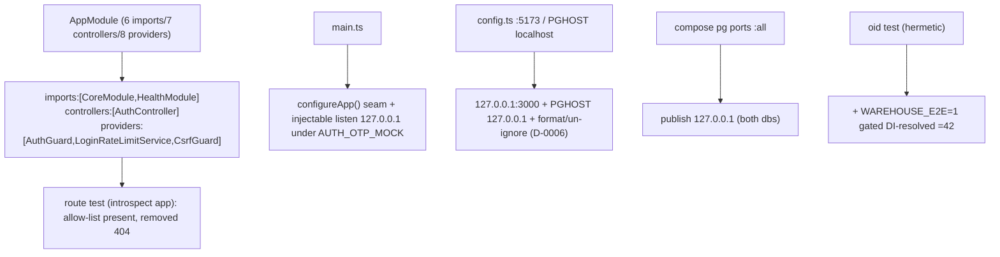

# Task plan — api-surface-trim

## Context
platform-base tasks 1–5 delivered the vendored backend + contract, the warehouse adapter,
boot + OTP auth, the 3F rebrand, and the repo-wide quality gate. This task constrains the
API surface, closes inherited defaults that make the backend unsafe/unreachable, adds a
fresh `/health`, and hardens the warehouse E2E. The app-wide global exception handler and
structured logging are a **separate** task (`backend-observability`, decision 0013) — out
of scope here.

Verified against current backend (post-merge master):
- `AppModule`: `imports:[CoreModule, AdminModule, ConversationsModule, UsageModule, MeasuresModule, HelpModule]`,
  `controllers:[AuthController, UsersController, GrantsController, ChatController, SavedController, PinsController, ReportsController]`,
  `providers:[ChatService, SavedService, PinsService, ReportsService, AuthGuard, AdminGuard, LoginRateLimitService, {APP_GUARD→CsrfGuard}]`.
  **Auth resolves from providers in AppModule, not CoreModule.**
- `main.ts:31` `app.listen(cfg.port)` — no host. `config.ts:114` `frontendOrigin`→`localhost:5173`, `PGHOST`→`localhost`.
- `postgres.adapter.oid.test.ts` already hermetic-listed; `test:db` excludes it. `config.ts` on the `.prettierignore` D-0006 list.
- No `supertest`/`@nestjs/testing` — tests introspect the initialized app via the express adapter, no new dep.

## Write scope
`backend/src/app.module.ts`, `backend/src/health/`, `backend/src/config.ts`,
`backend/src/main.ts`, `backend/src/warehouse/`, `docker-compose.yml`, `backend/test/`,
`backend/package.json`, `tools/quality-gate.test.mjs`, `.prettierignore`, and the four
colocated `backend/src/*.test.ts` files. (Not `backend/test/` — it does not exist.)

## Decisions (conduct §9)
- **Exact trim.** Keep `imports:[CoreModule, HealthModule]`, `controllers:[AuthController]`,
  `providers:[AuthGuard, LoginRateLimitService, {provide:APP_GUARD, useClass:CsrfGuard}]`;
  remove the eleven capability registrations (code stays in the tree). Assuming CoreModule
  provides the auth guards breaks auth.
- **`/health` fresh code** → the standard envelope `{success:true, data:{status:"ok"}, error:null}`
  via a typed success DTO + example, `@ApiTags`/`@ApiOperation`/`@ApiOkResponse(typed)`.
- **Observability split out** (decision 0013): global handler + logging are their own task.
- **Auth tests aren't hermetic.** The real auth path needs a Postgres pool, and CI excludes
  the DB auth test — no-enumeration/session-continuity/RBAC/audit stay **demonstrated
  Postgres evidence**. Hermetic tests here are DB-free only.
- **Injectable listen seam** so a fake app can assert the `127.0.0.1` bind without a socket.

## Workflow

## Approach
1. **Trim `AppModule`** to the exact shape; add `HealthModule`.
2. **`configureApp(app)` seam** installing CORS + Swagger, used by both `bootstrap()` and
   tests (tests call `app.init()`, no socket); `bootstrap()` uses an injectable listen seam.
3. **`HealthModule`** — `GET /health` returns the envelope via a typed success DTO + example,
   `@ApiTags`/`@ApiOperation`/`@ApiOkResponse(typed)`; keeps the narrow non-versioned exception.
4. **Loopback/CORS/PGHOST** — `main.ts` binds `127.0.0.1` under `AUTH_OTP_MOCK`; `config.ts`
   defaults `frontendOrigin`→`http://127.0.0.1:3000`, `PGHOST`→`127.0.0.1`; compose publishes
   both db ports to `127.0.0.1`. **Format `config.ts` + remove its `.prettierignore` line** (D-0006).
5. **Swagger** absent when `NODE_ENV=production` regardless of `ENABLE_SWAGGER`.
6. **Warehouse E2E** — resolve `WAREHOUSE`/`SelectionExecutor` from app-module DI; a
   `WAREHOUSE_E2E=1`-gated live path in the existing hermetic oid test proving `=42` (not test:db).
7. **Hermetic DB-free tests** (decision 0009 form + negative control) added to `test:hermetic`
   and the guard's pinned graph: `app.routes.test.ts`, `swagger-production.test.ts`,
   `loopback-profile.test.ts`, `health/health.controller.test.ts`. `app.init()` is NOT DB-free
   as-is (`AuthoredMeasureRegistry.onModuleInit()` queries `authored_measures`), so these tests
   **stub only `AuthoredMeasureRegistry.onModuleInit`** before `app.init()` — real AppModule
   container/routes, no lifecycle change, no new dep. The Swagger-absence test covers the full
   docs surface: `/api/docs`, `/api/docs/**`, `/api/docs-json`, `/api/docs-yaml` all 404 in
   production. Login/RBAC/audit, no-enumeration, session-continuity, and the live warehouse
   `=42` stay demonstrated evidence.

## Acceptance criteria
- AppModule keeps exactly imports:[CoreModule, HealthModule], controllers:[AuthController], providers:[AuthGuard, LoginRateLimitService, {provide:APP_GUARD, useClass:CsrfGuard}]; every capability registration is removed — imports AdminModule/ConversationsModule/UsageModule/MeasuresModule/HelpModule, controllers UsersController/GrantsController/ChatController/SavedController/PinsController/ReportsController, providers ChatService/SavedService/PinsService/ReportsService/AdminGuard — so their routes (incl. /api/admin/users, /api/admin/grants, /api/admin/usage, /api/help) return 404, and Swagger (api/docs + api/docs-json) is unconditionally absent when NODE_ENV=production
- GET /health returns the standard response envelope {success:true, data:{status:ok}, error:null} via a decorated success DTO with an example and @ApiTags/@ApiOperation/@ApiOkResponse(typed); it keeps the spec's narrow non-versioned-health exception. The app-wide global exception handler and structured logging are NOT this task's concern (backend-observability, decision 0013)
- the backend mock-OTP profile is loopback-only: main.ts binds 127.0.0.1 when AUTH_OTP_MOCK is truthy via a small injectable listen seam, config.ts defaults frontendOrigin to http://127.0.0.1:3000 (FRONTEND_ORIGIN overrides) and PGHOST to 127.0.0.1, docker-compose publishes BOTH the app-db and warehouse-db ports to 127.0.0.1, and config.ts is formatted and removed from the .prettierignore D-0006 list in the same change
- the warehouse E2E resolves WAREHOUSE and SelectionExecutor from the application module's DI container and proves validate->explain->execute returns SUM(WarehouseFixture.value)=42 through a WAREHOUSE_E2E=1-gated path in the already-hermetic-listed oid test (skipped when unset, NOT added to test:db)
- hermetic DB-free tests (route allow-list, production-Swagger absence, loopback/CORS/PGHOST/compose defaults, /health envelope body + generated schema) are added to test:hermetic and the guard's pinned graph; login/RBAC/audit, no-enumeration and session-continuity remain DEMONSTRATED Postgres evidence via the established DB test (they cannot be hermetic — the real auth path needs a Postgres pool)

## Reviewer focus
The spec is normative (§"Confirmed scope", §"Local runtime contract"). EXACT AppModule shape
(verified): keep imports:[CoreModule, HealthModule], controllers:[AuthController], providers:
[AuthGuard, LoginRateLimitService, APP_GUARD→CsrfGuard] — these live in AppModule, NOT
CoreModule; a naive trim breaks auth. Remove the eleven capability registrations. Route test
introspects the initialized app (configureApp()+app.init(), no socket, no new dep — express
adapter router); removed routes 404; Swagger absent in production regardless of ENABLE_SWAGGER.
SECURITY: 127.0.0.1 bind under AUTH_OTP_MOCK via an injectable listen seam + compose publish
for BOTH dbs close a LAN admin login; config.ts defaults frontendOrigin to 127.0.0.1:3000 AND
PGHOST to 127.0.0.1. /health: typed success DTO returning the envelope, tested for body AND
generated schema; global handler/logging OUT of scope (decision 0013 → backend-observability).
WAREHOUSE E2E resolves from app-module DI; prove =42 via a WAREHOUSE_E2E=1-gated path in the
already-hermetic oid test, NOT test:db. D-0006: format config.ts and remove its .prettierignore
line. New hermetic tests join test:hermetic AND the guard's pinned graph. TESTS ARE DB-FREE
ONLY: no-enumeration/session-continuity/RBAC/audit stay demonstrated Postgres evidence (real
auth needs a pool), not required hermetic tests. PLAN/0013: the approved plan's compliance note
still reads 'deferred'; it is SUPERSEDED by accepted decision 0013 (decisions govern when plan
prose drifts) and the spec is reconciled — the plan is left as-approved to avoid a
disproportionate story re-approval; plans/deferrals.md and docs/ are not in this leaf's write_scope.

## Verify
- `npm run build:contract && npm run build:backend && npm run typecheck` green.
- `npm run lint && npm run format:check` green (incl. the now-un-ignored config.ts); the guard passes with its updated pinned graph.
- The four hermetic tests pass from repo root with attributable JUnit testcases (decision 0009, negative-control checked) and are in test:hermetic.
- Demonstrated (host): AUTH_OTP_MOCK=true → binds 127.0.0.1:4000; mock-OTP login works + audit row + no enumeration; /health returns the enveloped body; capability routes 404; WAREHOUSE_E2E=1 → DI-resolved query returns 42; NODE_ENV=production → /api/docs 404.

## Manual Verification
1. `docker compose up -d app-db warehouse-db warehouse-seed`; `npm install`; `npm run build`; `npm run db:migrate`.
2. `AUTH_OTP_MOCK=true NODE_ENV=development FRONTEND_ORIGIN=http://127.0.0.1:3000 npm run dev:backend` → **observe** it binds `127.0.0.1:4000`.
3. `curl -s http://127.0.0.1:4000/health` → **observe** `{"success":true,"data":{"status":"ok"},"error":null}`; `curl -s -o /dev/null -w "%{http_code}" http://127.0.0.1:4000/api/admin/users` → **observe** `404`.
4. Mock-OTP login for `admin@example.invalid` (`000000`) → **observe** success + appended `auth.otp_verified` audit row; role via `/api/auth/me`; unknown email gets the same uniform ack.
5. `WAREHOUSE_E2E=1 WAREHOUSE_DRIVER=postgres WAREHOUSE_PG_HOST=127.0.0.1 WAREHOUSE_PG_PORT=5433 WAREHOUSE_PG_USER=warehouse WAREHOUSE_PG_PASSWORD=warehouse-local WAREHOUSE_PG_DATABASE=warehouse node --require ts-node/register --test backend/src/warehouse/postgres.adapter.oid.test.ts` → **observe** the DI-resolved warehouse query returns `42`.
6. `NODE_ENV=production ENABLE_SWAGGER=true npm run dev:backend` → **observe** `/api/docs` 404.
