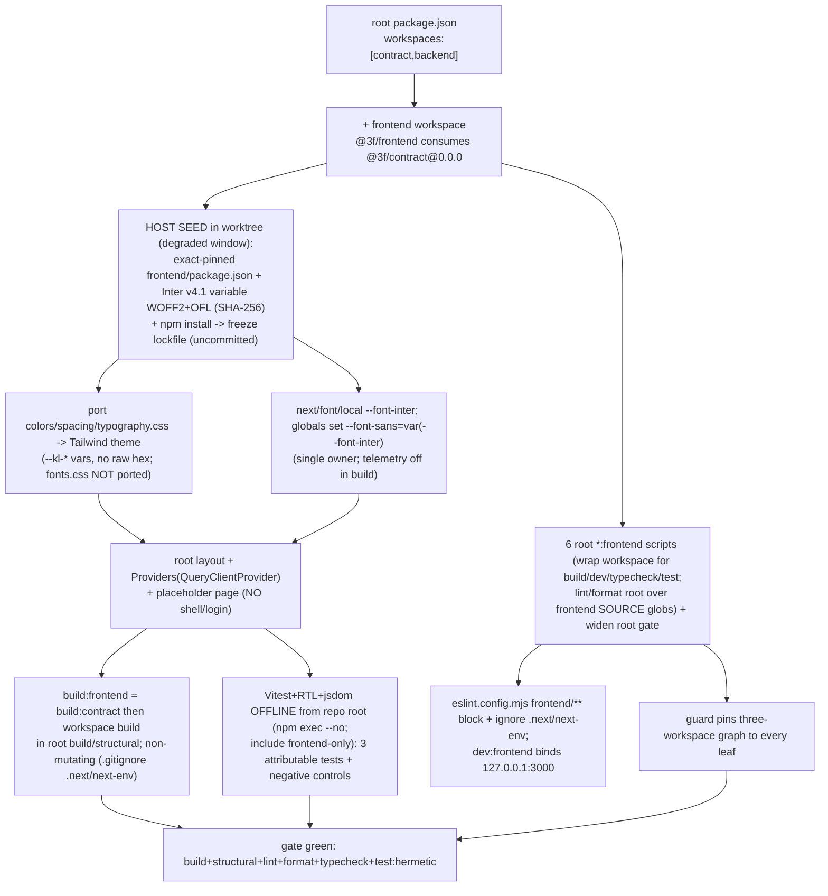

# Task plan — frontend-foundation

## Context
platform-base tasks 1–6 delivered the vendored NestJS backend + `@3f/contract`, the Postgres
warehouse adapter, boot + email/OTP auth, the Pulse→3F rebrand (decision 0010), the repo-wide
quality gate (backend + contract), and the API-surface trim + loopback hardening. This task
scaffolds the **fresh** frontend (decisions 0006/0007): a Next.js (App Router) `frontend/` npm
workspace and its toolchain — the `_ds`-token Tailwind theme, locally vendored Inter via
`next/font/local`, in-tree shadcn/ui primitives, a TanStack Query provider, and the frontend
quality gate — plus **widening the repo-wide gate** (build + lint + format + typecheck + test) to
the frontend. It ships **no app screens**: a minimal root layout (fonts + providers) and a
placeholder page only, so `next build` succeeds. The **user-facing shell + OTP login is the next
task** (`frontend-shell-login`, T8, `user_facing: true`); this foundation is what it builds on.

## user_facing = false (explicit, bounded exception)
This task renders only a **build/test smoke** — a placeholder page + one primitive — not a product
surface a user navigates to. The approved plan places the first user-facing surface (the shell + OTP
login, WITH the frontend design skills + functional check) in **frontend-shell-login (T8,
user_facing: true)**; the human set "design review on T8" (2026-09-04). No design-fidelity or
functional-check gate is owed here.

## Decisions 0001–0013 disposition (canon)
- **APPLY here:** 0006 (fresh frontend), 0007 (Next.js), 0010 (consume `@3f/contract`); 0009 in its
  Vitest analogue (real named tests; `TS_NODE_PROJECT` is backend ts-node only, N/A).
- **Deferred / scope-out:** 0011 / D-0003 keeps deployment-readiness (prod CORS, secret ownership,
  real email, residency) out — this is the local mock-OTP PoC. 0001 (PoC scope) + 0005 (sign-off) are
  satisfied context.
- **N/A (later screens):** 0002 (Phase-1 MIS), 0003 (MIS presentation).
- **N/A (backend only):** 0004 (governed joins), 0008 (backend vendored snapshot — the frontend is
  fresh), 0012 (vendored-API deviation), 0013 (backend observability).
- **D-0005**: this task lands the 3F `_ds` token coverage that replaced `backend/src/atlasTokens.test.ts`.
- npm workspaces (not Nx): documented `constitution/01` deviation, confirmed 2026-09-04; no silent
  tooling defaults (`constitution/09` §9).

## Provisioning — the seed is the FIRST in-worktree step (no-network sandbox, non-circular)
The grill binds the contract + approved plan + master tree (no `frontend/` yet). **After** task start,
**inside the worktree**, the orchestrator runs a ledgered **degraded-window host SEED** (the implementer's
sandbox has no network); this is not a pre-grill mutation and does not need `git status` clean:
1. **Manifest** — author `frontend/package.json` with **exact-pinned** versions (no `^`/`~`), `@3f/contract`
   pinned to `0.0.0` as a **manifest-level** workspace dep (no fabricated runtime import — first real use is T8);
   add `frontend` to root `workspaces`.
2. **Font (provenance-checked)** — vendor the **Inter variable** WOFF2 from **rsms/inter release v4.1**
   (`InterVariable.woff2`) + its `OFL.txt` under `frontend/app/fonts/`; record source + release + filename +
   the **expected SHA-256** (taken from that official immutable release) in `frontend/app/fonts/PROVENANCE.md`
   and verify the downloaded bytes against that **pre-declared** digest at seed (not a self-computed one).
3. **Freeze** — host `npm install` writes `package-lock.json` (the binding pin).
These seed changes are **uncommitted**; the delegate then writes all code/config/tests OFFLINE on top of
them and **never edits dependency versions**. The whole diff (seed + code) is measured at stage-done — the
tree is legitimately dirty *during* the stage. `npm ci` clean-install determinism is CI's networked job.

## Seed dependency set (exact-pinned; frozen by the lockfile)
Target versions the seed pins (the lockfile is authoritative if a patch resolves differently):
- runtime: `next` 15.1.6, `react` 19.0.0, `react-dom` 19.0.0, `@tanstack/react-query` 5.64.2,
  `class-variance-authority` 0.7.1, `clsx` 2.1.1, `tailwind-merge` 2.6.0, `@radix-ui/react-slot` 1.1.1,
  `@3f/contract` 0.0.0 (workspace). **`lucide-react` is NOT seeded here** (deferred to T8, its first consumer).
- toolchain: `typescript` 5.7.3, `@types/react` 19.0.7, `@types/react-dom` 19.0.3, `@types/node` 22.10.7,
  `tailwindcss` 3.4.17, `postcss` 8.5.1, `autoprefixer` 10.4.20, `eslint-config-next` 15.1.6.
  **No second `eslint`** — the frontend is linted by the ROOT ESLint (9.x); the root config wraps
  `eslint-config-next/core-web-vitals` (which 15.1.6 ships as **eslintrc**, not flat) into flat config via
  **`FlatCompat`** from `@eslint/eslintrc` (ships with ESLint).
- test: `vitest` 2.1.8, `@vitejs/plugin-react` 4.3.4, `@testing-library/react` 16.1.0,
  `@testing-library/jest-dom` 6.6.3, `@testing-library/dom` 10.4.0, `jsdom` 25.0.1. Prettier stays the root version.

## Write scope
`frontend/` (the whole new workspace), `package.json`, `package-lock.json`, `eslint.config.mjs`,
`tools/quality-gate.test.mjs`. **NOT `.envrc`** (FACTORY_* names unchanged) and **NOT `.prettierignore`**
(format globs are source-scoped, so no new ignore — D-0006 untouched). This JIT scope is the binding
contract; it refines the story plan's abbreviated T7 sketch (adds the gate-widening files the decomposition
objective already assigns T7); the story prose is left as-approved to avoid a disproportionate re-approval.

## Workflow

## Approach
1. **Workspace** — add `frontend` to root `workspaces`; the seeded `frontend/package.json` (`@3f/frontend`,
   private, exact deps) + `frontend/tsconfig.json` **pre-authored with the Next TS plugin + `.next/types`
   include** and `frontend/.gitignore` (`.next/`, `next-env.d.ts`, `*.tsbuildinfo`) so the first build is non-mutating.
2. **Theme** — port the `_ds` `colors.css`, `spacing.css`, `typography.css` **definition** files (they carry
   the `--kl-*` hex, as definitions must); the Tailwind config + all **components** consume `var(--kl-*)` with
   **no raw hex**. A hermetic test asserts **set-level parity** — every source `--kl-*` is present in the ported
   theme (D-0005). **Do NOT port `fonts.css`**.
3. **Fonts** — `next/font/local` → `InterVariable.woff2` exposing `--font-inter`; globals set
   `--font-sans: var(--font-inter), <fallbacks>` **after** the token import (single owner). OFL + PROVENANCE
   (source/release/filename/SHA-256) committed. A hermetic test scans **only** runtime `frontend/` source
   (`app/`, `src/`, config) for `next/font/google` and `fonts.googleapis.com`/`fonts.gstatic.com`.
4. **Primitives + providers** — an in-tree `button` primitive (`@radix-ui/react-slot`) + `cn()` util; a root
   layout wiring the font + a client `Providers` boundary (`QueryClientProvider`); a **placeholder page**
   (token-themed landing, NOT the Dashboard/shell/login).
5. **Scripts** — workspace `@3f/frontend`: `build` (`NEXT_TELEMETRY_DISABLED=1 next build`), `dev`
   (`next dev -H 127.0.0.1 -p 3000`), `typecheck` (`tsc --noEmit`), `test` (vitest). Root: `build:frontend`
   (`= npm run build:contract && npm -w @3f/frontend run build`), `dev:frontend`, `typecheck:frontend`,
   `test:frontend` **wrap** those; `lint:frontend`/`format:check:frontend` run root ESLint/Prettier over
   **frontend source globs** (`frontend/app`, `frontend/src`, named config — excluding generated files). Add
   `build:frontend` to root **`build`**; widen root `lint`, `format:check`, `typecheck`, `test:hermetic`.
6. **ESLint** — `eslint.config.mjs` gains a `frontend/**` block that wraps `eslint-config-next/core-web-vitals`
   into flat config via **`FlatCompat`** (`@eslint/eslintrc`) so the frontend genuinely gets Next+TS rules, plus
   an `ignores` entry for `frontend/.next/**` + `next-env.d.ts`; the frontend reuses the **root** ESLint (no second pin).
7. **Vitest** — `frontend/vitest.config.ts` (jsdom, `@vitejs/plugin-react`, RTL setup) with **`root` = repo
   root** and **`test.include` = `frontend/**/*.test.{ts,tsx}`** (frontend-only). Run **offline** via
   `npm exec --no -- vitest` (never `npx`). Three attributable tests, each with a negative control (0009).
8. **Guard** — widen `tools/quality-gate.test.mjs`: prove the frontend lint is **effective** (run ESLint over a
   `frontend/**` fixture with a known violation and assert it is reported — a silently-empty config fails); pin the
   six `*:frontend` bodies (real `build:frontend` incl. `build:contract` + `NEXT_TELEMETRY_DISABLED`, real vitest
   `test:frontend`) + the widened root `build`/`structural`/`lint`/`format:check`/`typecheck`/`test:hermetic`;
   assert the non-mutating `frontend/.gitignore` + tsconfig entries; keep the D-0006 baseline + CI pins (no
   `.prettierignore` edit).

## Acceptance criteria
- frontend is a third npm workspace (root workspaces adds "frontend") with a pre-authored tsconfig (Next TS plugin + .next/types include) and a frontend/.gitignore for .next/, next-env.d.ts and *.tsbuildinfo, so `next build` is NON-MUTATING - made falsifiable by the guard (it asserts those .gitignore entries and the tsconfig plugin/include) and by stage-done, which rejects any tracked-file change from verification. The root *:frontend scripts that need the app context (build, dev, typecheck via tsc --noEmit, test via vitest) WRAP the @3f/frontend workspace scripts; build:frontend runs build:contract first (= npm run build:contract && npm -w @3f/frontend run build) as workspace dependency-ordering hygiene and is added to root `build` so `structural`/FACTORY_STRUCTURAL_CMD compiles all three workspaces. @3f/contract is declared as a MANIFEST-level workspace dependency (pinned 0.0.0) - this foundation adds no runtime import (the first genuine consumption is frontend-shell-login's api.ts transport). A minimal root layout (fonts + providers) + a placeholder page exist so the build succeeds; NO Dashboard/shell/nav/top-bar/login screens (frontend-shell-login owns those)
- the Tailwind theme is driven entirely by the _ds token variables ported from docs/design/3F-Financial-MIS/_ds/knacklabs-design-system-63be358e-2e64-4441-bcd0-253b9c903a8b/tokens/colors.css, spacing.css and typography.css: the ported token DEFINITION files carry the --kl-* definitions (with the source hex, as a definition must), while the Tailwind config and ALL components CONSUME them via var(--kl-*)/theme tokens with NO raw hex; a hermetic test asserts SET-LEVEL PARITY - every --kl-* variable the source colors/spacing/typography.css defines is present in the ported theme (the D-0005 replacement coverage), with a negative control. fonts.css is NOT ported (its Google @import is design-reference only). The runtime font is a locally vendored Inter VARIABLE WOFF2 from the official immutable rsms/inter release v4.1 (InterVariable.woff2 + OFL.txt); its expected SHA-256 is taken from that official release and committed as the pin in frontend/app/fonts/PROVENANCE.md, and the host seed verifies the downloaded bytes against that PRE-DECLARED expected digest (not a self-computed one). It loads via next/font/local exposing --font-inter; globals set --font-sans: var(--font-inter), <fallbacks> AFTER the token import so the local font is the SINGLE owner. next/font/google is never imported and a hermetic test scans ONLY runtime frontend/ source (app/, src/, config) for next/font/google and fonts.googleapis.com/fonts.gstatic.com. NEXT_TELEMETRY_DISABLED=1 is set in the workspace build script (disabling Next telemetry, not claimed as full network proof); dev:frontend binds loopback 127.0.0.1:3000
- root scripts build:frontend, dev:frontend, lint:frontend, format:check:frontend, typecheck:frontend and test:frontend exist and name real bodies; build/dev/typecheck/test wrap the @3f/frontend workspace scripts, while lint and format run from repo root over frontend SOURCE globs (frontend/app, frontend/src and named config, excluding generated files so NO .prettierignore change is needed) using the root eslint.config.mjs and root Prettier; eslint.config.mjs gains a frontend/** block that translates eslint-config-next/core-web-vitals into flat config via FlatCompat (@eslint/eslintrc) - so the frontend actually receives the Next + TypeScript rules rather than a silently-empty config - and ignores frontend/.next/ + next-env.d.ts, reusing the root ESLint (no second eslint pinned); the ESLint + Prettier + tsc --noEmit gate runs green from repo root with root lint, format:check and typecheck widened to include the frontend
- a pinned, local, OFFLINE Vitest + React Testing Library + jsdom runner (invoked via `npm exec --no`, never npx) executes from repo root; frontend/vitest.config.ts sets root to the repo root and scopes test.include to frontend/**/*.test.{ts,tsx} so it never discovers the backend suite. The ATTRIBUTABLE JUnit testcases come from the task's required_tests stage-proof commands (which force --reporter=junit) - the token-parity, local-font/no-google-font source-scan and TanStack-Query-provider tests, each with a negative control (decision 0009); root test:hermetic runs the frontend vitest suite for pass/fail gating (not a JUnit claim), and test:hermetic is one of this task's verify_commands. Delegated verification runs against the host-seeded node_modules (no network, so no `npm ci`); clean-install determinism via `npm ci` against the frozen package-lock.json is CI's networked job
- the repo-wide quality gate is widened to the frontend, pinned to every runnable leaf, and its EFFECTIVENESS is proven: the quality-gate guard (tools/quality-gate.test.mjs) runs ESLint over a frontend/** fixture carrying a known violation and asserts it is reported (so a silently-empty frontend config fails), pins the six *:frontend bodies (the real build:frontend with build:contract + NEXT_TELEMETRY_DISABLED and the real vitest test:frontend, not just names) and the widened root build/structural/lint/format:check/typecheck/test:hermetic, and asserts the non-mutating-build .gitignore + tsconfig entries; eslint.config.mjs covers frontend/** and ignores generated output; NO .prettierignore change is made (source-scoped format globs) so D-0006 is untouched; frontend dependencies (including @3f/contract 0.0.0) are exact-pinned (no ^/~) and frozen by package-lock.json (CI uses npm ci); the D-0006 baseline and CI trigger pins stay intact

## Reviewer focus
FOUNDATION ONLY - no app screens (shell/nav/top-bar/login are T8). USER_FACING=false is deliberate: a
build/test smoke (placeholder + one primitive), design-reviewed surface + functional check are T8's
("design review on T8", human 2026-09-04). SEED is the first in-worktree step (degraded window) AFTER task
start - NOT a pre-grill mutation; it authors exact-pinned frontend/package.json + Inter v4.1 WOFF2 (+OFL
+SHA-256 provenance, verified) + host npm install (freeze lockfile), leaving UNCOMMITTED changes the
delegate builds on offline; whole diff measured at stage-done (tree dirty during the stage, not 'clean
before delegate'). STORY-PLAN: JIT write_scope is binding; it refines the abbreviated T7 sketch (adds
eslint.config.mjs + guard per the decomposition objective; drops .envrc/.prettierignore - no change
needed); story prose left as-approved. TOKENS ONLY (no hex) from colors/spacing/typography.css (D-0005);
fonts.css NOT ported. FONT single-owner: next/font/local --font-inter; globals override --font-sans after
the token import. SCAN runtime source only (app/src/config; not build output, not docs/design). LINT:
reuse ROOT eslint (no second pin); eslint.config.mjs frontend/** flat block + ignore .next/next-env.
VITEST offline (npm exec --no, never npx) + frontend-only include (no backend/DB discovery) + 3 attributable
tests w/ negative controls; delegated verify uses seeded node_modules (no npm ci - CI's job). NON-MUTATING
build (.gitignore .next/next-env; tsconfig pre-authored). BUILD:frontend in root build/structural, builds
@3f/contract first. dev:frontend 127.0.0.1:3000. GUARD every leaf; D-0006 + CI pins intact. lucide-react
deferred to T8. DECISIONS: 0006/0007/0010 APPLY; 0009 in its Vitest analogue; 0011/D-0003 keeps deployment
readiness deferred; 0001/0005 satisfied context; 0002/0003 later MIS screens N/A; 0004/0008/0012/0013
backend-only N/A. Consumes @3f/contract (dist/index.js). constitution/01 + /09 §9.

## Verify
- `npm run build` green — builds contract, backend AND frontend (`next build`, telemetry off); `npm run
  structural` therefore covers the frontend; the build leaves no git-visible change (`.next/`, `next-env.d.ts` ignored).
- `npm run typecheck` (incl. frontend `tsc --noEmit`), `npm run lint`, `npm run format:check` green.
- `npm run test:hermetic` runs the three frontend Vitest tests (attributable JUnit, negative controls
  checked, google-font source-scan) + the widened guard, all green with the three-workspace pinned graph.
- (delegated verify uses the host-seeded node_modules; `npm ci` is CI's networked check.)

## Manual Verification
1. host seed done → `frontend/node_modules` present via the frozen lockfile; PROVENANCE SHA-256 verified.
2. `npm run build:frontend` → **observe** a successful `next build`; runtime source contains no
   `next/font/google` / `fonts.googleapis.com` reference (source scan) and telemetry is disabled;
   `git status` shows no generated-file churn (`.next/`, `next-env.d.ts` ignored).
3. `npm run dev:frontend` → **observe** Next on **127.0.0.1:3000** (not 0.0.0.0); the placeholder page
   renders in the `_ds` theme (Off-White canvas, Inter) — no shell/nav/login.
4. `npm run lint && npm run format:check && npm run typecheck` → **observe** green across all three workspaces.
5. `npm run test:hermetic` → **observe** the three frontend Vitest testcases in the JUnit output,
   attributable to their files/names, their negative controls, plus the guard test passing.
