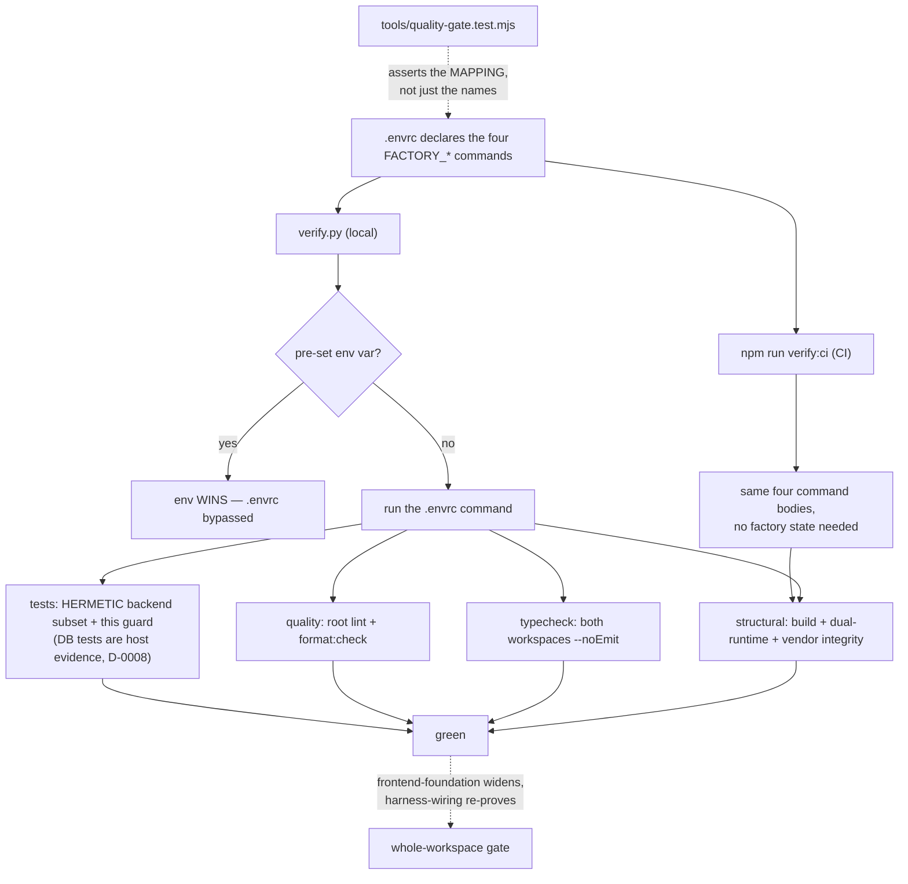

# Task plan — quality-gate-baseline

## Context
platform-base tasks 1–4 shipped the vendored backend + contract, the Postgres warehouse
adapter, boot + email/OTP auth, and the Pulse → 3F rebrand. Four tasks then write new
code. This task establishes the repo-wide quality gate **first**, so it constrains that
code as it lands rather than auditing it afterwards (plan grill, 2026-09-07).

Facts that shape the work, all verified against the repo rather than assumed:
- `backend/` and `contract/` have **no** ESLint or Prettier config and no `lint` /
  `format:check` scripts. Only `typecheck` and `build` exist at the root.
- `factory/scripts/verify.py` runs **only** the commands named by the `FACTORY_*`
  variables, treats quality as optional when undeclared, and **prefers a pre-set
  environment variable over `.envrc`**. An undeclared gate is an absent gate, and an
  overridden one is a bypassed gate.
- Root `typecheck` runs `build:contract`, which **emits**. It satisfies the name without
  giving the no-emit guarantee.
- `backend/src/atlasTokens.test.ts` reads `frontend/app/globals.css` at **import time** and
  throws. Decision 0006 excluded the vendored Pulse frontend and no `frontend/` exists, so
  the backend suite fails today.
- `verify.py` **cannot run in CI**: it requires an approved plan from the git-local run
  pointer (`.git/forge/run.json`), which a fresh checkout does not have. Fabricating that
  state in CI, or patching `verify.py`, would modify frozen harness machinery that vendor
  integrity forbids.

Scope is the baseline for the workspaces that exist **now**. `frontend-foundation` widens
each command to the frontend; `harness-wiring` widens the same CI workflow and re-proves it.

## Write scope
`.envrc`, `package.json`, `package-lock.json`, `eslint.config.mjs`, `.prettierrc.json`,
`.prettierignore`, `backend/package.json`, `contract/package.json`,
`tools/quality-gate.test.mjs`, `tools/junit-run.mjs`, `tools/junit-run.test.mjs`,
`.github/workflows/quality.yml`, `plans/deferrals.md` (the D-0005/D-0006 ledger this task's
contract requires), and deletion of `backend/src/atlasTokens.test.ts`.

## Decisions (tooling — conduct §9: no silent defaults)
- **ESLint + Prettier** — one linter and one formatter for all three workspaces, so there
  is a single mental model and one set of editor integrations. Confirmed in the approved
  plan; best-fit over Biome, whose weaker Next.js rule coverage would split the toolchain
  when the frontend lands.
- **Minimal dependency set: `eslint`, `prettier`, `typescript-eslint`** (the last is the
  parser ESLint needs for TypeScript). `@eslint/js` was installed during the host-side
  unblock and is now ADOPTED deliberately (human decision 2026-09-07): the config builds on
  `js.configs.recommended` as its base — a maintained obvious-error set rather than a
  hand-rolled list — with `typescript-eslint` layered for TypeScript parsing. The package
  earns its place; this is settled, not left to the implementer.
  Packages live in ROOT `devDependencies`, pinned in `package-lock.json` — one toolchain,
  not per-package copies. The lockfile is in scope; an install that leaves it unstaged is
  an incomplete change.
- **One named root Prettier config** (`.prettierrc.json`) and **one root flat ESLint
  config** (`eslint.config.mjs`), both invoked explicitly by the scripts. Prettier has no
  workspace `extends` convention, so the config **governs** by being the one the scripts
  point at. A single root ESLint config covers `backend/src`, `contract/src`,
  `contract/test` and `tools/` — `tools/quality-gate.test.mjs` belongs to no workspace, so
  per-workspace configs would leave "tools is linted" an implementer guess, and a third
  special-case config is worse than one root config that matches the root-owned dependency
  decision.
- **Conservative, syntax-only ESLint** — parse/syntax correctness and obvious errors;
  stylistic and type-aware rules OFF. The vendored tree contains explicit `any` usages and
  `console` suppressions, so a "recommended TypeScript baseline" would either demand broad
  rewrites or be weakened until it reports nothing. Both defeat the purpose.
- **`quality.yml` is a VERIFICATION workflow, not deployment.** No deploy step, no
  credentials, no environments, no infrastructure — decision 0011 still defers deployment
  and CD entirely. Stated so a later reader does not correctly refuse it as deferred work.
- **CI runs a product-owned aggregate, not `verify.py`** — `npm run verify:ci` executes the
  same four command bodies directly. `verify.py` needs factory run state CI does not have,
  and neither fabricating that state nor patching harness machinery is acceptable.
- **`node --test` via `tools/junit-run.mjs`** — the runner the four shipped backend tasks
  already use, rather than a second runner for one test.

## Workflow

## Approach
1. **Lint + format config** — ONE root flat ESLint config covering
   `backend/src/**`, `contract/src/**`, **`contract/test/**`** and **`tools/**`** (that
   contract directory ships but
   sits outside `src/`, so a `src`-only boundary would let "all touched TypeScript is
   linted" pass while a shipped test goes unchecked). Note: `contract/test` is outside the
   contract's `tsconfig` includes and has no runnable suite — that is D-0002's concern and
   stays deferred; this task lints and formats it, nothing more. `tools/quality-gate.test.mjs`
   is **both linted and format-checked**. So are the two pre-existing tools files,
   `tools/junit-run.mjs` and `tools/junit-run.test.mjs` (203 lines of factory tooling we
   own, not vendored product source): **format them** so the criterion stays literally true
   — all `tools/` MJS is checked, no exclusion, no special case. They do **not** go on the
   D-0006 list, which is for pre-existing backend/contract product source only. Formatting
   is the only permitted change to them.
2. **Scripts** — `lint` and `format:check` in each workspace manifest, plus root aggregates
   that fan out via `npm -w` and explicitly include `tools/` **and the config files this
   task adds** (`eslint.config.mjs`, `.prettierrc.json`, the `package.json` files, and
   `.github/workflows/quality.yml`) for format checking, with the executable MJS also
   linted. **Do NOT use a blanket `.github/**/*.yml` glob:** `factory-scaffold.yml`,
   `gardener.yml`, `harness-health.yml` and `roadmap-gate.yml` all fail Prettier today and
   are harness-owned — `forge upgrade` replaces them wholesale, so formatting them is
   discarded at the next upgrade and they are not ours to edit. List those four in
   `.prettierignore` under their own header naming that reason, separate from the D-0006
   product-source list.
   **The D-0006 list must not become a permanent exemption.** Prettier ignores whole
   *files*, and the list contains files `api-surface-trim` edits next (`config.ts`,
   `main.ts`, `app.module.ts`, `warehouse/postgres.adapter.ts`), so new lines written there
   would otherwise escape the "all new code is format-checked" claim. The `.prettierignore`
   header states the binding precondition: **before any task edits a listed file, that task
   formats it and removes it from the list in the same change**, and any new ignore entry
   requires a named, dated deferral. That is what makes the list self-liquidating. Both exit
   non-zero on violation.
3. **Fix the typecheck guarantee** — root `typecheck` invokes both workspaces' own
   `tsc --noEmit`, never an emitting build; emitting stays in the build/structural command.
4. **Remove `backend/src/atlasTokens.test.ts`** (D-0005). It cannot pass and its assertions
   target the excluded vendored frontend's Atlas tokens. Not skipped, not glob-excluded —
   a temporarily-excluded known failure is the false green this gate exists to stop.
   `frontend-foundation` owns 3F token coverage.
5. **Make it pass, within a hard boundary** — prefer configuration matching the current
   style. **Hard stop:** if clearing the gate needs more than trivial mechanical fixes to
   pre-existing source, STOP and raise a separately planned task. Do not hide a source
   remediation inside a baseline, and do not weaken the ruleset until it reports nothing.
6. **Declare the four commands in `.envrc`** under the exact names read from
   `factory/scripts/verify.py` (match character for character — a typo yields a silently
   skipped gate), with this **pinned script graph**:
   - `FACTORY_STRUCTURAL_CMD` → `npm run build` + `check_dual_runtime.py` + `check_vendor_integrity.py`
   - `FACTORY_TYPECHECK_CMD` → root `typecheck` (both workspaces, no-emit)
   - `FACTORY_QUALITY_CMD` → root `lint` + root `format:check`
   - `FACTORY_TEST_CMD` → the **hermetic** backend tests + this guard test. 42 tests across
     8 files need a migrated Postgres app DB and are **excluded** — they run on the host
     against docker-compose as demonstrated evidence (human decision, D-0008), the same
     treatment signals S-0002..S-0005 received. Split them by an explicit naming convention
     or declared file list, never a silent glob: a future DB-backed test must join the
     excluded set deliberately, not by accident. Name the split in the `.envrc` comment and
     in the guard so what CI does and does not enforce is legible.
7. **`npm run verify:ci`** — a product-owned aggregate running those same four bodies, so
   CI proves the identical gate without factory state.
8. **CI** (`.github/workflows/quality.yml`) — **this task creates it**; `harness-wiring`
   only widens its commands for the frontend and re-proves it. Trigger on `push` (all
   branches) **and `push` only** — a `pull_request` trigger duplicates verification for
   branch pushes with no stated benefit. Pin **Node 20** and **Python 3.11**, run **`npm ci`** (ESLint/Prettier/TypeScript binaries do
   not exist in a clean checkout otherwise), then `npm run verify:ci`. It must **not** set
   any `FACTORY_*` environment variable — a pre-set value silently replaces the `.envrc`
   command. Declare **`permissions: contents: read`** (without it the workflow inherits the
   repository's default `GITHUB_TOKEN` scope, broader than a read-only checkout needs and at
   odds with the verification-only claim), and pin every action to an **immutable commit
   SHA** with the version in a trailing comment — floating tags are mutable third-party
   dependencies in a workflow whose entire purpose is to be trustworthy.
9. **The guard test** — `tools/quality-gate.test.mjs` asserts the four variables are
   declared and non-empty **and that each means what it claims**, by resolving the named
   npm scripts to their bodies **recursively, down to every runnable leaf** (root `lint`,
   root `format:check`, and each workspace's own `lint`/`format:check` body). Pinning only
   `FACTORY_QUALITY_CMD → quality → lint && format:check` is not enough: repointing root
   `lint` at `echo lint` would leave that mapping and the guard green while ESLint never
   runs. Pin every leaf the four claims rest on: **both** workspaces' `typecheck` bodies
   (no-emit, not builds), the backend test body (so it cannot become a no-op), the
   lint/format leaves, and lint `eslint.config.mjs` itself — it is executable MJS, and is
   currently format-checked but not linted. For CI, finding a `push:` line is not enough:
   **reject additional triggers and push branch filters**, so "every push, push only" is
   falsifiable. It also validates `.envrc` **semantically** — `.envrc` is shell, which neither
   ESLint nor Prettier parses, so nothing here claims they cover it. Checking the graph in
   step 6 (not a substring match —
   `echo lint` must not pass). It also asserts `verify:ci` covers the same four bodies, and
   that no `FACTORY_*` override is set in the CI workflow.

## Acceptance criteria
- backend and contract have ESLint + Prettier config and lint / format:check scripts that run clean; the pre-existing vendored source is excluded from FORMAT checking via a .prettierignore listing those exact files and ledgered as debt (D-0006), while tools/, the config files this task itself adds, and all newly written code are format-checked (executable MJS also linted), the harness-owned .github workflows are excluded because forge upgrade re-vendors them, and .envrc is validated semantically by the guard test rather than by ESLint or Prettier
- the .envrc declares FACTORY_STRUCTURAL_CMD, FACTORY_TYPECHECK_CMD, FACTORY_QUALITY_CMD and FACTORY_TEST_CMD under those exact names, verify.py reads all four, and root verify.py is green
- FACTORY_QUALITY_CMD covers every workspace that exists at this point (backend + contract) and product CI runs the equivalent aggregate on every push; the frontend is added by frontend-foundation

## Reviewer focus
Load-bearing law: `constitution/09-agent-conduct.md` §9 (every tool pick justified above,
no ecosystem defaults) and §2 (a gate, not a style overhaul).
**THE MAPPING IS THE CONTRACT, NOT THE NAME.** A guard proving only that some npm script
exists is worthless: `FACTORY_QUALITY_CMD="npm run build"` would satisfy it and make
`verify.py` green while linting nothing. Check that the guard resolves scripts to their
bodies and asserts the step-6 graph, and that a substring dodge like `echo lint` fails.
**ENV OVERRIDE.** `verify.py` prefers a pre-set `FACTORY_*` variable over `.envrc`, so CI
must set none — otherwise the declared gate is bypassed while everything looks green.
**CI MUST BE EXECUTABLE.** `verify.py` needs an approved plan from the git-local
`.git/forge/run.json`, which a fresh checkout lacks; CI therefore runs the product-owned
`verify:ci` aggregate. Reject any attempt to fabricate factory state in CI or to patch
harness machinery — vendor integrity forbids it. CI must pin Node 20 + Python 3.11 and run
`npm ci`, or the binaries are simply absent.
**SCOPE.** Named manifests, configs, the one workflow, the guard test, and the ledgered
deletion of `backend/src/atlasTokens.test.ts` (D-0005). No behaviour change to vendored
source; no reformat-the-world commit that would bury later diffs and break the
"Pulse @ commit" review model (decision 0008). Reject BOTH a ruleset weakened until it
reports nothing AND a broad vendored-source remediation smuggled in under a baseline task —
the latter is a stop-and-replan.
**NEGATIVE CONTROLS (decision 0009), one per tool, distinct:** a parse/obvious-error
violation must fail ESLint (not Prettier); formatting-only drift must fail Prettier (not
the syntax-only ESLint policy); and all three mapping failures — missing variable,
misspelled script, command repointed at something that does not lint — must fail the guard.
A test that cannot fail proves nothing.

## Verify
- `npm run build:contract && npm run build:backend && npm run typecheck` green, with
  `typecheck` no-emit for both workspaces.
- `npm run lint && npm run format:check` green, each exiting non-zero on its own violation.
- `npm run test:hermetic` green — the hermetic backend subset plus the guard. It throws
  today on the absent frontend CSS and on the cwd bug. The 42 DB-backed tests
  (`test:db`) are demonstrated on the host against docker-compose, NOT in CI (D-0008).
- `python3 factory/scripts/verify.py` green at the repo root, all four `FACTORY_*` commands
  executed and none skipped — recorded **with all four variables unset**
  (`env -u FACTORY_STRUCTURAL_CMD -u FACTORY_TYPECHECK_CMD -u FACTORY_QUALITY_CMD -u FACTORY_TEST_CMD ...`),
  because a pre-set value wins over `.envrc` and would produce a false local green. CI is
  the enforced authority.
- `npm run verify:ci` green, and observably green in CI on the task's own PR.
- Required test passes from repo root with a matching, attributable JUnit testcase:
  `TS_NODE_PROJECT=backend/tsconfig.json node tools/junit-run.mjs --file tools/quality-gate.test.mjs --name "the four FACTORY commands are declared in .envrc and name scripts that exist" --report {report} --require ts-node/register`
  (decision 0009's canonical form — a `.mjs` test does not exempt it)
  — negative-control checked against all three mapping failures.

## Manual Verification
Steps a human runs to see it work, in order, with what they should observe:
1. `npm run lint` → **observe** ESLint runs over backend and contract (including
   `contract/test`) and exits 0.
2. `npm run format:check` → **observe** Prettier checks the configs, `tools/` and any new
   code — and exits 0. Open `.prettierignore` → **observe** the vendored source exclusion
   names its reason and D-0006.
3. Add formatting-only drift (e.g. `const x   = 1`) to `tools/quality-gate.test.mjs`,
   re-run both → **observe** `format:check` fails and `lint` still passes (the ruleset is
   syntax-only by design). Revert. Then add the same drift to a vendored backend file →
   **observe** `format:check` still passes, which is the ledgered exclusion working as
   intended, not a bug.
4. Introduce a parse error (e.g. a stray `{`), re-run both → **observe** `lint` fails.
   Revert.
5. `npm test -w @3f/backend` → **observe** green. Before this task it throws reading
   `frontend/app/globals.css`.
6. `python3 factory/scripts/verify.py` → **observe** four commands run, none skipped, all
   green.
7. Comment out `FACTORY_QUALITY_CMD` in `.envrc`, re-run `verify.py` → **observe** the
   quality gate is silently **skipped**, not failed. This is the failure mode the guard
   exists to catch. Restore it.
8. Run the guard test → **observe** it passes. Then, one at a time: delete a `FACTORY_*`
   line; misspell a script name; repoint `FACTORY_QUALITY_CMD` at `npm run build` →
   **observe** it fails each time, naming the specific problem. Restore after each.
9. `FACTORY_QUALITY_CMD="true" python3 factory/scripts/verify.py` → **observe** the
   environment value wins over `.envrc` and the gate passes without linting. This is why CI
   sets no `FACTORY_*` variable.
10. Push the branch → **observe** the CI workflow installs Node 20 and Python 3.11, runs
    `npm ci`, then `npm run verify:ci`, and reports green on the PR.
