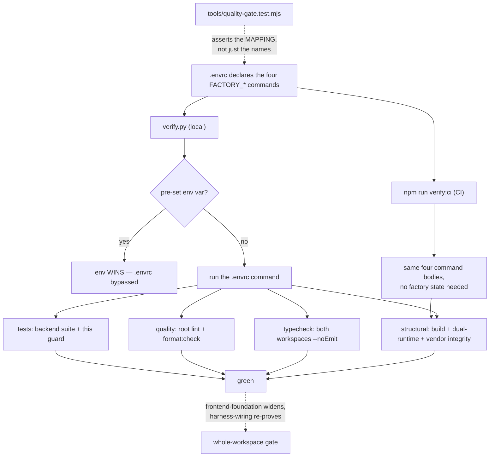

# Task plan — quality-gate-baseline

## Context
platform-base tasks 1–4 shipped the vendored backend + contract, the Postgres warehouse
adapter, boot + email/OTP auth, and the Pulse → 3F rebrand. Four tasks then write new
code. This task establishes the repo-wide quality gate **first**, so it constrains that
code as it lands rather than auditing it afterwards (plan grill, 2026-09-07).

Facts that shape the work, all verified against the repo rather than assumed:
- `backend/` and `contract/` have **no** ESLint or Prettier config and no `lint` /
  `format:check` scripts. Only `typecheck` and `build` exist at the root.
- `factory/scripts/verify.py` runs **only** the commands named by the `FACTORY_*`
  variables, treats quality as optional when undeclared, and **prefers a pre-set
  environment variable over `.envrc`**. An undeclared gate is an absent gate, and an
  overridden one is a bypassed gate.
- Root `typecheck` runs `build:contract`, which **emits**. It satisfies the name without
  giving the no-emit guarantee.
- `backend/src/atlasTokens.test.ts` reads `frontend/app/globals.css` at **import time** and
  throws. Decision 0006 excluded the vendored Pulse frontend and no `frontend/` exists, so
  the backend suite fails today.
- `verify.py` **cannot run in CI**: it requires an approved plan from the git-local run
  pointer (`.git/forge/run.json`), which a fresh checkout does not have. Fabricating that
  state in CI, or patching `verify.py`, would modify frozen harness machinery that vendor
  integrity forbids.

Scope is the baseline for the workspaces that exist **now**. `frontend-foundation` widens
each command to the frontend; `harness-wiring` widens the same CI workflow and re-proves it.

## Write scope
`.envrc`, `package.json`, `package-lock.json`, `eslint.config.mjs`, `.prettierrc.json`,
`.prettierignore`, `backend/package.json`, `contract/package.json`,
`tools/quality-gate.test.mjs`, `.github/workflows/quality.yml`, and deletion of
`backend/src/atlasTokens.test.ts`.

## Decisions (tooling — conduct §9: no silent defaults)
- **ESLint + Prettier** — one linter and one formatter for all three workspaces, so there
  is a single mental model and one set of editor integrations. Confirmed in the approved
  plan; best-fit over Biome, whose weaker Next.js rule coverage would split the toolchain
  when the frontend lands.
- **Packages in ROOT `devDependencies`**, pinned in `package-lock.json` — one toolchain,
  not per-package copies. The lockfile is in scope; an install that leaves it unstaged is
  an incomplete change.
- **One named root Prettier config** (`.prettierrc.json`) and **one root flat ESLint
  config** (`eslint.config.mjs`), both invoked explicitly by the scripts. Prettier has no
  workspace `extends` convention, so the config **governs** by being the one the scripts
  point at. A single root ESLint config covers `backend/src`, `contract/src`,
  `contract/test` and `tools/` — `tools/quality-gate.test.mjs` belongs to no workspace, so
  per-workspace configs would leave "tools is linted" an implementer guess, and a third
  special-case config is worse than one root config that matches the root-owned dependency
  decision.
- **Conservative, syntax-only ESLint** — parse/syntax correctness and obvious errors;
  stylistic and type-aware rules OFF. The vendored tree contains explicit `any` usages and
  `console` suppressions, so a "recommended TypeScript baseline" would either demand broad
  rewrites or be weakened until it reports nothing. Both defeat the purpose.
- **CI runs a product-owned aggregate, not `verify.py`** — `npm run verify:ci` executes the
  same four command bodies directly. `verify.py` needs factory run state CI does not have,
  and neither fabricating that state nor patching harness machinery is acceptable.
- **`node --test` via `tools/junit-run.mjs`** — the runner the four shipped backend tasks
  already use, rather than a second runner for one test.

## Workflow

## Approach
1. **Lint + format config** — ONE root flat ESLint config covering
   `backend/src/**`, `contract/src/**`, **`contract/test/**`** and **`tools/**`** (that
   contract directory ships but
   sits outside `src/`, so a `src`-only boundary would let "all touched TypeScript is
   linted" pass while a shipped test goes unchecked). Note: `contract/test` is outside the
   contract's `tsconfig` includes and has no runnable suite — that is D-0002's concern and
   stays deferred; this task lints and formats it, nothing more. `tools/quality-gate.test.mjs`
   is **both linted and format-checked**.
2. **Scripts** — `lint` and `format:check` in each workspace manifest, plus root aggregates
   that fan out via `npm -w` and explicitly include `tools/`. Both exit non-zero on
   violation.
3. **Fix the typecheck guarantee** — root `typecheck` invokes both workspaces' own
   `tsc --noEmit`, never an emitting build; emitting stays in the build/structural command.
4. **Remove `backend/src/atlasTokens.test.ts`** (D-0005). It cannot pass and its assertions
   target the excluded vendored frontend's Atlas tokens. Not skipped, not glob-excluded —
   a temporarily-excluded known failure is the false green this gate exists to stop.
   `frontend-foundation` owns 3F token coverage.
5. **Make it pass, within a hard boundary** — prefer configuration matching the current
   style. **Hard stop:** if clearing the gate needs more than trivial mechanical fixes to
   pre-existing source, STOP and raise a separately planned task. Do not hide a source
   remediation inside a baseline, and do not weaken the ruleset until it reports nothing.
6. **Declare the four commands in `.envrc`** under the exact names read from
   `factory/scripts/verify.py` (match character for character — a typo yields a silently
   skipped gate), with this **pinned script graph**:
   - `FACTORY_STRUCTURAL_CMD` → `npm run build` + `check_dual_runtime.py` + `check_vendor_integrity.py`
   - `FACTORY_TYPECHECK_CMD` → root `typecheck` (both workspaces, no-emit)
   - `FACTORY_QUALITY_CMD` → root `lint` + root `format:check`
   - `FACTORY_TEST_CMD` → backend suite + this guard test
7. **`npm run verify:ci`** — a product-owned aggregate running those same four bodies, so
   CI proves the identical gate without factory state.
8. **CI** (`.github/workflows/quality.yml`) — **this task creates it**; `harness-wiring`
   only widens its commands for the frontend and re-proves it. Trigger on `push` (all
   branches), pin
   **Node 20** and **Python 3.11**, run **`npm ci`** (ESLint/Prettier/TypeScript binaries do
   not exist in a clean checkout otherwise), then `npm run verify:ci`. It must **not** set
   any `FACTORY_*` environment variable — a pre-set value silently replaces the `.envrc`
   command.
9. **The guard test** — `tools/quality-gate.test.mjs` asserts the four variables are
   declared and non-empty **and that each means what it claims**, by resolving the named
   npm scripts to their bodies and checking the graph in step 6 (not a substring match —
   `echo lint` must not pass). It also asserts `verify:ci` covers the same four bodies, and
   that no `FACTORY_*` override is set in the CI workflow.

## Acceptance criteria
- backend and contract each have ESLint + Prettier config and lint / format:check scripts covering their src and test sources, and both run clean
- the .envrc declares FACTORY_STRUCTURAL_CMD, FACTORY_TYPECHECK_CMD, FACTORY_QUALITY_CMD and FACTORY_TEST_CMD under those exact names, verify.py reads all four, and root verify.py is green
- FACTORY_QUALITY_CMD covers every workspace that exists at this point (backend + contract) and product CI runs the equivalent aggregate on every push; the frontend is added by frontend-foundation

## Reviewer focus
Load-bearing law: `constitution/09-agent-conduct.md` §9 (every tool pick justified above,
no ecosystem defaults) and §2 (a gate, not a style overhaul).
**THE MAPPING IS THE CONTRACT, NOT THE NAME.** A guard proving only that some npm script
exists is worthless: `FACTORY_QUALITY_CMD="npm run build"` would satisfy it and make
`verify.py` green while linting nothing. Check that the guard resolves scripts to their
bodies and asserts the step-6 graph, and that a substring dodge like `echo lint` fails.
**ENV OVERRIDE.** `verify.py` prefers a pre-set `FACTORY_*` variable over `.envrc`, so CI
must set none — otherwise the declared gate is bypassed while everything looks green.
**CI MUST BE EXECUTABLE.** `verify.py` needs an approved plan from the git-local
`.git/forge/run.json`, which a fresh checkout lacks; CI therefore runs the product-owned
`verify:ci` aggregate. Reject any attempt to fabricate factory state in CI or to patch
harness machinery — vendor integrity forbids it. CI must pin Node 20 + Python 3.11 and run
`npm ci`, or the binaries are simply absent.
**SCOPE.** Named manifests, configs, the one workflow, the guard test, and the ledgered
deletion of `backend/src/atlasTokens.test.ts` (D-0005). No behaviour change to vendored
source; no reformat-the-world commit that would bury later diffs and break the
"Pulse @ commit" review model (decision 0008). Reject BOTH a ruleset weakened until it
reports nothing AND a broad vendored-source remediation smuggled in under a baseline task —
the latter is a stop-and-replan.
**NEGATIVE CONTROLS (decision 0009), one per tool, distinct:** a parse/obvious-error
violation must fail ESLint (not Prettier); formatting-only drift must fail Prettier (not
the syntax-only ESLint policy); and all three mapping failures — missing variable,
misspelled script, command repointed at something that does not lint — must fail the guard.
A test that cannot fail proves nothing.

## Verify
- `npm run build:contract && npm run build:backend && npm run typecheck` green, with
  `typecheck` no-emit for both workspaces.
- `npm run lint && npm run format:check` green, each exiting non-zero on its own violation.
- `npm test -w @3f/backend` green (it throws today on the absent frontend CSS).
- `python3 factory/scripts/verify.py` green at the repo root, all four `FACTORY_*` commands
  executed and none skipped.
- `npm run verify:ci` green, and observably green in CI on the task's own PR.
- Required test passes from repo root with a matching, attributable JUnit testcase:
  `TS_NODE_PROJECT=backend/tsconfig.json node tools/junit-run.mjs --file tools/quality-gate.test.mjs --name "the four FACTORY commands are declared in .envrc and name scripts that exist" --report {report} --require ts-node/register`
  (decision 0009's canonical form — a `.mjs` test does not exempt it)
  — negative-control checked against all three mapping failures.

## Manual Verification
Steps a human runs to see it work, in order, with what they should observe:
1. `npm run lint` → **observe** ESLint runs over backend and contract (including
   `contract/test`) and exits 0.
2. `npm run format:check` → **observe** Prettier checks both workspaces plus
   `tools/quality-gate.test.mjs` and exits 0.
3. Add formatting-only drift (e.g. `const x   = 1`) to a backend source file, re-run both →
   **observe** `format:check` fails and `lint` still passes (the ruleset is syntax-only by
   design). Revert.
4. Introduce a parse error (e.g. a stray `{`), re-run both → **observe** `lint` fails.
   Revert.
5. `npm test -w @3f/backend` → **observe** green. Before this task it throws reading
   `frontend/app/globals.css`.
6. `python3 factory/scripts/verify.py` → **observe** four commands run, none skipped, all
   green.
7. Comment out `FACTORY_QUALITY_CMD` in `.envrc`, re-run `verify.py` → **observe** the
   quality gate is silently **skipped**, not failed. This is the failure mode the guard
   exists to catch. Restore it.
8. Run the guard test → **observe** it passes. Then, one at a time: delete a `FACTORY_*`
   line; misspell a script name; repoint `FACTORY_QUALITY_CMD` at `npm run build` →
   **observe** it fails each time, naming the specific problem. Restore after each.
9. `FACTORY_QUALITY_CMD="true" python3 factory/scripts/verify.py` → **observe** the
   environment value wins over `.envrc` and the gate passes without linting. This is why CI
   sets no `FACTORY_*` variable.
10. Push the branch → **observe** the CI workflow installs Node 20 and Python 3.11, runs
    `npm ci`, then `npm run verify:ci`, and reports green on the PR.
